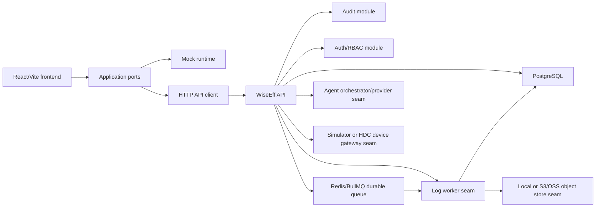

# WiseEff Architecture

WiseEff is organized as a React frontend plus a TypeScript backend foundation. The product direction is a modular monolith API, PostgreSQL persistence, async workers, an isolated device gateway, and a governed Agent layer. The detailed architecture lives in `docs/design-docs/`; this file is the high-level map.

Current baseline: M0-M6.2 productization work is in progress. The system has working mock/API frontend runtimes, a modular API, PostgreSQL migrations, OpenAPI contract artifact/check, OIDC-capable production auth boundary, backend user-governance APIs, worker/object-store seams, HDC gateway seam, live Agent provider seam, and an admin-gated M5 pilot-readiness endpoint. It is ready for controlled staging/pilot evidence collection, not broad enterprise production rollout.

## Runtime Shape

## Frontend Boundaries

- `src/app/`: routes, permissions, navigation, and application shell.
- `src/domain/`: domain types and pure rules.
- `src/application/ports/`: business-facing seams used by UI code.
- `src/infrastructure/mock/`: local demo/test implementations.
- `src/infrastructure/http/`: API client, DTO mapping, runtime mode.
- `src/components/` and page files: user-facing UI.

Rules:

- Page components should render state and call ports, not own durable business rules.
- Domain rules should be pure and tested.
- Mock and API implementations should satisfy the same port shape where practical.
- Production behavior must not depend on mock runtime data.

## Backend Boundaries

- `server/app.ts`: API server composition.
- `server/shared/http/`: minimal HTTP router, errors, server adapter.
- `server/shared/database/`: database client and migration runner.
- `server/modules/auth/`: current user context, roles, and permissions.
- `server/modules/users/`: durable backend user-governance routes, role replacement, activation, and audit.
- `server/modules/audit/`: audit write/query boundary.
- `server/modules/parameters/`: M1 parameter workflow routes and services.
- `server/modules/logs/`: M2 log upload, analysis records, object storage, and worker boundary.
- `server/modules/debugging/`: M3 simulator/HDC gateway boundary and debugging routes.
- `server/modules/agent/`: M4 Agent sessions, tools, approvals, and provider boundary.
- `server/modules/operations/`: liveness, readiness, and pilot readiness checks for release operations.
- `server/migrations/`: SQL schema baseline.

The backend remains a modular monolith. New modules should keep auth, audit, database, object-store, worker, device, and Agent provider boundaries explicit instead of dissolving them into page or route logic.

## Data And Governance

PostgreSQL is the source of truth. The current generated schema summary is `docs/generated/db-schema.md`; executable migrations live in `server/migrations/`.

All production write paths should follow this pattern:

1. Authenticate the user.
2. Authorize the action server-side.
3. Validate input at the boundary.
4. Execute the domain write in a transaction.
5. Write audit evidence with the same request trace.
6. Return a structured response or structured error.

Agent and device workflows are higher-risk variants of the same pattern. Agent write tools create approval records before execution. Device writes require device state checks, range checks, snapshots, and audit.

Release operations add a pilot gate on top of the basic health checks. `GET /api/v1/operations/pilot-readiness` is admin-gated and aggregates the route contract, auth, database, object storage, worker, device gateway, agent provider, and backup/restore evidence into a single `pilot_ready` or `blocked` result. The companion `npm run smoke:m5` check requires a live API URL by default and only skips with `M5_SMOKE_ALLOW_NO_API=true` for local documentation runs. Target-environment identity evidence must use OIDC/JWKS tokens, not static local HMAC smoke tokens.

## Self-Hosted Runtime

M6.1 adds a single-Linux-server self-hosted baseline under `ops/self-hosted/`. It runs PostgreSQL, API, web, worker, and Caddy reverse proxy as separate services. The API defaults to `HOST=127.0.0.1` for local development; self-hosted containers set `HOST=0.0.0.0` so the proxy can reach the API over the compose network. The API container sets `LOG_WORKER_ENABLED=false`, while the dedicated worker container runs `npm run worker:logs`.

M6.2 adds the OIDC-capable identity boundary and durable backend user-governance API surface. Target self-hosted deployments should use `AUTH_PROVIDER=oidc` with issuer, audience, and JWKS discovery. Target-environment OIDC evidence remains required before production identity debt can close.

M6.3 keeps object storage self-hosted by targeting an S3-compatible contract rather than a cloud account. The readiness seam now performs bucket and probe-object write/read/head/delete checks, and backup/restore drills generate redacted evidence for PostgreSQL, object storage, isolated restore targets, and conditional Redis status.

M6.4 adds Redis/BullMQ as the durable log-analysis dispatch transport. PostgreSQL remains the source of truth for job state, leases, retries, dead-letter metadata, audit, and evidence. API processes enqueue `log-analysis` messages after the PostgreSQL job is committed; worker processes consume queue payloads by `jobId` and must claim the PostgreSQL job before writing progress or terminal state. Database polling mode remains available for local development and compensation.

The M6.1-M6.4 baseline is deployment plumbing plus identity, storage, and queue hardening, not full production hardening. Target OIDC evidence, completed self-hosted restore evidence, target Redis/BullMQ queue evidence, observability, release rollback, and capacity gates remain open until their target evidence is recorded.

## Deeper Docs

- Full system design: `docs/design-docs/full-stack-architecture.md`
- Domain model: `docs/design-docs/domain-model.md`
- API contract: `docs/design-docs/api-contract.md`
- Frontend guidance: `docs/FRONTEND.md`
- Developer setup: `docs/developer/README.md`
- API usage: `docs/api/README.md`
- Security and governance: `docs/SECURITY.md`
- Security audit docs: `docs/security/README.md`
- Reliability and operations: `docs/RELIABILITY.md`
- Runbooks: `docs/runbooks/README.md`
- Product specs: `docs/product-specs/index.md`
- Execution plans: `docs/PLANS.md`
- Chinese developer architecture guide: `docs/zh-CN/architecture.md`
