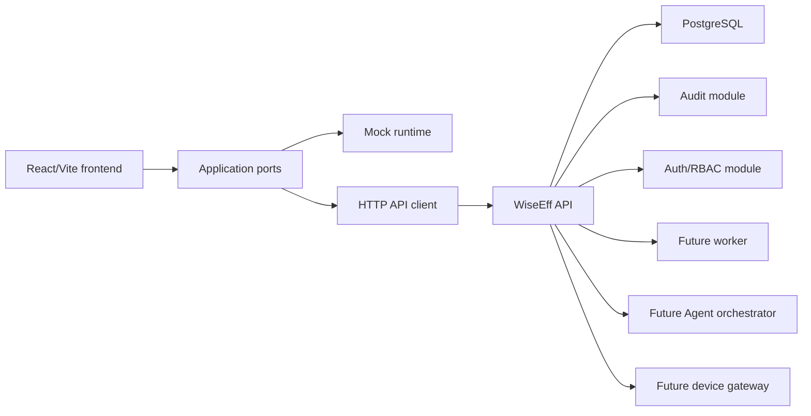

# WiseEff Architecture

WiseEff is organized as a React frontend plus a TypeScript backend foundation. The product direction is a modular monolith API, PostgreSQL persistence, async workers, an isolated device gateway, and a governed Agent layer. The detailed architecture lives in `docs/design-docs/`; this file is the high-level map.

## Runtime Shape

## Frontend Boundaries

- `src/app/`: routes, permissions, navigation, and application shell.
- `src/domain/`: domain types and pure rules.
- `src/application/ports/`: business-facing seams used by UI code.
- `src/infrastructure/mock/`: local demo/test implementations.
- `src/infrastructure/http/`: API client, DTO mapping, runtime mode.
- `src/components/` and page files: user-facing UI.

Rules:

- Page components should render state and call ports, not own durable business rules.
- Domain rules should be pure and tested.
- Mock and API implementations should satisfy the same port shape where practical.
- Production behavior must not depend on mock runtime data.

## Backend Boundaries

- `server/app.ts`: API server composition.
- `server/shared/http/`: minimal HTTP router, errors, server adapter.
- `server/shared/database/`: database client and migration runner.
- `server/modules/auth/`: current user context, roles, and permissions.
- `server/modules/audit/`: audit write/query boundary.
- `server/modules/operations/`: liveness, readiness, and pilot readiness checks for release operations.
- `server/migrations/`: SQL schema baseline.

M0 intentionally keeps the backend small. M1+ should add modules without dissolving auth, audit, and database boundaries.

## Data And Governance

PostgreSQL is the planned source of truth. The current generated schema summary is `docs/generated/db-schema.md`; the executable migration is `server/migrations/0001_m0_foundation.sql`.

All production write paths should follow this pattern:

1. Authenticate the user.
2. Authorize the action server-side.
3. Validate input at the boundary.
4. Execute the domain write in a transaction.
5. Write audit evidence with the same request trace.
6. Return a structured response or structured error.

Agent and device workflows are higher-risk variants of the same pattern. Agent write tools create approval records before execution. Device writes require device state checks, range checks, snapshots, and audit.

Release operations add a pilot gate on top of the basic health checks. `GET /api/v1/operations/pilot-readiness` is admin-gated and aggregates the route contract, auth, database, object storage, worker, device gateway, agent provider, and backup/restore evidence into a single `pilot_ready` or `blocked` result. The companion `npm run smoke:m5` check requires a live API URL by default and only skips with `M5_SMOKE_ALLOW_NO_API=true` for local documentation runs.

## Deeper Docs

- Full system design: `docs/design-docs/full-stack-architecture.md`
- Domain model: `docs/design-docs/domain-model.md`
- API contract: `docs/design-docs/api-contract.md`
- Frontend guidance: `docs/FRONTEND.md`
- Security and governance: `docs/SECURITY.md`
- Reliability and operations: `docs/RELIABILITY.md`
- Product specs: `docs/product-specs/index.md`
- Execution plans: `docs/PLANS.md`
