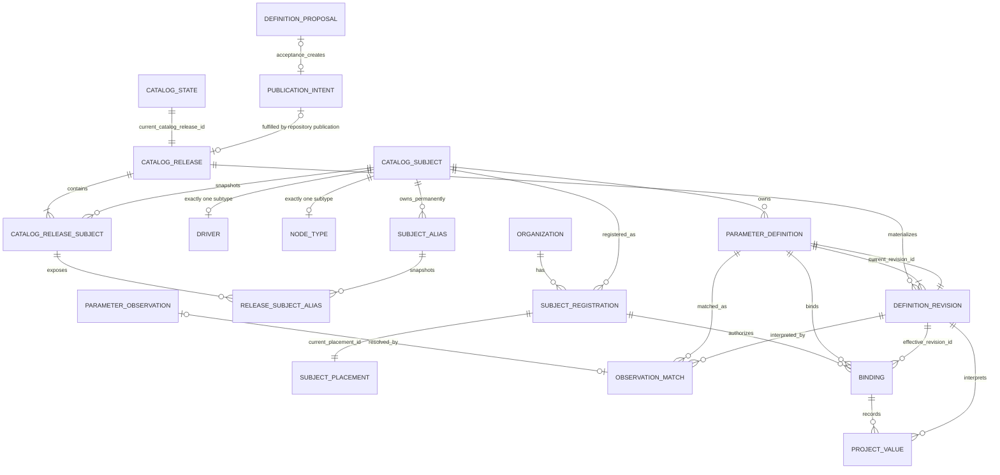

# ADR-0040: The canonical parameter catalog separates stable identity from release-scoped state

> Chinese companion: [中文决策记录](../zh-CN/design-docs/adr-0040-canonical-parameter-catalog-relational-model.md)

Date: 2026-08-31

## Status

Accepted for the replacement architecture described by [Wayfinder: replace the parameter catalog with one canonical definition model](https://github.com/tzrea1-Q/WiseEff/issues/668). This is a target-model decision, not a claim that the current operational schema has already been cut over.

This record remains ADR-0040. The publication decision in [Issue #674](https://github.com/tzrea1-Q/WiseEff/issues/674) is ADR-0041, and the registration/placement decision in [Issue #675](https://github.com/tzrea1-Q/WiseEff/issues/675) remains ADR-0042. Where those records conflict with this correction, they must be read and renumbered consistently with this sequence.

## Context

The current catalog spreads one property contract across `parameter_specs`, `parameter_spec_versions`, attribution subjects, schema roots/properties, organization overlays, placements, review rows, bindings, and duplicated lifecycle/current flags. That shape can make an organization override, an unmatched DTS occurrence, a proposal, or a historical row look like a second current definition.

[Issue #669](https://github.com/tzrea1-Q/WiseEff/issues/669) established the compatibility duties. [Issue #670](https://github.com/tzrea1-Q/WiseEff/issues/670) established that legacy rows must be classified by their complete relational graph and that R6/R7/R8 evidence cannot become a current definition by name or property key. ADR-0041 establishes an immutable repository Catalog Release as the sole publication input. ADR-0042 establishes one durable Organization registration and exactly one retained placement for each registered formal subject.

The remaining model must have one materialization authority, stable identities, immutable and complete revision history, release-scoped lifecycle truth, and database-enforced aggregate closure. In particular, proposal acceptance must not create a second path to `ParameterDefinition` or `DefinitionRevision`; CatalogSubject lifecycle must not drift from release history; and “exactly one placement” must mean exactly one at transaction commit for both active and retired registrations.

## Decision

### Authority and aggregate boundaries

- A **Catalog Release** is an immutable, repository-reviewed publication containing a complete as-of membership snapshot for every previously published formal subject and alias, plus definition content.
- The **Catalog Release synchronizer** is the only steady-state writer allowed to materialize `CatalogSubject`, release membership, `ParameterDefinition`, or `DefinitionRevision` rows and atomically advance the current-release and definition heads. PostgreSQL is its projection, not an authoring source.
- A **Definition Proposal** is governed change intent. Acceptance may approve or create a Platform catalog publication intent or repository change, but it cannot insert, update, retire, or otherwise materialize a definition or revision. The proposal service therefore cannot become a second materializer.
- A **Catalog Subject** is the Platform-owned permanent identity and is exactly one `Driver` or one `NodeType`. Its root stores no independent active/retired flag.
- A **Catalog Release Subject** is the immutable membership of that identity in one release. It alone supplies the subject lifecycle, selector snapshot, and tombstone provenance for that release.
- A **Parameter Definition** is the stable identity of one subject/property contract. A **Definition Revision** is an immutable snapshot of all persisted definition content.
- An **Organization Subject Registration** is one Organization's durable declaration that it uses one formal subject. It is `active | retired` and always owns exactly one retained **Subject Placement**.
- A **Parameter Observation** is immutable source evidence. A **Binding** is the stable project/logical-node association with one registered definition. A **Project Value** is an immutable value fact under that Binding. None of these objects owns or materializes catalog truth.

Proposal, catalog publication, synchronization, registration/placement, matching, binding, and project-value mutation are separate transaction boundaries. A caller may orchestrate them, but it cannot bypass the owning aggregate or share an uncommitted catalog write across those boundaries.

### Relationship diagram



The subtype cardinality is exclusive: a subject has one Driver row xor one NodeType row. `CATALOG_STATE` names one current immutable release; subject and alias state are derived only from that release's membership. The two `PARAMETER_DEFINITION` → `DEFINITION_REVISION` edges distinguish immutable history from the non-null current-head pointer. The diagram intentionally contains no mutable status on `CATALOG_SUBJECT`, no Proposal → Definition materialization edge, and no Placement → Binding identity edge.

### Canonical terminology

| Term                    | Exact meaning and boundary                                                                                                                                                                                           |
| ----------------------- | -------------------------------------------------------------------------------------------------------------------------------------------------------------------------------------------------------------------- |
| `CatalogSubject`        | Stable Platform identity with permanent kind and canonical key. Current or historical lifecycle is never stored on this root; it is read from a CatalogReleaseSubject.                                               |
| `CatalogReleaseSubject` | Immutable as-of membership connecting one Catalog Release and one CatalogSubject, with active/retired lifecycle plus selector or tombstone provenance.                                                               |
| `SubjectAlias`          | Permanent ownership of one normalized external selector by one CatalogSubject. Whether that alias is active or retired is an immutable per-release membership fact.                                                  |
| `Driver`                | CatalogSubject subtype selected by the authoritative `compatible` matcher and carrying Driver-only nature/cardinality facts.                                                                                         |
| `NodeType`              | CatalogSubject subtype selected by the formal normalized-node-name matcher only when no Driver matches. It is not an observed module label or weak Driver.                                                           |
| `ParameterDefinition`   | Stable opaque identity for one permanent `(subject_id, property_key)` catalog key. It contains identity and the current-revision pointer, not mutable definition content.                                            |
| `DefinitionRevision`    | Immutable snapshot of every persisted definition-content field, including documentation, units, constraints, defaults, lifecycle content, and matching/interpretation metadata.                                      |
| `DefinitionProposal`    | Reviewable Platform catalog change intent. Acceptance produces or approves publication intent/repository change only; it never materializes catalog rows.                                                            |
| `ParameterObservation`  | Immutable project/source evidence that may be matched or sent to review. It never becomes a definition.                                                                                                              |
| `SubjectRegistration`   | One durable `(organization_id, subject_id)` identity whose lifecycle is active or retired; it references exactly one retained current placement in every lifecycle state.                                            |
| `SubjectPlacement`      | The single stable taxonomy node owned by one registration. Rename/reparent updates this retained identity; it is not observed usage and is not Binding identity.                                                     |
| `Binding`               | Stable association between one project logical node, one Organization registration, and one ParameterDefinition. Its `effective_revision_id` controls the contract for new values until a governed semantic cutover. |
| `ProjectValue`          | Immutable value/source/config fact under one Binding that pins the exact DefinitionRevision used to validate and interpret it.                                                                                       |

These definitions intentionally match ADR-0042: formal subject, registration, authoritative placement, observed usage, Binding, and value are separate facts. “Registration” never means a catalog subject, module, observation, or project-specific use. “Placement” never means an occurrence or Binding.

### Logical relational responsibilities and keys

Physical names may change in the implementation specification only if these ownership and constraint semantics remain explicit.

| Relation                                                   | Responsibility and minimum keys                                                                                                                                                                                                                                                                                                                                              |
| ---------------------------------------------------------- | ---------------------------------------------------------------------------------------------------------------------------------------------------------------------------------------------------------------------------------------------------------------------------------------------------------------------------------------------------------------------------- |
| `catalog_releases`                                         | Immutable `id`, unique version/digest, and predecessor release FK. Releases are never updated or deleted.                                                                                                                                                                                                                                                                    |
| `catalog_state`                                            | Singleton non-null `current_catalog_release_id` FK. It is the only current-release pointer and is switched only after the complete target release projection verifies.                                                                                                                                                                                                       |
| `catalog_subjects`                                         | Stable Platform root: opaque `id`, immutable `kind`, permanent canonical key. `UNIQUE (kind, canonical_key)` across all history; no `organization_id` and no lifecycle/current-selector fields.                                                                                                                                                                              |
| `catalog_release_subjects`                                 | Immutable release membership: `release_id`, `subject_id`, `lifecycle` (`active` or `retired`), selector snapshot/provenance, and explicit tombstone provenance when retired. `PRIMARY KEY (release_id, subject_id)` plus owner FKs to both roots; all deletes are restricted.                                                                                                |
| `catalog_drivers` / `catalog_node_types`                   | Disjoint stable subtype identity with exactly one row matching `catalog_subjects.kind`. Mutable selector/matcher snapshots live in release membership, not as independent current subtype state.                                                                                                                                                                             |
| `catalog_subject_aliases`                                  | Permanent alias ownership: opaque `id`, `subject_id`, selector kind, normalized selector. `UNIQUE (selector_kind, normalized_selector)` across all history and `UNIQUE (id, subject_id)`; subject FK and restricted deletion prevent reassignment.                                                                                                                           |
| `catalog_release_subject_aliases`                          | Immutable per-release alias state/provenance. `PRIMARY KEY (release_id, alias_id)`; composite FKs `(release_id, subject_id)` → release subject and `(alias_id, subject_id)` → stable alias prove the same owner. Rows are delete-restricted; current lookup joins through `catalog_state.current_catalog_release_id`. Active/retired rows use explicit tombstone provenance. |
| `parameter_definitions`                                    | Opaque stable `id`, `subject_id`, normalized `property_key`, non-null `current_revision_id`. Permanent `UNIQUE (subject_id, property_key)` plus `UNIQUE (id, subject_id)` for ownership FKs. No organization, module, proposal, observation, or mutable content columns.                                                                                                     |
| `definition_revisions`                                     | Opaque `id`, `definition_id`, monotonic display `revision_number`, release provenance/digest, and the complete immutable content snapshot. `UNIQUE (definition_id, revision_number)` and `UNIQUE (definition_id, id)`. No `current` flag.                                                                                                                                    |
| `definition_proposals` / publication intents               | Proposal identity, proposed change, exact base release/revision where applicable, review/audit state, and accepted publication-intent or repository-change reference. There is no accepted-revision field written by proposal acceptance.                                                                                                                                    |
| DTS occurrence relations / `parameter_observation_matches` | Immutable observation provenance and at most one accepted match per occurrence. A match pins definition, revision, registration, Binding, matcher revision, and Catalog Release digest. Absence means unrecognized; ambiguity remains review evidence.                                                                                                                       |
| `organization_subject_registrations`                       | Opaque `id`, `organization_id`, `subject_id`, `status`, origin/proof, non-null `current_placement_id`. Permanent `UNIQUE (organization_id, subject_id)` and organization-inclusive candidate keys.                                                                                                                                                                           |
| `subject_placements`                                       | Opaque stable `id`, `registration_id`, same-Organization taxonomy module, origin. `UNIQUE (registration_id)` makes the retained placement the only placement row; `UNIQUE (organization_id, module_id)` prevents two registered subjects from owning one placement module.                                                                                                   |
| `project_parameter_bindings`                               | Opaque stable `id`, organization/project/logical-node identity, `registration_id`, `subject_id`, `definition_id`, non-null `effective_revision_id`, and explicit `current_value_id`. `UNIQUE (project_id, logical_node_id, definition_id)`. No `module_id`.                                                                                                                  |
| project-value rows                                         | Immutable value/source/config facts with opaque `id`, `binding_id`, `definition_id`, and exact `definition_revision_id`. A binding has an explicit current-value pointer; readers never infer a tip by maximum number or time.                                                                                                                                               |
| typed legacy-ID maps / archive ledger                      | Each retained externally referenced legacy ID maps once to the same-kind stable target, or to immutable archive evidence when identity cannot be proved.                                                                                                                                                                                                                     |

Tombstone is provenance, not a separately addressable identity: `catalog_release_subjects.tombstone_provenance` is required exactly when subject lifecycle is retired, and `catalog_release_subject_aliases.tombstone_provenance` follows the same rule for alias retirement. Keeping it on the immutable membership row makes lifecycle and its withdrawal evidence inseparable.

### Release-scoped subject lifecycle, replay, and stable IDs

- All domain IDs are opaque generated values. Natural keys, content digests, paths, and hashes are not entity IDs.
- `catalog_subjects` has no current lifecycle flag. Current subject state is the unique `catalog_state.current_catalog_release_id` → `catalog_release_subjects` result for that subject.
- Every release is a complete as-of membership snapshot for all subjects and aliases known to its predecessor. A subject or alias missing from a successor release is invalid, not retired. Retirement is an explicit `retired` membership with non-null tombstone provenance.
- Restore is a later release membership marked `active` for the same subject ID. The stable `(kind, canonical_key)` and alias ownership are never reallocated, even while retired.
- Historical replay reads `catalog_release_subjects` and `catalog_release_subject_aliases` for the pinned release ID. It never joins through `catalog_state` and never applies current lifecycle or aliases. Absence from a release that predates first publication means “not yet published,” not retired.
- `(subject_id, property_key)` is permanent across retirement. Retirement cannot release the key for reuse or create a second definition identity.
- `parameter_definitions.current_revision_id` is the only definition-head truth. A non-null, deferrable composite FK proves that the referenced revision belongs to the same definition. Revision number and timestamps are display/order facts, never head-selection rules.
- Every persisted change to definition content creates a new immutable DefinitionRevision, including documentation-only corrections. Existing revision rows are never updated or deleted.
- The synchronizer derives the new revision exclusively from a published immutable Catalog Release and advances the definition head in the same transaction. Replaying the same release digest is a verified no-op.
- A documentation-only revision advances the definition head but requires no Binding `effective_revision_id` or ProjectValue cutover. The latest catalog documentation may be shown from the definition head, while existing Binding validation and ProjectValue interpretation remain pinned to their prior compatible revisions.
- A semantic or matching-incompatible revision may require a separate governed Binding cutover before new values use it. That cutover never rewrites historical ProjectValues; each remains pinned to its original revision.
- A subject whose current release membership is retired is excluded from new matching and registration, but its stable root, definitions, current revision, registrations, placement, Bindings, observations, values, aliases, release memberships, and audit remain. Restore reuses the same identity in a later release.

### Exactly-one retained placement

`UNIQUE (registration_id)` alone proves only “at most one.” The target also stores `organization_subject_registrations.current_placement_id NOT NULL` and uses a deferred composite FK back to `(registration_id, id)` on `subject_placements`. Together they prove at commit that:

1. every registration points to an existing placement belonging to that same registration;
2. every registration owns at most one placement row; therefore it owns exactly one;
3. there is no independent `is_current` flag that could disagree with the pointer; and
4. the invariant applies unchanged to both `active` and `retired` registrations.

Registration creation inserts the registration and its initial placement in one transaction with constraints deferred. Rename/reparent updates the same placement ID. Retirement never nulls the pointer or deletes the placement. A placement move changes taxonomy projection for all inherited definitions but does not change Definition, Binding, Observation, or ProjectValue identity.

### Constraint-level PostgreSQL sketch

This is a normative constraint sketch, not a migration. An implementation may choose other physical names only with equivalent PostgreSQL proof.

```sql
CREATE TABLE catalog_releases (
  id uuid PRIMARY KEY,
  release_version text NOT NULL UNIQUE,
  release_digest text NOT NULL UNIQUE,
  predecessor_release_id uuid REFERENCES catalog_releases(id) ON DELETE RESTRICT
);

CREATE TABLE catalog_subjects (
  id uuid PRIMARY KEY,
  kind text NOT NULL CHECK (kind IN ('driver', 'node-type')),
  canonical_key text NOT NULL,
  UNIQUE (kind, canonical_key),
  UNIQUE (id, kind)
);

CREATE TABLE catalog_release_subjects (
  release_id uuid NOT NULL REFERENCES catalog_releases(id) ON DELETE RESTRICT,
  subject_id uuid NOT NULL REFERENCES catalog_subjects(id) ON DELETE RESTRICT,
  lifecycle text NOT NULL CHECK (lifecycle IN ('active', 'retired')),
  selector_snapshot jsonb NOT NULL,
  selector_provenance jsonb NOT NULL,
  tombstone_provenance jsonb,
  PRIMARY KEY (release_id, subject_id),
  CHECK (
    (lifecycle = 'active' AND tombstone_provenance IS NULL) OR
    (lifecycle = 'retired' AND tombstone_provenance IS NOT NULL)
  )
);

CREATE TABLE catalog_subject_aliases (
  id uuid PRIMARY KEY,
  subject_id uuid NOT NULL REFERENCES catalog_subjects(id) ON DELETE RESTRICT,
  selector_kind text NOT NULL,
  normalized_selector text NOT NULL,
  UNIQUE (selector_kind, normalized_selector),
  UNIQUE (id, subject_id)
);

CREATE TABLE catalog_release_subject_aliases (
  release_id uuid NOT NULL,
  subject_id uuid NOT NULL,
  alias_id uuid NOT NULL,
  lifecycle text NOT NULL CHECK (lifecycle IN ('active', 'retired')),
  selector_provenance jsonb NOT NULL,
  tombstone_provenance jsonb,
  PRIMARY KEY (release_id, alias_id),
  FOREIGN KEY (release_id, subject_id)
    REFERENCES catalog_release_subjects (release_id, subject_id)
    ON DELETE RESTRICT,
  FOREIGN KEY (alias_id, subject_id)
    REFERENCES catalog_subject_aliases (id, subject_id)
    ON DELETE RESTRICT,
  CHECK (
    (lifecycle = 'active' AND tombstone_provenance IS NULL) OR
    (lifecycle = 'retired' AND tombstone_provenance IS NOT NULL)
  )
);

CREATE TABLE catalog_state (
  singleton boolean PRIMARY KEY DEFAULT true CHECK (singleton),
  current_catalog_release_id uuid NOT NULL
    REFERENCES catalog_releases(id) ON DELETE RESTRICT
);

CREATE FUNCTION assert_catalog_release_membership_complete()
RETURNS trigger
LANGUAGE plpgsql
AS $$
BEGIN
  IF EXISTS (
    SELECT 1
    FROM catalog_releases AS target_release
    JOIN catalog_release_subjects AS predecessor_subject
      ON predecessor_subject.release_id = target_release.predecessor_release_id
    LEFT JOIN catalog_release_subjects AS target_subject
      ON target_subject.release_id = target_release.id
     AND target_subject.subject_id = predecessor_subject.subject_id
    WHERE target_release.id = NEW.current_catalog_release_id
      AND target_subject.subject_id IS NULL
  ) THEN
    RAISE EXCEPTION 'catalog release omits predecessor subject'
      USING ERRCODE = '23514';
  END IF;

  IF EXISTS (
    SELECT 1
    FROM catalog_releases AS target_release
    JOIN catalog_release_subject_aliases AS predecessor_alias
      ON predecessor_alias.release_id = target_release.predecessor_release_id
    LEFT JOIN catalog_release_subject_aliases AS target_alias
      ON target_alias.release_id = target_release.id
     AND target_alias.alias_id = predecessor_alias.alias_id
    WHERE target_release.id = NEW.current_catalog_release_id
      AND target_alias.alias_id IS NULL
  ) THEN
    RAISE EXCEPTION 'catalog release omits predecessor alias'
      USING ERRCODE = '23514';
  END IF;

  IF EXISTS (
    SELECT 1
    FROM catalog_release_subject_aliases AS release_alias
    JOIN catalog_release_subjects AS release_subject
      ON (release_subject.release_id, release_subject.subject_id) =
         (release_alias.release_id, release_alias.subject_id)
    WHERE release_alias.release_id = NEW.current_catalog_release_id
      AND release_alias.lifecycle = 'active'
      AND release_subject.lifecycle <> 'active'
  ) THEN
    RAISE EXCEPTION 'active alias requires active subject membership'
      USING ERRCODE = '23514';
  END IF;

  RETURN NEW;
END;
$$;

CREATE CONSTRAINT TRIGGER catalog_state_membership_complete_ck
AFTER INSERT OR UPDATE OF current_catalog_release_id
ON catalog_state
DEFERRABLE INITIALLY DEFERRED
FOR EACH ROW EXECUTE FUNCTION assert_catalog_release_membership_complete();

CREATE TABLE parameter_definitions (
  id uuid PRIMARY KEY,
  subject_id uuid NOT NULL REFERENCES catalog_subjects(id) ON DELETE RESTRICT,
  property_key text NOT NULL,
  current_revision_id uuid NOT NULL,
  UNIQUE (subject_id, property_key),
  UNIQUE (id, subject_id)
);

CREATE TABLE definition_revisions (
  id uuid PRIMARY KEY,
  definition_id uuid NOT NULL REFERENCES parameter_definitions(id) ON DELETE RESTRICT,
  revision_number bigint NOT NULL CHECK (revision_number > 0),
  catalog_release_id uuid NOT NULL REFERENCES catalog_releases(id) ON DELETE RESTRICT,
  content_digest text NOT NULL,
  content jsonb NOT NULL,
  UNIQUE (definition_id, revision_number),
  UNIQUE (definition_id, id)
);

ALTER TABLE parameter_definitions
  ADD CONSTRAINT parameter_definition_current_revision_fk
  FOREIGN KEY (id, current_revision_id)
  REFERENCES definition_revisions (definition_id, id)
  ON DELETE RESTRICT
  DEFERRABLE INITIALLY DEFERRED;

CREATE TABLE organization_subject_registrations (
  id uuid PRIMARY KEY,
  organization_id uuid NOT NULL,
  subject_id uuid NOT NULL REFERENCES catalog_subjects(id) ON DELETE RESTRICT,
  status text NOT NULL CHECK (status IN ('active', 'retired')),
  current_placement_id uuid NOT NULL,
  UNIQUE (organization_id, subject_id),
  UNIQUE (id, organization_id),
  UNIQUE (id, organization_id, subject_id)
);

CREATE TABLE subject_placements (
  id uuid PRIMARY KEY,
  registration_id uuid NOT NULL,
  organization_id uuid NOT NULL,
  module_id uuid NOT NULL,
  origin text NOT NULL CHECK (origin IN ('auto', 'curated')),
  UNIQUE (registration_id),
  UNIQUE (registration_id, id),
  UNIQUE (organization_id, module_id),
  FOREIGN KEY (registration_id, organization_id)
    REFERENCES organization_subject_registrations (id, organization_id)
    ON DELETE RESTRICT,
  FOREIGN KEY (module_id, organization_id)
    REFERENCES parameter_modules (id, organization_id)
    ON DELETE RESTRICT
);

ALTER TABLE organization_subject_registrations
  ADD CONSTRAINT registration_current_placement_fk
  FOREIGN KEY (id, current_placement_id)
  REFERENCES subject_placements (registration_id, id)
  ON DELETE RESTRICT
  DEFERRABLE INITIALLY DEFERRED;

CREATE CONSTRAINT TRIGGER subject_placement_kind_ck
AFTER INSERT OR UPDATE OF registration_id, organization_id, module_id
ON subject_placements
DEFERRABLE INITIALLY DEFERRED
FOR EACH ROW EXECUTE FUNCTION assert_subject_placement_kind();

-- Current matching is anchored to exactly one release pointer.
SELECT rs.subject_id, rs.lifecycle, rs.selector_snapshot
FROM catalog_state AS state
JOIN catalog_release_subjects AS rs
  ON rs.release_id = state.current_catalog_release_id
WHERE state.singleton AND rs.subject_id = $1;

-- Current alias resolution uses the same release pointer and active memberships.
SELECT alias.subject_id, alias.selector_kind, alias.normalized_selector
FROM catalog_state AS state
JOIN catalog_release_subject_aliases AS release_alias
  ON release_alias.release_id = state.current_catalog_release_id
JOIN catalog_subject_aliases AS alias
  ON (alias.id, alias.subject_id) =
     (release_alias.alias_id, release_alias.subject_id)
JOIN catalog_release_subjects AS release_subject
  ON (release_subject.release_id, release_subject.subject_id) =
     (release_alias.release_id, release_alias.subject_id)
WHERE state.singleton
  AND release_alias.lifecycle = 'active'
  AND release_subject.lifecycle = 'active'
  AND alias.selector_kind = $1
  AND alias.normalized_selector = $2;

-- Historical replay bypasses catalog_state and uses its pinned release.
SELECT rs.subject_id, rs.lifecycle, rs.selector_snapshot
FROM catalog_release_subjects AS rs
WHERE rs.release_id = $1 AND rs.subject_id = $2;

SELECT alias.subject_id, alias.selector_kind, alias.normalized_selector,
       release_alias.lifecycle
FROM catalog_release_subject_aliases AS release_alias
JOIN catalog_subject_aliases AS alias
  ON (alias.id, alias.subject_id) =
     (release_alias.alias_id, release_alias.subject_id)
WHERE release_alias.release_id = $1 AND release_alias.alias_id = $2;
```

`assert_catalog_release_membership_complete()` validates the target release against its declared predecessor before the current pointer may commit. Every predecessor subject and stable alias must have exactly one target membership row; every retired row must carry tombstone provenance; alias ownership and subject lifecycle must agree; and no selector may collide with or be reassigned from a stable canonical key or alias owner. Omission therefore aborts the pointer switch and leaves the old release current. This completeness trigger validates immutable release relations; it does not add a current flag to them.

`assert_subject_placement_kind()` joins placement → registration → CatalogSubject and the same-Organization module. It raises a constraint violation unless Driver maps to `driver-group` and NodeType maps to `node-type`. A separate deferred constraint trigger enforces exactly one subtype row matching each subject kind if subtype tables are used. These triggers validate facts owned elsewhere; they do not duplicate kind or current-state columns.

Tenant-bearing Binding FKs follow the same pattern: `(registration_id, organization_id, subject_id)` references the registration candidate key; `(definition_id, subject_id)` references the definition candidate key; `(definition_id, effective_revision_id)` references the revision candidate key. ProjectValue and observation-match rows repeat enough owner keys for composite FKs to prove binding/definition/revision agreement.

Materialization authority is also enforced at the role boundary; catalog tables are owned by a non-login migration owner:

```sql
REVOKE INSERT, UPDATE, DELETE ON
  catalog_releases, catalog_state, catalog_subjects,
  catalog_drivers, catalog_node_types, catalog_release_subjects,
  catalog_subject_aliases, catalog_release_subject_aliases,
  parameter_definitions, definition_revisions
FROM PUBLIC, application_role, proposal_service_role;

GRANT INSERT ON
  catalog_releases, catalog_state, catalog_subjects,
  catalog_drivers, catalog_node_types, catalog_release_subjects,
  catalog_subject_aliases, catalog_release_subject_aliases,
  parameter_definitions, definition_revisions
TO catalog_synchronizer_role;

GRANT UPDATE (current_catalog_release_id) ON catalog_state
TO catalog_synchronizer_role;

GRANT UPDATE (current_revision_id) ON parameter_definitions
TO catalog_synchronizer_role;

REVOKE UPDATE, DELETE ON
  catalog_releases, catalog_subjects, catalog_drivers, catalog_node_types,
  catalog_release_subjects, catalog_subject_aliases,
  catalog_release_subject_aliases, definition_revisions
FROM PUBLIC, application_role, proposal_service_role, catalog_synchronizer_role;

GRANT SELECT ON
  catalog_releases, catalog_state, catalog_subjects,
  catalog_drivers, catalog_node_types, catalog_release_subjects,
  catalog_subject_aliases, catalog_release_subject_aliases,
  parameter_definitions, definition_revisions
TO application_role, proposal_service_role;
```

Proposal acceptance writes only proposal/publication-intent relations and trusted audit. The proposal role has no catalog-table mutation grant. Release membership, aliases, tombstone provenance, and DefinitionRevision rows are append-only. Only the synchronizer receives column-level grants to switch the current Catalog Release or Definition head; no ordinary role can manufacture current subject lifecycle.

### Database and transaction invariants

The database, not only HTTP writers, enforces the following:

1. A CatalogSubject is Platform-owned, kind-immutable, and has exactly one matching Driver xor NodeType subtype. It has no mutable lifecycle/current-selector state, and its permanent canonical key is never reassigned.
2. Each Catalog Release has exactly one immutable membership row per included subject and alias. Owner/composite FKs bind memberships to the same release and stable subject; release, membership, alias, and tombstone history use restricted deletion.
3. The release-completeness constraint rejects predecessor subject/alias omission and invalid tombstone transitions before `catalog_state.current_catalog_release_id` can switch. Current lifecycle and alias queries always anchor to that single pointer; historical replay never does.
4. Definition identity is permanently unique by subject/property. Every definition has one non-null head belonging to itself; every revision is immutable and belongs to one release.
5. Only the Catalog Release synchronizer role may insert catalog roots, memberships, aliases, revisions, or advance heads. Proposal, observation, registration, binding, project-value, HTTP, Agent, and ordinary application roles cannot.
6. Registration and placement satisfy exactly one retained placement at commit in both lifecycle states. Placement is same-Organization and kind-correct.
7. Composite FKs prove definition/revision, registration/subject/organization, Binding/definition/registration/effective revision, ProjectValue/binding/revision, and observation-match agreement. Cross-Organization references cannot accidentally satisfy a key.
8. Unknown or ambiguous evidence has no accepted match and cannot create a definition, revision, Binding, or ProjectValue. A uniquely proven active subject may create registration/placement without proving a property, as ADR-0042 specifies.
9. Subject, definition, revision, registration, placement, Binding, ProjectValue, match, legacy map, release, and audit history use restricted deletion. Domain retirement is never cascade deletion.

Transaction ownership is:

- **Accept Proposal:** lock and resolve the proposal, record the approved publication intent or repository-change reference, and commit trusted audit. The transaction performs zero catalog materialization.
- **Synchronize Catalog Release:** take the exclusive release lock; verify the immutable release and lineage; stage stable subject/alias roots, complete subject/alias release memberships, selector/tombstone provenance, and definitions; create one revision for every changed persisted definition snapshot, including documentation-only changes; run predecessor-completeness and ownership checks; then advance definition heads and `current_catalog_release_id` atomically with materialization evidence/audit. Any omission or invalid transition aborts the transaction and leaves the old pointer visible. Same verified digest is a read-only no-op.
- **Register and place:** lock `(organization, subject)` and destination taxonomy keys; insert/reuse the one registration and its one placement under deferred constraints; audit; commit all or none. Retirement/restore preserves both IDs and the non-null pointer.
- **Recognize and bind:** read subject and alias state through one captured `current_catalog_release_id`; only an active release membership may match. Pin observation, matcher revision, that Catalog Release, exact definition/revision, registration, and Binding. It may call the registration aggregate only after a unique formal-subject proof, but it never materializes catalog identity or definition content.
- **Cut over Binding revision:** compare-and-swap `effective_revision_id`, validate compatibility and current Catalog Release, and append audit/history. Documentation-only revisions skip this transaction. Semantic cutover never changes prior ProjectValues.
- **Change Project Value:** lock Binding/current-value head, validate against its effective revision, append one immutable ProjectValue, advance the explicit value pointer, and audit atomically.
- **Move Placement:** lock registration plus source/destination taxonomy keys, update the retained placement ID in place, and audit atomically. Binding rows never move.

### Where Driver and NodeType differ

The difference is confined to three layers:

1. **Catalog subtype:** Driver owns compatible selectors and Driver-only nature/cardinality; NodeType owns its formal normalized-node-name selector.
2. **Matcher:** unique Driver `compatible` match wins; NodeType is the fallback only when no Driver matches. The results are never unioned.
3. **Placement validation:** Driver registration uses a `driver-group` module; NodeType registration uses a `node-type` module, with ADR-0042's allowed taxonomy parents.

Definition, DefinitionRevision, Proposal, publication intent, stable ID, registration lifecycle, Binding, ProjectValue, audit, and revision policy use one shared model for both subject kinds. A Driver/NodeType branch in definition content storage, revisioning, proposal materialization, Binding identity, or ProjectValue storage is therefore misplaced.

## Required PostgreSQL acceptance scenarios

The implementation specification must run these against real PostgreSQL, not an in-memory substitute. Constraint cases must force `SET CONSTRAINTS ALL IMMEDIATE` or `COMMIT`; concurrency cases use independent sessions.

| Area                  | Required scenario and expected result                                                                                                                                                                                         |
| --------------------- | ----------------------------------------------------------------------------------------------------------------------------------------------------------------------------------------------------------------------------- |
| Materializer          | `proposal_service_role` accepts a Proposal and writes intent/audit, while INSERT/UPDATE against Definition or Revision is denied and catalog row counts do not change.                                                        |
| Materializer          | `catalog_synchronizer_role` materializes a published release atomically; failure before head switch leaves all previous heads/current release unchanged.                                                                      |
| Idempotency           | Replaying the same verified release digest creates no rows and changes no heads; reusing a release version/digest with different normalized content fails closed.                                                             |
| Subject lifecycle     | Release A marks one subject active; release B explicitly marks it retired with tombstone provenance. After the pointer switch, new matching/registration is blocked while the stable subject ID and history remain.           |
| Omission              | A successor that omits any predecessor subject or stable alias fails the completeness constraint and cannot become current; absence is never interpreted as retirement.                                                       |
| Restore               | Release C marks the retired subject active again using the same subject ID, kind, canonical key, definitions, and stable alias owners. Attempts to allocate that canonical key to another subject fail.                       |
| Historical replay     | Replay pinned to release A reads A's active membership and aliases after release B/C become current; it never observes the current retired/restored state.                                                                    |
| Atomic visibility     | Concurrent readers spanning a current-pointer switch observe a complete release A or complete release B snapshot when they anchor all catalog reads to the captured pointer; no mixed subject/alias state is visible.         |
| Membership uniqueness | A second `catalog_release_subjects` row for the same `(release_id, subject_id)` and a second release-alias row for the same `(release_id, alias_id)` are rejected by database keys.                                           |
| Alias ownership       | A release alias whose subject differs from its stable owner, an alias omitted without explicit retirement, or reuse of one normalized selector for a different subject is rejected; current lookup uses current membership.   |
| Revision              | Initial Definition + first Revision + non-null head commits under deferred FK; a head naming another Definition's revision fails at commit.                                                                                   |
| Revision              | Every content delta—shape, constraint, unit, default, lifecycle content, matching metadata, or documentation—creates a new immutable Revision and advances the head. In-place Revision UPDATE/DELETE fails.                   |
| Documentation         | A documentation-only release creates a Revision and advances Definition head while Binding `effective_revision_id`, Binding count/IDs, current ProjectValue, and all historical ProjectValues remain byte-for-byte unchanged. |
| Semantic cutover      | A semantic revision leaves historical ProjectValues pinned; governed Binding cutover advances only `effective_revision_id` and audit/history, and stale compare-and-swap loses without partial writes.                        |
| Placement creation    | Registration plus one owned Placement commits in either insert order with constraints deferred. The same test passes for `active` and `retired`.                                                                              |
| Placement lower bound | Registration without Placement, or with a null/missing `current_placement_id`, fails no later than constraint check/commit for both lifecycle states.                                                                         |
| Placement ownership   | A Registration pointer to another Registration's Placement fails the composite FK.                                                                                                                                            |
| Placement upper bound | A second Placement for one Registration fails `UNIQUE (registration_id)` even if no row carries a current flag.                                                                                                               |
| Placement retention   | Deleting the retained Placement, retiring while deleting it, or clearing/changing the pointer without an owned replacement fails atomically. Restore preserves both IDs.                                                      |
| Placement move        | Rename/reparent updates the same Placement ID and leaves Definition, Binding, Observation, and ProjectValue rows unchanged; destination conflict rolls back move and audit together.                                          |
| Tenant isolation      | Cross-Organization registration/module, Binding/registration, or ProjectValue/Binding combinations fail composite FKs.                                                                                                        |
| Subject kind          | Missing subtype, both subtypes, mismatched subtype, Driver→`node-type` placement, and NodeType→`driver-group` placement all fail deferred constraint checks.                                                                  |
| Matching boundary     | Unknown/ambiguous evidence creates only observation/review evidence. Unique subject but unknown property may create registration/placement, but creates no match, Binding, Definition, or Revision.                           |
| Binding agreement     | A Binding whose Definition belongs to another subject, whose registration belongs to another subject/Organization, or whose effective revision belongs to another Definition fails.                                           |
| Concurrency           | Concurrent first registration produces one stable Registration and one retained Placement; concurrent release synchronization or revision-head advancement produces one deterministic winner/no-op and no split head.         |

## Consequences

### G0.1 closed subtype and identity addendum

The 2026-09-02 owner-authorized G0.1 correction closes values that this ADR previously left descriptive. `Driver.nature` is exactly `physical-device | logical-service`; `Driver.instance_cardinality` is exactly `multiple | singleton-per-project`. NodeType has no family field or family enum.

Canonical compatible, node-name, and property-key values are validation-only identities: an accepted value is stored byte-for-byte, with no trim, case conversion, NFC/NFKC or other Unicode normalization, quote removal, or `@`/unit-address removal. All three reject empty, non-ASCII, ASCII whitespace/control/DEL, and matching-quoted raw tokens. Compatible uses `^[A-Za-z0-9][A-Za-z0-9+._/-]*(?:,[A-Za-z0-9][A-Za-z0-9+._/-]*)?$` and forbids wildcard. Node name accepts `/` or `^[A-Za-z][A-Za-z0-9,._+-]{0,30}$`, with `@` rejected as unit-address presence. Property key uses `^[A-Za-z0-9,._+?#-]{1,31}$` and rejects the ASCII-case-insensitive structural set `compatible`, `device_type`, `gpio-controller`, `interrupt-controller`, `linux,phandle`, `phandle`, `ranges`, `reg`, `status`, `#address-cells`, `#gpio-cells`, `#interrupt-cells`, `#size-cells`, plus every `#` prefix. Failure classification is ordered and closed exactly as the active #668 specification states.

Canonical/alias ownership compares selector kind and accepted bytes exactly. An identical repeated claim by the same owner is idempotent; a same-key/different-owner or canonical/alias collision is a typed conflict. S0-ID alone owns the constructors and the exact closed union `not-string | empty | control-character | non-ascii | surrounding-whitespace | whitespace-forbidden | quoted-source-token | wildcard-forbidden | unit-address-present | length-out-of-range | invalid-syntax | structural-property`; S1 bundle validation, S2 constraints, compiler, synchronizer, matcher, and migration consume them without reimplementing normalization. Deterministic reason precedence and golden vectors live in the active #668 implementation specification.

- The catalog synchronizer becomes a deep module: publication validation, immutable revision creation, stable-head advancement, permission boundary, and release verification live behind one seam rather than being repeated in proposal, ingest, startup, or review services.
- Stable CatalogSubject and alias roots never answer current lifecycle questions by themselves. The synchronizer hides complete release membership validation and exposes one current-release-anchored read model plus exact-release replay.
- Organizations cannot author structural truth. Registration/placement, observations, Bindings, and ProjectValues evolve independently without copying definitions.
- Documentation history is complete because it follows the same immutable revision rule, while avoiding unnecessary Binding/value cutovers.
- Circular non-null heads require deferred constraints and transaction tests, but eliminate zero-head and zero-placement states that application checks cannot prove under concurrency.
- Existing organization overlays, proposal-to-definition writers, lazy ingest materialization, duplicated current flags, and Driver-only placement paths are migration inputs to retire, never destination contracts.
- This ADR contains no production code, migration, API, UI, or implementation ticket. Later specifications may deepen module interfaces and physical names but may not weaken the single materializer, immutable revision, exact-one placement, stable-ID, or aggregate-boundary decisions above.
