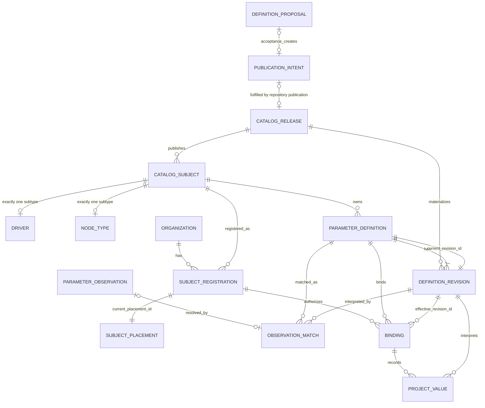

# ADR-0040: The canonical parameter catalog separates publication, definition truth, and organization use

> Chinese companion: [中文决策记录](../zh-CN/design-docs/adr-0040-canonical-parameter-catalog-relational-model.md)

Date: 2026-08-31

## Status

Accepted for the replacement architecture described by [Wayfinder: replace the parameter catalog with one canonical definition model](https://github.com/tzrea1-Q/WiseEff/issues/668). This is a target-model decision, not a claim that the current operational schema has already been cut over.

This record remains ADR-0040. The publication decision in [Issue #674](https://github.com/tzrea1-Q/WiseEff/issues/674) is ADR-0041, and the registration/placement decision in [Issue #675](https://github.com/tzrea1-Q/WiseEff/issues/675) remains ADR-0042. Where those records conflict with this correction, they must be read and renumbered consistently with this sequence.

## Context

The current catalog spreads one property contract across `parameter_specs`, `parameter_spec_versions`, attribution subjects, schema roots/properties, organization overlays, placements, review rows, bindings, and duplicated lifecycle/current flags. That shape can make an organization override, an unmatched DTS occurrence, a proposal, or a historical row look like a second current definition.

[Issue #669](https://github.com/tzrea1-Q/WiseEff/issues/669) established the compatibility duties. [Issue #670](https://github.com/tzrea1-Q/WiseEff/issues/670) established that legacy rows must be classified by their complete relational graph and that R6/R7/R8 evidence cannot become a current definition by name or property key. ADR-0041 establishes an immutable repository Catalog Release as the sole publication input. ADR-0042 establishes one durable Organization registration and exactly one retained placement for each registered formal subject.

The remaining model must have one materialization authority, stable identities, immutable and complete revision history, and database-enforced aggregate closure. In particular, proposal acceptance must not create a second path to `ParameterDefinition` or `DefinitionRevision`, and “exactly one placement” must mean exactly one at transaction commit for both active and retired registrations.

## Decision

### Authority and aggregate boundaries

- A **Catalog Release** is an immutable, repository-reviewed publication of formal subjects and definition content.
- The **Catalog Release synchronizer** is the only steady-state writer allowed to materialize `CatalogSubject`, `ParameterDefinition`, or `DefinitionRevision` rows and advance catalog heads. PostgreSQL is its projection, not an authoring source.
- A **Definition Proposal** is governed change intent. Acceptance may approve or create a Platform catalog publication intent or repository change, but it cannot insert, update, retire, or otherwise materialize a definition or revision. The proposal service therefore cannot become a second materializer.
- A **Catalog Subject** is the Platform-owned formal identity and is exactly one `Driver` or one `NodeType`.
- A **Parameter Definition** is the stable identity of one subject/property contract. A **Definition Revision** is an immutable snapshot of all persisted definition content.
- An **Organization Subject Registration** is one Organization's durable declaration that it uses one formal subject. It is `active | retired` and always owns exactly one retained **Subject Placement**.
- A **Parameter Observation** is immutable source evidence. A **Binding** is the stable project/logical-node association with one registered definition. A **Project Value** is an immutable value fact under that Binding. None of these objects owns or materializes catalog truth.

Proposal, catalog publication, synchronization, registration/placement, matching, binding, and project-value mutation are separate transaction boundaries. A caller may orchestrate them, but it cannot bypass the owning aggregate or share an uncommitted catalog write across those boundaries.

### Relationship diagram



The subtype cardinality is exclusive: a subject has one Driver row xor one NodeType row. The two `PARAMETER_DEFINITION` → `DEFINITION_REVISION` edges distinguish immutable history from the non-null current-head pointer. The diagram intentionally contains no Proposal → Definition materialization edge and no Placement → Binding identity edge.

### Canonical terminology

| Term                   | Exact meaning and boundary                                                                                                                                                                                           |
| ---------------------- | -------------------------------------------------------------------------------------------------------------------------------------------------------------------------------------------------------------------- |
| `Driver`               | CatalogSubject subtype selected by the authoritative `compatible` matcher and carrying Driver-only nature/cardinality facts.                                                                                         |
| `NodeType`             | CatalogSubject subtype selected by the formal normalized-node-name matcher only when no Driver matches. It is not an observed module label or weak Driver.                                                           |
| `ParameterDefinition`  | Stable opaque identity for one permanent `(subject_id, property_key)` catalog key. It contains identity and the current-revision pointer, not mutable definition content.                                            |
| `DefinitionRevision`   | Immutable snapshot of every persisted definition-content field, including documentation, units, constraints, defaults, lifecycle content, and matching/interpretation metadata.                                      |
| `DefinitionProposal`   | Reviewable Platform catalog change intent. Acceptance produces or approves publication intent/repository change only; it never materializes catalog rows.                                                            |
| `ParameterObservation` | Immutable project/source evidence that may be matched or sent to review. It never becomes a definition.                                                                                                              |
| `SubjectRegistration`  | One durable `(organization_id, subject_id)` identity whose lifecycle is active or retired; it references exactly one retained current placement in every lifecycle state.                                            |
| `SubjectPlacement`     | The single stable taxonomy node owned by one registration. Rename/reparent updates this retained identity; it is not observed usage and is not Binding identity.                                                     |
| `Binding`              | Stable association between one project logical node, one Organization registration, and one ParameterDefinition. Its `effective_revision_id` controls the contract for new values until a governed semantic cutover. |
| `ProjectValue`         | Immutable value/source/config fact under one Binding that pins the exact DefinitionRevision used to validate and interpret it.                                                                                       |

These definitions intentionally match ADR-0042: formal subject, registration, authoritative placement, observed usage, Binding, and value are separate facts. “Registration” never means a catalog subject, module, observation, or project-specific use. “Placement” never means an occurrence or Binding.

### Logical relational responsibilities and keys

Physical names may change in the implementation specification only if these ownership and constraint semantics remain explicit.

| Relation                                                   | Responsibility and minimum keys                                                                                                                                                                                                                                            |
| ---------------------------------------------------------- | -------------------------------------------------------------------------------------------------------------------------------------------------------------------------------------------------------------------------------------------------------------------------- |
| `catalog_releases`                                         | Immutable release identity, version, predecessor, aggregate digest, verification state, and one explicit verified-current pointer outside the release row. Release version and digest are each unique and never reused.                                                    |
| `catalog_subjects`                                         | Platform root: opaque `id`, immutable `kind`, permanent canonical key. `UNIQUE (kind, canonical_key)` across all lifecycle states; no `organization_id`.                                                                                                                   |
| `catalog_drivers` / `catalog_node_types`                   | Disjoint subtype detail with exactly one row matching `catalog_subjects.kind`. Driver matcher/nature/cardinality and NodeType fallback matcher live here.                                                                                                                  |
| `parameter_definitions`                                    | Opaque stable `id`, `subject_id`, normalized `property_key`, non-null `current_revision_id`. Permanent `UNIQUE (subject_id, property_key)` plus `UNIQUE (id, subject_id)` for ownership FKs. No organization, module, proposal, observation, or mutable content columns.   |
| `definition_revisions`                                     | Opaque `id`, `definition_id`, monotonic display `revision_number`, release provenance/digest, and the complete immutable content snapshot. `UNIQUE (definition_id, revision_number)` and `UNIQUE (definition_id, id)`. No `current` flag.                                  |
| `definition_proposals` / publication intents               | Proposal identity, proposed change, exact base release/revision where applicable, review/audit state, and accepted publication-intent or repository-change reference. There is no accepted-revision field written by proposal acceptance.                                  |
| DTS occurrence relations / `parameter_observation_matches` | Immutable observation provenance and at most one accepted match per occurrence. A match pins definition, revision, registration, Binding, matcher revision, and Catalog Release digest. Absence means unrecognized; ambiguity remains review evidence.                     |
| `organization_subject_registrations`                       | Opaque `id`, `organization_id`, `subject_id`, `status`, origin/proof, non-null `current_placement_id`. Permanent `UNIQUE (organization_id, subject_id)` and organization-inclusive candidate keys.                                                                         |
| `subject_placements`                                       | Opaque stable `id`, `registration_id`, same-Organization taxonomy module, origin. `UNIQUE (registration_id)` makes the retained placement the only placement row; `UNIQUE (organization_id, module_id)` prevents two registered subjects from owning one placement module. |
| `project_parameter_bindings`                               | Opaque stable `id`, organization/project/logical-node identity, `registration_id`, `subject_id`, `definition_id`, non-null `effective_revision_id`, and explicit `current_value_id`. `UNIQUE (project_id, logical_node_id, definition_id)`. No `module_id`.                |
| project-value rows                                         | Immutable value/source/config facts with opaque `id`, `binding_id`, `definition_id`, and exact `definition_revision_id`. A binding has an explicit current-value pointer; readers never infer a tip by maximum number or time.                                             |
| typed legacy-ID maps / archive ledger                      | Each retained externally referenced legacy ID maps once to the same-kind stable target, or to immutable archive evidence when identity cannot be proved.                                                                                                                   |

### Stable IDs, revision heads, and revision policy

- All domain IDs are opaque generated values. Natural keys, content digests, paths, and hashes are not entity IDs.
- `(subject_id, property_key)` is permanent across retirement. Retirement cannot release the key for reuse or create a second definition identity.
- `parameter_definitions.current_revision_id` is the only definition-head truth. A non-null, deferrable composite FK proves that the referenced revision belongs to the same definition. Revision number and timestamps are display/order facts, never head-selection rules.
- Every persisted change to definition content creates a new immutable DefinitionRevision, including documentation-only corrections. Existing revision rows are never updated or deleted.
- The synchronizer derives the new revision exclusively from a published immutable Catalog Release and advances the definition head in the same transaction. Replaying the same release digest is a verified no-op.
- A documentation-only revision advances the definition head but requires no Binding `effective_revision_id` or ProjectValue cutover. The latest catalog documentation may be shown from the definition head, while existing Binding validation and ProjectValue interpretation remain pinned to their prior compatible revisions.
- A semantic or matching-incompatible revision may require a separate governed Binding cutover before new values use it. That cutover never rewrites historical ProjectValues; each remains pinned to its original revision.
- Retiring a subject or definition blocks new use as defined by the Catalog Release but preserves its stable ID, unique key, current revision, registrations, placement, Bindings, observations, values, and audit. Restore reuses the same identity.

### Exactly-one retained placement

`UNIQUE (registration_id)` alone proves only “at most one.” The target also stores `organization_subject_registrations.current_placement_id NOT NULL` and uses a deferred composite FK back to `(registration_id, id)` on `subject_placements`. Together they prove at commit that:

1. every registration points to an existing placement belonging to that same registration;
2. every registration owns at most one placement row; therefore it owns exactly one;
3. there is no independent `is_current` flag that could disagree with the pointer; and
4. the invariant applies unchanged to both `active` and `retired` registrations.

Registration creation inserts the registration and its initial placement in one transaction with constraints deferred. Rename/reparent updates the same placement ID. Retirement never nulls the pointer or deletes the placement. A placement move changes taxonomy projection for all inherited definitions but does not change Definition, Binding, Observation, or ProjectValue identity.

### Constraint-level PostgreSQL sketch

This is a normative constraint sketch, not a migration. An implementation may choose other physical names only with equivalent PostgreSQL proof.

```sql
CREATE TABLE parameter_definitions (
  id uuid PRIMARY KEY,
  subject_id uuid NOT NULL REFERENCES catalog_subjects(id) ON DELETE RESTRICT,
  property_key text NOT NULL,
  current_revision_id uuid NOT NULL,
  UNIQUE (subject_id, property_key),
  UNIQUE (id, subject_id)
);

CREATE TABLE definition_revisions (
  id uuid PRIMARY KEY,
  definition_id uuid NOT NULL REFERENCES parameter_definitions(id) ON DELETE RESTRICT,
  revision_number bigint NOT NULL CHECK (revision_number > 0),
  catalog_release_id uuid NOT NULL REFERENCES catalog_releases(id) ON DELETE RESTRICT,
  content_digest text NOT NULL,
  content jsonb NOT NULL,
  UNIQUE (definition_id, revision_number),
  UNIQUE (definition_id, id)
);

ALTER TABLE parameter_definitions
  ADD CONSTRAINT parameter_definition_current_revision_fk
  FOREIGN KEY (id, current_revision_id)
  REFERENCES definition_revisions (definition_id, id)
  ON DELETE RESTRICT
  DEFERRABLE INITIALLY DEFERRED;

CREATE TABLE organization_subject_registrations (
  id uuid PRIMARY KEY,
  organization_id uuid NOT NULL,
  subject_id uuid NOT NULL REFERENCES catalog_subjects(id) ON DELETE RESTRICT,
  status text NOT NULL CHECK (status IN ('active', 'retired')),
  current_placement_id uuid NOT NULL,
  UNIQUE (organization_id, subject_id),
  UNIQUE (id, organization_id),
  UNIQUE (id, organization_id, subject_id)
);

CREATE TABLE subject_placements (
  id uuid PRIMARY KEY,
  registration_id uuid NOT NULL,
  organization_id uuid NOT NULL,
  module_id uuid NOT NULL,
  origin text NOT NULL CHECK (origin IN ('auto', 'curated')),
  UNIQUE (registration_id),
  UNIQUE (registration_id, id),
  UNIQUE (organization_id, module_id),
  FOREIGN KEY (registration_id, organization_id)
    REFERENCES organization_subject_registrations (id, organization_id)
    ON DELETE RESTRICT,
  FOREIGN KEY (module_id, organization_id)
    REFERENCES parameter_modules (id, organization_id)
    ON DELETE RESTRICT
);

ALTER TABLE organization_subject_registrations
  ADD CONSTRAINT registration_current_placement_fk
  FOREIGN KEY (id, current_placement_id)
  REFERENCES subject_placements (registration_id, id)
  ON DELETE RESTRICT
  DEFERRABLE INITIALLY DEFERRED;

CREATE CONSTRAINT TRIGGER subject_placement_kind_ck
AFTER INSERT OR UPDATE OF registration_id, organization_id, module_id
ON subject_placements
DEFERRABLE INITIALLY DEFERRED
FOR EACH ROW EXECUTE FUNCTION assert_subject_placement_kind();
```

`assert_subject_placement_kind()` joins placement → registration → CatalogSubject and the same-Organization module. It raises a constraint violation unless Driver maps to `driver-group` and NodeType maps to `node-type`. A second deferred constraint trigger enforces exactly one subtype row matching each subject kind if table inheritance is used. These triggers validate facts owned elsewhere; they do not duplicate kind or current-state columns.

Tenant-bearing Binding FKs follow the same pattern: `(registration_id, organization_id, subject_id)` references the registration candidate key; `(definition_id, subject_id)` references the definition candidate key; `(definition_id, effective_revision_id)` references the revision candidate key. ProjectValue and observation-match rows repeat enough owner keys for composite FKs to prove binding/definition/revision agreement.

Materialization authority is also enforced at the role boundary; catalog tables are owned by a non-login migration owner:

```sql
REVOKE INSERT, UPDATE, DELETE ON
  catalog_releases, catalog_subjects, catalog_drivers, catalog_node_types,
  parameter_definitions, definition_revisions
FROM PUBLIC, application_role, proposal_service_role;

GRANT INSERT ON
  catalog_releases, catalog_subjects, catalog_drivers, catalog_node_types,
  parameter_definitions, definition_revisions
TO catalog_synchronizer_role;

GRANT UPDATE (current_revision_id) ON parameter_definitions
TO catalog_synchronizer_role;

REVOKE UPDATE, DELETE ON definition_revisions
FROM PUBLIC, application_role, proposal_service_role, catalog_synchronizer_role;

GRANT SELECT ON
  catalog_releases, catalog_subjects, catalog_drivers, catalog_node_types,
  parameter_definitions, definition_revisions
TO application_role, proposal_service_role;
```

Proposal acceptance writes only proposal/publication-intent relations and trusted audit. The proposal role has no catalog-table mutation grant. Catalog lifecycle fields represented in revisions are append-only; any root/head mutation needed by release synchronization is column-granted only to the synchronizer role.

### Database and transaction invariants

The database, not only HTTP writers, enforces the following:

1. A CatalogSubject is Platform-owned, kind-immutable, and has exactly one matching Driver xor NodeType subtype.
2. Definition identity is permanently unique by subject/property. Every definition has one non-null head belonging to itself; every revision is immutable and belongs to one release.
3. Only the Catalog Release synchronizer role may insert catalog roots/revisions or advance heads. Proposal, observation, registration, binding, project-value, HTTP, Agent, and ordinary application roles cannot.
4. Registration and placement satisfy exactly one retained placement at commit in both lifecycle states. Placement is same-Organization and kind-correct.
5. Composite FKs prove definition/revision, registration/subject/organization, Binding/definition/registration/effective revision, ProjectValue/binding/revision, and observation-match agreement. Cross-Organization references cannot accidentally satisfy a key.
6. Unknown or ambiguous evidence has no accepted match and cannot create a definition, revision, Binding, or ProjectValue. A uniquely proven subject may create registration/placement without proving a property, as ADR-0042 specifies.
7. Subject, definition, revision, registration, placement, Binding, ProjectValue, match, legacy map, release, and audit history use restricted deletion. Domain retirement is never cascade deletion.

Transaction ownership is:

- **Accept Proposal:** lock and resolve the proposal, record the approved publication intent or repository-change reference, and commit trusted audit. The transaction performs zero catalog materialization.
- **Synchronize Catalog Release:** take the exclusive release lock; verify the immutable release and lineage; stage subjects/definitions; create one revision for every changed persisted definition snapshot, including documentation-only changes; advance definition and verified-release heads; record materialization evidence/audit; commit all or none. Same verified digest is a read-only no-op.
- **Register and place:** lock `(organization, subject)` and destination taxonomy keys; insert/reuse the one registration and its one placement under deferred constraints; audit; commit all or none. Retirement/restore preserves both IDs and the non-null pointer.
- **Recognize and bind:** pin observation, matcher revision, Catalog Release, exact definition/revision, registration, and Binding. It may call the registration aggregate only after a unique formal-subject proof, but it never materializes catalog identity or definition content.
- **Cut over Binding revision:** compare-and-swap `effective_revision_id`, validate compatibility and current Catalog Release, and append audit/history. Documentation-only revisions skip this transaction. Semantic cutover never changes prior ProjectValues.
- **Change Project Value:** lock Binding/current-value head, validate against its effective revision, append one immutable ProjectValue, advance the explicit value pointer, and audit atomically.
- **Move Placement:** lock registration plus source/destination taxonomy keys, update the retained placement ID in place, and audit atomically. Binding rows never move.

### Where Driver and NodeType differ

The difference is confined to three layers:

1. **Catalog subtype:** Driver owns compatible selectors and Driver-only nature/cardinality; NodeType owns its formal normalized-node-name selector.
2. **Matcher:** unique Driver `compatible` match wins; NodeType is the fallback only when no Driver matches. The results are never unioned.
3. **Placement validation:** Driver registration uses a `driver-group` module; NodeType registration uses a `node-type` module, with ADR-0042's allowed taxonomy parents.

Definition, DefinitionRevision, Proposal, publication intent, stable ID, registration lifecycle, Binding, ProjectValue, audit, and revision policy use one shared model for both subject kinds. A Driver/NodeType branch in definition content storage, revisioning, proposal materialization, Binding identity, or ProjectValue storage is therefore misplaced.

## Required PostgreSQL acceptance scenarios

The implementation specification must run these against real PostgreSQL, not an in-memory substitute. Constraint cases must force `SET CONSTRAINTS ALL IMMEDIATE` or `COMMIT`; concurrency cases use independent sessions.

| Area                  | Required scenario and expected result                                                                                                                                                                                         |
| --------------------- | ----------------------------------------------------------------------------------------------------------------------------------------------------------------------------------------------------------------------------- |
| Materializer          | `proposal_service_role` accepts a Proposal and writes intent/audit, while INSERT/UPDATE against Definition or Revision is denied and catalog row counts do not change.                                                        |
| Materializer          | `catalog_synchronizer_role` materializes a published release atomically; failure before head switch leaves all previous heads/current release unchanged.                                                                      |
| Idempotency           | Replaying the same verified release digest creates no rows and changes no heads; reusing a release version/digest with different normalized content fails closed.                                                             |
| Revision              | Initial Definition + first Revision + non-null head commits under deferred FK; a head naming another Definition's revision fails at commit.                                                                                   |
| Revision              | Every content delta—shape, constraint, unit, default, lifecycle content, matching metadata, or documentation—creates a new immutable Revision and advances the head. In-place Revision UPDATE/DELETE fails.                   |
| Documentation         | A documentation-only release creates a Revision and advances Definition head while Binding `effective_revision_id`, Binding count/IDs, current ProjectValue, and all historical ProjectValues remain byte-for-byte unchanged. |
| Semantic cutover      | A semantic revision leaves historical ProjectValues pinned; governed Binding cutover advances only `effective_revision_id` and audit/history, and stale compare-and-swap loses without partial writes.                        |
| Placement creation    | Registration plus one owned Placement commits in either insert order with constraints deferred. The same test passes for `active` and `retired`.                                                                              |
| Placement lower bound | Registration without Placement, or with a null/missing `current_placement_id`, fails no later than constraint check/commit for both lifecycle states.                                                                         |
| Placement ownership   | A Registration pointer to another Registration's Placement fails the composite FK.                                                                                                                                            |
| Placement upper bound | A second Placement for one Registration fails `UNIQUE (registration_id)` even if no row carries a current flag.                                                                                                               |
| Placement retention   | Deleting the retained Placement, retiring while deleting it, or clearing/changing the pointer without an owned replacement fails atomically. Restore preserves both IDs.                                                      |
| Placement move        | Rename/reparent updates the same Placement ID and leaves Definition, Binding, Observation, and ProjectValue rows unchanged; destination conflict rolls back move and audit together.                                          |
| Tenant isolation      | Cross-Organization registration/module, Binding/registration, or ProjectValue/Binding combinations fail composite FKs.                                                                                                        |
| Subject kind          | Missing subtype, both subtypes, mismatched subtype, Driver→`node-type` placement, and NodeType→`driver-group` placement all fail deferred constraint checks.                                                                  |
| Matching boundary     | Unknown/ambiguous evidence creates only observation/review evidence. Unique subject but unknown property may create registration/placement, but creates no match, Binding, Definition, or Revision.                           |
| Binding agreement     | A Binding whose Definition belongs to another subject, whose registration belongs to another subject/Organization, or whose effective revision belongs to another Definition fails.                                           |
| Concurrency           | Concurrent first registration produces one stable Registration and one retained Placement; concurrent release synchronization or revision-head advancement produces one deterministic winner/no-op and no split head.         |

## Consequences

- The catalog synchronizer becomes a deep module: publication validation, immutable revision creation, stable-head advancement, permission boundary, and release verification live behind one seam rather than being repeated in proposal, ingest, startup, or review services.
- Organizations cannot author structural truth. Registration/placement, observations, Bindings, and ProjectValues evolve independently without copying definitions.
- Documentation history is complete because it follows the same immutable revision rule, while avoiding unnecessary Binding/value cutovers.
- Circular non-null heads require deferred constraints and transaction tests, but eliminate zero-head and zero-placement states that application checks cannot prove under concurrency.
- Existing organization overlays, proposal-to-definition writers, lazy ingest materialization, duplicated current flags, and Driver-only placement paths are migration inputs to retire, never destination contracts.
- This ADR contains no production code, migration, API, UI, or implementation ticket. Later specifications may deepen module interfaces and physical names but may not weaken the single materializer, immutable revision, exact-one placement, stable-ID, or aggregate-boundary decisions above.
