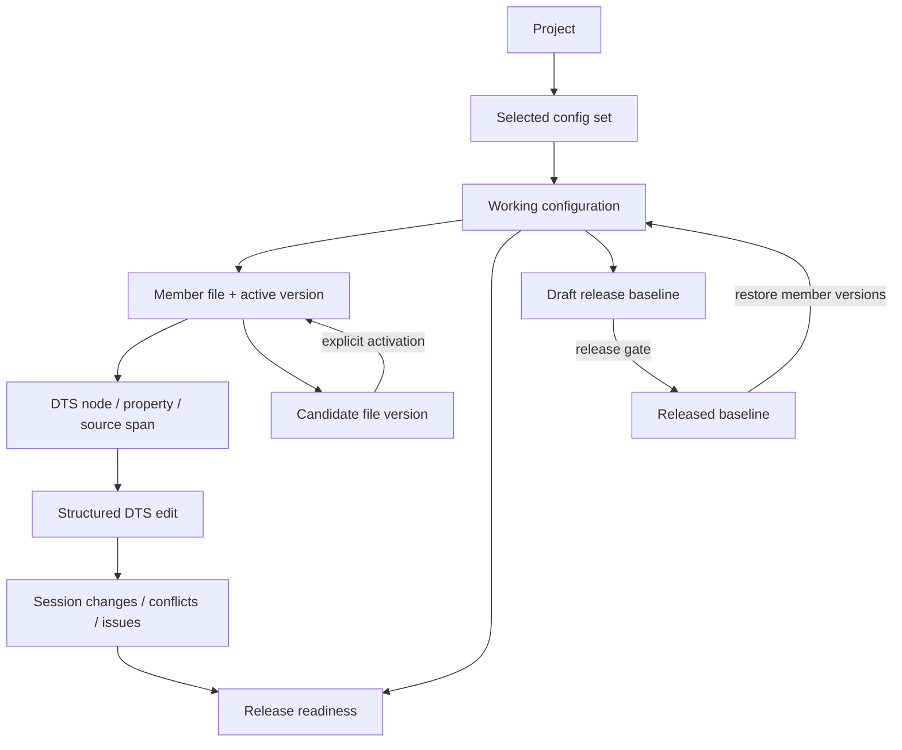
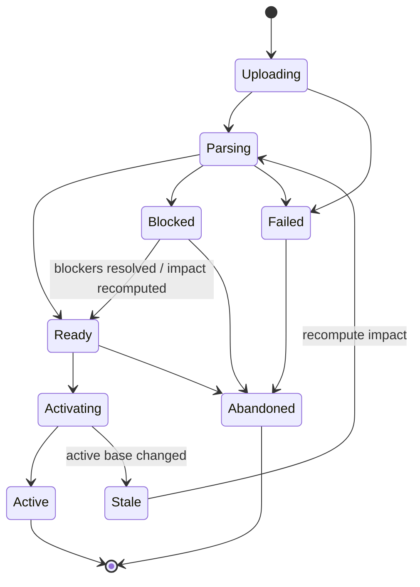

# Project configuration workbench — locked design

> Date: 2026-08-06
> Status: locked for implementation planning
> Chinese: [Chinese](../zh-CN/design-docs/2026-08-06-project-configuration-workbench-design.md)
> Domain: [CONTEXT.md](../../CONTEXT.md)
> Decisions: [ADR-0001](../adr/0001-parameter-admin-organized-by-governance-scope.md), [ADR-0012](../adr/0012-releasing-happens-at-the-file-layer.md), [ADR-0018](../adr/0018-uploaded-file-versions-are-staged-before-activation.md)

## 1. Decision summary

Replace the four-view project-operations dialog with one full-screen **project configuration workbench** at:

```text
/parameter-admin/projects/:projectId/configuration
```

The workbench is organized around the selected **config set**. Its member files and parsed DTS nodes form one source tree; the selected source stays in the main canvas. File versions, structured edits, release baselines, validation, conflicts, and audit evidence appear as contextual tools around that canvas instead of as four low-density destinations.

The design keeps ADR-0001's governance-scope architecture: organization governance and project operations remain peer areas. It supersedes only the presentation decision restored on 2026-08-05: project configuration work is now too deep and code-centric for a centered dialog.

## 2. Why the current dialog fails

The current implementation divides one workflow into these routes and pill-nav views:

| Current view | Current responsibility | Structural problem |
| --- | --- | --- |
| Parameter files | Upload, version history, download, sync, structured search | Search is detached from the source it locates; file metadata consumes a full card for one row |
| Config sets / baselines | Membership, roles, export, baseline compare, rollback, release | The release unit is separated from the files and source changes it snapshots |
| Structure browser | DTS node tree, property inspection, structured edit | It removes the source-text canvas and presents another isolated two-pane tool |
| Conflict arbitration | File-sync versus UI-draft conflicts | Conflicts lose their exact source context and become a separate queue |

Observed presentation constraints compound the split:

- The desktop card is `min(980px, 100vw - 48px)` and `88vh`, yet a source tree, readable DTS canvas, and contextual details already need more horizontal space.
- The project list remains visible only as blurred background and contributes no useful context while the operator works.
- A persistent audit banner consumes prime vertical space even when its event is unrelated to the selected file or task.
- Switching views preserves four separate page mental models instead of preserving one selected config, file, node, and release context.
- The everyday parameter workbench's tech view already proves the useful skeleton: persistent navigation beside a read-only DTS source canvas. Project operations need that skeleton with source-structure navigation and governance tools.

## 3. Goals and non-goals

### Goals

1. Make the project source the stable visual anchor for every file-governance task.
2. Keep config-set composition and release state visible without making them separate pages.
3. Preserve source identity: config set → member file → DTS node → property → source span.
4. Make structured edits, candidate activation, conflicts, and release gates locatable to exact source lines.
5. Distinguish the mutable working configuration from immutable release baselines and historical versions.
6. Raise desktop density while retaining accessible tablet and mobile fallbacks.
7. Preserve deep links, server-side authorization, confirmation, and audit evidence.

### Non-goals

- Free-form browser editing of raw DTS text.
- Replacing the everyday parameter workbench or its business-module navigation.
- Adding IDE features such as terminals, minimaps, arbitrary file tabs, or command palettes.
- Moving organization-level spec, identity-mapping, or module-governance queues into this workbench.
- Publishing to Git or creating pull requests from WiseEff.
- Replacing the file-layer release unit from ADR-0012.

## 4. Locked product decisions

| ID | Decision |
| --- | --- |
| PCW-D1 | Use a full-screen routed workbench, not a centered modal. |
| PCW-D2 | The selected config set is the work context; files are the primary inspected objects. |
| PCW-D3 | The left navigation is one source tree: config set → files → DTS nodes. It never becomes a business-module tree. |
| PCW-D4 | The source canvas is read-only. Property changes use a typed, governed inspector; whole-file changes use candidate uploads. |
| PCW-D5 | Use a global command bar, contextual right inspector, and cross-file task dock instead of permanent feature panels. |
| PCW-D6 | Show the working configuration by default; released and historical states are temporary compare or history modes. |
| PCW-D7 | One server-derived release-readiness model governs baseline creation and release. |
| PCW-D8 | Upload creates a candidate file version; parsing, impact review, and explicit activation precede any working-config change. |
| PCW-D9 | Resolve conflicts in source context with a three-way comparison and equal-weight outcomes. |
| PCW-D10 | Rename the project-list entry from “Manage files” to “Configuration workbench”. |
| PCW-D11 | Replace the persistent audit banner with contextual evidence and an activity timeline. |
| PCW-D12 | Recover session drafts after navigation or refresh; changed base versions make them stale and unsubmitable until reconfirmed. |
| PCW-D13 | Desktop is the primary composition. Responsive layouts preserve capability without constraining the desktop design. |
| PCW-D14 | Provide IDE-grade navigation and source location, but keep governance interactions productized. |
| PCW-D15 | Choose desktop pane persistence from the workbench's actual available width, not the outer viewport. The source canvas is the only always-dominant pane. |

## 5. Domain and state relationships



Important distinctions:

- A **working configuration** is the selected config set's current member-file versions.
- A **candidate file version** is inspectable but does not contribute to the working configuration.
- A **release baseline** snapshots active member versions; it is not a synonym for a file version or config revision.
- A **rollback** restores working member versions by creating rollback-origin versions. It does not silently repoint the released baseline.
- A **session draft** is recoverable local work, not a submitted change request and not a file version.

## 6. Route and URL state

Canonical route:

```text
/parameter-admin/projects/:projectId/configuration
```

Shareable state belongs in query parameters:

```text
?configSet=<id>
&file=<fileId>
&node=<encodedNodePath>
&property=<propertyName>
&mode=source|compare|history
&baseline=<baselineId>
&version=<versionId>
&inspector=config-set|file|node|property|baseline|activity
&dock=changes|issues|conflicts
```

Session drafts, expanded tree nodes, pane widths, and scroll offsets do not belong in the URL. They are session UI state.

For one compatibility release, legacy routes redirect as follows:

| Legacy route | Redirected context |
| --- | --- |
| `/:projectId/files` | Working configuration, primary file selected, file inspector open |
| `/:projectId/config-sets` | Selected/default config set, config-set inspector open |
| `/:projectId/structure` | Working configuration, primary DTS selected in source mode |
| `/:projectId/conflicts` | Working configuration with conflict task dock expanded |

The redirect preserves known file, node, or search focus where the old route provided it. After the compatibility window, route generation must use only the canonical workbench route.

## 7. Desktop information architecture

### 7.1 Layout

```text
┌──────────────────────────────────────────────────────────────────────────────────────┐
│ ← Project list  Aurora Production  [default ▾]  ● 3 blockers  Released: seed-v1     │
│                                    [Upload] [Export] [Create baseline] [Release ▾]   │
├───────────────────┬─────────────────────────────────────────┬────────────────────────┤
│ SOURCE STRUCTURE  │ aurora-board.dts · v12 · Working       │ INSPECTOR              │
│ Search…           │ Breadcrumb / find / compare controls    │ Selected file/node/... │
│                   ├─────────────────────────────────────────┤                        │
│ default           │  127  &charging_core {                  │ Role / version / risk  │
│ ├ board.dts  v12  │  128    iin_max = <2300>;       ●       │ History / typed edit   │
│ │ ├ amba           │  129    ichg_max = <2500>;              │ Contextual actions      │
│ │ └ charging_core │  130  };                                │                        │
│ ├ overlay.dtsi v4 │                                         │                        │
│ └ Ungrouped (1)   │                                         │                        │
├───────────────────┴─────────────────────────────────────────┴────────────────────────┤
│ 3 changes   2 validation issues   1 conflict                         [Expand task dock]│
└──────────────────────────────────────────────────────────────────────────────────────┘
```

This diagram assigns content to regions; it does not require all three regions to remain side by side. The source tree is persistent but compact/collapsible on the default desktop shell, while the inspector opens as an overlay drawer.

Desktop composition follows the **available workbench width after the global navigation and application chrome are applied**:

- At the default `1440×900` WiseEff shell with expanded global navigation, use a compact source tree of about 214px, a dominant source canvas, and an overlay/collapsible inspector.
- The source tree may resize to 360px or collapse, but the source canvas receives space before the inspector becomes persistent.
- A persistent 320–460px inspector is permitted only when the source canvas still retains at least 640px after the tree, splitters, and inspector are applied. This is expected at an available workbench width of about 1280px or more, such as with a wider viewport or collapsed global navigation.
- Keep the task dock persistently discoverable at 44px when collapsed. Expand it, up to about 40% of available height, only for active changes, issues, conflicts, candidate impact, or release-review work.
- File version, candidate file version, and released baseline remain three independently labeled visual identities in every composition; never collapse them into one generic “version” chip.

The workbench uses the full application content area beneath the global top bar. It has one vertical source-canvas scroller and independent tree/inspector scrollers; it must not reproduce a page scroller containing nested full-page cards.

### 7.2 Prototype evidence

The 2026-08-06 throwaway prototype measured the routed workbench inside the real expanded WiseEff shell. At a `1440×900` viewport, the workbench received 1128px of content width:

| Composition | Measured source canvas | Decision |
| --- | ---: | --- |
| Balanced tri-pane | 488×659px | Rejected as the default because it misses the 640px source target. Retain its complete inspector content. |
| Source-dominant | 914×659px | Selected as the default desktop composition. |
| Operations-dominant | 870×382px | Rejected as the everyday composition. Reuse its evidence density only in the expanded task dock. |

The prototype changes only composition rules. Domain semantics, candidate lifecycle, release readiness, authorization, conflict arbitration, and audit boundaries remain unchanged.

### 7.3 Density and visual language

- Use borders, subtle surface changes, and split-pane separators instead of card-inside-card composition.
- Tree rows target 30–34px; command controls target 32–36px; source lines target 20–22px.
- Reserve filled status chips for actionable lifecycle facts: candidate, conflict, stale draft, released, blocked.
- Keep explanatory prose in empty states and inspectors, not permanently above the source canvas.
- Use an 8px spacing system with 12–16px section padding. Avoid oversized marketing headings.
- Persist user-adjusted desktop pane widths without applying those widths to tablet/mobile layouts.

## 8. Region specifications

### 8.1 Global command bar

Always present:

- Back to project list.
- Project name/code and project status.
- Config-set selector; default config set selected on first entry.
- Release-readiness indicator with blocker/warning counts.
- Current released baseline and working-versus-released drift summary.
- Primary action slot and overflow menu.
- Activity entry; no persistent last-audit banner.

Contextual actions:

| Context | Primary actions |
| --- | --- |
| Working source | Upload candidate, export config set, create baseline |
| Draft baseline selected | Compare, release |
| Released baseline selected | Compare, restore to working configuration |
| Candidate selected | Review impact, activate, abandon |
| Blocked readiness | Open task dock; release remains disabled |

High-risk actions keep explicit impact confirmations. The command bar must not show every possible action at once; lower-frequency actions go into a labeled overflow menu.

### 8.2 Source structure tree

Tree hierarchy:

```text
selected config set
├─ member file (role, active version, status counts)
│  ├─ DTS node
│  │  └─ child DTS node
│  └─ candidate versions (when present)
└─ Ungrouped project files
```

Behavior:

- Selecting a file shows its complete active source.
- Selecting a node keeps the same file open, scrolls to its source span, and highlights the node block.
- Selecting a property highlights its exact span and opens the property inspector.
- Source scrolling updates the nearest visible node highlight without stealing keyboard focus.
- Search matches file name, node path, unit address, label, compatible, property name, and property value.
- Search results remain in the tree and can jump across member files; result counts are grouped by file.
- File and node rows surface counts for candidate, conflict, validation, and local-change state.
- “Ungrouped” is visually separate because those files do not contribute to the selected config set or release readiness.

This tree is source topology, not the everyday workbench's business taxonomy.

### 8.3 DTS source canvas

The canvas provides:

- DTS syntax highlighting, line numbers, bracket/indent guides, fold controls, and in-source find.
- File/node breadcrumb and `fileName · version · working/history/candidate` identity.
- Gutter markers for local changes, candidate differences, conflicts, warnings, and focused search results.
- Bidirectional selection with the source tree and inspector.
- Source, unified diff, side-by-side diff, and historical read-only modes.
- Restore of the previous selection and scroll position when leaving compare/history mode.
- Keyboard navigation for find-next, line jump, tree/source focus, task dock, and inspector toggle.

The canvas does not provide unrestricted text editing. Double-clicking an editable property or using “Edit value” opens the structured property inspector. Whole-file changes enter through candidate upload.

### 8.4 Context inspector

The right inspector changes with the selected object:

| Selected object | Inspector content |
| --- | --- |
| Config set | Description, member roles, working/released drift, baseline history, add/remove member controls |
| File | Format, member role, active version, candidate versions, version history, download, sync, replace/upload action |
| Candidate version | Parse status, source/structural diff, coverage impact, conflicts, activate/abandon actions |
| DTS node | Full path, labels, compatible, enablement/reachability, risk classification, source provenance |
| DTS property | Type, current/raw/normalized value, source span, sensitive-node permission, typed edit form, reason |
| Baseline | Status, pinned members, creator/time, compare, release or restore action |
| Activity | Filtered project activity timeline; selecting an event returns to its target object when possible |

Only one inspector context is active. Back navigation within the inspector returns from property → node → file → config set without changing the source selection unexpectedly.

### 8.5 Task dock

The task dock has three task kinds, not three pages:

1. **Session changes** — structured edit drafts, candidate activation changes, stale draft handling, submit/discard.
2. **Validation issues** — release-check diagnostics and governance blockers with severity and source targets.
3. **Conflicts** — three-way conflict arbitration with source positioning.

Collapsed state shows counts and the most severe state. It expands automatically only when the user starts a change, follows a blocker link, or opens a conflict. An empty task kind does not reserve a blank panel.

## 9. Mapping the four current views into one workspace

| Existing capability | New location |
| --- | --- |
| File list | Source-tree file roots |
| Upload parameter file | Command bar → candidate workflow |
| Version history | File inspector |
| Download latest/specific version | File inspector and history row actions |
| Manual sync | File inspector, with task results in the dock |
| Structured search | Unified source-tree/source search |
| Config-set selection | Command bar selector |
| Create/configure config set | Config-set selector and config-set inspector |
| Member role/add/remove | Config-set or file inspector |
| Export config set | Command bar |
| Baseline list/history | Released-baseline control → baseline inspector |
| Create/release/compare/restore baseline | Command bar + baseline inspector + source diff mode |
| DTS node tree | Source structure tree |
| Node/property detail | Context inspector |
| Structured property edit | Property inspector + session-changes dock |
| Conflict queue | Conflict count markers + task dock |
| Audit banner | Toast for immediate feedback; activity inspector for durable evidence |

No old panel should be embedded wholesale inside the new page. Reuse domain logic and primitives, then recombine them into the workbench regions.

## 10. Core workflows

### 10.1 Enter and navigate

1. Enter from the project-list “Configuration workbench” action.
2. Resolve the query-string config set, otherwise select the project's default config set.
3. Resolve the query-string file/node, otherwise select the primary DTS active version.
4. Load tree metadata and source independently; a source failure does not erase the tree or release state.
5. Restore pane widths, expanded nodes, selection, scroll, and compatible session drafts.

### 10.2 Structured property edit

1. Select a property from the tree, source canvas, or search result.
2. Open the property inspector with value kind, raw/normalized value, constraints, risk, and permission state.
3. Edit through `StructuredValueEditor`; require a reason where the existing change-request contract requires it.
4. Add the edit to the session-changes dock; mark its tree node and source line.
5. Validate and submit all or selected edits through the existing governed change-request flow.
6. On success, clear submitted session drafts and refresh the active file version/source mapping.

Free-form source editing remains unavailable.

### 10.3 Upload and activate a candidate version

1. Choose an existing file to replace or upload a new project file.
2. Upload creates a candidate version without changing the active version or config-set composition.
3. Parse the candidate and compute text diff, structural diff, coverage impact, mapping blockers, and conflicts.
4. Display results in candidate source mode and the candidate inspector.
5. For a new file, require a member role and explicit config-set assignment before activation.
6. Resolve candidate conflicts and hard blockers.
7. Activate with an expected-current-version compare-and-swap. If the base changed, mark the candidate stale and recompute impact.
8. Keep the prior active version in history; record activation in server audit.

### 10.4 Resolve a conflict

Show one source-located three-way comparison:

```text
base value
candidate/file-sync value
pending UI draft value
```

- “Use file value” and “Keep UI value” receive equal visual weight.
- Explain which pending draft will be removed or retained before confirmation.
- Capture an optional resolution reason and server audit evidence.
- After resolution, advance to the next conflict while keeping the user in the same source context.
- Bulk resolution is allowed only for eligible conflicts after an impact preview.
- Candidate activation, baseline creation, and release remain blocked until relevant conflicts are closed.

### 10.5 Create and release a baseline

1. Release readiness is server-derived and visible before the user opens any release action.
2. Creating a baseline snapshots the working member versions; it does not upload or mutate files.
3. Open blockers disable baseline creation or release as defined by the gate result.
4. Warnings remain reviewable and require explicit acknowledgement when policy allows release.
5. Compare a draft baseline to the current released baseline in the source canvas.
6. Release the draft baseline with an impact confirmation; refresh released identity and drift summary.

### 10.6 Restore from a baseline

1. Select a baseline from history and compare it with the working configuration.
2. Confirm the exact member/version blast radius.
3. Restore atomically; the backend creates rollback-origin versions for drifted members.
4. Return to working-source mode and recompute readiness.
5. Do not automatically change the released baseline. A subsequent release remains an explicit act.

## 11. State models

### 11.1 Candidate file version



Only `Active` changes the working configuration. `Failed`, `Blocked`, `Stale`, and `Abandoned` candidates never contribute to release composition.

### 11.2 Session draft

```text
clean → dirty → validating → submitting → submitted
          │          │             └→ submit-failed
          │          └→ invalid
          └→ stale-base → reconfirm/rebase → dirty
          └→ discarded
```

Recovery rules:

- Scope by authenticated user, project, config set, file, and base version.
- Persist patches, reasons, and source identities, not entire duplicate project sources.
- Clear on logout and prevent cross-user restoration.
- Restore only when base versions and organization/project identity still match.
- A stale-base draft can be inspected and copied but cannot submit until reconfirmed against current source.

### 11.3 Release readiness

The server returns one ordered set of evidence with `target` locators and remediation actions.

| Level | Meaning | Example causes |
| --- | --- | --- |
| `blocked` | Baseline creation or release cannot proceed | Missing primary/member version, local edits, open conflicts, hard validation error, publish-blocking identity mapping |
| `warning` | Proceed only with explicit review/acknowledgement | Non-blocking toolchain warning, coverage regression accepted by policy |
| `ready` | Working configuration can be snapshotted/released | No blockers; warnings resolved or acknowledged |
| `in-sync` | Working configuration equals current released baseline | No source/member drift |

The frontend never reconstructs the authoritative gate by combining unrelated client counts.

## 12. Empty, loading, and failure states

| State | Required behavior |
| --- | --- |
| No config set | Attempt the existing default-config-set guarantee; otherwise show a recoverable project setup error, not a blank tree |
| Config set has no files | One focused upload-candidate action and an explanation that upload does not activate automatically |
| No structured DTS | File remains downloadable/history-visible; explain why the tree is unavailable and offer candidate replacement |
| Source load failed | Preserve tree, selection, and release state; retry only the source request |
| Candidate parse failed | Keep current working source untouched; show diagnostics in candidate inspector |
| No conflicts/issues/changes | Keep task dock collapsed with zero counts; never show a dedicated empty page |
| Readiness unavailable | Disable create/release, show retryable gate error, never assume ready |
| Permission denied | Keep allowed read context visible; explain the missing capability beside the disabled action |

## 13. Permissions, safety, and audit

- The project admin entry remains gated by `admin:access` for the initial workbench release.
- Existing project-scoped conflict resolution authorization remains enforced server-side; the UI architecture must not assume every rendered actor has full Admin capability.
- Structured property writes require existing `parameter:edit` checks.
- Sensitive/high/critical matches require their configured capability, defaulting to `parameter:edit-critical`; the server remains authoritative.
- Config-set mutation, candidate activation, baseline creation/release/restore, and config-set export retain their existing Admin gates unless a separate permission decision changes them.
- Release toolchain validation remains on the Admin/baseline L2 path and does not become a typed-edit hot-path gate.
- Candidate activation uses compare-and-swap against the inspected active version.
- Remove-member, candidate activation with blast radius, release, restore, and conflict arbitration require explicit confirmation.
- Audit is written by the backend. Toasts and the activity inspector are projections, never the evidence boundary.

## 14. Responsive behavior with desktop priority

The responsive contract preserves capability but does not force desktop component composition onto smaller screens.

| Context | Composition |
| --- | --- |
| Default desktop: `1440×900` outer viewport with expanded global navigation (about 1128px available to the workbench) | Compact/collapsible source tree + dominant source canvas + overlay inspector; 44px collapsed task dock |
| Wider desktop or collapsed shell | Inspector may become persistent only when the resulting source canvas remains at least 640px; task dock remains collapsed until active |
| 769–1279px outer viewport | Source canvas remains primary; tree is persistent when space allows, inspector becomes an overlay drawer |
| ≤768px outer viewport | Single source canvas; tree, inspector, and tasks open as full-height sheets; unified diff is the default |

Rules:

- Desktop keeps multi-pane visibility, dense keyboard controls, resizable panes, and side-by-side diff.
- Tablet/mobile adaptation must not reduce desktop pane widths, remove desktop shortcuts, or force desktop actions into mobile-only step flows.
- Mobile high-risk actions use a dedicated confirmation step with the same evidence and authorization as desktop.
- No viewport silently becomes read-only.

## 15. Accessibility and keyboard contract

- Source structure uses a real tree pattern with level, expanded, selected, and count announcements.
- Command bar and inspector use labeled regions; task-kind switches use tabs only when they control one dock panel.
- Pane resizing is keyboard-operable and exposes current size.
- Gutter state is never color-only; markers have labels/tooltips and task-list equivalents.
- Opening the inspector or task dock moves focus only when initiated by an explicit action; source scrolling never steals focus.
- Compare/history exit returns focus and scroll to the previous source target.
- Confirmation dialogs retain the shared `ModalDialog`/`ConfirmDialog` focus, Escape, inert-background, and top-most-dismiss contracts.
- Keyboard shortcuts are discoverable and do not override browser/system shortcuts.

## 16. Frontend module design

New coordinating surface:

```text
ProjectConfigurationWorkbenchPage
└─ ProjectConfigurationWorkbench
   ├─ ConfigurationCommandBar
   ├─ ConfigSourceTree
   ├─ DtsSourceCanvas
   ├─ ConfigurationInspector
   ├─ ConfigurationTaskDock
   ├─ ReleaseReadinessIndicator
   └─ CandidateVersionFlow
```

Reuse rules:

- Continue resolving data through `ParameterFileRepository` and `DtsStructuredRepository`; the new page must not call HTTP clients directly.
- Extend `ProjectPrimaryDtsViewer` concepts into a multi-file `DtsSourceCanvas` with source spans, diff modes, gutter annotations, and syntax highlighting.
- Reuse `StructuredValueEditor`, `StructuredDiffView`, confirmation primitives, repository DTOs, and source-location utilities.
- Refactor logic out of `ProjectParameterFilesPanel`, `ConfigSetBaselinePanel`, `DtsStructureBrowserPanel`, and `ParameterFileConflictPanel`; do not nest those page-shaped panels in the new layout.
- Keep page orchestration shallow: selection/query state belongs to the workbench coordinator; source parsing, readiness derivation, candidate lifecycle, and authorization remain behind ports/server modules.

## 17. API and persistence changes

### Candidate version lifecycle

ADR-0018 requires explicit candidate operations. Exact route naming may follow the existing API convention, but the contract needs these acts:

```text
createCandidate(projectId, file/new-file metadata, bytes)
getCandidateImpact(projectId, candidateVersionId)
activateCandidate(projectId, candidateVersionId, expectedCurrentVersionId, configSet/role intent)
abandonCandidate(projectId, candidateVersionId)
```

Activation is transactional: verify project/org scope, capability, expected active version, resolved blockers, member role, and target config set; then update active membership/version and write audit.

### Release readiness

Provide one server-owned config-set readiness read returning:

- overall level;
- blockers and warnings;
- target file/node/property/source-line locators;
- remediation action kind;
- gate revision/token so release can reject stale evidence.

### Source navigation

Existing structure, search, version download, compare, and structured-edit ports remain the basis. Add source spans or line ranges to structural nodes/properties where absent so tree, source, inspector, conflict, and validation targets share one identity.

## 18. Migration plan

Implementation requires a separate active execution plan and feature branch. Recommended delivery sequence:

### Phase 0 — contracts and acceptance map

- Add the bilingual design to current docs and amend ADR-0001.
- Define route, URL state, candidate lifecycle, readiness response, and source-locator DTOs.
- Register browser acceptance and user-operation IDs before UI implementation.
- Preserve the valid responsive/project-list fixes from the 2026-08-02 UX plan.

### Phase 1 — read-only workbench shell

- Add canonical route and project-list “Configuration workbench” entry.
- Build full-screen desktop shell, config-set selector, source tree, multi-file source canvas, inspector shell, and task-dock shell.
- Read existing active files/config sets; no write migration yet.
- Keep the old dialog reachable while the new route is behind a development flag.

### Phase 2 — file and candidate workflow

- Add candidate persistence/API/port lifecycle from ADR-0018.
- Move upload, version history, download, sync, member roles, and ungrouped files into tree/inspector/command regions.
- Verify upload alone cannot change active source or config-set composition.

### Phase 3 — structured navigation and editing

- Add hierarchical node/property source spans, bidirectional tree/source selection, unified search, and typed property inspector.
- Add recoverable session drafts, stale-base detection, selective submit, and leave guard.

### Phase 4 — tasks and release readiness

- Move validation evidence and three-way conflicts into the task dock.
- Add server-derived release readiness with source-target remediation.
- Keep conflict outcomes equal-weight and audited.

### Phase 5 — baselines and release

- Move baseline history, compare, create, release, export, and restore into command/inspector/source-diff flows.
- Verify rollback restores working versions without silently changing the released baseline.

### Phase 6 — cutover and cleanup

- Redirect the four legacy routes to canonical contexts for one compatibility release.
- Remove `ProjectOperationsDialog` and obsolete four-view navigation after acceptance evidence is green.
- Delete page-shaped panels only after all domain logic has a new owner and targeted tests cover it.
- Update `FRONTEND.md`, product specs, architecture, API contract, acceptance matrices, and both language companions in the implementation change.

## 19. Verification and acceptance criteria

### Product acceptance

1. An Admin can upload/review/activate a candidate, inspect/edit source, resolve conflicts, create/compare/release/restore a baseline, and export without navigating to another subpage.
2. The selected config set, file, node, compare/history mode, inspector, and task kind are deep-linkable and survive reload.
3. Uploading a candidate never changes the working configuration before activation.
4. Tree, source canvas, inspector, and task dock select the same file/node/property identity.
5. Open conflicts and other blockers are source-located and prevent gated actions.
6. Historical and released source are visibly read-only and never mistaken for the working version.
7. Session drafts recover against an unchanged base and become stale against a changed base.
8. The permanent audit banner is gone; server audit remains reachable through object context and activity timeline.

### Desktop quality bar

At `1440×900`:

- the compact/collapsible tree and source canvas remain simultaneously usable;
- opening the overlay inspector does not permanently reduce the source canvas below its practical code width;
- the inspector becomes persistent only when the source canvas can still retain at least 640px;
- the collapsed 44px task dock remains discoverable without consuming the everyday source-reading height;
- no page-level nested-card scroll trap exists;
- tree rows, source lines, and command bar achieve the intended dense rhythm;
- resize, search, source jump, diff, structured edit, conflict, candidate, and release interactions work by keyboard and pointer.

### Responsive quality bar

At `768×1024` and `390×844`:

- source remains the primary canvas;
- tree/inspector/tasks open without overlap, clipping, unintended horizontal page scroll, or hidden confirmations;
- no business capability is silently removed;
- unified diff and stepped high-risk confirmation remain readable.

### Engineering gates for implementation

- Targeted state, repository, component, route, accessibility, and integration tests.
- `npm run build` for TypeScript/routing changes.
- `npm run docs:check` and bilingual update gate.
- Real API-mode browser verification at all three required viewports, with snapshots, screenshots, relevant interactions, console errors, and loading/data-flow network checks.

## 20. Documentation impact for the future implementation plan

| Area | Expected action |
| --- | --- |
| Repository maps | Review `ARCHITECTURE.md`, `AGENTS.md` |
| Planning | Add bilingual active implementation plan; update EN/ZH plan indexes |
| Product specs | Update project-operations workflow and entry naming |
| ADR / domain | Keep ADR-0001/0012/0018 and `CONTEXT.md` aligned |
| Frontend | Update `docs/FRONTEND.md` and Chinese companion |
| API | Update EN/ZH API contract for candidate/readiness/source-locator contracts |
| Security | Review capabilities, candidate data, session-draft storage, confirmation, and audit |
| Quality | Add browser acceptance and user-operation coverage/evidence |
| Reliability | Review release-readiness failure handling and candidate cleanup |
| Generated artifacts | Update schema summary when candidate persistence lands |
