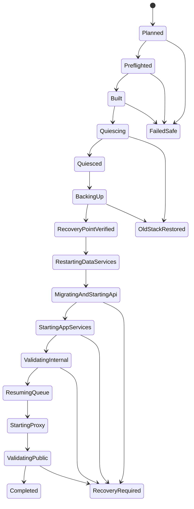

# Self-Hosted One-Command Upgrade Design

> Chinese: [Chinese](../zh-CN/design-docs/2026-08-20-self-hosted-one-command-upgrade-design.md)

Date: 2026-08-20
Status: Implemented locally; non-customer target rehearsal remains required
Scope: The source-checkout-based Docker Compose runtime under `ops/self-hosted/`

The implementation is available at `ops/self-hosted/scripts/upgrade.sh`, with local script, configuration, and build gates passing. A real Ubuntu rehearsal is deployment evidence and is intentionally not implied by repository-local tests.

## Context

WiseEff currently has three related but incomplete operator paths:

- `setup.sh` owns first-time configuration, Compose startup, and optional demo provisioning.
- `compose up -d --build` rebuilds the checked-out source and preserves named volumes.
- the self-hosted runbook tells an operator to fetch a release commit and run Compose manually.

None of them is a mature upgrade controller. There is no single command that resolves an immutable target commit, proves it can build, quiesces writes, captures and verifies a recovery point, restarts every service without deleting data, waits for migration and health gates, and records a resumable run. Reusing `setup.sh all` is unsafe because setup also owns configuration generation and provisioning; `setup.sh --force` intentionally rotates data-store credentials.

This design adds a dedicated deep module at the operator seam. Its interface is one command; Git, Compose, queue maintenance, backup, migration observation, health checks, journaling, and recovery remain implementation details.

## Goals

1. `./scripts/upgrade.sh` upgrades an existing self-hosted checkout to one resolved commit and fully recreates the stack while preserving all persistent data.
2. The normal path never edits `.env`, never provisions demo data, never rotates credentials, and never removes a Docker volume.
3. A build or preflight failure causes no downtime. A backup failure restores the old running stack. A post-migration failure stops traffic and reports an explicit recovery state.
4. Every mutating phase is journaled and resumable after SSH loss, host reboot, or operator interruption.
5. The command works on the documented Docker-only server; Node.js is not required on the host.
6. Target selection, backup artifacts, migration exposure, image identities, health evidence, and the final outcome are auditable without recording secrets.

## Non-Goals

- Installing Docker or cloning the repository onto a bare server.
- Replacing CI release gates or claiming that `origin/main` is release-ready.
- Zero-downtime or multi-host rolling deployment. This is a controlled single-host maintenance workflow.
- Automatically restoring a backup after candidate traffic has been served.
- Supporting an object-store provider whose data cannot be exported and verified by the S3-compatible backup tool. Such a target must fail preflight until an adapter exists.
- Running setup sections, admin bootstrap, or demo seed scripts during an upgrade.

## Locked Decisions

### A dedicated upgrade module, not another setup action

The external seam is `ops/self-hosted/scripts/upgrade.sh`. `setup.sh` continues to own answers, `.env`, first start, and provisioning. The upgrade module reads `.env` but cannot rewrite it.

The deletion test justifies the module: deleting it would redistribute target resolution, locking, prebuild, quiescence, snapshot verification, ordered restart, health gates, and recovery logic across runbooks and operator shell history.

### Resolve a commit; never deploy a moving ref directly

The operator may request `origin/main`, a branch, a tag, or a SHA. The controller runs `git fetch`, resolves the request once with `git rev-parse <ref>^{commit}`, records the resulting SHA, and uses only that SHA for the remainder of the run.

The default tracking ref is `WISEEFF_UPGRADE_REF`, falling back to `origin/main`. Controlled pilot and production-like deployments should pass a release tag or SHA explicitly.

### Prebuild before downtime

The target source is checked out and the candidate application image is built while the old containers continue running. A target protocol/preflight failure or image build failure exits before queue pause or traffic stop.

The current application image is tagged with a run-specific rollback tag before the candidate tag is built. Candidate and previous image IDs are written to the run journal.

The build is also an evidence-producing phase. Compose runs with plain BuildKit progress; a redacted copy of the stream is written to a mode-`0600` log under the run's mode-`0700` diagnostics directory. The Dockerfile's `npm ci` wrapper emits sanitized npm debug-log content before the ephemeral build stage disappears and preserves npm's exit status. A small classifier writes a human-readable summary for common dependency-lock, CA, DNS, network, registry, capacity, and OOM failures. These fields are exposed through the existing `status` interface, so no separate diagnostic command or host-root access is added.

### Backup is mandatory before migration

There is no normal `--skip-backup` flag. Once external traffic and background writes are quiesced, the controller captures and verifies:

- a custom-format PostgreSQL dump;
- an S3-compatible object-store mirror plus object manifest;
- a Redis RDB checkpoint when durable queue mode is enabled;
- the `.env` fingerprint, current/target commit, migration list, running image IDs, Compose project identity, and volume mount identities.

The live `.env` is not changed. If a copy is retained for disaster recovery, it is stored as a mode-`0600` sensitive artifact under a mode-`0700` backup directory and is excluded from logs and generated repository evidence.

### No destructive automatic recovery after migration starts

Before the API migration command starts, the controller may safely bring the old containers back and resume the queue. Once migration startup has begun, the database must be treated as possibly changed even if the process failed. The controller then keeps the public proxy stopped, keeps the queue paused, marks the run `recovery-required`, and prints the exact `resume` or `rollback` command.

`rollback --restore-data` is explicit and confirmation-gated because it replaces live state. After a completed upgrade has served traffic, restore also warns that post-upgrade writes would be lost and never proceeds non-interactively without a run-id-specific confirmation token.

### Never use `compose down -v`

The controller does not issue `down -v`, `volume rm`, `system prune`, or any equivalent command. Full restart means all service containers are recreated against the existing named volumes. PostgreSQL, Redis, MinIO, and Caddy volume identities are checked before and after deployment.

## Operator Interface

The common path is one command:

```bash
cd ops/self-hosted
./scripts/upgrade.sh
```

Explicit release selection:

```bash
./scripts/upgrade.sh apply --ref refs/tags/v1.4.0
```

The complete external interface is intentionally small:

```text
upgrade.sh [apply] [--ref <git-ref>] [--restart] [--non-interactive --yes]
upgrade.sh plan [--ref <git-ref>] [--json]
sudo upgrade.sh prepare-host [--operator <user>] --yes
upgrade.sh lock-status
upgrade.sh unlock
upgrade.sh status [--run-id <id>] [--json]
upgrade.sh resume --run-id <id>
upgrade.sh rollback --run-id <id> [--restore-data] [--confirm <token>]
```

- `apply` is the default. It fetches, resolves, prebuilds, quiesces, backs up, recreates, validates, and finalizes.
- `plan` resolves the target and reports commits, migration changes, disk requirements, backup destination, and expected downtime without checking out code or changing containers.
- `prepare-host` is the only root-oriented action. It normalizes the deployment user's Docker group membership and the protected operation/journal/backup directories; it never accesses Git or changes a running service.
- `lock-status` reports the kernel/fallback lock state plus redacted holder metadata. `unlock` clears only proven-stale metadata/fallback locks and refuses a live operation.
- `status` reads the durable journal only, including candidate-build status, diagnostic paths, and the actionable next step.
- `resume` continues the first incomplete idempotent phase; it does not repeat a verified snapshot or migration blindly.
- `rollback` restores the previous application image. `--restore-data` additionally restores the recorded PostgreSQL, object-store, and Redis recovery point.
- if the resolved SHA already runs and `--restart` is absent, `apply` exits successfully as a no-op.
- non-interactive apply requires both `--non-interactive` and `--yes`; destructive restore additionally requires the printed run-specific token.

Stable exit classes are part of the interface:

| Code | Meaning |
| --- | --- |
| `0` | completed or safe no-op |
| `2` | invalid command or missing confirmation |
| `10` | preflight or target-resolution failure; old stack unaffected |
| `20` | candidate build failure; old stack unaffected |
| `30` | quiescence failure; old stack restored |
| `40` | backup/verification failure; old stack restored |
| `50` | pre-migration data-service/deploy failure; old stack restoration completed or was attempted |
| `60` | finalization/evidence write failure after service health passed; use `resume` to finalize |
| `70` | explicit recovery required; public traffic remains stopped |
| `75` | another setup/upgrade operation holds the host lock |

## Module Shape

```text
operator / automation
        |
        v
upgrade.sh                         external interface
        |
        +-- upgrade-lib.sh         state machine and policy
        +-- operation-lock.sh      owner metadata and safe stale-lock recovery
        +-- scripts/compose        existing Compose adapter
        +-- Git CLI                source adapter
        +-- Docker CLI             image/volume adapter
        +-- backup-tool profile    pg_dump / mc / redis verification
        +-- queue-maintenance CLI  pause / drain / resume
        +-- health/smoke probes    internal then public validation
        `-- run journal            atomic phase and evidence records
```

The external interface is the test surface. Internal command adapters are replaceable in tests through a controlled `PATH` and temporary repositories; they are not exposed as user flags. Bash remains the host implementation because Node.js is not a server prerequisite. Vitest drives black-box shell tests with fake Git/Docker/Compose binaries and opt-in real-Docker integration tests.

`upgrade.sh` is a stable launcher. After resolving and checking out the target, it verifies `ops/self-hosted/upgrade-protocol.env` and re-executes the target checkout's implementation with the existing run id. This prevents a long-lived old script implementation from interpreting a newer Compose contract. An unsupported protocol version fails before downtime.

## Durable Run State

Only one mutating self-hosted operation may run at a time. `upgrade.sh`, mutating `setup.sh` actions, and any future restore entry share an atomic host lock. The implementation uses `flock` when available, records PID/user/operation/start metadata separately from the kernel lock, and never interprets the persistent regular lock file itself as proof of ownership. A mkdir fallback lock is automatically moved aside only when its PID is proven absent. A pidless/invalid fallback lock is conservatively treated as an acquisition in progress for five minutes before it can be considered abandoned; this closes the mkdir-to-PID publication race. An explicit `unlock` action applies the same proof rules, rejects symlink lock paths, and refuses a live or inconclusive owner.

Default locations:

```text
ops/self-hosted/.state/.operation.lock
ops/self-hosted/.state/upgrades/<run-id>/
/var/backups/wiseeff/upgrades/<run-id>/
```

The state root is operator-local, ignored by Git, and mode `0700`. Business backups remain outside the repository and Docker data root. Each field is written atomically; state files are parsed as data, never sourced as shell code.

Each run records at least:

- run id, protocol version, timestamps, current phase, and last successful phase;
- previous and target commit SHA plus requested ref;
- clean-worktree result and `.env` SHA-256 fingerprint;
- changed migration filenames and whether migration startup began;
- previous/candidate application image IDs;
- Compose project/container/volume identities;
- backup paths, sizes, checksums, verification results, and sensitivity marker;
- queue mode, pause/drain/resume results;
- internal liveness/readiness results, public smoke result, and final outcome;
- redacted failure class and the next allowed command.

Signals never pretend a run was rolled back. Before quiescence, interruption marks a safe failure. After quiescence, it marks the exact phase and leaves a resumable instruction. Secrets, authorization headers, database URLs, and signed object-store URLs are never written to the event log.

## Upgrade State Machine



The journal permits only declared forward transitions. `resume` checks observable state before advancing. For example, a verified backup is reused only when its manifest and hashes still validate; an API migration phase that has started is never reset to pre-migration by editing the journal.

## Ordered Apply Procedure

### 1. Inspect without impact

1. Acquire the shared operation lock.
2. Verify the command is running from the existing checkout and through the self-hosted Compose wrapper.
3. Reject tracked or unignored untracked worktree changes. Ignored `.env` and state paths remain allowed.
4. Verify `.env` mode and required keys; record only its fingerprint.
5. Verify the currently running containers mount non-empty expected data volumes.
6. Check Docker/Compose versions, disk and inode headroom, backup-root permissions, clock, and public URL.
7. Fetch and resolve the requested ref to one commit. Compare migration files between previous and target commits.
8. Verify the target upgrade protocol and render `compose config` without exposing resolved secrets.
9. Read the target commit's base-image contract as data; verify its archive blob SHA-256, Dockerfile `FROM` reference, expected image identity, and Docker server platform. `plan` may inspect images but never loads or tags them.

Disk preflight includes candidate image headroom plus at least the estimated PostgreSQL, object-store, and Redis backup size with a safety factor. Unknown size or insufficient space fails closed.

### 2. Build without downtime

1. Tag each current application image with the run-specific previous tag.
2. Check out the resolved target commit in detached-head deployment mode.
3. Revalidate the checked-out base-image archive. If the exact pinned image is absent, load the tar, verify archive tag identity/platform, and tag it with the exact Dockerfile reference. Never pull a substitute, disable TLS, delete an image, or prune state.
4. Build one commit-addressed application image used by API, worker, and web.
5. Stream redacted plain-progress output into the run journal; if npm fails, export its sanitized in-stage debug log before the stage disappears.
6. Write a classified summary and expose build and base-image evidence through `status`.
7. Run image-level self-hosted configuration/build checks.
8. If any step fails, restore the previous checkout and exit; the old containers have not stopped.

The Compose file gains an explicit application image repository/tag variable so rollback does not depend on a mutable default Compose tag or on rebuilding old source during an incident.

The bundle contract pins archive filename/hash, archive tag, Dockerfile tag, image ID, and platform. It is parsed as data rather than sourced as shell. The current repository bundle covers only the Dockerfile's Node base image on `linux/amd64`; package-manager and source downloads remain separate network/trust boundaries.

### 3. Quiesce writes

1. Pause durable queue intake through a small queue-maintenance command executed inside the current application image.
2. Gracefully stop the public proxy so no new user writes enter.
3. Wait for active worker jobs and in-flight API work to finish within configured timeouts.
4. Stop API, worker, and web containers with a grace period.
5. Confirm no application container remains capable of writing PostgreSQL, Redis, or object storage.

If quiescence times out, the controller resumes the queue and old proxy and exits without snapshot or deployment.

### 4. Capture and verify the recovery point

With all application writers stopped but data services available:

1. Stream `pg_dump --format=custom` to a `.part` file, validate it with `pg_restore --list`, then atomically rename it.
2. Mirror the configured S3-compatible live bucket into the run backup directory using a pinned `minio/mc` operations image. Record a key/size/checksum manifest and verify the copied set.
3. Force and copy a Redis RDB checkpoint when durable queue mode is enabled; validate it with `redis-check-rdb`.
4. Write a SHA-256 manifest for every artifact and fsync/rename the completed manifest.
5. Mark `recovery-point-verified` only after every required store passes.

A partial backup is never considered a recovery point. On failure here, restart the stopped old containers, resume the queue, and keep the partial directory for diagnosis.

### 5. Recreate every service without deleting volumes

1. Recreate PostgreSQL, Redis, MinIO, and the one-shot MinIO initializer against their existing volumes.
2. Wait for data-service health and re-check mount identities.
3. Start the candidate API alone. Its existing startup command runs migrations before accepting traffic.
4. Once API liveness passes and migration completion is proven, start web and worker from the same commit-addressed image.
5. Validate full internal readiness, API/web health, and the queue's paused state.
6. Resume the durable queue and verify the worker can observe it.
7. Recreate/start Caddy last, preserving its data/config volumes.
8. Run public liveness/readiness and the bounded self-hosted smoke.

No seed, bootstrap, setup renderer, or configuration rewrite runs in this phase.

### 6. Finalize

1. Verify all expected containers are running from the target image or pinned infrastructure images and that every long-running container id changed for a full restart.
2. Verify PostgreSQL, Redis, MinIO, and Caddy volume identities match the pre-upgrade record.
3. Verify the `.env` fingerprint is unchanged.
4. Record the deployed target SHA, migration result, smoke result, downtime interval, and backup manifest.
5. Mark the run completed and print the backup location and rollback retention warning.

No backup is automatically pruned by `apply`. A future explicit retention command may delete only completed, expired runs and must never delete the latest recovery point or a `recovery-required` run.

## Failure And Recovery Policy

| Failure point | Automatic action | Result |
| --- | --- | --- |
| Fetch, protocol, config, disk, or build | Restore previous checkout if needed | Old stack remains online; `failed-safe` |
| Queue pause or drain | Resume queue/proxy | Old stack remains online; `failed-safe` |
| Backup or backup verification | Restart old app containers and resume queue/proxy | No migration; `old-stack-restored` |
| Data-service restart before API migration starts | Start previous image and old app stack | Snapshot retained; `old-stack-restored` |
| Migration startup or candidate API failure | Keep proxy stopped and queue paused | `recovery-required`; choose resume or explicit restore |
| Internal health failure after migration | Keep proxy stopped and queue paused | `recovery-required` |
| Public smoke failure | Immediately stop proxy; do not auto-restore data | `recovery-required`; candidate may have briefly accepted traffic |
| Signal/host reboot | Journal remains authoritative | `status` then `resume` or `rollback` |

Rollback without data restore is allowed automatically only when migration startup is known not to have begun, or when the release record explicitly proves backward-compatible schema use. Otherwise the operator must choose forward-fix or explicit whole-state restore according to the release runbook.

## Security And Safety Invariants

- `.env` contents and secret-bearing command lines are never logged.
- Build logs and summaries are private journal artifacts (`0700` directory, `0600` files); URL credentials, registry tokens, passwords, and bearer tokens are redacted before persistence.
- Backup directories containing configuration or customer data must be mode `0700`; sensitive files are mode `0600`.
- The backup root must not be inside the Git checkout, Docker volume root, or a live object-store path.
- User-provided Git refs and paths are passed as arguments, not evaluated as shell.
- The controller refuses symlinked state/backup roots whose resolved target violates the configured root.
- The controller never runs Git reset, Git clean, volume deletion, seed commands, or `setup.sh --force`.
- Public traffic starts only after internal health passes. Queue resume and proxy start are journaled separately.
- Recovery restores PostgreSQL, object storage, and Redis as one recovery point; partial cross-store restore is not exposed as the normal interface.
- A run manifest is redacted before it may be attached to repository release evidence.

## Compatibility And Adoption

The first release containing this module must still be installed through the current manual upgrade procedure. From that release onward, `upgrade.sh` is the supported source-checkout upgrade entry.

The implementation must support both Compose v2 and the repository's documented standalone Compose floor through `scripts/compose`. It must not rely on `docker compose wait` or another newer-only convenience; health polling remains in the controller.

The command operates in the same checkout and `ops/self-hosted` directory so existing Compose project and named-volume identities do not change. It refuses a different project identity unless the operator follows a separately documented migration.

Normal target resolution and recovery actions run as the deployment user, not through `sudo`; this preserves that user's proxy environment and Git configuration. `prepare-host` is an explicit authority seam for the one-time root work. Legacy deployments with different API/worker/web image IDs remain compatible because the controller records and tags each previous service image independently, then restores each service with its own tag. Upgrade journals are excluded from the Docker build context even though they are already ignored by Git.

## Alternatives Rejected

### Add `setup.sh update`

Rejected because it combines incompatible responsibilities. Setup may render configuration and provision data; upgrade must guarantee neither can happen.

### Document `git pull && compose up -d --build`

Rejected because it deploys a moving branch, has no recovery point, cannot resume after interruption, does not order migration/traffic, and does not prove that every service restarted on the same target.

### Require Node.js on the server

Rejected because the self-hosted runtime explicitly supports Docker-only hosts. The implementation is bash plus existing containers; TypeScript remains the test harness and in-container maintenance implementation.

### Automatically restore on any failure

Rejected because migration state may be partially advanced and public traffic may already have produced new writes. Destructive restore must remain explicit and evidence-driven.

## Verification Strategy

### Black-box command tests

Vitest invokes the public shell interface with temporary Git repositories and fake command adapters. Required cases include:

- moving ref resolves once to an immutable SHA;
- dirty worktree, unsupported protocol, missing `.env`, lock contention, low disk, and target build failure leave old services untouched;
- same SHA is a no-op unless `--restart` is set;
- queue drain and backup failures restore the old stack;
- a verified backup is not repeated on resume;
- migration-started failures become `recovery-required`;
- secrets are absent from console output and journal events;
- `down -v`, volume deletion, seed, and `setup.sh --force` never appear in executed commands;
- interruption at every phase yields one valid next action.

### Real Docker integration matrix

An opt-in Linux test creates sentinel records in PostgreSQL, an object in MinIO, a durable Redis queue item, and existing Caddy volume state. It then upgrades to a fixture commit and proves:

- all long-running containers were recreated;
- all named-volume identities stayed the same;
- the database record, object bytes/checksum, queue state, and Caddy state survived;
- exactly the expected forward migration ran;
- `.env` and its credential values did not change;
- liveness, readiness, worker progress, and public smoke pass.

Fault injection covers candidate build failure, PostgreSQL dump failure, object mirror mismatch, Redis checkpoint failure, migration failure, readiness timeout, SSH-style signal interruption, and explicit whole-state rollback.

### Completion gates

Implementation is not complete until these pass:

```bash
npm run test:scripts -- ops/self-hosted/scripts/upgrade.sh.test.ts
npm run selfhost:check
npm run docs:check
git diff --check
```

Additionally, one non-customer Ubuntu target must produce redacted evidence for a successful forward upgrade and one injected post-migration recovery rehearsal. Local fake-command tests alone cannot establish target readiness.

## Implementation Slices

1. Protocol, public command parser, host lock, journal, plan/status, and black-box tests.
2. Immutable Git resolution, target re-exec, commit-addressed image build, and pre-downtime failure behavior.
3. Queue pause/drain/resume plus verified PostgreSQL/MinIO/Redis recovery-point capture.
4. Ordered full recreation, migration observation, internal/public health gates, and final invariants.
5. Resume and explicit rollback/restore, fault injection, target Ubuntu rehearsal, and bilingual runbooks.

The corresponding execution plan is [2026-08-20-self-hosted-one-command-upgrade](../exec-plans/active/2026-08-20-self-hosted-one-command-upgrade.md).
