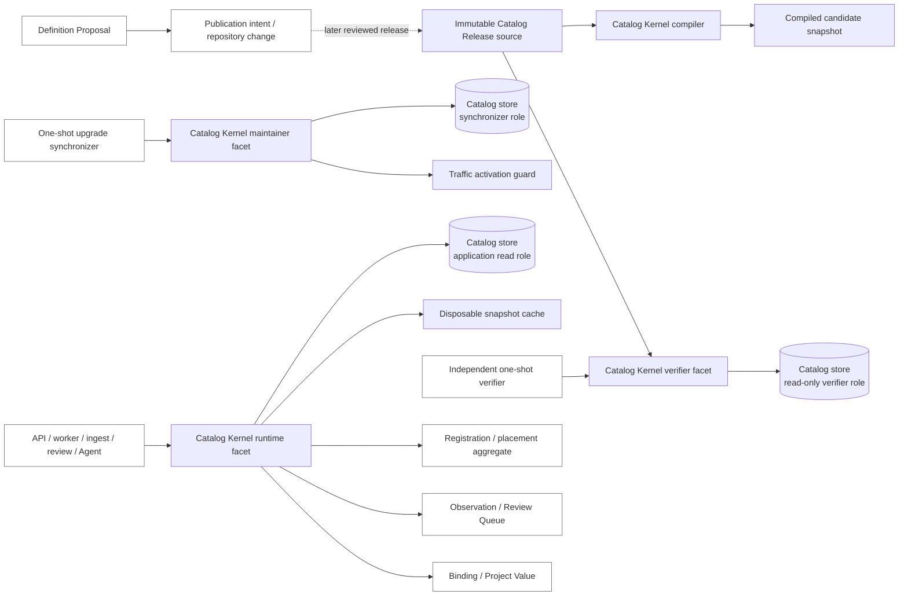

# Catalog Kernel Interface and Transaction Boundary

> Chinese: [中文](../zh-CN/design-docs/catalog-kernel-interface-and-transaction-boundary.md)

Status: accepted target contract for [Choose the catalog kernel interface and transaction boundary](https://github.com/tzrea1-Q/WiseEff/issues/673). It is an implementation-specification input for the catalog replacement in [Wayfinder: replace the parameter catalog with one canonical definition model](https://github.com/tzrea1-Q/WiseEff/issues/668), not a claim that the current runtime implements this module.

This decision consumes the accepted ADR-0040/0041/0042 superset at [`9fe269d4facc31b49fc1e0535d2d51ba7140644b`](https://github.com/tzrea1-Q/WiseEff/tree/9fe269d4facc31b49fc1e0535d2d51ba7140644b). Those decisions remain authoritative for domain and relational semantics. This document decides the deep module seam, types, transaction ownership, permissions, cache behavior, and test surface. It creates no production code, migration, HTTP route, UI, or implementation ticket and reserves no ADR number.

## Decision summary

The **Catalog Kernel** is one routes-less deep module. It owns deterministic Catalog Release compilation, full release validation, atomic materialization, exact release snapshots, selector matching, definition lookup, independent materialization verification, and disposable snapshot caches behind one public seam. Callers never coordinate catalog tables, pass an open transaction, select a revision head, apply aliases, or infer current lifecycle.

The seam has six operations:

1. `compilePublishedRelease` compiles and validates an immutable release source without database writes.
2. `installPublishedRelease` validates again and installs a bootstrap or successor release in one kernel-owned transaction.
3. `switchBackBeforeTraffic` performs the narrowly permitted, proof-gated pre-traffic switch-back; it cannot be used after candidate writes or traffic.
4. `verifyCurrentMaterialization` independently recompiles the artifact and compares it with the database through a read-only verifier adapter.
5. `loadCurrentCatalog` loads one verified, expected current snapshot.
6. `loadPinnedCatalog` loads one exact historical release by both opaque ID and digest.

`CurrentCatalogSnapshot` and `PinnedCatalogSnapshot` expose current release identity, authoritative Driver-first/NodeType-fallback matching, one definition lookup, and per-subject definition listing. They return tagged domain outcomes rather than `null`. PostgreSQL layout, joins, locks, cache objects, materialization fingerprints, and release-to-revision-head mappings are private implementation.

## Module seam and ownership

### Inside the Catalog Kernel

- Read raw manifest and manifest-listed content through an immutable `CatalogReleaseSource` adapter.
- Normalize and compile deterministically, validate per-file and aggregate digests, and reject missing, unlisted, malformed, duplicated, reassigned, incomplete, or non-deterministic content.
- Validate predecessor lineage, complete subject and alias membership, lifecycle/tombstone pairing, permanent selector ownership, stable subject/property identity, and complete definition snapshots.
- Materialize Catalog Release, Catalog subject, release membership, stable alias ownership, alias membership, Parameter definition, and immutable Definition revision state.
- Persist enough exact per-release head provenance to reproduce a release snapshot and a permitted pre-traffic switch-back without using timestamps, maximum revision numbers, or current heads as history.
- Own the exclusive catalog synchronization lock, transaction, idempotency recheck, Definition revision head advancement, current release pointer switch, and success audit/materialization evidence.
- Build immutable current and pinned read snapshots, including selector and alias indexes, subject lifecycle, definition identities, and exact revisions.
- Implement authoritative matching: active Driver `compatible` candidates are evaluated first; NodeType normalized-name fallback is considered only when there is no Driver match.
- Independently verify the compiled release against the full database projection through a read-only adapter that does not trust writer bookkeeping.
- Own process-local snapshot cache construction, release-key selection, and invalidation behavior.

### Outside the Catalog Kernel

- Repository review, Catalog Release authoring, artifact packaging/signing, and publication workflow. The kernel consumes an immutable published source; it does not decide what should be published.
- Database DDL, role creation, grants, and legacy-data transformation. The migration owner creates the physical model; the kernel owns steady-state catalog materialization after that model exists.
- Definition Proposal review and acceptance. It may produce publication intent or a repository change only.
- Organization Subject registration and Subject placement. Those aggregates use catalog reads and Match results but own their separate organization-scoped transactions and trusted audit.
- Parameter Observation persistence, Review Queue workflow, Binding, governed Binding-revision cutover, Project Value, and history writes.
- Ordinary HTTP, ingest, review, Agent, script, and background-job orchestration. These callers may invoke a role-appropriate kernel facet but cannot coordinate catalog writes themselves.
- Legacy-ID mapping/archive policy, migration phases, maintenance freeze, traffic state, recovery-point restore, route/DTO compatibility, readiness policy, observability thresholds, and legacy deletion gates. Later decisions consume the kernel proof surfaces without moving these responsibilities inside it.

### Dependency diagram



`CatalogReleaseSource`, catalog store, traffic activation guard, and cache are internal adapters. They are test seams, not application-facing coordination interfaces. The production Catalog Kernel takes a pool-backed `RootDatabase` at construction. It rejects a transaction/savepoint handle, and no public operation accepts `Database`, `Queryable`, or a caller callback.

## Public interface sketch

The following TypeScript is normative at the semantic level. An implementation may rename files or fields, but it must preserve the six operations, role-shaped capability restriction, tagged results, and invariants.

```ts
type Result<T> =
  | { readonly ok: true; readonly value: T }
  | { readonly ok: false; readonly error: CatalogKernelError };

interface CatalogKernel {
  compilePublishedRelease(
    source: CatalogReleaseSource,
  ): Promise<Result<CompiledCatalogRelease>>;

  installPublishedRelease(
    command: InstallPublishedReleaseCommand,
  ): Promise<Result<InstallResult>>;

  switchBackBeforeTraffic(
    command: PreTrafficSwitchBackCommand,
  ): Promise<Result<SwitchBackResult>>;

  verifyCurrentMaterialization(
    command: VerifyCurrentMaterializationCommand,
  ): Promise<Result<VerificationResult>>;

  loadCurrentCatalog(
    expected: CatalogReleasePin,
  ): Promise<Result<CurrentCatalogSnapshot>>;

  loadPinnedCatalog(
    pin: CatalogReleasePin,
  ): Promise<Result<PinnedCatalogSnapshot>>;
}

type CatalogRuntime = Pick<
  CatalogKernel,
  "loadCurrentCatalog" | "loadPinnedCatalog"
>;

type CatalogMaintainer = Pick<
  CatalogKernel,
  | "compilePublishedRelease"
  | "installPublishedRelease"
  | "switchBackBeforeTraffic"
>;

type CatalogVerifier = Pick<
  CatalogKernel,
  "compilePublishedRelease" | "verifyCurrentMaterialization" | "loadPinnedCatalog"
>;
```

These facets are restricted views of one module interface, not three implementations. Runtime composition receives only `CatalogRuntime`; the one-shot synchronizer receives `CatalogMaintainer`; the independent verifier receives `CatalogVerifier`. Database grants remain the security boundary even if application import discipline is bypassed.

### Release source and commands

```ts
interface CatalogReleaseSource {
  readManifest(): Promise<Uint8Array>;
  listEntries(): Promise<readonly string[]>;
  readEntry(path: string): Promise<Uint8Array>;
}

type InstallPublishedReleaseCommand =
  | {
      readonly mode: "bootstrap";
      readonly source: CatalogReleaseSource;
      readonly expectedTargetDigest: CatalogReleaseDigest;
    }
  | {
      readonly mode: "advance";
      readonly source: CatalogReleaseSource;
      readonly expectedCurrent: CatalogReleasePin;
      readonly expectedTargetDigest: CatalogReleaseDigest;
    };

interface PreTrafficSwitchBackCommand {
  readonly maintenanceAttemptId: MaintenanceAttemptId;
  readonly expectedCurrent: CatalogReleasePin;
  readonly targetPrevious: CatalogReleasePin;
}

interface VerifyCurrentMaterializationCommand {
  readonly source: CatalogReleaseSource;
  readonly expected: CatalogReleasePin;
}

interface CatalogReleaseCounts {
  readonly subjects: number;
  readonly subjectMemberships: number;
  readonly aliases: number;
  readonly aliasMemberships: number;
  readonly definitions: number;
  readonly definitionRevisions: number;
}

type InstallResult =
  | {
      readonly status: "installed";
      readonly mode: "bootstrap" | "advance";
      readonly previous: CatalogReleasePin | null;
      readonly current: CatalogReleaseIdentity;
      readonly materializationFingerprint: CatalogMaterializationFingerprint;
      readonly counts: CatalogReleaseCounts;
    }
  | {
      readonly status: "already-current";
      readonly current: CatalogReleaseIdentity;
      readonly materializationFingerprint: CatalogMaterializationFingerprint;
      readonly counts: CatalogReleaseCounts;
    };

interface SwitchBackResult {
  readonly status: "switched-back";
  readonly maintenanceAttemptId: MaintenanceAttemptId;
  readonly previousCurrent: CatalogReleaseIdentity;
  readonly current: CatalogReleaseIdentity;
  readonly materializationFingerprint: CatalogMaterializationFingerprint;
}
```

`CatalogReleaseSource` exposes bytes and an entry inventory so the compiler can detect missing/unlisted content and perform its own path and digest validation. A source never supplies a trusted parsed model. The filesystem/bundled-artifact adapter and deterministic fake are the two required adapters.

`installPublishedRelease` compiles and validates the source internally even if CI already called `compilePublishedRelease`. The caller cannot submit handcrafted normalized rows or a caller-approved digest. `expectedTargetDigest` must equal the compiler result. `advance` also compare-and-swaps against `expectedCurrent` after taking the synchronization lock.

`switchBackBeforeTraffic` accepts identifiers, not a caller-provided `trafficStarted: false` assertion. The kernel verifies durable maintenance-attempt state through its internal traffic activation guard while holding the catalog lock. The guard contract is supplied by the cutover design; it must prove no candidate business write and no public/queue traffic occurred.

### Snapshot interface

```ts
interface CatalogSnapshot {
  readonly release: CatalogReleaseIdentity;

  resolveSubject(selector: SubjectSelector): MatchResult;

  getDefinition(input: {
    readonly subjectId: CatalogSubjectId;
    readonly propertyKey: PropertyKey;
  }): DefinitionLookupResult;

  listDefinitions(
    subjectId: CatalogSubjectId,
  ): DefinitionListResult;
}

interface CurrentCatalogSnapshot extends CatalogSnapshot {
  readonly snapshotKind: "current";
  readonly materializationFingerprint: CatalogMaterializationFingerprint;
}

interface PinnedCatalogSnapshot extends CatalogSnapshot {
  readonly snapshotKind: "pinned";
  readonly pin: CatalogReleasePin;
}

interface CompiledCatalogRelease {
  readonly release: CatalogReleaseIdentity;
  readonly predecessor: CatalogReleasePin | null;
  readonly aggregateDigest: CatalogReleaseDigest;
  readonly materializationFingerprint: CatalogMaterializationFingerprint;
  readonly counts: CatalogReleaseCounts;
  readonly candidateSnapshot: CatalogSnapshot;
}
```

A snapshot is immutable and side-effect free after loading. All three query methods are synchronous against the captured model, so one operation cannot mix releases. A known active subject with no definitions returns `found` with an empty list. No lookup returns `null` or an empty object to represent unknown, retired, ambiguous, or not-yet-published state.

The compiler's candidate snapshot lets migration planning resolve strong evidence against the target release without installing it or switching the production pointer. It does not confer publication authority and cannot be used as a runtime cache.

## Nominal types and domain results

Opaque IDs and digests use branded types. HTTP strings, SQL text, paths, natural keys, and content hashes cannot be passed where a domain identity is required without validation at the adapter boundary.

```ts
declare const brand: unique symbol;
type Brand<T, Name extends string> = T & { readonly [brand]: Name };

type CatalogReleaseId = Brand<string, "CatalogReleaseId">;
type CatalogReleaseDigest = Brand<string, "CatalogReleaseDigest">;
type CatalogReleaseVersion = Brand<string, "CatalogReleaseVersion">;
type CatalogMaterializationFingerprint = Brand<
  string,
  "CatalogMaterializationFingerprint"
>;
type CatalogSubjectId = Brand<string, "CatalogSubjectId">;
type CatalogAliasId = Brand<string, "CatalogAliasId">;
type ParameterDefinitionId = Brand<string, "ParameterDefinitionId">;
type DefinitionRevisionId = Brand<string, "DefinitionRevisionId">;
type PropertyKey = Brand<string, "PropertyKey">;
type DriverCompatible = Brand<string, "DriverCompatible">;
type NormalizedNodeTypeName = Brand<string, "NormalizedNodeTypeName">;
type MaintenanceAttemptId = Brand<string, "MaintenanceAttemptId">;

type CatalogSubjectKind = "driver" | "node-type";
type SubjectLifecycle = "active" | "retired";

interface CatalogReleaseIdentity {
  readonly id: CatalogReleaseId;
  readonly version: CatalogReleaseVersion;
  readonly digest: CatalogReleaseDigest;
}

interface CatalogReleasePin {
  readonly id: CatalogReleaseId;
  readonly digest: CatalogReleaseDigest;
}

interface SubjectSelector {
  readonly driverCompatibles: readonly DriverCompatible[];
  readonly nodeTypeFallback:
    | { readonly kind: "present"; readonly name: NormalizedNodeTypeName }
    | { readonly kind: "absent" };
}

interface SubjectAlias {
  readonly id: CatalogAliasId;
  readonly selector:
    | { readonly kind: "driver-compatible"; readonly value: DriverCompatible }
    | { readonly kind: "node-type-name"; readonly value: NormalizedNodeTypeName };
  readonly subjectId: CatalogSubjectId;
  readonly lifecycle: SubjectLifecycle;
}
```

`SubjectSelector` contains the full matcher input. The caller cannot invoke a NodeType lookup after ignoring an ambiguous Driver result. The kernel evaluates active Driver candidates first. It evaluates `nodeTypeFallback` only when the Driver candidate set is empty. Canonical selectors and one-hop aliases use the same captured release memberships; current aliases are never applied to a pinned snapshot.

### Match and lookup results

```ts
interface CatalogSubjectSnapshot {
  readonly id: CatalogSubjectId;
  readonly kind: CatalogSubjectKind;
  readonly lifecycle: SubjectLifecycle;
}

type DefinitionLifecycle = "active" | "deprecated" | "retired";

type OptionalValue<T> =
  | { readonly kind: "present"; readonly value: T }
  | { readonly kind: "absent" };

interface DefinitionContent {
  readonly lifecycle: DefinitionLifecycle;
  readonly displayName: string;
  readonly description: OptionalValue<string>;
  readonly documentation: OptionalValue<string>;
  readonly valueShape: ParameterValueShape;
  readonly constraints: ParameterConstraints;
  readonly unit: OptionalValue<UnitDescriptor>;
  readonly schemaDefault: OptionalValue<ParameterValue>;
  readonly examples: readonly ParameterValue[];
  readonly matching: DefinitionMatchingMetadata;
}

interface ParameterDefinitionSnapshot {
  readonly id: ParameterDefinitionId;
  readonly subjectId: CatalogSubjectId;
  readonly propertyKey: PropertyKey;
  readonly revisionId: DefinitionRevisionId;
  readonly revisionContentDigest: Brand<string, "DefinitionContentDigest">;
  readonly content: Readonly<DefinitionContent>;
}

type MatchResult =
  | {
      readonly status: "matched";
      readonly subject: CatalogSubjectSnapshot;
      readonly matchedBy: "canonical-selector" | "alias";
      readonly alias: SubjectAlias | null;
    }
  | {
      readonly status: "unknown";
      readonly reason: "no-candidate";
    }
  | {
      readonly status: "ambiguous";
      readonly candidates: readonly CatalogSubjectSnapshot[];
    }
  | {
      readonly status: "retired";
      readonly subject: CatalogSubjectSnapshot;
      readonly alias: SubjectAlias | null;
    }
  | {
      readonly status: "not-published";
      readonly firstPublishedIn: CatalogReleaseIdentity;
      readonly subjectId: CatalogSubjectId;
    };

type DefinitionLookupResult =
  | { readonly status: "found"; readonly definition: ParameterDefinitionSnapshot }
  | { readonly status: "unknown"; readonly target: "subject" | "property" }
  | {
      readonly status: "retired";
      readonly target: "subject" | "definition";
      readonly definition: ParameterDefinitionSnapshot | null;
    }
  | {
      readonly status: "not-published";
      readonly target: "subject" | "definition";
      readonly firstPublishedIn: CatalogReleaseIdentity;
    };

type DefinitionListResult =
  | {
      readonly status: "found";
      readonly subject: CatalogSubjectSnapshot;
      readonly definitions: readonly ParameterDefinitionSnapshot[];
    }
  | { readonly status: "unknown"; readonly target: "subject" }
  | {
      readonly status: "retired";
      readonly subject: CatalogSubjectSnapshot;
      readonly definitions: readonly ParameterDefinitionSnapshot[];
    }
  | {
      readonly status: "not-published";
      readonly firstPublishedIn: CatalogReleaseIdentity;
    };
```

The only intentional nullable fields are values whose absence is part of a successful variant: bootstrap has no predecessor, a canonical match has no alias, and a retired subject may prevent a definition snapshot from being returned. Unknown, ambiguous, retired, and not-published are ordinary domain outcomes. They are not exceptions, `404` assumptions, or permission decisions.

For pinned replay, `not-published` means the stable identity first appears after the pinned release. A malformed or lineage-inconsistent release is not `not-published`; it is `invalid-release` or `drift`. An invalid selector encoding is an `invalid-selector` error rather than an `unknown` match.

`ParameterValueShape`, `ParameterConstraints`, `UnitDescriptor`, `ParameterValue`, and `DefinitionMatchingMetadata` are closed tagged domain types shared with value validation; none may be implemented as an unvalidated string or `Record<string, unknown>`. This ticket fixes their containment in an immutable Definition revision but does not redesign their already-owned value-shape semantics.

## Error taxonomy

```ts
type CatalogKernelError =
  | {
      readonly kind: "invalid-release";
      readonly phase: "source" | "compile" | "lineage" | "install-preflight";
      readonly violations: readonly CatalogReleaseViolation[];
    }
  | {
      readonly kind: "drift";
      readonly scope: "current" | "pinned" | "candidate-install";
      readonly expected: CatalogReleasePin;
      readonly actual: CatalogReleaseIdentity | null;
      readonly violations: readonly CatalogDriftViolation[];
    }
  | {
      readonly kind: "release-mismatch";
      readonly expected: CatalogReleasePin;
      readonly actual: CatalogReleaseIdentity | null;
    }
  | {
      readonly kind: "digest-conflict";
      readonly releaseId: CatalogReleaseId;
      readonly expected: CatalogReleaseDigest;
      readonly actual: CatalogReleaseDigest;
    }
  | {
      readonly kind: "unsupported-lineage";
      readonly installed: CatalogReleaseIdentity | null;
      readonly target: CatalogReleaseIdentity;
      readonly reason: "gap" | "wrong-predecessor" | "stale-expected-current";
    }
  | {
      readonly kind: "synchronization-busy";
      readonly retryable: true;
    }
  | {
      readonly kind: "historical-release-unavailable";
      readonly pin: CatalogReleasePin;
    }
  | {
      readonly kind: "switch-back-forbidden";
      readonly reason:
        | "traffic-observed"
        | "candidate-write-observed"
        | "previous-projection-invalid"
        | "migration-incompatible";
    }
  | {
      readonly kind: "invalid-selector";
      readonly field: "driver-compatible" | "node-type-name" | "property-key";
    }
  | { readonly kind: "permission-denied"; readonly operation: string }
  | {
      readonly kind: "storage-failure";
      readonly operation: string;
      readonly retryable: boolean;
    };

type CatalogReleaseViolationCode =
  | "manifest-unreadable"
  | "entry-missing"
  | "entry-unlisted"
  | "unsafe-entry-path"
  | "file-digest-mismatch"
  | "aggregate-digest-mismatch"
  | "schema-invalid"
  | "normalization-nondeterministic"
  | "duplicate-stable-identity"
  | "stable-key-reassigned"
  | "alias-collision"
  | "alias-owner-mismatch"
  | "alias-chain-forbidden"
  | "predecessor-mismatch"
  | "membership-omitted"
  | "lifecycle-tombstone-mismatch"
  | "definition-snapshot-incomplete"
  | "revision-derivation-invalid";

interface CatalogReleaseViolation {
  readonly code: CatalogReleaseViolationCode;
  readonly location: OptionalValue<string>;
  readonly subjectId: OptionalValue<CatalogSubjectId>;
  readonly detail: string;
}

type CatalogDriftViolationCode =
  | "release-identity-mismatch"
  | "materialization-fingerprint-mismatch"
  | "subject-root-mismatch"
  | "subject-membership-mismatch"
  | "alias-owner-mismatch"
  | "alias-membership-mismatch"
  | "definition-identity-mismatch"
  | "definition-revision-mismatch"
  | "definition-head-mismatch"
  | "release-head-provenance-mismatch"
  | "unexpected-catalog-row"
  | "organization-owned-catalog-row"
  | "current-pointer-mismatch";

interface CatalogDriftViolation {
  readonly code: CatalogDriftViolationCode;
  readonly relation: string;
  readonly identity: string;
  readonly detail: string;
}
```

`invalid-release` means the immutable input cannot be a valid release. `drift` means a valid expected release and the database projection disagree. `release-mismatch` means the database may be internally valid but is not the artifact the process expects. These conditions must not collapse into a generic unavailable or not-found error.

`VerificationResult` is returned only after every independent check succeeds:

```ts
interface VerificationResult {
  readonly status: "verified";
  readonly release: CatalogReleaseIdentity;
  readonly materializationFingerprint: CatalogMaterializationFingerprint;
  readonly verifiedAt: string;
  readonly checks: readonly CatalogVerificationCheck[];
  readonly counts: CatalogReleaseCounts;
}

type CatalogVerificationCheck = {
  readonly code:
    | "compiled-release"
    | "release-lineage"
    | "subject-memberships"
    | "alias-memberships"
    | "definition-revisions"
    | "definition-heads"
    | "release-head-provenance"
    | "current-pointer"
    | "materialization-fingerprint"
    | "organization-structural-absence";
  readonly status: "passed";
};
```

Any invalid source or comparison mismatch returns `Result.ok = false` with `invalid-release` or `drift`. There is no partially verified success and no warning mode that permits startup.

## Transaction ownership and concurrency

Every catalog mutation is owned by the Catalog Kernel. Public operations accept domain commands only. The production adapter requires a pool-backed `RootDatabase`; a caller-opened transaction, savepoint handle, `AuditTx`, or arbitrary `Queryable` is rejected at construction. This is stricter than merely documenting “do not pass a transaction”: it makes the caller unable to stretch, nest, partially commit, or bypass the catalog transaction.

Compilation and content validation run before the write transaction. Installation then opens one transaction, obtains the exclusive transaction-scoped advisory catalog lock, locks the singleton current-state row where it exists, re-reads installed state, rechecks idempotency and lineage, stages the entire projection, runs deferred constraints and the independent-in-transaction projection checks, advances all changed Definition heads, and switches the current Catalog Release pointer. Success audit and materialization evidence commit in that same transaction.

Failed-attempt operational evidence may commit separately through a pool-owned refusal/milestone path, but it must identify the failed attempt and must never look like a release, Definition revision, current head, or successful installation.

| Case | Lock and idempotency | Atomic commit contract | Failure/recovery result |
| --- | --- | --- | --- |
| First release | Explicit `bootstrap`; exclusive catalog advisory lock; database must have no installed release; target digest is the idempotency key | Release, stable roots, complete memberships, definitions, first revisions, exact release-head provenance, Definition heads, singleton pointer, fingerprint, and success audit commit together | Any existing unknown state or source failure aborts; retry after committed-but-unacknowledged success becomes verified same-digest no-op |
| Successor release | Compile first; under lock compare `expectedCurrent` and declared predecessor to the installed pin | New roots/memberships/revisions and all changed heads commit with the one pointer switch | Stale current or lineage gap returns `unsupported-lineage`; old pointer and heads remain |
| Active -> retired | Successor release supplies explicit retired membership and tombstone | Membership and pointer switch commit together; stable subject/definition/history remain | Omission, missing tombstone, or in-place root lifecycle update is `invalid-release` |
| Retired -> restored | Successor release supplies active membership for the same stable subject/alias owners | Same IDs become current-active only through the pointer switch | New ID/key allocation or alias reassignment aborts |
| Alias introduction/retirement | Stable selector ownership key plus release digest; permanent owner uniqueness checked under install lock | Stable alias root when new and complete release alias membership commit with release | Alias chain, collision, reassignment, omission, or tombstone mismatch aborts |
| Definition head advancement | Changed normalized content digest determines exactly one new revision; unchanged content creates none | Immutable revisions and every affected `current_revision_id` advance in the release transaction | Failure at any head leaves all heads and pointer unchanged; documentation-only change never touches Binding/Project Value |
| Current pointer switch | Singleton row locked; target projection and exact release-head map verified before update | One final atomic visibility point for release pointer and Definition heads | Concurrent readers anchored to a captured pin see complete old or new snapshot only |
| Same digest replay | Acquire catalog lock, re-read and independently verify the installed fingerprint | Read-only verified no-op; no new row, audit-success duplicate, revision, or head change | Any differing normalized content behind the same ID/version/digest is `digest-conflict` or `drift` |
| Concurrent synchronization | Exclusive advisory lock with bounded wait; second contender re-evaluates after acquiring it | Same target becomes no-op; only one valid successor can commit | Different stale successor returns `unsupported-lineage`; lock timeout returns retryable `synchronization-busy`; never split heads |
| Failure before staging | No write transaction is opened for invalid source/compiler output | No catalog-domain write | `invalid-release`; optional failed-attempt evidence only |
| Failure after staging, before commit | Transaction rollback covers roots, memberships, revisions, heads, pointer, fingerprint, and success audit | Zero candidate catalog state is durable | Retry is deterministic; previous release remains current |
| Commit succeeds, response is lost | Digest is the durable idempotency key | Already-committed complete release remains | Retry verifies the exact digest and returns no-op rather than duplicating revisions |
| Pre-traffic switch-back | Exclusive lock; command pins current and previous; durable guard proves no candidate write/traffic and migration compatibility; previous projection and recorded head map reverify | Previous pointer and its exact recorded Definition heads switch atomically; immutable releases/memberships/revisions are untouched | Any failed proof returns `switch-back-forbidden`; no partial rewind |
| After candidate writes or traffic | The guard refuses pointer/head rewind | No catalog rollback transaction is opened | Use a new forward Catalog Release or the cutover owner's verified recovery-point restore; the kernel never performs runtime lazy repair |

The exact advisory-lock number and physical release-head representation are implementation details. The requirements are a repository-wide unique catalog lock, bounded acquisition, state recheck under lock, exact release-head provenance, and one atomic commit.

## Database ownership and write isolation

| Principal | Allowed catalog capability | Forbidden catalog capability |
| --- | --- | --- |
| Non-login migration owner | Own tables/functions; execute DDL and grants only in the migration phase | Ordinary runtime login; release publication; business traffic |
| Catalog synchronizer role | One-shot insert of new immutable catalog rows; column-limited update of current release and Definition heads; success/attempt evidence needed by installation | DDL; UPDATE/DELETE of immutable release, subject, alias, membership, or revision rows; organization/proposal/business writes |
| Application read role | SELECT through the kernel's current and pinned projection queries/views | INSERT/UPDATE/DELETE on every catalog relation; synchronizer-role membership |
| Proposal role | Read current catalog through `CatalogRuntime`; write Proposal/publication-intent and its trusted audit in proposal-owned relations | Any Catalog subject, release, membership, alias, Definition, Revision, head, or pointer mutation |
| Ordinary API/worker role | Application catalog reads plus its separately granted Observation, Registration, Binding, Project Value, or workflow writes | Catalog materialization, synchronizer credential use, DDL, runtime repair |
| Independent verifier role | Read all catalog projection, constraints, and fingerprints needed for comparison; enforce read-only transactions | All writes, sequence use, role assumption, synchronizer functions |

Catalog relations are owned by the non-login migration owner. No ordinary login inherits the synchronizer role. Immutable relations revoke UPDATE and DELETE even from the synchronizer. Pointer/head updates are column-granted or exposed through a tightly owned kernel statement, not table-wide update grants. Legacy organization overlay/definition relations become non-writable to production roles at cutover; the bounded migration principal remains separate from the steady-state synchronizer.

The database is the final proof that Proposal, ingest, review, HTTP, Agent, script, and worker code cannot form a second materialization path. Static import/SQL ratchets supplement but do not replace role-negative PostgreSQL tests.

## Cache and runtime contract

- Cache construction belongs to the Catalog Kernel. Callers receive immutable snapshots, never a mutable registry, raw rows, join helpers, or cache invalidation hooks.
- A current-cache key contains `snapshotKind=current`, exact `CatalogReleaseId`, `CatalogReleaseDigest`, and verified `CatalogMaterializationFingerprint`. It contains no Organization, overlay, precedence, filesystem path, process start time, or “latest” token.
- A pinned-cache key contains `snapshotKind=pinned`, exact release ID, digest, and verified fingerprint in a physically separate namespace. A pinned entry can never satisfy a current lookup and a current entry can never reinterpret pinned history.
- `loadCurrentCatalog(expected)` reads the database's current identity/fingerprint first. That cheap pointer read selects the cache key, so the first load after a pointer switch cannot return an old snapshot. A snapshot already handed to an in-flight operation remains valid and consistently pinned to its old release.
- A cache miss may read the database and build a snapshot only after its release membership, revision-head provenance, and fingerprint validate. It may not parse YAML, fetch a network artifact, compose an Organization overlay, return an empty catalog, or synthesize missing rows.
- Startup and ordinary process restart call `loadCurrentCatalog` with the packaged expected ID/digest. Mismatch, drift, unavailable history, or invalid release keeps the process not-ready or causes it to exit according to the later readiness decision.
- `LISTEN/NOTIFY` or an in-process generation counter may accelerate eviction but is not correctness. Pointer-read key selection is the correctness mechanism.
- Runtime repair is forbidden. Cache deletion/rebuild is permitted; database mutation, alias inference, row insertion, head selection, or pointer movement on a read/cache miss is not.

The cache is a performance copy of a verified projection. Removing it changes latency, not results or authority.

## Test seams and acceptance matrix

Internal adapters exist only where behavior truly varies:

- `CatalogReleaseSource`: packaged filesystem/artifact adapter and deterministic in-memory fake.
- Catalog store: PostgreSQL adapter and an interface contract harness; transaction atomicity and permissions still require real PostgreSQL.
- Traffic activation guard: production maintenance-attempt adapter and deterministic fake for switch-back policy tests.
- Snapshot cache: production bounded cache and no-cache test adapter.
- Failure injector: test-only wrapper around internal materialization steps; it is never exported by production composition.

The compiler, matcher, normalized model, lookup behavior, and error classification remain ordinary in-process implementation tested through the public seam; they do not receive speculative ports.

| Test layer | Required scenario | Observable assertion through the seam |
| --- | --- | --- |
| Deterministic compiler | Same source with permuted enumeration; missing/unlisted file; bad digest; duplicate/reassigned ID/selector; predecessor omission; bad tombstone | Same compiled digest/snapshot for equivalent input; otherwise `invalid-release` before writes |
| Fake immutable source | Source bytes change between inventory and read, path escapes, duplicate names, read failure | Compile fails closed; no parsed-source trust or partial candidate |
| Snapshot matching | Driver unique, Driver ambiguous, no Driver then NodeType, alias, retired alias/subject, unknown, pre-publication pinned release | Exact `MatchResult`; current aliases never affect pinned replay |
| Definition lookup | Found, unknown subject, unknown property, retired subject/definition, not yet published, known subject with zero definitions | Exact non-null tagged result and release-correct revision ID |
| Install failure injection | Before first write; after each staged relation family; after revisions; before heads; between heads and pointer; before commit | Every failed call leaves previous pointer, every head, counts, and fingerprint unchanged |
| Idempotency | Same digest repeat, lost response retry, same ID/version with changed bytes | Verified no-op or `digest-conflict`; never duplicate revision |
| Concurrent synchronizer | Independent sessions install same target and different competing successors | One commit plus one no-op or lineage error; no partial/mixed head |
| Current/pinned resolver | Switch active -> retired -> restored while retaining release A snapshot | Current changes by pointer; pinned A stays byte-for-byte stable |
| Independent verifier | Remove/add/mutate membership, alias owner, tombstone, Definition revision/head, release-head provenance, fingerprint, or current pointer | Read-only `drift` with exact violation; zero repair writes |
| Role permissions | Direct SQL as proposal, API/worker, application read, verifier, synchronizer, migration owner | Only declared grants succeed; synchronizer cannot UPDATE/DELETE immutable rows; verifier transaction proves read-only |
| PostgreSQL constraints | Owner/composite FKs, permanent keys, immutable rows, release completeness, revision head ownership, exact release-head provenance | Violations fail at `SET CONSTRAINTS ALL IMMEDIATE` or commit |
| Atomic visibility | Reader sessions span pointer switch | Each captured snapshot is entirely old or entirely new |
| Pre-traffic switch-back | Valid proof; candidate write; traffic; invalid prior projection; migration incompatibility | Exact atomic switch-back only for valid proof; otherwise `switch-back-forbidden` and no state change |
| Cache | Cold load, pointer change, corrupt fingerprint, pinned/current same digest identity edge, eviction | DB-backed rebuild only; correct namespace/key; drift never becomes cache data |

All PostgreSQL ownership, FK, deferred-constraint, concurrency, and atomicity tests use real PostgreSQL and independent sessions. An in-memory database is not release evidence for this module.

## Contracts handed to later Wayfinder decisions

### Choose the parameter API and legacy-identifier transition

That decision receives:

- `CatalogRuntime`, `CatalogReleaseIdentity`, `CatalogReleasePin`, `CatalogSubjectId`, `ParameterDefinitionId`, and `DefinitionRevisionId` as the stable server-side vocabulary.
- `loadCurrentCatalog(expected)`, exact pinned replay, `MatchResult`, `DefinitionLookupResult`, and `DefinitionListResult`; HTTP callers never join catalog relations or select heads.
- Normal distinction among `unknown`, `ambiguous`, `retired`, and `not-published`; failure distinction among `invalid-release`, `drift`, `release-mismatch`, and unavailable history.
- Read-only runtime capability for HTTP, Agent, ingest, review, debug, and reload consumers. No route may receive an install, head-update, overlay-write, or runtime-repair method.

That decision still owns route names, DTOs, HTTP status/error mapping, authorization, legacy-ID response behavior, deprecation duration, internal diagnostics, and consumer-by-consumer transition. A kernel outcome does not prescribe a `404`, `409`, `410`, or `503` response.

### Choose populated-data cutover, archive, and rollback strategy

That decision receives:

- deterministic candidate compilation and candidate-snapshot lookup for strong-evidence mapping without installation;
- `installPublishedRelease` bootstrap/advance compare-and-swap, exact digest idempotency, complete atomicity, and structured install result/fingerprint;
- exact current/pinned definition lookup for mapping retained legacy IDs to one canonical target without property-key-only inference;
- the proof-gated `switchBackBeforeTraffic` seam and the explicit refusal after candidate writes/traffic;
- independent verification callable before traffic and after any permitted switch-back.

That decision still owns physical migration phases, R0-R10 conversion, legacy-ID map/archive schemas, freeze and dual-read procedure, maintenance-attempt/traffic ledger implementation, recovery-point restore, compatibility window, and legacy table/trigger deletion. The kernel never accepts a legacy row as Catalog Release input.

### Choose verification, upgrade, and legacy-retirement gates

That decision receives:

- `verifyCurrentMaterialization` through a distinct read-only role and comparison path;
- a success proof containing exact release identity/digest, materialization fingerprint, checks, and counts;
- structured `invalid-release`, `drift`, `release-mismatch`, historical-unavailable, permission, and storage failures;
- startup `loadCurrentCatalog(expected)` behavior that cannot repair or fall back to empty/cache-only state;
- the PostgreSQL, concurrency, pinned replay, role-negative, atomicity, and cache acceptance seams above.

That decision still owns upgrade ordering around migrations/synchronization, readiness endpoints and process policy, evidence retention, metrics and alerts, API/browser acceptance, fresh/populated target thresholds, rollback drills, and the final deletion threshold for legacy code/data.

## Rejected interface shapes

- **Expose repositories for releases, subjects, memberships, aliases, definitions, revisions, and heads.** Rejected as a shallow table-shaped interface that makes every caller reconstruct transaction ordering and lifecycle truth.
- **Expose compiler, synchronizer, matcher, verifier, and cache as peer application modules.** Rejected because orchestration would move back into startup, scripts, ingest, and HTTP. They are internal implementations/adapters of one deep module.
- **Accept a caller transaction for composability.** Rejected because a caller could split materialization from audit, nest it under unrelated business work, or hold catalog locks across unbounded operations. Catalog installation is the composition boundary.
- **Return `null` for misses and throw one generic catalog error.** Rejected because unknown, ambiguous, retired, not-published, invalid release, and drift lead to different safe behavior.
- **Use current rows plus max revision/timestamp for historical replay or switch-back.** Rejected because it silently reinterprets history and cannot restore an exact previous head set.
- **Let cache, YAML-on-miss, or an ordinary process repair the projection.** Rejected because each creates a second authority or a hidden write path.

## Closure self-check

| Required decision | Closed by |
| --- | --- |
| Module boundary | Inside/outside lists and dependency diagram |
| Compile/validate, install, verify, current/pinned loads | Six-operation `CatalogKernel` interface |
| Selector/alias, one definition, per-subject list, release identity | Immutable snapshot interface and nominal types |
| Not-published, retired, unknown, ambiguous, drift, invalid release | Tagged lookup results and `CatalogKernelError` |
| Bootstrap, successor, lifecycle, alias, revisions, pointer, replay, concurrency, failures, rollback | Transaction ownership table |
| Migration/synchronizer/read/proposal/API/verifier roles | Database ownership table and negative tests |
| Cache keys, startup digest, DB miss, invalidation, replay isolation, no repair | Cache and runtime contract |
| Fake source, deterministic compiler, failure injection, concurrency, verifier, resolver, permissions, PostgreSQL | Test seams and acceptance matrix |
| Minimal handoff to API, migration, verification decisions | Three bounded handoff sections |

No unresolved Catalog Kernel interface or transaction-boundary question remains. Physical schema names, route/DTO behavior, migration/archive phases, traffic ledger implementation, readiness policy, and deletion gates remain deliberately with their named later decisions.
