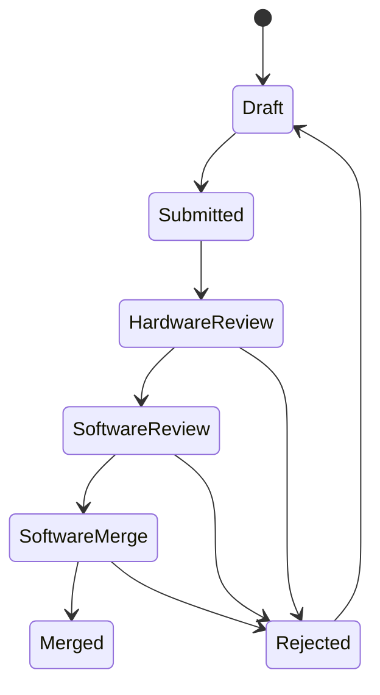
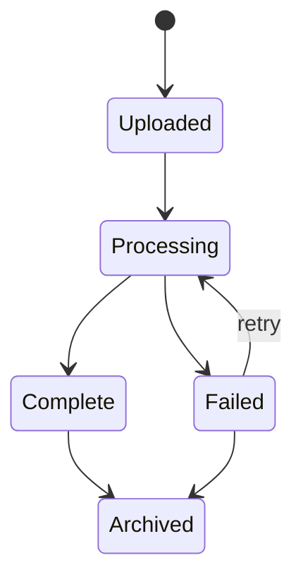

# WiseEff 领域模型设计

日期：2026-05-25

## 1. 建模原则

正式领域模型需要把当前前端原型里的展示数据拆成可持久化、可审计、可扩展的业务实体。

原则：

- 参数定义与项目参数值分离。
- 提交轮次与单条变更请求分离。
- 日志文件、分析任务、阶段和证据分离。
- 设备、调试参数、调试会话和节点操作分离。
- Agent 会话、消息、工具调用和审批分离。
- 所有跨域操作通过审计事件串联。

## 2. 核心实体

### 2.1 组织与用户

| 实体 | 说明 |
| --- | --- |
| `Organization` | 企业或租户边界 |
| `User` | 用户账号，绑定身份源和默认组织 |
| `Role` | 平台角色，如 Guest、User、Committer、Admin |
| `Permission` | 细粒度动作权限 |
| `UserRoleBinding` | 用户在组织或项目内的角色绑定 |

关键规则：

- 后端必须进行权限判断，前端权限只用于界面裁剪。
- 用户可以在不同项目内拥有不同角色。
- 停用用户不能执行任何写操作，但历史审计仍保留用户信息。

### 2.2 项目

| 实体 | 说明 |
| --- | --- |
| `Project` | 项目基础信息 |
| `ProjectModule` | 项目或参数模块 |
| `ProjectMember` | 项目成员和角色 |
| `ProjectInitializationDraft` | 项目参数初始化草稿 |
| `ProjectInitializationReview` | 初始化审阅记录 |

关键规则：

- 项目状态影响参数是否可编辑。
- 未初始化项目只能进入初始化流程，不允许普通参数变更。

### 2.3 参数管理

| 实体 | 说明 |
| --- | --- |
| `ParameterDefinition` | 参数定义，包含名称、说明、格式、模块、默认范围和风险 |
| `ProjectParameterValue` | 某项目下某参数的当前值、推荐值、范围和单位 |
| `ParameterHistoryEntry` | 参数值历史版本 |
| `ParameterDraft` | 用户未提交草稿 |
| `ParameterSubmissionRound` | 一次批量提交 |
| `ChangeRequest` | 单条参数变更请求 |
| `ReviewDecision` | 审阅意见和推进记录 |
| `ImportBatch` | 批量导入批次 |

参数变更状态机：

与现有原型状态映射：

| 原型状态 | 正式状态 |
| --- | --- |
| `待审阅` | `Submitted` |
| `硬件Committer检视` | `HardwareReview` |
| `软件Committer检视` | `SoftwareReview` |
| `软件User合入` | `SoftwareMerge` |
| `已合入` | `Merged` |
| `已打回` | `Rejected` |

一致性规则：

- 同一项目、同一参数不能有多个未完成变更请求。
- 合入时必须校验请求仍基于当前参数版本。
- 高风险参数必须至少一个 Committer 审阅。
- 合入成功必须新增参数历史并写审计事件。

### 2.4 日志分析

| 实体 | 说明 |
| --- | --- |
| `LogRecord` | 日志文件业务记录 |
| `LogFileObject` | 对象存储文件引用 |
| `LogAnalysisRun` | 一次分析任务 |
| `LogAnalysisStage` | 分析阶段进度 |
| `LogEvidence` | 证据行号、推断和建议动作 |
| `LogArchiveState` | 归档状态 |
| `LogFeedback` | 用户反馈 |

日志状态机：

规则：

- 上传记录与文件对象必须绑定。
- 不支持格式创建 `Failed` 记录，保留失败原因。
- 分析结果必须能追溯到具体 run 和 stage。
- 证据行号必须基于原始文本日志或解析后的稳定索引。

M2 implementation notes:

- `LogRecord.status` is `uploaded`, `processing`, `complete`, or `failed`; archive state is modeled separately as `active` or `archived`.
- A supported upload creates `LogFileObject`, `LogRecord`, one `LogAnalysisRun`, and one `jobs` row in a transaction. The worker later writes stages, report, evidence, and terminal job/run state.
- An unsupported upload creates `LogFileObject` and a terminal failed `LogRecord` without a run or job. The failure reason is preserved on the record.
- Archive/unarchive updates only `LogRecord.archive_state`; default list queries include only `active` records, and admin queries can request archived records with `includeArchived=true`.
- Feedback is append-only in `log_feedback` and linked to the log record plus audit event.

### 2.5 调试平台

| 实体 | 说明 |
| --- | --- |
| `Device` | 设备或样机 |
| `DeviceTarget` | 网关检测到的目标 |
| `DebugParameter` | 可调参数或节点定义 |
| `DebugSession` | 一次调试会话 |
| `DebugSnapshot` | 写入前快照 |
| `NodeOperation` | 读写节点操作 |
| `DebugEvent` | 会话事件 |

规则：

- 只读节点不能写入。
- 写入前必须检查设备在线、权限、访问模式和参数范围。
- 高风险写入必须确认。
- 写入操作必须记录目标值、回读值、验证结果和错误。
- 回滚必须引用快照。

### 2.6 Agent

| 实体 | 说明 |
| --- | --- |
| `AgentSession` | Agent 会话 |
| `AgentMessage` | 用户、助手和系统消息 |
| `AgentToolCall` | 工具调用申请或执行记录 |
| `AgentApproval` | 人工审批记录 |
| `AgentRunTrace` | 模型调用和工具执行 trace |

规则：

- Agent 上下文必须包含 pageKey、projectId、roleId 和用户身份。
- 工具调用必须声明权限和是否需要审批。
- 变更型工具调用未审批前不能执行。
- 工具执行结果必须关联审计事件。

### 2.7 审计

| 实体 | 说明 |
| --- | --- |
| `AuditEvent` | 统一审计事件 |
| `AuditOutbox` | 审计/通知可靠投递 |

审计事件字段：

- `id`
- `organizationId`
- `projectId`
- `actorUserId`
- `actorType`
- `app`
- `kind`
- `action`
- `severity`
- `targetType`
- `targetId`
- `metadata`
- `traceId`
- `createdAt`

规则：

- 业务写操作必须产生审计。
- 审计不可由普通业务接口修改。
- 审计查询需要权限过滤。
