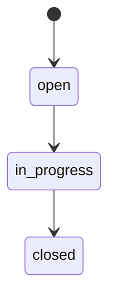

# WiseEff Domain Model

> Chinese: [Chinese](../zh-CN/design-docs/domain-model.md)

Date: 2026-05-25

## Modeling Principles

The product model separates prototype display data into durable, auditable business entities. Parameter definitions differ from project parameter values; submission rounds differ from individual change requests; log files, analysis runs, stages, and evidence are separate; devices, sessions, snapshots, and node operations are separate; Agent sessions, messages, tool calls, approvals, and traces are separate.

## Core Domains

- Organization and users define tenant boundaries, identity source bindings, role bindings, and disabled-user behavior.
- Projects group modules, members, and workflow state.
- `ParameterModule` (org-scoped tree) is the source of truth for parameter taxonomy; `ProjectModule` mirrors per-project module metadata for governance counts.
- Parameter management centers on definitions, project values, drafts, submission rounds, change requests, review decisions, imports, history, and audit.
- Parameter and debugging **module taxonomies** are independent org-scoped trees (`parameter_modules`, `debug_node_modules`) with `parent_id` and materialized `path`. Parameters and logical debug nodes attach by `module_id` FK; filters accept `moduleId` with subtree include (parent selection returns descendants). Legacy flat `module` text columns remain transitional (TD-037 follow-up).
- Log analysis separates uploaded object references, business records, analysis runs, stages, evidence, archive state, and feedback. Log records and file objects are scoped by `organization_id` only; optional `related_parameter_id` is a soft link to M1 definitions without FK.
- Product feedback persists Internal Beta sidebar reports and optional image attachments as an organization-scoped triage queue. It is separate from log-analysis feedback and uses admin-only review.
- Debugging separates devices, detected targets, debug parameters, sessions, snapshots, node operations, and events.
- Agent state separates sessions, messages, tool calls, approvals, and run traces.
- Audit events connect cross-domain writes through actor, target, action, severity, metadata, and trace ID.

## State Machines

Parameter requests, log analysis runs, product feedback triage, debugging sessions, and Agent approvals should move through explicit states. Tests and browser acceptance should verify invalid transitions, terminal-state behavior, and audit invariants.

### Product Feedback

| Entity | Description |
| --- | --- |
| `ProductFeedback` | One Internal Beta sidebar report with page context, type, description, submitter, triage status, and admin note. |
| `ProductFeedbackAttachment` | Ordered image attachment metadata linked to a feedback item and shared object-store content. |

Rules:

- `ProductFeedback` and `ProductFeedbackAttachment` are scoped by `organization_id`; list/detail queries must filter by the authenticated organization.
- Submit is available to any active authenticated user. Admin list, detail, status updates, notes, and attachment content require `admin:access`.
- Attachments are metadata rows plus object-store bytes. Metadata stores `storage_key`, `file_name`, `content_type`, `size_bytes`, `checksum`, and `sort_order`.
- Feedback creation writes `product-feedback-create` audit; admin triage writes `product-feedback-update` audit with previous and next status.

Status machine:

`closed` is terminal for the MVP. Reopening or skipping directly from `open` to `closed` is intentionally not part of the shipped state machine.

## Debugging Catalog Scope

Debugging parameters, logical debug nodes, and their protocol bindings are an organization-level catalog keyed by `organization_id`. Parameter management remains project-scoped through the M1 parameter-management tables.

Debugging runtime records are organization-scoped. Devices, targets, sessions, leases, node operations, snapshots, and events are keyed by `organization_id`; permissions use org-level debugging RBAC rather than parameter project context. New log and debug audit events use `project_id = null`.

Debugging catalog governance is split from runtime execution. `debugging_parameters.enabled=false` or non-null `archived_at` removes a parameter from runtime lists but keeps audit, snapshot, and operation history understandable. Admin catalog APIs can view and restore archived rows; runtime parameter reads only use enabled, non-archived rows.

HDC and ADB node bindings remain separate rows in `debugging_parameter_node_bindings`, keyed by protocol. Disabling or archiving one binding only affects that protocol and must not hide the other protocol's binding from admin catalog governance.

### Node Registry vs Parameter Reload (TD-032)

TD-032 split the debugging catalog into three cooperating surfaces:

- **Legacy debugging parameters** (`debugging_parameters` + `debugging_parameter_node_bindings`) remain the M3 node-debugging catalog used by `/node-debugging`. They are parameter-shaped rows with optional per-protocol bindings.
- **Debug nodes** (`debug_nodes`) are logical, protocol-agnostic adjustable nodes for `/node-debugging` runtime and the debugging admin **node directory**. They carry node metadata (name, description, sort order, enabled/archive) but not device paths.
- **Debug node bindings** (`debug_node_bindings`) store per-protocol HDC/ADB paths, access mode, and enablement for each logical node. One enabled binding row per `(node_id, protocol)`; disabling or archiving one protocol binding does not hide the other protocol's binding from admin governance.
Runtime separation:

- `/node-debugging` creates sessions with `session_kind = node`, lists federated runtime nodes via `GET /api/v1/debugging/nodes?protocol=...`, and reads/writes through node APIs using `nodeId`. The runtime list inner-joins enabled `debug_node_bindings` for the requested protocol (Option A: nodes without an enabled selected-protocol binding are omitted).
- `/debugging` parameter-reload workspace remains **product-offline** (TD-032). Migration `0037` dropped `parameter_reload_bindings` and removed reload-target/reload-write HTTP routes.
- `node_operations.node_id` references `debug_nodes.id` for node writes; legacy `parameter_id` remains for historical rows and audit compatibility.

Admin IA exposes a single **node directory** tab for logical node CRUD plus per-protocol binding upsert/archive.

### Debug Value Metadata

Debugging parameters carry explicit value metadata separate from protocol bindings:

- `valueKind`: `scalar | complex`
- `valueFormat`: `raw | json | dts | line-list | kv-list`
- `normalizationMode`: `exact | trim | line-ending-normalized | json-canonical`
- `maxValueBytes`: optional write and audit payload cap

Phase 1 keeps one enabled HDC or ADB binding per complex parameter. Complex values still use the existing session, lease, snapshot, write, readback, rollback, and audit boundary; comparison and validation are format-aware rather than raw string equality for every payload.

`node_operations` stores value metadata plus digest and preview fields for complex writes. Exact rollback payloads remain in `requested_value`, `previous_value`, and `readback_value`; audit and operation history surfaces use preview and digest for large payloads.
