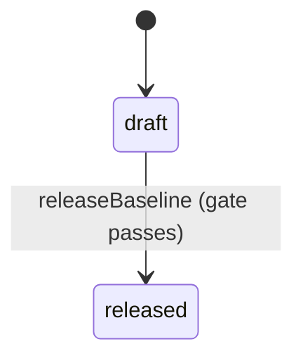
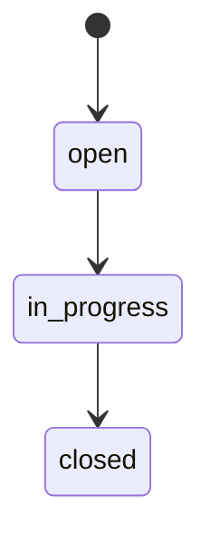

# WiseEff Domain Model

> Chinese: [Chinese](../zh-CN/design-docs/domain-model.md)

Date: 2026-05-25

## Modeling Principles

The product model separates prototype display data into durable, auditable business entities. Parameter definitions differ from project parameter values; submission rounds differ from individual change requests; log files, analysis runs, stages, and evidence are separate; devices, sessions, snapshots, and node operations are separate; Agent sessions, messages, tool calls, approvals, and traces are separate.

## Core Domains

- Organization and users define tenant boundaries, identity source bindings, role bindings, and disabled-user behavior.
- Projects group modules, members, and workflow state.
- `ParameterModule` (org-scoped tree) is the source of truth for parameter taxonomy; `ProjectModule` mirrors per-project module metadata for governance counts.
- Parameter management centers on definitions, project values, drafts, submission rounds, change requests, review decisions, imports, history, audit, and per-project DTS/JSON parameter files with bidirectional sync.
- Parameter and debugging **module taxonomies** are independent org-scoped trees (`parameter_modules`, `debug_node_modules`) with `parent_id` and materialized `path`. Parameters and logical debug nodes attach by `module_id` FK; filters accept `moduleId` with subtree include (parent selection returns descendants). Legacy flat `module` text columns remain transitional (TD-037 follow-up).
- Log analysis separates uploaded object references, business records, analysis runs, stages, evidence, archive state, and feedback. Log records and file objects are scoped by `organization_id` only; optional `related_parameter_id` is a soft link to M1 definitions without FK.
- Product feedback persists Internal Beta sidebar reports and optional image attachments as an organization-scoped triage queue. It is separate from log-analysis feedback and uses admin-only review.
- Debugging separates devices, detected targets, debug parameters, sessions, snapshots, node operations, and events.
- Agent state separates sessions, messages, tool calls, approvals, and run traces.
- Audit events connect cross-domain writes through actor, target, action, severity, metadata, and trace ID.

## Project Parameter Files

Project parameter files are first-class project-scoped entities that host DTS/JSON configuration bytes in object storage with immutable version history. File versions carry a `parsed_index` (`nodePath` → normalized value) used to diff against database state, generate `file_sync` drafts, and patch nodes after review merge. For DTS, `parsed_index` is a **derived compatibility view** of the structural model (feature flag `DTS_STRUCTURAL_INGEST`, default on).

| Entity | Description |
| --- | --- |
| `ProjectParameterFile` | One hosted `.dts` or `.json` file per project (`file_name` unique per project), optional `module_hint`, `enabled` flag, and `current_version_id`. |
| `ProjectParameterFileVersion` | Immutable file bytes in object storage with `version_number`, `checksum`, `parsed_index`, and `origin` (`upload` or `writeback`). |
| `DtsNode` | Structural node for a file version: `node_path` (includes `@unitAddress`), labels, optional `compatible`/`status`, parent link. |
| `DtsProperty` | Typed property on a node: `value_type` (`u32-array` \| `bytes` \| `string-list` \| `phandle-list` \| `mixed` \| `bool` \| `empty`), `raw_text`, `normalized_value`. |
| `DtsPhandleRef` | Phandle edge from a property to a target label (optional resolved node id). |
| `ParameterFileSyncConflict` | Open queue row when the same project value has competing `file_sync` and `manual` drafts with different target values. |

`ProjectParameterValue` extensions:

- `source_file_name`: hosted file name such as `battery.dtsi`
- `source_node_path`: structural node path such as `amba/i2c@XXXX0000/chip@6E/reg` (preferred identity)

Source fields live on project values, not definitions: the same definition can bind to different files per project. Null source fields mean manually maintained values.

`ParameterDraft` extensions:

- `origin`: `manual` (default) or `file_sync`
- `origin_file_version_id`: file version that produced a sync draft

### File Sync and Writeback

Upload or version upload with `origin=upload` parses the file, diffs each `parsed_index` entry against the matched project value, and upserts `file_sync` drafts when values differ. Matching prefers `source_file_name` + `source_node_path` (structural `nodePath`), then falls back to `name` + `module` (compatibility path; counted as `identityFallbackUses` on sync summary). First bind writes source fields on the project value. Drafts are not auto-submitted; users still run the existing submission and review workflow.

**DTS structural core (P1):** `server/modules/dts/` provides lexer → CST parser → value typing/normalization → overlay/label resolver → lossless CST serializer. Upload (when `DTS_STRUCTURAL_INGEST` is on) persists `dts_nodes` / `dts_properties` / `dts_phandle_refs` and derives `parsed_index` from the merged model. `/include/` remains hard-rejected. Writeback mutates CST property `rawText` and serializes with byte-stable remainder (multiline / multi-group / `@address` supported).

`origin=writeback` versions are created after `software_merge → merged` when the merged parameter has source fields. Writeback patches the current file bytes (JSON path set or DTS CST property splice) and must not trigger another sync pass.

Disabled files stop participating in automatic sync; existing source bindings remain.

### File Sync Conflicts

A conflict opens when one `project_parameter_value_id` has both a `file_sync` draft and a `manual` draft with different `target_value`. Both drafts are blocked from submission until a reviewer resolves the conflict:

- `resolved_file`: delete the UI draft, keep the file draft
- `resolved_ui`: delete the file draft, keep the UI draft

Terminal conflict statuses are `resolved_file` and `resolved_ui`. Resolution writes `parameter-file-conflict-resolve` audit.

Upload size limit remains 2 MB.

### Config Sets, Release Baselines, and the Validation Gate (P2)

A `DtsConfigSet` is the top-level buildable unit above individual files: a project groups a set of `ProjectParameterFile` members (each with a `role`) into one config set, optionally derived from another config set to express board variants. A `ReleaseBaseline` freezes a config set's current member versions into an immutable, comparable, and reversible snapshot. `DtcValidator` gates baseline release on a `dtc` compile pass (or a configured degrade mode) before a baseline can move from `draft` to `released`.

| Entity | Description |
| --- | --- |
| `DtsConfigSet` | A project-scoped buildable unit (`dts_config_set`): `name` (unique per project), optional `description`, optional `derived_from_id` for board-variant lineage. |
| `ProjectParameterFile` (extended) | Adds `config_set_id`, `config_set_role` (`base`\|`overlay`\|`charging`\|`thermal`\|`misc`), and `config_set_sort_order`. A file belongs to at most one config set at a time. |
| `ReleaseBaseline` | A named, immutable snapshot of a config set (`dts_release_baseline`): `status` (`draft`\|`released`), optional `notes`, `created_by`. |
| `ReleaseBaselineMember` | One pinned `(file_id, file_version_id, version_number)` row per config-set member at snapshot time (`dts_release_baseline_members`). Pinning references an existing immutable file version; it never copies object-store bytes. |

Rules:

- Every project has an implicit **default config set** so existing single-file upload/sync/writeback APIs keep working unchanged; migration `0043` backfills one default config set per pre-existing project and repoints its files. Projects created after that migration must call `ensureDefaultConfigSet` or `createConfigSet` explicitly — there is no runtime auto-provisioning.
- `createBaseline` snapshots every current member version in one transaction; a member with no current version blocks baseline creation (`409`), and a duplicate baseline name for the same config set is a `409` conflict.
- `compareBaseline(baselineId)` classifies each member as `unchanged`, `version_changed`, `file_added`, or `file_removed` by comparing the pinned `file_version_id` against the config set's current `current_version_id`. For a `version_changed` DTS member, it additionally computes a **structural diff** (`node_added`/`node_removed`/`prop_added`/`prop_removed`/`prop_changed`) from `resolveDts().normalizedValue`, so equivalent reorderings (hex case, multi-group flattening) never appear as noise.
- `rollbackToBaseline(baselineId)` is atomic: inside one transaction it repoints every drifted member's `current_version_id` back toward the pinned version. It never deletes history, and it never silently rewinds a file's linear version pointer — instead it inserts a new `origin='rollback'` version that carries the pinned version's bytes forward, so the version history stays monotonic and auditable. A member whose file no longer exists aborts the whole rollback. Because rollback always mints a fresh version id for a drifted member, a `compareBaseline` immediately after rollback still reports that member as `version_changed` (the id differs from the id pinned in the baseline), but its structural diff is empty, confirming the content itself matches exactly.
- `releaseBaseline(baselineId)` runs the validation gate (below) against the config set's **current** member contents, then flips a `draft` baseline to `released` only when the gate allows it.

**Validation gate:** `DtcValidator.validate(files, { mode })` compiles a config set's DTS members with the system `dtc` binary in a restricted subprocess (isolated temp dir, `PATH`-only environment, hard timeout) and returns `{ ok, mode, diagnostics, compiler }`. `mode` is read from `DTS_VALIDATION_MODE` (`block` default, `warn`, or `off`; see `docs/developer/environment-variables.md`).

- `mode=block`: any `error`-severity diagnostic, or an unavailable `dtc` binary, makes `ok=false`; `releaseBaseline` then throws `ApiError('CONFLICT', ..., 409, { code: 'dts-validation-failed', diagnostics })` and the baseline stays `draft`.
- `mode=warn`: always `ok=true`, but `requiresConfirmation=true` — release proceeds with a human-visible "unvalidated" flag.
- `mode=off`: never spawns `dtc`; always `ok=true`, `requiresConfirmation=false`.
- Every gate run writes a `validation.gate` audit event (mode, compiler, diagnostic count, `requiresConfirmation`), independent of pass/fail.

**Lossless export:** `exportFile`/`exportConfigSet` re-serialize each member's authoritative CST (`serializeDts(parseDts(source))`) so exported bytes are byte-for-byte equivalent to the source for round-trippable content. `exportConfigSet` returns a `manifest` (config set, members with role/sortOrder/versionNumber/format, and the validation-gate result at export time) plus each member's exported content, so software engineers can hand-commit the bundle to Git.

Release baseline state machine:

`released` is a status marker, not a lock: a config set's members can keep changing after release, and a later `compareBaseline`/`rollbackToBaseline` call still operates against the same baseline id.

### Structured impact, change sets, and sensitive nodes (P3)

`ChangeRequest.impact` is computed server-side. When a project value has `source_file_name` + `source_node_path` bound to the structural model, impact includes real DTS facts in addition to the direct `parameter` item:

| Kind | Meaning |
| --- | --- |
| `parameter` | Always present for the changed project value (risk/audit consumers). |
| `phandle` | Other nodes whose properties reference this node via phandle. |
| `compatible` | Sibling nodes sharing the same `compatible` string in the version. |
| `config-set` | Peer files in the same `dts_config_set` as the bound file. |

When structural facts are unavailable (unbound / non-DTS), impact falls back to the legacy two-item template (`parameter` + `module`).

A **structured change set** aggregates node/property-level diffs from baseline compare (`node_added` / `node_removed` / `prop_*`) into one reviewable unit that still maps onto existing `parameter_change_requests` (no parallel approval system). Frontend rendering lives in `StructuredDiffView` + `aggregateStructuredChangeSet`.

**Structured edit submit (P3.1):** Browser structured edits map to the existing CR flow via `POST .../dts-structured-edits/submit`. CR `target_value` and CST writeback splice use `rawText` (not `normalizedValue`) so merge writeback preserves author formatting; normalized values remain for diff/compare only. This closes the edit → change set → submit → review → CST writeback loop.

**Sensitive node RBAC:** org/project rules in `dts_sensitive_node_rules` match `path` or `compatible` patterns to a risk tier (`high` \| `critical`) and required capability (default `parameter:edit-critical`). Writes that hit a rule without the capability return `403`. Agent (`actorType=agent`) writes that hit `critical` are always denied and audited as `parameter-sensitive-node-denied` with `requireHuman: true` — a human must perform the change.

### Semantic topology identity (additive → atomic cutover)

Path-derived `(name, module)` / full DTS path identity is being replaced by:

| Concept | Meaning |
| --- | --- |
| Source tree | All DTS/DTSI/overlay occurrences with file + span provenance. |
| Effective tree | Overlay-resolved logical nodes/properties with ordered `sourceChain`. |
| `ParameterSpec` / `ParameterSpecVersion` | Stable specification identity; `example_value` is illustrative only and never drives DB constraints or release policy. |
| Schema default / policy target / effective value | Separate fields. Legacy `recommended_value` is migration evidence only and must not auto-promote into default or policy. |
| `ProjectParameterBinding` | Stable `project × logical-node × spec` binding used by history, drafts, CRs, and exports. |
| Identity mapping / spec review tasks | Human queues for ambiguous or incomplete migration/governance. Spec-review resolve creates occurrence→spec decisions, project bindings, and reusable matcher overrides; dismiss never pretends a property matched and remains a fail-closed release blocker. |
| Binding candidate FSM | Centralized candidate states; `needs_mapping` / `invalid` must never be overwritten into `draft`. |
| Validation gate | Fail-closed toolchain validate; failed re-validation revokes `validated`. Missing Config Set base/manifest fails closed. |
| Migration match buckets | Reports split `exactMatched` / `reviewedMatched` / `inferredPendingReview` / `ambiguous` / `unmapped` / `broken`. Inferred drafts never count as releasable mapped; unaudited inferred blocks cutover. |
| Reviewed continuity | Reviewed identity mappings and matcher overrides reuse across later revisons; only stable revisons are continuity baselines. |
| Config Set manifest | Persisted `entryFile`, `includeSearchPaths`, overlay order, and member roles for each revision. Backfilled from pinned `dts_config_revision_members` when historical rows lack a manifest. `manifestState=needs_review` fail-closes edit, validate, release, and writeback until an operator repairs the manifest. |
| Matcher override scope | Reusable overrides key on `compatible` fingerprint + **node locator fingerprint** + `propertyKey`. Overrides from one logical node must not bleed into a sibling node with the same compatible/property unless explicitly reviewed. |
| Review blocker scope | Spec-review and mapping blockers carry `blocker_scope` (`revision` \| `project` \| `platform`). Validate/release gates honor scope — revision-scoped blockers do not org-wide stop unrelated projects. |
| Global vendor specs | `ParameterSpec` rows with `organization_id IS NULL` are platform-global vendor definitions. Tenants may **read and bind** active global specs. Organization admins must **not** activate, update, or delete global drafts/specs — only org-owned rows (`organization_id === caller org`) are mutable via standard Admin APIs. Platform globals are maintained via bootstrap/migration/dedicated platform governance, not ordinary org Admin activate. |
| Manual spec identity | Manual/org draft IDs hash **lossless** canonical parts (`field:length:rawValue`). Display sanitize must never feed uniqueness hashes. Distinct DTS keys such as `vendor,limit` vs `vendor-limit` must yield distinct IDs. Legacy sanitize-hash collisions are audited fail-closed without silently rewriting referenced IDs. |
| Review-task scope | Scoped FK columns on `parameter_spec_review_tasks` are recomputed only from tenant-proven evidence joins (migration `0058`). Existing task FKs are not trusted. Unproven/polluted scope is cleared and `resolved` tasks reopen so finalize/cutover cannot treat them as done. |
| Vendor dt-schema | Linux-binding JSON schemas are generated deterministically from property specs (not permissive `additionalProperties: true` stubs). Golden DTBs must pass real `dt-validate`; negative fixtures must fail with expected diagnostics. |
| Migration CLI phases | `parameter-identities:migrate` exposes `dry-run` (default), durable `stage-review` (inferred drafts + review tasks in one transaction), and atomic `finalize` (activity FKs + bindings). Cutover accepts only `finalized` runs. |
| Immutable base vs candidate binding revisions | Locked merge/writeback ingests a **candidate** config revision and upserts `project_parameter_binding_revisions` at that revision only. The locked **base** config revision and its binding-revision row stay immutable; merged values land on the candidate revision. Stale lock identity → `409`. |
| Merge writeback schema_state | Merge writeback persists binding-revision `schema_state` as `valid` (historical rows may still store `merged`, which API normalization maps to `valid` so the workbench does not show attention). |
| Binding-draft submission identity | A topology draft owns an exact `draftId`, binding, spec, candidate config revision (`parameter_drafts.candidate_config_revision_id`, migration `0059`), `set|delete` action, value/reason, and write lock. Submission locks both the draft and its candidate/evidence rows, proves the same organization/project/Config Set, and atomically promotes the candidate from `draft` to `pending_approval`. Migration `0063` copies that exact candidate ID to both the submission item and change request before deleting the draft. Merge locks and re-proves that same `pending_approval` candidate: `set` requires exact raw-value equality; `delete` requires no replacement binding revision plus the matching logical-node/property-spec delete effect. Historical workflow rows with no candidate cannot be reconstructed and fail closed at merge. Migrations `0060`/`0061` invalidate candidate-less drafts across all origins; users must recreate them through the typed editor. Post-cutover legacy save/submit is rejected, and a binding ID must not masquerade as legacy `parameterId`. |
| Typed delete merge | Migration `0062` persists `action` on drafts, submission items, and change requests. The reviewed action is passed unchanged to locked writeback. A delete writes `/delete-property/`, re-ingests and validates fail-closed, records an empty history tombstone, and intentionally creates no candidate binding-revision row for the removed property; base config and binding revisions remain immutable. |
| Fail-closed writeback dependencies | Post-cutover semantic merge requires injected `objectStore`, a project-scoped change request, an exact write lock, and real DTC toolchain validation. Skipped writeback or missing deps fail closed; `WISEEFF_WRITEBACK_SKIP_TOOLCHAIN` has no production path. |
| Migration phase audit | `stage-review` and `finalize` each append immutable rows to `parameter_identity_migration_phases` (prior phase payloads are never overwritten). Cutover accepts only runs with a successful `finalize` phase row. |
| Migration-run task linkage | Inferred spec-review and identity-mapping tasks created during `stage-review` carry `migration_run_id`; `finalize` requires every task for that run resolved before activity FK write. |
| Manual spec lifecycle | Unmatched `createSpec` creates org-owned **draft** specs with typed shapes inferred from occurrence AST. Admin `activate` promotes draft→active with complete constraints; only active+complete specs can `resolve`. |
| Tenant-owned review resolve | Spec-review `resolve` validates organization/project/revision/occurrence/logical-node ownership via a tenant-scoped join; raw evidence IDs alone are not trusted (migration 0055 hardening). |
| Exact writeback identity | Merge/writeback locks binding revision, occurrence, file version, checksum, and CST span. Shared base revisions are immutable; stale identity → `409`. |

**Round 4 golden fixture counts (locked in tests):** aurora project-primary DTS (`aurora-board.dts`) resolves to **58 nodes / 228 parsed properties** (`goldenPowerFixture.test.ts`); semantic ingest persists **176 property occurrences** per revision (`ingestService.test.ts`, `matcher.test.ts` overlay golden); M1 DTS seed structural ingest = **684 `dts_properties` rows** (`seedM1DtsFiles.test.ts`, 228 × 3 projects).

HTTP for the semantic surface lives under `/api/v2` (see api-contract). Production cutover is maintenance-only, fail-closed, and whole-snapshot rollback only — see `docs/runbooks/parameter-identity-cutover.md`. Do not dual-write or expose a compatibility projection in production. Post-cutover activity paths use binding/spec/occurrence IDs only and must not create shadow PPV/definition rows. **TD-042 remains a BLOCKER** until a clean non-customer snapshot rehearsal completes — round 4–6 fixes do not clear production cutover readiness.

**`legacyDependencyGuard`:** Vitest source scanner at `server/modules/parameter-topology/legacyDependencyGuard.test.ts` (not a runtime middleware). It forbids retired flat-identity / shadow tokens under `server/`, `src/`, and `scripts/`, with an allowlist limited to migrations, cutovers, rollback/adapters, transitional adapters, completed-plan docs, tests/e2e, and scripts.

## State Machines

Parameter requests, log analysis runs, product feedback triage, debugging sessions, and Agent approvals should move through explicit states. Tests and browser acceptance should verify invalid transitions, terminal-state behavior, and audit invariants.

### Product Feedback

| Entity | Description |
| --- | --- |
| `ProductFeedback` | One Internal Beta sidebar report with page context, type, description, submitter, triage status, and admin note. |
| `ProductFeedbackAttachment` | Ordered image attachment metadata linked to a feedback item and shared object-store content. |

Rules:

- `ProductFeedback` and `ProductFeedbackAttachment` are scoped by `organization_id`; list/detail queries must filter by the authenticated organization.
- Submit is available to any active authenticated user. Admin list, detail, status updates, notes, and attachment content require `admin:access`.
- Attachments are metadata rows plus object-store bytes. Metadata stores `storage_key`, `file_name`, `content_type`, `size_bytes`, `checksum`, and `sort_order`.
- Feedback creation writes `product-feedback-create` audit; admin triage writes `product-feedback-update` audit with previous and next status.

Status machine:

`closed` is terminal for the MVP. Reopening or skipping directly from `open` to `closed` is intentionally not part of the shipped state machine.

## Debugging Catalog Scope

Debugging parameters, logical debug nodes, and their protocol bindings are an organization-level catalog keyed by `organization_id`. Parameter management remains project-scoped through the M1 parameter-management tables.

Debugging runtime records are organization-scoped. Devices, targets, sessions, leases, node operations, snapshots, and events are keyed by `organization_id`; permissions use org-level debugging RBAC rather than parameter project context. New log and debug audit events use `project_id = null`.

Debugging catalog governance is split from runtime execution. `debugging_parameters.enabled=false` or non-null `archived_at` removes a parameter from runtime lists but keeps audit, snapshot, and operation history understandable. Admin catalog APIs can view and restore archived rows; runtime parameter reads only use enabled, non-archived rows.

HDC and ADB node bindings remain separate rows in `debugging_parameter_node_bindings`, keyed by protocol. Disabling or archiving one binding only affects that protocol and must not hide the other protocol's binding from admin catalog governance.

### Node Registry vs Parameter Reload (TD-032)

TD-032 split the debugging catalog into three cooperating surfaces:

- **Legacy debugging parameters** (`debugging_parameters` + `debugging_parameter_node_bindings`) remain the M3 node-debugging catalog used by `/node-debugging`. They are parameter-shaped rows with optional per-protocol bindings.
- **Debug nodes** (`debug_nodes`) are logical, protocol-agnostic adjustable nodes for `/node-debugging` runtime and the debugging admin **node directory**. They carry node metadata (name, description, sort order, enabled/archive) but not device paths.
- **Debug node bindings** (`debug_node_bindings`) store per-protocol HDC/ADB paths, access mode, and enablement for each logical node. One enabled binding row per `(node_id, protocol)`; disabling or archiving one protocol binding does not hide the other protocol's binding from admin governance.
Runtime separation:

- `/node-debugging` creates sessions with `session_kind = node`, lists federated runtime nodes via `GET /api/v1/debugging/nodes?protocol=...`, and reads/writes through node APIs using `nodeId`. The runtime list inner-joins enabled `debug_node_bindings` for the requested protocol (Option A: nodes without an enabled selected-protocol binding are omitted).
- `/debugging` parameter-reload workspace remains **product-offline** (TD-032). Migration `0037` dropped `parameter_reload_bindings` and removed reload-target/reload-write HTTP routes.
- `node_operations.node_id` references `debug_nodes.id` for node writes; legacy `parameter_id` remains for historical rows and audit compatibility.

Admin IA exposes a single **node directory** tab for logical node CRUD plus per-protocol binding upsert/archive.

### Debug Value Metadata

Debugging parameters carry explicit value metadata separate from protocol bindings:

- `valueKind`: `scalar | complex`
- `valueFormat`: `raw | json | dts | line-list | kv-list`
- `normalizationMode`: `exact | trim | line-ending-normalized | json-canonical`
- `maxValueBytes`: optional write and audit payload cap

Phase 1 keeps one enabled HDC or ADB binding per complex parameter. Complex values still use the existing session, lease, snapshot, write, readback, rollback, and audit boundary; comparison and validation are format-aware rather than raw string equality for every payload.

`node_operations` stores value metadata plus digest and preview fields for complex writes. Exact rollback payloads remain in `requested_value`, `previous_value`, and `readback_value`; audit and operation history surfaces use preview and digest for large payloads.
