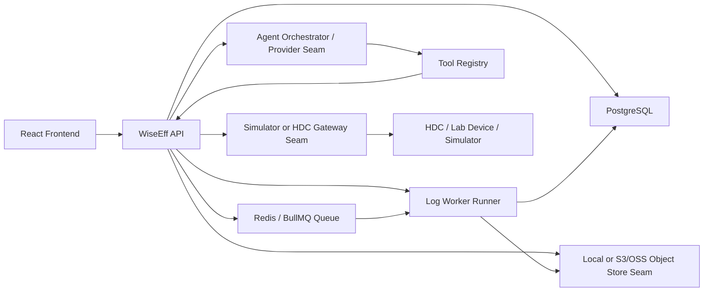

# WiseEff 全栈架构设计

日期：2026-05-25

## 1. 架构目标

WiseEff 正式系统采用“模块化单体后端 + 独立任务 worker + 独立设备网关 + React 前端”的架构。这样可以在早期保持部署和调试简单，同时为日志分析、Agent、设备接入等异步或高风险能力保留清晰边界。

现有前端已经具备以下可复用基础：

- `src/domain/*/types.ts`：领域类型雏形。
- `src/application/ports/*`：参数、日志、设备、Agent、审计的端口接口。
- `src/infrastructure/mock/*`：mock runtime 状态。
- `src/infrastructure/http/dto.ts`：HTTP DTO 映射起点。
- 大量 Vitest/Testing Library 测试。

后续开发应把这些边界升级为正式运行时，而不是把业务逻辑继续堆在页面组件中。

M0-M5 implementation note: the repository now contains the modular API, PostgreSQL migrations, OpenAPI artifact/check, production auth boundary, log worker runner, local/S3-compatible object-store seam, simulator/HDC device-gateway seam, deterministic/live Agent provider seam, and M5 pilot-readiness route. Enterprise SSO/OIDC, cloud-provider SDK/IaC, and real staging/device-lab evidence remain post-M5 or target-environment work.

M6.1 self-hosted note: `ops/self-hosted/` now provides a single-Linux-server baseline with separate PostgreSQL, API, web, worker, and Caddy proxy services. The API can bind through `HOST`, and self-hosted API containers disable the in-process worker with `LOG_WORKER_ENABLED=false` so the dedicated worker service owns log processing.

M6.2 identity note: target production auth now requires `AUTH_PROVIDER=oidc` and validates access tokens through OIDC discovery/JWKS before resolving the effective `AuthContext` from WiseEff PostgreSQL users and role bindings. OIDC `wiseeff_roles` may exist for diagnostics, but the database is the authorization source after identity verification. The HMAC verifier remains available for local smoke/test profiles only. Backend user-governance APIs persist user/role changes in PostgreSQL transactions and write audit events for create, profile, activation, and role replacement mutations.

M6.4 durable queue note: Redis/BullMQ is implemented as the self-hosted log-analysis dispatch transport. API processes enqueue queue messages only after PostgreSQL job creation succeeds. Worker processes consume `jobId` payloads, claim the PostgreSQL job, and write progress, retry, dead-letter, audit, and evidence state back to PostgreSQL. Target Redis readiness still needs live `queue:check` evidence before an environment is called queue-ready.

M6.5 observability note: `server/observability/` provides correlation, structured-log redaction helpers, a Prometheus metrics registry, and a tracing boundary. `GET /metrics` exposes build, HTTP, readiness, database, object-store, Agent provider readiness, worker queue gauges/counters, Agent provider call counters, and device gateway operation counters. Prometheus, alerts, and Grafana templates live under `ops/self-hosted/observability/`; `/metrics` must remain private to the operations network, VPN, allowlisted proxy, mTLS, or stronger access control.

## 2. 推荐技术栈

| 层级 | 推荐 |
| --- | --- |
| 前端 | React、TypeScript、Vite、Vitest、Testing Library、现有 shadcn/Radix UI 组件 |
| 前端数据 | API client + 查询缓存；生产模式禁止直接读 mock |
| 后端 | TypeScript Node.js 模块化服务，REST API，OpenAPI 合同 |
| 数据库 | PostgreSQL |
| ORM/迁移 | Prisma 或同类 TypeScript ORM |
| 队列 | Redis + BullMQ 或兼容任务队列 |
| 文件存储 | S3 兼容对象存储，开发环境可用本地模拟 |
| 认证 | OIDC/SSO 优先，开发环境支持本地账号 |
| Agent | 后端 Agent Orchestrator + provider adapter + tool registry |
| 设备 | 独立 Device Gateway，通过内部 API 或消息通道访问设备 |
| 观测 | 结构化日志、metrics、trace id、健康检查 |

## 3. 运行时总览



## 4. 前端架构

前端继续保持 Vite + React SPA。短期内不需要引入复杂微前端。

推荐结构：

```text
src/
  app/                    路由、权限、导航、应用壳
  domain/                 纯领域类型和纯函数
  application/ports/      前端依赖的业务端口
  infrastructure/http/    API client、DTO、错误映射
  infrastructure/mock/    演示与测试 mock runtime
  features/               页面级业务功能
  components/             可复用 UI 和布局组件
```

迁移规则：

- 页面组件只负责渲染、交互和调用端口。
- 领域规则放在 `domain` 或业务 view model 文件中。
- API DTO 与领域对象转换放在 `infrastructure/http`。
- mock 实现和真实 API 实现都满足同一端口接口。
- 生产模式中不允许导入 mock state 作为业务数据源。

## 5. 后端架构

后端建议从模块化单体开始，按业务域拆模块：

```text
server/
  modules/
    auth/
    users/
    projects/
    parameters/
    logs/
    debugging/
    agent/
    audit/
    files/
  shared/
    database/
    authz/
    errors/
    observability/
    jobs/
```

模块边界：

- `auth/users`：身份、用户、角色、组织。
- `projects`：项目、模块、项目成员。
- `parameters`：参数定义、项目值、草稿、提交、审阅、历史。
- `logs`：文件、日志记录、分析任务、证据、归档。
- `debugging`：设备、节点参数、调试会话、节点操作记录。
- `agent`：会话、消息、工具调用、审批。
- `audit`：统一审计写入和查询。
- `files`：对象存储上传、下载、签名 URL。

## 6. 数据架构

PostgreSQL 是主存储。对象存储保存日志文件和导出文件。Redis/队列只承载异步任务，不作为权威业务数据源。

一致性原则：

- 所有业务写入在数据库事务中完成。
- 审计事件与业务写入同事务或通过 outbox 保证最终写入。
- 变更请求、调试写入、Agent 工具调用使用乐观锁或状态机校验。
- 文件上传先创建数据库记录，再绑定对象存储 key。

## 7. 异步任务架构

M6.4 status: log analysis has a dedicated worker runner plus Redis/BullMQ durable queue mode. PostgreSQL remains the source of truth for job state, leases, retries, dead-letter metadata, audit, and evidence; Redis/BullMQ carries dispatch and redelivery. Database polling mode remains available for local development and compensation.

需要异步化的任务：

- 日志解析和分析。
- 批量参数导入校验。
- Agent 长耗时工具调用。
- 审计报表导出。
- 设备批量读取或写入。

任务模型：

- API 创建任务并返回任务 ID。
- worker 消费任务并更新任务状态。
- 前端通过 `GET /jobs/:id`、轮询或 SSE 获取进度。
- 任务必须支持失败原因、重试次数、trace id 和幂等键。

## 8. Agent 架构

M5 status: Agent orchestration, tool registry, approval records, deterministic provider, live provider seam, provider health, and trace metadata are implemented. Live model quality, prompt evaluation, enterprise provider credentials, and target-environment evidence remain pilot/prod work.

Agent 不直接访问数据库，不直接执行生产变更。它通过工具注册表调用后端受控能力。

核心组件：

- `AgentOrchestrator`：组织上下文、调用模型、解析工具调用。
- `ToolRegistry`：声明工具名称、权限、输入 schema、是否需要审批。
- `ApprovalService`：管理待批准工具调用。
- `AgentAuditAdapter`：记录消息、工具调用、审批和结果。

工具治理：

- 读工具可自动执行，但必须经过权限校验。
- 写工具只生成待批准记录。
- 审批通过后由后端业务服务执行，不由模型直接执行。
- 工具调用结果必须返回结构化输出和可展示摘要。

## 9. 设备网关架构

M5 status: the backend has simulator and HDC gateway seams with timeout, stderr, nonzero exit, offline, and read-back mismatch handling covered by fake-runner tests. Real hardware evidence must be recorded through the device-lab smoke before calling a target environment pilot-ready.

设备访问与主业务后端隔离。主后端负责权限、审计和会话记录；设备网关负责与 HDC、实验室设备或模拟器通信。

设计要求：

- 设备网关只暴露最小内部 API。
- 所有写入请求必须包含 request id、用户、设备、节点、目标值和风险级别。
- 写入前由主后端创建调试会话和快照。
- 写入后必须回传 stdout、stderr、耗时、回读结果和错误。
- CI 使用设备模拟器，不依赖真实硬件。

## 10. 部署架构

建议环境：

- `local`：本地开发，Docker Compose 启动后端依赖。
- `staging`：接近生产配置，用于验收和回归。
- `production`：生产环境，禁用 mock runtime。

部署单元：

- Frontend static assets。
- API service。
- Worker service。
- Device Gateway。
- PostgreSQL。
- Redis。
- Object storage。

## 11. 架构决策

| 决策 | 结论 | 理由 |
| --- | --- | --- |
| 后端形态 | 模块化单体优先 | 当前团队可控，事务简单，避免过早微服务 |
| API 风格 | REST + OpenAPI | 与现有前端 DTO 和页面调用匹配，便于测试 |
| 数据库 | PostgreSQL | 关系模型清晰，适合审计、流程、权限和查询 |
| Agent | 后端编排 | 防止前端泄露工具权限和生产状态 |
| 设备 | 独立网关 | 降低设备访问风险，方便模拟和隔离 |
| mock | 保留但隔离 | 服务演示和测试，不进入生产路径 |
