# WiseEff Technical Compendium

> Chinese: [Chinese edition](../zh-CN/design-docs/full-stack-architecture.md)

Version 2.0 · Reviewed 2026-09-06 · Source baseline: `67d4a77325b6009b77c2373bd788298a6d022bcf`.

This integrated Markdown document explains the implemented system for engineering handover. It contains the architecture, interfaces, domain relationships, workflows, failure handling, setup and operations in one reading sequence. Mermaid diagrams are maintained with the prose. Specialist documents remain the detailed contract owners; links provide traceability rather than replace the explanations here.

Source inspection establishes implementation behavior. It does not establish fresh test results, installed target configuration, completed cutover or release readiness. English and Chinese are corresponding editions of the same compendium. [Testing Strategy and Design](testing-strategy.md) owns risks, test selection and executable design cases.

## 1 System Overview

WiseEff is an AI-assisted enterprise engineering platform. Its main workflows are project parameter management, log analysis and device/node debugging. Knowledge, Xiaoze, authentication, organization management, audit, feedback and notifications support those workflows.

### 1.1 Capabilities and Entry Points

| Capability | Main routes | Purpose |
| --- | --- | --- |
| Project parameters | `/parameters` | Inspect typed values, prepare drafts and submit changes |
| Submission and review | `/parameter-submissions`, `/parameter-review` | Track exact candidates and assigned review stages |
| Catalog governance | `/parameter-admin/specs` | Definitions, organization registration, placement and proposals |
| Project configuration | `/parameter-admin/projects` | Files, configuration sets, source revisions, conflicts and baselines |
| Log analysis | `/logs`, `/log-admin` | Upload, evidence, log-domain governance and archives |
| Node debugging | `/node-debugging`, `/debugging-admin` | Protected device access, node and protocol configuration |
| DTS reload | `/dts-reload` | Overlay preparation, preflight, deployment, observation and recovery |
| Knowledge | `/knowledge`, `/knowledge-admin` | Publication, retrieval, citations and indexing |
| Organization and shared utilities | `/organization`, `/organization/members`, `/audit`, `/feedback-admin` | Organization details, membership, history and feedback triage |

Route availability and navigation discovery are different. The current discovery configuration promotes parameters and debugging. Logs and knowledge remain implemented, deep-linkable and permission-checked.

### 1.2 Runtime Modes

The frontend is a React/Vite SPA. The TypeScript API is a modular monolith backed by PostgreSQL, SQL migrations and explicit database clients. PostgreSQL owns business state; this implementation does not use a proposed ORM as its persistence architecture.

Local development defaults to API mode. Explicit mock mode supports demonstrations and component tests, cannot supply production business data, and does not show the Xiaoze UI. The runtime selection occurs at application composition rather than inside individual pages.

### 1.3 System Boundary

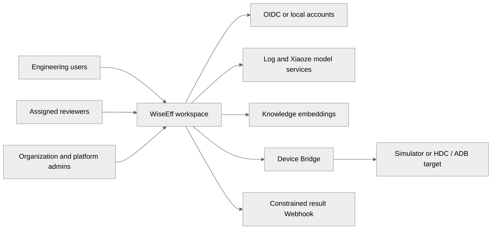
```mermaid
%%{init: {"theme": "neutral"}}%%
flowchart LR
  Engineer["Engineering users"] --> WiseEff["WiseEff workspace"]
  Reviewer["Assigned reviewers"] --> WiseEff
  Admin["Organization and platform admins"] --> WiseEff
  WiseEff --> Identity["OIDC or local accounts"]
  WiseEff --> Models["Log and Xiaoze model services"]
  WiseEff --> Embedding["Knowledge embeddings"]
  WiseEff --> Bridge["Device Bridge"]
  Bridge --> Target["Simulator or HDC / ADB target"]
  WiseEff --> Hook["Constrained result Webhook"]

```

Figure 1 separates users, application services and external systems. The object store owns bytes, the database owns business references, and the bridge interacts with the physical target. A successful application request alone cannot establish all three external facts. Model services provide analysis or generation; they do not receive authority to impersonate a user or commit an arbitrary mutation.

## 2 System Architecture

### 2.1 Runtime Composition

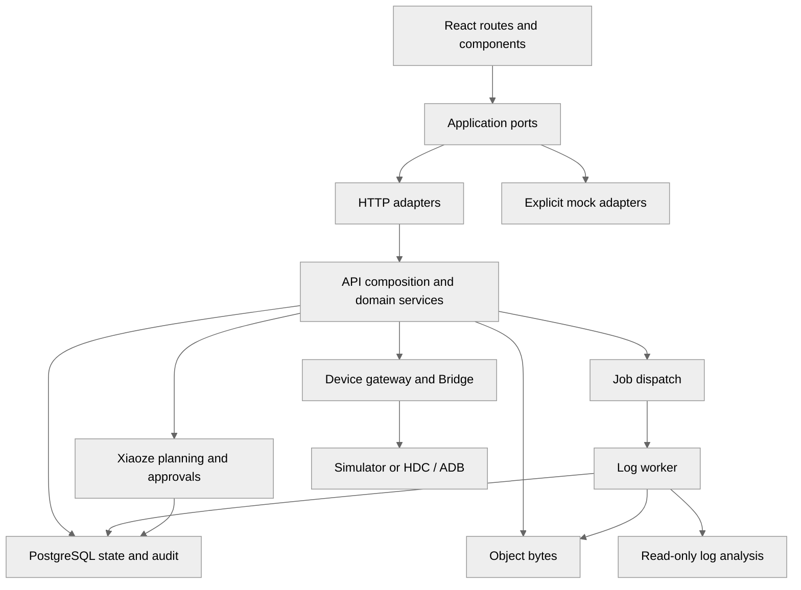
```mermaid
%%{init: {"theme": "neutral"}}%%
flowchart TB
  UI["React routes and components"] --> Ports["Application ports"]
  Ports --> HTTP["HTTP adapters"]
  Ports --> Mock["Explicit mock adapters"]
  HTTP --> API["API composition and domain services"]
  API --> PG["PostgreSQL state and audit"]
  API --> Objects["Object bytes"]
  API --> Queue["Job dispatch"]
  Queue --> Worker["Log worker"]
  Worker --> PG
  Worker --> Objects
  Worker --> Analysis["Read-only log analysis"]
  API --> Agent["Xiaoze planning and approvals"]
  Agent --> PG
  API --> Bridge["Device gateway and Bridge"]
  Bridge --> Target["Simulator or HDC / ADB"]

```

Figure 2 shows runtime dependencies. API and worker processes can be deployed independently. Redis/BullMQ carries job IDs in durable queue mode; polling is an alternative. Database jobs, leases, retry metadata and terminal results remain authoritative in both modes.

The log-analysis model path and Xiaoze are distinct. Log tools are bounded and read-only. Xiaoze uses governed tools, approval interrupts and durable execution checkpoints. Sharing a provider does not merge these policy boundaries.

### 2.2 Frontend Layers

| Layer | Location | Responsibility |
| --- | --- | --- |
| Application shell | `src/app`, `src/appConfig.ts` | Routing, navigation, permission presentation and runtime injection |
| Domain model | `src/domain` | Types, pure rules, state derivation and value semantics |
| Application ports | `src/application/ports` | Business operations used by pages |
| HTTP adapters | `src/infrastructure/http` | Requests, DTO conversion and error mapping |
| Mock adapters | `src/infrastructure/mock` | Explicit demonstration and test implementations |
| Features and components | `src/features`, `src/components` | Interaction, loading, empty/error states and accessibility |

A page receives an application port. The port implementation performs HTTP mapping in API mode. The backend validates identity, current state and concurrency conditions before persistence. The response returns through the adapter into the current page context. A late response from a previous project must not overwrite the newly selected project.

### 2.2.1 Application Port Class Diagram

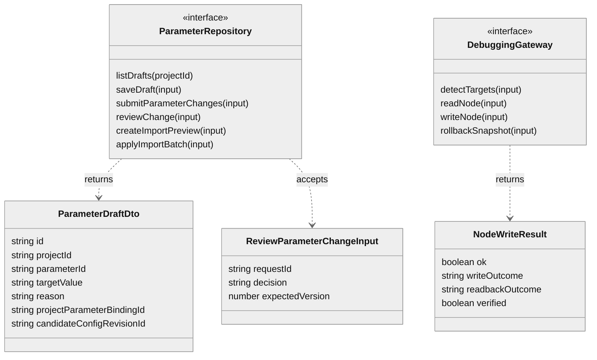
```mermaid
%%{init: {"theme": "neutral"}}%%
classDiagram
  class ParameterRepository {
    <<interface>>
    listDrafts(projectId)
    saveDraft(input)
    submitParameterChanges(input)
    reviewChange(input)
    createImportPreview(input)
    applyImportBatch(input)
  }
  class ParameterDraftDto {
    string id
    string projectId
    string parameterId
    string targetValue
    string reason
    string projectParameterBindingId
    string candidateConfigRevisionId
  }
  class ReviewParameterChangeInput {
    string requestId
    string decision
    number expectedVersion
  }
  class DebuggingGateway {
    <<interface>>
    detectTargets(input)
    readNode(input)
    writeNode(input)
    rollbackSnapshot(input)
  }
  class NodeWriteResult {
    boolean ok
    string writeOutcome
    string readbackOutcome
    boolean verified
  }
  ParameterRepository ..> ParameterDraftDto : returns
  ParameterRepository ..> ReviewParameterChangeInput : accepts
  DebuggingGateway ..> NodeWriteResult : returns

```

Figure 3 is an abridged view of real TypeScript interfaces, not runtime inheritance or an exhaustive DTO schema. Optional fields and discriminated input variants must be read in the linked port definitions before implementation.

A draft carries value and reason; candidate and canonical binding identity preserve what was edited. Submission references the intended candidate and assignees. Review includes a current-version condition where supported. Debugging returns command and observation facts separately.

### 2.3 Backend Module Boundaries

`server/app.ts` is the API composition root. Domain modules own policies and transactions; shared infrastructure provides HTTP, database, storage and observability services.

| Module group | Ownership | Change impact |
| --- | --- | --- |
| parameters, parameter-drafts | Drafts, submission, review and merge | Candidate identity, locks, assignees, audit |
| parameter-topology, parameter-files | Source/effective trees, versions, lossless writeback | Source digest, revision conflict, toolchain |
| parameter-catalog-api, catalog-kernel | Catalog reads, pinned releases and installation kernel | Release identity, digest, not-ready result |
| parameter-governance, parameter-bindings | Registration, placement, proposals and project use | Organization/project scope, idempotency, transactions |
| logs, jobs | Upload, analysis, leases, retry and results | Object availability, lease ownership, terminal state |
| debugging, dts-reload | Device actions, snapshots, reload and restore | Confirmation, authorization, leases, observations |
| agent, knowledge | Governed tools, approvals, checkpoints and published retrieval | Provenance, recovery authorization, citations |
| auth, users, audit and shared modules | Identity, roles, retention and queries | Server authorization, isolation, privacy |

### 2.4 Dependency Direction

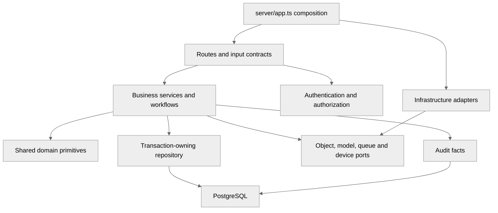
```mermaid
%%{init: {"theme": "neutral"}}%%
flowchart TB
  Root["server/app.ts composition"] --> Route["Routes and input contracts"]
  Root --> Adapter["Infrastructure adapters"]
  Route --> Auth["Authentication and authorization"]
  Route --> Service["Business services and workflows"]
  Service --> Kernel["Shared domain primitives"]
  Service --> Repo["Transaction-owning repository"]
  Repo --> SQL["PostgreSQL"]
  Service --> Port["Object, model, queue and device ports"]
  Adapter --> Port
  Service --> Audit["Audit facts"]
  Audit --> SQL

```

Figure 4 distinguishes composition from domain policy. The parameter kernel supplies shared primitives; workflow modules retain their own decisions and transactions. Catalog Kernel is a separate boundary from the existing project parameter workflow.

Production wiring already connects Catalog reads, governance and project usage. That fact does not prove that a target has installed a valid release or completed populated-data cutover. HTTP routing must not import a proposed contract and treat it as an automatically satisfied deployment condition.

## 3 Domain Model and Consistency

### 3.1 Identity and Organization Scope

Authentication identifies the principal. Authorization uses current database-backed role bindings and target scope. Organization and project IDs in client input identify requested targets; they do not grant access. Inactive/deleted users, changed memberships and revoked roles must be accounted for when an operation executes or resumes.

### 3.2 Parameter Objects

| Object | Meaning | Distinction |
| --- | --- | --- |
| Catalog Subject | Driver or node-type subject | Not a node instance on one device |
| Parameter Definition | Stable definition identity | Not a project's current value |
| Definition Revision | Specific immutable definition content | Separate from stable definition ID |
| Catalog Release | Installable, pinnable collection | Release ID and digest form a pair |
| Organization Registration | Organization's registration fact | Separate from the subject |
| Placement | Subject's position in organization classification | Not definition content |
| Project Binding and Value | Project usage and value facts | Governed by project scope and candidate identity |
| Draft and Change Request | Editing, submission and review records | Not already merged values |
| Definition Proposal | Governance proposal | Acceptance is not completed installation |

### 3.2.1 Conceptual Entity Relationships

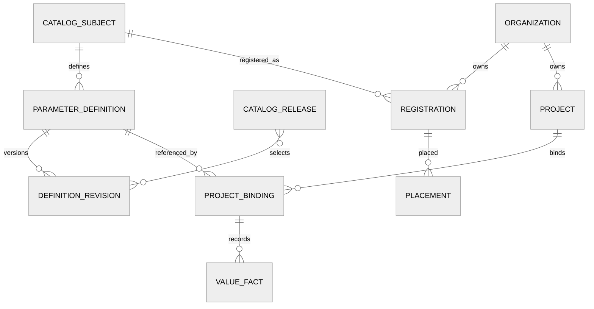
```mermaid
%%{init: {"theme": "neutral"}}%%
erDiagram
  CATALOG_SUBJECT ||--o{ PARAMETER_DEFINITION : defines
  PARAMETER_DEFINITION ||--o{ DEFINITION_REVISION : versions
  CATALOG_RELEASE }o--o{ DEFINITION_REVISION : selects
  ORGANIZATION ||--o{ REGISTRATION : owns
  CATALOG_SUBJECT ||--o{ REGISTRATION : registered_as
  REGISTRATION ||--o{ PLACEMENT : placed
  ORGANIZATION ||--o{ PROJECT : owns
  PROJECT ||--o{ PROJECT_BINDING : binds
  PARAMETER_DEFINITION ||--o{ PROJECT_BINDING : referenced_by
  PROJECT_BINDING ||--o{ VALUE_FACT : records

```

Figure 5 is a conceptual ER diagram. It explains business relationships, not exact SQL tables, foreign keys or the complete migration schema. Physical fields and constraints remain in migrations and repository implementations.

| Identity | Fact it preserves | Cannot be replaced by |
| --- | --- | --- |
| `CatalogReleasePin.id + digest` | Exact complete release | Current release ID alone |
| `ParameterDefinitionId` | Stable definition | Revision content or project binding |
| `DefinitionRevisionId` | Immutable definition revision | Current value version |
| `bindingId` | Canonical binding | Display name or node path |
| `effectiveRevisionId` | Effective revision used by the operation | Page load time |
| `currentValueId` | Current value fact | Formatted text |
| `candidateConfigRevisionId` | Working candidate revision | Published baseline |
| `expectedVersion / expectedEtag` | Optimistic concurrency condition | Idempotency key |

### 3.2.2 Value Semantics

Missing, unknown, explicit empty, zero, false and deleted values are different. Do not use a truthiness check to decide whether a value exists. Definition defaults/examples describe potential initialization; they are not evidence of a project's observed current value.

Typed data must survive editing, validation, submission and writeback. Display text is for rendering and compatibility where explicitly required. Node enablement has its own semantics and must not be flattened into an ordinary scalar parameter.

### 3.3 Configuration Files and Revisions

Source files preserve the original document, digest, parse context and revision. A configuration set resolves source composition and overlays into an effective view. A working candidate represents a proposed change. The published baseline and immutable source revisions remain distinct.

Lossless writeback must preserve unrelated syntax and content. DTS include resolution, macro/toolchain context and source ownership influence the effective value. A parsed display value alone is insufficient to select a write target.

### 3.3.1 Source-to-Writeback Flow

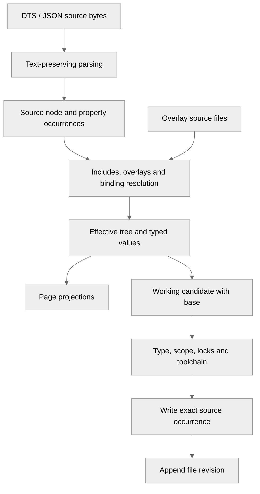
```mermaid
%%{init: {"theme": "neutral"}}%%
flowchart TB
  Bytes["DTS / JSON source bytes"] --> Parse["Text-preserving parsing"]
  Parse --> Source["Source node and property occurrences"]
  Source --> Resolve["Includes, overlays and binding resolution"]
  Overlay["Overlay source files"] --> Resolve
  Resolve --> Effective["Effective tree and typed values"]
  Effective --> View["Page projections"]
  Effective --> Candidate["Working candidate with base"]
  Candidate --> Validate["Type, scope, locks and toolchain"]
  Validate --> Writeback["Write exact source occurrence"]
  Writeback --> NewRevision["Append file revision"]

```

Figure 6 shows the separation between source and effective representations. A write targets the originating file/property or an explicit overlay, then validates the resulting candidate. It must not reverse-engineer a write target from a display name.

### 3.4 Asynchronous and External Objects

| Area | Objects | Consistency concern |
| --- | --- | --- |
| Logs | Record, file object, run, stage, evidence | File, run and archive lifecycle remain distinct |
| Jobs | Job and lease metadata | Duplicate delivery cannot bypass database ownership |
| Debugging | Node, protocol binding, operation, snapshot, observation | Command outcome differs from observation |
| Xiaoze | Session, message, tool call, approval, checkpoint | Chat history differs from execution recovery state |
| Knowledge | Entry, immutable revision, chunks, index state | Publication differs from index completion |
| Feedback/notifications | Submission, attachments, triage and user notification | Organization and user scope are checked independently |

### 3.5 Consistency Rules

Preserve immutable revision identity through every layer. Check the current state and expected version within the owning mutation boundary. Record audit association with the business action. Treat external operations as separately observable effects; retries must retain their original logical operation identity.

An empty successful result, hidden scope, retired identifier and unavailable projection are separate outcomes. Converting all of them to an empty array or zero hides failures and can mislead downstream governance.

### 3.6 Transactions and External Effects

| Operation | Database relationship | External fact | Recovery evidence |
| --- | --- | --- | --- |
| Parameter submission/review | Draft, candidate, request, roles, audit | Applicable validation/writeback | Exact candidate, source revision and request state |
| Proposal command | Proposal, ETag, idempotency and publication intent | Later catalog build/install | Original result and captured base |
| Log upload | File reference, run and job | Object-store bytes | Object readability, run and job |
| Device write | Operation, snapshot and audit | Command and observed target state | Write and readback outcomes |
| Agent approval | Approval, tool call and business authority | Possible remote/device action | Approval, current permissions, actual effect |
| Knowledge publication | Published revision and indexing task | Embedding request | Revision, index state, retrieval mode |

A database transaction cannot atomically cover a model request, object-store action or physical write. Recovery must inspect the boundary that actually failed. A transport timeout is not proof that no side effect occurred.

## 4 Parameter Changes and Catalog Governance

### 4.1 Project Change Workflow

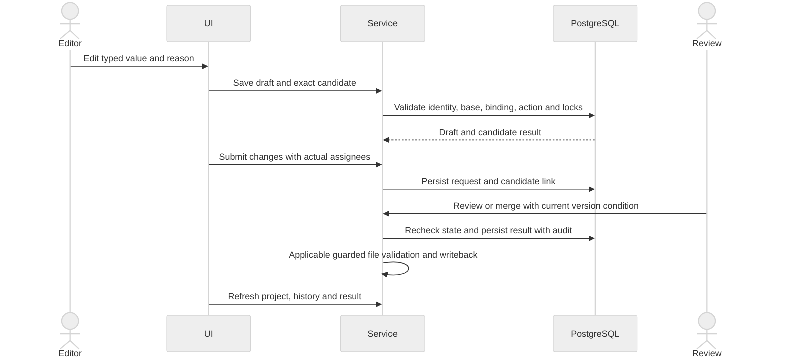
```mermaid
%%{init: {"theme": "neutral"}}%%
sequenceDiagram
  actor Editor as Editor
  participant UI as UI
  participant Service as Service
  participant DB as PostgreSQL
  actor Review as Review
  Editor->>UI: Edit typed value and reason
  UI->>Service: Save draft and exact candidate
  Service->>DB: Validate identity, base, binding, action and locks
  DB-->>Service: Draft and candidate result
  UI->>Service: Submit changes with actual assignees
  Service->>DB: Persist request and candidate link
  Review->>Service: Review or merge with current version condition
  Service->>DB: Recheck state and persist result with audit
  Service->>Service: Applicable guarded file validation and writeback
  UI->>Service: Refresh project, history and result

```

Figure 7 follows draft creation through assigned review and merge. The user edits a typed value and supplies a reason. Submission binds the exact candidate, items and assignees. Hardware/software review and merge revalidate their current responsibility, state and candidate conditions.

The legacy workflow's displayed statuses and the canonical draft/submission variants are compatibility concerns, not permission grants. A visible review button cannot replace server-side assignee and role checks.

### 4.2 Conflicts and Recovery

| Trigger | Required outcome | Next action |
| --- | --- | --- |
| Candidate or content changed | Reject stale submission/merge; do not choose a substitute | Refresh and review the difference |
| Assigned reviewer authority absent | No state advancement or merge | Route to the authorized assignee |
| Source revision or lock mismatch | No partial writeback | Reload source and candidate |
| Required compiler absent or validation fails | Block the gated path | Repair environment/input and validate |
| Old response arrives after project switch | Preserve current project context | Ignore the obsolete response |

### 4.3 Catalog Registration and Proposals

Catalog definitions/releases, organization registration/placement and project use are separate facts. Registering a subject does not rewrite its definition. Placement changes classification. Project usage queries must derive eligible projects from current authorization; client IDs cannot widen those grants.

Production wiring resolves current or pinned snapshots and scoped services. A required component that is unavailable returns a controlled not-ready result. Successful empty usage is different from a failed projection.

### 4.3.1 Pinned Read Sequence

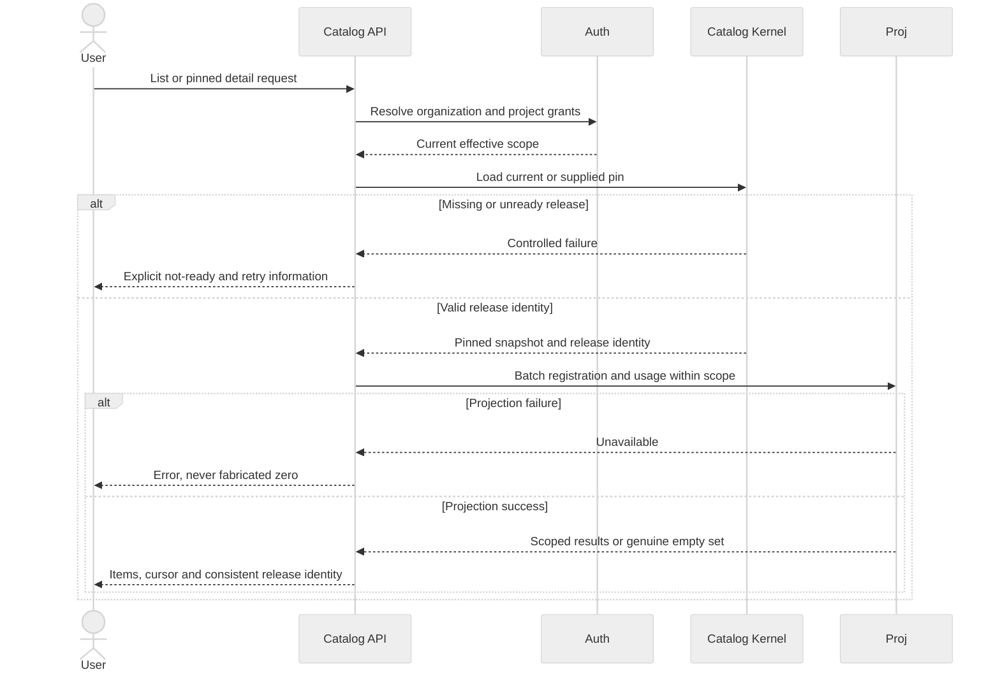
```mermaid
%%{init: {"theme": "neutral"}}%%
sequenceDiagram
  actor User as User
  participant API as Catalog API
  participant Auth as Auth
  participant Kernel as Catalog Kernel
  participant Proj as Proj
  User->>API: List or pinned detail request
  API->>Auth: Resolve organization and project grants
  Auth-->>API: Current effective scope
  API->>Kernel: Load current or supplied pin
  alt Missing or unready release
    Kernel-->>API: Controlled failure
    API-->>User: Explicit not-ready and retry information
  else Valid release identity
    Kernel-->>API: Pinned snapshot and release identity
    API->>Proj: Batch registration and usage within scope
    alt Projection failure
      Proj-->>API: Unavailable
      API-->>User: Error, never fabricated zero
    else Projection success
      Proj-->>API: Scoped results or genuine empty set
      API-->>User: Items, cursor and consistent release identity
    end
  end

```

Figure 8 shows why a release pin contains both ID and digest. A page or follow-up operation must retain the same release identity across related reads. Drift cannot be repaired by attaching today's digest to yesterday's ID. Current-release lookup and an explicit historical pin are different operations.

### 4.3.2 Proposal Commands and Replay

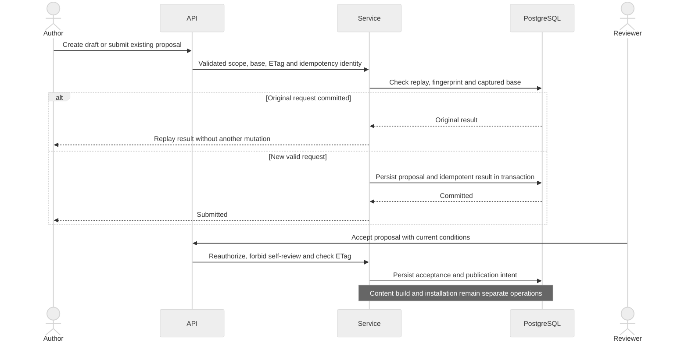
```mermaid
%%{init: {"theme": "neutral"}}%%
sequenceDiagram
  actor Author as Author
  participant API as API
  participant Service as Service
  participant DB as PostgreSQL
  actor Reviewer as Reviewer
  Author->>API: Create draft or submit existing proposal
  API->>Service: Validated scope, base, ETag and idempotency identity
  Service->>DB: Check replay, fingerprint and captured base
  alt Original request committed
    DB-->>Service: Original result
    Service-->>Author: Replay result without another mutation
  else New valid request
    Service->>DB: Persist proposal and idempotent result in transaction
    DB-->>Service: Committed
    Service-->>Author: Submitted
  end
  Reviewer->>API: Accept proposal with current conditions
  API->>Service: Reauthorize, forbid self-review and check ETag
  Service->>DB: Persist acceptance and publication intent
  Note over Service,DB: Content build and installation remain separate operations

```

Figure 9 separates idempotency from optimistic concurrency. `create-draft` creates a proposal. `submit-existing` addresses a proposal with its expected ETag. Internal create-and-submit behavior has its own command semantics. Withdrawal and reviewer acceptance/rejection check current state, authority and independent review.

| Condition | Required handling |
| --- | --- |
| Transaction committed but response lost | Reuse original key and payload to recover the original result |
| Same key with a different fingerprint | Conflict; never overwrite the original command |
| ETag mismatch | Reject the stale action and refresh |
| Captured base differs from current release | Apply the proposal conflict contract and preserve input |
| Proposer is the reviewer | Reject at the independent-review gate |
| Reviewer accepts | Record publication intent; do not claim installation |

Acceptance and catalog installation have different transactions and evidence. Installation and populated-data cutover must follow their own contract and maintenance procedure.

### 4.4 Import and Configuration Management

Imports validate file type, content, target ownership and revision conflicts before producing usable configuration state. Parsing success does not prove the values have been merged into the effective baseline. Export must reflect the selected project/revision and authorized scope.

The current configuration workbench and route resolver own project configuration navigation. Legacy `files|config-sets|structure|conflicts` deep links remain routing concerns; the old four-dialog presentation is not the implementation specification.

### 4.5 Typed Drafts and Concurrency

Topology drafts can carry a typed `targetValue`, `set/delete` action, base revision and explicit write target. Returned candidate identity and rebased draft associations must be retained. A rebased result does not authorize silently submitting a different candidate than the user reviewed.

Node enablement distinguishes `force-enabled`, `force-disabled` and `unstated`. Nonstandard status spelling may require explicit acknowledgement, with `ok/okay` spelling handled by the relevant input contract. Keep these fields distinct from parameter value edits and deletion.

## 5 Log Analysis

### 5.1 Intake and Job Lifecycle

An upload can optionally bind an organization-scoped log domain. The service validates the file and scope, stores bytes, and creates the record/run/job relationships. Supported extensions include log, txt, csv and json. Domain binding affects parsing and available published knowledge; it does not authorize another organization's data.

### 5.1.1 Upload-to-Report Sequence

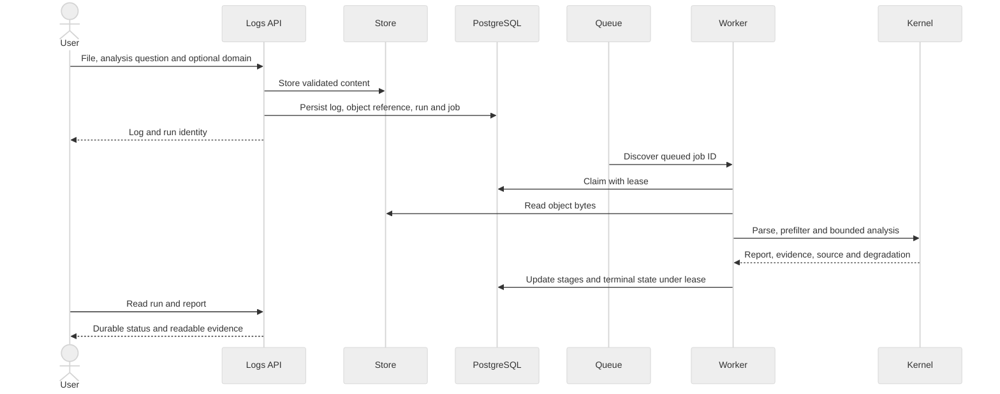
```mermaid
%%{init: {"theme": "neutral"}}%%
sequenceDiagram
  actor User as User
  participant API as Logs API
  participant Store as Store
  participant DB as PostgreSQL
  participant Queue as Queue
  participant Worker as Worker
  participant Kernel as Kernel
  User->>API: File, analysis question and optional domain
  API->>Store: Store validated content
  API->>DB: Persist log, object reference, run and job
  API-->>User: Log and run identity
  Queue->>Worker: Discover queued job ID
  Worker->>DB: Claim with lease
  Worker->>Store: Read object bytes
  Worker->>Kernel: Parse, prefilter and bounded analysis
  Kernel-->>Worker: Report, evidence, source and degradation
  Worker->>DB: Update stages and terminal state under lease
  User->>API: Read run and report
  API-->>User: Durable status and readable evidence

```

Figure 10 separates object persistence, job dispatch, database claim, parsing, model/rules analysis and report persistence. A queued message is not analysis completion. A missing object, unclaimed job and model failure require different diagnoses.

### 5.1.2 Run State

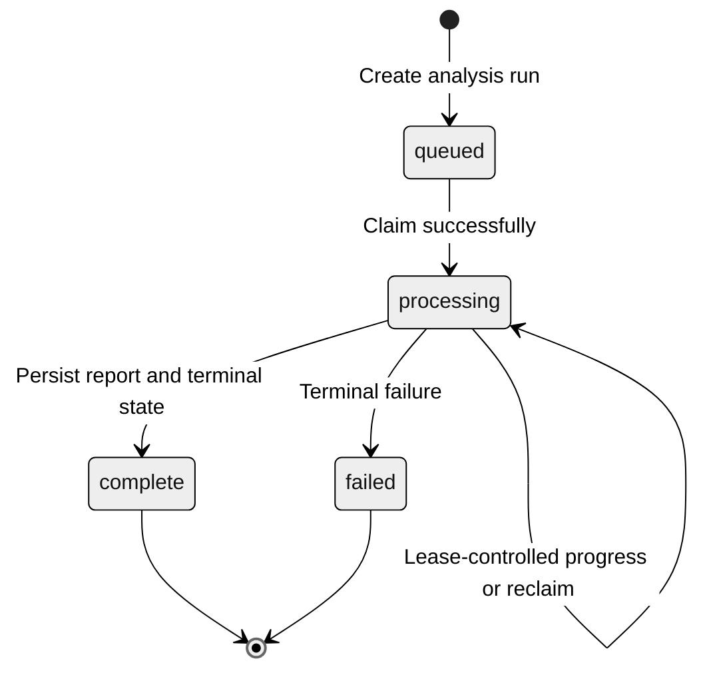
```mermaid
%%{init: {"theme": "neutral"}}%%
stateDiagram-v2
  [*] --> queued: Create analysis run
  queued --> processing: Claim successfully
  processing --> complete: Persist report and terminal state
  processing --> failed: Terminal failure
  processing --> processing: Lease-controlled progress or reclaim
  complete --> [*]
  failed --> [*]

```

Figure 11 uses the run states `queued`, `processing`, `complete` and `failed`. The uploaded log record has its own `uploaded` state. Analysis stages are `parse`, `pattern`, `rootcause` and `report`. Archive state is independent. Do not invent a new persisted state from a UI label.

### 5.2 Analysis Kernel and Tools

`LOG_ANALYSIS_KERNEL=loop` is the current default; `single-shot` is explicit. The bounded loop has step and token budgets and uses its own provider configuration.

| Tool | Purpose | Boundary |
| --- | --- | --- |
| `search_log_lines` | Find candidate evidence | Bounded results and original line semantics |
| `read_line_range` | Read a specific range | No nonexistent evidence lines |
| `get_prefilter_findings` | Read deterministic signals | Signals are evidence, not final diagnosis |
| `read_domain_knowledge` | Retrieve related domain knowledge | Published, organization-scoped content |
| `get_related_parameter_context` | Read parameter context | Read-only and scope-limited |

These are not Xiaoze's mutation tools or approval chain. Structured output validation and line grounding constrain conclusions. Deterministic behavioral evaluation is separate from diagnostic quality on annotated real logs.

### 5.3 Degradation and Provenance

| Situation | Result semantics |
| --- | --- |
| Supported model conclusion | Agent source with model/prompt provenance |
| Provider unavailable | Task-policy retry; possible rules fallback with `provider-unavailable` |
| Budget or grounding/output failure | Bounded convergence or fallback with the implementation's `token-budget-exhausted` reason |
| Early bounded convergence succeeds | Can remain agent-sourced with capped confidence and explicit degradation |
| Fallback also fails | Preserve failure/dead-letter evidence |

Service code uses `analysisSource`; persistence/DTO surfaces can use `analysis_source`. Preserve the adapter mapping. The existing `token-budget-exhausted` branch also covers some invalid or ungrounded output; its name alone does not establish the exact internal cause. UI and exports must expose provenance honestly.

### 5.3.1 Bounded Analysis Loop

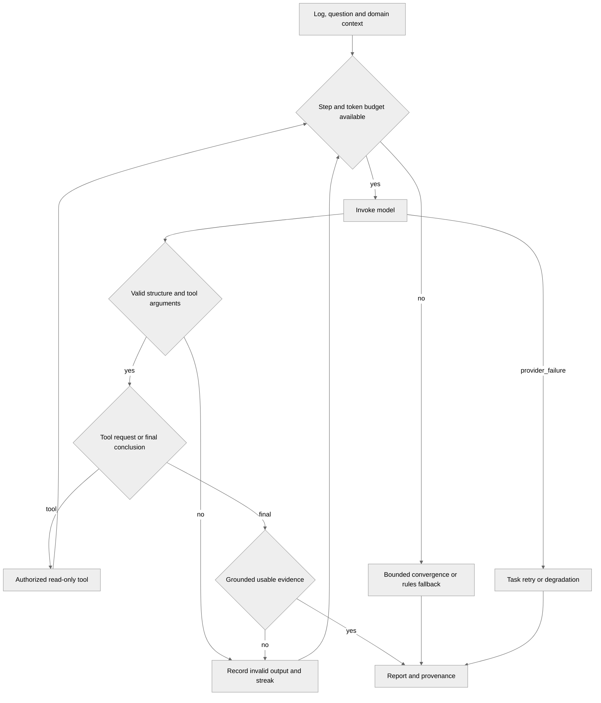
```mermaid
%%{init: {"theme": "neutral"}}%%
flowchart TD
  Start["Log, question and domain context"] --> Budget{"Step and token budget available"}
  Budget -- yes --> Model["Invoke model"]
  Model --> Structure{"Valid structure and tool arguments"}
  Structure -- no --> Invalid["Record invalid output and streak"]
  Invalid --> Budget
  Structure -- yes --> Kind{"Tool request or final conclusion"}
  Kind -- tool --> Read["Authorized read-only tool"]
  Read --> Budget
  Kind -- final --> Ground{"Grounded usable evidence"}
  Ground -- yes --> Report["Report and provenance"]
  Ground -- no --> Invalid
  Budget -- no --> Converge["Bounded convergence or rules fallback"]
  Converge --> Report
  Model -- provider_failure --> Retry["Task retry or degradation"]
  Retry --> Report

```

Figure 12 places validation before acceptance. Additional tool calls cannot exceed the budget. A plausible narrative without valid line references is not an acceptable grounded result. The fallback path must preserve its source and reason instead of presenting rule output as model analysis.

### 5.4 Workers and Notifications

The worker reads object bytes, uses the bound domain profile, updates stages and persists the terminal result under database ownership. Durable dispatch and polling must observe the same claim rules. External notifications/webhooks have their own delivery outcome; notification failure must not be mistaken for a missing analysis result.

### 5.5 Lease Protection

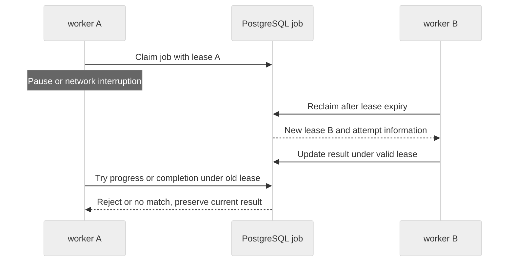
```mermaid
%%{init: {"theme": "neutral"}}%%
sequenceDiagram
  participant A as worker A
  participant DB as PostgreSQL job
  participant B as worker B
  A->>DB: Claim job with lease A
  Note over A: Pause or network interruption
  B->>DB: Reclaim after lease expiry
  DB-->>B: New lease B and attempt information
  B->>DB: Update result under valid lease
  A->>DB: Try progress or completion under old lease
  DB-->>A: Reject or no match, preserve current result

```

Figure 13 demonstrates stale-worker protection. Relevant metadata includes `leaseOwner`, `leaseExpiresAt` and `attemptCount`. A worker that resumes after losing its lease must not overwrite the newer owner's progress or terminal result. Duplicate queue messages do not grant concurrent authority.

Recovery should compare log ID, run ID, job ID, lease, stage and object readability before changing dispatch infrastructure. Restarting Redis alone is not proof that analysis recovered.

## 6 Node Debugging and DTS Reload

### 6.1 Device Bridge and Protocols

The application gateway delegates target operations to the Device Bridge. Simulator, HDC and ADB paths have different external prerequisites. Target identity, protocol binding, permission, confirmation and lease are checked before sensitive actions. Browser possession of a node ID is not authority to write it.

### 6.2 Command Outcome and Observation

A write response records whether the command executed and what was observed afterward. A successful command does not guarantee a successful readback. A readback value is an observation, not automatically a policy verdict that the write succeeded or failed.

| Fact | Evidence |
| --- | --- |
| Command | Execution outcome, structured reason or stderr |
| Observation | Observed value, read failure, unsupported or not requested |
| Recovery | Pre-write snapshot, target identity and operation ID |
| Audit | Actor, action, target, outcome and request association |

### 6.2.1 Result Class Diagram

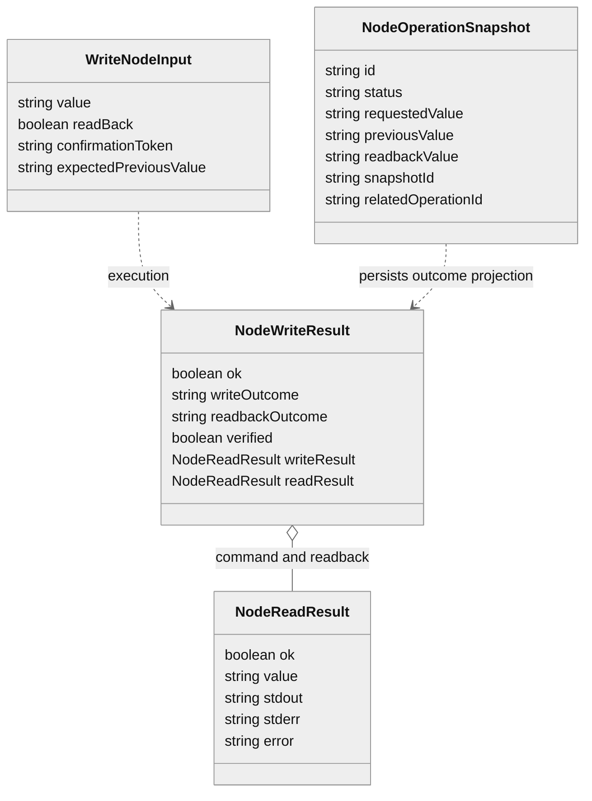
```mermaid
%%{init: {"theme": "neutral"}}%%
classDiagram
  class WriteNodeInput {
    string value
    boolean readBack
    string confirmationToken
    string expectedPreviousValue
  }
  class NodeWriteResult {
    boolean ok
    string writeOutcome
    string readbackOutcome
    boolean verified
    NodeReadResult writeResult
    NodeReadResult readResult
  }
  class NodeOperationSnapshot {
    string id
    string status
    string requestedValue
    string previousValue
    string readbackValue
    string snapshotId
    string relatedOperationId
  }
  class NodeReadResult {
    boolean ok
    string value
    string stdout
    string stderr
    string error
  }
  WriteNodeInput ..> NodeWriteResult : execution
  NodeWriteResult o-- NodeReadResult : command and readback
  NodeOperationSnapshot ..> NodeWriteResult : persists outcome projection

```

Figure 14 is an abridged DTO relationship. `writeOutcome` is `executed/failed/unknown`; `readbackOutcome` is `observed/failed/unsupported/not_requested/unknown`. `verified` can be nullable. Unknown can reflect older bridge capability or insufficient evidence.

The legacy operation status type still contains `readback_mismatch`; that does not establish a current automatic mismatch policy for every observed value. Keep actual command and observation fields as the evidence and interpret them with the specific protocol contract.

### 6.3 DTS Reload Workflow

Reload starts from a captured baseline and proposed overlay. Preflight checks input, target and toolchain before deployment. Deployment then observes the target and records results/residue. Database state and physical target state cannot be updated atomically.

### 6.3.1 Deployment and Restore Sequence

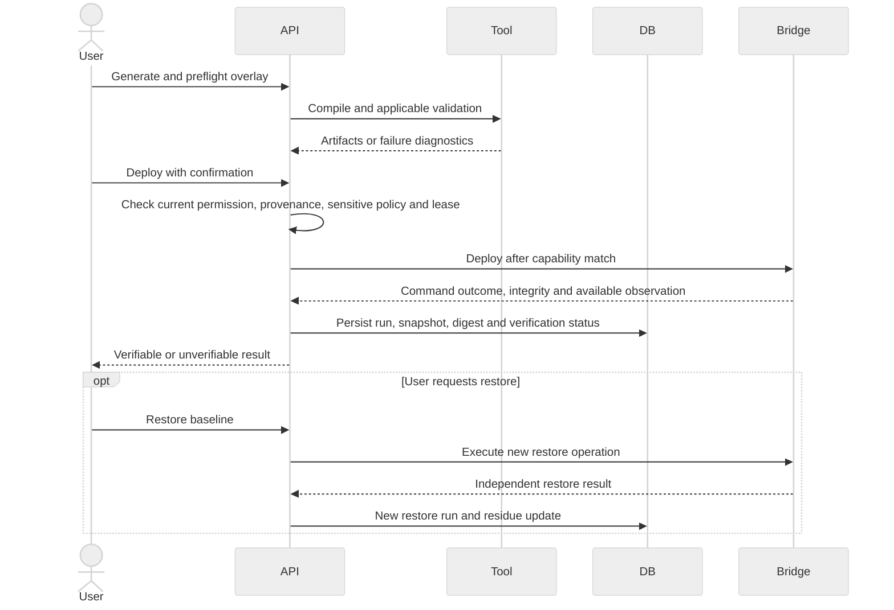
```mermaid
%%{init: {"theme": "neutral"}}%%
sequenceDiagram
  actor User as User
  participant API as API
  participant Tool as Tool
  participant DB as DB
  participant Bridge as Bridge
  User->>API: Generate and preflight overlay
  API->>Tool: Compile and applicable validation
  Tool-->>API: Artifacts or failure diagnostics
  User->>API: Deploy with confirmation
  API->>API: Check current permission, provenance, sensitive policy and lease
  API->>Bridge: Deploy after capability match
  Bridge-->>API: Command outcome, integrity and available observation
  API->>DB: Persist run, snapshot, digest and verification status
  API-->>User: Verifiable or unverifiable result
  opt User requests restore
    User->>API: Restore baseline
    API->>Bridge: Execute new restore operation
    Bridge-->>API: Independent restore result
    API->>DB: New restore run and residue update
  end

```

Figure 15 distinguishes preflight, deployment, observation and baseline restoration. A failed observation does not prove no deployment occurred. Before retrying, inspect operation identity, target state, bridge result and residual files. Recovery must use the captured baseline, not a newly inferred one.

### 6.4 Recovery and Promotion

Restoration requires the appropriate target and authorization and produces its own command/observation evidence. A successful local simulator operation does not prove HDC/ADB target recovery.

Promoting a debugging result into a parameter draft re-enters the project draft/review workflow. It does not bypass candidate identity, assignees, file validation or merge policy.

## 7 Xiaoze and Knowledge

### 7.1 Tool Approval

Xiaoze exposes an authenticated AG-UI endpoint. Read tools follow scope policy. Sensitive tools can interrupt for explicit approval. Tool requests and approval records are persisted as distinct facts. Client prose or model output cannot manufacture a trusted user context.

### 7.1.1 State and Sequence

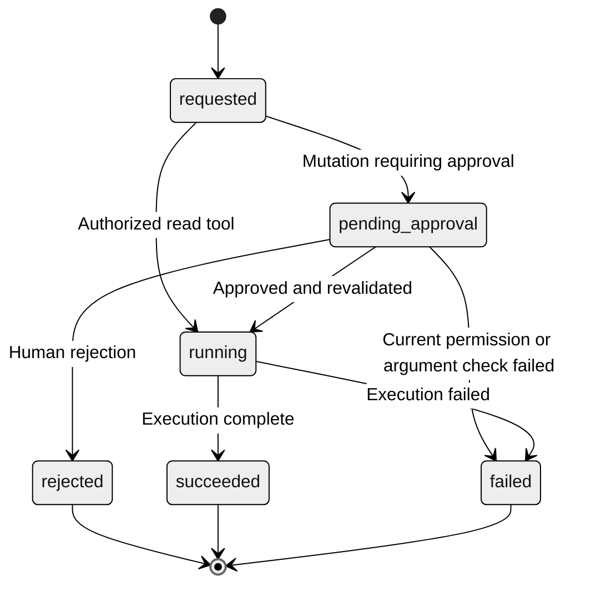
```mermaid
%%{init: {"theme": "neutral"}}%%
stateDiagram-v2
  [*] --> requested
  requested --> running: Authorized read tool
  requested --> pending_approval: Mutation requiring approval
  pending_approval --> rejected: Human rejection
  pending_approval --> running: Approved and revalidated
  pending_approval --> failed: Current permission or argument check failed
  running --> succeeded: Execution complete
  running --> failed: Execution failed
  rejected --> [*]
  succeeded --> [*]
  failed --> [*]

```

Figure 16 distinguishes tool states `requested`, `pending_approval`, `running`, `succeeded`, `failed` and `rejected`. Approval records have `pending/approved/rejected` states. Approved is not equivalent to succeeded.

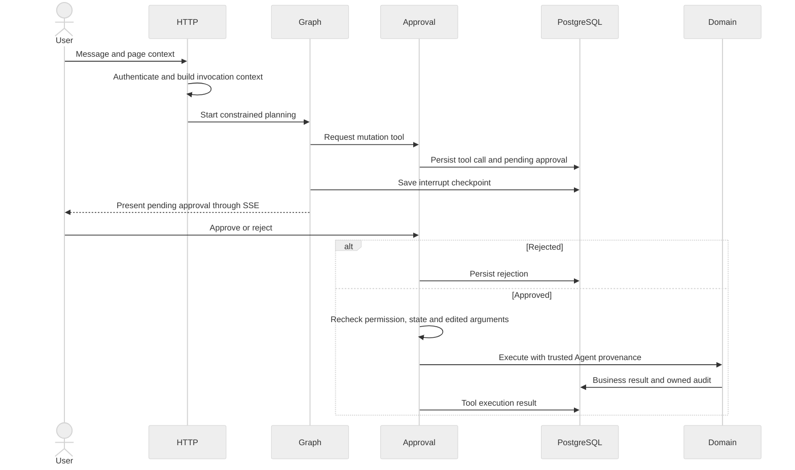
```mermaid
%%{init: {"theme": "neutral"}}%%
sequenceDiagram
  actor User as User
  participant HTTP as HTTP
  participant Graph as Graph
  participant Approval as Approval
  participant PG as PostgreSQL
  participant Domain as Domain
  User->>HTTP: Message and page context
  HTTP->>HTTP: Authenticate and build invocation context
  HTTP->>Graph: Start constrained planning
  Graph->>Approval: Request mutation tool
  Approval->>PG: Persist tool call and pending approval
  Graph->>PG: Save interrupt checkpoint
  Graph-->>User: Present pending approval through SSE
  User->>Approval: Approve or reject
  alt Rejected
    Approval->>PG: Persist rejection
  else Approved
    Approval->>Approval: Recheck permission, state and edited arguments
    Approval->>Domain: Execute with trusted Agent provenance
    Domain->>PG: Business result and owned audit
    Approval->>PG: Tool execution result
  end

```

Figure 17 places human approval before execution and current authorization at execution. A stale approval does not revive revoked roles or authorize changed arguments. Rejection terminates the governed path without a mutation.

### 7.2 Persistence and Recovery

Chat messages provide conversation history; durable checkpoints preserve graph execution, pending interrupts and resume position. Production requires PostgreSQL checkpointing. In-memory state can support local deterministic work but cannot establish recovery across process replacement.

### 7.2.1 Cross-Instance Recovery

Recovery must read the intended thread/namespace checkpoint, recover the pending interrupt and revalidate current identity, scope, approval and tool state. The durability probe uses an independent saver instance to establish that interrupt state is actually persisted rather than retained only in process memory.

A process restart after an external effect may leave an uncertain response. Inspect the original tool call and operation evidence before retrying. Checkpoint existence alone cannot prove that a device action was safely completed exactly once.

### 7.3 Knowledge Lifecycle and Retrieval

Knowledge entries have immutable revisions, publication state, attachments/chunks and indexing status. Retrieval is scoped to the organization and published content. Drafts and archived/private content must not leak into citations.

Embeddings use their own configuration family. When vector retrieval is unavailable and a supported text path is used, expose the actual `fts_only` mode. A successful text result does not prove vector indexing is healthy.

### 7.4 Publication and Indexing

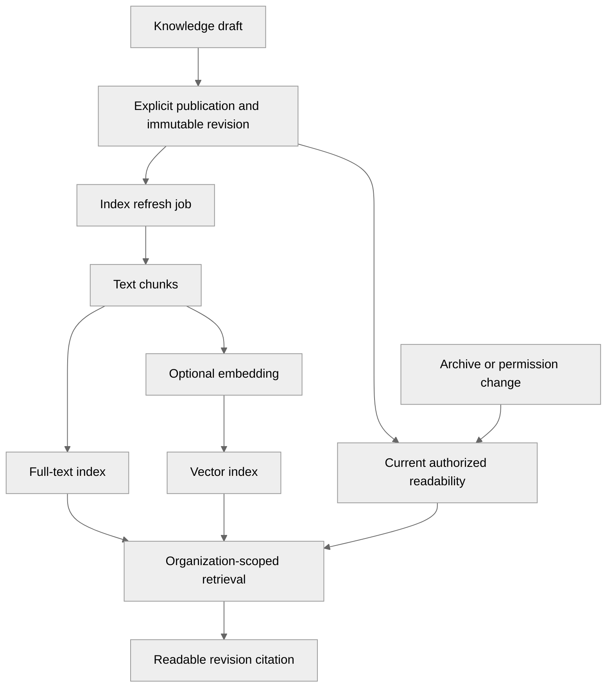
```mermaid
%%{init: {"theme": "neutral"}}%%
flowchart TB
  Draft["Knowledge draft"] --> Publish["Explicit publication and immutable revision"]
  Publish --> Visible["Current authorized readability"]
  Publish --> Job["Index refresh job"]
  Job --> Chunks["Text chunks"]
  Chunks --> FTS["Full-text index"]
  Chunks --> Embed["Optional embedding"]
  Embed --> Vector["Vector index"]
  FTS --> Retrieve["Organization-scoped retrieval"]
  Vector --> Retrieve
  Visible --> Retrieve
  Retrieve --> Citation["Readable revision citation"]
  Archive["Archive or permission change"] --> Visible

```

Figure 18 separates business publication from asynchronous embedding/index work. Failed indexing should remain visible and retryable. Citations must refer to the actual published revision/chunk; a missing result cannot be filled with another organization's content.

## 8 Identity, Authorization and Shared Governance

### 8.1 Authentication and Roles

Backend authorization uses current role bindings, active principal state and target organization/project. UI capability checks improve usability but are not the security boundary.

| Actor/capability | Purpose | Constraint |
| --- | --- | --- |
| Engineering user | Authorized business reads/edits | No automatic review or governance power |
| Hardware/software reviewer | Assigned workflow review | Current assignee slot and role must match |
| Organization administrator | Organization membership and governance | Not automatically platform reviewer or all workflow assignees |
| Platform administrator | Explicit platform and definition governance | Operation policy and independent review still apply |
| Agent initiator | Governed reads and approved mutations | Cannot claim human identity |
| System invocation | Named service/job operation | Has its own policy; does not impersonate a user |

### 8.2 Trusted Invocation

Trusted context is constructed on the server from authenticated state. Request-body fields such as an alleged actor or principal are not a substitute. Sensitive domain seams revalidate required invocation policy rather than relying exclusively on the router.

### 8.2.1 Context Class Diagram

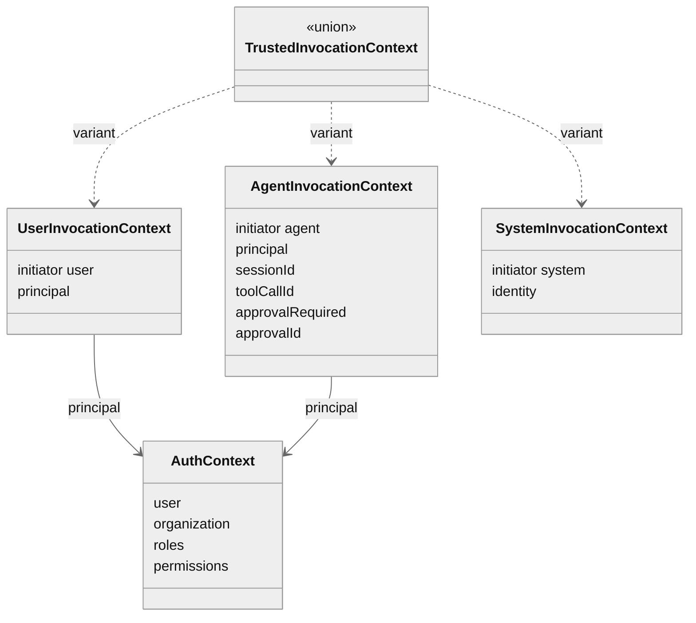
```mermaid
%%{init: {"theme": "neutral"}}%%
classDiagram
  class AuthContext {
    user
    organization
    roles
    permissions
  }
  class TrustedInvocationContext {
    <<union>>
  }
  class UserInvocationContext {
    initiator user
    principal
  }
  class AgentInvocationContext {
    initiator agent
    principal
    sessionId
    toolCallId
    approvalRequired
    approvalId
  }
  class SystemInvocationContext {
    initiator system
    identity
  }
  TrustedInvocationContext ..> UserInvocationContext : variant
  TrustedInvocationContext ..> AgentInvocationContext : variant
  TrustedInvocationContext ..> SystemInvocationContext : variant
  UserInvocationContext --> AuthContext : principal
  AgentInvocationContext --> AuthContext : principal

```

Figure 19 represents a discriminated union, not actual inheritance. The implementation has a private Symbol brand. User, Agent and System variants carry their own attribution; System does not invent a user. Internal initiator/deletion-retention metadata is not automatically a public DTO.

### 8.3 Audit and Retention

Audit associates principal, organization, application, action, target, outcome and request correlation. Query scope remains authorization-sensitive. Business deletion must preserve the required historical attribution while removing or restricting live identity and personal data according to retention policy.

User deletion is a governed service operation, not a raw cascading database cleanup. Self-deletion and unauthorized deletion are rejected. Historical records can refer to deleted principals without reactivating their authority.

### 8.4 Feedback and Notifications

Users submit product feedback with attachments; administrators triage it through the feedback administration route. Validate content, attachment ownership and organization scope. Notification delivery state and user read state are separate. A notification failure does not retroactively invalidate a committed business action.

## 9 API Integration

### 9.1 Requests and Errors

Most APIs use REST/JSON; task progress and Agent interactions also use streaming. Explicit route families exist under both `/api/v1` and `/api/v2`. The frontend calls them through ports and adapters.

Authenticated requests carry `Authorization`. `X-Request-Id` can be supplied or generated and propagated to diagnostics/audit. Endpoint-specific idempotency and version conditions must be retained when retrying; there is no assumption that every mutation accepts one universal idempotency header.

```json
{
  "error": {
    "code": "FORBIDDEN",
    "message": "User does not have permission.",
    "requestId": "req_example"
  }
}
```

| HTTP | Typical code | Client response |
| --- | --- | --- |
| 400 | VALIDATION_FAILED | Preserve input and display validation details |
| 401 | UNAUTHENTICATED | Authenticate again |
| 403 | FORBIDDEN | Stop the unauthorized action |
| 404 | NOT_FOUND | Missing or scope-hidden object |
| 409 | CONFLICT, APPROVAL_REQUIRED | Refresh state or await legitimate approval |
| 410 | GONE | Retired surface; do not fall back to old writes |
| 429 | RATE_LIMITED | Follow the retry policy |
| 503 | SERVICE_UNAVAILABLE | Check readiness and Retry-After |
| 500 | INTERNAL_ERROR | Retain request correlation for diagnosis |

Catalog clients also inspect `error.details.reason`, such as `catalog-not-ready`, `release-drift`, `proposal-stale` or `revision-conflict`. Branch on structured details rather than matching a message string. Not-ready must not become a successful empty dataset.

### 9.1.1 Request Processing

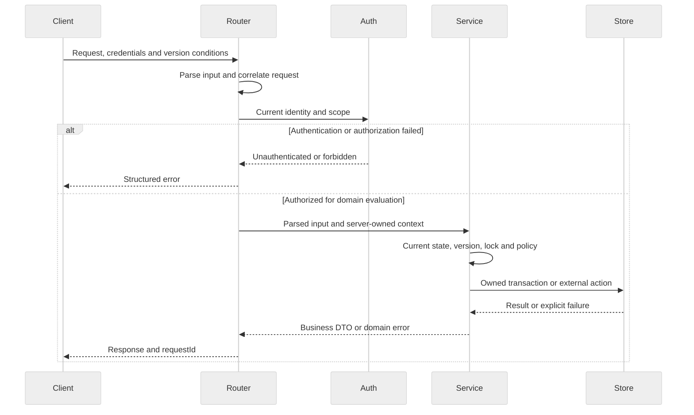
```mermaid
%%{init: {"theme": "neutral"}}%%
sequenceDiagram
  participant Client as Client
  participant Router as Router
  participant Auth as Auth
  participant Service as Service
  participant Store as Store
  Client->>Router: Request, credentials and version conditions
  Router->>Router: Parse input and correlate request
  Router->>Auth: Current identity and scope
  alt Authentication or authorization failed
    Auth-->>Router: Unauthenticated or forbidden
    Router-->>Client: Structured error
  else Authorized for domain evaluation
    Router->>Service: Parsed input and server-owned context
    Service->>Service: Current state, version, lock and policy
    Service->>Store: Owned transaction or external action
    Store-->>Service: Result or explicit failure
    Service-->>Router: Business DTO or domain error
    Router-->>Client: Response and requestId
  end

```

Figure 20 shows domain state validation after authentication/authorization. A successful HTTP response can represent creation of an asynchronous run/job; clients still need its terminal result.

On an uncertain mutation timeout, recover the original operation or replay the endpoint's original idempotent request. Automatically assigning a new identity can duplicate an external effect.

### 9.2 Main API Families

| Family | Representative path | Boundary |
| --- | --- | --- |
| Current identity | `GET /api/v1/me` | User, organization and effective roles |
| Organization | `GET/PATCH /api/v1/organization` | Rename requires users:manage |
| Users and roles | `/api/v1/users`, `/:userId/roles` | Server authority, active state and retention |
| User deletion | `DELETE /api/v1/users/:userId` | Authorized success is 204; no self/unauthorized deletion |
| Parameters/drafts | `/api/v1/parameters`, `/api/v1/parameter-drafts` | Project, type and candidate identity |
| Submission/review | `/api/v1/parameter-submission-rounds`, `/api/v1/parameter-change-requests` | Assignees and state transitions |
| Files | `/api/v1/projects/:projectId/parameter-files` | Ownership, revisions and conflicts |
| Catalog | `/api/v2/catalog/*` | Pinning, registration, scope and readiness |
| Logs/domains | `/api/v1/logs`, `/api/v1/log-domains` | Organization, evidence and archives |
| Debugging/reload | `/api/v1/debugging/*`, `/api/v1/dts-reload/*` | Leases, confirmation, snapshots and observation |
| Knowledge | `/api/v1/knowledge/*` | Publication, revisions, objects and index state |
| Xiaoze | `POST /api/v1/agent/xiaoze` | AG-UI SSE, authorization and interrupts |
| Audit | `/api/v1/audit-events` | Scope, filtering, association and pagination |

These are route-family examples, not literal wildcard requests or a complete endpoint inventory. Use generated OpenAPI for the precise method, path, payload and response.

### 9.3 Contract Maintenance

Route metadata and schemas generate OpenAPI. Contract checks catch server/client/DTO drift. Review missing fields, empty lists, conflicts and permission errors in the consumer as well as the producer. Do not add silent mock fallback.

Catalog IDs are opaque. Explicit legacy mapping distinguishes mapped, archived, conflicting, unknown and scope-hidden results. Historical bookmarks must retain historical release identity and cannot bypass a retired write surface.

## 10 Development and Configuration

### 10.1 Local Preparation

Use the repository-compatible Node/npm, reachable PostgreSQL and pinned DTS toolchain. Container-based development also needs Docker. Inspect existing environment files before copying a template.

```bash
npm ci
cp .env.example .env
npm run dts:toolchain:bootstrap
npm run dts:toolchain:check -- --required
npm run db:migrate
```

The example assumes a macOS/Linux shell and a database/environment you own. Catalog integration verification needs a dedicated pgvector database and role-faithful execution; shared application data is not disposable test data.

Start API and frontend with `npm run dev:api` and `npm run dev`. Log processing requires a worker. When using `npm run worker:logs` independently, explicitly configure API worker ownership to avoid an unintended second worker arrangement. Run migrations/seeds only in the intended environment.

### 10.2 Key Configuration

| Setting | Purpose | Constraint |
| --- | --- | --- |
| VITE_WISEEFF_RUNTIME_MODE | api or mock | API default; no production mock business data |
| VITE_WISEEFF_API_BASE_URL | Frontend API address | Common local value: http://127.0.0.1:8787 |
| DATABASE_URL | PostgreSQL | Treat credential-bearing values as secrets |
| AUTH_MODE, AUTH_PROVIDER | Identity runtime | Match deployment and verification target |
| OBJECT_STORE_MODE | local or s3 | Production requires appropriate S3-compatible storage |
| LOG_WORKER_ENABLED | In-API worker | Coordinate with independent worker deployment |
| LOG_ANALYSIS_QUEUE_MODE, REDIS_URL | polling/durable dispatch | Durable mode needs Redis |
| LOG_ANALYSIS_KERNEL | loop/single-shot | Loop default with step/token limits |
| XIAOZE_CHECKPOINTER | memory/postgres | Production requires PostgreSQL and a valid connection |
| XIAOZE_DETERMINISTIC | Deterministic behavior | Not online model-quality evidence |
| EMBEDDING_MODEL, EMBEDDING_API_BASE_URL | Vector retrieval | Report supported text fallback honestly |

### 10.3 Models and Secrets

Xiaoze uses `XIAOZE_LLM_API_BASE_URL`, `XIAOZE_LLM_MODEL` and `XIAOZE_LLM_API_KEY`. Log analysis uses its separate `LOG_ANALYSIS_*` settings. Knowledge embeddings use `EMBEDDING_API_*`. Availability of one path does not prove another.

Do not place tokens, keys or database credentials in source control, screenshots or deliverables. Configuration validation establishes shape, not remote connectivity, authorization, quota or output quality.

## 11 Deployment, Operations and Recovery

### 11.1 Health Layers

| Surface | Meaning | Does not replace |
| --- | --- | --- |
| `/health/live` | Process responds | Dependency readiness |
| `/health/ready` | Database/storage/worker dependency checks | Complete business acceptance or release approval |
| Pilot readiness | Aggregated configuration/dependency/evidence view | Actual target drill and human release decision |
| `/metrics` | Private operational metrics | Full traces and business outcomes |

### 11.1.1 Self-Hosted Topology

```mermaid
%%{init: {"theme": "neutral"}}%%
flowchart TB
  Browser["Browser"] --> Proxy["Reverse proxy and TLS"]
  Proxy --> Web["Static web"]
  Proxy --> API["API process"]
  API --> PG["PostgreSQL"]
  API --> Object["S3-compatible object store"]
  API --> Redis["Redis / BullMQ"]
  Redis --> Worker["Dedicated log worker"]
  Worker --> PG
  Worker --> Object
  Worker --> Provider["Model provider"]
  API --> Bridge["Device Bridge connection"]
  Monitor["Private metrics collection"] --> API
  Monitor --> Worker
  Monitor --> PG

```

Figure 21 separates public entry from private API, worker and infrastructure. PostgreSQL, Redis, object storage and operational endpoints should follow their intended private network and credential boundaries. Web availability alone does not establish worker health.

### 11.2 Controlled Upgrade

Upgrade procedures capture version/configuration, verify prerequisites, prepare a recoverable baseline, apply changes and collect health/smoke evidence. The allowed recovery action depends on the completed phase and compatibility of persisted state.

### 11.2.1 Upgrade Phases

```mermaid
%%{init: {"theme": "neutral"}}%%
flowchart TD
  Version["Pin version and build"] --> Check["Configuration and migration compatibility"]
  Check --> Quiesce["Pause applicable queues and writes"]
  Quiesce --> Backup["Record recovery point"]
  Backup --> Replace["Rebuild candidate services"]
  Replace --> Health{"Candidate health and key checks"}
  Health -- pass --> Resume["Resume queues and entry points"]
  Health -- fail --> Diagnose["Preserve phase and diagnostics"]
  Diagnose --> Rollback["Apply phase-appropriate recovery"]
  Rollback --> Verify["Verify recovered data and services"]

```

Figure 22 is a phase-level explanation, not a replacement for the executable runbook. Preflight failure stops before mutation. A post-change failure requires evidence-driven restore/rollback appropriate to the actual stage. A successful command is not proof that business workflows recovered.

### 11.3 Backup and Restore

A recoverable backup must account for database state and associated object bytes plus required configuration/version metadata. Restore into a controlled target, verify migrations and object access, then validate representative reads, writes and jobs. Record the actual restore point and target evidence.

Database recovery does not undo physical device actions. Device baseline restoration belongs to the debugging/reload protocol and requires its own observation.

### 11.4 Catalog Cutover and Retirement

Populated-data cutover uses a maintenance window, captured release/source identity, mapping/archive evidence and controlled activation. Retired surfaces must return their intended result rather than reopening old write paths.

A new route being registered, a successful local contract check and a completed target cutover are different evidence. Use the cutover/archive/rollback contract and the target runbook for an actual operation.

## 12 Verification and Troubleshooting

### 12.1 Select Checks by Impact

| Change | Primary checks | Evidence |
| --- | --- | --- |
| Documentation | `npm run docs:check`, `git diff --check` | Governance, references and formatting |
| Frontend/shared types | Focused tests and `npm run build` | Component/type/build behavior |
| Service/transaction | Focused service tests and real PostgreSQL integration | API/database/audit |
| DTO/API | Contract checks and affected consumers | Producer/consumer consistency |
| Browser behavior | Affected acceptance and three viewport sizes | Actual UI behavior |
| Log kernel | logs:eval plus applicable quality evaluation | Deterministic behavior and real-log quality separately |
| Device/operations | Simulator checks and separate target drill | Local protocol shape versus target fact |

Read the verification matrix before selecting gates. A test source pointer is not an executed PASS. Missing prerequisites, skipped checks and zero collected tests must remain visible. This compendium revision does not claim new product test execution.

### 12.2 Diagnostic Path

| Symptom | Inspect first | Resolve next |
| --- | --- | --- |
| Wrong project/value | Runtime mode, adapter, DTO and late response | Project, candidate and release identity |
| Empty/not-ready catalog | Release pointer, registration, scope, projection | Valid empty result versus failure |
| Submission/approval conflict | Current version, lock, approval and actual roles | Refresh evidence before a new decision |
| Stalled logs | Object access, job lease, worker and dispatch | Run/job terminal state and retry reason |
| Command/observation disagreement | Write outcome, readback, snapshot and protocol | Distinguish command failure from observed difference |
| Xiaoze cannot resume | Checkpoint store, namespace and current authority | Persisted interrupt and approval chain |
| Missing knowledge | Publication, scope, index and embedding configuration | Text fallback or index retry |
| Failed upgrade/restore | Exact version, stage, restore point, dependencies | Allowed recovery for that phase |

### 12.2.1 Minimum Evidence

Preserve project/binding/candidate/request IDs for parameter incidents; release pin and authorized query scope for usage incidents; log/run/job IDs and lease/stage for analysis incidents; operation/snapshot/bridge/target for device incidents; tool-call/approval/thread for Agent incidents; entry/revision/publication/index state for retrieval incidents.

Do not bypass a conflict with repeated new requests, report all usage errors as zero, treat approved as succeeded, or repeat a device write before inspecting the original possible effect. Preserve evidence before changing the environment.

### 12.3 Engineering Handover

Start with the runtime mode, source SHA and actual target. Follow one representative request from route to port, adapter, service and persistence. Identify the version/authorization boundary and the external effects. Select focused tests and the required environment gates, then record actual outcomes separately from source inspection and historical evidence.

## 13 Sources and Maintenance

This compendium integrates current architecture, domain/API contracts, security/permission design, development configuration, verification and operational guidance. Historical plans and locked target contracts provide context, not automatic proof of either implementation absence or deployment completion.

### 13.1 Source Traceability

| Subject | Implementation or detailed owner |
| --- | --- |
| Routes/runtime/discovery | [appConfig.ts](../../src/appConfig.ts), [appRuntime.ts](../../src/app/appRuntime.ts), [workflowDiscovery.ts](../../src/domain/workflowDiscovery.ts) |
| API composition | [server/app.ts](../../server/app.ts) |
| Parameter ports/typed drafts | [ParameterRepository](../../src/application/ports/ParameterRepository.ts), [ParameterTopologyRepository](../../src/application/ports/ParameterTopologyRepository.ts) |
| Parameter statuses/compatibility | [domain types](../../src/domain/parameters/types.ts) |
| Catalog runtime and scope | [productionWire.ts](../../server/modules/parameter-catalog-api/productionWire.ts), [kernel interface](../../server/modules/catalog-kernel/interface.ts) |
| Proposal commands/replay | [command.ts](../../server/modules/parameter-governance/proposals/command.ts), [workflow integration tests](../../server/modules/parameter-governance/proposals/workflow.integration.test.ts) |
| Log states/leases | [status.ts](../../server/modules/logs/status.ts), [job types](../../server/modules/jobs/types.ts), [worker](../../server/modules/logs/worker.ts) |
| Kernel/fallback | [analyzer selection](../../server/modules/logs/analyzer/analyzerFromEnv.ts), [agentLoop](../../server/modules/logs/analyzer/agentLoop.ts), [llmAnalyzer](../../server/modules/logs/analyzer/llmAnalyzer.ts) |
| Device DTO | [DebuggingGateway](../../src/application/ports/DebuggingGateway.ts) |
| Reload/recovery | [dts-reload](../../server/modules/dts-reload/), [deployment acceptance](../../e2e/acceptance/dts-reload-deploy.acceptance.spec.ts) |
| Agent/approvals/recovery | [types](../../server/modules/agent/types.ts), [orchestrator](../../server/modules/agent/orchestrator.ts), [durable checkpointer](../../server/modules/agent/xiaoze/durableCheckpointer.ts) |
| Trusted provenance/retention | [trustedInvocation.ts](../../server/modules/auth/trustedInvocation.ts), [user deletion integration](../../server/modules/users/deletion.integration.test.ts) |
| Knowledge | [service.ts](../../server/modules/knowledge/service.ts) |
| Configuration/errors | [env.ts](../../server/config/env.ts), [HTTP errors](../../server/shared/http/errors.ts) |
| Operations | [upgrade script](../../ops/self-hosted/scripts/upgrade.sh), [runbooks](../runbooks/README.md) |
| Test design/check selection | [Testing Strategy and Design](testing-strategy.md), [verification matrix](../developer/verification-matrix.md) |

### 13.2 Diagram Maintenance and Evidence Boundary

The 22 Mermaid diagrams cover context/runtime/module architecture, interfaces, conceptual entities, data flow, state machines, sequences and deployment/recovery. Their neutral theme keeps the figures readable without semantic dependence on color.

When an interface, enum, dependency or transaction boundary changes, update its diagram and surrounding explanation in both editions. Conceptual ER cardinalities and abridged class diagrams do not replace physical schema or full DTO definitions. Sequence diagrams explain ordering and boundaries; they do not assert that database and external operations share a transaction.

Markdown is the maintained compendium format. Update this existing page rather than create a competing handbook. Source links support auditing and deeper contract work, while the main reading remains self-contained.
