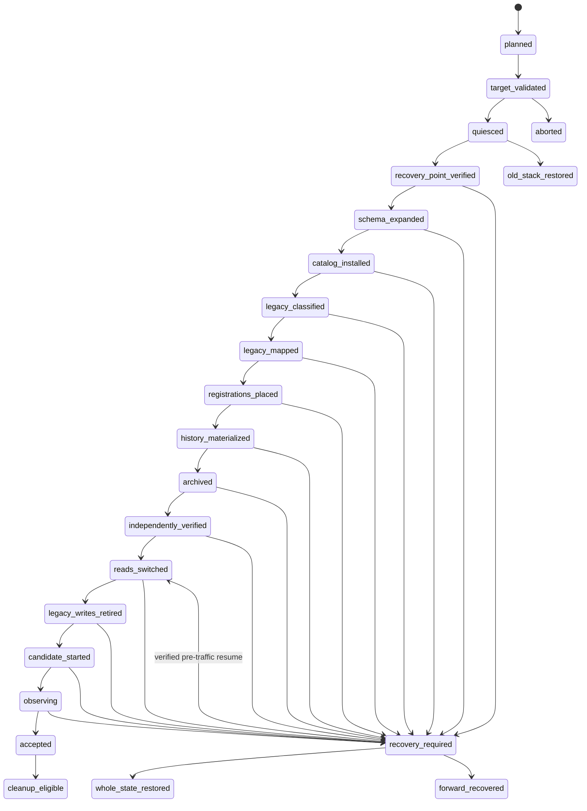

# Parameter catalog cutover, archive, and rollback contract

> Chinese companion: [中文](../zh-CN/design-docs/parameter-catalog-cutover-archive-rollback.md)

Date: 2026-09-01

## Status and scope

Accepted decision artifact for [Choose populated-data cutover, archive, and rollback strategy](https://github.com/tzrea1-Q/WiseEff/issues/678) in [Wayfinder: replace the parameter catalog with one canonical definition model](https://github.com/tzrea1-Q/WiseEff/issues/668).

This document decides the migration, archive, activation, and recovery contract for fresh and populated PostgreSQL databases. It is not a production migration, cutover script, migration number, release-readiness claim, or authorization to delete production data. Implementation begins only after the Wayfinder map is collapsed through the repository's normal specification and implementation planning workflow.

Normative inputs are:

- [current contract and consumer inventory](https://github.com/tzrea1-Q/WiseEff/blob/f982c76a063f3c8bc0a7366d5253243ecba2866f/docs/references/parameter-catalog-contract-inventory.md);
- [R0-R10 legacy classification](https://github.com/tzrea1-Q/WiseEff/blob/000f617ba9810adda4798b4bc4b2bdfed95b4c39/docs/references/legacy-parameter-row-classification.md);
- [populated PostgreSQL rehearsal fixture](https://github.com/tzrea1-Q/WiseEff/blob/6c3adfc35c0e3be6d5d381013dace9408190380e/docs/references/parameter-catalog-rehearsal-fixture.md);
- [ADR-0040, ADR-0041, and ADR-0042 final integrated decision set](https://github.com/tzrea1-Q/WiseEff/tree/9fe269d4facc31b49fc1e0535d2d51ba7140644b/docs/adr); and
- the current [effective catalog reconciliation runbook](../runbooks/effective-driver-parameter-catalog-reconciliation.md) and [self-hosted upgrade controller](../../ops/self-hosted/upgrade.md).

The accepted A+B+C UI prototype is decision evidence only and is not a migration input.

## Fixed outcomes

- Cutover uses one bounded maintenance window. There is no long-lived dual write.
- Public traffic, queues, API, worker, and web remain isolated until the candidate database, Catalog Release, mappings, archive, and read path pass an independent verifier.
- A cross-store recovery point is captured only after write and queue quiescence and is verified before the first database mutation.
- Only a published immutable Catalog Release may materialize Catalog subjects, release memberships, aliases, Parameter definitions, or Definition revisions.
- Property key, display name, module name, source-key token, observed node name, and row order are never identity proof.
- Every legacy identity receives exactly one disposition in the cutover run. Unknown or ambiguous data fails closed into ReviewEvidence or immutable Archive, never operational reads.
- Stable business references are retained through typed, versioned legacy-ID mappings. Historical rows are never rewritten to make the current view look clean.
- Catalog Release installation, application read switching, and public traffic switching are three distinct events with separate evidence.
- Pointer switch-back is a narrow pre-traffic, zero-candidate-write recovery. It is not the general rollback mechanism.
- Local synthetic success, populated-shape success, target-host rehearsal, and release evidence are distinct evidence classes.

## Maintenance module seam

The future implementation should expose one deep **parameter catalog cutover module** at the maintenance seam. Its small interface is:

```text
planCutover(targetArtifact, sourceSnapshot) -> immutable CutoverPlan
executeCutover(planDigest) -> CutoverRunSnapshot
inspectCutover(runId) -> CutoverRunSnapshot
recoverCutover(runId, recordedAction, runBoundToken) -> CutoverRunSnapshot
```

`executeCutover` owns phase ordering, checkpoints, exclusive locks, transaction boundaries, idempotency, evidence, and failure classification. Callers do not coordinate classification, mapping, archive, pointers, or writer retirement themselves. The self-hosted controller is an adapter at this seam. The real-PostgreSQL runner from [Capture a representative populated-database rehearsal fixture](https://github.com/tzrea1-Q/WiseEff/issues/671) is a test adapter at the same seam, not a separate migration implementation.

Catalog compilation and synchronization remain behind the catalog-kernel interface to be decided by [Choose the catalog kernel interface and transaction boundary](https://github.com/tzrea1-Q/WiseEff/issues/673). This contract consumes that interface; it does not duplicate or pre-empt it.

Internal seams may adapt PostgreSQL, the recovery-point controller, queue/traffic isolation, the Catalog Release synchronizer, independent verification, and the evidence store. They stay private unless a real production and test adapter both exist.

## Cutover state machine



`catalog_installed` means the immutable Catalog Release and Definition heads have switched inside an isolated candidate database state. `reads_switched` is the separate application read-mode activation. `candidate_started` does not mean public traffic is live; queue resume and proxy switch occur only after internal readiness.

### Phase contract

| Phase                                     | Entry condition                                                                                                      | Operation and exit proof                                                                                                                                                                                                                                                                                                                                                                                                                                                      | Retry or recovery rule                                                                                                                                                         |
| ----------------------------------------- | -------------------------------------------------------------------------------------------------------------------- | ----------------------------------------------------------------------------------------------------------------------------------------------------------------------------------------------------------------------------------------------------------------------------------------------------------------------------------------------------------------------------------------------------------------------------------------------------------------------------- | ------------------------------------------------------------------------------------------------------------------------------------------------------------------------------ |
| P0 Inventory and plan                     | Exact target artifact, current application SHA, database migration inventory, and operator approval owner are known. | Read-only inventory records source schema and relation fingerprints, R0-R10 counts, protected-reference counts, current catalog/read modes, installed release digest, candidate lineage, changed migrations, storage identities, and the full plan digest.                                                                                                                                                                                                                    | Freely repeatable. A changed input creates a new plan digest.                                                                                                                  |
| P1 Offline target validation              | P0 plan is current.                                                                                                  | Build candidate before downtime; validate Catalog Release manifest, digests, complete memberships, aliases, tombstones, Definition snapshots, toolchain, supported lineage, old/new schema compatibility declaration, and the evidence reference from [Capture a representative populated-database rehearsal fixture](https://github.com/tzrea1-Q/WiseEff/issues/671).                                                                                                        | Repeatable before downtime. A changed artifact is a new plan.                                                                                                                  |
| P2 Write and traffic quiescence           | P1 passed and maintenance confirmation was recorded.                                                                 | Stop public proxy; pause and drain queue; stop API, worker, and web; acquire host and PostgreSQL cutover locks; revoke or fence legacy and candidate application writers; prove zero active write transactions and zero leased jobs.                                                                                                                                                                                                                                          | Stop/drain operations may be retried. Failure restores and verifies the old stack without touching data.                                                                       |
| P3 Verified recovery point                | P2 remains true.                                                                                                     | Capture PostgreSQL, configured S3-compatible object store, and durable Redis from the same quiesced boundary. Verify manifests, checksums, restore tooling, storage identities, target location, and the plan's maximum age. Record one recovery-point digest.                                                                                                                                                                                                                | Snapshot may be retried before mutation. A stale or unverifiable point blocks P4.                                                                                              |
| P4 Target schema expand                   | P3 digest is valid and writers remain fenced.                                                                        | Apply append-only, old-binary-compatible schema expansion as a one-shot maintenance process; verify exact migration names/checksums and target relations/roles. API startup is not the migration runner.                                                                                                                                                                                                                                                                      | Exact committed migrations are verified no-ops. Unknown partial state, checksum drift, or backward incompatibility requires whole-state restore or an approved forward repair. |
| P5 Immutable Catalog Release installation | P4 passed.                                                                                                           | Bootstrap or synchronize the target release under the exclusive catalog lock. Stage stable roots, complete subject/alias memberships, Definition revisions, and fingerprints; atomically switch Catalog Release and Definition heads; independently record before/after heads.                                                                                                                                                                                                | Same verified digest is a read-only no-op. Transaction failure is retryable only with unchanged inputs; drift blocks.                                                          |
| P6 Legacy classification                  | P5 is complete and the source graph fingerprint still equals P0.                                                     | Classify every legacy definition bundle R0-R10 by the full graph. Record class predicate version, source checksum, relation fingerprint, protected references, and deterministic counts.                                                                                                                                                                                                                                                                                      | Read-only and repeatable while the source fingerprint is unchanged. Any R0 or changed graph stops the run.                                                                     |
| P7 Deterministic typed mapping            | P6 contains no blocker.                                                                                              | Create one mapping-version disposition for every legacy identity and one current mapping head for every protected identity. Conflicting or duplicate outcomes fail.                                                                                                                                                                                                                                                                                                           | Idempotent by run, source identity, checksum, and target. A different outcome is conflict, not overwrite.                                                                      |
| P8 Subject registrations and placements   | P7 can resolve every required Catalog subject through the installed release.                                         | Materialize only evidence-backed Organization registrations and exactly-one placements; verify current-release active membership for new registrations, same-Organization ownership, kind-correct module, and retained IDs.                                                                                                                                                                                                                                                   | Per-identity transactions may resume within the same run. Conflicting placement or weak proof becomes ReviewEvidence or a blocker for a protected current reference.           |
| P9 Bindings, Project values, and history  | P8 passed for every operational Binding.                                                                             | Materialize operational Bindings, complete Binding/value revision history, exact DefinitionRevision pins, current value/effective revision pointers, source/config ownership, legacy maps, and trusted audit continuity. Archive non-operational graphs without rewriting them.                                                                                                                                                                                               | Stable source keys make batches resumable. Pointer inference, cross-owner reference, or conflicting tips block completion.                                                     |
| P10 Immutable archive                     | P6-P9 dispositions are complete.                                                                                     | Store immutable metadata and encrypted payload references for every Archive outcome and every source row whose original graph must remain reconstructable. Verify object and relation-graph checksums.                                                                                                                                                                                                                                                                        | Exact same archive digest is a no-op. A different digest for one source identity is drift.                                                                                     |
| P11 Independent verification              | P5-P10 checkpoints are complete.                                                                                     | A read-only verifier using code and credentials distinct from writers recomputes all catalog, mapping, registration, history, archive, and consumer-reference invariants. Every required metric is zero or exact.                                                                                                                                                                                                                                                             | Deterministic re-run is allowed. Failure keeps traffic isolated; correction must use same-run idempotent work or whole-state restore, never ad hoc SQL.                        |
| P12 Atomic application read switch        | P11 report digest is approved.                                                                                       | Compare-and-swap the application read-mode pointer from legacy to canonical and record the exact Catalog Release, mapping epoch, and verifier report. There is no dual-read business fallback; any shadow comparison remains read-only evidence.                                                                                                                                                                                                                              | Unknown commit outcome is resolved by reading the pointer. Switch-back is allowed only under the zero-write rules below.                                                       |
| P13 Legacy writer retirement              | P12 is current and traffic remains isolated.                                                                         | Revoke production mutation privileges, disable legacy mutation entry points and background writers, and prove zero reachable legacy writer. Legacy tables/triggers may remain read-only for the observation and rollback window.                                                                                                                                                                                                                                              | Reapplying the exact role/route fence is idempotent. Failure blocks candidate startup.                                                                                         |
| P14 Candidate startup and traffic switch  | P13 and a fresh P11 verification passed.                                                                             | Start API in verify-only startup mode, require packaged/current release digest equality, then start worker/web. Run read-only internal smoke; resume queue; recreate proxy; require public live/ready and final container/storage/config identity. First queue or public business write closes pointer-only rollback.                                                                                                                                                         | Health-only completion phases may use protected candidate recovery while inputs and recovery point verify. No migration or synchronization occurs at process startup.          |
| P15 Observation and acceptance            | P14 completed.                                                                                                       | Observe the predeclared period and at least one complete business workload cycle. Require no catalog drift, unmapped ID, legacy write, archive mismatch, or pin/placement error; record target and release evidence separately.                                                                                                                                                                                                                                               | Failure after candidate writes uses forward recovery or incident-owner-approved whole-state restore.                                                                           |
| P16 Contract cleanup                      | P15 accepted and the separate retirement gate approves cleanup.                                                      | In a later release, remove legacy routes/adapters/triggers/tables only after the compatibility window from [Choose the parameter API and legacy-identifier transition](https://github.com/tzrea1-Q/WiseEff/issues/677) expires, the deletion evidence from [Choose verification, upgrade, and legacy-retirement gates](https://github.com/tzrea1-Q/WiseEff/issues/679) passes, restore is independent, and protected references are zero. Archive and mapping history remain. | Not part of the original cutover retry path. Failure is a forward-recovery event; pointer rollback is insufficient.                                                            |

No phase may advance from a checkpoint whose input digest differs from its predecessor. A restore invalidates the run: retry uses a new run ID, a new plan, and a new recovery point.

## R0-R10 disposition matrix

The **primary disposition** is unique. Mandatory mapping/archive evidence does not create a second operational disposition.

| Class                                     | Primary disposition                                            | Required result                                                                                                                                                                                                                                                                 | Prohibited result                                                                                                          |
| ----------------------------------------- | -------------------------------------------------------------- | ------------------------------------------------------------------------------------------------------------------------------------------------------------------------------------------------------------------------------------------------------------------------------- | -------------------------------------------------------------------------------------------------------------------------- |
| R0 contradictory or cross-owner graph     | **Hard blocker**                                               | Stop before operational mapping. Record the exact violated owner/key/revision/reference invariant and the source graph fingerprint. A separately reviewed repair or restore must produce a newly classified input.                                                              | Promotion, merge, deletion, archive-as-success, or guessed owner repair.                                                   |
| R1 disposable implementation scaffold     | **Immutable Archive**                                          | Archive the scaffold and its dependency-zero proof. It receives no operational identity; later physical deletion still waits for P16.                                                                                                                                           | Definition, Proposal, Observation, Registration, Binding, or unverified deletion.                                          |
| R2 provable DriverSchema root             | **Legacy ID map to CatalogSubject**                            | Map the legacy root ID to the independently published Catalog subject declared by the installed release. The root is corroborating mapping evidence only and is retained in Archive.                                                                                            | Materializing a subject or Definition from the legacy row.                                                                 |
| R3 ambiguous/incomplete DriverSchema root | **ReviewEvidence**                                             | Create operator-only ReviewEvidence with Archive payload and an unresolved typed mapping. It is absent from current matching.                                                                                                                                                   | CatalogSubject, Definition, registration, or name/key-based attribution.                                                   |
| R4 complete Driver DTS property           | **Operational ParameterDefinition/DefinitionRevision mapping** | Map spec/version IDs to the exact Driver-owned Definition and revision already materialized by the Catalog Release. Map proven Organization use to registration/placement and operational Bindings.                                                                             | Creating release content from the row or copying the Platform catalog per Organization.                                    |
| R5 complete NodeType DTS property         | **Operational ParameterDefinition/DefinitionRevision mapping** | Map to the exact NodeType-owned Definition/revision from the release and preserve the NodeType taxonomy.                                                                                                                                                                        | Driver reclassification, property-key union with a Driver, or observed-module identity.                                    |
| R6 unlinked DTS property surface          | **ReviewEvidence**                                             | Preserve the source as migration ReviewEvidence plus immutable Archive and typed legacy mapping. When a separate complete project/source occurrence graph exists, that graph may independently produce a Parameter observation; the subjectless definition-shaped row does not. | Current Definition, inferred subject, activation, merge, registration, or Binding.                                         |
| R7 legacy active non-DTS policy/override  | **Immutable Archive**                                          | Remove it from structural/current reads, preserve history and IDs, and record a policy-review reason. A future Policy or Definition proposal must be a separately governed act against an existing Platform Definition.                                                         | Organization definition override, Platform materialization, or automatic Policy activation from definition-shaped content. |
| R8 legacy draft proposal                  | **DefinitionProposal**                                         | Create one reviewable Platform publication proposal retaining owner, evidence, source checksum, original lifecycle, and legacy ID. Acceptance remains publication intent only.                                                                                                  | Organization Definition, direct DefinitionRevision, automatic acceptance, or same-key merge.                               |
| R9 superseded/deprecated/historical row   | **Typed mapping to immutable target history**                  | Map each source identity to its same-kind Definition revision, Binding history, Project value, Proposal/history, audit, or Archive record. It never becomes current merely because it is retained.                                                                              | History rewrite/deletion, latest-row reinterpretation, or new current pointer.                                             |
| R10 residual unknown                      | **Immutable Archive with unresolved mapping**                  | Archive the complete graph, keep an unresolved mapping outcome, and exclude it from operational reads. A protected identity whose consumer cannot accept Archive remains a P11 blocker.                                                                                         | Any inferred operational entity, silent row loss, or untracked deletion.                                                   |

### R6/R8 same-key twin

`wf671-platform-subjectless-draft` and `wf671-org-manual-node-draft` remain two source identities even though both use `synthetic.legacy-twin`:

- R6 maps to ReviewEvidence/Archive under this production disposition;
- R8 maps to its own DefinitionProposal;
- both legacy spec and version IDs retain separate mapping heads and source graph fingerprints;
- neither target identity may equal the other;
- neither receives a target formal subject from the property key; and
- the installed Catalog Release contains no Definition at `synthetic.legacy-twin` because of these rows.

The harness from [Capture a representative populated-database rehearsal fixture](https://github.com/tzrea1-Q/WiseEff/issues/671) also retains its allowed ledger-only `R6 -> Observation` plus `R8 -> Proposal` scenario. That scenario proves identity separation only. A production Parameter observation must additionally satisfy the canonical project/logical-node/source-revision provenance contract; the fixture's subjectless R6 row cannot manufacture that provenance.

## First Catalog Release materialization

### Bootstrap authority

The first Catalog Release is built and reviewed in the repository, shipped in the target artifact, and installed in explicit bootstrap mode on a fresh target catalog. It is not synthesized from PostgreSQL. Publication tooling mints opaque random IDs once and commits them in the release manifest:

- one stable ID for every Catalog subject and permanent alias owner;
- one stable ID for every `(subject_id, property_key)` Parameter definition;
- one new ID for each immutable Definition revision; and
- one release ID/version/digest for the complete normalized bundle.

IDs are never derived from a path, compatible, property key, display name, content digest, or legacy ID. The release digest is derived from the canonically sorted full release model, including file digests, complete subject/alias memberships, definitions, aliases, tombstones, and toolchain provenance. IDs remain explicit manifest content covered by that digest.

### Legacy evidence boundary

| Legacy evidence                                                                                                      | May corroborate mapping?                                                                             | May directly materialize release content?                 |
| -------------------------------------------------------------------------------------------------------------------- | ---------------------------------------------------------------------------------------------------- | --------------------------------------------------------- |
| R2 unanimous Platform schema root                                                                                    | Yes, only after the manifest independently declares the same stable subject and selector provenance. | No.                                                       |
| R4/R5 complete Platform schema/property graph                                                                        | Yes, for spec/version-to-Definition mapping after exact subject/property/content comparison.         | No.                                                       |
| Historical Catalog/YAML artifact with verified digest and reviewed lineage                                           | Yes, as an explicit repository release input after review.                                           | Only through publication as part of the immutable bundle. |
| Organization draft/override/overlay                                                                                  | No structural authority; evidence may support a Proposal or Archive reason.                          | Never.                                                    |
| Subjectless DTS surface, property key, display name, module, observed node name, occurrence, or current database row | No identity authority.                                                                               | Never.                                                    |

The initial release explicitly declares complete active/retired memberships, aliases, and tombstones. A legacy retired row is not retroactively invented as Catalog Release history. An identity never previously published starts in the first release where it is declared; absence before that release means not yet published.

The synchronizer stages and atomically commits the release projection, all required Definition revisions/heads, and `catalog_state.current_catalog_release_id`. A synchronization failure leaves no partial catalog-domain rows visible. A same-digest retry is a verified no-op. A different normalized payload under the same version or digest is drift and blocks.

## Typed legacy-ID mapping contract

### Relations and immutability

The logical contract has three relations; physical names may change in the later specification:

1. `legacy_identities`: one immutable source identity, unique by `(source_system, source_kind, owner_scope_kind, owner_scope_id, source_id)`.
2. `legacy_mapping_versions`: append-only decisions. Each row names one legacy identity, migration run, source checksum, relation fingerprint, disposition, exactly one typed target or Archive, and optional `supersedes_mapping_id` for an audited forward correction.
3. `legacy_mapping_heads`: one current mapping-version pointer per legacy identity, changed only by compare-and-swap in the cutover or an audited forward-remediation transaction. Historical consumers and audits pin the exact mapping version they used.

A mapping version is never updated or deleted. The first cutover creates exactly one head for every protected legacy identity. An identical replay is a no-op. A different source checksum, owner scope, relation fingerprint, target kind, or target ID is a conflict. After candidate traffic, a correction appends a superseding version and advances the head through forward recovery; it never edits the old decision.

### Required fields

| Field           | Contract                                                                                                                   |
| --------------- | -------------------------------------------------------------------------------------------------------------------------- |
| Source identity | `source_system`, typed `source_kind`, original ID, owner-scope kind/ID, source table/kind, and original lifecycle.         |
| Integrity       | SHA-256 source checksum, canonical relation-graph fingerprint, classifier version, plan digest, and migration run ID.      |
| Target          | Typed `target_kind`, target ID, Catalog Release ID/digest where relevant, or Archive ID. Exactly one outcome is required.  |
| Decision        | R0-R10 class, reason code, evidence pointer, mapping version, optional superseded version, and trusted audit ID.           |
| Query           | Created time, mapping head, retention state, and protected-reference summary; no source payload in ordinary query results. |

### Source-to-target mapping matrix

| Source kind                                      | Allowed target                                                                                                                               | Required proof and behavior                                                                                                         |
| ------------------------------------------------ | -------------------------------------------------------------------------------------------------------------------------------------------- | ----------------------------------------------------------------------------------------------------------------------------------- |
| Legacy spec                                      | Definition (R4/R5), DefinitionProposal (R8), ReviewEvidence (R3/R6), Archive (R1/R7/R10), or blocker (R0)                                    | Exactly one R0-R10 disposition; property key alone is never proof.                                                                  |
| Legacy spec version                              | Exact DefinitionRevision when the Definition/content mapping is exact; otherwise Proposal evidence or Archive                                | Preserve original version ID, content checksum, lifecycle, and every historical pin. Never choose by maximum version/time.          |
| Legacy subject/root                              | CatalogSubject only when the installed release independently declares the exact typed identity; otherwise ReviewEvidence/Archive             | Owner, subtype, selector provenance, and release membership must agree. Organization shadow subjects never become Catalog subjects. |
| Legacy module/placement                          | SubjectRegistration plus retained SubjectPlacement only with same-Organization, kind-correct, unique proof; otherwise ReviewEvidence/Archive | Curated placement identity is preserved when exact. Observed modules do not prove registration.                                     |
| Legacy binding                                   | Operational Binding only when project/logical node, registration, Definition, and exact effective revision all prove; otherwise Archive      | Preserve the stable binding ID through a map. `module_id` exits target Binding identity but remains source/history evidence.        |
| Legacy binding revision/value                    | Immutable ProjectValue or Binding history with exact Binding/DefinitionRevision/config-source ownership; otherwise Archive                   | Preserve every revision, value checksum, schema/policy result, config revision, and audit link.                                     |
| Change request or parameter draft                | Same workflow aggregate when its Binding and exact revision remain operational; otherwise Proposal/Archive                                   | Preserve initiator/principal provenance, review status, source locks, and history; never turn a user draft into catalog truth.      |
| Reconciliation, cutover, review, and history row | ReviewEvidence or immutable target history/Archive                                                                                           | Preserve status, counts, decision reason, and audit; never re-execute a historical decision.                                        |
| Audit reference                                  | Existing audit plus typed target/Archive mapping                                                                                             | Audit rows are not rewritten; resolution follows the mapping version pinned by the audit or the historical cutover epoch.           |
| Policy target                                    | Existing independent Policy only when its owner and exact target Definition mapping prove; otherwise Archive and policy review               | A definition-shaped override is not automatically a Policy.                                                                         |
| Unresolved/protected reference                   | Unresolved Archive mapping; P11 blocker if the consumer requires an operational target                                                       | It cannot be hidden by row deletion or a generic “not found.”                                                                       |

### Query retention

The compatibility adapter from [Choose the parameter API and legacy-identifier transition](https://github.com/tzrea1-Q/WiseEff/issues/677) may expose legacy lookup only for its approved bounded window. The internal operator mapping lookup remains available until all of these are true: no protected database or out-of-repository reference remains; the longest applicable audit/business retention period has ended; Archive restore and lookup have been independently verified; and P16 deletion is approved. Mapping versions and audit pins are retained with the Archive even after the ordinary lookup adapter retires.

## Subject registration and placement migration

A new Organization still starts with zero registrations. Migration creates no full-Platform-catalog copy.

An Organization/Catalog subject pair may produce a registration only when:

1. the installed current Catalog Release membership is `active`;
2. a legacy registration, current operational Binding, or complete authoritative match proves that exact Organization and typed subject;
3. owner scope, subject subtype, selector/matcher release, and protected references agree; and
4. one kind-correct placement is either exactly preserved or deterministically created.

An exact curated legacy placement is preserved with a stable mapping when it belongs to the same Organization and subject and has no destination conflict. An exact unique automatic placement remains `origin=auto`. If a uniquely proven registration has no placement, migration creates one automatic placement under the Organization's stable unclassified root. Missing or conflicting proof creates ReviewEvidence; it cannot create a second placement. A protected current Binding whose registration/placement cannot be proven blocks P11.

Driver maps only to `driver-group`; NodeType maps only to `node-type`. A NodeType is never reclassified as Driver because of a module parent or property key. Exactly-one placement is enforced by the non-null registration pointer, `UNIQUE (registration_id)`, same-Organization FKs, and deferred composite ownership FK.

Current-release subject retirement blocks creation of new registrations. Existing registrations and placements remain mapped and retained; catalog retirement does not silently rewrite their Organization lifecycle. An independently retired registration remains retired after a later Catalog subject restore until the Organization explicitly restores it.

## Binding, Project value, and history migration

The cutover migrates the complete protected Binding and value history, not only current tips.

- Every operational Binding maps to one target `(project_id, logical_node_id, definition_id)` identity, one Subject registration, one subject, one non-null `effective_revision_id`, and one explicit `current_value_id` when a current value exists.
- `module_id` leaves Binding identity. Its legacy value is retained in the mapping/archive relation graph and is reconciled to the Subject placement independently.
- Every legacy binding revision/value becomes one immutable ProjectValue or same-kind history row and pins the exact mapped DefinitionRevision used for validation. Historical rows never follow the Definition head.
- A current tip comes only from an explicit legacy pointer or one uniquely proved non-superseded tip in the full relation graph. Numeric maximum, newest timestamp, or row order is not proof. Multiple/no provable tips block an operational Binding.
- `effective_revision_id` comes from the exact version pinned by the accepted current binding state. A semantic revision cutover is separate; a documentation-only Definition head never changes it.
- `current_value_id` points to the exact mapped current value. It is never inferred at read time.
- Logical node, project, Organization, config set/revision, source file/occurrence, and writeback locator ownership remain explicit. Orphaned or cross-owner graphs are R0 blockers; incomplete non-operational graphs are archived.
- Stale/non-current revisions, superseded definitions, change requests, drafts, review decisions, and audit remain immutable. Current-view cleanup never deletes or rewrites them.
- Audit continuity retains the authenticated principal, trusted initiator, trace, approval/tool/run linkage, source legacy ID, mapping version, and target/Archive identity.

## Immutable Archive contract

Archive is outside operational catalog reads and ordinary governance UI. It is accessible only through an operator-authorized lookup that requires a source identity or Archive ID and records trusted audit. It must never return an Archive row as a Parameter definition, Definition revision, Subject registration, Binding, or ordinary Review Queue item.

### Archive metadata

| Field                | Requirement                                                                                                                                                                |
| -------------------- | -------------------------------------------------------------------------------------------------------------------------------------------------------------------------- |
| Identity             | Opaque `archive_id`; source system/table/kind/ID; owner-scope kind/ID; R0-R10 class; immutable creation time.                                                              |
| Reason and lifecycle | Stable reason code, human-safe summary, original lifecycle/status, classifier version, and disposition.                                                                    |
| Integrity            | Source-row checksum, canonical relation-graph fingerprint, encrypted payload-object digest, and archive-record digest.                                                     |
| References           | Typed protected-reference counts and digest, referencing table/kind summary, legacy mapping version/head, and any operational target IDs.                                  |
| Run/release          | Migration run ID, plan digest, source snapshot fingerprint, recovery-point digest, Catalog Release ID/digest, and phase checkpoint.                                        |
| Evidence/audit       | Audit event ID, evidence URI/object key, exporter/profile reference, operator approval, and retention class.                                                               |
| Payload protection   | Immutable encrypted object reference, encryption/key profile, content type/format, and redaction classification. Raw values are not copied into ordinary Archive metadata. |

The archived payload is a canonical, checksum-protected representation sufficient to reconstruct the original source row and its protected relation edges. Sensitive values live only in the encrypted archive object, not searchable metadata, logs, comments, metrics, or ordinary APIs. Archive relations and objects are append-only; production roles have no update/delete grant.

Retention follows the longest applicable protected-reference, audit, business, and legal period. A future deletion requires a separate retention-authorized process with proof that no supported replay, audit, mapping, or restore depends on the object. P16 legacy cleanup does not delete Archive.

## Idempotency and concurrency

### Run identity and checkpoints

Each run has an opaque `migration_run_id` plus a unique idempotency tuple:

```text
(source_snapshot_fingerprint,
 target_artifact_sha,
 target_catalog_release_digest,
 migration_contract_version,
 plan_digest)
```

The run records append-only phase events and one compare-and-swap current-phase pointer. Every completed checkpoint contains input/output digests, exact source/class/disposition/target/archive counts, writer/read pointer state, and verifier-report digest. A phase may resume only when all predecessor digests still match.

### Required behavior

- Host operation lock plus PostgreSQL exclusive cutover lock prevent concurrent runs.
- Proxy stop, queue pause/drain, service stop, database role fence, and active-transaction check provide layered write quiescence. Any reachable writer or leased job blocks mutation.
- Same Catalog Release digest is a verified read-only no-op only when the entire projection, mapping epoch, and archive/verifier fingerprints also match.
- Duplicate identical mapping/archive inserts are no-ops. A different target, checksum, owner scope, class, or relation fingerprint is conflict.
- A transaction interruption leaves no partial phase commit. Bounded batches commit by stable source identity and checkpoint counts; they may resume only inside the same run with unchanged source fingerprint.
- Partially populated destination rows are resumable only when every row carries the same run/plan/source digest and no activation pointer has switched. Unowned or conflicting rows are drift.
- A recovery point created before quiescence, older than the plan's declared maximum age, stored under different volume/bucket identity, or failing manifest/restore verification is stale and unusable.
- After whole-state restore, old checkpoints are evidence only. A retry creates a new run and recovery point.
- Deterministic counts and checksums must match between plan, phase output, verifier, and evidence. “At least” counts are not acceptance except for explicitly non-deterministic operational telemetry.

## Independent verification gate

The verifier is read-only, uses a role that cannot call migration/synchronization writers, and recomputes facts rather than trusting their reports.

### Zero or exact database checks

| Check ID | Required result                                                         | Scope                                                                                                                                                                                                |
| -------- | ----------------------------------------------------------------------- | ---------------------------------------------------------------------------------------------------------------------------------------------------------------------------------------------------- |
| V01      | `0` duplicate current `(subject_id, property_key)` definitions          | Current Catalog Release and Definition heads.                                                                                                                                                        |
| V02      | `0` Definitions without exactly one owned current revision              | All Definitions, including retired.                                                                                                                                                                  |
| V03      | `0` cross-owner/cross-Organization references                           | Subjects, registrations, placements, Bindings, values, observations, maps, and Archive metadata.                                                                                                     |
| V04      | `0` unknown or missing active subject membership                        | Every current match, new registration, and operational Binding.                                                                                                                                      |
| V05      | `0` missing, duplicate, or ambiguous placements                         | Active and retired registrations; exactly one retained placement each.                                                                                                                               |
| V06      | `0` Binding/registration/subject/Definition/effective-revision mismatch | Every operational Binding.                                                                                                                                                                           |
| V07      | `0` ProjectValue/Binding/DefinitionRevision/config-owner mismatch       | Current and historical values.                                                                                                                                                                       |
| V08      | `0` unmapped protected legacy IDs                                       | Every consumer table/reference from [Inventory the current parameter-catalog contracts and consumers](https://github.com/tzrea1-Q/WiseEff/issues/669) and the declared external-reference inventory. |
| V09      | Exact source conservation                                               | P0 source identities = blockers + every primary disposition; no unexplained row loss or duplicate disposition.                                                                                       |
| V10      | `0` R6/R8 incorrect merge                                               | Two source/mapping identities, two different target identities, allowed non-Definition dispositions, no formal subject inferred.                                                                     |
| V11      | `0` Archive checksum/fingerprint/object mismatch                        | Every Archive record and protected relation graph.                                                                                                                                                   |
| V12      | Exact Catalog Release equality                                          | Packaged digest, compiled model, release/membership/alias key sets, tombstones, Definition heads, database fingerprint, runtime cache fingerprint, and readiness digest.                             |
| V13      | `0` reachable legacy writers                                            | HTTP, Agent, review, scripts, jobs, triggers, grants, application roles, and background paths after P13.                                                                                             |
| V14      | Exact Binding/value tip conservation                                    | Each protected current pointer and every historical revision/value maps exactly once or has an approved Archive outcome.                                                                             |
| V15      | Exact audit continuity                                                  | Every protected mutation/history audit retains principal, initiator, trace, source mapping version, and target/Archive reference.                                                                    |
| V16      | `0` organization structural catalog objects                             | Destination catalog, cache keys, and production-role write paths.                                                                                                                                    |
| V17      | Exact fresh/populated mode result                                       | Fresh bootstrap has zero legacy maps/Archive/registrations unless seeded explicitly; populated cutover matches its P0 class/count manifest.                                                          |

### Consumer coverage from [Inventory the current parameter-catalog contracts and consumers](https://github.com/tzrea1-Q/WiseEff/issues/669)

| Consumer family                        | Required cutover verification                                                                                                                                                                                                                                                |
| -------------------------------------- | ---------------------------------------------------------------------------------------------------------------------------------------------------------------------------------------------------------------------------------------------------------------------------- |
| Catalog/governance HTTP and frontend   | All retained IDs resolve through canonical target or approved Archive mapping; legacy structural mutations are fenced. Exact route responses/window remain with [Choose the parameter API and legacy-identifier transition](https://github.com/tzrea1-Q/WiseEff/issues/677). |
| Parameter topology                     | Observations, logical nodes, config revisions, matches, Bindings, and history retain owner and exact release/revision pins.                                                                                                                                                  |
| Project parameter workbench and drafts | Binding IDs, current values, drafts, submissions, change requests, compare/history/import/init references map exactly.                                                                                                                                                       |
| File sync/writeback                    | Source file, occurrence/locator, config revision, Binding, and exact revision references remain coherent.                                                                                                                                                                    |
| Agent tools                            | Stable citations and approved mutation references resolve; trusted Agent/User/System provenance is unchanged.                                                                                                                                                                |
| Log analysis                           | Related-parameter references remain Organization-scoped and pin the intended target/Archive mapping.                                                                                                                                                                         |
| Debugging                              | Optional spec/binding references map without letting runtime values become definitions.                                                                                                                                                                                      |
| DTS reload                             | Candidate, run, snapshot, promotion-draft, debug bridge, Binding, and pinned value-shape references remain valid or explicitly archived.                                                                                                                                     |
| Knowledge                              | Every retained definition reference maps to one target Definition or approved Archive result; history stays readable.                                                                                                                                                        |
| Module registry                        | Subject placement is authoritative; observed modules remain evidence and no longer participate in Binding identity.                                                                                                                                                          |
| Release and operations                 | Catalog-only/full checks are replaced by candidate cutover verification that runs before startup; evidence preserves old check results as history.                                                                                                                           |

The exact SQL and failure codes belong to the implementation specification, but every check above must have one deterministic query/check, expected count, stable failure code, and evidence field. [Choose verification, upgrade, and legacy-retirement gates](https://github.com/tzrea1-Q/WiseEff/issues/679) may add release aggregation and browser/observability gates; it may not weaken these cutover invariants.

## Rollback and forward-recovery decision table

| Boundary                                                                           | Pointer switch-back?                  | Allowed recovery                                                                                                                                                                                                     | Required proof                                                                                                                     |
| ---------------------------------------------------------------------------------- | ------------------------------------- | -------------------------------------------------------------------------------------------------------------------------------------------------------------------------------------------------------------------- | ---------------------------------------------------------------------------------------------------------------------------------- |
| Before P2/downtime                                                                 | Not applicable                        | Abort; old stack remains online.                                                                                                                                                                                     | No service/data mutation.                                                                                                          |
| P2 quiesced, before P4 mutation                                                    | Not applicable                        | Verify and resume the exact old stack. No data restore is needed.                                                                                                                                                    | Old images, data-plane health, queue state, proxy/public health.                                                                   |
| P4 schema expand committed, before Catalog pointer switch                          | No pointer changed                    | Resume same idempotent run; or run old binary only when explicit compatibility passes; otherwise whole-state restore.                                                                                                | Exact migration checksums, old/new schema compatibility, zero candidate writes.                                                    |
| P5 Catalog pointer/Definition heads switched, before P12                           | **Yes, conditionally**                | Atomically restore the recorded previous Catalog pointer and Definition heads, or whole-state restore.                                                                                                               | Previous projection independently verifies, schema is compatible, zero candidate writes/traffic, no mapping/read pointer consumer. |
| P12 application reads switched, before candidate writes/traffic                    | **Yes, conditionally**                | Atomically restore application read pointer plus Catalog pointer/heads, then verify old stack; otherwise whole-state restore.                                                                                        | Complete old projection and mappings verify; zero candidate writes, queue delivery, or public traffic.                             |
| P14 candidate started, read-only internal smoke only                               | **Yes, conditionally**                | Same pre-traffic switch-back, provided audit/DB/queue prove no mutation.                                                                                                                                             | Zero new Binding, ProjectValue, Proposal, Observation, review resolution, audit-bearing business write, or queue delivery.         |
| Any new Binding/ProjectValue/Proposal/Observation or public/queue business traffic | **No**                                | Prefer forward recovery. If unsafe, incident-owner-approved whole-state restore to the verified recovery point, accepting loss of all post-point writes. Catalog semantic reversal is a new forward Catalog Release. | Incident approval, blast-radius/writes inventory, recovery-point validity, cross-store restore, post-restore verifier.             |
| Schema migration committed and old binary is compatible                            | Only under the zero-write cases above | Application artifact rollback may be used without schema downgrade; catalog/read pointers still follow the same proof.                                                                                               | Tested old-binary/new-schema contract at exact versions.                                                                           |
| Schema migration committed and old binary is incompatible                          | No application-only rollback          | Whole-state restore or forward recovery.                                                                                                                                                                             | Verified recovery point or approved forward-repair plan.                                                                           |
| Recovery point stale/invalid before mutation                                       | Not applicable                        | Abort. Capture a new point after re-quiescence.                                                                                                                                                                      | New manifest and restore verification.                                                                                             |
| Recovery point found invalid after mutation                                        | No unsafe restore                     | Keep traffic isolated and forward-recover unless another independently verified same-boundary point exists.                                                                                                          | Incident owner and independent recovery evidence.                                                                                  |
| P16 legacy cleanup committed                                                       | No pointer-only recovery              | Forward recovery, or whole-state restore that includes the pre-cleanup schema and archive.                                                                                                                           | Cleanup-release recovery rehearsal and retained archive/mapping evidence.                                                          |

Whole-state restore means PostgreSQL, configured S3-compatible object storage, and durable Redis from the same recovery-point manifest. Partial cross-store restore is unsupported. After restore, rerun the independent verifier against the restored legacy boundary before public traffic. A successful restore invalidates the candidate run; do not resume its checkpoints.

## Self-hosted `upgrade.sh` integration sequence

The current controller starts the API to run migrations and discovers catalog readiness later through an in-container check. The replacement must change the ordering; this document does not implement that change.

1. **Plan, online and read-only:** resolve exact target; build migration and Catalog Release lineage; validate bundle offline; collect R0-R10 and protected-reference counts; verify disk, backup target, volume/bucket identity, role/grant prerequisites, old/new schema compatibility, and evidence references from [Capture a representative populated-database rehearsal fixture](https://github.com/tzrea1-Q/WiseEff/issues/671).
2. **Build before downtime:** build the exact candidate image and preserve redacted diagnostics. A build failure leaves the old stack online.
3. **Quiesce:** stop proxy; pause/drain queue; stop API/worker/web; obtain operation and database locks; prove no application writer or leased job remains.
4. **Backup:** capture and verify PostgreSQL, object store, and Redis only after quiescence; persist recovery-point digest and run-bound restore token.
5. **Data plane only:** recreate/start PostgreSQL, Redis, MinIO, and initializer; apply their existing service-specific readiness gates.
6. **One-shot migration:** run database migrations in a dedicated maintenance process/container. Do not boot the candidate API as the migration mechanism.
7. **One-shot Catalog Release synchronization:** validate and install the exact packaged release through the catalog-kernel seam.
8. **One-shot populated cutover:** run classification, typed mapping, registration/placement, Binding/value/history, and Archive phases under the recorded plan.
9. **Independent verifier:** use a read-only process/role distinct from the writers. Persist counts, checksums, release fingerprints, R6/R8 proof, legacy consumer coverage, and report digest.
10. **Activation:** compare-and-swap the application read pointer and retire all legacy writers while services remain stopped. Re-run the writer-reachability and complete verifier.
11. **Candidate API startup:** start with migrations/synchronization disabled and verify-only readiness. The packaged Catalog Release digest must equal the database verified digest; mismatch exits or stays not-ready.
12. **Worker/web and internal checks:** start worker and web, keep queue paused and proxy stopped, run read-only direct probes and verifier-backed readiness.
13. **Traffic:** resume queue, then recreate proxy and run bounded public live/ready probes. Record the exact event that closes pointer-only rollback.
14. **Observation:** retain read-only legacy relations and the recovery point for the predeclared observation/rollback window; record metrics and any stable failure codes.
15. **Cleanup later:** only a separate, approved cleanup release may remove legacy schema/trigger/adapter paths.

### Journal and recovery behavior

The upgrade journal must add the Catalog Release digest, plan/source/recovery-point digests, mapping epoch, verifier report digest, read-switch state, first-candidate-write time, and class/disposition/archive counts. It keeps the existing bounded/redacted `failed_phase`, `failure_service`, `failure_code`, `failure_summary`, isolation results, and one executable `next_action`.

Stable failure classes must distinguish at least bundle/lineage validation, stale recovery point, schema migration, Catalog synchronization, legacy classification, mapping conflict, registration/placement, Binding/history, Archive integrity, independent verification, read switch, legacy-writer reachability, candidate digest mismatch, and restore verification.

`resume` is allowed only for an unchanged, idempotent same-run phase before an unsafe boundary. Health-only candidate recovery may continue after P14 if traffic is re-isolated and no migration/data restore is attempted. Any failure whose input digest changed, whose commit state is unknown beyond pointer inspection, or whose candidate writes make switch-back unsafe enters `recovery-required` with either forward recovery or token-gated whole-state restore. Catalog readiness is never first discovered at service startup.

## Rehearsal acceptance for [Capture a representative populated-database rehearsal fixture](https://github.com/tzrea1-Q/WiseEff/issues/671)

The later implementation must run both fresh and populated paths on real PostgreSQL. For the exact fixture from [Capture a representative populated-database rehearsal fixture](https://github.com/tzrea1-Q/WiseEff/issues/671), it must automate:

| Rehearsal case                                    | Required assertion                                                                                                                                                                                                                                                           |
| ------------------------------------------------- | ---------------------------------------------------------------------------------------------------------------------------------------------------------------------------------------------------------------------------------------------------------------------------- |
| Valid R6 Observation ledger + R8 Proposal mapping | Preserve two source IDs/graphs and two different destination identities; R6 `Observation` is accepted only as disposition-ledger evidence unless complete Parameter-observation provenance is separately present; R8 creates no Definition.                                  |
| Production R6/R8 disposition                      | Exact fixture R6 becomes ReviewEvidence/Archive; R8 becomes DefinitionProposal; neither becomes current or receives a formal subject.                                                                                                                                        |
| Invalid same-key merge                            | A candidate grouped by `property_key` fails with a stable identity-merge error and leaves no rows.                                                                                                                                                                           |
| Stable-ID mapping                                 | Every spec, version, subject, module/placement, Binding, Binding revision, workflow, and audit fixture ID receives exactly one mapping version/head or declared Archive outcome.                                                                                             |
| Catalog materialization                           | Formal Driver and NodeType Definition/Revision rows come only from the test Catalog Release; root/draft rows cannot create them. Same release digest rerun is a no-op.                                                                                                       |
| Registration/Placement                            | Create only the proven Organization/subject pair; exactly one kind-correct placement; zero whole-catalog copies. Missing/conflicting placement fails closed.                                                                                                                 |
| Binding/ProjectValue                              | Preserve stable Binding IDs through maps, exact revision pins, all three revision histories, source/config ownership, and explicit current pointers; `module_id` is not target identity.                                                                                     |
| Inactive/mismatched binding                       | Does not become an invalid operational Binding. It is archived/reviewed with protected-reference mapping, or blocks when the declared consumer requires operational continuity.                                                                                              |
| Archive                                           | Archive-required rows have exact source checksum, graph fingerprint, reference summary, encrypted-object test digest, mapping outcome, run/release, and operator-only visibility.                                                                                            |
| Injected failure                                  | Fail after each mutating phase before commit; previous pointer/heads, source data, mapping heads, and Archive remain unchanged.                                                                                                                                              |
| Rerun/idempotence                                 | Same run/plan resumes without duplicates; same release is read-only no-op; conflicting mapping/digest/partial destination is rejected.                                                                                                                                       |
| Rollback equality                                 | Candidate plus validation run inside rollback containment produces byte-identical canonical full-database dump before/after, as required by the runner from [Capture a representative populated-database rehearsal fixture](https://github.com/tzrea1-Q/WiseEff/issues/671). |
| Whole-state recovery simulation                   | On a copied rehearsal target, restore the captured PostgreSQL state and prove mapping/archive/catalog/read pointers and source dump equal the recovery manifest. This is rehearsal evidence, not target readiness.                                                           |

The fresh path begins with no legacy business rows or target catalog projection. It must install the Catalog Release, create zero Organization registrations by default, create zero legacy mappings/Archive records, pass all applicable verifier checks, and start in canonical read mode. It must not depend on legacy seed or reconciliation code.

## Evidence classes and release boundary

| Evidence class                                                                                                                                  | What it can prove                                                                                                                                                                                                  | What it cannot prove                                                             |
| ----------------------------------------------------------------------------------------------------------------------------------------------- | ------------------------------------------------------------------------------------------------------------------------------------------------------------------------------------------------------------------ | -------------------------------------------------------------------------------- |
| Documentation/static contract                                                                                                                   | Matrices are complete, bilingual, linked, and internally consistent.                                                                                                                                               | Executable migration correctness or PostgreSQL behavior.                         |
| Local synthetic PostgreSQL from [Capture a representative populated-database rehearsal fixture](https://github.com/tzrea1-Q/WiseEff/issues/671) | Deterministic representative graph, failure injection, idempotency, same-key separation, and rollback containment.                                                                                                 | Actual target rows, storage, OIDC, queue, proxy, capacity, or release readiness. |
| Populated-shape evidence                                                                                                                        | Observed aggregate/source shape and a representative relational rehearsal.                                                                                                                                         | Row-for-row production equivalence or successful target cutover.                 |
| Real target-host rehearsal                                                                                                                      | Exact target artifact, actual target data profile, cross-store recovery point/restore, queue/traffic isolation, one-shot ordering, and target verifier.                                                            | A different host/release or final production approval.                           |
| Release evidence                                                                                                                                | Exact release artifact + target environment + approved observation/rollback record and all gates from [Choose verification, upgrade, and legacy-retirement gates](https://github.com/tzrea1-Q/WiseEff/issues/679). | Future releases or other targets.                                                |

No local or synthetic result may be described as self-hosted target readiness, pilot readiness, production readiness, or release evidence.

## Cleanup and deletion conditions

P16 may remove legacy tables, triggers, reconciliation code, governance projections, catalog-only escape checks, and compatibility adapters only when all are true:

- P15 accepted for the exact target release and declared observation period/workload cycle;
- the external compatibility and legacy-lookup window from [Choose the parameter API and legacy-identifier transition](https://github.com/tzrea1-Q/WiseEff/issues/677) has expired with zero protected caller;
- [Choose verification, upgrade, and legacy-retirement gates](https://github.com/tzrea1-Q/WiseEff/issues/679) independently proves canonical catalog, API/browser behavior, observability, fresh/populated target paths, rollback, and zero legacy writer;
- every legacy ID and protected reference maps to an operational target or retained Archive;
- rollback/forward recovery no longer depends on legacy tables/triggers and the cleanup release has its own verified recovery point;
- Archive and legacy mapping lookup/restore have target evidence;
- the cleanup artifact contains no legacy write path or long-lived dual-read fallback; and
- an approval owner accepts that rollback after cleanup is whole-state restore/forward recovery, not pointer switch-back.

The cleanup transaction never deletes Audit, immutable Archive, legacy mapping versions, Catalog Release history, Definition revisions, Bindings, Project values, Proposals, Observations, or ReviewEvidence merely because they are not current.

## Decision completeness

This contract leaves no migration, archive, activation, or rollback choice open in [Choose populated-data cutover, archive, and rollback strategy](https://github.com/tzrea1-Q/WiseEff/issues/678). Exact physical table names, SQL, CLI flags, failure-code spellings, and implementation slices belong to the later specification. [Choose the catalog kernel interface and transaction boundary](https://github.com/tzrea1-Q/WiseEff/issues/673) still owns the catalog-kernel interface; [Choose the parameter API and legacy-identifier transition](https://github.com/tzrea1-Q/WiseEff/issues/677) owns exact HTTP/DTO transition responses and compatibility duration; [Choose verification, upgrade, and legacy-retirement gates](https://github.com/tzrea1-Q/WiseEff/issues/679) owns the final independent release/legacy-deletion gate. Those handoffs may add detail but cannot weaken this document's dispositions, evidence boundaries, zero-write rollback rule, whole-state restore boundary, or pre-startup synchronization/verifier ordering.
