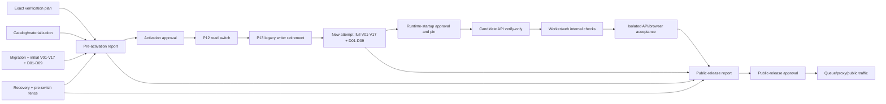

# Parameter catalog verification, upgrade, and retirement gates

> Chinese companion: [Chinese](../zh-CN/design-docs/parameter-catalog-verification-upgrade-retirement-gates.md)

Date: 2026-09-01

## Status and decision boundary

Accepted decision artifact for [Choose verification, upgrade, and legacy-retirement gates](https://github.com/tzrea1-Q/WiseEff/issues/679) in [Wayfinder: replace the parameter catalog with one canonical definition model](https://github.com/tzrea1-Q/WiseEff/issues/668).

This document closes the release-verification, API/browser acceptance, self-hosted upgrade, recovery, observability, evidence, and legacy-retirement decisions needed before the map can become an implementation specification. It is not production code, a SQL migration, an `upgrade.sh` change, a release approval, target-host evidence, or authorization to delete legacy data.

Normative inputs are the accepted immutable decisions at:

- [contract and consumer inventory](https://github.com/tzrea1-Q/WiseEff/blob/f982c76a063f3c8bc0a7366d5253243ecba2866f/docs/references/parameter-catalog-contract-inventory.md);
- [R0-R10 legacy classification](https://github.com/tzrea1-Q/WiseEff/blob/000f617ba9810adda4798b4bc4b2bdfed95b4c39/docs/references/legacy-parameter-row-classification.md);
- [populated PostgreSQL rehearsal fixture](https://github.com/tzrea1-Q/WiseEff/blob/6c3adfc35c0e3be6d5d381013dace9408190380e/docs/references/parameter-catalog-rehearsal-fixture.md);
- [ADR-0040/0041/0042 integrated decision set](https://github.com/tzrea1-Q/WiseEff/tree/9fe269d4facc31b49fc1e0535d2d51ba7140644b/docs/adr);
- [accepted single-page prototype](https://github.com/tzrea1-Q/WiseEff/tree/9c803557a55803ccca79c20eadd033f57d4729e0), as DEV-only product evidence;
- [Catalog Kernel interface](https://github.com/tzrea1-Q/WiseEff/blob/b5bf52cc5e6afb8ff60b043ed6207d80dcfe8fcb/docs/design-docs/catalog-kernel-interface-and-transaction-boundary.md);
- [parameter API and legacy-ID transition](https://github.com/tzrea1-Q/WiseEff/blob/c6c08e6e6f208f88160bdbcc610eec9f8e516cc3/docs/design-docs/parameter-catalog-api-transition.md); and
- [populated cutover, Archive, and rollback contract](https://github.com/tzrea1-Q/WiseEff/blob/1839398b0d4fe1c77dec5c8fe8ef7835a2dc210d/docs/design-docs/parameter-catalog-cutover-archive-rollback.md).

Those inputs remain authoritative. This contract aggregates their proof; it does not reinterpret Catalog authority, R0-R10 disposition, API ownership, P11 comparison semantics, or rollback eligibility.

## Decision summary

1. One routes-less **Release Verification** deep module owns purpose-scoped verification plans, typed gate execution, immutable Release Verification Reports, report lineage, applicability, and approval binding. `upgrade.sh`, startup, API readiness, browser runners, background work, and runbooks are adapters or evidence producers; none may re-orchestrate or waive gates.
2. Verification is an ordered report chain, not one self-authorizing report: `pre-activation` authorizes P12; a new `post-retirement-runtime` attempt after P13 authorizes API verify-only startup; `isolated-candidate-acceptance` proves the real candidate API/browser while traffic stays isolated; `public-release` aggregates those exact report digests and alone authorizes queue/proxy/public traffic.
3. The pre-activation report fixes the exact artifact, target, Catalog Release, migration, cutover plan, mapping, Recovery Point, Catalog/materialization proof, migration proof, initial V01-V17, mandatory D01-D09, recovery proof, and pre-switch writer fence. API/browser gates are explicitly `not-yet-executable` for that purpose, never `passed`.
4. P13 legacy-writer retirement creates a new immutable attempt and reruns the complete V01-V17 plus D01-D09 P11 set, including V13/P02 writer-reachability and privilege negatives. It may not rerun only V13/P02 or reuse the pre-P12 temporary fence result as retirement proof.
5. Startup verify-only readiness binds the latest passing and approved post-retirement-runtime report. Any failure keeps API, worker, web, queue, proxy, and public traffic isolated; there is no fallback, dual read/write, or runtime repair.
6. Only after that runtime pin may candidate API, then worker/web, start for isolated acceptance. API/PG/HTTP/auth/audit and browser-real evidence use the exact target and real candidate API. Any acceptance business mutation durably and permanently closes pointer-only rollback.
7. Public release requires a new immutable report aggregating the pre-activation, post-retirement P11, API/browser, target/recovery, and observability evidence. Distinct Operator and Platform owner approvals for the `public-release` purpose are required before queue/proxy/public traffic resumes.
8. V01-V17 and P11 D01-D09 remain mandatory release-blocking checks. `unexplained-difference` and `unqueryable/protected-reference-missing` both equal zero, all 11 consumer families remain covered, and migration/role-negative gates remain additional mandatory checks.
9. Fresh and populated upgrades use the same phase controller and verifier. Fresh mode proves a zero legacy inventory; populated mode proves exact P0 counts, mappings, Archive, and the full P11 corpus at both required P11 boundaries.
10. Activation, runtime startup, isolated acceptance, public release, legacy-read sunset, and P16 cleanup have separate applicability and checklist semantics. A report or approval for one purpose cannot authorize another.
11. Pointer-only switch-back ends permanently at the earliest candidate business write, queue business delivery, or public traffic acceptance. Later recovery is forward repair or an incident-owner-approved whole-state restore.
12. Legacy writes become unreachable at canonical launch. Read compatibility expires only after the minimum two-production-release and 90-day window, 30 consecutive zero-use days in every supported deployment class, and all evidence gates. Code/schema deletion occurs only in a separate P16 cleanup release.
13. Documentation, local synthetic, real local PostgreSQL, populated-shape, Hosted/CI, target-host, release, and production-approval evidence remain distinct.

## Canonical terminology

| Term                            | Meaning                                                                                                                                                                                                                                                          |
| ------------------------------- | ---------------------------------------------------------------------------------------------------------------------------------------------------------------------------------------------------------------------------------------------------------------- |
| **Verification Gate**           | One deterministic, stable-ID check with fixed inputs, expected result, failure code, evidence fields, severity, retry semantics, owning module, and execution role. A gate cannot repair the state it checks.                                                    |
| **Evidence Artifact**           | Immutable, digest-addressed, redacted output proving one gate attempt. It identifies target, run, release, and producer but contains no parameter value, DTS text, Archive payload, credential, or person data.                                                  |
| **Verification Purpose**        | One closed authorized act and its deterministic gate applicability: `pre-activation`, `post-retirement-runtime`, `isolated-candidate-acceptance`, `public-release`, `legacy-read-sunset`, or `p16-cleanup`. Purpose is part of the report and approval identity. |
| **Release Verification Report** | Immutable purpose-scoped aggregate for one exact verification plan and phase snapshot. `passed` means every `required-now` gate passed; later-purpose gates remain explicit obligations and cannot be marked passed, waived, or inferred.                        |
| **Runtime Readiness**           | A verify-only process state showing that the running artifact and database still equal the latest approved `post-retirement-runtime` report after P13. It is not release verification, migration, synchronization, repair, or a public-release approval.         |
| **Recovery Point**              | One verified, same-boundary manifest for PostgreSQL, configured object storage, and durable Redis, with storage identities and restore proof. A partial cross-store snapshot is not a Recovery Point.                                                            |
| **Legacy Retirement**           | Staged removal of legacy write reachability, then public read compatibility, then code/schema. It never deletes protected business history merely because it is no longer current.                                                                               |

`ready` is reserved for current runtime readiness. `verified` means a gate recomputed its facts. `approved` means named principals bound an exact passing report to an authorized release act. These states are never synonyms.

## Release Verification module seam

### Interface

```text
prepareVerification(subject, purpose, evidenceRequirements) -> immutable VerificationPlan
runVerification(planDigest) -> VerificationAttemptSnapshot
assembleReport(planDigest, typedEvidenceRefs) -> ReleaseVerificationReport
approveReport(reportDigest, approvalCommand) -> ReleaseApprovalRecord
readReport(reportIdOrDigest) -> ReleaseVerificationReport
```

The interface is intentionally small. `purpose` selects a closed applicability profile; callers cannot submit their own gate set. `runVerification` owns the deterministic executable gates available for that purpose on the exact target and calls internal adapters for Catalog Kernel verification, cutover verification, P11 comparison, API acceptance, recovery-manifest inspection, and evidence-store verification. `assembleReport` accepts only typed, digest-verified evidence whose subject, purpose, phase snapshot, and pins equal the plan. It cannot accept a boolean, free-form attestation, URL without a digest, or a report from another purpose/target/run/release.

`approveReport` appends an approval for exactly the report's purpose; it never mutates the report or broadens applicability. The P12 adapter accepts only an approved `pre-activation` report. Startup may call only a verify-only `readApprovedRuntimePin` projection implemented behind the module, and that projection returns only the latest approved `post-retirement-runtime` report for the exact current P13 state and pins. Queue/proxy/public traffic accepts only an approved `public-release` report that aggregates its exact predecessor report digests. Startup cannot prepare, run, assemble, approve, synchronize, migrate, or repair.

### Ownership

Inside Release Verification:

- canonical plan serialization and digest;
- gate registry and applicability by `fresh`, `populated`, `restored`, or `cleanup` mode;
- deterministic gate ordering and complete-result enforcement;
- immutable report construction, digest verification, attempt lineage, retention class, and approval binding;
- failure-family normalization and redaction;
- checking that external evidence pins the same artifact, target, release, mapping epoch, and run; and
- the one decision `passed` or `blocked` for technical verification.

Outside Release Verification:

- Catalog compilation/materialization, owned by Catalog Kernel;
- migration, R0-R10 classification, mappings, Archive, pointer changes, and recovery actions, owned by the cutover module;
- HTTP behavior, authorization, and audit writes, owned by their modules;
- Playwright execution and screenshot production, owned by browser acceptance;
- cross-store backup/restore execution, owned by the recovery controller;
- release authorization, owned by authenticated Operator and Platform owner principals; and
- production approval and incident decisions, which cannot be inferred by a verifier.

Deleting Release Verification would force `upgrade.sh`, startup, scripts, HTTP smoke, Playwright, and runbooks to duplicate pinning, applicability, evidence integrity, approval, and retention logic. That locality is why the module is deep rather than a pass-through report formatter.

### Gate graph



No edge points from a verifier to a writer. API/browser evidence has no edge into the pre-activation report because the real candidate API is not yet legally runnable. A failed gate leaves the owner phase to repair or restore the state, after which a new attempt reruns the complete purpose-specific set. No predecessor report authorizes its successor merely by existing.

## Fixed input and attempt identity

Every plan fixes these fields before any mutating phase:

| Input family         | Required immutable pin                                                                                                                                                                                             |
| -------------------- | ------------------------------------------------------------------------------------------------------------------------------------------------------------------------------------------------------------------ |
| Application artifact | Git commit SHA, release/tag identity, package manifest digest, OCI image manifest and config digests for API/worker/web, platform/architecture, and build trust fingerprint.                                       |
| Catalog              | Catalog Release ID/version/digest, predecessor pin, canonical bundle digest, compiled-model digest, and expected materialization fingerprint.                                                                      |
| Database             | Target database identity, schema version, ordered migration filename/checksum inventory digest, applied-ledger digest, and old-binary/new-schema compatibility declaration digest.                                 |
| Cutover              | Cutover plan digest, migration contract/classifier version, source snapshot/relation fingerprint, R0-R10 count digest, expected V/D applicability, and maintenance run ID.                                         |
| Mapping and Archive  | Mapping epoch, mapping-head digest, protected-reference inventory digest, external-reference inventory digest, Archive manifest digest, and retention policy ID.                                                   |
| Recovery             | Recovery-point ID/digest, PostgreSQL backup identity, object-store endpoint/bucket/prefix identity, durable Redis identity, manifest/checksum digest, and verified-at/maximum-age policy.                          |
| Acceptance           | OpenAPI/route-manifest digest, API contract version, browser bundle/source SHA, expected viewport matrix, and mock/API parity contract digest.                                                                     |
| Target               | Deployment ID/class, environment identity, host identity fingerprint, Compose project, named-volume identity set, bucket identity, public/internal URLs, OIDC issuer/audience identity, and observation window.    |
| Verification         | Verification contract version, gate-registry digest, verifier artifact/image digest, verifier database role identity, and evidence-store policy.                                                                   |
| Purpose and lineage  | Verification purpose, exact phase/checkpoint snapshot, predecessor report IDs/digests, P12/P13 state, writer-retirement fingerprint, runtime-pin generation, pointer-rollback status, and traffic-isolation state. |

The plan has an opaque `verification_plan_id` and a SHA-256 digest of canonical JSON. Each run has an opaque `verification_attempt_id`. Each report has an opaque `verification_report_id` plus a SHA-256 digest of canonical, signature-free report bytes. Purpose and phase snapshot are part of every digest. Approvals are append-only records over that digest and purpose.

### Rerun semantics

- Same plan, same state: a new attempt is allowed. It produces a new attempt ID and timestamps; deterministic result/checksum fields must equal the prior attempt. Divergence is `PCAT-REPORT-NONDETERMINISTIC` and blocks.
- Same plan after an owned repair: rerun the complete affected proof group. P11 always reruns D01-D09 as one group; individual failed cases cannot be suppressed.
- P12 or P13 changes the phase snapshot even when artifact/target pins remain fixed. P13 always requires a new `post-retirement-runtime` attempt that reruns all V01-V17 and D01-D09, including V13/P02; the pre-activation attempt cannot be promoted, relabeled, or reused as the runtime pin.
- Starting candidate API creates the `isolated-candidate-acceptance` purpose. API/browser evidence is produced only in that purpose and is aggregated by a later `public-release` report; it is never backfilled into or used to rewrite the pre-activation report.
- Changed artifact, release, migration inventory, plan, mapping epoch, recovery point, target identity, gate registry, or evidence requirement: create a new plan. Reusing an old report is forbidden.
- Lost response: inspect the immutable attempt/report store by plan and attempt ID. A complete digest-valid result is reused; an incomplete attempt is appended as interrupted and rerun. No row is overwritten.
- Unknown database commit outcome: the cutover owner independently classifies pointers, heads, phase checkpoint, run ownership, and audit evidence. Resume is allowed only when one exact committed or uncommitted outcome is proved; otherwise enter `recovery-required`.

## Report, approval, access, and retention

### Report contract

Every report contains:

- all fixed plan pins and their digests;
- verification purpose, phase/checkpoint snapshot, predecessor report digests, and the closed applicability profile;
- every stable gate ID in the purpose profile exactly once with `passed`, `failed`, `not-yet-executable`, or mode-proved `not-applicable`;
- deterministic expected/observed values, stable failure code, evidence digest/URI, producer artifact, role, start/end time, and retry lineage;
- the purpose-applicable Catalog Kernel, V01-V17, auxiliary database, D01-D09, API, browser, recovery, target, and observability evidence digests; a missing later-purpose digest is an explicit obligation, never a passing value;
- consumer-family coverage checksum and protected-reference coverage checksum;
- writer-reachability result, runtime readiness pin, and pointer-only rollback status;
- redaction policy/version and evidence retention deadline formula inputs; and
- the aggregate report digest.

A report is `passed` only for its named purpose when every `required-now` evidence item exists and every blocking gate passed. `not-yet-executable` is allowed only when the registry names one successor purpose that must produce the evidence; it cannot authorize that successor. `not-applicable` is allowed only when the gate registry contains a deterministic mode predicate and the report includes the proof for that predicate. A manual waiver is not a predicate.

### Purpose-specific report applicability

| Purpose                         | Created at                                             | Required-now evidence                                                                                                                                                                  | Explicit later obligation                                 | What a passing, approved report authorizes                                             |
| ------------------------------- | ------------------------------------------------------ | -------------------------------------------------------------------------------------------------------------------------------------------------------------------------------------- | --------------------------------------------------------- | -------------------------------------------------------------------------------------- |
| `pre-activation`                | After cutover P11 and before P12                       | Exact pins; Catalog/materialization; migration; initial V01-V17; mandatory D01-D09 with both zero thresholds and 11-family coverage; Recovery Point/recovery; pre-switch writer fence  | API/HTTP/browser/runtime evidence is `not-yet-executable` | P12 application read switch only                                                       |
| `post-retirement-runtime`       | After P12 and P13, in a new immutable attempt          | Full rerun of V01-V17 + D01-D09, including V13/P02 and permanent writer retirement; exact current pointer/fingerprint; startup pin                                                     | API/browser acceptance remains `not-yet-executable`       | Candidate API verify-only startup, then worker/web internal checks while isolated      |
| `isolated-candidate-acceptance` | After the approved post-retirement runtime pin         | Exact-target API contract/real-PG/HTTP/auth/audit gates; real-candidate browser gates at all three viewports; internal observability; mutation/rollback-closure record                 | Public-release approval remains absent                    | No traffic act; it is technical evidence for a public-release report                   |
| `public-release`                | After isolated acceptance completes                    | Exact digests of pre-activation, post-retirement-runtime, and isolated-candidate-acceptance reports plus current target/recovery/observability evidence and rollback status            | Sunset and cleanup evidence remain later purposes         | Queue resume, proxy activation, and public traffic                                     |
| `legacy-read-sunset`            | After the minimum compatibility and telemetry interval | Current public-release lineage, two releases and 90 days, 30 consecutive zero-use days for every deployment class, consumer/reference disposition, recovery and approval evidence      | P16 code/schema deletion remains a separate purpose       | R-L2 eligible legacy public reads return 410                                           |
| `p16-cleanup`                   | Separate cleanup release                               | Full canonical/fresh/populated/API/browser/observability/rollback gates, own Recovery Point and real target restore rehearsal, zero writer/read/dependency, retention/legal-hold proof | None; protected history remains retained                  | Only the specifically approved R-L3 code/schema/role/grant/trigger/table/view removals |

### Run, approve, and read authority

| Actor                                                | Allowed                                                                                                                          | Forbidden                                                                                          |
| ---------------------------------------------------- | -------------------------------------------------------------------------------------------------------------------------------- | -------------------------------------------------------------------------------------------------- |
| Deployment Operator                                  | Prepare/run a plan for an authorized target, attach typed target evidence, read full redacted report, and add Operator sign-off. | Edit results, waive gates, use writer credentials as verifier, or approve as Platform owner.       |
| Independent verifier identity                        | Execute registered deterministic gates and sign produced evidence.                                                               | Any production write, approval, repair, migration, role assumption, or Archive payload decryption. |
| Platform owner                                       | Read report/evidence summary and add release or retirement approval.                                                             | Change gate output or substitute product approval for technical proof.                             |
| Platform Admin without deployment-operator authority | Read safe cross-Organization support summary where policy permits.                                                               | Read raw migration diagnostics or operate a release.                                               |
| Auditor/security reviewer                            | Read immutable report, approvals, audit linkage, and redacted evidence under retention policy.                                   | Execute writers or alter evidence.                                                                 |
| Ordinary user or Agent                               | No report endpoint. Catalog `ready` is exposed only through the safe Catalog document/readiness projection.                      | Diagnostics, evidence, approval, or report enumeration.                                            |

Operator and Platform owner approvals must be from distinct authenticated principals. The independent verifier signature proves artifact execution; it is not either human approval. P12 activation, runtime startup, public release, legacy-read sunset, and P16 cleanup each bind separate approval purposes to their own exact report digest. The isolated-candidate-acceptance report is technical evidence only and authorizes no traffic. An older approval cannot be copied forward, and a successor report may reference predecessor digests but never represent predecessor evidence as newly executed.

### Retention formula

Passing launch, restore, sunset, and cleanup reports; their approvals; V/D reports; migration inventory; mapping/Archive manifest references; and recovery rehearsal evidence are retained until the latest of:

1. the repository/platform audit and legal-hold policy;
2. the longest protected-reference, Archive, mapping, business, or legal retention;
3. one year after the cleanup release is accepted;
4. one year after the last supported restore point or old-binary compatibility window expires; and
5. the end of the public legacy-read window, including at least two production releases, 90 days, and the final 30-consecutive-day zero-use interval.

Failed/interrupted attempt reports and redacted diagnostics are retained for at least one year and longer when linked to an incident, release refusal, or legal hold. Raw dumps, Archive payloads, parameter values, DTS text, credentials, and person data are never copied into the report store. Their protected stores retain independently; reports carry only typed IDs, safe counts, digests, and authorized references.

### S10-RPT report lineage, approvals, runtime pin, and retention

S10-RPT owns `server/modules/release-verification/report/`. It composes the frozen S10-PER five-operation seam and does not edit `core/` types, persistence, the gate registry, or applicability predicates.

- `public-release` assembly binds the exact predecessor digests of `pre-activation`, `post-retirement-runtime`, and `isolated-candidate-acceptance`. A missing predecessor digest or a wrong-purpose predecessor fails closed before a row is stored. A report authorizes only its own purpose.
- Operator and Platform owner approvals must be distinct principals. Verifier signatures and self-approval fail closed. `isolated-candidate-acceptance` remains technical evidence and is not an approval purpose.
- `readApprovedRuntimePin` is a verify-only startup projection. It returns only the latest approved `post-retirement-runtime` report whose P13 state and pins equal the current retired writer-retirement fingerprint. A pre-pin (P13 not retired, or missing `writerRetirementFingerprint`) fails closed. Startup cannot prepare, run, assemble, or approve.
- `readReport` returns the frozen tagged result: a missing digest is `{ kind: "absent", reason: "missing" }`; an unapproved purpose-gated report is `{ kind: "absent", reason: "unapproved" }`. It never returns a mutable stub.
- Canonical report bytes exclude `assembledAt` and opaque ids. Same canonical inputs yield the same digest.
- Retention evaluates `RetentionDeadlineInputs` at read time. Expired reports and unbound `p16-cleanup` reports are not present. Cleanup of those reports cannot keep them present. Report assembly does not execute gates or broaden applicability.

## Database release gates

All database gates run through the cutover verifier using a one-shot PostgreSQL login dedicated to verification. It starts `READ ONLY`, verifies `transaction_read_only=on`, has no `SET ROLE`, sequence use, DDL, function execution that can write, temporary writer function, Catalog synchronizer membership, migration owner membership, application writer grants, or Archive decryption credential. It may `SELECT` the allow-listed Catalog/cutover/mapping/Archive metadata/audit projections and PostgreSQL catalog views required for constraint and grant inspection.

Every V gate is release-blocking. The complete V01-V17 and D01-D09 set runs once for pre-activation under temporary pre-switch fences and again in a new attempt after P13 permanent writer retirement. Both reports identify their phase snapshot; the first execution cannot satisfy the second. Retry means repair through the owning module with unchanged inputs followed by a complete proof-group rerun; the verifier itself never repairs.

| Gate ID       | Deterministic query/check and required result                                                                                                                                                                                                                            | Stable failure code                            | Evidence fields                                                        | Retry                                                                    | Owner / role                              |
| ------------- | ------------------------------------------------------------------------------------------------------------------------------------------------------------------------------------------------------------------------------------------------------------------------ | ---------------------------------------------- | ---------------------------------------------------------------------- | ------------------------------------------------------------------------ | ----------------------------------------- |
| `PCAT-DB-V01` | Group current Definitions by `(subject_id, property_key)` under the current release; duplicate groups = `0`.                                                                                                                                                             | `PCAT-VRF-V01-DUPLICATE-CURRENT-DEFINITION`    | release pin, group count, ordered offending-ID checksum                | Same-plan repair + full V rerun                                          | Catalog Kernel / verifier                 |
| `PCAT-DB-V02` | For every Definition, join owned revisions and current pointer; rows with cardinality other than one or wrong owner = `0`.                                                                                                                                               | `PCAT-VRF-V02-CURRENT-REVISION-CARDINALITY`    | definition/revision counts, violation checksum                         | Same-plan repair + full V rerun                                          | Catalog Kernel / verifier                 |
| `PCAT-DB-V03` | Union owner/Organization anti-joins across subjects, registrations, placements, Bindings, ProjectValues, Observations, mappings, and Archive metadata; violations = `0`.                                                                                                 | `PCAT-VRF-V03-OWNER-SCOPE-MISMATCH`            | per-relation counts and ordered checksum                               | Owned cutover repair                                                     | Cutover / verifier                        |
| `PCAT-DB-V04` | Anti-join each current match, new registration, and operational Binding to one active current-release subject membership; violations = `0`.                                                                                                                              | `PCAT-VRF-V04-SUBJECT-MEMBERSHIP-MISSING`      | subject/membership/referencing-family counts                           | Owned cutover or release repair                                          | Catalog Kernel + cutover / verifier       |
| `PCAT-DB-V05` | For every active or retired Registration, verify non-null current placement, exactly one retained placement, same-Organization ownership, and kind-correct parent; violations = `0`.                                                                                     | `PCAT-VRF-V05-PLACEMENT-CARDINALITY`           | status/kind buckets, violation checksum                                | Registration/placement repair                                            | Registration / verifier                   |
| `PCAT-DB-V06` | Validate each operational Binding's Registration, Subject, Definition, `effective_revision_id`, project/logical-node ownership, and release pin; violations = `0`.                                                                                                       | `PCAT-VRF-V06-BINDING-DEFINITION-MISMATCH`     | binding count, mismatch buckets/checksum                               | Binding cutover repair                                                   | Binding / verifier                        |
| `PCAT-DB-V07` | Validate current and historical ProjectValue ownership, Binding, exact DefinitionRevision, configuration/source ownership, and explicit current tip; violations = `0`.                                                                                                   | `PCAT-VRF-V07-PROJECT-VALUE-REVISION-MISMATCH` | current/history counts, pin checksum                                   | Binding/history repair                                                   | Project value / verifier                  |
| `PCAT-DB-V08` | Anti-join every protected legacy ID and declared external reference to exactly one current mapping head with operational, blocked, or Archive outcome; unmapped = `0`.                                                                                                   | `PCAT-VRF-V08-PROTECTED-ID-UNMAPPED`           | consumer-family counts, external inventory digest, missing-ID checksum | Mapping repair; complete rerun                                           | Mapping / verifier                        |
| `PCAT-DB-V09` | Compare P0 source identity manifest with blocker plus primary R0-R10 disposition ledger; exact conservation, no loss, no duplicate primary disposition.                                                                                                                  | `PCAT-VRF-V09-SOURCE-CONSERVATION`             | P0/class/disposition totals and ordered checksum                       | Reclassify only under same classifier/plan or new plan                   | Cutover / verifier                        |
| `PCAT-DB-V10` | Select every R6/R8 same-key cohort; require distinct source and target identities, allowed non-Definition dispositions, and no inferred subject; violations = `0`.                                                                                                       | `PCAT-VRF-V10-R6-R8-IDENTITY-MERGE`            | cohort count, source/target-kind checksum                              | Owned mapping repair; full P11 rerun                                     | Classification/mapping / verifier         |
| `PCAT-DB-V11` | Recompute Archive record, source-row, relation-graph, encrypted-object reference, and protected-reference checksums; mismatch/missing object = `0`.                                                                                                                      | `PCAT-VRF-V11-ARCHIVE-INTEGRITY`               | archive/object counts, checksum algorithm/profile, mismatch checksum   | Rebuild only before activation from unchanged source; otherwise recovery | Archive / verifier + evidence reader      |
| `PCAT-DB-V12` | Recompile the packaged Catalog Release and compare ID/digest, normalized model, memberships, aliases, tombstones, Definition heads, release-head provenance, database/runtime fingerprints, and readiness digest; exact equality.                                        | `PCAT-VRF-V12-CATALOG-MATERIALIZATION-DRIFT`   | artifact/release/fingerprint pins, per-family checks                   | Catalog Kernel reinstall only within legal phase                         | Catalog Kernel / verifier                 |
| `PCAT-DB-V13` | Enumerate HTTP, Agent, review, script, job, trigger, function, grants, roles, and background paths that can write legacy structure; reachable writers = `0`.                                                                                                             | `PCAT-VRF-V13-LEGACY-WRITER-REACHABLE`         | route/job/script inventory digests, grant/trigger/function counts      | Retire writer then full V/P11 rerun                                      | Cutover/security / verifier               |
| `PCAT-DB-V14` | Compare every protected Binding/value current pointer and historical revision/value to exactly one mapping or approved Archive outcome; exact conservation.                                                                                                              | `PCAT-VRF-V14-BINDING-TIP-CONSERVATION`        | current/history/source/target counts and checksum                      | Binding/history repair                                                   | Binding / verifier                        |
| `PCAT-DB-V15` | Join protected mutations/history to audit principal, trusted initiator, trace, mapping version, and target/Archive; exact continuity and no orphan.                                                                                                                      | `PCAT-VRF-V15-AUDIT-CONTINUITY`                | audit-kind counts, provenance buckets, orphan checksum                 | Forward audit repair only if policy permits; otherwise block/restore     | Audit / verifier                          |
| `PCAT-DB-V16` | Count Organization-owned Catalog releases, subjects, aliases, Definitions, revisions, cache keys, or structural writer projections; total = `0`.                                                                                                                         | `PCAT-VRF-V16-ORGANIZATION-STRUCTURAL-CATALOG` | per-relation/cache/path count and checksum                             | Remove/archive through cutover                                           | Catalog/cutover / verifier                |
| `PCAT-DB-V17` | Apply the mode contract: fresh has exact zero legacy maps/Archive/registrations unless an explicit seed manifest says otherwise; populated exactly matches P0 class/count/mapping/Archive manifest. Both require the exact migration inventory and artifact/target pins. | `PCAT-VRF-V17-MODE-RESULT-MISMATCH`            | mode, seed/P0 digest, exact counts, migration digest                   | Same plan only when inputs unchanged; otherwise new plan                 | Release Verification + cutover / verifier |

### Additional mandatory migration and privilege gates

| Gate ID       | Required result                                                                                                                                    | Stable failure code                     | Evidence                                                 | Retry/owner                                                                   |
| ------------- | -------------------------------------------------------------------------------------------------------------------------------------------------- | --------------------------------------- | -------------------------------------------------------- | ----------------------------------------------------------------------------- |
| `PCAT-DB-M01` | Ordered packaged migration filename/checksum inventory equals the release manifest; no duplicate or alias collision.                               | `PCAT-MIG-PACKAGE-INVENTORY-DRIFT`      | package inventory and digest                             | New artifact or approved unchanged-plan repair / migration owner              |
| `PCAT-DB-M02` | Every applied migration has a packaged historical file with the same checksum; missing applied file = `0`.                                         | `PCAT-MIG-APPLIED-FILE-MISSING`         | applied/package anti-join checksum                       | Block; never invent a file / migration owner                                  |
| `PCAT-DB-M03` | Every unapplied file is the declared ordered suffix; historical rename/alias follows one explicit append-only alias ledger; ambiguous alias = `0`. | `PCAT-MIG-HISTORICAL-ALIAS-INVALID`     | suffix and alias-ledger digest                           | New artifact/plan / migration owner                                           |
| `PCAT-DB-M04` | Dedicated one-shot migration ends at the exact target ledger and schema fingerprint; API startup applied no migration.                             | `PCAT-SCHEMA-MIGRATION-RESULT-MISMATCH` | before/after ledger, schema fingerprint, runner identity | Same-run deterministic classification; unknown -> recovery-required / cutover |
| `PCAT-DB-P01` | Every production role fails direct INSERT/UPDATE/DELETE on immutable Catalog rows and cannot assume synchronizer/migration owner.                  | `PCAT-PRIV-CATALOG-IMMUTABILITY-BYPASS` | role/action negative matrix and SQLSTATE checksum        | Grant repair before startup / security                                        |
| `PCAT-DB-P02` | Every production role fails legacy structural writes; old triggers/functions cannot write through definer rights.                                  | `PCAT-PRIV-LEGACY-WRITER-BYPASS`        | role/function/trigger negative matrix                    | Retirement repair before startup / security                                   |

Local schema mocks cannot satisfy these gates. V02-V07, V11-V17, M01-M04, P01, and P02 require real PostgreSQL; target release approval requires them on the exact target or an isolated same-target restore/candidate environment identified by the plan.

## Mandatory P11 D01-D09 semantic comparison

The comparison report is an immutable subordinate Evidence Artifact. It uses the exact four result classes fixed by issue #678: `exact-equivalent`, `declared-expected-difference`, `unexplained-difference`, and `unqueryable/protected-reference-missing`.

| Gate ID        | Required deterministic coverage                                                                                                                 | Blocking failure code                       | Required evidence                                               |
| -------------- | ----------------------------------------------------------------------------------------------------------------------------------------------- | ------------------------------------------- | --------------------------------------------------------------- |
| `PCAT-CMP-D01` | Every protected Definitions list partition and detail: membership, lifecycle, owner, property key, current/pinned revision, typed gone outcome. | `PCAT-CMP-D01-DEFINITION-SEMANTICS`         | case/count/checksum and catalog/frontend coverage               |
| `PCAT-CMP-D02` | Every subject/Definition reference: Driver/NodeType kind, selector, identity, R class, mapping outcome.                                         | `PCAT-CMP-D02-SUBJECT-IDENTITY`             | source/mapping/release pins and topology/module coverage        |
| `PCAT-CMP-D03` | Registration/Placement registered/unregistered/retired state, exactly-one placement, ownership/kind, deliberate removal of structural copies.   | `PCAT-CMP-D03-REGISTRATION-PLACEMENT`       | state/kind buckets and catalog/module coverage                  |
| `PCAT-CMP-D04` | Binding identity, logical/source ownership, effective revision/current tip, ordered history, non-operational disposition.                       | `PCAT-CMP-D04-BINDING-HISTORY`              | binding/history checksum and topology/workbench coverage        |
| `PCAT-CMP-D05` | Current/historical ProjectValue identity, exact revision pin, safe shape/units/policy interpretation, Agent/log citation target.                | `PCAT-CMP-D05-PROJECT-VALUE-PIN`            | redacted semantic checksum and workbench/Agent/log coverage     |
| `PCAT-CMP-D06` | Every R3/R6/R7/R8/R10 source has one ReviewEvidence, Proposal, independently proven Observation, or Archive outcome.                            | `PCAT-CMP-D06-REVIEW-PROPOSAL-OBSERVATION`  | R/disposition/mapping evidence and governance/topology coverage |
| `PCAT-CMP-D07` | Every debug, reload, knowledge, import/export reference resolves pin-first to Binding/Definition/Revision/map/Archive.                          | `PCAT-CMP-D07-PROTECTED-CONSUMER-REFERENCE` | per-consumer counts/checksum                                    |
| `PCAT-CMP-D08` | File/source occurrence, locator, config revision, Binding, revision pin, and raw-format provenance remain exact.                                | `PCAT-CMP-D08-SOURCE-WRITEBACK`             | source/locator/config checksum and file-sync coverage           |
| `PCAT-CMP-D09` | Every typed legacy ID/deep link and operator result has exact redirect/gone/conflict/not-found/readiness semantics without Archive disclosure.  | `PCAT-CMP-D09-LEGACY-OPERATOR-OUTCOME`      | type/status/reason buckets and API/operations coverage          |

The report additionally fails with:

- `PCAT-CMP-CORPUS-COVERAGE` when any accepted inventory consumer family or protected reference lacks a case;
- `PCAT-CMP-UNEXPLAINED-DIFFERENCE` when the corresponding count is non-zero;
- `PCAT-CMP-UNQUERYABLE-PROTECTED-REFERENCE` when the corresponding count is non-zero;
- `PCAT-CMP-EXPECTED-DIFFERENCE-EVIDENCE` when a declared difference lacks exactly one R class, mapping head, typed target/Archive, rule ID, and plan pin; or
- `PCAT-CMP-REPORT-INTEGRITY` when corpus, ordered semantic, result-count, or aggregate digest differs.

For a fresh database, the P11 phase and D01-D09 registry entries still run. `PCAT-DB-V17` and the protected-reference inventory must prove zero legacy sources and external references; each D gate then records a mode-proved zero-case result. This is not an optional skip. A populated path requires non-sampled complete corpus coverage.

The comparison report is approved and retained with the parent report. Target-host/release execution must rerun P11 against the exact target candidate; a local or CI comparison may qualify the implementation but cannot be attached as target release proof.

### Accepted inventory consumer coverage

| Issue #669 consumer family             | Mandatory gates                                                                                  |
| -------------------------------------- | ------------------------------------------------------------------------------------------------ |
| Catalog/governance HTTP and frontend   | D01, D03, D06, D09; `PCAT-API-01` through `PCAT-API-10`; `PCAT-UI-01` through `PCAT-UI-11`       |
| Parameter topology                     | D02, D04, D06; V03-V07; `PCAT-API-12`                                                            |
| Project parameter workbench and drafts | D04, D05, D07; V06-V07, V14-V15; `PCAT-API-12`                                                   |
| File sync/writeback                    | D08; V06-V07, V14; `PCAT-API-12`                                                                 |
| Agent tools                            | D05, D07; V15; `PCAT-API-09`; `PCAT-UI-12`                                                       |
| Log analysis                           | D05, D07; V03, V07, V15                                                                          |
| Debugging                              | D07; V06-V07, V14-V15                                                                            |
| DTS reload                             | D07, D08; V06-V07, V14-V15                                                                       |
| Knowledge                              | D07; V08, V14-V15                                                                                |
| Module registry                        | D02, D03; V03-V06, V16                                                                           |
| Release and operations                 | D09; V01-V17; M01-M04; P01-P02; report, readiness, recovery, observability, and retirement gates |

The corpus manifest records every family exactly once and every protected reference under one or more cases. A family row with no applicable protected source is allowed only with the same fresh-mode zero-inventory proof used by D01-D09; it cannot be omitted.

## API acceptance gate

API evidence is `not-yet-executable` for pre-activation and post-retirement-runtime purposes. It runs only after the approved post-retirement runtime pin starts the exact candidate API while queue, proxy, and public traffic remain isolated. All API evidence is bound to the exact candidate image, OpenAPI/route-manifest digest, latest post-retirement verifier/comparison reports, Catalog Release pin, target identity, and authentication mode. `contract` means schema/route/DTO behavior; `PG` means real PostgreSQL; `HTTP` means a running candidate direct smoke; `auth-` means negative authorization/scope checks; `audit` means persisted trusted audit assertions.

| Gate ID       | Contract surface                                                                                                                                                                         | contract        | PG  | HTTP | auth-              | audit                                        |
| ------------- | ---------------------------------------------------------------------------------------------------------------------------------------------------------------------------------------- | --------------- | --- | ---- | ------------------ | -------------------------------------------- |
| `PCAT-API-01` | `GET /api/v2/catalog` returns verify-backed `ready`, release header, exact current digest/fingerprint; mismatch is 503 `catalog-not-ready`.                                              | Yes             | Yes | Yes  | Yes                | No                                           |
| `PCAT-API-02` | Global/scoped Subject and Definition lists/details use opaque IDs, deterministic pages, active/retired filters, unregistered projection, and scope hiding.                               | Yes             | Yes | Yes  | Yes                | No                                           |
| `PCAT-API-03` | Current/pinned release, exact DefinitionRevision, complete revision list, and composed timeline never substitute current/latest or leak raw migration rows.                              | Yes             | Yes | Yes  | Yes                | Audit read linkage                           |
| `PCAT-API-04` | Registration/Placement projection and explicit `PlacementIntent`; Registration + exactly one Placement + audit commit atomically.                                                        | Yes             | Yes | Yes  | Yes                | Yes                                          |
| `PCAT-API-05` | Review Queue read/detail/resolution preserves unknown/ambiguous outcomes and explicit placement choice; no partial write.                                                                | Yes             | Yes | Yes  | Yes                | Yes                                          |
| `PCAT-API-06` | DefinitionProposal create/submit/withdraw/accept/reject; Org/Platform separation and self-approval prohibition.                                                                          | Yes             | Yes | Yes  | Yes                | Yes                                          |
| `PCAT-API-07` | Typed R4/R5 mapping, R6 ReviewEvidence, R8 Proposal, Archive 410, ambiguous 409, unknown/scope-hidden 404; no property-key inference.                                                    | Yes             | Yes | Yes  | Yes                | Operator lookup audit                        |
| `PCAT-API-08` | All legacy structural writes and overlay/promotion writes return 410 immediately; eligible reads carry exact deprecation/sunset/successor headers.                                       | Yes             | Yes | Yes  | Yes                | Mutation refusal audit where policy requires |
| `PCAT-API-09` | Agent is read-only; Ordinary user, Org Admin, Platform Admin, Operator, System/synchronizer capabilities match issue #677; body/header role spoofing fails.                              | Yes             | Yes | Yes  | Yes                | Yes                                          |
| `PCAT-API-10` | `release-drift`, ETag/`If-Match`, and `Idempotency-Key`: exact replay returns stored result; changed fingerprint conflicts; stale state requires reconfirmation.                         | Yes             | Yes | Yes  | Yes                | Yes                                          |
| `PCAT-API-11` | Nine Catalog read routes use the typed Kernel snapshot facet; no raw Catalog table join, handler-side sort/filter/head choice, cache/YAML fallback, or property-key fallback.            | Static contract | Yes | Yes  | Scope-hidden tests | No                                           |
| `PCAT-API-12` | Project Binding/value/history/draft paths expose canonical `definitionId`, `effectiveRevisionId`, and `currentValueId`, with no `parameterSpecId` or Effective/Governance peer contract. | Yes             | Yes | Yes  | Yes                | Mutation audit                               |

All rows are blocking for isolated candidate acceptance and public release. Contract success without real PostgreSQL does not prove transactions, constraints, roles, or audit. HTTP smoke without browser-real evidence does not prove the one-page experience. Any test that creates a Registration, Placement, Binding, ProjectValue, Proposal, Observation, Review resolution, or other business mutation records the first-mutation evidence and permanently closes pointer-only rollback; cleanup of the test row cannot reopen it.

## Browser-real acceptance gate

Browser release acceptance runs against the real candidate API only after the approved post-retirement runtime pin, with queue, proxy, and public traffic still isolated. Mock mode runs the same application-port state matrix as a separate parity gate, but mock screenshots or mock authorization never satisfy release browser evidence. Browser evidence is absent, not passed, in the pre-activation and post-retirement-runtime reports.

| Gate ID      | Required browser behavior                                                                                                                                                                  |
| ------------ | ------------------------------------------------------------------------------------------------------------------------------------------------------------------------------------------ |
| `PCAT-UI-01` | Exactly one Parameter definitions navigation/page; no Effective definitions or Governance history peer entry.                                                                              |
| `PCAT-UI-02` | Definition list/search/filter/paging and opaque-ID URL selection preserve the Catalog release anchor.                                                                                      |
| `PCAT-UI-03` | Definition detail shows formal Subject, current/pinned revision, safe usage, Registration/Placement context, and no raw Catalog join fields.                                               |
| `PCAT-UI-04` | Same-page Review Queue supports explicit evidence/result states and allowed Org Admin resolution without manufacturing a Definition.                                                       |
| `PCAT-UI-05` | Detail timeline composes Catalog revision/publication and authorized History/Audit events in deterministic order.                                                                          |
| `PCAT-UI-06` | `ready` state enables only authorized actions.                                                                                                                                             |
| `PCAT-UI-07` | `unregistered` state remains readable and offers explicit registration only to Org Admin.                                                                                                  |
| `PCAT-UI-08` | `empty`, `loading`, and `error` are distinct; loading preserves layout but never enables a stale write.                                                                                    |
| `PCAT-UI-09` | retired/deprecated subject, Definition, and Registration remain historically readable and disable prohibited new actions.                                                                  |
| `PCAT-UI-10` | release drift, ETag conflict, invalid placement, and idempotency conflict preserve user input, refresh evidence, and require reconfirmation.                                               |
| `PCAT-UI-11` | Legacy deep links prove exact redirect, gone, conflict, and not-found/scope-hidden outcomes.                                                                                               |
| `PCAT-UI-12` | Agent surface can read allowed Catalog facts and exposes no catalog mutation action.                                                                                                       |
| `PCAT-UI-13` | API and mock adapters produce the same ready/unregistered/empty/loading/error/retired/conflict domain states; mock has no extra governance power.                                          |
| `PCAT-UI-14` | Desktop `1440x900`, tablet `768x1024`, and mobile `390x844` have no overlap, overflow, hidden action, obstructed dialog/drawer, or confused hierarchy.                                     |
| `PCAT-UI-15` | Real interactions cover navigation, search/filter, list/detail, timeline, queue, registration placement choice, proposal/review action where authorized, conflict refresh, and deep links. |

For every relevant state and viewport, the evidence bundle contains a Playwright snapshot and screenshot, console-error output, WiseEff request-failure/critical-response check, relevant network request/response summary, tested interaction record, browser/runtime versions, and outcome. Unexpected console errors, page errors, request failures, or critical WiseEff `4xx/5xx` responses fail the gate unless the case explicitly asserts that exact negative response.

The immutable browser bundle pins source commit, frontend/API image digests, OpenAPI digest, URLs and target identity, Catalog Release digest/fingerprint, database verifier and comparison report digests, authentication mode, browser/OS, viewport, test manifest, screenshot/snapshot/trace checksums, and redaction result. A mutable shared directory or an unpinned screenshot is not release evidence.

## Fresh and populated self-hosted upgrade gate

The required order is:

```text
plan
-> build
-> quiesce
-> verified recovery point
-> data plane only
-> one-shot schema migration
-> one-shot Catalog synchronization
-> one-shot populated cutover (fresh proves zero work)
-> initial independent V01-V17 + D01-D09 verification
-> pre-activation report and activation-purpose approval
-> P12 application read switch bound to the pre-activation report
-> P13 / R-L0 legacy writer retirement
-> new attempt: complete V01-V17 + D01-D09 rerun, including V13/P02
-> post-retirement-runtime report, approval, and latest runtime pin
-> API verify-only startup bound to that runtime pin
-> worker/web internal checks
-> isolated exact-target API/browser acceptance
-> public-release report and purpose-specific approval
-> queue resume, proxy activation, and public traffic
-> observation
-> later cleanup
```

The order above preserves issue #678: P13 retirement is followed by a new complete P11 attempt, not a V13/P02-only delta. The API is never a migration runner. Startup never synchronizes, classifies, maps, repairs, chooses a head, or falls back to legacy/cache/empty state. It refuses the pre-activation report as a runtime pin. If the packaged release digest, post-retirement database/comparison digests, runtime fingerprint, writer-retirement fingerprint, or approved post-retirement report pin differs, API exits or remains not-ready with `PCAT-UPG-CANDIDATE-DIGEST-MISMATCH`.

### Mode-specific requirements

| Mode                     | Required proof                                                                                                                                                                                                                                                                                                                                                   |
| ------------------------ | ---------------------------------------------------------------------------------------------------------------------------------------------------------------------------------------------------------------------------------------------------------------------------------------------------------------------------------------------------------------- |
| Fresh                    | Empty preflight; exact migration suffix; install the packaged Catalog Release; zero legacy identities/mappings/Archive/registrations unless explicit seed manifest; D01-D09 zero-corpus proof at both initial and post-P13 P11 attempts; V01-V17, role negatives, API, browser, recovery, and startup digest gates. No legacy seed or reconciliation dependency. |
| Populated                | Exact P0 R0-R10/protected-reference/source fingerprint; full mappings/Archive/registration/placement/Binding/history; complete D01-D09 corpus over every inventory family at both initial and post-P13 full P11 attempts; exact P0-to-V17 counts; no R6/R8 merge; writer fences; target restore rehearsal and observation.                                       |
| Restored legacy boundary | Recovery manifest equality, old migration/artifact compatibility, legacy projection verifier, no candidate checkpoint reuse, and safe old-stack API/traffic proof.                                                                                                                                                                                               |
| P16 cleanup              | Passing current canonical gates, zero legacy use/reachability/dependency, independent cleanup recovery point and restore rehearsal, and no supported recovery path that needs removed schema/code.                                                                                                                                                               |

### Upgrade journal additions

The append-only journal records purpose, plan/attempt/report IDs and digests, predecessor-report lineage, and approval purpose; artifact/image/config identities; target/host/Compose/volume/bucket identities; migration inventory and schema fingerprints; Catalog Release and materialization fingerprints; source/P0/classifier/plan/recovery-point digests; mapping epoch/head and Archive manifest digests; separate pre-activation and post-retirement V/D report digests/counts; consumer coverage; P13 writer-retirement fingerprint; latest runtime-pin generation; API/browser/recovery evidence digests; public-release aggregate digest; queue/proxy state; first candidate business write, first queue business delivery, and first public traffic timestamps; pointer-only rollback closure time/reason; approvals; phase events; isolation results; and existing bounded/redacted failure fields plus one executable `next_action`.

### Legal action by phase

| Action                               | Legal states and input rule                                                                                                                                                                                                                               | Refusal                                                                                                                                                                    |
| ------------------------------------ | --------------------------------------------------------------------------------------------------------------------------------------------------------------------------------------------------------------------------------------------------------- | -------------------------------------------------------------------------------------------------------------------------------------------------------------------------- |
| `plan`                               | Online/read-only; may repeat. Any input or purpose change creates a new plan digest.                                                                                                                                                                      | Cannot reuse a prior approval/report for a different purpose.                                                                                                              |
| `apply`                              | Only from a current approved plan and unchanged target before another live run owns the lock.                                                                                                                                                             | Drift, unknown target, stale recovery prerequisites, or partial unowned destination blocks.                                                                                |
| `P12 activate`                       | Exact passing `pre-activation` report plus distinct activation-purpose Operator/Platform-owner approval; API/browser are recorded `not-yet-executable`; traffic stays isolated.                                                                           | Missing initial full V/D, Recovery Point, pre-switch fence, exact pins, or purpose approval refuses.                                                                       |
| `P13 retire writers`                 | Only immediately after the bound P12 transition while services/traffic remain isolated; record the exact writer-retirement fingerprint.                                                                                                                   | Starting API/worker/web or claiming R-L0 from the temporary pre-switch fence refuses.                                                                                      |
| `approve runtime startup`            | A new post-P13 attempt reran every V01-V17 and D01-D09, including V13/P02, and a distinct runtime-startup approval bound that report.                                                                                                                     | A V13/P02-only delta, pre-activation report reuse, incomplete corpus, non-zero unexplained/unqueryable result, or writer reachability refuses.                             |
| `start API/worker/web`               | API starts verify-only from the latest approved post-retirement runtime pin; worker/web follow for internal checks; queue/proxy/public traffic remain isolated.                                                                                           | Any pin/fingerprint drift, runtime repair/fallback, or unavailable current post-retirement report refuses and preserves isolation.                                         |
| `run isolated candidate acceptance`  | Exact candidate API is running on the target under the approved runtime pin; run API/PG/HTTP/auth/audit and all browser-real gates with queue/proxy/public traffic isolated; record any business mutation.                                                | Mock-only, pre-P13, stale-report, unpinned, or public-traffic execution refuses; any mutation permanently closes pointer-only rollback.                                    |
| `resume queue/proxy/public traffic`  | Exact passing `public-release` report aggregates all predecessor reports and current target/recovery/observability evidence; distinct public-release Operator/Platform-owner approval exists.                                                             | An activation/runtime/acceptance approval, missing aggregate, input drift, or failed gate cannot authorize traffic.                                                        |
| `resume`                             | Only an idempotent same-run phase with known commit outcome, unchanged inputs, exact purpose checkpoint, and still-valid successor obligations; pre-mutation old-stack restoration and isolated completion-only candidate recovery follow existing rules. | Unknown commit, changed digest, stale recovery point, missing latest report, unsafe pointer, candidate writes/traffic, or unowned partial rows enters `recovery-required`. |
| `recover-candidate`                  | Only recorded post-migration completion failures with verified Recovery Point, exact candidate image/current-purpose report pins, re-isolated proxy/queue, and no data restore.                                                                           | Any data/report/input drift or non-completion failure refuses.                                                                                                             |
| pointer switch-back                  | Only through cutover/Catalog Kernel proof before rollback closure; after P13, legacy writers remain retired and the previous read projection must operate without them.                                                                                   | First candidate business write, queue delivery, public traffic, required old legacy writer, invalid previous projection, or incompatibility permanently forbids it.        |
| `legacy-read sunset` / `P16 cleanup` | Only their own exact passing report and distinct purpose approval after their timing, telemetry, dependency, recovery, and retention gates.                                                                                                               | Any earlier-purpose report or approval, unmet two-release/90-day/30-day threshold, or protected-history dependency refuses.                                                |
| `rollback --restore-data`            | Incident-owner-approved, run-token-bound whole-state restore from one valid manifest.                                                                                                                                                                     | Partial PostgreSQL/object/Redis selection, stale/unknown manifest, or target identity mismatch refuses.                                                                    |

A partially populated destination is resumable only when every row is owned by the same run/plan/source digest, counts reconcile, and no activation pointer has switched. Otherwise it is drift. A recovery point stale before mutation is replaced after re-quiescence; discovered stale after mutation cannot be used and forces isolated forward recovery or another independently verified same-boundary point.

## Rollback and recovery proof

| Boundary                                                         | Allowed recovery                                                                                                                                                   | Required proof and mandatory rerun                                                                                                                                       |
| ---------------------------------------------------------------- | ------------------------------------------------------------------------------------------------------------------------------------------------------------------ | ------------------------------------------------------------------------------------------------------------------------------------------------------------------------ |
| Before P12 read switch                                           | Abort or same-plan deterministic repair; Catalog pointer/heads may switch back only under the accepted zero-write proof.                                           | Previous Catalog projection, schema compatibility, Recovery Point, V01-V17 applicable to the restored boundary, and no candidate consumer.                               |
| After P12, before P13 writer retirement                          | Atomic application read pointer plus Catalog pointer/head switch-back, or whole-state restore.                                                                     | Pre-activation report remains attributable; previous projection and old binary/new schema verify; complete writer/queue/traffic zero proof; rerun old-boundary verifier. |
| After P13, before candidate API                                  | Conditional pointer switch-back only if the previous read projection works while legacy writers remain retired; otherwise forward recovery or whole-state restore. | P13 fingerprint, complete post-retirement V01-V17 + D01-D09 attempt including V13/P02, previous projection compatibility, and zero business mutation/queue/traffic.      |
| API/worker/web started for isolated checks, no business mutation | Same conditional pointer switch-back while audit/DB/queue prove zero business mutation and public traffic remains isolated.                                        | Latest approved post-retirement runtime pin, startup evidence, and all preceding zero-write proof.                                                                       |
| Isolated acceptance produced any business mutation               | Pointer-only switch-back is permanently closed even if the test row is later deleted. Forward repair is preferred; whole-state restore needs incident approval.    | Immutable first-mutation audit/evidence, blast-radius inventory, Recovery Point validity, and the same full restored-boundary proof required after a production write.   |
| After queue delivery or public traffic                           | Forward repair is preferred. Whole-state restore requires incident-owner approval and acceptance of post-point write loss.                                         | Blast-radius/write inventory; manifest validity; cross-store restore; full restored-boundary verifier, audit continuity, API/browser smoke, and new release decision.    |
| Schema committed, old binary compatible                          | Artifact rollback is possible only inside the zero-write cases; pointers still require proof and retired writers remain retired.                                   | Exact old/new compatibility contract and purpose-scoped report.                                                                                                          |
| Schema committed, old binary incompatible                        | Forward recovery or whole-state restore only.                                                                                                                      | Recovery Point or approved forward plan.                                                                                                                                 |
| P16 cleanup committed                                            | Forward repair or whole-state restore containing the pre-cleanup schema, mapping, and Archive.                                                                     | Cleanup recovery rehearsal, retained installer/artifact, restore manifest, and full canonical plus cleanup-dependency verification.                                      |

The Recovery Point always contains PostgreSQL, configured S3-compatible object storage, and durable Redis from the same quiesced boundary. Its restore manifest records object count/checksums, database backup/ledger/schema checksum, Redis persistence/checkpoint, storage endpoint/bucket/prefix/volume identities, target, artifact, run, completion time, maximum age, and restore tool identity. Partial restore is never exposed.

At least one real target-host rehearsal must restore all three stores into isolated targets, start the exact declared old or cleanup-recovery artifact, validate table/object/queue references and audit continuity, rerun the required verifier groups, and prove traffic remains isolated until approval. A non-target local rehearsal cannot satisfy this gate.

`pointer_rollback_closed_at` is the earliest durable event among first candidate business audit/write—including an isolated API/browser acceptance mutation—first queue business delivery, or first accepted public business request. Health probes and provably read-only checks do not close it; deleting or compensating a test mutation does not reopen it. Once set it is immutable. P16 also permanently closes pointer-only recovery.

## Observability and stable failure codes

### Failure-code families

| Family           | Scope                                                                            |
| ---------------- | -------------------------------------------------------------------------------- |
| `PCAT-ART-*`     | release artifact, image, package, signature, lineage, or target mismatch         |
| `PCAT-MIG-*`     | migration filename/checksum/applied-file/alias drift                             |
| `PCAT-SCHEMA-*`  | one-shot schema migration and schema compatibility                               |
| `PCAT-SYNC-*`    | Catalog compilation, synchronization, pointer, and materialization               |
| `PCAT-CLASS-*`   | R0-R10 classification and source conservation                                    |
| `PCAT-MAP-*`     | typed mapping epoch/head and protected legacy IDs                                |
| `PCAT-REG-*`     | Registration/Placement ownership, kind, and cardinality                          |
| `PCAT-BIND-*`    | Binding, ProjectValue, history, revision pin, and source ownership               |
| `PCAT-ARCH-*`    | Archive record/object/reference integrity                                        |
| `PCAT-VRF-*`     | V01-V17, verifier role, report determinism, and gate completeness                |
| `PCAT-CMP-*`     | D01-D09 corpus, expected/unexplained/unqueryable results, and report integrity   |
| `PCAT-API-*`     | canonical/legacy HTTP, OpenAPI, error, drift, and idempotency contract           |
| `PCAT-AUTH-*`    | authorization, scope hiding, trusted invocation, separation of duties, and audit |
| `PCAT-UI-*`      | browser states, interactions, responsive layout, console/network, and evidence   |
| `PCAT-UPG-*`     | phase/action legality, candidate digest, journal, isolation, and startup         |
| `PCAT-WRITER-*`  | legacy writer reachability or fence failure                                      |
| `PCAT-RP-*`      | recovery-point creation, age, manifest, checksum, and storage identity           |
| `PCAT-RESTORE-*` | cross-store restore, old-artifact compatibility, and post-restore verification   |
| `PCAT-RET-*`     | legacy telemetry, dependency disposition, sunset, or cleanup eligibility         |

Stable codes are machine contracts. Human summaries may improve; dashboards, alerts, runbooks, and clients key only on the stable family/code plus gate ID.

### Metrics

- `wiseeff_catalog_verification_attempts_total{gate_id,result,failure_family,target_class}`;
- `wiseeff_catalog_verification_duration_seconds{gate_id,target_class}`;
- `wiseeff_catalog_release_verified{deployment_id}` with value `0|1` and release/report identity in an info metric, not as unbounded labels;
- `wiseeff_catalog_comparison_cases{comparison_id,result,target_class}` for bounded D01-D09/result enums;
- `wiseeff_catalog_protected_references{consumer_family,status,target_class}`;
- `wiseeff_catalog_legacy_writers_reachable{writer_family,target_class}`;
- `wiseeff_catalog_legacy_reads_total{contract_family,deployment_class,outcome}`;
- `wiseeff_catalog_recovery_point_age_seconds{deployment_id}` and validity gauge;
- `wiseeff_catalog_restore_rehearsal_status{deployment_class}`; and
- `wiseeff_catalog_retirement_gate{stage,condition,deployment_class}`.

Allowed labels are bounded enums/registered deployment IDs. Never label with Definition/Binding/legacy IDs, property keys, parameter values, DTS text, person/user/Organization/project IDs, report digests, object keys, URLs, or free-form failure text.

### Logs, audit, dashboards, and alerts

Structured logs include timestamp, trace/request ID, deployment/target class, release/run/attempt/report IDs, gate ID, phase, stable failure code/family, result, duration, evidence reference ID, and bounded redacted summary. Full report digests may be fields, not metric labels. Logs never contain parameter values, DTS text, Archive payload, credentials, person data, raw legacy rows, or signed URLs.

Audit events cover purpose/plan approval, verification start/finish/refusal, predecessor-report binding, report assembly, Operator sign-off, Platform owner approval/refusal, P12 pre-activation binding, P13 writer retirement, post-retirement runtime-pin publication, isolated-acceptance start/finish/mutation, public-release binding, queue/proxy/public-traffic authorization, pointer rollback closure, restore authorization/completion, legacy-read sunset, and P16 approval. They retain authenticated principal, trusted initiator, target, purpose, report digest, reason code, and trace.

Dashboards show purpose/report lineage, phase timeline, initial and post-retirement V/D counts, consumer coverage, candidate/runtime digest equality, writer reachability, recovery-point validity, acceptance isolation, rollback closure, restore rehearsal, legacy reads by deployment class, and retirement conditions. Alerts page on report-integrity or lineage failure, non-zero unexplained/unqueryable comparison, a missing post-P13 full P11 attempt, pre-activation report used as a runtime pin, candidate digest mismatch, reachable legacy writer, invalid/stale recovery point inside a release window, restore failure, post-approved readiness drift, or an attempted P12/startup/public-release/sunset/P16 action without its own complete approval record. Every alert carries a `runbook_url`.

Prometheus's default 15-day retention is operational troubleshooting only. It is never the sole retirement proof. Immutable report/evidence/audit retention follows the report formula above.

## Staged legacy retirement

| Stage                    | Timing                                                                                                             | Required state                                                                                                                                     | What becomes unavailable                                                                                                    | What remains                                                                                                                                     |
| ------------------------ | ------------------------------------------------------------------------------------------------------------------ | -------------------------------------------------------------------------------------------------------------------------------------------------- | --------------------------------------------------------------------------------------------------------------------------- | ------------------------------------------------------------------------------------------------------------------------------------------------ |
| R-L0 write retirement    | P13 after P12 and before API startup                                                                               | Writer grants/triggers/functions fenced and routes 410, then a new attempt passes complete V01-V17 + D01-D09 including V13/P02 zero reachability   | Organization definition/overlay writes, legacy lifecycle/reattribution/reconcile writes, Agent/script/job structural writes | Read-only compatibility and operator mapping diagnostics                                                                                         |
| R-L1 observation         | From launch through minimum window and rollback observation                                                        | Read-only legacy relations/adapters; telemetry, D mapping, recovery point, forward repair; no dual write/read fallback for user traffic            | No legacy mutation returns                                                                                                  | Eligible public reads with deprecation headers; mapping/Archive/operator lookup                                                                  |
| R-L2 public read sunset  | Later of two production releases and 90 days, plus every class has 30 consecutive zero-use days and all exit gates | Exact external/first-party/import/export/deep-link disposition; zero ambiguous protected operational reference; Operator + Platform owner approval | Eligible public legacy read adapters return 410                                                                             | Internal mapping/Archive lookup and cleanup recovery assets                                                                                      |
| R-L3 P16 cleanup release | Separate release after rollback/recovery no longer depends on legacy schema                                        | Full canonical/fresh/populated/API/browser/observability/rollback gates; own recovery point/rehearsal; zero writer/read/dependency                 | Approved legacy code, roles, grants, triggers, tables/views, aliases                                                        | Audit, Archive, mappings, Catalog history, revisions, Bindings, ProjectValues, Proposals, Observations, ReviewEvidence, required operator lookup |

### Asset-specific removal gate

| Asset                                    | Earliest removal                                                                                                                                                              |
| ---------------------------------------- | ----------------------------------------------------------------------------------------------------------------------------------------------------------------------------- |
| Catalog-only escape checks               | P16, after V01-V17 and canonical verifier replace them on fresh/populated and cleanup restore paths.                                                                          |
| Reconciliation code                      | No production credential at launch; delete at P16 after zero unresolved operational mapping and no supported recovery/replay depends on it.                                   |
| Effective/Governance product projections | Peer UI/raw governance removed at launch; bounded eligible read adapter at R-L2; backing code/schema at P16.                                                                  |
| Legacy public read adapters              | R-L2 only. Failure extends read-only compatibility.                                                                                                                           |
| Legacy writer routes                     | Mutation unavailable/410 and underlying privilege fenced at R-L0; handler shells and implementation delete at P16.                                                            |
| Old roles and grants                     | Writer membership/reachability revoked at R-L0; obsolete role objects/drop grants at P16 after negative proof on every supported upgrade path.                                |
| Old triggers/functions                   | Disable/revoke write behavior at R-L0; drop at P16 after fresh/populated and old-binary compatibility gates.                                                                  |
| Legacy tables/views                      | P16 only, after cleanup recovery rehearsal and no supported restore/read/mapping lookup queries them.                                                                         |
| Migration compatibility aliases          | P16 only when the supported upgrade-from floor is newer than every alias consumer and M02/M03 prove historical ledger readability without them.                               |
| Operator diagnostics                     | Legacy-table introspection deletes at P16; mapping/Archive/report lookup remains for the longest protected retention and is not a reason to retain operational legacy tables. |

### Final deletion conditions

P16 is blocked unless all are true for the exact cleanup artifact and target:

- at least two production releases and at least 90 days since canonical launch;
- every supported deployment class has 30 consecutive days of zero legacy-read telemetry, backed by immutable daily rollups and target inventory rather than Prometheus retention alone;
- first-party consumers, external integrations, imports/exports, and deep links each have a recorded tested disposition;
- unresolved protected references = `0` and ambiguous operational mappings = `0`;
- mapping/Archive lookup and restore have real target evidence;
- the pointer/read compatibility rollback window has ended and recovery no longer depends on legacy schema;
- reachable legacy writers = `0` across HTTP, Agent, jobs, scripts, functions, triggers, roles, and grants;
- fresh/populated database, API, browser, observability, and rollback gates pass;
- the cleanup release has its own cross-store Recovery Point and real target-host restore rehearsal;
- old-binary/new-cleanup-schema behavior is explicitly refused or proved, never assumed;
- a deployment Operator signs the retirement report and a distinct Platform owner approves it; and
- report/evidence retention and legal-hold calculation is complete.

If any condition fails, extend the read-only compatibility period. Never restore legacy writes, dual-write, runtime lazy repair, or user-traffic dual-read.

P16 never deletes Audit, Archive, mapping versions/heads needed for protected history, Catalog Release history, Definition revisions, Bindings, ProjectValues, DefinitionProposals, ParameterObservations, or ReviewEvidence merely because they are not current.

## Evidence hierarchy and completion threshold

| Level                         | Can prove                                                                                                                                              | Cannot prove                                                                                     |
| ----------------------------- | ------------------------------------------------------------------------------------------------------------------------------------------------------ | ------------------------------------------------------------------------------------------------ |
| Documentation/static contract | IDs, matrices, bilingual parity, link/governance completeness, static route/import/SQL ratchets.                                                       | Executable behavior, PostgreSQL constraints, runtime, target, or release readiness.              |
| Local synthetic               | Deterministic pure logic, fake-adapter failures, report serialization/redaction, expected state shapes.                                                | Real SQL/roles/concurrency, populated data, real browser/API, or target readiness.               |
| Real local PostgreSQL         | Constraints, transactions, grants, failure injection, migration/checksum behavior, exact queries on a disposable local DB.                             | Actual target data/storage/host/identity or release approval.                                    |
| Populated-shape rehearsal     | Representative R0-R10 graph, same-key R6/R8 separation, idempotency, rollback containment, corpus mechanics.                                           | Row-for-row target equivalence or target cutover success.                                        |
| Hosted/CI                     | Repeatability on the Hosted runner, build/static/contract gates, Linux browser renderer and archived CI artifacts.                                     | Self-hosted target identity, target stores/queue/OIDC, production approval, or release evidence. |
| Real target-host rehearsal    | Exact target artifact, host/data profile, one-shot ordering, cross-store backup/restore, queue/proxy isolation, target verifier/browser/observability. | A different host/artifact or authorization for production release.                               |
| Release evidence              | Exact artifact + target + plan + report + observation/rollback evidence and approvals for one release act.                                             | Future releases, other targets, or permanent production acceptance.                              |
| Production approval           | Named accountable principals accept the exact release/retirement act after technical proof and risk review.                                            | Technical facts missing from the report or permission to waive a failed gate.                    |

`docs:check`, mock runs, a local fixture, merge-tree compatibility, Hosted/CI, or a non-target rehearsal must never be described as real self-hosted target readiness or release evidence.

## Exact release-approval checklist

Every purpose fails closed unless the exact artifact/image/target/Catalog/migration/plan/mapping/Recovery Point/verification pins match the isolated target; the report records its purpose, phase snapshot, predecessor lineage, current rollback status, and one executable failure action; every required artifact has an independent verifier signature; no input changed after assembly; and any required Operator and Platform owner approvals come from distinct authenticated principals and bind that exact purpose/report digest.

| Purpose / act                 | Exact additional checklist                                                                                                                                                                                                                                                                                                                                        | Gates intentionally unavailable at this point                                                                                |
| ----------------------------- | ----------------------------------------------------------------------------------------------------------------------------------------------------------------------------------------------------------------------------------------------------------------------------------------------------------------------------------------------------------------- | ---------------------------------------------------------------------------------------------------------------------------- |
| P12 activation                | Passing `pre-activation` report; Catalog/materialization and migration proof; initial V01-V17; D01-D09 exactly once with zero unexplained/unqueryable and all 11 families; current Recovery Point; pre-switch writer fence; activation-purpose Operator and Platform owner approvals                                                                              | API/HTTP/browser/runtime acceptance is `not-yet-executable`, not passed                                                      |
| Post-P13 runtime startup      | P12 bound the exact pre-activation report; R-L0/P13 retirement fingerprint exists; a new attempt reran all V01-V17 and D01-D09, including V13/P02, with both zero thresholds and all 11 families; writer reachability is zero; runtime-startup approvals bind the new post-retirement report; startup pin equals that latest report                               | API/browser acceptance remains `not-yet-executable`; only API verify-only startup followed by isolated worker/web is allowed |
| Isolated candidate acceptance | Approved runtime pin is current; queue/proxy/public traffic remain isolated; API contract/real-PG/HTTP/auth-negative/audit gates pass; browser-real gates pass at `1440x900`, `768x1024`, and `390x844` with snapshots, screenshots, console, network, real interactions, and immutable binding; any business mutation closes pointer rollback permanently        | It authorizes no queue, proxy, public traffic, sunset, or cleanup                                                            |
| Public release                | New report aggregates exact pre-activation, post-retirement-runtime, and isolated-acceptance report digests plus current target/recovery/observability evidence; candidate/runtime/report pins still match; pointer-rollback status and next recovery action are explicit; public-release Operator and Platform owner approvals bind the aggregate report         | Sunset and P16 remain separate future purposes                                                                               |
| Legacy-read sunset            | Approved public-release lineage; at least two production releases and at least 90 days; every supported deployment class has 30 consecutive zero-use days; first-party/external/import-export/deep-link disposition and protected-reference reconciliation pass; recovery/retention remain valid; separate sunset approvals                                       | P16 code/schema deletion remains unavailable                                                                                 |
| P16 cleanup                   | Separate cleanup artifact and report; full current V01-V17/D01-D09, migration/privilege, fresh/populated, API/browser, observability, and rollback evidence; zero writer/read/dependency; its own cross-store Recovery Point and real target restore rehearsal; old-binary decision; retention/legal hold; separate cleanup approvals; protected history retained | No waiver or predecessor approval substitutes for cleanup evidence                                                           |

The P12 checklist cannot demand evidence that requires a running candidate API. The runtime-startup checklist cannot consume the pre-activation report. The public-release checklist cannot infer API/browser evidence from contract, mock, local, or Hosted results. An applicability transition creates a new immutable attempt/report; it never rewrites an earlier report.

## Contracts handed to `/to-spec`

The later implementation specification must define, without changing this decision:

- one Release Verification module with the five semantic operations, closed verification-purpose type, role-shaped composition, report-lineage validation, and latest post-retirement runtime-pin projection;
- canonical JSON schemas for plan, purpose, phase snapshot, attempt, gate applicability/result, report lineage, approval, comparison report, browser bundle, runtime pin, rollback closure, and retention calculation;
- a complete gate registry containing every ID in this document and deterministic purpose/mode applicability predicates, including `required-now`, `not-yet-executable` successor obligations, and mode-proved `not-applicable`;
- SQL/check definitions and real-PostgreSQL role matrices for V01-V17, M01-M04, and P01-P02;
- the D01-D09 corpus builder, both maintenance-only semantic adapters, report signer, and no-waiver enforcement;
- API contract/PG/HTTP/auth/audit tests and browser-real evidence ownership;
- the exact one-shot upgrade phases and state machine for pre-activation -> P12 -> P13 -> full post-retirement P11 -> runtime pin -> isolated API/browser -> public-release approval -> queue/proxy/public traffic, plus journal schema, legal action guards, unknown-outcome classifier, and existing `recovery-required` integration;
- cross-store Recovery Point/restore adapters and target-host rehearsal writer;
- metrics, logs, audits, dashboards, alerts, redaction, and immutable evidence store;
- legacy telemetry rollups, supported-deployment inventory, R-L0 through R-L3 stage guards, and asset deletion ratchets; and
- startup verify-only readiness that consumes only the latest approved post-retirement runtime pin and owns no repair capability; and
- mutation-aware isolated acceptance that durably closes pointer-only rollback and cannot reopen it after cleanup/compensation.

Physical filenames, table names, SQL text, CLI flag spelling, storage vendor, and ticket slicing remain implementation choices. They may not weaken gate IDs, thresholds, ownership, evidence levels, or recovery/retirement boundaries.

## Rejected alternatives

- **Let `upgrade.sh` call separate scripts and decide success.** Rejected because orchestration, pinning, retry, and evidence semantics would live in a shell caller rather than one deep module.
- **Make Catalog Kernel own release verification.** Rejected because API/browser/target recovery/retirement are outside Catalog materialization; the Kernel remains one subordinate verifier.
- **Treat startup readiness as a repair hook.** Rejected because startup would become a migration/synchronizer and a second structural authority.
- **Assemble one “complete” report before P12 and let it authorize itself.** Rejected because real candidate API/browser evidence is not executable until after P12/P13 and runtime startup; calling it passed creates an evidence cycle.
- **Use the pre-activation report as the startup or public-release pin.** Rejected because it proves only the pre-P12 state and carries explicit successor obligations; P13 changes writer reachability and requires a new full P11 attempt.
- **After P13 rerun only V13/P02.** Rejected because issue #678 locks a complete V01-V17 plus D01-D09 rerun after writer retirement; a delta cannot detect other state drift or replace the mandatory comparison.
- **Start the candidate API to collect evidence before the post-retirement report passes.** Rejected because startup must consume the latest post-P13 runtime pin and remain fail-closed while any complete P11 result is missing or failed.
- **Treat isolated acceptance as public-release approval.** Rejected because technical API/browser evidence authorizes no queue, proxy, or public traffic; a new aggregate report and distinct public-release approvals are required.
- **Sample P11 or permit a human waiver.** Rejected because protected-reference coverage and zero unexplained/unqueryable results are locked decisions.
- **Use user traffic for a dual-read canary.** Rejected because it extends dual authority beyond the isolated maintenance comparison.
- **Use CI as target release proof.** Rejected because runner identity and target stores/host/queue/restore are different facts.
- **Delete write code at launch and all schema at once.** Rejected because read compatibility, forensic mapping, and recovery have different retirement thresholds.
- **Keep legacy writers disabled but easily restorable.** Rejected because zero reachable writer is a database/role/path invariant, not an operations intention.
- **Use Prometheus zero counts alone for sunset.** Rejected because bounded metrics retention cannot prove all supported deployments or an uninterrupted 30-day interval; immutable daily rollups and deployment inventory are required.
- **Allow partial PostgreSQL-only rollback.** Rejected because database/object/Redis state would cross recovery boundaries.

## Decision completeness

This contract leaves no known verification architecture, purpose-specific report applicability, P12/P13 ordering, post-retirement P11 rerun, runtime-pin selection, isolated candidate acceptance, public-release authorization, database invariant, API/browser gate, rollback proof, observability, evidence-level, compatibility-window, or legacy-deletion choice open for issue #679.

The prior single-report cycle is superseded: pre-activation never claims live API/browser success, P13 always causes a new complete V01-V17 + D01-D09 attempt, startup binds only its approved post-retirement report, and public traffic waits for a later aggregate report and purpose-specific approval. This restores issue #678 at `1839398b0d4fe1c77dec5c8fe8ef7835a2dc210d` without changing #673 or #677 authority. Later work may choose implementation mechanics, but it cannot reopen Platform-only structural authority, R0-R10 outcomes, V01-V17, D01-D09, zero unexplained/unqueryable thresholds, all 11 consumer families, one-page UX, API ownership, three browser viewports, minimum two-release/90-day/30-day thresholds, no-dual-write/read/lazy-repair rule, cross-store recovery, protected-history retention, or staged retirement without a new explicit product decision.
