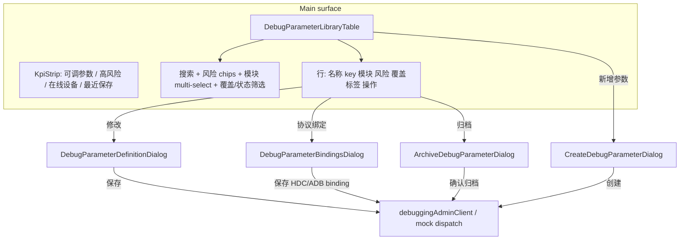

# Debugging Admin Modal Layout Redesign Implementation Plan

> **For agentic workers:** REQUIRED SUB-SKILL: Use superpowers:subagent-driven-development (recommended) or superpowers:executing-plans to implement this plan task-by-task. Steps use checkbox (`- [ ]`) syntax for tracking.

**Goal:** Redesign `/debugging-admin` to match the interaction model of `/parameter-admin`: a single main-surface catalog table with modal-based create/edit/archive flows, instead of the current left-list + right-inline-editor split layout.

**Architecture:** Extract `DebuggingAdminPage` from `src/App.tsx` into a dedicated page module (mirroring `ParameterAdminPage.tsx`). Reuse existing parameter-admin shell primitives (`KpiStrip`, `parameters-table` toolbar patterns, `FilterChipGroup`, `MultiSelectDropdown`, `modal-backdrop` / `submission-dialog`). Keep all catalog mutations on the existing `debuggingAdminClient` and mock `configDraft` reducer paths—this is a **frontend layout refactor only**; no backend API or schema changes. Dialogs own dirty drafts; the main table stays read-only between saves.

**Tech Stack:** React 19, TypeScript, existing WiseEff UI primitives, Vitest + Testing Library, Playwright acceptance (`DEBUG-ADMIN-001`), `playwright-cli` viewport checks.

---

## Problem Statement

| Dimension | `/parameter-admin` (reference) | `/debugging-admin` (current) |
|-----------|-------------------------------|------------------------------|
| Primary surface | Full-width **catalog table** | **380px list + inline editor** grid |
| Edit flow | Row action → **modal dialog** | Select row → edit in right panel |
| Create flow | Toolbar / table header → **Create dialog** | `+ 新增` then inline empty editor |
| Delete / archive | **Confirm dialog** from row action | Top toolbar + list `×` + inline binding buttons |
| Filters | Table toolbar: search, risk chips, module multi-select | Custom `ReviewMultiFilter` in list header |
| KPI | `KpiStrip` below topbar actions | Stats injected into topbar only |
| File organization | `ParameterAdminPage.tsx` + `components/admin/*` | ~600 lines embedded in `App.tsx` |

The split layout makes the debugging admin feel like a form builder rather than a governance console. Users expect the same “browse table → open dialog → save/close” rhythm as parameter admin.

## Target UX



### Row actions (API + mock)

| Action | Opens | Saves via |
|--------|-------|-----------|
| **修改** | Definition dialog: 标识信息、值与范围、分类与启用 | `saveAdminParameter` / `UPDATE_DEBUG_PARAMETER` |
| **协议绑定** | Bindings dialog: HDC + ADB panels | `saveAdminBinding` / `archiveAdminBinding` per protocol |
| **归档** | Confirm dialog (restore stays in definition dialog when archived) | `archiveAdminParameter` / mock delete |
| **新增参数** | Create dialog (empty draft + default bindings) | `createParameter` / `ADD_DEBUG_PARAMETER` |

### Mock-only footer

Keep collapsible **配置源预览** (`power-management.json`) below the main table, scoped to mock mode only—same behavior as today, not inside a dialog.

## Non-Goals

- Backend route, migration, or audit schema changes.
- Draft/review/publish workflow for debug catalog.
- Import/export parity with parameter admin.
- Module-management dialog (debug parameters already carry `module` string; reuse module filter from data, no separate module CRUD unless product asks later).

## File Structure

### Create

| File | Responsibility |
|------|----------------|
| `src/DebuggingAdminPage.tsx` | Page shell: KPI, table, dialog orchestration, API/mock mode switch |
| `src/DebuggingAdminPage.test.tsx` | Move/extend tests from `DebuggingPage.test.tsx` admin section |
| `src/hooks/useDebugAdminSearch.ts` | URL-synced filters: `q`, `risk`, `modules`, `coverage`, `sort`, `id` (open dialog) |
| `src/debugAdminLibraryFilters.ts` | Pure filter/sort helpers + coverage label mapping |
| `src/components/admin/DebugParameterLibraryTable.tsx` | Table + toolbar; mirrors `ParameterLibraryTable` API shape |
| `src/components/admin/DebugParameterDefinitionDialog.tsx` | Metadata editor modal |
| `src/components/admin/DebugParameterBindingsDialog.tsx` | HDC/ADB binding panels modal |
| `src/components/admin/CreateDebugParameterDialog.tsx` | Create flow modal |
| `src/components/admin/ArchiveDebugParameterDialog.tsx` | Archive confirm modal (parameter-level) |

### Modify

| File | Change |
|------|--------|
| `src/App.tsx` | Remove inline `DebuggingAdminPage`; keep shared helpers (`draftFromDebugParameter`, `bindingForProtocol`, types) in `src/debugAdminDraft.ts` or colocate exports used by dialogs |
| `src/app/routes.tsx` | Import `DebuggingAdminPage` from `@/DebuggingAdminPage` |
| `src/App.test.tsx` | Update admin route assertions for table + dialog selectors |
| `src/DebuggingPage.test.tsx` | Remove relocated `/debugging-admin` tests; keep debugging runtime tests |
| `src/workspaceHeaderIntegration.test.tsx` | Topbar KPI strip unchanged; verify toolbar aria-label still valid |
| `src/styles.css` | Add `.debug-admin-shell` scoped styles (fork from `.param-admin-shell` + table); deprecate `.debug-admin-grid`, `.debug-admin-list`, `.debug-admin-editor` |
| `e2e/acceptance/debugging-admin.acceptance.spec.ts` | Update selectors: table row actions + dialogs instead of inline editor |
| `docs/FRONTEND.md` + `docs/zh-CN/frontend.md` | Document modal layout and dialog entry points |
| `docs/zh-CN/superpowers/specs/2026-06-22-debugging-admin-hdc-adb-crud-design.md` | Mark §前端设计 split-layout as superseded by this plan |

### Review (likely no change)

- `docs/design-docs/api-contract.md` — API unchanged
- `docs/SECURITY.md` — permissions unchanged
- `server/modules/debugging/*` — no changes

---

## Task 1: Extract shared debug-admin helpers

**Files:**
- Create: `src/debugAdminDraft.ts`
- Modify: `src/App.tsx` (move helpers out)

- [ ] **Step 1: Create `src/debugAdminDraft.ts`**

Move from `App.tsx` without behavior change:

```typescript
export function draftFromDebugParameter(parameter: DomainDebugParameter): DebugAdminParameterDraft { /* existing body */ }
export function emptyDebugAdminDraft(sequence: number): DebugAdminParameterDraft { /* existing body */ }
export function bindingForProtocol(bindings: DebugParameterNodeBinding[], protocol: DebugConnectionProtocol): DebugParameterNodeBinding { /* existing body */ }
export function isArchivedDebugParameter(parameter: DomainDebugParameter): boolean { /* existing body */ }
export function coverageLabel(parameter: DomainDebugParameter): string { /* existing body */ }
```

- [ ] **Step 2: Run typecheck**

```bash
npm run build
```

Expected: PASS (no references broken yet if re-exported from App during transition).

- [ ] **Step 3: Commit**

```bash
git add src/debugAdminDraft.ts src/App.tsx
git commit -m "refactor: extract debug admin draft helpers from App"
```

---

## Task 2: URL search hook + filter utilities

**Files:**
- Create: `src/hooks/useDebugAdminSearch.ts`
- Create: `src/debugAdminLibraryFilters.ts`
- Create: `src/hooks/useDebugAdminSearch.test.ts`
- Create: `src/debugAdminLibraryFilters.test.ts`

- [ ] **Step 1: Write failing filter tests**

```typescript
// src/debugAdminLibraryFilters.test.ts
import { describe, expect, it } from "vitest";
import { filterDebugParameterLibrary, sortDebugParameterLibrary } from "./debugAdminLibraryFilters";

const rows = [
  { id: "a", name: "Alpha", key: "debug.a", module: "Battery", risk: "High" as const, bindings: [], enabled: true, archivedAt: null },
  { id: "b", name: "Beta", key: "debug.b", module: "Device Lab", risk: "Low" as const, bindings: [], enabled: false, archivedAt: null }
];

describe("filterDebugParameterLibrary", () => {
  it("filters by query, risk, and module", () => {
    const result = filterDebugParameterLibrary(rows, { q: "alpha", risk: "high", modules: ["Battery"], coverage: "all", sort: "name-asc" });
    expect(result.map((row) => row.id)).toEqual(["a"]);
  });
});
```

- [ ] **Step 2: Run test — expect FAIL**

```bash
npm test -- --run src/debugAdminLibraryFilters.test.ts
```

- [ ] **Step 3: Implement `debugAdminLibraryFilters.ts`**

Coverage filter values:

- `all`
- `dual` — HDC + ADB enabled
- `hdc-only` / `adb-only`
- `missing-binding` — neither protocol enabled
- `archived` — `archivedAt` set
- `disabled` — `enabled === false` (API mode)

Mock mode adds status filter (`已同步` / `待下发` / `下发成功`) via toolbar chips, applied only when `runtimeMode === "mock"`.

- [ ] **Step 4: Implement `useDebugAdminSearch.ts`**

Mirror `useParamAdminSearch.ts` with keys: `q`, `risk`, `modules`, `coverage`, `sort`, `id`.

- [ ] **Step 5: Run tests — expect PASS**

```bash
npm test -- --run src/debugAdminLibraryFilters.test.ts src/hooks/useDebugAdminSearch.test.ts
```

- [ ] **Step 6: Commit**

---

## Task 3: DebugParameterLibraryTable component

**Files:**
- Create: `src/components/admin/DebugParameterLibraryTable.tsx`
- Create: `src/components/admin/DebugParameterLibraryTable.test.tsx`

- [ ] **Step 1: Write failing table test**

```typescript
import { render, screen } from "@testing-library/react";
import { DebugParameterLibraryTable } from "./DebugParameterLibraryTable";

it("renders catalog table with row actions", () => {
  render(
    <DebugParameterLibraryTable
      parameters={[{ id: "p1", name: "Fast charge", key: "debug.fast", module: "Battery", risk: "High", bindings: [], enabled: true, archivedAt: null, status: "已同步" }]}
      runtimeMode="api"
      search={{ q: "", risk: "all", modules: [], coverage: "all", sort: "name-asc" }}
      onUpdateSearch={() => {}}
      onEditDefinition={() => {}}
      onEditBindings={() => {}}
      onArchive={() => {}}
      onCreate={() => {}}
    />
  );
  expect(screen.getByRole("table", { name: "可调参数目录" })).toBeInTheDocument();
  expect(screen.getByRole("button", { name: "修改" })).toBeInTheDocument();
  expect(screen.getByRole("button", { name: "协议绑定" })).toBeInTheDocument();
});
```

- [ ] **Step 2: Implement table**

Columns:

| # | 参数名 | Key | 模块 | 风险 | 覆盖 | 操作 |

Reuse classes: `parameters-table`, `parameters-table-toolbar`, `parameters-table-scroll`, `param-admin-library-grid` (or alias `debug-admin-library-grid`).

Toolbar:

- Search input (`aria-label="搜索可调参数"`)
- `FilterChipGroup` for risk (API + mock)
- `MultiSelectDropdown` for modules
- Coverage dropdown (API mode)
- Status chips (mock only)
- Sort select: 名称 A-Z / 风险 ↓
- Count badge: `{filtered} / {total} 项`
- Header actions: **新增参数**

Row meta badge: reuse `debug-admin-coverage-badge` styling.

Remove list-row selection highlight and inline `×` delete; **归档** moves to row action → confirm dialog.

- [ ] **Step 3: Run test — expect PASS**

```bash
npm test -- --run src/components/admin/DebugParameterLibraryTable.test.tsx
```

- [ ] **Step 4: Commit**

---

## Task 4: Dialog components

**Files:**
- Create: `src/components/admin/DebugParameterDefinitionDialog.tsx`
- Create: `src/components/admin/DebugParameterBindingsDialog.tsx`
- Create: `src/components/admin/CreateDebugParameterDialog.tsx`
- Create: `src/components/admin/ArchiveDebugParameterDialog.tsx`
- Create: matching `*.test.tsx` for each dialog (open/close, save callback, disabled when read-only)

- [ ] **Step 1: Definition dialog**

Structure (copy from `ParameterDefinitionDialog.tsx`):

```tsx
<div className="modal-backdrop" role="dialog" aria-modal="true" aria-label={`修改调试参数 ${draft.name}`}>
  <div className="submission-dialog param-admin-editor-dialog debug-admin-definition-dialog">
    {/* head: eyebrow + title + close */}
    {/* body: sections 标识信息 / 值与范围 / 分类与启用 */}
    {/* actions: 保存 | 归档 | 恢复参数(when archived) | 取消 */}
  </div>
</div>
```

Lift existing form fields from current `debug-admin-editor` sections. Primary button **保存** calls `onSave(draft)`; close on success or explicit cancel.

- [ ] **Step 2: Bindings dialog**

Two-column `debug-admin-binding-grid` inside modal body (same fields as today). Footer per protocol:

- **保存 HDC binding** / **保存 ADB binding**
- **归档 HDC binding** / **归档 ADB binding** (disabled when binding already disabled)

Dialog-level **完成** closes without forcing save (bindings save per-protocol, matching current behavior).

- [ ] **Step 3: Create dialog**

Pattern from `CreateParameterDialog.tsx`: local draft state, validation on `key` + `name`, default empty HDC/ADB bindings, **创建** → `onCreate(draft)`.

- [ ] **Step 4: Archive confirm dialog**

Pattern from `DeleteParameterDialog.tsx`:

```tsx
<p>归档后该参数将从运行时调试列表中隐藏，历史审计与操作记录保留。</p>
```

Buttons: **取消** | **归档** (destructive outline).

- [ ] **Step 5: Run dialog tests**

```bash
npm test -- --run src/components/admin/DebugParameterDefinitionDialog.test.tsx src/components/admin/DebugParameterBindingsDialog.test.tsx src/components/admin/CreateDebugParameterDialog.test.tsx src/components/admin/ArchiveDebugParameterDialog.test.tsx
```

- [ ] **Step 6: Commit**

---

## Task 5: DebuggingAdminPage shell + wire data layer

**Files:**
- Create: `src/DebuggingAdminPage.tsx`
- Create: `src/DebuggingAdminPage.test.tsx`
- Modify: `src/app/routes.tsx`
- Modify: `src/App.tsx` (remove old page function)

- [ ] **Step 1: Implement page component**

```tsx
export function DebuggingAdminPage({ state, dispatch, runtimeMode, debuggingAdminClient, apiAuthPermissions, ... }: PageProps & { ... }) {
  const isApiMode = runtimeMode === "api";
  const search = useDebugAdminSearch();
  const [definitionId, setDefinitionId] = useState<string | null>(null);
  const [bindingsId, setBindingsId] = useState<string | null>(null);
  const [archiveId, setArchiveId] = useState<string | null>(null);
  const [createOpen, setCreateOpen] = useState(false);
  // ... existing adminParameters / adminDraft / save / archive handlers moved here

  useTopBarActions(/* unchanged KPI strip */);

  return (
    <div className="debug-admin-shell param-admin-shell">
      <KpiStrip items={[...]} />
      <main className="param-admin-main">
        <DebugParameterLibraryTable ... />
      </main>
      {/* dialogs */}
      {!isApiMode ? <ConfigPreviewSection ... /> : null}
    </div>
  );
}
```

Open dialog when `search.id` matches parameter id (deep-link parity with parameter admin `?id=`).

- [ ] **Step 2: Update routes**

```typescript
import { DebuggingAdminPage } from "@/DebuggingAdminPage";
// case "debugging-admin": return <DebuggingAdminPage ... />
```

- [ ] **Step 3: Delete old inline `DebuggingAdminPage` from `App.tsx`**

Remove obsolete CSS classes usage; keep `ReviewMultiFilter` only if still used elsewhere (delete if debugging-only).

- [ ] **Step 4: Migrate tests**

Move `/debugging-admin API mode` describe block from `src/DebuggingPage.test.tsx` → `src/DebuggingAdminPage.test.tsx`. Update selectors:

| Old | New |
|-----|-----|
| `getByLabelText("参数名称")` in page | same inside open definition dialog |
| `getByRole("button", { name: /^归档$/ })` in api-actions | archive dialog confirm |
| click list row | click **修改** |

- [ ] **Step 5: Run tests**

```bash
npm test -- --run src/DebuggingAdminPage.test.tsx src/DebuggingPage.test.tsx src/App.test.tsx
```

- [ ] **Step 6: Commit**

---

## Task 6: Styles

**Files:**
- Modify: `src/styles.css`

- [ ] **Step 1: Add `.debug-admin-shell`**

Scope under `.debug-admin-shell` (can dual-class with `.param-admin-shell` for shared button/modal tokens):

- Reuse `param-admin-main`, `parameters-table-*` without modification where possible.
- Add `.debug-admin-library-grid` column widths if needed (cover badge column).
- Modal modifiers: `.debug-admin-definition-dialog`, `.debug-admin-bindings-dialog` (wide variant like complex parameter dialog).

- [ ] **Step 2: Remove dead split-layout rules**

Delete or mark deprecated:

- `.debug-admin-grid`
- `.debug-admin-list*`
- `.debug-admin-editor`
- `.debug-admin-param-list` / `.debug-admin-param-row*`
- `.filter-multi*` if no longer referenced

Keep: `.debug-admin-coverage-badge`, `.debug-admin-binding-grid`, `.debug-admin-json-section`.

- [ ] **Step 3: Responsive checks**

At 390px width, table scrolls horizontally; dialog uses `submission-dialog--wide` only for bindings modal.

- [ ] **Step 4: Commit**

---

## Task 7: Browser acceptance + operation evidence

**Files:**
- Modify: `e2e/acceptance/debugging-admin.acceptance.spec.ts`

Acceptance coverage: **keep `DEBUG-ADMIN-001`** (same requirement; UI selectors change).

- [ ] **Step 1: Update acceptance flow**

Replace inline editor steps:

```typescript
await page.getByRole("button", { name: "新增参数" }).click();
await page.getByRole("dialog").getByLabel("参数名称").fill(parameterName);
// ...
await page.getByRole("button", { name: "创建" }).click();

await page.getByRole("row", { name: new RegExp(editedName) }).getByRole("button", { name: "修改" }).click();
await page.getByRole("dialog").getByLabel("参数名称").fill(editedName);
await page.getByRole("button", { name: "保存" }).click();

await page.getByRole("row", { name: new RegExp(editedName) }).getByRole("button", { name: "归档" }).click();
await page.getByRole("button", { name: "归档", exact: true }).click(); // confirm dialog
```

Binding archive can stay API-direct (already in spec) or add UI step via **协议绑定** dialog.

- [ ] **Step 2: Run acceptance (local)**

```bash
npm run acceptance:e2e -- e2e/acceptance/debugging-admin.acceptance.spec.ts
```

- [ ] **Step 3: playwright-cli verification**

```bash
npm run dev:all
playwright-cli -s=debug-admin-layout open http://127.0.0.1:5173/debugging-admin
playwright-cli -s=debug-admin-layout resize 1440 900
playwright-cli -s=debug-admin-layout snapshot
playwright-cli -s=debug-admin-layout screenshot --filename=work/ui-checks/debugging-admin-layout-desktop.png
playwright-cli -s=debug-admin-layout resize 768 1024
playwright-cli -s=debug-admin-layout screenshot --filename=work/ui-checks/debugging-admin-layout-tablet.png
playwright-cli -s=debug-admin-layout resize 390 844
playwright-cli -s=debug-admin-layout screenshot --filename=work/ui-checks/debugging-admin-layout-mobile.png
playwright-cli -s=debug-admin-layout console error
playwright-cli -s=debug-admin-layout close
```

- [ ] **Step 4: Commit**

---

## Task 8: Documentation + completion gate

- [ ] **Step 1: Update frontend docs**

`docs/FRONTEND.md` — replace split-layout description with table + modal model; list dialog components.

`docs/zh-CN/frontend.md` — Chinese companion.

- [ ] **Step 2: Update superseded design spec**

Add note at top of `docs/zh-CN/superpowers/specs/2026-06-22-debugging-admin-hdc-adb-crud-design.md` §前端设计 pointing to this plan.

- [ ] **Step 3: Run doc checks**

```bash
npm run docs:check
npm run build
npm test -- --run src/DebuggingAdminPage.test.tsx
npm run test:server
```

- [ ] **Step 4: Move plan to completed**

```bash
mv docs/exec-plans/active/2026-06-23-wiseeff-debugging-admin-modal-layout-redesign.md docs/exec-plans/completed/
```

---

## Verification Matrix

| Gate | Command | Expected |
|------|---------|----------|
| Unit/component | `npm test -- --run src/DebuggingAdminPage.test.tsx src/components/admin/DebugParameter*.test.tsx` | All PASS |
| App routing | `npm test -- --run src/App.test.tsx -t debugging-admin` | PASS |
| Build | `npm run build` | PASS |
| Acceptance | `npm run acceptance:e2e -- e2e/acceptance/debugging-admin.acceptance.spec.ts` | PASS |
| Docs | `npm run docs:check` | PASS |
| Browser | playwright-cli 1440/768/390 | No console errors; dialogs usable |

## Risk & Mitigation

| Risk | Mitigation |
|------|------------|
| Large `App.tsx` extraction breaks imports | Task 1 helpers first; routes switch only after page file compiles |
| Duplicate "归档" buttons (parameter vs binding) | Parameter archive only in definition dialog + archive confirm; binding archive only inside bindings dialog |
| Lost unsaved edits when opening second dialog | One dialog open at a time; warn on close if draft dirty (`window.confirm` or inline banner) |
| `DEBUG-ADMIN-001` selector drift | Update acceptance in Task 7 before marking complete |
| Mobile table usability | Horizontal scroll + full-screen modal pattern already proven on parameter admin |

## Acceptance Coverage Impact

- Requirement ID: **`DEBUG-ADMIN-001`** (unchanged — same governance behaviors).
- Operation ID: **`DEBUG-ADMIN-001`** (unchanged).
- Spec: `e2e/acceptance/debugging-admin.acceptance.spec.ts` — **update selectors and dialog steps**.
- No new requirement ID unless product adds net-new behavior (e.g. bulk archive).

## Documentation Impact Matrix

| Area | Action | Files | Notes |
|------|--------|-------|-------|
| Repository maps | Review | `ARCHITECTURE.md`, `AGENTS.md` | No change unless page extraction warrants a one-line map update |
| Planning docs | Update | This plan → `completed/` on finish | — |
| Product specs | Review | `docs/product-specs/prototype-functional-spec.md` | Route description still valid; optional wording tweak |
| Architecture | No change | — | Frontend-only |
| API contract | No change | — | Reuse existing admin APIs |
| Domain model | Review | `docs/design-docs/domain-model.md` | Archive semantics unchanged |
| Quality/testing | Review | `docs/design-docs/testing-strategy.md` | Confirm DEBUG-ADMIN-001 still accurate |
| Frontend docs | **Update** | `docs/FRONTEND.md`, `docs/zh-CN/frontend.md` | Modal layout, component list |
| Security | No change | — | Same `debugging:admin` gate |
| Generated artifacts | No change | — | — |
| Design history | **Update** | `docs/zh-CN/superpowers/specs/2026-06-22-debugging-admin-hdc-adb-crud-design.md` | Supersede §前端设计 layout |
| Browser coverage map | Review | `docs/developer/browser-acceptance-coverage-map.md` | Wording may note dialog-based UI |
| Operation matrix | Review | `docs/developer/user-operation-coverage-matrix.md` | Same operation ID |

## Documentation Update Gate

Before moving this plan to `completed/`:

- [ ] `docs/FRONTEND.md` and `docs/zh-CN/frontend.md` updated
- [ ] Superseded layout section noted in debugging admin design spec
- [ ] `npm run docs:check` passes
- [ ] `DEBUG-ADMIN-001` acceptance spec passes with updated selectors
- [ ] playwright-cli evidence captured for desktop/tablet/mobile

---

## Execution Handoff

Plan complete and saved to `docs/exec-plans/active/2026-06-23-wiseeff-debugging-admin-modal-layout-redesign.md`.

**Recommended execution options:**

1. **Subagent-driven** — one task per agent with review between tasks (Tasks 1–8 sequential; Task 4 dialogs can parallelize after Task 3).
2. **Inline execution** — implement Tasks 1–3 first for table shell visible in browser, then dialogs (Task 4–5), then polish (Tasks 6–8).

Estimated effort: **2–3 focused days** (extraction + 4 dialogs + CSS + acceptance/doc updates).
