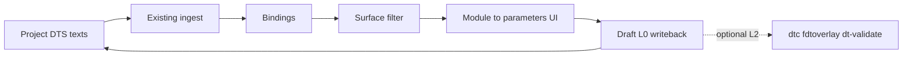

# DTS Parameter Surface MVP — Execution Plan

> Chinese summary: [Chinese](../../zh-CN/exec-plans/active/2026-07-21-dts-parameter-surface-mvp.md)  
> RFC: [`../../design-docs/2026-07-21-dts-parameter-surface-boundary-rfc.md`](../../design-docs/2026-07-21-dts-parameter-surface-boundary-rfc.md)  
> Cut matrix: [`../../design-docs/2026-07-21-dts-capability-cut-matrix.md`](../../design-docs/2026-07-21-dts-capability-cut-matrix.md)  
> Bite-sized agent plan: [`../../superpowers/plans/2026-07-21-dts-parameter-surface-mvp.md`](../../superpowers/plans/2026-07-21-dts-parameter-surface-mvp.md)

- Date: 2026-07-21
- Status: **Active** (planning complete; implementation not started)
- Feature branch: `feat/dts-parameter-surface-mvp` (from latest `main`)

## Goal

Deliver a **minimum closed loop** aligned with the RFC:

1. Extract / filter a **manageable parameter surface** (hide bus scaffolding such as `&spmi` / `#address-cells` from the default ledger).
2. Default UX is **module → parameters** (driver not required in navigation).
3. Parameter edits **write back the project’s maintained DTS text** under workflow governance.
4. **`dtc` / `fdtoverlay` / `dt-validate` leave the edit hot path** (L2 only on export/Admin release check).

## Architecture (MVP)

- Reuse existing parse / resolve / binding pipeline **internally**.
- Add an explicit **surface classifier** (pure function + tests) applied when building workbench rows and default binding list projections.
- Soften draft creation to **L0** integrity only; move toolchain assert to Admin/export L2.
- Prefer writeback target = **project primary overlay / board DTS** already used by the project; do not invent a second identity system in MVP.

## Out of scope (MVP)

- Dropping Config Set tables or logical-node schema
- Automatic Git publish
- Full retire of mock ParametersTable
- Perfect vendor schema coverage

## Git & PR Workflow

| Role | Allowed |
| --- | --- |
| Implementation agent | Commit on `feat/dts-parameter-surface-mvp` only; no PR merge |
| Parent agent | Open/merge PR, sync `main` |

## Documentation Impact Matrix

| Document | Impact | Action |
| --- | --- | --- |
| `docs/design-docs/2026-07-21-dts-parameter-surface-boundary-rfc.md` | RFC | Done (this program) |
| `docs/zh-CN/design-docs/2026-07-21-dts-parameter-surface-boundary-rfc.md` | RFC ZH | Done |
| `docs/design-docs/2026-07-21-dts-capability-cut-matrix.md` | Cut matrix | Done |
| `docs/zh-CN/design-docs/2026-07-21-dts-capability-cut-matrix.md` | Cut matrix ZH | Done |
| `docs/design-docs/index.md` / `docs/zh-CN/design-docs/index.md` | Index links | **Update** (this change) |
| `docs/PLANS.md` / `docs/zh-CN/PLANS.md` | Active plan list | **Update** (this change) |
| `docs/FRONTEND.md` / `docs/zh-CN/frontend.md` | Surface UX, toolchain L0/L2, module-only nav | **Update** during Tasks C–D |
| `docs/product-specs/prototype-functional-spec.md` | Fail-closed toolchain wording | **Review** → align with RFC L2 |
| `docs/design-docs/2026-07-14-dts-parameter-management-assessment.md` | Superseded locks | **Update** pointer to RFC §6 |
| `ARCHITECTURE.md` | Brief boundary note | **Review** |
| OpenAPI / `api-contract.md` | Only if list APIs gain `surface=true` query | **Review** in Task B |
| Browser acceptance map / operation matrix | Workbench empty-state + column/nav | **Update** if UI copy/IA changes ship |

## Documentation Update Gate

Before moving this plan to `completed/`:

- [ ] Every Update/Review row above updated or recorded unchanged with evidence
- [ ] `npm run docs:check` passes
- [ ] FRONTEND EN+ZH describe parameter surface + L0/L2 toolchain
- [ ] prototype-functional-spec toolchain sentence reconciled with RFC

## Task overview

Detailed checkboxes and code-level steps live in [`docs/superpowers/plans/2026-07-21-dts-parameter-surface-mvp.md`](../../superpowers/plans/2026-07-21-dts-parameter-surface-mvp.md).

| ID | Deliverable | Primary files |
| --- | --- | --- |
| A | Surface classifier + unit tests | `src/domain/parameter-topology/parameterSurface.ts` (new), tests |
| B | Apply surface filter to workbench rows / default binding projection | `buildDtsWorkbenchRows.ts`, binding list service or workspace |
| C | Module → parameters nav (no required driver tier); demote driver column | `buildModuleTree.ts`, `DtsParameterWorkbench*.tsx` |
| D | Remove toolchain fail-closed from draft create (L0 only); L2 on Admin validate/export | `editService.ts`, `dtsToolchain.ts` call sites |
| E | Product copy + empty state: project DTS, not Config Set; FRONTEND docs | `ApiProjectTopologyWorkspace.tsx`, FRONTEND EN/ZH |
| F | Provisional surface rows when schema unmatched (editable path) | ingest matchBind path or post-filter provisional bindings — see agent plan |
| G | Narrow tests + `npm run build` + browser check of `/parameters` | vitest, playwright-cli |

## Verification (plan complete criteria)

- Unit: surface rules exclude `#address-cells` under scaffolding; include `r_pcb` under `batt`
- UI: module nav shows parameters without mandatory driver grouping; scaffolding props absent from default table
- Edit: draft succeeds when toolchain binary missing or L2 would fail, as long as L0 writeback OK
- Docs: RFC + matrix linked; FRONTEND updated; `docs:check` green

## Risks

- Filtering only in UI leaves API consumers seeing noise — prefer shared classifier used by API list + UI
- Provisional bindings without specs may collide with unique constraints — design F carefully (draft-only vs durable)
- Seed still needs base for compile demos — keep internal; do not teach it as the product story
