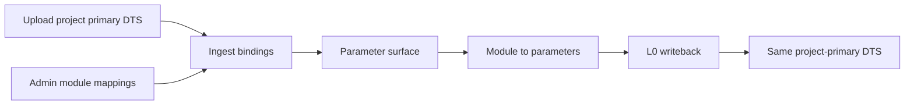

# Retire Synthetic Platform Base DTS — Execution Plan

> Chinese summary: [Chinese](../../zh-CN/exec-plans/active/2026-07-21-retire-synthetic-base-dts.md)  
> RFC: [`../../design-docs/2026-07-21-project-primary-dts-contract-rfc.md`](../../design-docs/2026-07-21-project-primary-dts-contract-rfc.md)  
> Related: surface MVP [`2026-07-21-dts-parameter-surface-mvp.md`](2026-07-21-dts-parameter-surface-mvp.md)  
> Bite-sized agent plan: [`../../superpowers/plans/2026-07-21-retire-synthetic-base-dts.md`](../../superpowers/plans/2026-07-21-retire-synthetic-base-dts.md)

- Date: 2026-07-21
- Status: **Active** (Phase 3 seed gate on `feat/parameter-maintenance-retire-dtc`: committed `*-board.dts` are SoT; `db:seed:m1` uses parse-only integrity; `dtc:seed:compile` is advisory in CI)
- Feature branch: `feat/retire-synthetic-base-dts` or `feat/parameter-maintenance-retire-dtc` (from latest `main`, or stack after surface MVP lands)

## Goal

Align seed, writeback, and admin duties with the **project-primary DTS** product contract:

1. Users upload **one** project DTS; all subsequent parameter merges update **that** final text.
2. Admins maintain **module ↔ driver** mappings only — never a platform base DTS.
3. Retire `wiseeff-power-base.dts` from seed / demo / product paths.
4. Demo projects each get a **self-contained primary DTS**.

## Architecture

- Keep existing ingest / binding / CST writeback engine.
- Change **seed inputs and entryFile selection**, not identity rules.
- Prefer making the **project-primary file** the writeback member (flatten or designate one member as primary — pick one default in Task B and stick to it).

## Out of scope

- Full Config Set table deletion
- Multi-include advanced import UX for production customers
- Replacing module mapping with DTS-encoded metadata
- Reopening surface / L0/L2 decisions from the surface RFC — aligned with the parameter-maintenance program: **L2 off merge hot path**; toolchain remains Admin/baseline assist only

## Git & PR Workflow

| Role | Allowed |
| --- | --- |
| Implementation agent | Commit on `feat/retire-synthetic-base-dts` only; no PR merge |
| Parent agent | Open/merge PR, sync `main` |

## Documentation Impact Matrix

| Document | Impact | Action |
| --- | --- | --- |
| `docs/design-docs/2026-07-21-project-primary-dts-contract-rfc.md` | RFC | **Done** (this change) |
| `docs/zh-CN/design-docs/2026-07-21-project-primary-dts-contract-rfc.md` | RFC ZH | **Done** |
| `docs/design-docs/2026-07-21-dts-capability-cut-matrix.md` §6 | Seeds row | **Update** Keep-internal → Retire + link RFC |
| `docs/zh-CN/design-docs/2026-07-21-dts-capability-cut-matrix.md` §6 | Same | **Update** |
| `docs/design-docs/index.md` / `docs/zh-CN/design-docs/index.md` | Index | **Update** (this change) |
| `docs/PLANS.md` / `docs/zh-CN/PLANS.md` | Active plan list | **Update** (this change) |
| `docs/runbooks/parameter-identity-cutover.md` EN+ZH | Golden base mentions | **Update** during seed migrate |
| `docs/design-docs/domain-model.md` EN+ZH | Golden fixture counts | **Update** when locks change |
| `docs/FRONTEND.md` / `docs/zh-CN/frontend.md` | Upload-one-file + writeback | **Review** / clarify if needed |
| `docs/product-specs/prototype-functional-spec.md` | Project DTS story | **Review** |
| `scripts/seed-m1-parameters.ts` comments / seed docs | entryFile | **Update** with code |

## Documentation Update Gate

Before moving this plan to `completed/`:

- [ ] Every Update/Review row above updated or recorded unchanged with evidence
- [ ] `npm run docs:check` passes
- [ ] Cut matrix §6 shows synthetic base as **Retire**
- [ ] Cutover / domain-model golden counts match new seed
- [ ] No active doc still requires Admins to maintain `wiseeff-power-base.dts`

## Task overview

| ID | Deliverable | Primary files |
| --- | --- | --- |
| A | Freeze product contract in docs (RFC already); cut-matrix §6 Retire | cut matrix EN+ZH |
| B | Define project-primary writeback member rule + tests | `editService` / writeback tests; FRONTEND note |
| C | Author self-contained demo primary DTS per project (or one template expanded per project at seed) | `src/config/dts-seed/*`, seed scripts |
| D | Rewire `db:seed:m1` / compile / validate scripts off shared base | `scripts/seed-m1-parameters.ts`, `compile-dts-seed.ts`, `validate-dts-config-set.ts` | **In progress** — seed gate landed on `feat/parameter-maintenance-retire-dtc` (parse-only integrity; transitional fixture retired from seed path) |
| E | Rebase vendor schema generator + golden / matcher / ingest / e2e fixtures | `vendorSchemaGenerator.ts`, fixture tests, `e2e/.../topologyFixture.ts` |
| F | Remove or quarantine `wiseeff-power-base.dts` from product seed path; update locked counts | seed file tree + domain-model / cutover docs |
| G | Verification: seed, targeted tests, build, docs:check, browser `/parameters` after reseed | — |

## Risks

| Risk | Mitigation |
| --- | --- |
| Golden count churn breaks many tests | Single intentional lock update PR; list new counts in domain-model |
| Writeback still targets overlay role | Task B chooses primary-as-write-target before deleting base |
| Vendor regen coupled to old pair | Task E first switches generator inputs, then regen YAML |
| Stacking with surface MVP | Prefer land surface MVP first; this plan may stack or rebase |

## Success criteria

Matches RFC §8. Demo projects work after `db:seed:m1` with **no** shared platform base entryFile.
