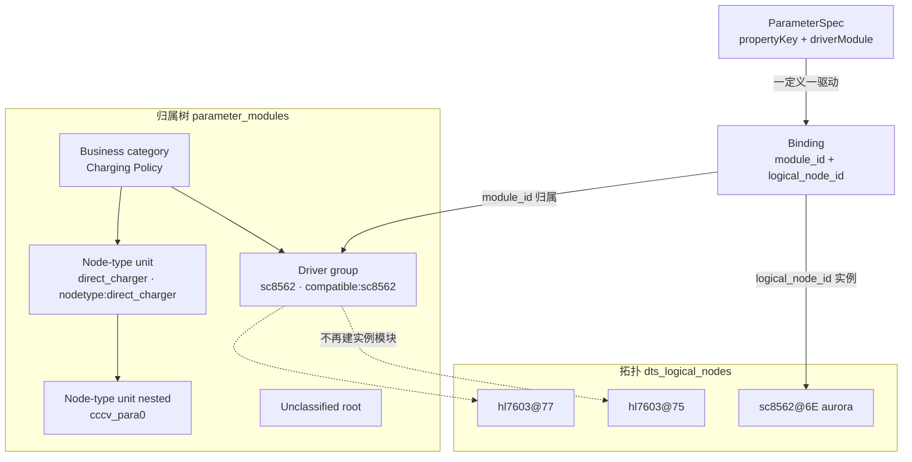

# Attribution tree is taxonomy, not topology

> Status: implementation complete on `feat/attribution-taxonomy-not-topology`. Decision: ADR-0010 (revises ADR-0004 / ADR-0005 / ADR-0006). Migration: `0080_attribution_taxonomy.sql`.

## Goal

Make the parameter module tree express **classification only** — business category, driver group, node type — and stop mirroring DTS topology inside it. After this plan:

- `project_parameter_bindings.module_id` points at a **driver group**, a **node-type unit**, or the **unclassified root**. Never at a per-device-instance module, never at a business category.
- Device instance identity is carried **solely** by `logical_node_id`, which already exists on every binding.
- A parameter definition's attribution is a **stated fact** derived from its own bindings, not a prediction re-computed from matcher inputs the spec layer does not have.

## Why: what the current model actually does

Measured against the live seeded database (`org-chargelab`, 3 projects, 548 bindings, 252 specs).

| Observation | Number |
| --- | --- |
| Bindings attributed to `logical` modules ("cannot prove this is a device") | 416 (**76%**) |
| Bindings attributed to `instance` modules | 112 |
| Bindings attributed to `driver-group` modules | **0** |
| Bindings carrying `logical_node_id` | 548 / 548 (**100%**) |
| `instance` + `logical` modules vs distinct topology nodes they cover | 45 modules ↔ 171 nodes |
| `instance` match rules whose value is a **bare node name** (no unit address) | **39 / 45 (87%)** |
| `parameter_specs` rows carrying `compatiblePatterns` | 4 / 252 |

Two conclusions follow directly.

**1. The tree is mostly a topology copy, not a taxonomy.** Driver groups — the one layer that expresses "which device model is this" — hold zero parameters. Three quarters of parameters hang off modules whose defining property is that ingest *could not* classify them. The complexity built to manage this is all traceable to the conflation: the `logical` kind exists because a topology fact (no `compatible` evidence) had to be expressed as a taxonomy dimension (ADR-0006); the kind guards, the `{business, instance, logical}` reclassify whitelist and the read-only unclassified root all exist to police the mixture; and migration `0072` created scaffolding modules (`i2c@FDF5E000`, `pmic@0`, `batt`) that ADR-0006 already recorded as "neither devices nor logical config nodes and should leave the product tree entirely".

**2. There is a missing lever, and `instance` is being used as its stand-in.** ADR-0005 states that compatible and instance are the only attribution levers. But 175 of 191 topology nodes have no `compatible` at all, and 87% of `instance` rules match on a bare node name (`middle_cpu`, `direct_charger`, `charging_core`) rather than an instance address. The product already attributes config blocks **by node type**; it just does so through a lever named "instance", which is why the rules look like instance rules and behave like type rules.

### The consequence that started this work

The parameter spec library's 预测模块 column shows `未分类 · {driver}（预测）` on almost every row. That is not bad seed data and not a broken binding — those bindings are attributed correctly. It is a **false negative in a prediction that cannot succeed**:

```145:151:src/components/parameter-admin-next/OrganizationSpecGovernancePanel.tsx
          const assignment = deriveModuleAssignment(
            {
              driverModule: item.driverModule,
              compatible: item.compatiblePatterns?.[0] ?? null,
              instanceName: null
            },
            registry
          );
```

`instanceName` is hard-coded `null`, so the 39 bare-name rules cannot match; `compatiblePatterns` is populated on 4 of 252 specs, so the compatible rules cannot match either. The spec layer is asked to re-run a binding-scoped matcher without binding-scoped evidence.

Simulation over live data, 252 specs × 50 rules:

| Prediction input | Rows that resolve | Rows falling back to 未分类 |
| --- | --- | --- |
| Current (`patterns[0]`, `instanceName: null`) | 3 | 249 |
| Also treat `driverModule` as a compatible candidate | 34 | 218 |
| Also treat `driverModule` as an instance candidate | 126 | 126 |

No amount of extra seed mappings fixes this, because the defect is the input dimension, not the rule set.

### The validation that direction A is correct

Collapsing attribution the way this plan proposes — instance modules fold into their parent driver group, `logical` modules key on the bare node name, scaffolding leaves the tree — was simulated against the live database:

| Result | Number |
| --- | --- |
| Specs resolving to **exactly one** attribution unit | **127 / 127** |
| Specs resolving to two or more | **0** |
| Attribution units after collapse (was 48 across instance + logical + driver-group) | 40 |
| `(project_id, logical_node_id, parameter_spec_id)` groups with more than one `module_id` today | **0** |

Every parameter definition resolves to exactly one attribution unit. That is the model claim — *one definition belongs to one driver; one driver owns many definitions* — holding in data. It means the spec library column can stop predicting and start stating.

The last row also clears the migration's main technical risk: coarsening `module_id` cannot violate the binding unique key `(project_id, logical_node_id, parameter_spec_id, module_id)`, because no group currently depends on `module_id` to stay distinct.

Name-collision analysis confirms the bare node name is a sound type key. Only three names appear at more than one locator — `battery_checker@0/@1`, `hl7603@75/@77`, `i2c@FDF5E000/@FF24E000` — and all three are sibling instances of the same type, which a type key is supposed to merge. Across the 175 nodes without `compatible`, 43 distinct names produce 45 (name, locator) pairs; there is no case of one name meaning different things in different subtrees.

## Locked decisions

**D1 — Module kinds become `business | driver-group | node-type | unclassified`.** `instance` is removed. `logical` is renamed to `node-type` and redefined: it is no longer "a DTS node instance we cannot prove is a device" but "a class of driverless configuration node". The rename is deliberate — keeping the name `logical` while changing it from per-instance to per-type would let the old reading survive silently.

**D2 — Attribution levers are `compatible` and `node-type`.** `compatible` resolves a device model to a driver group. `node-type` resolves a driverless configuration node to a node-type unit; its match value is the node name with any unit address stripped, normalized through `normalizeMatchToken`. The `instance` match kind is removed. This revises ADR-0005, whose reason for retiring the `driver` lever was that it was inert; the node-type lever is the opposite of inert — it decides 416 of 548 bindings today under a misleading name.

**D3 — Bindings attach to driver groups and node-type units only.** Enforced in the resolver, asserted as a database invariant, and covered by a migration-invariant test. Business categories never receive bindings; there are no per-instance modules left to receive them.

**D4 — Device instance identity lives only in `logical_node_id`.** The binding unique key keeps `module_id` for now (removing a column from a key is separable cleanup, and the simulation shows it is currently redundant rather than harmful). Two instances of one driver (`hl7603@75`, `hl7603@77`) share definitions and differ in values, distinguished by `logical_node_id`.

**D5 — Node-type units may nest; driver groups may not.** The 11 existing nested cases (`cccv_para0` under `battery_cccv`, `battery0`/`battery1` under `battery_charge_balance`, `middle_cpu` under `hisi_vbat_drop_protect_v2`) mirror real DTS configuration structure and are worth navigating. Driver groups stay a single layer under a business category.

**D6 — Scaffolding leaves the tree entirely.** `amba`, `i2c@*`, `pmic@*`, `gic*`, `gpio*`, `spmi*` get no attribution unit. Their properties are already excluded from the manageable parameter surface by `isParameterSurfaceRow`; their 20 bindings (`/amba` structural keys) stay parked on the unclassified root. This closes the ADR-0006 deferred tech debt rather than carrying it forward.

**D7 — The spec library states attribution instead of predicting it.** A spec's attribution is the distinct set of attribution units its bindings resolve to, computed server-side and returned by `GET /api/v2/parameter-specs`. The spec layer never re-runs compatible or node-type matching — that is the attribution layer's job. This is the decoupling the whole investigation pointed at: a definition only needs to know its own binding relationships. For a registered-but-not-yet-observed driver, the spec shows the driver group its `driverModule` claims, labelled 未实测, which is a normal state rather than a failure. `deriveModuleAssignment` survives only as remap tooling.

**D8 — Clean cutover, no dual-read layer.** Consistent with the phase-2 binding cutover precedent in `docs/design-docs/api-contract.md`. The affected data is seeded and reproducible; a compatibility layer would cost more than it protects.

## Target model



Levers, restated honestly:

| Lever | Evidence | Resolves to | Rules today |
| --- | --- | --- | --- |
| `compatible` | node's `compatible` string | driver group | 5 |
| `node-type` | node name, unit address stripped | node-type unit | 39 (currently mislabelled `instance`) |
| fallback | neither matched | unclassified root | — |

## Batches

One branch, ordered batches. Each batch ends green (`npm test`, `npm run test:server`, `npm run build`).

### Batch 1 — Decision record and migration base

- `docs/adr/0010-attribution-tree-is-taxonomy-not-topology.md`: new ADR. Must explicitly state which parts of ADR-0004 (instance is the leaf parameters hang from), ADR-0005 (compatible and instance are the only levers) and ADR-0006 (`logical` = unprovable device, per instance) it supersedes, and why the node-type lever is not a revival of the retired `driver` lever.
- `server/migrations/0080_attribution_taxonomy.sql`:
  - widen `parameter_modules_kind_check` to `business | driver-group | node-type | unclassified`; widen `parameter_module_mappings_match_kind_check` to `compatible | node-type`.
  - re-point bindings on `instance` modules to the parent driver group (4 modules, 108 bindings); `board` becomes a node-type unit under `Board Identity` (1 module, 4 bindings).
  - convert `logical` rows to `node-type`, merging duplicates that share a bare name (`battery_checker@0` + `@1` → `battery_checker`), rewriting `source_key` from `node:{locator}` to `nodetype:{name}`.
  - convert the 39 bare-name `instance` mappings to `node-type`; drop the 6 unit-addressed ones (4 are redundant with the compatible lever, 2 fold into one node-type rule).
  - delete scaffolding units, re-parking their bindings on the unclassified root; delete emptied `instance` rows.
  - narrow the check constraints to the final vocabulary at the end of the same transaction.
- `server/shared/database/migrationInvariant.test.ts`: assert no `instance` or `logical` rows survive, no binding points at a `business` module, and every `node-type` `source_key` matches `nodetype:*`.

Row counts must be recorded before and after each step, in the style of migration `0072`.

### Batch 2 — Server attribution write path

**Collapse two resolvers into one.** Today there are two, and they disagree. `resolveBindingInstanceModuleId` (ingest, recompute, mapping CRUD, disband) materializes per-instance and per-logical modules through four branches with recursion via `resolveTypeCParentModuleId`. `resolveModuleIdForBinding` (spec review apply, historical migration `ensureBinding`) consults mappings and falls back to the unclassified root, materializing nothing. A binding's attribution therefore depends on which code path created it. Direction A removes the reason for the split: with no per-instance modules to materialize, both paths reduce to compatible → node-type → unclassified, and Batch 2 must land them as **one** resolver.

- `src/domain/parameter-topology/modulePlacement.ts`: add `nodeTypeKeyForNode` (bare name, unit address stripped, normalized through `normalizeMatchToken`). Replace `planInstanceModulePlacements` with a planner emitting driver groups and node-type units only. `instanceModuleNameForNode` and the U/N split in `classifyModuleInstanceTaxonomy` lose their attribution role; keep the device-vs-config-block distinction only where ingest still needs it.
- `server/modules/parameter-modules/ensureInstanceModuleForBinding.ts` → rename to `ensureAttributionModuleForBinding.ts`. Delete `ensureBoardInstanceModuleId`, `resolveTypeCParentModuleId` recursion, and `ensureProvisionalUnclassifiedModule` — the `未分类 · {label}` bucket existed to hold per-instance bindings that no longer exist. Keep `ensureNamedModule` with `nodetype:{name}` keys, and keep `reassertAutoParameterModuleKind` so curated rows are never overwritten.
- `server/modules/parameter-modules/resolveModuleForBinding.ts`: becomes the single resolver. Order compatible → node-type → unclassified.
- Repoint the five write paths onto it: `server/modules/parameter-topology/ingestService.ts` (three call sites — spec-review override, `matchProperty` hit, unmatched surface row), `server/modules/parameter-specs/reviewApply.ts` (`applyResolvedSpecReview`), `server/modules/parameter-topology/migration.ts` (`ensureBinding`), `server/modules/parameter-modules/service.ts` (`recomputeBindingModules`, `createModuleMapping`, `deleteModuleMapping`, `previewModuleMapping`, `disbandDriverGroupModule`). `bindingService.createOrReuseBinding` stays a passthrough; the identity-continuity remap must keep reusing the existing `module_id` rather than reclassifying.
- Kind guards: `server/modules/parameters/service.ts` (`createParameterModuleForAuth`, `updateParameterModuleForAuth`, `deleteParameterModuleForAuth`), `server/modules/parameters/parameterModuleRepository.ts` (`deleteParameterModule`), `server/modules/parameters/schemas.ts` (create/update kind enums), `server/modules/parameter-modules/schemas.ts` (`matchKind` enum). `node-type` may be renamed and moved, and deleted only when it holds no bindings and no children; reclassify whitelist becomes `{business, node-type}`; driver-group delete still disbands; unclassified root stays read-only.
- `server/modules/parameter-modules/repository.ts`: `deleteEmptyAutoDescendants` and `collectEmptyUnclassifiedBuckets` drop their `instance` / `logical` / `未分类 · %` arms.
- `server/modules/parameter-modules/types.ts` and `server/modules/parameters/types.ts` both declare `ModuleKind` — the duplication must not drift; collapse to one or keep them mechanically identical.
- `scripts/dts-power-seed.ts` (`buildSeedModuleMappings`, `buildParameterModulesFromResolved`, `nodeSourceKey`) and `scripts/seed-m1-parameters.ts`: emit `compatible` and `node-type` rules, stop emitting per-instance modules, drop the `board` and `/` instance mappings in favour of a `board` node-type unit. The Aurora golden counts (176 occurrences, 120 matched, 684 `dts_properties`) must not move — only attribution changes.

### Batch 3 — Spec library decoupling

This is the batch that answers the original question.

- `GET /api/v2/parameter-specs` returns `attributionModules: Array<{ id, name, kind }>` per spec, computed from that spec's bindings (distinct attribution units). Empty array means not yet observed.
- `server/modules/parameter-specs/repository.ts`: the aggregation query. Live data says this is single-valued for every spec, but the DTO stays an array so a genuine multi-unit case surfaces instead of being silently truncated.
- `src/components/parameter-admin-next/OrganizationSpecGovernancePanel.tsx`: delete the `deriveModuleAssignment` call. Feed `attributionModules` straight through.
- `src/components/parameter-topology/ParameterSpecLibrary.tsx`: `moduleName` + `moduleMapped` become `attributionModules`. Column copy `预测模块` → `归属模块`; the `（预测）` suffix is removed. Unobserved specs render the claimed driver group with a 未实测 marker; genuinely unattributed specs render 未归类 with an entry point into the attribution surface.
- `src/application/parameters/parameterAdminUiCopy.ts`: `specModulePrediction` → `specAttributionModule`; update `specLibraryBlurb`.
- `src/components/parameter-topology/ParameterSpecDetail.tsx`: same change for the `（未映射）` suffix.
- `src/domain/parameter-topology/moduleRegistry.ts`: `deriveModuleAssignment` keeps only its remap-tooling role, its instance arm removed, and its doc comment states it is not a display path.

### Batch 4 — Attribution tree and workbench

- `src/components/parameter-topology/ModuleAttributionTree.tsx`, `ModuleAttributionRowActions.tsx`, `moduleAttributionTreeUtils.ts`: kind badges become `business` / `driver-group` / `node-type` / `unclassified`; `MODULE_KIND_LABEL`, `DEFAULT_ATTRIBUTION_FILTERS.kinds`, `allowedCreateKindsForParent`, `parentCandidatesForCreateKind`, `isValidCreateParent`, `canMoveModule`, `canDeleteModule`, `canReclassifyModule`, `canAddChildModule` all follow the Batch 2 guards. `countInstanceChildren` and the driver-group `· N 实例` collapsed-row summary lose their subject and are removed.
- `src/components/admin/ModuleCreateDialog.tsx`, `ModuleEditDialog.tsx`, `ModuleDefinitionForm.tsx` (`RECLASSIFY_KIND_OPTIONS`), `src/components/parameter-admin-next/OrganizationModuleGovernancePanel.tsx` (audit copy), `src/application/ports/ParameterModuleRegistryRepository.ts`, `src/infrastructure/mock/mockParameterModuleRegistryRepository.ts`: kind vocabulary.
- **Per-instance browsing: enable the dormant path, do not build a new one.** `buildModuleTree` already accepts `groupByDevice`, which inserts a device layer keyed on `instanceName` beneath each module leaf, and it is covered by `buildModuleTree.test.ts` — but `DtsParameterWorkbench` never passes it, so it is dead in production. Batch 4 turns it on, which is what makes the attribution tree safe to coarsen: navigation keeps reaching `hl7603@77` through the device layer while `module_id` stops encoding it. The technical view is not a substitute — it swaps the result pane for the whole read-only project DTS source. `ProjectTopologyWorkspace` and `buildDtsTopologyTree` are a second dormant per-instance capability reachable only from tests; leave them dormant and record why rather than wiring two paths.
- `src/application/parameters/buildModuleTree.ts`: the registry ancestor chain becomes business → {driver group | node-type} → node-type*, with the device layer supplied by `groupByDevice` rather than by registry rows. Update the comment that documents the old business → driver-group → instance shape.
- `src/application/parameters/buildDtsWorkbenchRows.ts` and `src/components/parameter-topology/ApiProjectTopologyWorkspace.tsx` (two `describeModuleAssignment` call sites for the draft tray): `describeModuleAssignment` still trusts the persisted `module_id`, so these keep working — but the displayed `moduleName` changes from `sc8562@6E` to `sc8562`, and `modulePath` loses a level. Snapshot-style assertions must be updated deliberately, not re-baselined.
- Parameter counts split into two facts, because one number can no longer mean both: **定义数** (distinct specs attributed to the unit) and **实测处数** (bindings, i.e. node × project occurrences). `aggregateSubtreeParameterCounts` currently rolls a single `parameterCount` up the tree on the premise that instance leaves hold the parameters and parents are zero; once driver groups hold them directly, that premise inverts.
- Unclassified queue keeps its query and gains the second population: observed-but-unregistered compatibles, plus node types that could not be placed. Dismiss/restore semantics unchanged.
- Out of scope, verified separate: `src/ParametersPage.tsx`, `src/domain/modules/moduleTree.ts` (`parameterModuleId`), `src/parameterAdminLibrary.ts`, `src/powerManagementConfig.ts` and `src/debugAdminModules.ts` / `DebuggingAdminPage.tsx` use their own legacy `moduleId` concept, not DTS binding attribution.

### Batch 5 — Docs, glossary, acceptance

Covered by the two gates below.

## Verification

```bash
npm test
npm run test:server
npm run test:all
npm run build
npm run docs:check
```

Targeted, per batch:

```bash
npx vitest run server/shared/database/migrationInvariant.test.ts
npx vitest run server/modules/parameter-modules
npx vitest run server/modules/parameter-specs
npx vitest run src/domain/parameter-topology
npx vitest run src/components/parameter-topology
```

Data verification after `npm run db:seed:m1`, expressed as assertions rather than eyeballing:

- no `parameter_modules` row has `kind` in (`instance`, `logical`)
- no binding's `module_id` resolves to a `business` module
- every spec with at least one binding resolves to exactly one attribution unit (expected 127 / 127 on the Aurora seed)
- the spec library shows zero `（预测）` suffixes

Frontend verification per `AGENTS.md`: `/parameter-admin` 参数定义库 and 模块归属 tabs at 1440x900, 768x1024, 390x844, with snapshot, screenshot, console error check, and the real interactions (search, column filter, classify, edit dialog, reclassify).

### Tests that must change

Known in advance, so a surprise failure outside this list is a signal rather than noise. Every one of these encodes part of the old model; none should be re-baselined without deciding what the new assertion means.

Server — kind and lever vocabulary: `server/modules/parameter-modules/service.test.ts`, `moduleReclassify.test.ts`, `logicalKind.test.ts` (whole file's premise), `moduleMappingRoutes.test.ts`, `mappingRecompute.test.ts`, `unclassifiedQueue.test.ts`, `ensureInstanceModuleForBinding.test.ts` (renamed with its module), `server/modules/parameters/moduleRoutes.test.ts`, `moduleCrudGuards.test.ts`, `server/modules/parameter-topology/ingestService.test.ts`, `dtsIngestAttribution.test.ts`, `server/shared/database/migrationInvariant.test.ts`, `scripts/dts-power-seed.test.ts`.

Frontend — kind badges and instance rows: `ModuleAttributionTree.test.tsx` (`sc8562@6E` kind=instance fixture, 「器件实例」badge, 「· 1 实例」), `moduleAttributionTreeUtils.test.ts` (`allowedCreateKindsForParent("driver-group") → ["instance"]`, instance immovable/undeletable, rollup totals), `moduleRegistry.test.ts` (`matchKind: "instance"`, `未分类 · sc8562` fallback), `buildDtsWorkbenchRows.test.ts`, `buildModuleTree.test.ts` (registry nesting business→group→instance; the `groupByDevice` case becomes the production path), `DtsTopologyNavigator.test.tsx` (multiple `/sc8562@6E/` treeitems), `ParameterSpecLibrary.test.tsx` (`未分类 · mt5788（预测）` — the assertion this plan exists to delete), `parameterSurface.test.ts` (`未分类 · amba-bus`), `DtsBindingDetailDialog.test.tsx`, `ParameterAdminNextPage.test.tsx`.

E2E: `e2e/acceptance/parameter-topology.acceptance.spec.ts`, plus the `MOD-ATTR` requirement text in `e2e/acceptance/operationMatrix.ts` and `requirements.ts`. Several `MOD-ATTR-*` cases there are currently **Pending** and describe kind-scoped actions, `logical → business` reclassify, and create-instance/create-logical — they must be rewritten to the new vocabulary rather than un-skipped as-is.

## Git & PR Workflow

| Role | Allowed |
| --- | --- |
| Implementation subagent | branch `feat/attribution-taxonomy-not-topology` from latest `main`, implement, test, commit on the branch |
| Implementation subagent | Must not push to `main`, open or merge PRs, or fast-forward local `main` |
| Parent agent | Review, spot-check verification, open the PR, merge, then sync local `main` |

One plan, one branch. Batches land as separate commits on that branch.

## Documentation Impact Matrix

| Area | Action | Files |
| --- | --- | --- |
| Repository map | Review | `AGENTS.md`, `ARCHITECTURE.md`, `docs/zh-CN/root/AGENTS.md`, `docs/zh-CN/root/ARCHITECTURE.md` |
| Domain glossary | **Update** | `CONTEXT.md` — retire 「Device instance module」as a binding target, redefine 「Driver group」as the binding target, add 「Node-type unit」, revise 「Module kind」and 「Unclassified queue」 |
| ADRs | **Update** | new `docs/adr/0010-attribution-tree-is-taxonomy-not-topology.md`; supersession notes appended to `docs/adr/0004-module-tree-states-kind-and-origin.md`, `docs/adr/0005-compatible-and-instance-are-the-only-attribution-levers.md`, `docs/adr/0006-logical-nodes-and-manual-kind-correction.md` |
| Planning docs | **Update** | `docs/PLANS.md`, `docs/zh-CN/PLANS.md` (add this plan); `docs/exec-plans/tech-debt-tracker.md` (close the ADR-0006 scaffolding-module debt; record any deferred item) |
| Domain model | **Update** | `docs/design-docs/domain-model.md`, `docs/zh-CN/design-docs/domain-model.md` — three-layer tree statement, kind vocabulary, lever precedence |
| API contract | **Update** | `docs/design-docs/api-contract.md`, `docs/zh-CN/design-docs/api-contract.md` — binding module resolution order, `parameter-specs` `attributionModules` field, mappings `match_kind` vocabulary |
| Frontend docs | **Update** | `docs/FRONTEND.md`, `docs/zh-CN/frontend.md` — kind badges, tree scope, spec library column semantics, the two count facts, topology browsing path |
| Product specs | **Update** | `docs/product-specs/prototype-functional-spec.md`, `docs/zh-CN/product-specs/prototype-functional-spec.md` — the attribution tree description names a three-layer business → driver group → instance tree |
| Security / governance | Review | `docs/SECURITY.md`, `docs/zh-CN/SECURITY.md` — kind-scoped write guards paragraph names `instance` explicitly |
| Quality / testing | Review | `docs/QUALITY_SCORE.md`, `docs/design-docs/testing-strategy.md`, `docs/zh-CN/design-docs/testing-strategy.md` |
| Reliability / runbooks | Review | `docs/RELIABILITY.md`, `docs/runbooks/manual-acceptance.md`, `docs/zh-CN/manual-acceptance.md` |
| Generated artifacts | **Update** | `docs/generated/db-schema.md` — already stale in three ways before this plan: the `kind` check omits `logical`, `parameter_module_mappings` is absent entirely, and `project_parameter_bindings` has no table definition (so neither `module_id` nor the `0067` unique constraint appears). Regenerate rather than patch, then confirm the new vocabulary and migration `0080` landed |
| Acceptance coverage | **Update** | `docs/developer/browser-acceptance-coverage-map.md`, `docs/developer/user-operation-coverage-matrix.md` and Chinese companions |
| References | Review | `docs/references/productization-api-contract-draft.md` |
| Other active plans | Review | `docs/exec-plans/active/2026-07-27-module-attribution-redesign.md`, `2026-07-28-module-logical-kind-and-manual-reclassify.md`, `2026-07-28-driver-registry.md`, `2026-07-29-org-driver-schema-overlay.md`, `2026-07-30-platform-tier-and-super-admin.md` — all touch driver groups or module kinds |

## Documentation Update Gate

Blocking. This plan cannot move to `completed/` until every `Update` and `Review` row above is either updated or explicitly recorded as unchanged with evidence, `npm run docs:check` passes, and any deferred work is filed in `docs/exec-plans/tech-debt-tracker.md`.

Bilingual pairs must stay separate files linked to each other; `scripts/bilingual-docs.ts` is the inventory of required pairs.

## UI Interaction Automation

User-facing interaction changes: the attribution tree row vocabulary and actions, the spec library column, and per-instance browsing.

- Affected spec: `e2e/acceptance/parameter-topology.acceptance.spec.ts`
- Requirement IDs to update: `MOD-ATTR-QUEUE-001`, `MOD-ATTR-CLASSIFY-001` in `docs/developer/browser-acceptance-coverage-map.md`
- New requirement ID needed: spec library shows a stated attribution module (no `（预测）`) and 未实测 for a registered-but-unobserved driver group. No existing ID covers this.
- New requirement ID needed: per-instance parameter browsing through the workbench device layer, since the attribution tree no longer offers it. The current acceptance spec explicitly documents that this layer is off (`groupByDevice` disabled), so this is a behaviour change to cover, not an existing one to re-assert.
- Operation IDs in `docs/developer/user-operation-coverage-matrix.md` covering attribution tree edit / reclassify must be revised for the `{business, node-type}` whitelist.
- Known assertion to change: an existing acceptance expectation looks for a `未分类 · sc8562` tree item; under this plan `sc8562` is a driver group holding the parameters directly.
- Operation evidence must still generate through `npm run acceptance:browser` or `npm run acceptance:evidence`.

## Risks

| Risk | Handling |
| --- | --- |
| Per-instance parameter browsing regresses | **Resolved by enabling `groupByDevice`** in `DtsParameterWorkbench` (Batch 4). The capability already exists and is unit-tested; it is simply not wired up. Turning it on is a precondition for coarsening the tree, not a follow-up |
| Two resolvers disagree today, so a binding's attribution depends on which path created it | Batch 2 collapses them into one. Assert it: `recomputeBindingModules` over a fully seeded database must be a no-op for every binding |
| `businessCategoryForNodePath` is a demo-grade keyword router that decides where auto node-type units land | Out of scope to replace; behaviour unchanged by this plan. File as tech debt so it is not mistaken for a designed placement rule |
| Node-name type key collides across unrelated subtrees in a future DTS | None today (43 names / 45 pairs, all sibling instances). Escape hatch: an Admin-declared locator-qualified match value. Do not build it speculatively; assert the invariant in ingest and fail loudly |
| Spec `driverModule` disagrees with node evidence (`bat_para` exists as both `direct_charger` draft and `huawei,direct_charger` active) | Not caused by this plan and not fixed by it. D7 sidesteps it by attributing from bindings rather than from the `driverModule` string. File the identity split as tech debt |
| Driver registry, org overlay and platform tier plans key on driver groups | **Verified clear.** `listDriverRegistry` and `registerOrClaimDriver` read `kind = driver-group` only; `driver_schema_overlays` has no `parameter_modules` foreign key and matches on the compatible string; `lookupParseCoverage` and promotion never read module kinds. `source_key = compatible:*` keeps its shape and meaning |
| Golden fixture counts move | Aurora counts (176 / 120 / 684) are attribution-independent; assert them unchanged rather than re-baselining |

## Out of scope

- Removing `module_id` from the binding unique key. Currently redundant with `logical_node_id`, but a separable cleanup.
- Replacing `businessCategoryForNodePath` with a real placement rule.
- Reconciling the spec `driverModule` identity split.
- Any change to the schema matcher, overlay tiers, or promotion (ADR-0008 / ADR-0009).
