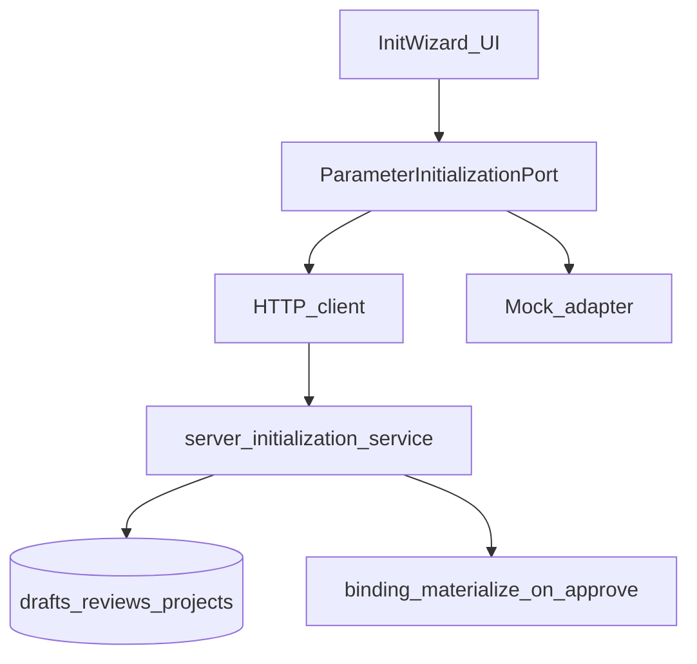

# Project parameter initialization — semantic landing (C1)

> Status: **Implementation complete on branch** — awaiting parent PR/merge; **TD-060** closed in tech-debt tracker
> Date: 2026-08-05
> Parent: [`2026-08-05-path-reachable-mock-gap-program.md`](./2026-08-05-path-reachable-mock-gap-program.md)
> Tracks: **TD-060**
> Design (to amend first): [`docs/design-docs/2026-05-20-project-parameter-initialization-design.md`](../../design-docs/2026-05-20-project-parameter-initialization-design.md)
> Chinese: [`docs/zh-CN/exec-plans/active/2026-08-05-project-parameter-initialization.md`](../../zh-CN/exec-plans/active/2026-08-05-project-parameter-initialization.md)

## Goal

Land **project parameter initialization** as a real API + DB workflow: create project → choose source projects → snapshot selected **semantic bindings** → submit review → admin approve/reject → unlock normal parameter workflow.

Today the wizard, reducer state (`parameterInitializationDrafts` / `Reviews` / `projectInitializationStatuses`), and review Tab are path-reachable but **have no server routes or tables**.

## Non-goals

- Ongoing sync with source projects after approve (one-time snapshot only — unchanged from design).
- Full template marketplace.
- Restoring flat `ParametersTable` / `recommendedValue` as API workbench truth ([`docs/FRONTEND.md`](../../FRONTEND.md) forbids recommendation-drift in API mode).
- Replacing ordinary change-request review for day-2 edits.

## Locked decisions

1. **Amend the May 2026 design before coding** so snapshot items reference **source binding identities** (`projectParameterBindingId` / spec version / effective value shape), not legacy `parameterId` + `recommendedValue` strings as SSOT.
2. On approve, materialize bindings (and required supporting topology/file state as defined in the amended design) on the **target project**; do not copy source `currentValue` device measurements as if measured on the new project — keep “pending project confirmation” (or semantic equivalent) where the design requires.
3. Project lifecycle statuses remain: `not_initialized` | `initialization_draft` | `initialization_pending_review` | `initialization_rejected` | `initialized` (persist on `projects` or dedicated column).
4. While status ≠ `initialized` (and not `maintenance` if that remains a separate ops state), block normal typed binding submit (match current UI lock intent).
5. Frontend leaves reducer-as-SSOT: Port + HTTP client + hydrate; mock adapter implements the same Port honestly (after C4 import honesty pattern).
6. Prefer next migration id after current head (as of plan authoring: **≥ 0091** — confirm at implementation time).

## Git & PR Workflow

| Role | Allowed |
| --- | --- |
| Implementation agent | Commit on `feat/project-parameter-initialization`; no PR open/merge |
| Parent agent | Review, PR, merge, sync `main`; close TD-060 |

Branch: `feat/project-parameter-initialization` from latest `main`. Prefer landing **after** C4 if mock App import paths are touched in the same areas; may proceed in parallel if file conflict is low.

## Architecture (target)



Suggested module placement: `server/modules/parameters/` extension **or** dedicated `server/modules/parameter-initialization/` if routes/services grow large — decide in design amendment; default to **parameters module** to reuse project authz.

## File map (expected)

| Layer | Paths |
| --- | --- |
| Design | `docs/design-docs/2026-05-20-project-parameter-initialization-design.md` (+ zh-CN mirror if present / add) |
| Domain types | `src/domain/parameters/types.ts` — re-shape snapshot item |
| Port | new `ParameterInitializationRepository.ts` (or methods on existing admin/parameter port) |
| HTTP / mock | new clients + mock adapter |
| UI | `src/ProjectParameterInitializationWizard.tsx`, review Tab in `src/App.tsx` / parameter-review surface, `ParametersPage` lock |
| Server | migration `009x_project_parameter_initialization.sql`, routes, service, repository, audit |
| Tests | unit, server, e2e/acceptance |

## Tasks

### Batch 0 — Design amendment (blocking)

- [x] Rewrite snapshot / conflict / approve sections for **semantic bindings** post-cutover.
- [x] Explicitly deprecate design paragraphs that treat shared flat definitions + `recommendedValue` as the write model for API mode.
- [x] Define empty-project path (“start from empty” → `initialized` with zero bindings) and authz matrix.
- [x] Define audit events: draft submitted, approved, rejected.
- [x] Get design amendment reviewed (same PR as docs or docs-only first commit on the branch).

### Batch 1 — Schema + API

- [x] Migration: draft table, review table, project `initialization_status` (and indexes / org FK).
- [x] Routes (illustrative — finalize names in OpenAPI/manifest):
  - create/update draft
  - preview snapshot (server-side resolve from source bindings)
  - submit review
  - list reviews (admin)
  - approve / reject
  - get project initialization status
- [x] Service: primary/supplement merge rules; approve transactional materialize; reject keeps draft editable.
- [x] Authz: creator edits own draft; admin approve/reject; audit on submit/approve/reject.
- [x] Server tests for happy path, conflict priority, double-approve, unauthorized.

### Batch 2 — Frontend Port + wire-up

- [x] Port methods + HTTP client + mock adapter.
- [x] Wizard reads/writes via Port; remove reducer-only persistence for drafts/reviews in API mode.
- [x] Review Tab lists server reviews; approve/reject call API.
- [x] Parameters / topology workspace respects server initialization status lock.
- [x] Hydrate status on project switch.

### Batch 3 — Acceptance + docs

- [x] Register acceptance / operation IDs (below).
- [x] e2e API + browser evidence (three viewports for wizard + review).
  Evidence: `work/ui-checks/param-init/` (wizard `desktop-1440` / `tablet-768` / `mobile-390`; review `review-desktop-1440` / `review-tablet-768` / `review-mobile-390`). After applying migration `0091`, empty-library submit → pending row on `/parameter-review`; review page console errors: 0.
- [x] Update product-spec / FRONTEND / domain-model / db-schema generated summary.
- [x] Close TD-060; tick parent program C1.

## UI interaction coverage

| ID | Behavior |
| --- | --- |
| `PARAM-INIT-WIZARD-001` | Creator completes wizard with sources + selection and reaches pending review |
| `PARAM-INIT-EMPTY-001` | Explicit empty init reaches `initialized` with no bindings |
| `PARAM-INIT-REVIEW-001` | Admin approves; project unlocked; bindings present per snapshot |
| `PARAM-INIT-REJECT-001` | Admin rejects with reason; creator can revise |
| `PARAM-INIT-LOCK-001` | Non-initialized project cannot submit normal binding change rounds |

Add to browser-acceptance-coverage-map + user-operation-coverage-matrix (+ zh-CN).

## Verification

```bash
npm run test:server -- server/modules/parameters --run
# or parameter-initialization module path
npm test -- src/ProjectParameterInitializationWizard.test.tsx src/App.test.tsx --run
npm run build
npm run docs:check
# e2e / acceptance as registered
```

## Documentation Impact Matrix

| Area | Action | Paths |
| --- | --- | --- |
| Planning | Update | Parent program; this plan; PLANS indexes |
| Tech debt | Update | Close **TD-060** on completion |
| Design | Update | `docs/design-docs/2026-05-20-project-parameter-initialization-design.md` (+ zh-CN if/when mirrored) |
| Product specs | Update | `docs/product-specs/product-spec.md`, `prototype-functional-spec.md` (+ zh-CN) |
| Domain model | Update | `docs/design-docs/domain-model.md`, `docs/zh-CN/design-docs/domain-model.md` |
| API contract | Update | `docs/design-docs/api-contract.md` / references as used |
| Frontend | Update | `docs/FRONTEND.md`, `docs/zh-CN/frontend.md` |
| Architecture | Review | `ARCHITECTURE.md` — Update if new module folder is introduced |
| Security | Update | Authz + audit for init approve |
| Quality / acceptance | Update | coverage map + operation matrix (+ zh-CN) |
| Generated | Update | `docs/generated/db-schema.md` after migration |
| Reliability / runbooks | Review | Only if pilot ops need init status notes |
| Chinese companions | Update | This plan’s zh-CN summary |

## Documentation Update Gate

- [x] Design amendment merged before or with Batch 1
- [x] All Update rows landed or deferred with TD
- [x] Acceptance IDs registered and covered
- [x] TD-060 Completed
- [x] `npm run docs:check`
- [ ] Parent program C1 + program archive eligibility

## Success criteria

1. API mode can initialize a project from sources with durable draft/review rows.
2. Approve materializes semantic bindings; reject is revisable; lock enforced until initialized.
3. Mock adapter implements the same Port without toast-only lies.
4. May 2025/2026 flat recommendedValue write model is no longer the documented API path.
5. TD-060 closed; parent program can complete after C1–C4.
