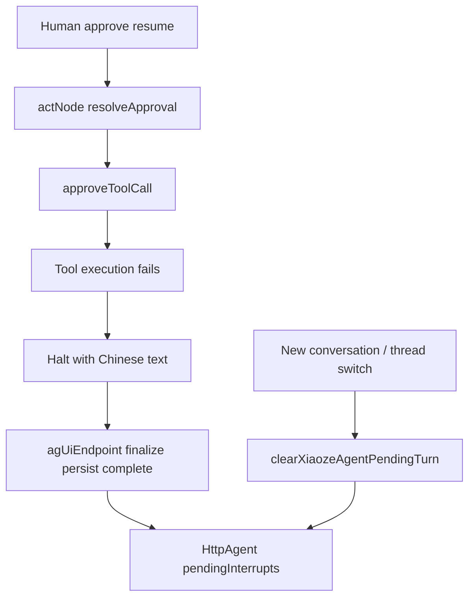

# Xiaoze approval execution failure recovery (TD-102 / TD-094)

> Status: **In progress**
> Date: 2026-08-17
> Tracks: **TD-102**, **TD-094**
> Branch: `fix/td102-approval-execution-dead-end`
> Chinese: [`docs/zh-CN/exec-plans/active/2026-08-17-xiaoze-approval-failure-recovery.md`](../../zh-CN/exec-plans/active/2026-08-17-xiaoze-approval-failure-recovery.md)

## Goal

When a human approves a Xiaoze mutating tool and execution then fails (stale working tip, unresolvable overlay target, and similar), the chat must stay usable:

- The graph **halts** with a Chinese assistant `text` that includes the reason (halt prefix plus mapped reason).
- `actNode` must **not** rethrow. Clear `pendingMutatingCall` / `interrupt` the same way the reject path does so a later `run` on the same thread without resume is not a LangGraph pending interrupt.
- The AG-UI endpoint must **persist** that assistant text (`finalize` + persist + `complete()`), not `stream.fail` / English `RUN_ERROR`.
- New conversation (and selecting another thread) must drop CopilotKit/`HttpAgent.pendingInterrupts` on the shared default agent. `setMessages([])` is not enough.
- On **successful** approve, stop `appendAgentMessage` in `approveToolCall`. `persistTurn` owns the visible reply (TD-094).

## Non-goals

- A new i18n framework. Map `ApiError` codes/reasons with a tiny server-side helper; do not import `src/` from `server/`.
- Changing the existing AG-UI `FORBIDDEN` path except where the same catch block is reused.
- Changing reject-path double-write unless it falls out of the same edit with a test.
- A brittle browser fixture that fakes a green `XIAOZE-APPROVAL-EXEC-FAIL-001`. Graph + endpoint tests are the blocking gate; the browser ID is an honest `@acceptance-planned` stub with `required: false`.

## Git & PR Workflow

| Role | Allowed |
| --- | --- |
| Implementation agent | Commit on `fix/td102-approval-execution-dead-end`; do not open or merge GitHub PRs |
| Parent agent | Review, run verification, open/merge the PR, then sync local `main` |

Branch: `fix/td102-approval-execution-dead-end`, checked out from the latest `origin/main` in an isolated worktree. Do not fast-forward local `main`.

## Architecture



- Execution failure is a **halted turn**, not a stream error.
- Orchestrator still marks the tool `failed` and audits `approval-execution-failed`, then rethrows for the graph to catch.
- Visible assistant text on success is owned by `persistTurn` (observe-node reply), not `agent-msg-*` from `approveToolCall`.

## Tasks

- [x] Batch 1: `actNode` catches non-FORBIDDEN `resolveApproval` rejection, emits Chinese halt text, clears interrupt, leaves checkpoint resumable without `resume`.
- [x] Batch 1: `agUiEndpoint` persist + `complete()` for this case; no `RUN_ERROR`.
- [x] Batch 1: New conversation / thread switch clears `HttpAgent.pendingInterrupts` via `clearXiaozeAgentPendingTurn`.
- [x] Batch 2: `approveToolCall` stops `appendAgentMessage` on success; `resolveApproval` reads the tool summary; update `orchestrator.test.ts`.
- [x] Register `XIAOZE-APPROVAL-EXEC-FAIL-001` as `required: false` + `@acceptance-planned` stub.
- [x] Update TD-102 / TD-094 tracker rows (EN Open table + zh-CN in-progress / recently closed).
- [x] Parent: add Current Active bullet in `docs/PLANS.md` / `docs/zh-CN/PLANS.md`.

## UI Interaction Automation review

Affected spec: `e2e/acceptance/xiaoze-action.acceptance.spec.ts`.

| ID | Behavior | Automation |
| --- | --- | --- |
| `XIAOZE-APPROVAL-EXEC-FAIL-001` | After approve, a failed tool execution shows a Chinese assistant bubble (halt prefix plus reason), the thread stays usable, and New conversation is not bricked by a pending interrupt. | Honest `@acceptance-planned` / `@operation-planned` stub, `required: false`, coverage `future`. Blocking proof is graph + AG-UI assembly tests. A true browser path needs a stale-working-tip / overlay fixture that is too brittle for this slice. |

Operation evidence stays on `npm run acceptance:browser` / `npm run acceptance:evidence` when the stub is later automated.

## Verification

```bash
npx vitest run server/modules/agent/xiaoze/planningGraph.test.ts server/modules/agent/orchestrator.test.ts server/modules/agent/xiaoze/agUiEndpoint.test.ts server/modules/agent/xiaoze/agUiEndpoint.assembly.test.ts --config vitest.server.config.ts
npx vitest run src/features/agent/xiaozeHttpAgent.test.ts src/features/agent/XiaozeThreadController.test.tsx
npx tsc -b
npm run docs:check
npm run acceptance:coverage
npm run acceptance:operations
```

Do not run full browser acceptance unless cheap.

## Success criteria

- Approved execution failure: Chinese chat bubble, interrupt cleared, later message on the same thread does not hit LangGraph pending-interrupt, AG-UI `RUN_FINISHED` success with persisted assistant text.
- New conversation / thread switch: `HttpAgent.pendingInterrupts` empty so the next user message is not blocked by CopilotKit's pending-interrupt check.
- Successful approve: one visible assistant row from `persistTurn`, not a duplicate `agent-msg-*` summary.

## Documentation Impact Matrix

| Area | Action | Paths |
| --- | --- | --- |
| Repository maps | No change | `AGENTS.md`, `ARCHITECTURE.md` — approval-chain seams unchanged |
| Planning | Update | This plan + zh companion. `docs/PLANS.md` / `docs/zh-CN/PLANS.md` Current Active bullet. |
| Product specs | No change | Failure copy is recovery UX, not a new workflow |
| Domain / glossary | No change | Agent approval chain already documented |
| Design docs | No change | No API/schema change |
| API | No change | Same AG-UI envelope; recovered turns use existing success frames |
| Frontend | Review | `docs/FRONTEND.md` — thread switch already documented; interrupt reset is an implementation detail of `XiaozeHttpAgent` |
| Security | No change | Authz/audit on approve unchanged (`approval-execution-failed` stays) |
| Reliability / runbooks | No change | |
| Developer env | No change | |
| Quality / acceptance | Update | `docs/developer/browser-acceptance-coverage-map.md` + zh; `docs/developer/user-operation-coverage-matrix.md` + zh; `e2e/acceptance/requirements.ts`; `e2e/acceptance/operationMatrix.ts`; planned stub in `xiaoze-action.acceptance.spec.ts` |
| Generated artifacts | No change | No migration |
| References | No change | |
| Tech debt | Update | `docs/exec-plans/tech-debt-tracker.md` + zh: close TD-102 and TD-094 |

## Documentation Update Gate

- [x] Coverage map + operation matrix EN + zh register `XIAOZE-APPROVAL-EXEC-FAIL-001` before claiming the slice done.
- [x] TD-102 and TD-094 updated in both tracker twins.
- [x] This plan + zh companion include Impact Matrix, Update Gate, Git & PR Workflow, and UI automation review.
- [x] `docs/PLANS.md` Current Active bullet.
- [x] `npm run docs:check` green before merge.
- [ ] Move this plan to `completed/` after the parent merges.
