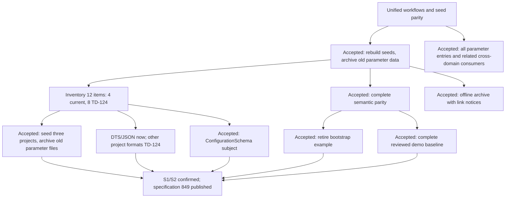

# Parameter workflow unification and seed parity

> Chinese: [Chinese](../../zh-CN/exec-plans/active/2026-09-14-parameter-unification-and-seed-parity.md)

2026-09-16 execution amendment: the [complete #849/#853 todo list](2026-09-16-849-853-closure-todolist.md) records the current order and per-todo user confirmation. The user explicitly replaced this program's prospective three-viewport acceptance with one PC viewport, `1440x900`; all operation and S1/S2 gates remain. Historical viewport results remain historical evidence; T0.6 reconciles older status narratives.

Status: D01–D10 and S1/S2 confirmed; the user's 2026-09-15 format amendment limits this round to DTS/JSON. YAML/TOML/ENV project-source support and eight associated compatibility seeds are tracked as TD-124. Specification #849 remains OPEN and `ready-for-agent`.

Current implementation status (2026-09-16, `main@4010a600f`): ConfigurationSchema slices A–C, reviewed compatibility sources, canonical draft-tray wiring, archive capture and B6 fail-closed completion are delivered. B1 source identity, B4 v4, complete seeds/three-project materialization, eleven consumer families, disposal and full S1/S2 remain open. #867 temporarily restored the legacy read fallback under TD-125, so the four coexistence defects are not all removed today. See the [current reconciliation](2026-09-15-parameter-unification-round-report.md#0-current-reconciliation--2026-09-16-t06) for code, merged PRs, historical/Hosted/target boundaries and migration numbering. The user authorized serial todos with a stop after each; target execution/deployment and concrete deletion still require separate authorization.

## Outcome

All current parameter workflows and their cross-domain consumers use the canonical Parameter definition, Definition revision, Binding and Project value model. Explicit initialization supplies a reviewed, reproducible seed definition set and seed project configurations with documented parity to the previous business seeds. Archived parameter records remain separate from current data.

## Historical evidence baseline (2026-09-14; not current deployment state)

- Source: freshly fetched `origin/main` at `6d72e17cb4c581e7235b181dbbfd45d92f4dee7b`, 2026-09-14. Source inspection is not target acceptance.
- User-supplied read-only server report: 2026-09-14 14:56:02 UTC; database `wiseeff`; running application image reference `b645368e4c6bacc760fe082380c4976526926e19`; API, Web, worker and publication manager share one image ID. All database probes succeeded.
- Target snapshot: 194 old specs, 194 spec versions, 479 old bindings and 629 binding revisions. Atlas has 120 bindings, Aurora 239 and Nebula 120; each project's distinct old definition count is 115. These are observed historical data counts, not seed acceptance targets.
- Canonical snapshot: one release `crel_acme_1`, one definition `pdef_acme_power_iin_max`; zero organization registrations, Bindings and Project values. Online publication is enabled, freeze is off, no publication jobs exist, and the one receipt is `adopted-preexisting`.
- Current repository seed sources differ: 12 product-demo definitions in `src/config/power-management.json`; each of three committed board DTS files has 120 non-structural property occurrences; formal vendor input has 113 definitions across 47 documents. D1 produces 114 definitions only because it retains the bootstrap example. Counts use different identities and must not be equated.
- A pure, non-persisting call to the current vendor importer blocks on two `gpio_int.constraints.cells` inputs (`mt-mt5788.yaml`, `sc8562.yaml`). D1 compilation alone does not establish semantic parity; it omits constraints/examples/default handling.
- Live tracker: [PR #824](https://github.com/tzrea1-Q/WiseEff/pull/824) is OPEN and explicitly partial. Its populated migration is not a prerequisite for the accepted rebuild choice. [Issue #847](https://github.com/tzrea1-Q/WiseEff/issues/847) already owns the definition workspace, authoring/lifecycle UX and governed identity correction; reuse its accepted interfaces and coordinate shared files.

## Accepted decisions

| ID | Decision | Consequence |
| --- | --- | --- |
| D01 | Rebuild canonical parameter data from reviewed seeds. Preserve non-parameter data. Archive old parameter values, drafts and history instead of migrating them into the new workflow. | No requirement to reproduce 479 old bindings or import their history as new writes. Source files, archive access and non-parameter references need explicit treatment before execution. |
| D02 | Include every parameter-management entry and parameter-related cross-domain reference. | Definition administration, project initialization/workbench, edits, drafts, submissions/reviews, history/comparison, import/export, and related debugging/Agent/log/knowledge/reload references are in the acceptance boundary. Unrelated functions in those modules are unchanged. |
| D03 | Preserve the full 12-item compatibility inventory; deliver the four DTS/JSON items this round and defer the other eight with TD-124. | Two JSON and two DTS items receive formal definitions, real sources and complete workflows now. YAML 2, TOML 3 and ENV 3 retain original metadata and project values for the follow-up; do not silently convert them to JSON or expose them as active supported seeds. |
| D04 | Require complete semantic parity with a per-item disposition, not equal database row counts. | Cover names, descriptions/explanations, units, types, constraints, examples/default distinctions, risk and project-specific initial/recommended values. Explicitly exclude structural properties and ambiguity fixtures; document justified historical corrections. |
| D05 | Keep old parameter data only in an offline archive. | Old detail links show that the record was archived and explain the authorized retrieval procedure. They do not return old detail payloads. Cross-domain business records remain preserved; their old references become archival references, never current editable data. |
| D06 | Initialize only Atlas, Aurora and Nebula from the reviewed seed configurations. Preserve other projects with an empty current parameter state for later explicit import. | Old parameter source files leave active configurations and are included in the offline archive. Non-parameter files, such as logs, remain preserved. Rebuild is explicit, never an ordinary startup hook. |
| D07 | Retire the distinct `acme,power` bootstrap example from current selection. | Preserve its identities, release history and activation receipts. Real vendor `huawei,charging_core / iin_max` retains its own identity; never merge it with the sample because the property keys agree. |
| D08 | Current round: real DTS and JSON import, approval-driven writeback and export. YAML/TOML/ENV are future TODO. | This explicit user amendment supersedes the original requirement to deliver all five formats together. Supply real sources/locators for four compatibility items; reject other project-source formats before staging/apply. YAML vendor Catalog metadata remains a valid DTS-definition input. |
| D09 | Add ConfigurationSchema as a formal Catalog subject for software configuration. | Keep Driver/NodeType matching semantics; match an explicit governed configuration-model identifier. Reuse the same definition, revision, registration, Binding and Project value owners; record the extension in ADR-0045. |
| D10 | Complete self-consistent demo DTS baselines for the three built-in projects, preserving business properties and project values. | Give every dangling overlay target explicit, reviewed source identity (the planning count of 24 is disputed; T1.3 reconciles the measured inventory); reuse a formal Driver only with declared contract evidence or author a formal NodeType where justified. Do not persist resolver stubs or infer compatible by name similarity. Label the sources as demos, not real-device firmware. |

The request changes the data source, not existing approval semantics: a draft is pending work, never an already-applied Project value. Ordinary publication does not automatically rewrite project values or their revision pins.

## Design tree and interview frontier



All ten product decisions above are explicit user answers. D10 and the S1/S2 test seams were confirmed on 2026-09-15. The user authorized publication and specification #849 is now published; product interviews and the `/to-spec` checkpoint are closed. The implementation contracts below remain distinguishable from deployed capabilities.

Initial publication record (historical, before the format amendment): one Issue, no child Issues or dependency changes. Its original body was verified at 39,417 characters with SHA-256 `1aebbf1c233ade3a333ad05357e9766b9e0a320269670f9b220e6dade6a2ace8`. The amended current Issue body supersedes its format scope and seed counts. User stories remain numbered for traceability; YAML/TOML/ENV stories now require honest unsupported-format behavior, with native support tracked in TD-124.

Amendment receipt, 2026-09-15: #849 is titled “feat(parameters): 统一新版参数完整流程并重建 DTS/JSON 种子”. Its complete remote body matches the local English specification at 42,330 characters, SHA-256 `e319457c7ef3de68e39c57904ee92da63d508a407d1070c481c2041c9586dc0c`. The seven sections and numbered sets of 62 user stories, 28 implementation decisions and 13 testing decisions are preserved. The GitHub connector updated only title/body after CLI connectivity failed; a fresh read verified unchanged state, labels and assignees. The paired Chinese specification, plans, ADR, planning indexes and TD-124 reflect the same scope. This is documentation/specification evidence only.

The initial inventory lacked compatibility-source locators; the four current DTS/JSON items now have reviewed per-project source files and exact locators, while eight remain TD-124. Source-file existence does not establish JSON semantic ingest/materialization; implement B1 under ADR-0046. `logical-service` still cannot bypass authoritative Driver compatible matching.

## Existing seams and gaps

| Seam | Reuse | Required correction |
| --- | --- | --- |
| Definition content | Catalog Kernel, publication ChangeSet/Candidate/Authorization/installer, vendor import disposition map | Complete supported content conversion; import all accepted seed sources through the same publisher. Do not re-bootstrap the adopted target or create another Catalog writer. |
| Organization and project usage | Registration/placement, Binding and ProjectValue owners, typed protected references | Explicitly register seed subjects and initialize the intended logical-node occurrences and exact source/revision pins. Publishing definitions alone creates no project configuration. |
| Reads | Typed CatalogRuntime and protected project reads | Replace v1 public semantic reads and v2 merged/fallback lists. No current-page fallback to archived parameter data. |
| Draft/review/writeback | Existing workflow state machines, audited transactions and source-aware writeback | Store real Catalog identities in workflow references; create genuine pending drafts; only the existing authorized apply step changes values and corresponding source versions. |
| Import/initialization/history | Existing source parsers, preview UX, file/config-set ownership and historical views | Remove mixed-batch fallback to old apply, cover every selected config set, bind current/history reads to exact new identities, and separate archive results. |
| Cross-domain consumers | Their existing authorization and audit boundaries | Use the same canonical reference/query owners. Comparison contribution files are evidence adapters, not proof that runtime consumers have switched. |

The historical defects were in `server/modules/parameter-bindings/catalogProjectValueRoutes.ts`. Canonical draft/apply paths were changed, but #867 / TD-125 restored the legacy read fallback when the canonical list is empty. T1.4 removes it after the complete canonical writer and consumer gates; historical removal is not current full unification.

Unification does not require moving every workflow table into the `parameter_catalog` schema. Existing workflow storage may remain if its contracts reference true canonical identities and versions. Renaming a legacy spec ID to a canonical field is insufficient.

## Implementation contracts

### C1. One authoritative model and explicit source identity

Extend the closed subject kind to `configuration-schema` and selector kind to `configuration-schema-id`. The identifier is Platform-owned, exact and permanent, subject to the same alias ownership and retirement rules. It is supplied by an explicit import/configuration manifest; a filename, extension, display module, dotted key or uploaded declaration cannot establish its authority. Organization registration and placement are still required. One schema may contain properties stored in multiple supported formats.

ADR-0046 distinguishes DTS node occurrences from configuration instances through `project_parameter_source_occurrences`, keyed at least by organization, project, config set, occurrence kind and instance, with fixed source-file identity and a format locator. Binding uniqueness is `(project_id, source_occurrence_id, definition_id)`; existing DTS bindings are backfilled without re-deriving IDs. Immutable file/config revision pins remain in ProjectValue, not Binding identity. Reuse existing value owners; never merge distinct config sets/instances or introduce parallel software-config value tables.

Affected closed contracts include compiler/installer/runtime matching and alias checks, release capability admission, SQL subject/subtype constraints, Catalog API DTOs/OpenAPI/generated clients, registration/placement, proposal/authoring and browser switches. Add migrations; never edit applied migration 0137 or reinterpret historical release bytes. Old artifacts replay under their original format; an unsupported new artifact fails before activation. Rich definition content must carry documentation/explanation, unit, typed constraints, examples, risk and explicit default provenance. Project initial/recommended values remain project facts. Review #847's final metadata shape before adding fields.

### C2. Deterministic seed input and semantic reconciliation

Produce one reviewed seed manifest and one generated reconciliation report under the existing seed/catalog tooling. Every current-scope input occurrence records `source path + source digest + source locator`, old identity if present, formal subject/selector, property key, allocated stable definition identity, content transformation, and `preserve | transform | merge | exclude` with reason. The eight named TD-124 items instead retain their original source inventory and values with an explicit `defer` disposition; they need no new formal identity or executable source locator this round. Exclusions and deferrals are counted separately; unknown current-scope fields and identities block publication instead of silently disappearing. The controlled publisher, not source ingestion, creates formal definitions.

The complete reconciliation inventory is 125 inputs: 113 vendor definitions plus 12 compatibility items. Current-round delivery is **117 inputs (113 vendor + two JSON + two DTS)**; the other eight have an explicit `defer` disposition linked to TD-124 with original metadata and project values retained. They are not active seeded definitions/bindings this round and their deferred conversion does not block current-scope acceptance. Unknown current-scope fields/identities remain blockers. Board reconciliation may require additional reviewed definitions or source corrections. Each board still has 176 raw occurrences, including 120 business and 56 structural occurrences; the planning snapshot recorded 61 matches and 59 unmatched occurrences, with a disputed 24-label count (see the current reconciliation). D10's accepted complete demo baseline resolves their source identity; stubs are not authoritative NodeTypes. YAML-authored vendor definition documents remain in scope as Catalog metadata, distinct from deferred YAML project-source support.

The report compares description/explanation, module placement intent, unit, value kind/schema, constraints, example values, default provenance, risk, and each project's initial/recommended value. Parse old numeric strings into exact intended typed values; do not copy relative labels such as “yesterday” as event timestamps. DTS string-list and cell-array seeds retain row/column meaning; their historical `0 - 1` range must be explicitly corrected, not applied to the whole array. `gpio_int` cell descriptions and shape from both blocked vendor inputs must survive a supported typed conversion; do not simply drop `cells` to make the import pass. No example becomes a default implicitly.

Emit a complete successor of the **actual target predecessor**, preserving every published identity and historical release/receipt. Retire acme subject/alias/definition explicitly according to the existing lifecycle contract. An unchanged replay creates no new identities, revisions or receipts. Stale predecessor, unresolved disposition, unsupported value schema or incomplete successor fails before writes. Use the ADR-0043 candidate/authorization/manager/installer path; D1 output or direct SQL is not a second publication route.

### C3. Complete DTS/JSON source handling; defer other formats

Keep the existing file/candidate/version/config-set service as owner. Complete its DTS CST/JSON parsing, indexing and writeback; add no YAML/TOML/ENV project-source adapter or parser dependency this round. Retain the existing YAML reader for vendor Catalog definition metadata and its publication path. Project-source uploads/imports of deferred formats are explicitly unsupported and fail before staging/apply, without legacy fallback or implicit JSON conversion. Configuration-model identity stays separate from extension.

Each supported adapter must parse typed occurrences, locate the exact occurrence, validate a proposed value, produce a candidate patch, reparse and prove the intended semantic delta, then export the committed original format. Locators use correctly escaped typed path segments; literal dots/slashes and array indices cannot collide. Unsupported syntax, duplicate/ambiguous JSON keys and missing/non-unique DTS locators produce pre-write diagnostics. Preserve comments/unrelated text where lossless editing is supported; necessary serialization changes appear in the source diff and normal source-review flow. Current-scope seed syntax must be supported. YAML/TOML/ENV-specific parsing and fidelity tests belong to TD-124; this round tests their explicit refusal.

Create real files and explicit locator mappings for the four current compatibility inputs: JSON `charge_voltage_limit_mv`, `battery_temp_target_c`; DTS `dts_fast_charge_profile_matrix`, `battery_thermal_derate_curve`. JSON quoted dotted keys remain literal unless a reviewed correction says otherwise; the two JSON settings use ConfigurationSchema. DTS fragments require complete authored demo-node ownership and explicit underscore-name to hyphenated-property mapping. Details expose source/format, formal subject, current/recommended values and exact revision. Source-required `skipped:true` remains a blocker. Preserve the other eight items in TD-124 inventory without creating active seed instances or converting their formats.

### C4. A real pending-to-applied workflow

At the existing workflow boundary, pending changes carry true `bindingId`, `definitionId`, `definitionRevisionId`, base current-value identity, source/config revision and selected config-set identity. A legacy spec ID in a renamed field is rejected. Workflow tables may remain in `public`; their physical schema name does not confer data authority.

1. Edit/validate creates or updates a **draft**, leaving current ProjectValue, active file version and history tip unchanged.
2. Submit freezes the selected changes, base pins, reason and role-eligible assignees; preserve withdrawal, revision, rejection and approval rules. Node enablement remains a distinct structural intent, never a parameter definition.
3. Authorized apply re-resolves protected references, verifies exact base versions and validates the complete source patch. A changed value/file/catalog semantic pin requires recomputation and review; stale retries never force overwrite.
4. Use the existing source-store strategy: prepare and verify immutable source bytes first; commit ProjectValue/history, file/config version references, workflow completion and audit in the owned PostgreSQL transaction. Failed database commit may leave an unreferenced immutable blob for safe cleanup; it must not expose a changed current value or file. Do not claim a distributed transaction across PostgreSQL and object storage.
5. Idempotent replay returns the same logical outcome. Source failure, missing source, audit failure or authorization denial cannot produce a success receipt or partial state **inside one existing authorized apply unit**. Existing batch review remains a sequence of separately reviewed change requests and may have per-item successes/failures; preserve those results instead of promising a new all-or-nothing submission-round transaction. Expose retryable/pending failure honestly.

Remove the direct-save “draft” branch, empty-Catalog fallback, mixed old/new listing and whole-batch old-apply fallback. Import preview pins every selected source/config set; upload does not silently activate a first/default config set. User imports of unknown properties produce observations/governed authoring tasks, never runtime-created definitions.

### C5. Registration and project initialization

Publish definitions first, then register the required subjects in each seed project's existing organization with explicit placement intent. Use stable project identifiers from the repository seed configuration, verifying ownership; do not find projects solely by mutable display name. If an expected project/organization is missing or ambiguous, stop for a reviewed manifest change instead of recreating unrelated business data.

Initialize Atlas/Aurora/Nebula from reviewed source versions through the existing initialization-review and canonical ingest owners. The operator's rebuild authorization is recorded as the explicit initialization authorization; an unattended job cannot invent a human approval. Reuse the product's actual approval capability and actor separation. Other projects enter the existing uninitialized/empty parameter state without changing their unrelated business status, memberships or nodes. Reset cached pending drafts and revoke/rescind parameter approvals/jobs tied to the archived epoch so a stale worker cannot resurrect old writes.

Seed initialization is a separately invoked, resumable operation pinned to a seed digest and scope. Same completed run is a no-op. Re-running ordinary startup, `db:seed:all`, application upgrade or definition publication must neither reseed nor overwrite user edits. A deliberate later rebuild requires a new archive/recovery point and reviewed target plan.

### C6. Complete consumer inventory and retirement

Inventory runtime reads, writes and references across all eleven existing consumer families (`CGH`, `TOP`, `PRJ`, `FIL`, `AGT`, `LOG`, `DBG`, `DTS`, `KNW`, `MOD`, `OPS`). Every call site has an owner and a final disposition: canonical current, exact pinned canonical history, or authorized archived notice. Include dashboard counts/search, exports, jobs, scripts, mock ports and tests; do not treat comparison adapters as switched runtime consumers.

Debugging keeps device observations separate from ProjectValue; promotion stages a draft and still requires human approval. Replace placeholder canonical references only when exact binding/source pins are proven. DTS reload handoff, candidate selection, verification, promotion and residue use those pins; non-DTS software files do not become device overlays. Logs/Agent/knowledge query the canonical protected read owner. Historical narrative and audit events remain historical evidence, with old drill-down links resolved as archived; they cannot drive new parameter writes or repopulate current indexes.

For authorized old identities, reuse exact source-kind/legacy-ID/owner lookup to return `410`, `legacy-id-archived`, non-retryable. Wrong scope or absent identity stays `404`. The notice gives the authorized support procedure, without old payload, archive ID/object address, automatic new-definition redirect or restore action. Disable old parameter read/write permissions for production roles after rebuilding, and verify HTTP, jobs and direct-role probes; do not blanket-revoke unrelated `public` schema access or cascade-delete foreign-key dependents.

## Work packages and dependency order

These are local planning IDs, not published Issues or changes to the frozen Wayfinder graph. All implementation packages are **not started**. Each is a bounded PR; split further at a stable seam if needed, never combine the whole program into one PR.

| Package | Dependency | Main ownership and concrete output | Exit evidence |
| --- | --- | --- | --- |
| PU-00: freeze input and contracts | Published specification with confirmed test seams | Seed source/identity/field disposition manifest; ADR-0045; exact consumer/foreign-key inventory; #847 interface ownership and versioned contract delta | No unexplained seed omission or undefined identity; exact proposed counts derived; reviewable archive allowlist and preservation checks |
| PU-01: ConfigurationSchema and source identity | PU-00 | `parameter-catalog-contract`, `catalog-kernel`, publication contracts, Binding source identity, append-only migrations and generated API artifacts | Real PostgreSQL three-kind constraints/ownership/registration; old release replay; invalid capability/alias reassignment blocked; build |
| PU-02: DTS/JSON sources and format files | PU-01 | `parameter-files`, source/config manifests; real files/locators for four current compatibility items | Both formats round-trip; exact source pins, ambiguity/source-failure preservation, no skipped writeback; other project formats explicitly rejected |
| PU-03: canonical workflow vertical path | PU-01; integrate PU-02 before DTS/JSON exit | `parameters`, `parameter-drafts`, `parameter-bindings`, topology/history, HTTP/mock ports | One DTS and one software-config path through real draft → assigned review → source/value/history commit → reload; stale/rejected/audit-failure negatives |
| PU-04: full seed release and initialization | PU-02 + PU-03 | Seed converters, publication successor manifest, organization registration, initialization owner | Every accepted source/field/value reconciled; acme retired with historical receipts retained; all three projects exact manifest equality; repeat run no reset |
| PU-05: complete parameter UI | PU-02 + PU-03; #847 integrated or explicit handoff | `/parameters`, definition workspace, review, initialization/import, project workbench and comparison/export | DTS/JSON, module navigation/search/pagination, revision details and same-source counts; full browser operation matrix at three viewports |
| PU-06: cross-domain references | PU-03; integrate PU-04 | Agent, logs, knowledge, debugging, DTS reload and their scoped clients | All eleven families accounted for; canonical reads/writes and archive notices; real bound reload cases; no stale approvals or legacy fallback |
| PU-07: archive-rebuild controller and retirement | PU-04 + PU-05 + PU-06 | Existing self-hosted controller/recovery/archive/legacy mapping owners, bounded rebuild profile | Real quiescence, verified offline archive and whole-state restore drill; production-role denial; preserved non-parameter IDs/content; resumed phases idempotent |
| PU-08: sealed rehearsal and target handoff | PU-07 | Exact-candidate integrated acceptance and operator runbook/text-summary procedure | Representative populated rehearsal + post-restart complete-flow proof; then separately authorized target run and target evidence |

PU-02 and PU-03 can develop independently after PU-01 with separate path ownership; PU-05 and PU-06 can follow in parallel after their seams settle. Shared identity/workflow files have one owner, and merges are serial with focused post-rebase checks. #847 owns the definition workspace restoration: this plan adds its ConfigurationSchema/rich-content compatibility after that interface is integrated, rather than creating a competing workspace. PR #824 is not silently inherited. A pilot vertical path proves the seam early but cannot be released as this plan's completed scope.

## Controlled archive-rebuild procedure

Implement one explicit `archive-rebuild` profile within the existing operational owners, not a second generic migration framework. The following interface is **proposed, not executable today**: `plan → apply → status/resume → verify`, with recovery delegated to the existing verified whole-state recovery mechanism. Every phase has a durable run ID and expected input/output digest; failed checks leave maintenance isolation in place.

| Phase | Required action and stop condition |
| --- | --- |
| Plan, online/read-only | Resolve target image/source SHA, database identity, current Catalog release/digest, seed digest, org/project allowlist, exact affected rows/files/jobs, disk capacity and approved archive destination. Enumerate all references, not samples. Emit a sanitized text impact summary. Any drift invalidates the plan. |
| Prepare | Prebuild compatible API/Web/worker/publication-manager images; rehearse the same manifest against a representative isolated copy; prove whole-state restoration. No customer data destruction or seed writes during preparation. |
| Quiesce | Use real proxy/write fencing, worker/queue drain and publication freeze. Read back actual service/queue/lease state; persisted booleans alone are not proof. Capture writes that could race via Agent, import, review, sync, debug promotion and reload. |
| Recovery and archive | Capture verified PostgreSQL/object-store/Redis recovery state; separately export the parameter allowlist and referenced source versions to operator-controlled encrypted offline archive with counts/digests and a tested retrieval procedure. Record non-parameter preservation witnesses. An inventory/count dump is not a backup. |
| Migrate under isolation | After recovery/archive verification and before dependent reference conversion or publication, run the exact candidate's append-only migrations with the bounded migration principal. Verify migration checksums, subject/source-identity constraints, role privileges and prior-release replay. A partial failure keeps services isolated and the run in recovery-required or a proven resumable phase; do not rely on an ordinary API startup to perform the cutover migration. |
| Retire old current state | Reconcile archive manifests and typed old-ID notices; cancel/rescind only affected pending parameter operations; detach old parameter sources from active configurations. Online business storage retains only reviewed minimal identity/reference stubs: move old parameter-owned payloads and exclusively parameter-owned source bytes out of online business storage after verified archive reconciliation. Preserved cross-domain historical payloads and shared non-parameter objects are explicit exceptions, rendered through archived resolution. Verify zero unauthorized online old-parameter payload residue, not merely revoked SELECT permissions. No `TRUNCATE CASCADE`, global volume reset or unrelated record deletion. |
| Publish and seed | Current authorization/installer refuse any publication while frozen. Keep public traffic and every other writer isolated; verify exclusive controller ownership and quarantine non-target jobs. Through the existing authorized freeze-control entry, temporarily unfreeze publication, authorize/run only the pinned target candidate, verify its actual activation receipt and refreeze before leaving this phase; failure also refreezes. If exclusive execution cannot be enforced, stop instead of bypassing the freeze check. Register subjects and run the reviewed three-project initialization. Existing acme history remains; no `new-empty` bootstrap of the adopted Catalog. |
| Verify before traffic | Compare canonical data to the seed manifest, every old row to its archive disposition, non-parameter records/files to preservation witnesses, and every consumer to its canonical/archive contract. Exercise DTS/JSON approved writeback and restart reads in an isolated rehearsal; on target run the agreed non-destructive smoke and explicit reviewable write probe. Missing/failed probes are not zero differences. |
| Resume | Open traffic only after all required evidence binds the same run/candidate/seed/release. Confirm old roles/routes cannot read or resurrect old current data, then retain run receipt and offline retrieval instructions. Restore ordinary publication availability last through its authorized control. Ordinary upgrades leave the rebuilt values untouched. |

Restore before irreversible progression according to the phase journal. After new writes or traffic, a Catalog pointer flip or partial database-only restore is forbidden: use a deterministic reviewed forward repair or restore the matching application + PostgreSQL + object-store + Redis recovery point, with explicit handling of post-cutover writes. Restore into isolation and verify before reopening traffic. A recoverable procedure does not promise zero data loss after accepting new writes.

The user's offline-only choice is a **deployment-specific alternative** to the ordinary legacy-read sunset, which normally requires two production releases, 90 days and additional evidence. It also replaces the old/new-value equivalence oracle of populated migration with three separate oracles: seed parity, archive completeness and non-parameter preservation. Record this scope in ADR-0045 and the API-transition/cutover documents; do not mark normal S13/P13 or OP-09 complete, change the R0–R10 classification facts, or waive recovery/authentication/publication checks. Other deployments retain their existing migration and sunset contract.

Known implementation gaps: `catalog-cutover/interface.ts` declares P11–P16 unavailable; the current P2 orchestration response does not itself enforce writer/queue/proxy quiescence; `captureInventoryDump` is not a cross-store recovery point. The existing archive adapter also admits only R classes whose fixed disposition is archived. Reuse its encryption/checksum/storage/authorized lookup mechanisms, but add a reviewed rebuild disposition contract instead of relabeling all old rows into convenient R classes. These are PU-07 deliverables, not existing readiness.

The operator can invoke the eventual root-resolving command from either repository root or `ops/self-hosted`. Default diagnostics/status output is pasteable text with no credentials, full old values or object URLs; actual backup/archive bytes remain secured on the host. A target run is never requested until its exact affected inventory, downtime/recovery procedure and immutable candidate are reviewable.

## Verification matrix and evidence ownership

The user confirmed these two high-level testing seams on 2026-09-15; they are published in specification #849:

- **S1: existing production parameter/API boundary.** Real authenticated API composition, dedicated PostgreSQL, source-object persistence and actual publication manager/installer; browsers exercise the same complete definition → registration/initialization → draft/review → source/value/history workflow and cross-domain references. No new testing facade.
- **S2: existing self-hosted operator boundary extended with archive-rebuild.** A representative isolated PostgreSQL/object-store/Redis deployment proves plan/apply/status/continuation/verification/recovery, actual fencing, offline archive and non-parameter preservation. This operational seam is necessary because API acceptance alone cannot verify host backups or whole-state restore.

Existing IDs in both the requirement and operation coverage maps are reused. The following are required assertions to add or rerun on the final canonical path; listed files are entry points, **not results from this planning session**.

| Behavior | Existing requirement/operation IDs | Acceptance entry and additional assertion |
| --- | --- | --- |
| Definition workspace and same-source reads | `PARAM-ADMIN-001`, `PARAM-HOME-001`, #847's final operation map | `parameters.acceptance.spec.ts`, `parameter-home.acceptance.spec.ts`, #847's owned spec; new kind and complete paginated seed membership |
| Draft, submit, review, reject, persist | `PARAM-HAPPY-001`, `PARAM-REASON-001`, `PARAM-ASSIGNEE-001/002/003`, `PARAM-REJECT-001`, `PARAM-DRAFT-EDIT-001`, `PARAM-DRAFT-REMOVE-001` | `parameter-topology.acceptance.spec.ts`, `parameters-negative.acceptance.spec.ts`; real canonical IDs, draft does not mutate current, both DTS and JSON |
| Initialization | `PARAM-INIT-WIZARD/EMPTY/REVIEW/REJECT/LOCK-001` | Existing entries are future; add a real API/PG initialization path to `parameters.acceptance.spec.ts` and remove future status only after evidence |
| Source/configuration/import/export | `PARAM-FILE-SYNC-001`, `PARAM-FILE-RESOLVE-001`, `PARAM-DTS-EDIT-002`, `PARAM-IMPORT-DTS-FULL-001`, `PARAM-IMPORT-REVIEW-META-001`, `PARAM-ADMIN-002`, `PROJ-CONFIG-READ/SOURCE/INSPECT/EDIT/ACTIVATE/OPS/CONFLICT/BASELINE-001` | `parameter-files.acceptance.spec.ts`, `dts-structured.acceptance.spec.ts`, `parameter-import-wizard.acceptance.spec.ts`, `project-configuration-workbench.acceptance.spec.ts`; selected config set, source-version CAS, DTS/JSON export/reimport, pinned history |
| Agent and other read consumers | `XIAOZE-PERCEPTION-001`, `XIAOZE-ACTION-APPROVE/EDITEDARGS/REJECT/RESUME/AUTHZ-001`, `LOG-HAPPY-001`, `KB-XREF-001` | `xiaoze-perception.acceptance.spec.ts`, `xiaoze-action-semantic.acceptance.spec.ts`, `log-analysis.acceptance.spec.ts`, `knowledge.acceptance.spec.ts`; same canonical references, approval fencing and archived old links |
| Debug/reload | `DEBUG-SIM/PERM/ADMIN-001`, `DTS-RELOAD-DEPLOY/KERNEL/VERIFY/RESIDUE/HANDOFF/PROMOTE-001` | `debugging-simulator.acceptance.spec.ts`, `debugging-admin.acceptance.spec.ts`, `dts-reload-*.acceptance.spec.ts`; replace handoff/promote `test.skip(true)` placeholders, add actual bound verified/contradicted paths; unbound/unverifiable is not proof of a successful bound path |
| Legacy notices and tenant isolation | `PCAT-LEGACY-LINK-001` | `parameter-catalog-negative.acceptance.spec.ts`; visit the real old URL, show archived procedure only, unauthorized remains 404; no archive path/payload or implicit redirect |

PU-00 adds any genuinely new format/model/rebuild requirement and operation IDs to both coverage maps before implementation; do not invent “automated” evidence for them. Keep `npm run acceptance:browser` / `npm run acceptance:evidence` operation evidence generation. Device simulator evidence and target-server API evidence do not establish real-hardware calibration/deployment readiness.

Representative existing commands, run from repository root with a dedicated owned PostgreSQL and API-mode browser environment:

```bash
npm run test:server -- server/modules/parameter-bindings/catalogProjectValueSync.integration.test.ts
npm run test:server -- server/modules/parameters/serviceReviewWorkflow.integration.test.ts
npm run test:server -- server/modules/parameter-files/writebackService.test.ts
npm run test:server -- server/modules/parameter-catalog-api/legacy/lookup.integration.test.ts
npm run acceptance:e2e -- e2e/acceptance/parameter-topology.acceptance.spec.ts
npm run acceptance:e2e -- e2e/acceptance/parameter-catalog-negative.acceptance.spec.ts
npm run parameter-catalog-boundaries:check
npm run build
npm run selfhost:check
npm run docs:check
git diff --check
```

Each package adds only the missing focused checks and runs the relevant files from the table, not just these representative commands. The integration owner runs the complete agreed affected set once at the sealed candidate. Repeat only after relevant changes/failures. For frontend changes, use `playwright-cli` snapshot and screenshot at PC 1440×900 only and record actual interaction/console/network evidence; missing browser tooling is a reported blocker. Store exact SHA, schema/seed/release digests, environment/role, commands, passed/failed/skipped counts and artifact paths in the delivery record. No plan is complete with unresolved seed rows, skipped critical scenarios, empty registrations, legacy fallback, unavailable target probes or unverified restoration.

## Acceptance obligations

### Seed inventory carried into PU-00

Source: `src/config/power-management.json`, `parameterLibrary`. This is the full historical/future inventory, not a promise to seed all 12 now: indexes 1, 2, 9 and 10 are current-round DTS/JSON; indexes 0, 3, 4, 5, 6, 7, 8 and 11 are TD-124 TODO. Values are initial/recommended in Atlas, Aurora, Nebula order; preserve them for future implementation rather than inventing defaults. Every item retains its exact old ID in the disposition manifest.

| Index / old ID | Property key / format | Atlas | Aurora | Nebula |
| --- | --- | --- | --- | --- |
| 0 / `fast-charge-current` | `fast_charge_current_limit_ma` / YAML number (TD-124 TODO) | 3000 / 3100 | 3850 / 3200 | 4200 / 3900 |
| 1 / `charge-voltage-limit` | `charge_voltage_limit_mv` / JSON number | 4300 / 4310 | 4350 / 4320 | 4380 / 4340 |
| 2 / `battery-temp-target` | `battery_temp_target_c` / JSON number | 36 / 35 | 38 / 35 | 40 / 37 |
| 3 / `soc-smoothing` | `soc_estimation_smoothing` / TOML decimal (TD-124 TODO) | 0.90 / 0.88 | 0.82 / 0.88 | 0.76 / 0.84 |
| 4 / `battery-health-reserve` | `battery_health_reserve_pct` / ENV number (TD-124 TODO) | 15 / 14 | 12 / 14 | 10 / 13 |
| 5 / `usb-pd-profile` | `usb_pd_profile_limit_w` / ENV number (TD-124 TODO) | 25 / 27 | 33 / 33 | 30 / 33 |
| 6 / `wireless-thermal-derate` | `wireless_charge_thermal_derate_pct` / YAML number (TD-124 TODO) | 16 / 20 | 18 / 24 | 22 / 26 |
| 7 / `low-battery-shutdown` | `low_battery_shutdown_soc` / TOML decimal (TD-124 TODO) | 3.8 / 3.5 | 3.2 / 3.0 | 2.5 / 3.0 |
| 8 / `pmic-boost-voltage` | `pmic_boost_voltage_mv` / ENV number (TD-124 TODO) | 5000 / 5000 | 5200 / 5100 | 5450 / 5300 |
| 9 / `dts-fast-charge-profile-matrix` | `dts_fast_charge_profile_matrix` / DTS string-list | J9(atlas) | J9(aurora) | J9(nebula) |
| 10 / `dts-battery-thermal-derate-curve` | `battery_thermal_derate_curve` / DTS cell array | J10(atlas) | J10(aurora) | J10(nebula) |
| 11 / `standby-drain-limit` | `standby_drain_limit_ma` / TOML number (TD-124 TODO) | 14 / 14 | 18 / 15 | 28 / 22 |

`J9(project)` and `J10(project)` refer exactly to `/parameterLibrary/{9|10}/values/{project}/{currentValue|recommendedValue}` in that JSON source. Each project's two values agree, but Nebula differs from the other projects. The string-list contains 3 rows × 5 columns and the cell array 3 × 4 **as example contents**; retain column meaning without turning observed row count into a governed fixed-row constraint (ADR-0016). The matrix's format example includes a header row absent from configured values: do not insert that header into the source value.

The planning snapshot's 59 unmatched business occurrences per board are grouped below by observed `&label`, not asserted subject identity. `server/modules/dts/resolver.ts` synthesizes unresolved labels as node names; `danglingAnchorStub.ts` explicitly disallows treating those stubs as persistent business nodes.

| Observed target | Property keys requiring source identity evidence |
| --- | --- |
| `battery_cccv` | `battery_tbl` |
| `battery_charge_balance` | `unbalance_th` |
| `battery_ocv` | `ocv_table` |
| `battery_temp_fitting` | `btf_temp_lth`, `fitting_mode`, `replace_sensor`, `temp_para` |
| `boost_5v` | `gpio_5v_boost` |
| `btb_check` | `vol_check_para` |
| `charge_mode_test` | `test_para` |
| `charging_core` | `iin_max`, `ichg_max`, `iterm_table`, `jeita_table` |
| `direct_charge_comp` | `vbat_comp_ic_para` |
| `direct_charge_ic` | `ic_para1`, `mode_para` |
| `direct_charge_turbo` | `time_para01`, `time_para_group` |
| `direct_charger` | `use_5A`, `volt_para`, `volt_para1`, `bat_para`, `stage_need_to_jump`, `temp_para`, `resist_para` |
| `fm1230` | `onewire-gpio`, `battct_id_gpio-supply`, `ow_reset_start_delay`, `ow_read_end_delay` |
| `fm1230_1` | `onewire-gpio`, `battct_id_gpio-supply`, `ic_index` |
| `hisi_bci_battery` | `battery_design_fcc`, `battery_board_type`, `vth_correct_para`, `vth_correct_para_low_temp` |
| `hisi_vbat_drop_protect` | `vbat_drop_vol_mv` |
| `hisi_vbat_drop_protect_v2` | `vbat_drop_vol_mv` |
| `huawei_batt_identify` | `gpios`, `id_voltage_gpiov` |
| `huawei_batt_info` | `sn-check-type` |
| `huawei_charger` | `weak_source_sleep_enabled`, `charge_done_sleep_enabled`, `support_new_pd_process`, `recharge_para` |
| `multi_btb_temp` | `sensor-names` |
| `t91407` | `onewire-gpio`, `battct_id_gpio-supply` |
| `wireless_charger` | `pmax`, `trx_plim`, `sc_err_tx`, `rx_mode_type_para`, `rx_mode_para` |
| `wireless_sc` | `init_para_col`, `init_para`, `volt_para00`, `volt_para01`, `bat_para` |

The planning-time read-only matcher found 61 matchable occurrences (25 Driver and 36 NodeType, 56 definitions). The later implementation added `resolveObservedSubject` and the NodeType fallback; do not redo that fix. Full reviewed board identities, source corrections and exact materialization still need T1.3 evidence.

Retaining each board's 120 business occurrences plus one instance of each of the four current DTS/JSON compatibility items gives **124 Bindings per project, 372 across three projects**. Generate and compare exact identity sets, never `count >= 372`. The former 132/396 target included eight now-deferred items and is superseded. Final definition count follows reviewed source identities: 117 current inputs, eight deferred inputs and retained acme history are distinct counts. Aurora `hl7603@77` and `@75` remain distinct valued instances. PU-06 inventories the separate debugging seed references without promoting device observations into definitions.

### TD-124: deferred project formats

Owner: Parameters / source files. Status: Open, explicitly outside this round and not an acceptance blocker. Later implement native YAML/TOML/ENV import, exact locators, draft/review/writeback, export/reimport and source-fidelity/browser checks, then activate the eight preserved inventory items. YAML covers `fast_charge_current_limit_ma` and `wireless_charge_thermal_derate_pct`; TOML covers `soc_estimation_smoothing`, `low_battery_shutdown_soc`, `standby_drain_limit_ma`; ENV covers `battery_health_reserve_pct`, `usb_pd_profile_limit_w`, `pmic_boost_voltage_mv`. Do not convert these to JSON to claim completion. Record the follow-up in the bilingual technical debt tracker; assign a later bounded implementation without adding child Issues/dependency edges in this amendment.

### Preservation and completion assertions

- Every accepted seed item has a disposition keyed by formal subject and property; multiple node occurrences remain separate Bindings. A same-name or same-property-key match alone is not identity equivalence.
- Preserve source-derived constraints, examples/default distinctions and each seed project's configured values according to the accepted parity policy. Structural DTS properties and deliberate ambiguity fixtures never become business definitions to match an old row count.
- Empty or missing canonical data yields an honest empty/error state, never a successful legacy fallback. No archived record appears as editable current data.
- Draft creation leaves current value/source unchanged; submission, withdrawal, rejection, approval/application and stale-version conflicts obey the existing product workflow with real canonical pins and the database/object-store boundary in C4.
- Enumerate SQL foreign keys/triggers/views and owner-known embedded references in JSONB, Agent checkpoints/tool arguments, log recommendations, audit metadata and URLs. Preserve original non-parameter history payloads; attach archival resolution rather than bulk replacing old IDs with same-name new IDs. Require zero dangling foreign keys, zero cascaded non-parameter deletion and zero unclassified references. `0111_knowledge_parameter_references.sql` includes restrictive deletion constraints; emptying old tables without this inventory is invalid.
- Archive old source files and all their versions, config membership/baselines, checksums and reference graph. Reverse-check shared objects for non-parameter use; never remove them solely by a directory prefix. Compare preserved IDs, fields and relationships, not only counts. Explicitly assign archive key custody, retention and offline retrieval verification; no automatic archive deletion is authorized.
- Target evidence must show nonzero expected seed registrations/Bindings/ProjectValues, consistent reads across all selected surfaces and persistence after restart. Healthy containers and one definition are insufficient.
- Frontend work requires snapshots/screenshots and actual interactions at PC 1440x900 only, with console/network checks. Dedicated PostgreSQL, local, browser, Hosted and target proof remain distinct.

## Git & PR Workflow

Planning Scratch branch: `codex/parameter-unification-plan`; worktree `/Users/tzrea1/Develop/WiseEff-worktrees/parameter-unification-plan-20260914`; base `6d72e17cb4c581e7235b181dbbfd45d92f4dee7b`. Root-to-cwd discovery checked `AGENTS.override.md` (absent) and selected `AGENTS.md`; global/user guidance applies separately. The original checkout's unrelated `feat/846-full-node-catalog-transfer` edits are preserved.

The original documentation/publication authorization is historical; #849 was published. The user now confirmed serial execution of the closure checklist with a stop after each todo. The coordinator owns branch integration and independent reviews; workers do not publish or merge PRs. This does not expand target/deployment/deletion authority, absorb partial #824 or rewrite the frozen Wayfinder graph.

## Documentation Impact Matrix

| Area | Action | Paths and planned treatment |
| --- | --- | --- |
| Repository maps | Review | `AGENTS.md`, `ARCHITECTURE.md`; keep the maps short. |
| Planning | Update | This plan and its Chinese pair; `docs/PLANS.md`, `docs/zh-CN/PLANS.md`, and both `docs/exec-plans/tech-debt-tracker.md` / `docs/zh-CN/exec-plans/tech-debt-tracker.md` for TD-124. |
| Product specs | Review | `docs/product-specs/product-spec.md`, `docs/product-specs/prototype-functional-spec.md` and their Chinese companions; retain existing workflow semantics. |
| Architecture/domain | Update | `CONTEXT.md`, `docs/design-docs/domain-model.md`, `docs/zh-CN/design-docs/domain-model.md`; `docs/adr/0045-configuration-schema-subject-and-seed-rebuild.md` and its Chinese design-doc companion; `docs/design-docs/parameter-catalog-api-transition.md`, `docs/design-docs/parameter-catalog-cutover-archive-rollback.md` and Chinese companions. Accepted target extension and bounded rebuild exception are cross-linked; ADR-0040/0041/0042/0043 historical text is preserved. |
| Quality/testing | Review | `docs/developer/verification-matrix.md`, `docs/developer/browser-acceptance-coverage-map.md`, `docs/developer/user-operation-coverage-matrix.md` and Chinese companions; current acceptance covers DTS/JSON plus explicit refusal of deferred formats. |
| Operations | Review | `ops/self-hosted/upgrade.md`, `ops/self-hosted/upgrade.zh-CN.md`, `ops/self-hosted/catalog-publication.md`, `ops/self-hosted/catalog-publication.zh-CN.md`; replace bootstrap assumptions with the observed adopted target. |
| Security/governance | Review | `docs/SECURITY.md`, `docs/zh-CN/SECURITY.md`, `docs/agents/agent-delivery-protocol.md`; preserve authorization/audit and scoped archive access. |
| Frontend/design | Review | `docs/FRONTEND.md`, `docs/design-docs/ui-design-system.md` and Chinese companions; coordinate #847 instead of duplicating its workspace redesign. |
| Generated artifacts | No change | No generated schema/OpenAPI/client edits during planning; implementation generates them through existing commands when contracts change. |
| References | Review | `docs/references/parameter-catalog-contract-inventory.md`, `docs/references/legacy-parameter-row-classification.md`; record any accepted replacement scope explicitly. |

## Documentation Update Gate

D01–D10, the implementation contracts, work packages and acceptance commands are recorded in both languages. S1/S2 confirmation and the verified Issue URL/label/body are recorded; the product interview is closed. Run `npm run docs:check` plus `git diff --check` for maintained documentation changes. Before implementation completion, every Update/Review row needs updated documentation or evidence for no change. Specification publication or a passed documentation check does not authorize target execution or establish runtime readiness.
