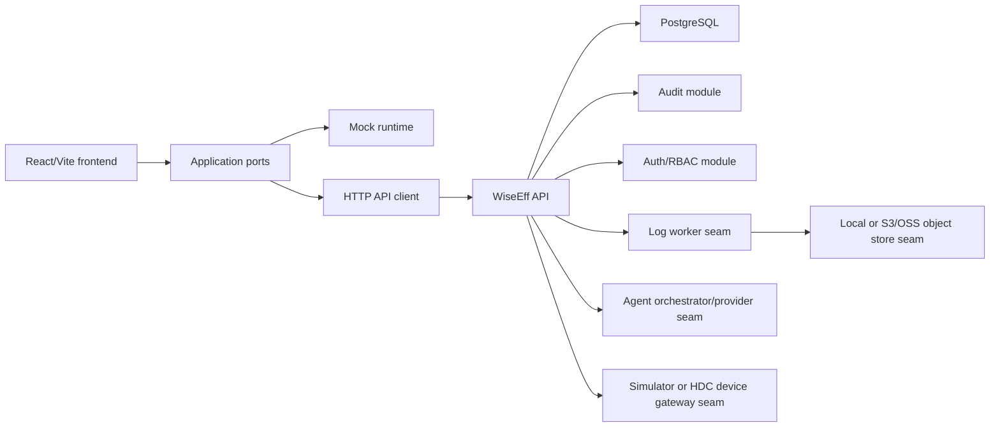

# WiseEff M5.1 Documentation Governance And Pilot Evidence Plan

> **For agentic workers:** REQUIRED SUB-SKILL: Use `superpowers:subagent-driven-development` (recommended) or `superpowers:executing-plans` to implement this plan task-by-task. Steps use checkbox (`- [ ]`) syntax for tracking. Each behavior-changing implementation task must follow `superpowers:test-driven-development`; documentation-only steps must still define an expected diff and verification command before editing.

**Goal:** Close the M5 documentation/evidence gap, update every key WiseEff document to match the merged M0-M5 implementation, and make documentation governance a mandatory rule for all future execution plans.

**Architecture:** Treat documentation as a governed product surface, not a cleanup artifact. The plan adds a durable documentation impact matrix to future plans, a lightweight repository check that rejects active plans without the matrix, and a one-time audit/update pass across architecture, product, security, reliability, operations, frontend, plans, generated artifacts, and runbooks.

**Tech Stack:** Markdown docs, TypeScript/tsx npm scripts, Vitest for the governance checker, GitHub PR workflow, existing `docs/exec-plans/` plan lifecycle.

---

## Scope Boundary

This M5.1 plan includes:

- Expanding document updates from a few release notes to all key WiseEff knowledge-base documents.
- Moving completed M5 execution artifacts out of active planning once the documentation update is complete.
- Updating stale architecture/status language after M5 has merged.
- Recording GitHub PR #39 merge and CI evidence in the appropriate release/evidence docs.
- Creating a mandatory documentation governance rule for future plans.
- Adding a mechanical `docs:check` gate so future active implementation plans must include documentation impact metadata.

This M5.1 plan does not include:

- Running the external staging pilot itself.
- Marking device-lab, backup/restore, or live API smoke evidence complete unless those checks are actually run in the target environment.
- Reworking the product architecture beyond correcting documentation drift.
- Replacing the current M5 smoke, OpenAPI, auth, storage, gateway, Agent, or worker implementations.

## Documentation Governance Rule To Solidify

Every future non-trivial development plan must include a section named exactly:

```markdown
## Documentation Impact Matrix
```

The matrix must list every documentation category below and mark each as `Update`, `Review`, or `No change`, with exact file paths:

| Category | Required Files To Consider |
| --- | --- |
| Repository maps | `AGENTS.md`, `README.md`, `ARCHITECTURE.md`, `docs/README.md` |
| Planning | `docs/PLANS.md`, `docs/exec-plans/active/development-roadmap.md`, the active plan file, `docs/exec-plans/tech-debt-tracker.md` |
| Product | `docs/product-specs/index.md`, `docs/product-specs/product-spec.md`, `docs/product-specs/prototype-functional-spec.md`, `docs/product-specs/mvp-scope.md`, `docs/product-specs/new-user-onboarding.md` |
| Architecture | `docs/design-docs/index.md`, `docs/design-docs/full-stack-architecture.md`, `docs/design-docs/domain-model.md`, `docs/design-docs/api-contract.md`, `docs/design-docs/deployment-operations.md` |
| Quality and operations | `docs/QUALITY_SCORE.md`, `docs/design-docs/testing-strategy.md`, `docs/RELIABILITY.md`, `docs/runbooks/*` |
| Security and governance | `docs/SECURITY.md`, `docs/design-docs/security-governance.md` |
| Frontend and design | `docs/FRONTEND.md`, `docs/DESIGN.md`, relevant dated design docs |
| Generated artifacts | `docs/generated/db-schema.md`, `docs/generated/openapi.json`, `docs/generated/*acceptance*.md` |
| References | `docs/references/*` when tools, runtime, API, or stack assumptions change |

Every future plan must also include a section named exactly:

```markdown
## Documentation Update Gate
```

That gate must state:

- Documentation updates happen in the same PR as the behavior change.
- A plan cannot be marked complete while any `Update` or `Review` matrix row is unresolved.
- Completed plans move from `docs/exec-plans/active/` to `docs/exec-plans/completed/`.
- Any deferred follow-up is recorded in `docs/exec-plans/tech-debt-tracker.md`.
- Generated docs are regenerated or explicitly marked as unchanged with evidence.

## File Structure

Create:

- `scripts/check-doc-governance.ts`: validates active execution plans include the required documentation governance sections.
- `scripts/check-doc-governance.test.ts`: tests the checker with positive and negative plan fixtures.
- `docs/generated/documentation-governance-audit.md`: records the one-time M5.1 key-doc audit result and remaining documentation risks.

Modify:

- `package.json`: add `docs:check`.
- `.github/workflows/ci.yml`: run `npm run docs:check` in the Build and test workflow.
- `AGENTS.md`: keep the short agent map but add the mandatory plan-doc governance rule.
- `README.md`: update project status after M5 merge and point operators to M5.1 evidence work.
- `ARCHITECTURE.md`: update runtime diagram and wording so worker, Agent, and gateway are no longer marked only as future.
- `docs/README.md`: update current baseline from M0 wording to M5 merged baseline.
- `docs/PLANS.md`: add the documentation governance rule, list M5.1 as active, and remove M5 from active once it is archived.
- `docs/exec-plans/active/development-roadmap.md`: update status from M0-M5 sequence to post-M5/M5.1 closure and next planning horizon.
- Move `docs/exec-plans/active/2026-05-28-wiseeff-m5-commercial-pilot-readiness.md` to `docs/exec-plans/completed/2026-05-28-wiseeff-m5-commercial-pilot-readiness.md`.
- `docs/exec-plans/tech-debt-tracker.md`: keep TD-019 open for real pilot evidence and add/adjust documentation governance debt only if something remains after M5.1.
- `docs/QUALITY_SCORE.md`: update date, M5 state, GitHub CI evidence, and remaining external-evidence score.
- `docs/RELIABILITY.md`: align current health/readiness, worker, storage, gateway, Agent, rollback, and M5 evidence language.
- `docs/SECURITY.md`: align production auth, Agent, device, and audit boundaries with M5 merged state.
- `docs/FRONTEND.md`: confirm frontend runtime status, API mode maturity, and remaining UI/documentation gaps.
- `docs/design-docs/index.md`: update reading order or status notes if necessary.
- `docs/design-docs/full-stack-architecture.md`: distinguish implemented M5 seams from future production infrastructure.
- `docs/design-docs/domain-model.md`: confirm M0-M5 entities and add notes only where stale.
- `docs/design-docs/api-contract.md`: confirm OpenAPI artifact and drift gate status.
- `docs/design-docs/deployment-operations.md`: add PR #39 merge/CI status and clarify that staging evidence is still required.
- `docs/design-docs/testing-strategy.md`: add `docs:check` and M5.1 documentation verification expectations.
- `docs/design-docs/security-governance.md`: review against M5 production auth/Agent/device boundaries and update stale wording.
- `docs/product-specs/index.md`, `docs/product-specs/product-spec.md`, `docs/product-specs/prototype-functional-spec.md`, `docs/product-specs/mvp-scope.md`, `docs/product-specs/new-user-onboarding.md`: update only status/implementation notes where the product docs still describe a pure prototype.
- `docs/generated/m5-pilot-acceptance.md`: record PR #39 merge, CI success, and keep external checks unchecked until they are actually run.
- `docs/runbooks/m5-commercial-pilot-readiness.md`: add the M5.1 docs/evidence closure step to the go/no-go process.

## Task 1: Add The Documentation Governance Checker

**Files:**
- Create: `scripts/check-doc-governance.ts`
- Create: `scripts/check-doc-governance.test.ts`
- Modify: `package.json`

- [x] **Step 1: Write failing checker tests**

Create `scripts/check-doc-governance.test.ts`:

```ts
import { describe, expect, it } from "vitest";
import { validatePlanDocument } from "./check-doc-governance";

describe("documentation governance checker", () => {
  it("accepts active implementation plans with required documentation sections", () => {
    const result = validatePlanDocument("docs/exec-plans/active/example.md", `
# Example Implementation Plan

## Documentation Impact Matrix

| Category | Decision | Files |
| --- | --- | --- |
| Repository maps | Update | AGENTS.md |
| Planning | Review | docs/PLANS.md |

## Documentation Update Gate

- Documentation updates happen in the same PR as the behavior change.
- Completed plans move from active to completed.
`);

    expect(result).toEqual([]);
  });

  it("rejects active implementation plans without the impact matrix", () => {
    const result = validatePlanDocument("docs/exec-plans/active/example.md", `
# Example Implementation Plan

## Task 1
`);

    expect(result).toContain("docs/exec-plans/active/example.md is missing ## Documentation Impact Matrix.");
  });

  it("exempts the long-running roadmap from per-plan impact matrix rules", () => {
    const result = validatePlanDocument("docs/exec-plans/active/development-roadmap.md", "# WiseEff 开发路线图");

    expect(result).toEqual([]);
  });
});
```

Run:

```bash
npm test -- scripts/check-doc-governance.test.ts
```

Expected: FAIL because `scripts/check-doc-governance.ts` does not exist.

- [x] **Step 2: Implement the minimal checker**

Create `scripts/check-doc-governance.ts`:

```ts
import { readdirSync, readFileSync } from "node:fs";
import { join } from "node:path";

const activePlansDir = "docs/exec-plans/active";
const requiredSections = ["## Documentation Impact Matrix", "## Documentation Update Gate"] as const;

export function validatePlanDocument(path: string, content: string) {
  if (path.replace(/\\/g, "/").endsWith("/development-roadmap.md")) {
    return [];
  }

  return requiredSections
    .filter((section) => !content.includes(section))
    .map((section) => `${path} is missing ${section}.`);
}

export function validateActivePlans(root = process.cwd()) {
  const dir = join(root, activePlansDir);
  return readdirSync(dir)
    .filter((name) => name.endsWith(".md"))
    .flatMap((name) => {
      const path = join(activePlansDir, name).replace(/\\/g, "/");
      return validatePlanDocument(path, readFileSync(join(root, path), "utf8"));
    });
}

if (import.meta.url === `file://${process.argv[1]?.replace(/\\/g, "/")}`) {
  const errors = validateActivePlans();
  if (errors.length > 0) {
    console.error(errors.join("\n"));
    process.exit(1);
  }

  console.log("Documentation governance check passed.");
}
```

- [x] **Step 3: Add npm script**

Modify `package.json`:

```json
"docs:check": "tsx scripts/check-doc-governance.ts"
```

Run:

```bash
npm test -- scripts/check-doc-governance.test.ts
```

Expected: PASS.

- [x] **Step 4: Run the checker and expect the current active M5 plan to fail**

Run:

```bash
npm run docs:check
```

Expected: FAIL until Task 4 moves the completed M5 plan out of `active/` and this M5.1 plan includes both required documentation sections.

Commit after Task 4, not here, so the repository is not left with a failing `docs:check` gate.

## Task 2: Audit All Key Documents Before Editing

**Files:**
- Create: `docs/generated/documentation-governance-audit.md`

- [x] **Step 1: Generate the key document inventory**

Run:

```bash
rg --files AGENTS.md README.md ARCHITECTURE.md docs | sort
```

Expected: list includes repository maps, product specs, design docs, active/completed plans, generated artifacts, runbooks, and references.

- [x] **Step 2: Create the audit artifact**

Create `docs/generated/documentation-governance-audit.md` with this structure:

```markdown
# Documentation Governance Audit

Date: 2026-05-29

## Reason

M5 commercial pilot readiness has merged through PR #39. This audit records which key documents were reviewed or updated during M5.1 so future agents do not rely on stale roadmap or architecture language.

## Reviewed Documents

| Document | Decision | Notes |
| --- | --- | --- |
| AGENTS.md | Review | Agent guide should mention mandatory documentation governance for future plans. |
| README.md | Review | Project status should reflect M5 merged baseline. |
| ARCHITECTURE.md | Update | Runtime map still says worker, Agent, and gateway are future-only. |
| docs/README.md | Update | Baseline still describes M0-era priority. |
| docs/PLANS.md | Update | M5 is still listed as active after PR #39 merge. |
| docs/QUALITY_SCORE.md | Update | Scores and evidence should reflect M5 merge and remaining external proof. |
| docs/RELIABILITY.md | Review | Confirm M5 readiness and external evidence wording. |
| docs/SECURITY.md | Review | Confirm production auth, Agent, and device governance wording. |
| docs/FRONTEND.md | Review | Confirm API/mock runtime and M5 gate wording. |
| docs/design-docs/full-stack-architecture.md | Update | Distinguish implemented seams from future infrastructure. |
| docs/design-docs/api-contract.md | Review | Confirm OpenAPI artifact and contract check. |
| docs/design-docs/deployment-operations.md | Update | Add M5.1 evidence closure and docs gate. |
| docs/design-docs/testing-strategy.md | Update | Add docs governance check. |
| docs/exec-plans/active/development-roadmap.md | Update | Mark M0-M5 implemented and M5.1 as current closure work. |
| docs/exec-plans/tech-debt-tracker.md | Review | Keep TD-019 open until real staging evidence exists. |
| docs/generated/m5-pilot-acceptance.md | Update | Record PR #39 merge and CI success; keep external checks unchecked. |
| docs/runbooks/m5-commercial-pilot-readiness.md | Update | Add documentation/evidence closure to go/no-go. |

## Remaining Documentation Risks

- No external pilot evidence should be marked complete until the target environment has run it.
- Future plans must carry a documentation impact matrix and update gate.
```

- [x] **Step 3: Verify no important doc category is missing**

Run:

```bash
rg -n "Documentation Governance Audit|ARCHITECTURE.md|docs/PLANS.md|m5-pilot-acceptance" docs/generated/documentation-governance-audit.md
```

Expected: all three terms are present.

## Task 3: Solidify The Documentation Rule In Core Routing Docs

**Files:**
- Modify: `AGENTS.md`
- Modify: `docs/PLANS.md`
- Modify: `docs/design-docs/testing-strategy.md`

- [x] **Step 1: Update `docs/PLANS.md` with the rule**

Add a `## Documentation Governance Rule` section after `## Plan Rules`:

```markdown
## Documentation Governance Rule

Every active implementation plan except `development-roadmap.md` must include:

- `## Documentation Impact Matrix`
- `## Documentation Update Gate`

The impact matrix must review repository maps, planning docs, product specs, architecture docs, quality/testing docs, reliability/runbooks, security/governance docs, frontend/design docs, generated artifacts, and references. Each row must be marked `Update`, `Review`, or `No change` with exact file paths.

The update gate is blocking: a plan cannot be moved to `completed/` until every `Update` or `Review` row has either been updated or explicitly recorded as unchanged with evidence. Any deferred work must be added to `exec-plans/tech-debt-tracker.md`.

Run `npm run docs:check` before finishing a non-trivial plan.
```

- [x] **Step 2: Update `AGENTS.md` without making it long**

Add one concise bullet under Documentation Routing or Harness Knowledge Rules:

```markdown
- Future active implementation plans must include a Documentation Impact Matrix and Documentation Update Gate as defined in `docs/PLANS.md`; run `npm run docs:check` before marking a plan complete.
```

- [x] **Step 3: Update `docs/design-docs/testing-strategy.md`**

Add `npm run docs:check` to the documentation/release verification section:

```markdown
Documentation-impacting work must run `npm run docs:check` plus `git diff --check`. The docs check enforces that active implementation plans carry a documentation impact matrix and update gate.
```

- [x] **Step 4: Verify the rule is discoverable**

Run:

```bash
rg -n "Documentation Impact Matrix|Documentation Update Gate|docs:check" AGENTS.md docs/PLANS.md docs/design-docs/testing-strategy.md
```

Expected: all three files contain the rule or command.

## Task 4: Archive M5 And Update Planning State

**Files:**
- Move: `docs/exec-plans/active/2026-05-28-wiseeff-m5-commercial-pilot-readiness.md` to `docs/exec-plans/completed/2026-05-28-wiseeff-m5-commercial-pilot-readiness.md`
- Modify: `docs/PLANS.md`
- Modify: `docs/exec-plans/active/development-roadmap.md`
- Modify: `docs/exec-plans/tech-debt-tracker.md`
- Modify: `.github/workflows/ci.yml`

- [x] **Step 1: Move the completed M5 plan**

Use a normal git move:

```bash
git mv docs/exec-plans/active/2026-05-28-wiseeff-m5-commercial-pilot-readiness.md docs/exec-plans/completed/2026-05-28-wiseeff-m5-commercial-pilot-readiness.md
```

- [x] **Step 2: Update `docs/PLANS.md` active/completed lists**

Change `## Current Active Plan` to:

```markdown
- `exec-plans/active/development-roadmap.md`: M0-M5 productization sequence and post-M5 planning horizon.
- `exec-plans/active/2026-05-29-wiseeff-m5-1-documentation-governance.md`: M5.1 documentation governance, key-doc sync, and pilot evidence closure plan.
```

Update `## Completed Plans` to mention M5:

```markdown
Completed historical plans are preserved under `exec-plans/completed/`, including M0-M5 productization work, M3.5 commercial readiness hardening, and feature-specific plans from the former Superpowers plan location.
```

- [x] **Step 3: Update the roadmap status**

In `docs/exec-plans/active/development-roadmap.md`, add a short section after M5:

```markdown
## 10.1 M5.1 Documentation Governance And Pilot Evidence Closure

M5 code has merged through PR #39. M5.1 closes the documentation governance gap before new product scope begins: archive completed plans, update all key docs to reflect the M5 baseline, add a mandatory Documentation Impact Matrix and Documentation Update Gate to future plans, and keep external pilot evidence visibly blocked until staging, HDC device-lab, backup/restore, and live smoke checks are actually run.
```

- [x] **Step 4: Review technical debt**

Keep TD-019 open. If the docs checker is not wired into CI during this plan, add a new debt item:

```markdown
| TD-020 | Documentation Governance | `npm run docs:check` exists locally but is not yet wired into CI. | Future plans could bypass the docs rule outside local workflows. | Add `npm run docs:check` to the GitHub Actions Build and test workflow. |
```

If CI wiring is added in this plan, do not create TD-020.

- [x] **Step 5: Verify planning state**

Run:

```bash
rg -n "m5-commercial-pilot-readiness|m5-1-documentation-governance|TD-019|TD-020" docs/PLANS.md docs/exec-plans/active docs/exec-plans/completed docs/exec-plans/tech-debt-tracker.md
```

Expected: M5 appears under completed, M5.1 appears under active, TD-019 remains open.

## Task 5: Update Architecture, Runtime, And Status Documents

**Files:**
- Modify: `README.md`
- Modify: `ARCHITECTURE.md`
- Modify: `docs/README.md`
- Modify: `docs/QUALITY_SCORE.md`
- Modify: `docs/FRONTEND.md`
- Modify: `docs/design-docs/index.md`
- Modify: `docs/design-docs/full-stack-architecture.md`
- Modify: `docs/design-docs/domain-model.md`
- Modify: `docs/design-docs/api-contract.md`
- Modify: `docs/product-specs/index.md`
- Modify: `docs/product-specs/product-spec.md`
- Modify: `docs/product-specs/prototype-functional-spec.md`
- Modify: `docs/product-specs/mvp-scope.md`

- [x] **Step 1: Update top-level status language**

Replace M0-era wording with this status wherever appropriate:

```markdown
Current baseline: M0-M5 productization work is merged. WiseEff has a React/Vite frontend with mock and API runtimes, a TypeScript modular-monolith API, PostgreSQL migrations, OpenAPI contract artifact/check, production auth boundary, worker/object-store seams, HDC gateway seam, live Agent provider seam, and an admin-gated M5 pilot-readiness endpoint. The system is ready for controlled staging/pilot evidence collection, not broad enterprise production rollout.
```

- [x] **Step 2: Update `ARCHITECTURE.md` runtime diagram**

Change the runtime map so `Worker`, `Agent`, and `Gateway` are implemented seams, while durable queue/cloud/device-lab evidence remains future work:



- [x] **Step 3: Update quality scores conservatively**

In `docs/QUALITY_SCORE.md`, keep commercial readiness below production certainty:

```markdown
| Production/pilot evidence | 5/10 | M5 gates exist and PR #39 CI passed. | Staging live API, PostgreSQL-backed E2E, HDC device-lab, backup/restore, rollback, and live provider evidence are not yet recorded. |
```

- [x] **Step 4: Update product docs only where status is stale**

Do not rewrite product intent. Add short implementation status notes where the docs still describe only a prototype:

```markdown
Implementation note: M0-M5 have moved the prototype workflows behind governed API/runtime seams. Product behavior remains the same unless explicitly changed by a later product plan.
```

- [x] **Step 5: Verify stale status terms**

Run:

```bash
rg -n "Future worker|Future Agent|Future device|M0 backend covers|prototype only|无后端服务|无数据库|无真实 API" README.md ARCHITECTURE.md docs
```

Expected: no stale claim remains in current docs unless it appears inside historical completed plans or this active plan's verification command text.

## Task 6: Update Security, Reliability, Operations, And Evidence Docs

**Files:**
- Modify: `docs/SECURITY.md`
- Modify: `docs/design-docs/security-governance.md`
- Modify: `docs/RELIABILITY.md`
- Modify: `docs/design-docs/deployment-operations.md`
- Modify: `docs/design-docs/testing-strategy.md`
- Modify: `docs/generated/m5-pilot-acceptance.md`
- Modify: `docs/runbooks/m5-commercial-pilot-readiness.md`

- [x] **Step 1: Record PR #39 and CI evidence without overstating pilot readiness**

In `docs/generated/m5-pilot-acceptance.md`, add:

```markdown
## Merge And CI Evidence

- PR #39, `M5 commercial pilot readiness`, merged on 2026-05-29.
- GitHub CI `Build and test` completed successfully for the merged M5 branch.
- This evidence proves repository gates passed; it does not replace staging live API, device-lab, backup/restore, rollback, or live provider evidence.
```

Keep these unchecked:

```markdown
- [ ] Device-lab HDC smoke was run in this environment.
- [ ] Backup/restore drill was run in this environment.
- [ ] Staging pilot smoke evidence is attached.
```

- [x] **Step 2: Add M5.1 go/no-go doc closure to the runbook**

Add to `docs/runbooks/m5-commercial-pilot-readiness.md`:

```markdown
- [ ] Documentation governance check passed with `npm run docs:check`.
- [ ] Key documentation audit is current in `docs/generated/documentation-governance-audit.md`.
- [ ] Completed execution plans have been moved to `docs/exec-plans/completed/`.
```

- [x] **Step 3: Align security and reliability wording**

Confirm these statements are present and accurate:

```markdown
Production auth is implemented as a pilot HMAC verifier boundary, not final enterprise SSO/OIDC.
HDC and live Agent provider seams are implemented, but real pilot readiness depends on target-environment evidence.
Provider outages and device failures must leave audit/readiness evidence rather than silently passing.
```

- [x] **Step 4: Verify evidence wording**

Run:

```bash
rg -n "PR #39|does not replace staging|Documentation governance check|pilot HMAC|target-environment evidence" docs/generated/m5-pilot-acceptance.md docs/runbooks/m5-commercial-pilot-readiness.md docs/SECURITY.md docs/RELIABILITY.md docs/design-docs/deployment-operations.md
```

Expected: all terms appear in appropriate files.

## Task 7: Review Generated And Reference Artifacts

**Files:**
- Review: `docs/generated/db-schema.md`
- Review: `docs/generated/openapi.json`
- Review: `docs/references/*`

- [x] **Step 1: Verify OpenAPI artifact is current**

Run:

```bash
npm run contract:check
```

Expected: PASS.

- [x] **Step 2: Verify database schema summary reflects migrations**

Run:

```bash
rg -n "0009_m5_job_dead_letters|0010_m5_agent_provider_traces|dead_letters|provider_traces|latency_ms|estimated_cost_usd" docs/generated/db-schema.md server/migrations
```

Expected: generated schema docs mention the M5 migration effects, or the implementation updates `docs/generated/db-schema.md` before completion.

- [x] **Step 3: Decide whether references need changes**

Run:

```bash
rg -n "OpenAPI|PostgreSQL|Vite|Vitest|node-postgres|runtime" docs/references
```

Expected: no change unless a reference contradicts current M5 stack behavior. If unchanged, record that decision in `docs/generated/documentation-governance-audit.md`.

## Task 8: Final Verification And Commit

**Files:**
- All files changed by Tasks 1-7.

- [x] **Step 1: Run documentation governance tests**

Run:

```bash
npm test -- scripts/check-doc-governance.test.ts
npm run docs:check
```

Expected: PASS.

- [x] **Step 2: Run repository gates affected by package/script/docs changes**

Run:

```bash
npm run contract:check
npm run build
git diff --check
```

Expected: PASS. `npm run build` may retain the existing Vite chunk-size warning.

- [x] **Step 3: Run link/path spot checks**

Run:

```bash
rg -n "docs/exec-plans/active/2026-05-28-wiseeff-m5-commercial-pilot-readiness.md|Future worker|Future Agent|Future device" AGENTS.md README.md ARCHITECTURE.md docs --glob '!docs/exec-plans/completed/**' --glob '!docs/exec-plans/active/2026-05-29-wiseeff-m5-1-documentation-governance.md'
```

Expected: no stale active M5 path and no stale future-only runtime wording outside historical completed plans or this active plan's verification command text.

- [x] **Step 4: Commit**

```bash
git add AGENTS.md README.md ARCHITECTURE.md docs package.json scripts/check-doc-governance.ts scripts/check-doc-governance.test.ts
git commit -m "docs: add M5.1 documentation governance plan"
```

## Documentation Impact Matrix

| Category | Decision | Files |
| --- | --- | --- |
| Repository maps | Update | `AGENTS.md`, `README.md`, `ARCHITECTURE.md`, `docs/README.md` |
| Planning | Update | `docs/PLANS.md`, `docs/exec-plans/active/development-roadmap.md`, this plan, M5 completed plan path, `docs/exec-plans/tech-debt-tracker.md` |
| Product | Review | `docs/product-specs/index.md`, `docs/product-specs/product-spec.md`, `docs/product-specs/prototype-functional-spec.md`, `docs/product-specs/mvp-scope.md`, `docs/product-specs/new-user-onboarding.md` |
| Architecture | Update | `docs/design-docs/index.md`, `docs/design-docs/full-stack-architecture.md`, `docs/design-docs/domain-model.md`, `docs/design-docs/api-contract.md`, `docs/design-docs/deployment-operations.md` |
| Quality and operations | Update | `docs/QUALITY_SCORE.md`, `docs/design-docs/testing-strategy.md`, `docs/RELIABILITY.md`, `docs/runbooks/m5-commercial-pilot-readiness.md` |
| Security and governance | Review | `docs/SECURITY.md`, `docs/design-docs/security-governance.md` |
| Frontend and design | Review | `docs/FRONTEND.md`, `docs/DESIGN.md`, relevant dated design docs only if status language is stale |
| Generated artifacts | Update | `docs/generated/m5-pilot-acceptance.md`, `docs/generated/documentation-governance-audit.md`; review `docs/generated/db-schema.md` and `docs/generated/openapi.json` |
| References | Review | `docs/references/*` only if runtime/tooling assumptions contradict M5 |

## Documentation Update Gate

- This plan is not complete until every `Update` row above is updated and every `Review` row is either updated or recorded as unchanged in `docs/generated/documentation-governance-audit.md`.
- The completed M5 execution plan must be moved from `docs/exec-plans/active/` to `docs/exec-plans/completed/`.
- TD-019 must remain open until real staging, HDC device-lab, backup/restore, rollback, and live smoke evidence exists.
- Future plans must include their own `## Documentation Impact Matrix` and `## Documentation Update Gate`.
- `npm run docs:check`, `npm run contract:check`, `npm run build`, and `git diff --check` must pass before this plan is marked complete.

## Expected Outcome

After this plan is implemented:

- The docs will describe the actual merged M5 baseline instead of a mix of M0-era and future-only language.
- The repository will have a durable documentation governance rule in `docs/PLANS.md` and `AGENTS.md`.
- Future active implementation plans will fail `npm run docs:check` if they omit documentation impact metadata.
- M5 will be archived as completed, while M5.1 remains the active cleanup/evidence closure plan until verified.
- The project will still honestly report that commercial pilot readiness requires external staging/device/backup/live-provider evidence.
