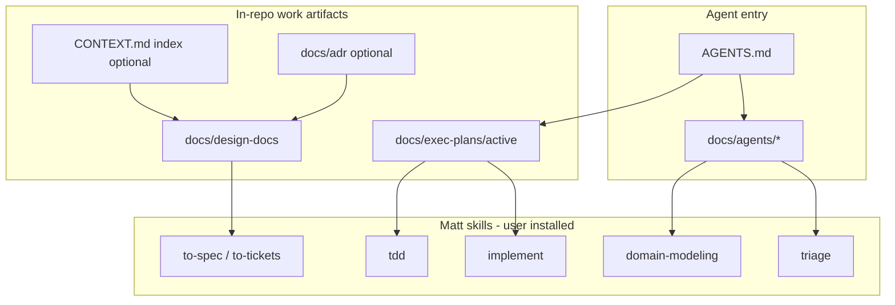

# Retire Superpowers — Adopt Matt Pocock Skills

> Chinese summary: [`docs/zh-CN/exec-plans/completed/2026-07-25-retire-superpowers-adopt-matt-skills.md`](../../zh-CN/exec-plans/completed/2026-07-25-retire-superpowers-adopt-matt-skills.md)  
> Related setup: `docs/agents/issue-tracker.md`, `docs/agents/triage-labels.md`, `docs/agents/domain.md`  
> Branch: `chore/retire-superpowers-adopt-matt-skills`

- Date: 2026-07-25
- Status: **Completed** (2026-07-25 on `chore/retire-superpowers-adopt-matt-skills`)
- Scope: documentation / agent harness only — **no product code changes**

## Goal

Fully retire the Superpowers agent framework from this repository and make **Matt Pocock skills + WiseEff `docs/exec-plans/` + `docs/agents/*`** the only supported agent orchestration path.

Success means:

1. New work never creates or updates `docs/superpowers/**` or `docs/zh-CN/superpowers/**`.
2. Agents reading **active** plans are never instructed to call `superpowers:*` skills.
3. Still-valuable specs/plans under Superpowers paths live under `docs/design-docs/` and/or `docs/exec-plans/` with working links.
4. Governance docs (`AGENTS.md`, `docs/PLANS.md`, `.gitignore`, completed-plan reading rule) name Matt skills as the agent skill surface.
5. Local Superpowers scratch (`.superpowers/`) is untracked and not referenced as evidence for active work.

## Non-goals

- Rewriting every completed plan’s historical `REQUIRED SUB-SKILL` banner (footnote only).
- Deleting design substance — migrate paths/packaging, keep knowledge.
- Replacing WiseEff `docs/exec-plans/` governance with GitHub Issues / wayfinder as the primary implementation tracker.
- Creating a second domain truth that competes with `ARCHITECTURE.md` / `docs/design-docs/domain-model.md`.
- Changing product runtime, APIs, UI, or tests (except docs-check / link hygiene).

## Decisions (frozen)

| Topic | Decision |
| --- | --- |
| In-progress work SoT | **`docs/exec-plans/active/`** (+ zh companions). GitHub Issues optional for triage/tickets; not required for every implementation. |
| Design SoT | **`docs/design-docs/`** (+ `docs/zh-CN/design-docs/` or existing zh companions). Stop writing Superpowers `specs/`. |
| Bite-sized agent plans | Merge into the matching `exec-plans/active/*` (or archive under `exec-plans/completed/` if already done). Do not keep a parallel `docs/exec-plans/active/` tree. |
| New plan banner | Neutral: follow `docs/PLANS.md`; implement with Matt `implement` / `tdd` as appropriate; checkbox tasks; parent opens PR. **Never** `superpowers:*`. |
| Completed plans | Leave historical banners; add a reading note in `docs/exec-plans/completed/README.md`. |
| `CONTEXT.md` / `docs/adr/` | Optional short **index / glossary / ADR stubs** that **point at** existing docs. Do not duplicate product architecture. |
| Matt `docs/agents/*` | Keep and commit; link from `AGENTS.md` (EN) and summarize in `docs/zh-CN/root/AGENTS.md`. |
| `.gitignore` | Stop ignoring `docs/superpowers/` after the tree is removed; keep ignoring local agent scratch (`.superpowers/` or renamed). |

### Skill mapping

| Former Superpowers skill | Use instead |
| --- | --- |
| `writing-plans` | Author/update `docs/exec-plans/active/*` (+ design in `docs/design-docs/`); Matt `to-spec` / `to-tickets` when ticketizing |
| `executing-plans` / `subagent-driven-development` | Matt `implement` + this repo’s Git Branch & PR Workflow in `docs/PLANS.md` / `AGENTS.md` |
| `test-driven-development` | Matt `tdd` |
| Brainstorm / design exploration | Matt `grilling` / `grill-with-docs` / `prototype` / `domain-modeling` |
| Debugging | Matt `diagnosing-bugs` |
| Code review | Matt `code-review` (or Cursor Bugbot / security-review when explicitly requested) |

## Architecture (target agent harness)



**Removed:** `docs/superpowers/**`, plan banners calling `superpowers:*`, `.superpowers/sdd` as active evidence paths.

## Inventory (as of 2026-07-25)

| Surface | Approx. size | Notes |
| --- | --- | --- |
| Files mentioning `superpowers` | ~120 Markdown | Almost all docs |
| Active exec-plans with `REQUIRED SUB-SKILL` / `superpowers:*` | ~25 | **Priority rewrite** |
| Completed exec-plans with same banners | ~42 | Footnote only |
| `docs/exec-plans/active/` | 13 | Bite-sized; merge or archive |
| `docs/design-docs/` | 24 | Migrate still-linked designs |
| `docs/zh-CN/superpowers/` | ~35 tracked | Migrate then delete tree |
| `.superpowers/` | local scratch | Untrack any cached files; delete locally OK |
| Product / CI code refs | 0 | Safe docs-only migration |

## Git & PR Workflow

| Role | Allowed |
| --- | --- |
| Implementation agent | Work on `chore/retire-superpowers-adopt-matt-skills` from latest `main`; commit docs on that branch only |
| Implementation agent | Must not push/merge `main` or open the final merge PR unless acting as parent |
| Parent / session owner | Review, open GitHub PR, merge, sync local `main` |

Prefer **one PR for Phase A–B** (governance + active debrand) and **one PR for Phase C–D** (content migrate + delete trees), unless a single PR stays reviewable.

## Documentation Impact Matrix

| Document / area | Impact | Action |
| --- | --- | --- |
| `AGENTS.md` | Agent skills already partially added | **Update** — ensure Matt-only wording; no Superpowers |
| `docs/zh-CN/root/AGENTS.md` | Missing Agent skills summary | **Update** — short ZH pointer to EN + `docs/agents/*` |
| `docs/agents/issue-tracker.md` | Matt setup | **Review** — commit if untracked; keep PRs-as-request-surface **no** |
| `docs/agents/triage-labels.md` | Matt setup | **Review** — commit if untracked |
| `docs/agents/domain.md` | Matt setup | **Update** — clarify coexistence with `ARCHITECTURE.md` / `domain-model.md` |
| `docs/PLANS.md` | Active list + “former Superpowers” wording | **Update** — register this plan; rewrite Superpowers history line; add Matt skill rule |
| `docs/zh-CN/PLANS.md` | Active list | **Update** — register this plan |
| `docs/exec-plans/completed/README.md` | Reading rule | **Update** — deprecate historical `superpowers:*` banners |
| `.gitignore` | Ignores `docs/superpowers/` | **Update** after tree removal |
| `docs/superpowers/**` / `docs/zh-CN/superpowers/**` | Dual-track trees | **Migrate then delete** |
| Active `docs/exec-plans/active/*` with Superpowers banners/links | ~25 | **Update** banners + links |
| Active `docs/zh-CN/exec-plans/active/*` Superpowers refs | subset | **Update** |
| `docs/design-docs/*` linking into superpowers paths | several | **Update** links after migrate |
| `CONTEXT.md` / `docs/adr/` | Optional | **Update** only if created as index (not full rewrite of architecture) |
| `CONTRIBUTING.md` | Already exec-plans oriented | **Review** — add one line if helpful |
| `scripts/bilingual-docs.ts` | Does not list superpowers trees | **No change** expected |
| Product specs / API / security / runbooks / FRONTEND | Unrelated | **No change** |
| UI / e2e / acceptance | Unrelated | **No change** |

## Documentation Update Gate

Before moving this plan to `completed/`:

- [x] Every Update/Review row above updated or recorded unchanged with evidence
- [x] `rg -i 'superpowers:' docs/exec-plans/active` returns **no** required-skill banners (historical quotes in completed/ are OK)
- [x] `rg 'docs/superpowers|zh-CN/superpowers' docs --glob '!**/completed/**'` returns only intentional archive notes (PLANS/AGENTS stop-write rules)
- [x] `docs/superpowers/` and `docs/zh-CN/superpowers/` directories are gone from the working tree (and no longer force-added)
- [x] `npm run docs:check` passes
- [x] This plan listed under Completed in `docs/PLANS.md` / zh companion after closeout

## Phase / task overview

| Phase | Deliverable |
| --- | --- |
| A | Freeze governance: stop-write rule, Matt skill surface, PLANS/AGENTS alignment, commit `docs/agents/*` |
| B | Debrand **active** plans (banners + critical links) |
| C | Migrate still-referenced Superpowers specs/plans into design-docs / exec-plans |
| D | Delete Superpowers trees; fix remaining links; gitignore + local scratch hygiene |
| E | Completed-plan footnote; verification gates; closeout |

---

### Task A1: Commit Matt agent config + stop-write rule

**Files:**
- Ensure tracked: `docs/agents/issue-tracker.md`, `triage-labels.md`, `domain.md`
- Update: `AGENTS.md`, `docs/zh-CN/root/AGENTS.md`, `docs/PLANS.md`, `docs/zh-CN/PLANS.md`
- Update: `docs/agents/domain.md` — add “WiseEff coexistence” note pointing to `ARCHITECTURE.md` and `docs/design-docs/domain-model.md`

- [x] Confirm `docs/agents/*` are committed on the feature branch
- [x] Add explicit rule in `docs/PLANS.md` Plan Rules: agent execution skills are Matt skills + `docs/agents/*`; do not create `docs/superpowers/**`
- [x] Register this plan in EN + ZH PLANS active lists
- [x] ZH `AGENTS.md`: short Agent skills subsection linking to EN detail

### Task A2: Optional CONTEXT index (lightweight)

**Files (create only if A1 lands cleanly):**
- `CONTEXT.md` — glossary / reading order pointing at existing docs
- Optionally stub `docs/adr/README.md` explaining ADRs are created lazily by domain-modeling

- [x] Do **not** copy architecture prose into CONTEXT
- [x] `docs/adr/README.md` stub added

### Task B1: Strip Superpowers banners from active exec-plans

**Files:** all `docs/exec-plans/active/*.md` (and zh actives) matching `REQUIRED SUB-SKILL` / `superpowers:`

Replacement banner pattern (English):

```markdown
> **For agentic workers:** Implement task-by-task using checkbox (`- [ ]`) tracking.
> Prefer Matt skills `implement` and `tdd` where applicable. Follow `docs/PLANS.md` Git Branch & PR Workflow
> (implementation commits on the feature branch; parent opens/merges the PR).
```

Chinese actives: equivalent neutral wording (no `superpowers:`).

- [x] Rewrite ~25 EN active plans
- [x] Rewrite matching ZH active plans
- [x] Spot-check: `rg 'superpowers:' docs/exec-plans/active docs/zh-CN/exec-plans/active` → empty (except this migration plan inventory)

### Task B2: Retarget active links that still point at Superpowers paths

Priority files (non-exhaustive; re-run `rg` during execution):

- `docs/exec-plans/completed/2026-07-21-dts-parameter-surface-mvp.md`
- `docs/exec-plans/completed/2026-07-21-retire-synthetic-base-dts.md`
- `docs/exec-plans/completed/2026-07-21-instance-submodule-seed.md`
- `docs/exec-plans/completed/2026-07-20-dts-workbench-module-refocus.md`
- `docs/exec-plans/completed/2026-07-23-local-demo-credentials-seed.md` (+ zh)
- `docs/exec-plans/completed/2026-07-23-local-post-cutover-seed.md` (+ zh)

- [x] For each link: point to migrated `design-docs` / merged exec-plan section

### Task C1: Migrate specs still needed

**Rule:** If an active plan, RFC, or current design-doc links to `docs/design-docs/*` or `docs/zh-CN/design-docs/*`, move that content into:

- EN: `docs/design-docs/<same-basename-or-clearer-name>.md` (if not already duplicated)
- ZH: `docs/zh-CN/design-docs/...` or existing zh design path used by the repo

If a file already exists under `docs/design-docs/` as the English SoT (e.g. local demo credentials), treat Superpowers zh path as a **companion to relocate**, not a second design.

- [x] Build a migrate table (old path → new path) in a short note under this plan or a PR comment
- [x] Move/copy with bilingual links preserved
- [x] Do not invent new product decisions while moving

### Task C2: Fold bite-sized Superpowers plans

For each `docs/exec-plans/active/*.md`:

| Case | Action |
| --- | --- |
| Matching active exec-plan exists | Merge unique task detail into that exec-plan (or link to a single section); then drop Superpowers file |
| Work already completed | Do not revive; drop after confirming no active dependency |
| Only Superpowers plan exists and work still open | Promote to `docs/exec-plans/active/` in WiseEff plan shape (Goal, Matrix, Gate, Git & PR) |

- [x] Process all 13 EN plans + 9 ZH plan mirrors (deleted with trees; exec-plans remain SoT)
- [x] Prefer fewer docs, not more

### Task D1: Delete Superpowers directories + fix leftovers

- [x] Delete `docs/superpowers/` and `docs/zh-CN/superpowers/` after C1/C2
- [x] `rg 'superpowers' docs` — fix remaining non-historical references (allow completed/ history + this plan’s inventory)
- [x] Update `.gitignore`: remove `docs/superpowers/` ignore rule; keep local scratch ignore; refresh comment (“agent local scratch”, not Superpowers-branded if desired)
- [x] `git rm --cached` any tracked `.superpowers/**` files
- [x] Local delete of `.superpowers/` is optional and operator-local

### Task E1: Completed-plan footnote + closeout

**Files:**
- `docs/exec-plans/completed/README.md`
- `docs/PLANS.md` completed blurb (remove “former Superpowers plan location” as a live concept)

- [x] Add: historical `superpowers:*` REQUIRED SUB-SKILL lines are obsolete; ignore when reading completed plans
- [x] Run verification commands below
- [x] Move this plan to `docs/exec-plans/completed/` (+ zh) when gates pass
- [x] Update PLANS active/completed lists

## Verification

```bash
# No Superpowers skill banners in active plans
rg -n 'superpowers:' docs/exec-plans/active docs/zh-CN/exec-plans/active || true

# No live dual-track paths outside intentional history / this completed plan
rg -n 'docs/superpowers|zh-CN/superpowers' docs --glob '!**/completed/**' || true

# Trees gone
test ! -d docs/superpowers && test ! -d docs/zh-CN/superpowers

# Docs gate
npm run docs:check

# No product code expected; optional sanity
git status
```

## Risks

| Risk | Mitigation |
| --- | --- |
| Three trackers at once (exec-plans + superpowers + issues) | Freeze SoT decisions above; wayfinder optional |
| Broken links after delete | Migrate before delete; `rg` + `docs:check` |
| Dual domain truth via CONTEXT.md | CONTEXT is index-only |
| Huge PR | Split Phase A–B vs C–D |
| Losing untracked Superpowers files | Inventory `git status` / disk listing before delete |
| Active product plans mid-flight | Prefer link retargets that do not rewrite those plans’ product scope |

## Success criteria

- [ ] Stop-write + Matt skill rule present in `docs/PLANS.md` / `AGENTS.md`
- [ ] Active plans have zero `superpowers:` skill requirements
- [ ] Superpowers directories removed; valuable content preserved under design-docs / exec-plans
- [ ] `npm run docs:check` green
- [ ] Agents can implement from active plans using only Matt skills + repo docs
