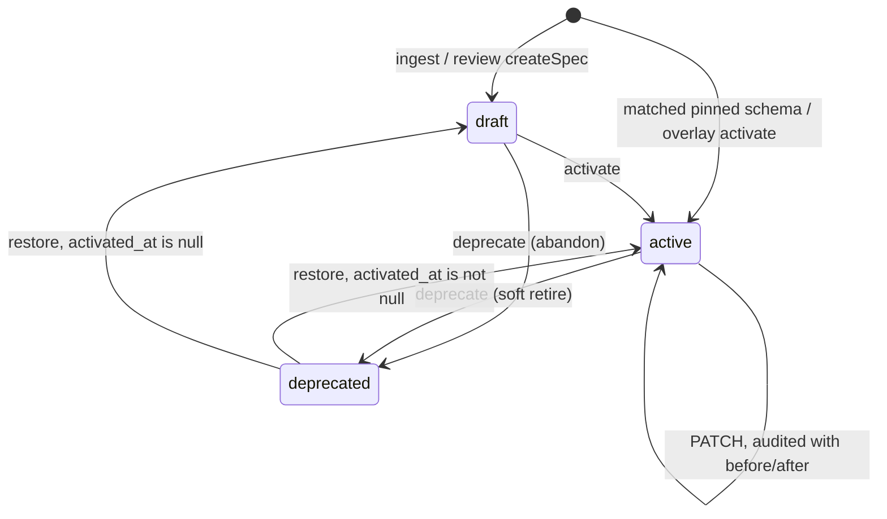
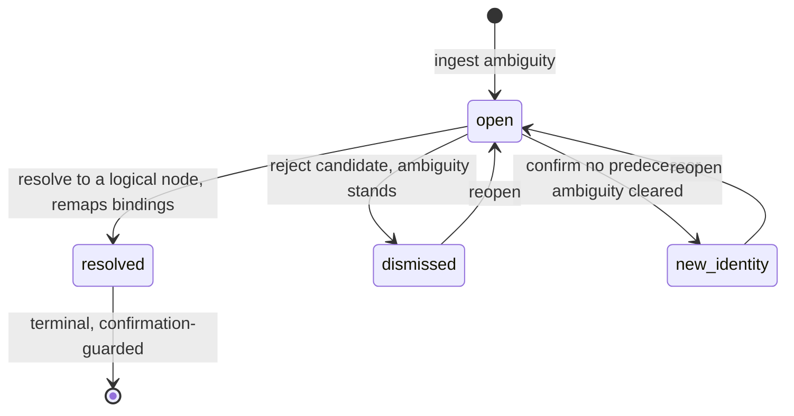

# Parameter governance state machines — completion

> Status: **Completed (implementation merged).** PR1 #212 (`feat/spec-lifecycle-closure`), PR2 #213 (`feat/identity-mapping-decision-split`), PR3 #214 (`feat/parameter-governance-convergence`). ADR-0011 / ADR-0012. Deferred D1–D8 remain in `docs/design-docs/2026-07-30-parameter-governance-deferred-questions.md`. **Residuals** (acceptance IDs, browser evidence, plan archive hygiene) owned by [`2026-08-01-governance-platform-closeout.md`](../active/2026-08-01-governance-platform-closeout.md).

## Goal

Make `/parameter-admin` able to complete every state machine it governs, and make every state it can reach actually mean something. Two failure modes are in scope and they are different:

- **Unreachable transitions.** A state exists in the database and in the TypeScript types, but no route and no button can get there.
- **States without behaviour.** A transition exists but changes nothing observable, so exercising it produces governance theatre.

After this plan every state in the six audited machines is either reachable with a stated consequence, or removed.

## Why: what the current model actually does

Audited 2026-07-30 across the six state machines behind `/parameter-admin`.

| Machine | Reachable today | Blocked | Meaningless |
| --- | --- | --- | --- |
| Parameter definition lifecycle | `draft → active`, `active` metadata edit | `→ deprecated`, `deprecated → active`, delete | `deprecated` (indistinguishable from `active` in the schema loader) |
| Identity mapping tasks | `open → resolved`, `open → dismissed` | reopen, history view | — |
| Config revision | ingest / mapping / validate / submit / writeback edges | — | `published` (no writer at all) |
| Driver schema overlays | `draft → active`, `→ deprecated` (API only) | `deprecated → active` | — |
| Unclassified queue | dismiss | restore (API exists, zero frontend callers) | — |
| Module tree | create / rename / move / re-kind / delete | `curated → auto` (out of the domain, see below) | `sortOrder` (API exists, no UI) |

Four findings drive the decisions.

**1. `deprecated` on a parameter definition currently changes nothing.**

```189:195:server/modules/parameter-specs/schemaLoader.ts
export function isReleasableDriver(driver: DriverSchema): boolean {
  return isReleasableSource(driver.source) && driver.lifecycle !== "draft";
}

export function isReleasableProperty(property: PropertySpec): boolean {
  return isReleasableSource(property.source) && property.lifecycle !== "draft";
}
```

Only `draft` is excluded. Migration `0068_dismiss_structural_spec_reviews.sql:47-59` already bulk-deprecated every definition whose property key is `status`, and those definitions are still parsing today. The state has also never been defined in the domain model — grepping `docs/design-docs/domain-model.md` for `deprecated` returns nothing, and line 160 documents only `draft → active`. So this is not "a missing button"; the state has no domain meaning to attach a button to.

**2. The most consequential act in parameter governance has no state transition protecting it.**

`PATCH /api/v2/parameter-specs/:specId` rewrites an active definition in place — `value_shape`, `constraints`, `units`, `documentation`, `example_value` (`server/modules/parameter-specs/service.ts:687-720`). No version bump, no re-review, and no record of the previous shape. Meanwhile `activateParameterSpec` refuses anything that is not `draft` (`service.ts:555`) and `updateParameterSpec` refuses anything that is `draft` (`service.ts:671`), so the lifecycle carefully polices the harmless edges and leaves the dangerous one open.

**3. Dismissing every identity mapping task bricks the revision.**

```479:482:server/modules/parameter-topology/service.ts
    // Dismiss never clears identity ambiguity. Resolve clears needs_mapping only when
    // every open mapping task is gone and this resolve path completed without errors.
    const nextStatus =
      input.decision === "resolved" && openRemaining === 0 ? "resolved" : "needs_mapping";
```

That comment is deliberate and correct as far as it goes. The consequence is not: `needs_mapping` makes the revision reject every binding draft (`server/modules/parameter-topology/editService.ts:1082-1087`), so an Admin who dismisses all tasks for a revision has permanently disabled editing on it, with no path back except uploading a new DTS. The root cause is that `dismissed` carries two incompatible facts — "I reject this candidate" and "this parameter genuinely has no predecessor" — and only the first one is modelled.

**4. `published` is not a missing feature, it is a vestige.**

`dts_config_revisions.status` allows `published` (`server/migrations/0051_dts_config_revision_manifest.sql:32-43`) and `governanceAudit.ts:20` reserves a `config-revision-published` action, but no code writes either. `CONTINUITY_BASELINE_STATUSES` lists `published` as a "stable revision" condition (`server/modules/parameter-topology/repository.ts:809-815`), a branch that can never match. The design doc promised `resolved → validated → compiled → pending_approval → published` (`docs/design-docs/2026-07-16-parameter-topology-schema-management-design.md:327-330`).

Releasing is nevertheless fully implemented — as a **file-layer** act. `dts_release_baseline.status` moves `draft → released` through `POST /api/v1/projects/:projectId/baselines/:baselineId/release`, and that is what the 发布 button in `ConfigSetBaselinePanel` calls. A baseline pins `file_version_id` per config-set member and has no foreign key to `dts_config_revisions` at all. A config revision is a derived read model of one parsed file version; builds and devices consume DTS files. So the semantic layer does not need a release tip — it needs to stop advertising one.

## Locked decisions

**D1 — Definition deprecation is soft retirement.** A deprecated definition stays releasable and keeps parsing, so no project loses parse coverage because of a governance action. It loses exactly two things: selectability when resolving a spec review task (already enforced by `assertSpecResolvable`, `server/modules/parameter-specs/specCompleteness.ts:180-186`) and presence in the default definition-library view. Hard retirement was considered and rejected: withdrawing meaning from a definition projects already depend on is a data-integrity event dressed up as a catalog edit.

**D2 — Deprecation is stated for the definition, not for a version.** Deprecating sets every version row of that definition. No multi-version model is introduced; `version` stays 1 in practice. Versioning is a real question and it is deferred deliberately (D1 in the deferred-questions doc), because soft retirement does not need it and enabling it reaches into binding pointers, writeback, and eight ranking queries.

**D3 — There is no `active → draft`.** Bindings reference a version row, and `draft` is the one lifecycle the schema loader excludes, so demoting an active definition would silently strip parse coverage — precisely the hard retirement D1 rejects. Content edits do not need it either: `PATCH` already rewrites an active definition fully. Mis-activation is corrected by deprecating.

**D4 — No delete; `draft` can also be deprecated; `activated_at` decides where restore lands.** Ingest and review continuously mint draft definitions, some of which will never be activated. Rather than a delete endpoint guarded by reference checks, deprecation accepts `draft` as a source state and becomes the single archive act. Restoring then needs to know which state to return to, so `parameter_spec_versions` gains `activated_at`, mirroring `driver_schema_overlays` (`server/modules/parameter-specs/driverSchemaOverlayRepository.ts:79`). Non-null means restore to `active`; null means restore to `draft`.

**D5 — Ingest keeps binding new occurrences to deprecated definitions, and says so.** Parse determinism wins: two projects uploading the same DTS must produce the same bindings regardless of when an Admin deprecated something. What changes is visibility — the definition library and project surfaces state that a binding references a deprecated definition, and the deprecate action reports the current reference count before it is confirmed.

**D6 — Semantic edits to active definitions gain non-repudiation, not a constraint.** Before/after `value_shape` and `constraints` go into the governance audit via the existing `spec-updated` action, and the frontend shows a diff plus the reference count before saving. No new prohibition this round: whether a value-shape change should be forbidden outright (forcing deprecate-then-create) is deferred to D2 in the deferred-questions doc, and the audit trail added here is what makes that argument decidable from data.

**D7 — `dismissed` splits into two decisions.** "Reject this candidate" keeps today's semantics exactly: ambiguity stands, the revision stays `needs_mapping`. "Confirm as new identity" is the new decision and states that the parameter has no predecessor, which clears that task's ambiguity. A revision leaves `needs_mapping` when every task is `resolved` or `new_identity`; a single remaining `dismissed` still blocks. This is why the bricking in finding 3 disappears without weakening the original guard.

**D8 — Reopen is limited to outcomes that rewrote no data.** `dismissed` and `new_identity` may return to `open`. `resolved` may not, because it has already run `applyReviewedIdentityMapping` and remapped binding identity (`server/modules/parameter-topology/service.ts:447-453`); an inverse is not symmetric once drafts have accumulated against the new identity. `resolved` is protected by an explicit confirmation step instead, and the inverse remap is deferred (D3 in the deferred-questions doc).

**D9 — `published` retires.** Dropped from the `dts_config_revisions.status` check, removed from `CONTINUITY_BASELINE_STATUSES`, removed from `GovernanceAuditAction`, and the design-doc state machine is corrected. Releasing is the release baseline and nothing else. ADR-0012 records this against the design doc that promised otherwise, because a future reader will otherwise re-add the enum value.

**D10 — The two retirement acts are named apart.** Overlay retirement genuinely withdraws parsing capability, because overlays load filtered to `lifecycle = 'active'` (`driverSchemaOverlayRepository.ts:220,235`). Definition deprecation does not. Calling both 废弃 in one admin surface invites an operator to expect one consequence and get the other, so the overlay act is 停用解析 and the definition act is 废弃, in copy and in the glossary.

**D11 — The module tree gains only a `sortOrder` affordance.** `curated → auto` is out of the domain, not missing: `CONTEXT.md` defines adoption as a one-way stated fact, and an un-adopt would let a human decision disguise itself as an ingest decision, which is what ADR-0004 exists to prevent. Re-kinding a driver group stays forbidden because a driver group is defined by its compatible mappings (ADR-0007). Buttons that are refused move from hidden to disabled-with-a-reason, so the tree stops looking arbitrary.

**D12 — Missing entry points go where their subject already lives.** The unclassified queue gains an 已忽略 section with an inline restore, wired to the `restoreDismissedCompatible` port method that already exists with zero callers. Overlay list, draft editing, and 停用解析 go inside driver group detail, with impact shown before retirement. Platform promotion stays in `PlatformConsolePage`, because it requires `platform:schema-promote` and is not organization governance.

## Target model

### Parameter definition lifecycle



Consequences by state, which is the part that was previously undefined:

| State | Releasable for parsing | Selectable in spec review | Default library view |
| --- | --- | --- | --- |
| `draft` | no | no | shown, filterable |
| `active` | yes | yes | shown |
| `deprecated` | **yes** | no | hidden by default |

### Identity mapping task



Revision status rule: `needs_mapping` clears to `resolved` when no task remains `open` **and** no task remains `dismissed`.

## Delivery

Three sequential PRs. Each branches from `main` **after** the previous one merges, so migration numbering stays dense and each PR is independently revertible.

### PR 1 — `feat/spec-lifecycle-closure` (migration `0081`, ADR-0011)

**Batch 1.1 — decision record and migration base**

- `docs/adr/0011-spec-deprecation-is-soft-retirement.md`: state D1, D2, D3, D4, D5, D10. Must explain why hard retirement was rejected, why `active → draft` is a disguised hard retirement, and why the overlay act carries a different name.
- `server/migrations/0083_parameter_spec_versioning.sql` (ADR-0014): includes `parameter_spec_versions.activated_at timestamptz` and soft-retirement restore semantics; the originally planned `0081_spec_lifecycle_closure.sql` was superseded after #215 and must not be reintroduced (collides with `0081_remove_structural_parameter_specs.sql`).
- `server/shared/database/migrationInvariant.test.ts`: assert the column exists, that no `active` row has a null `activated_at`, and that the lifecycle check still allows exactly `draft | active | deprecated`.

The `deprecated` backfill deserves attention: rows deprecated by migration `0068` get a null `activated_at`, so restoring one lands it in `draft` rather than `active`. That is the correct outcome — those rows were never activated through the product — but it must be an asserted decision, not an accident of the backfill.

**Batch 1.2 — server transitions and consequences**

- `server/modules/parameter-specs/service.ts`: add `deprecateParameterSpec` (accepts `draft` or `active`, sets every version row, requires a reason) and `restoreParameterSpec` (accepts `deprecated`, targets `active` when `activated_at` is non-null and `draft` otherwise). `activateParameterSpec` also stamps `activated_at`.
- `server/modules/parameter-specs/routes.ts`: `POST /api/v2/parameter-specs/:specId/deprecate` and `POST /api/v2/parameter-specs/:specId/restore`, both `admin:access`, both org-owned only — platform-global definitions stay non-activatable and therefore non-deprecatable, consistent with `reviewApply.ts:402-413`.
- `server/modules/parameter-topology/governanceAudit.ts`: add `spec-deprecated` and `spec-restored`.
- `server/modules/parameter-specs/service.ts` (`updateParameterSpec`): extend the existing `spec-updated` audit metadata with before/after `value_shape` and `constraints`. Values, not hashes — these are schema shapes, not user data, and the point is to be able to read what changed.
- `server/modules/parameter-specs/repository.ts`: reference count per definition (bindings whose `parameter_spec_version_id` belongs to the definition, scoped to the organization). Reuse the aggregation shape introduced for `attributionModules` rather than inventing a second pattern. Returned by `GET /api/v2/parameter-specs` and the detail endpoint.
- `server/modules/parameter-specs/schemas.ts`: bodies for the two new routes; `documentation`-style required reason.
- No change to `schemaLoader.ts`. That is the decision, and it needs a test asserting a deprecated property is still releasable, so a future reader cannot mistake the absence of a filter for an oversight.

**Batch 1.3 — frontend**

- `src/application/ports/ParameterTopologyRepository.ts`, `src/infrastructure/http/parameterTopologyClient.ts`, `src/application/parameters/parameterAdminApplication.ts`: the two new methods.
- `src/components/parameter-topology/ParameterSpecDetail.tsx` and `ParameterSpecDetailDialog.tsx`: 废弃 and 恢复 actions with reason capture; before-save diff of `value_shape` and `constraints` for active definitions; reference count shown next to both the deprecate action and the save action.
- `src/components/parameter-topology/ParameterSpecLibrary.tsx`: default filter excludes `deprecated`; a deprecated row is visibly marked rather than merely filtered, so an operator who opts in can see why; deprecated-reference signal on rows that point at a deprecated definition.
- `src/application/parameters/parameterAdminUiCopy.ts`: 废弃 / 恢复 / 已废弃引用 copy, and the impact sentence shown before deprecating.
- `src/components/parameter-admin-next/OrganizationSpecGovernancePanel.tsx`: handlers and toasts.

**Batch 1.4 — mock parity**

`src/infrastructure/mock/mockParameterTopologyRepository.ts` gains deprecate/restore, an `activated_at` equivalent, and at least one seeded `deprecated` definition — the fixture set currently has none. The pre-existing divergences must be closed in the same batch or explicitly recorded: mock sets the review task to the decision value after `createSpec` where the API keeps it `open` (`mockParameterTopologyRepository.ts:585-617`), and mock bumps `version` on activate where the API does not (`:528-533`).

### PR 2 — `feat/identity-mapping-decision-split` (status widen landed in `0085`)

**Batch 2.1 — migration**

- `server/migrations/0085_identity_mapping_and_singleton_blockers.sql` (main / #212) already widens `identity_mapping_tasks.status` to `open | resolved | dismissed | new_identity` and adds `task_kind`. Do **not** add a colliding `0082_identity_mapping_new_identity.sql` — that slot is taken by `0082_attribution_subjects.sql`.
- `migrationInvariant.test.ts`: assert `new_identity` via the existing 0085 invariant (no separate 0082 identity migration).

**Batch 2.2 — server**

- `server/modules/parameter-topology/schemas.ts:84-98`: `decision` gains `new-identity`; reopen body.
- `server/modules/parameter-topology/bindingService.ts:810-846`: `resolveIdentityMappingTaskRow` accepts the new status. Note that the selected node is stored inside the `evidence` jsonb rather than in a column, so reopen must clear that patch as well as `reviewer_user_id`, `reason`, and `resolved_at`.
- `server/modules/parameter-topology/service.ts:474-488`: the revision rule becomes "no `open` and no `dismissed` remaining → `resolved`". `new-identity` must not call `applyReviewedIdentityMapping`.
- New `POST /api/v2/identity-mapping-tasks/:taskId/reopen`, `admin:access`, rejecting `resolved` with a `CONFLICT` that names why. Reopening re-asserts `needs_mapping` on the revision.
- `governanceAudit.ts`: add `identity-mapping-new-identity` and `identity-mapping-reopened`.
- List endpoint already filters on `status` (`schemas.ts:77`); extend the enum to the new value.

**Batch 2.3 — frontend**

- `src/components/parameter-topology/IdentityMappingReview.tsx`: three decisions instead of two, with copy that makes the difference legible — rejecting a candidate keeps the revision blocked, confirming a new identity releases it. Confirmation step on 确认对应 because it is the one irreversible decision (D8). History view over `resolved | dismissed | new_identity`, replacing the hardcoded `open`-only render at `:59`. Reopen on the two non-destructive outcomes.
- `src/components/parameter-admin-next/OrganizationIdentityMappingPanel.tsx`: status filter and handler wiring.
- Mock repository: the new decision, reopen, and a seeded non-open task so the history view has content.

### PR 3 — `feat/parameter-governance-convergence` (migration `0083`, ADR-0012)

**Batch 3.1 — retire `published`**

- `docs/adr/0012-releasing-happens-at-the-file-layer.md`: state D9. Must cite the design doc it contradicts and explain why a config revision is a derived read model rather than a releasable artifact.
- `server/migrations/0083_retire_config_revision_published.sql`: narrow the `dts_config_revisions.status` check to the nine surviving values. Assert zero rows hold `published` before narrowing; fail loudly rather than deleting.
- `server/modules/parameter-topology/repository.ts:809-815`: remove `published` from `CONTINUITY_BASELINE_STATUSES`, with a test asserting the surviving set still selects a stable revision on seeded data.
- `server/modules/parameter-topology/governanceAudit.ts:20`: remove `config-revision-published`.
- `server/modules/parameter-topology/candidateRevisionStateMachine.ts:76-89`: drop the `published → draft` row.
- `docs/design-docs/2026-07-16-parameter-topology-schema-management-design.md:327-330`: correct the state machine and point at ADR-0012.

**Batch 3.2 — unclassified queue restore**

`src/components/parameter-topology/UnclassifiedCompatibleQueue.tsx` gains an 已忽略 section with per-row 恢复, calling the existing `restoreDismissedCompatible` (`DELETE /api/v2/parameter-modules/dismissals/:compatible`, `server/modules/parameter-modules/service.ts:452-473`). No server change.

**Batch 3.3 — overlay governance entry points**

- Driver group detail inside `src/components/parameter-topology/ParameterModuleMappingPanel.tsx`: list the overlays for that compatible with lifecycle, offer draft editing (`PATCH`, existing) and 停用解析 (`POST .../deprecate`, existing).
- Retirement shows impact first: which definitions lose parse coverage and how many projects hold bindings against them. This is a new read, and it is the reason the action is safe to expose.
- No successor requirement (deferred, D5 in the deferred-questions doc). No `deprecated → active` for overlays — the service refuses it (`driverSchemaOverlayService.ts:597`) and re-authoring a draft is the intended path.

**Batch 3.4 — module tree affordances**

- `src/components/parameter-topology/ModuleAttributionTree.tsx` and `ModuleAttributionRowActions.tsx`: 上移 / 下移 calling the existing `sortOrder` PATCH (`server/modules/parameters/schemas.ts:89`).
- `moduleAttributionTreeUtils.ts`: refused actions return a reason, and the row renders them disabled with that reason rather than hiding them.
- `docs/design-docs/domain-model.md`: record `curated → auto` as out of the domain with its rationale, so it is not re-proposed.

## Verification

```bash
npm test
npm run test:server
npm run build
npm run docs:check
```

Targeted, per PR:

```bash
npx vitest run server/shared/database/migrationInvariant.test.ts
npx vitest run server/modules/parameter-specs
npx vitest run server/modules/parameter-topology
npx vitest run server/modules/parameter-modules
npx vitest run src/components/parameter-topology
npx vitest run src/components/parameter-admin-next
```

Data assertions after `npm run db:seed:m1`, expressed as checks rather than eyeballing:

- every `parameter_spec_versions` row with `lifecycle = 'active'` has a non-null `activated_at`
- a definition deprecated through the API is still returned as releasable by the schema loader, and its bindings still resolve
- restoring a definition deprecated by migration `0068` lands in `draft`, not `active`
- a revision whose every identity mapping task is `resolved` or `new_identity` reaches `resolved`; one remaining `dismissed` keeps it at `needs_mapping`
- no `dts_config_revisions` row holds `published` before migration `0083` narrows the check
- `recomputeBindingModules` remains a no-op, as established by the ADR-0010 work

Frontend verification per `AGENTS.md`: `/parameter-admin` 参数定义库, 节点对应, 模块归属 at 1440x900, 768x1024, 390x844, with snapshot, screenshot, console error check, and the real interactions — deprecate with reason, restore, save an active definition and read the diff, the three mapping decisions, reopen, restore a dismissed compatible, retire an overlay from driver group detail, and reorder a module.

### Tests that must change

Listed in advance so a failure outside this list is a signal rather than noise.

Server: `server/modules/parameter-specs/service.test.ts` and `repository.attributionModules.test.ts` (new lifecycle edges and the reference count join), `specCompleteness.test.ts` (deprecated is not resolvable), `server/modules/parameter-topology/service.test.ts` and `identityContinuity.integration.test.ts` (`CONTINUITY_BASELINE_STATUSES` loses a value; the revision rule changes), `resolveIdentityMapping.test.ts` (third decision, reopen), `server/shared/database/migrationInvariant.test.ts` (three new migrations), `candidateRevisionStateMachine.test.ts` (row removed).

Frontend: `ParameterSpecLibrary.test.tsx` and `ParameterSpecLibrary.mockRuntime.test.tsx` (default filter now excludes `deprecated`, so fixtures relying on a visible deprecated row must state their intent), `ParameterSpecDetailDialog.test.tsx`, `IdentityMappingReview.test.tsx`, `UnclassifiedCompatibleQueue.test.tsx`, `moduleAttributionTreeUtils.test.ts` (disabled-with-reason replaces hidden), `ParameterAdminNextPage.test.tsx`.

E2E: `e2e/acceptance/parameter-topology.acceptance.spec.ts` plus the requirement and operation tables (see below).

## Git & PR Workflow

| Role | Allowed |
| --- | --- |
| Implementation subagent | branch from latest `main`, implement, test, commit on the branch |
| Implementation subagent | Must not push to `main`, open or merge PRs, or fast-forward local `main` |
| Parent agent | Review, spot-check verification, open the PR, merge, then sync local `main` |

This plan deliberately uses **three branches**, contrary to the default one-plan-one-branch rule, because each carries its own migration and the migration numbers must be assigned in merge order:

1. `feat/spec-lifecycle-closure` — after PR #211 merges. Migration `0081`.
2. `feat/identity-mapping-decision-split` — after PR 1 merges. Migration `0082`.
3. `feat/parameter-governance-convergence` — after PR 2 merges. Migration `0083`.

If a later PR must start before its predecessor merges, it branches from the predecessor rather than from `main`, and the plan is updated to say so.

## Documentation Impact Matrix

| Area | Action | Files |
| --- | --- | --- |
| Repository map | Review | `AGENTS.md`, `ARCHITECTURE.md`, `docs/zh-CN/root/AGENTS.md`, `docs/zh-CN/root/ARCHITECTURE.md` |
| Domain glossary | **Update** | `CONTEXT.md` — 「Parameter spec lifecycle」, 「Spec deprecation」, 「Deprecated-definition reference」, 「Overlay retirement」, 「Release baseline」, 「Config revision」 were added during the design session; verify they still match what shipped, and add the identity-mapping decision vocabulary |
| ADRs | **Update** | new `docs/adr/0011-spec-deprecation-is-soft-retirement.md`, new `docs/adr/0012-releasing-happens-at-the-file-layer.md` |
| Planning docs | **Update** | `docs/PLANS.md`, `docs/zh-CN/PLANS.md` (index this plan); `docs/exec-plans/tech-debt-tracker.md` and Chinese companion (TD-048 … TD-054 already filed) |
| Deferred questions | **Update** | `docs/design-docs/2026-07-30-parameter-governance-deferred-questions.md` — close items as they are decided; do not silently drop them |
| Domain model | **Update** | `docs/design-docs/domain-model.md`, `docs/zh-CN/design-docs/domain-model.md` — spec lifecycle edges and consequences (line 160 documents only `draft → active`), identity mapping decisions, release is the baseline, `curated → auto` out of the domain |
| API contract | **Update** | `docs/design-docs/api-contract.md`, `docs/zh-CN/design-docs/api-contract.md` — deprecate/restore, reopen, `new-identity` decision, reference count field, retired `published` |
| Design history | **Update** | `docs/design-docs/2026-07-16-parameter-topology-schema-management-design.md:327-330` — correct the promised state machine |
| Frontend docs | **Update** | `docs/FRONTEND.md`, `docs/zh-CN/frontend.md` — library default filter, deprecation copy, diff-before-save, mapping decisions and history, overlay entry points, disabled-with-reason tree actions |
| Product specs | **Update** | `docs/product-specs/prototype-functional-spec.md`, `docs/zh-CN/product-specs/prototype-functional-spec.md` — governance actions available to an Admin |
| Security / governance | **Update** | `docs/SECURITY.md`, `docs/zh-CN/SECURITY.md` — new audit actions, and the fact that semantic edits to active definitions are now recorded with before/after |
| Quality / testing | Review | `docs/QUALITY_SCORE.md`, `docs/design-docs/testing-strategy.md`, `docs/zh-CN/design-docs/testing-strategy.md` |
| Reliability / runbooks | Review | `docs/RELIABILITY.md`, `docs/runbooks/manual-acceptance.md`, `docs/zh-CN/manual-acceptance.md` |
| Generated artifacts | **Update** | `docs/generated/db-schema.md` — regenerate for `0081`–`0083`; it was already stale before the ADR-0010 work and TD-004 tracks the underlying gap |
| Acceptance coverage | **Update** | `docs/developer/browser-acceptance-coverage-map.md`, `docs/developer/user-operation-coverage-matrix.md` and Chinese companions |
| References | Review | `docs/references/productization-api-contract-draft.md` |
| Other active plans | Review | `docs/exec-plans/active/2026-07-29-org-driver-schema-overlay.md`, `2026-07-30-platform-tier-and-super-admin.md`, `2026-07-30-attribution-tree-is-taxonomy-not-topology.md` — all touch overlays, definitions, or module kinds |

## Documentation Update Gate

Blocking. No PR in this plan may be treated as complete, and the plan may not move to `completed/`, until every `Update` and `Review` row above is either updated or explicitly recorded as unchanged with evidence, `npm run docs:check` passes, and any newly deferred work is filed in `docs/exec-plans/tech-debt-tracker.md` and reflected in the deferred-questions doc.

Bilingual pairs stay separate files linked to each other; `scripts/bilingual-docs.ts` is the inventory.

## UI Interaction Automation

Interaction changes: definition deprecate/restore, diff-before-save, library default filter, three mapping decisions plus history and reopen, dismissed-compatible restore, overlay retirement, module reordering.

- Affected spec: `e2e/acceptance/parameter-topology.acceptance.spec.ts`
- New requirement IDs needed in `docs/developer/browser-acceptance-coverage-map.md`, because none exist for any of these: `SPEC-DEPRECATE-001` (deprecate with reason, row leaves the default view, reference count reported), `SPEC-RESTORE-001` (restore lands in the state `activated_at` implies), `SPEC-EDIT-DIFF-001` (diff shown before saving an active definition), `IDMAP-NEWID-001` (confirm-as-new-identity releases the revision while a remaining rejection does not), `IDMAP-HISTORY-001`, `IDMAP-REOPEN-001` (reopen offered on non-destructive outcomes and refused on `resolved`), `MOD-QUEUE-RESTORE-001`, `OVERLAY-RETIRE-001` (impact shown before retirement), `MOD-ATTR-SORT-001`.
- Operation IDs in `docs/developer/user-operation-coverage-matrix.md` must gain the deprecate/restore, mapping-decision, and overlay-retirement operations.
- Operation evidence must still generate through `npm run acceptance:browser` or `npm run acceptance:evidence`.
- Note the interaction with TD-044: four `PARAM-ENABLE-*` cases are registered as skipped stubs. Do not un-skip them as a side effect of touching this spec.

## Risks

| Risk | Handling |
| --- | --- |
| Soft retirement reads as a no-op and someone "fixes" it by filtering `deprecated` out of the schema loader | ADR-0011 states the reason, and Batch 1.2 adds a test asserting a deprecated property is still releasable. The test is the guard; the ADR is the explanation |
| The migration `0068` cohort behaves differently from anything an operator deprecated through the product | Made explicit by the `activated_at` backfill: those rows restore to `draft`. Asserted in Batch 1.1 and recorded as D7 in the deferred-questions doc, which is where the real question (a non-parameter marker) belongs |
| Ranking queries treat `deprecated` and `draft` alike, so soft retirement interacts oddly with name and value resolution | Out of scope and filed as TD-049 with all eight call sites enumerated. This plan must not change those queries opportunistically — each needs reading in context |
| Splitting `dismissed` weakens the guard that dismissal never clears ambiguity | It does not: rejection keeps blocking. Only the new decision clears, and it clears by stating a different fact. Assert both directions on seeded data |
| Reopen leaves a revision in a state no ingest path produces | Reopen re-asserts `needs_mapping`, which is exactly what an open task means elsewhere. Covered by the revision-rule test |
| Dropping `published` from the check breaks a consumer | Verified: no writer, and the only reader is the dead `CONTINUITY_BASELINE_STATUSES` branch. Migration asserts zero rows before narrowing |
| Overlay retirement drops parse coverage with one click | Impact is shown before the act. A successor requirement was considered and deferred (D5); do not add it opportunistically, because it turns retirement into a blocked action with no workaround |
| Reference count aggregation is a new N+1 on the library list | Reuse the `attributionModules` batch-load shape from the ADR-0010 work rather than per-row queries |

## Out of scope

Recorded in `docs/design-docs/2026-07-30-parameter-governance-deferred-questions.md` with the fact base: versioned definitions (D1), constraining semantic edits (D2), inverse remap for resolved mapping tasks (D3), 定义数 versus 实测处数 (D4), successor requirement for overlay retirement (D5), lifecycle ranking in resolution queries (D6), a non-parameter marker distinct from deprecation (D7), superseded-overlay visibility (D8), and the missing `listPromotionCandidates` OpenAPI entry (D9).

Explicitly rejected rather than deferred, and not to be re-opened without new evidence: `curated → auto` on modules, re-kinding a driver group, and restoring `published`.
