# 雷泽 WiseEff 项目介绍

**面向工程研发团队的 AI 协同工作平台**

参数管理 · 设备调试 · 日志分析 · 工程知识 · 组织治理

2026 年 9 月

---

## 内容导航

1. [项目概述](#1-项目概述)
2. [平台能力与业务组织](#2-平台能力与业务组织)
3. [项目参数管理](#3-项目参数管理)
4. [设备调试与参数验证](#4-设备调试与参数验证)
5. [日志智能分析](#5-日志智能分析)
6. [工程知识管理](#6-工程知识管理)
7. [小泽 AI 助手](#7-小泽-ai-助手)
8. [组织协作与管理治理](#8-组织协作与管理治理)
9. [技术架构与部署形态](#9-技术架构与部署形态)

## 1. 项目概述

雷泽（WiseEff）是一款面向工程研发团队的 Web 协作平台，用于管理项目参数、开展设备调试、分析日志和共享工程知识。AI 助手“小泽”可以查询业务数据、解释分析结果，并协助准备参数变更和知识草稿。

在手机充电、电池管理、热管理等研发场景中，一次参数调整往往需要多人配合。工程师结合项目配置、日志和设备读数提出修改，硬件与软件人员检查影响，调试人员在目标设备上验证。确认后的配置进入正式参数库，相关经验再整理为团队知识。WiseEff 在各环节保存处理状态、修改依据和历史记录，供参与者查询和核对。

参数管理和设备调试是平台的主要业务，日志分析与知识库用于辅助排查问题、查阅既有经验。各模块共用组织、项目、角色权限和审计机制。AI 提出的变更须经人工确认，再进入相应的审阅或发布流程。

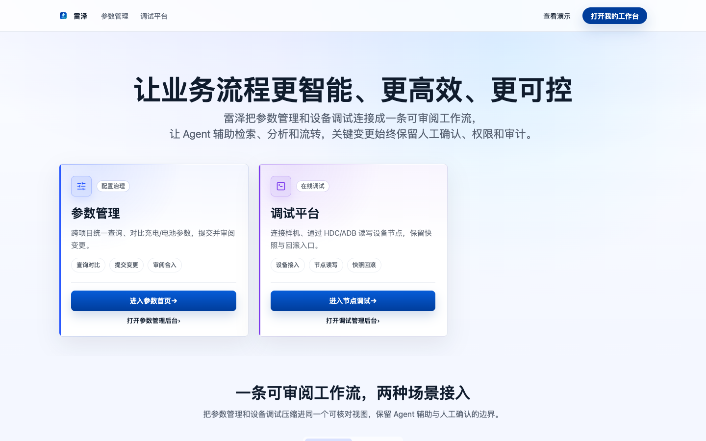

*图 1　平台首页以参数管理和调试平台作为主要业务入口。*

### 1.1 业务背景

工程研发中，参数数值通常容易找到，修改原因和审批进度却未必能一起查到。调试时还要记录目标设备、执行前状态和回读结果。问题解决后，如果结论只留在聊天记录或个人文档中，其他项目遇到类似问题时仍需重新查找和确认。

WiseEff 将这些资料与对应的参数、调试运行和分析记录关联保存。

| 业务问题 | 平台的处理方式 | 团队如何使用 |
| --- | --- | --- |
| 同名参数在不同项目、节点或驱动中含义不同 | 区分参数定义、项目取值及设备节点，保留来源、类型和修订信息 | 查询时核对参数身份，确认讨论的是同一对象 |
| 参数修改需要多人协调，处理进度难以掌握 | 将草稿、提交轮次、硬件检视、软件检视和合入分别记录 | 提交人可以跟踪状态，审阅人可以定位自己负责的事项 |
| 调试记录缺少执行前后的完整背景 | 关联设备、节点、目标值、快照、回读与运行结果 | 便于复现问题、检查效果和判断恢复条件 |
| 日志分析结论与原始材料脱节 | 将结论、证据行、原始日志和后续动作放在同一分析记录中 | 工程师可以直接核对分析依据 |
| 经验分散，后续项目难以复用 | 将分析和调试结论整理为有来源、有修订的知识条目 | 查阅类似案例及其适用条件，作为本次排查的参考 |

### 1.2 服务对象

平台按研发、调试、审阅和管理职责分配功能，具体操作受角色和项目权限约束。

| 使用者 | 主要工作 | 对应能力 |
| --- | --- | --- |
| 硬件开发人员 | 查询配置，提出硬件参数调整，检查设备表现 | 参数工作台、修改草稿、节点调试、日志分析 |
| 软件开发人员 | 维护软件与配置相关参数，推进配置合入 | 参数查询、变更审阅、合入记录、DTS 参数调试 |
| 硬件与软件审阅人员 | 核查修改理由、影响范围与工程约束 | 分阶段审阅、差异查看、退回处理、审阅历史 |
| 调试与测试人员 | 连接设备、采集读数、执行受控调试并检查结果 | 设备 Bridge、HDC / ADB、快照、回读、热重载历史 |
| 知识维护人员 | 整理故障案例、手册与流程规范 | Markdown 编辑、文件条目、发布修订、知识检索 |
| 团队管理员 | 管理组织、成员、参数目录与平台使用 | 管理后台、角色权限、审计中心、反馈管理 |

## 2. 平台能力与业务组织

### 2.1 能力全景

参数管理保存配置及变更，设备调试记录现场操作，日志分析整理问题证据，知识库保存可复用的资料。小泽在授权范围内查询这些信息；组织管理、权限校验和审计服务覆盖各模块。

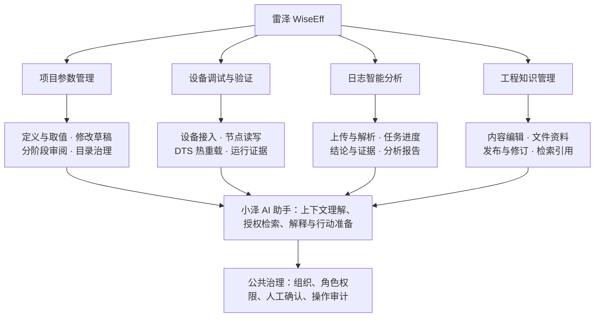
```mermaid
flowchart TB
    W[雷泽 WiseEff]
    W --> P[项目参数管理]
    W --> D[设备调试与验证]
    W --> L[日志智能分析]
    W --> K[工程知识管理]
    P --> P1[定义与取值 · 修改草稿<br/>分阶段审阅 · 目录治理]
    D --> D1[设备接入 · 节点读写<br/>DTS 热重载 · 运行证据]
    L --> L1[上传与解析 · 任务进度<br/>结论与证据 · 分析报告]
    K --> K1[内容编辑 · 文件资料<br/>发布与修订 · 检索引用]
    P1 --> A[小泽 AI 助手：上下文理解、授权检索、解释与行动准备]
    D1 --> A
    L1 --> A
    K1 --> A
    A --> G[公共治理：组织、角色权限、人工确认、操作审计]
```

### 2.2 统一工作台

“我的工作台”根据使用者角色组织指标、待办和业务入口。开发人员可以继续未完成的草稿、补充被退回的修改；审阅人员可以进入当前职责范围内的审阅队列；管理员可以关注导入批次、账号状态和高风险治理事项。

工作台可按项目和时间范围查看数据，切换个人与整体视角。热点信息列出需要关注的项目或参数，指标与待办链接到对应业务页面，便于继续处理。

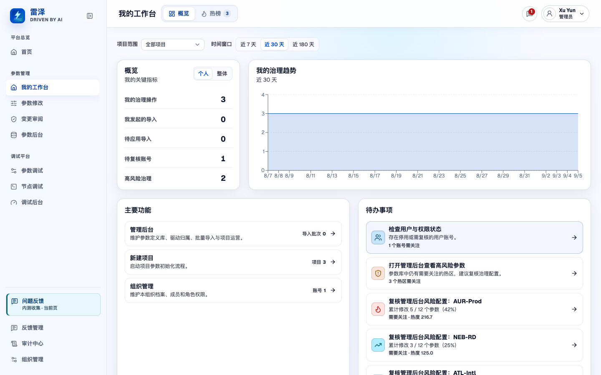

*图 2　管理员视角的工作台，集中呈现治理指标、主要功能与待办事项。*

### 2.3 核心业务对象

参数定义、项目取值和设备观测是不同的信息：定义说明参数的含义，项目取值记录项目采用的配置，设备观测保存设备当时返回的数据。平台分别记录它们的来源与状态，并建立关联供查询。

| 业务对象 | 记录的信息 | 与其他模块的关系 |
| --- | --- | --- |
| 项目 | 项目身份、参数范围与相关业务背景 | 组织参数查询、提交及调试任务 |
| 参数定义 | 参数含义、所属主体、取值形式、修订和生命周期 | 为项目使用、目录治理和知识引用提供明确对象 |
| 项目参数值 | 特定项目中的配置值、来源及变更历史 | 是参数修改与审阅的业务对象 |
| 变更请求与提交轮次 | 修改目标、原因、提交人、流程节点与结论 | 连接工程师、审阅人员和合入人员 |
| 调试运行与快照 | 设备目标、执行内容、观测结果及恢复依据 | 用于复现调试过程、判断结果和整理案例 |
| 日志分析记录 | 原始文件、分析进度、结论、证据与来源 | 支持后续参数修改和知识整理 |
| 知识条目 | 正文、标签、发布状态、不可变修订与来源关联 | 供人员查阅，也供 AI 在授权范围内检索引用 |

设备试验与正式配置各自保留状态。试验值可以继续调整，写入正式项目参数前仍需经过变更流程；分析结论可以先存为知识草稿，经检查发布后再进入正式检索。

## 3. 项目参数管理

参数管理覆盖项目初始化、参数查询、修改提交、分阶段审阅和组织级目录维护。每次变更都关联修改原因、责任人和处理记录。

### 3.1 参数查询与对照

工程师进入项目后，可以按名称、描述或模块检索参数，再按模块、重要性等条件筛选。表格支持排序和列筛选，显示当前值、推荐值、取值范围、单位、来源和更新时间。模块可逐级嵌套，选择父模块时可以同时查看子模块的参数，适用于充电、电池、热管理等分类。

打开单个参数可以查看详情与差异。数组、列表等结构化配置有对应的预览和编辑形式，便于逐项阅读和修改。

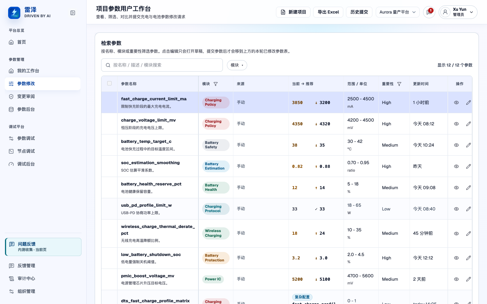

*图 3　项目参数工作台展示参数含义、模块、当前值与推荐值、范围及重要性。*

例如，调整快充电流上限时，还需要检查电池温控目标及项目条件。工程师可在参数页对照相关数值、范围和说明，再确定修改内容。

### 3.2 修改草稿与提交轮次

工程师先录入目标值与修改原因，将需要一起处理的参数加入本轮修改区，检查后整轮提交。准备过程中可以补充草稿，也可以暂存本轮修改。同一次调整涉及的多个参数因此保存在同一轮记录中。

审阅人员查看数值变化时，可以同时阅读修改理由，了解待解决的问题、预期效果及适用条件。提交前，系统检查取值、权限和业务状态。

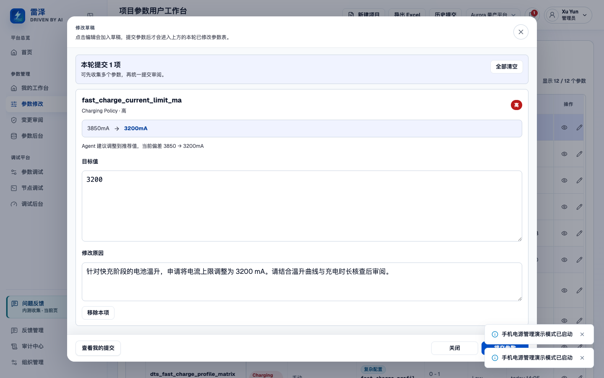

*图 4　修改草稿保留参数身份、当前值、目标值和申请理由，支持集中准备多项修改。*

提交完成后，历史提交页按轮次组织记录，显示参数项、流程状态和处理轨迹。使用者可以查看正在进行的提交，并在允许的状态下撤回；被退回的修改可补充说明后重新发起。

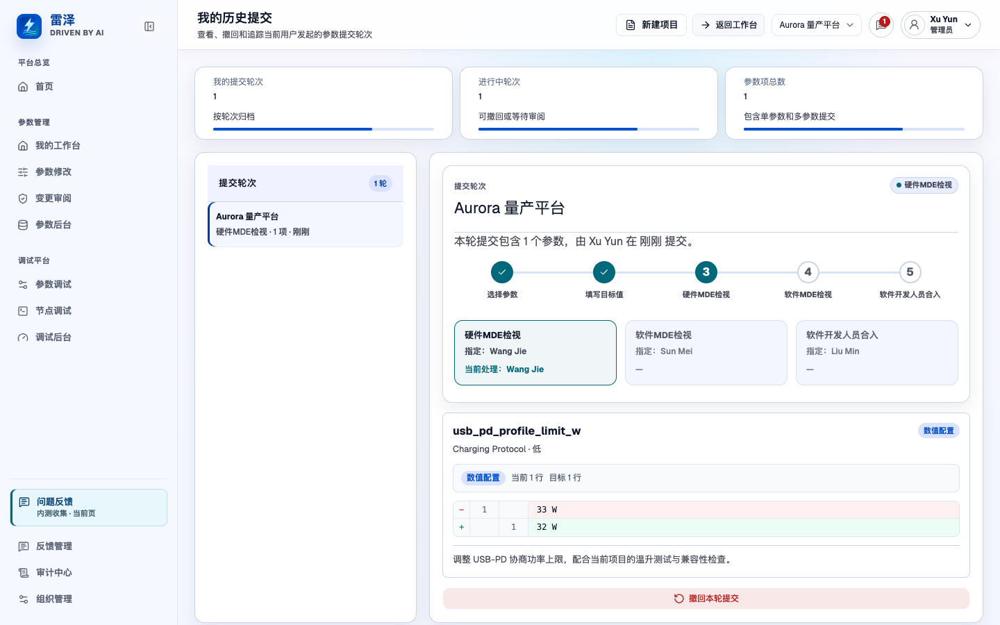

*图 5　历史提交按轮次组织参数修改，便于追踪同一批变更的处理过程。*

### 3.3 硬件检视、软件检视与合入

参数变更依次经过硬件检视、软件检视和软件合入。硬件审阅人员检查硬件条件与配置合理性，软件审阅人员检查实现和配置影响，合入人员确认流程条件后更新库上参数。各角色处理其权限范围内的事项。

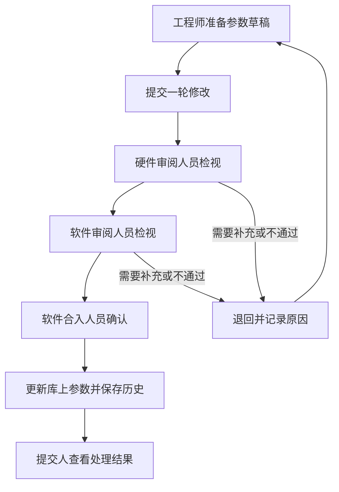
```mermaid
flowchart TB
    A[工程师准备参数草稿] --> B[提交一轮修改]
    B --> C[硬件审阅人员检视]
    C --> D[软件审阅人员检视]
    D --> E[软件合入人员确认]
    E --> F[更新库上参数并保存历史]
    C -->|需要补充或不通过| R[退回并记录原因]
    D -->|需要补充或不通过| R
    R --> A
    F --> H[提交人查看处理结果]
```

审阅工作台左侧是待处理队列，按项目、模块、提交人等信息组织；选中一项后，可以查看变更前后值、审阅摘要、参数含义和影响范围。高风险变更还需要确认风险、理由及相应审阅条件。

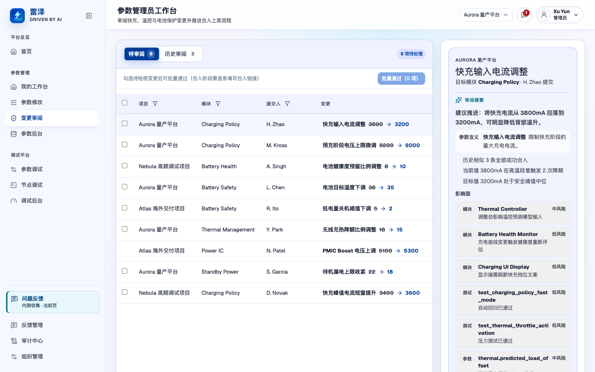

*图 6　审阅队列与变更详情并列呈现，右侧提供审阅摘要和影响信息。*

| 环节 | 需要回答的问题 | 留存的信息 |
| --- | --- | --- |
| 修改申请 | 为什么需要修改，具体改哪些值 | 参数、目标值、原因、提交人和提交轮次 |
| 硬件检视 | 是否符合硬件条件，是否存在相关风险 | 当前流程状态及检视结论 |
| 软件检视 | 是否影响软件使用和配置一致性 | 软件侧检视及退回信息 |
| 软件合入 | 是否满足合入条件，实际合入如何追溯 | 合入状态、合入链接及参数历史 |

### 3.4 参数定义与组织目录

组织目录维护参数定义的身份、所属主体、修订和使用情况。同一定义可供多个项目引用，各项目分别保存自己的配置值。

定义管理页面包含目录列表、定义详情和时间线。管理员可以查看所属主体、取值形式、当前修订，以及收录该定义的目录发布记录；对身份尚未明确的事项进行核查，通过修订流程维护定义内容与状态。时间线保留此前的变化，便于追溯当前定义的形成过程。

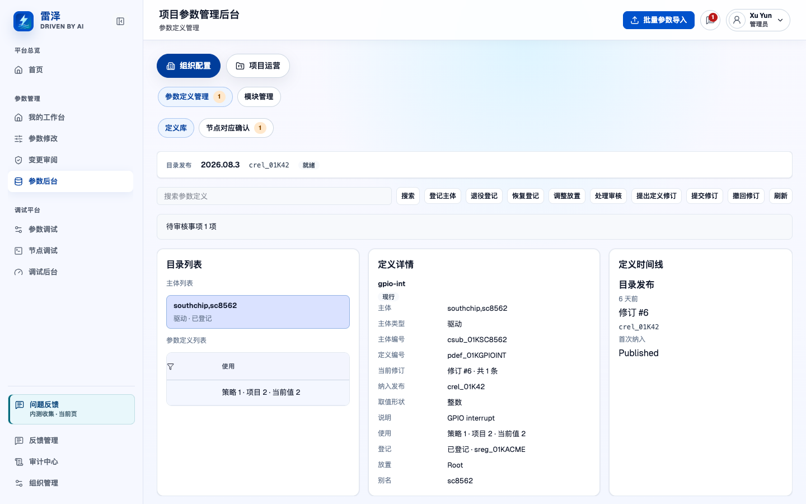

*图 7　参数定义详情关联主体、修订、发布与使用信息，时间线记录目录变化。*

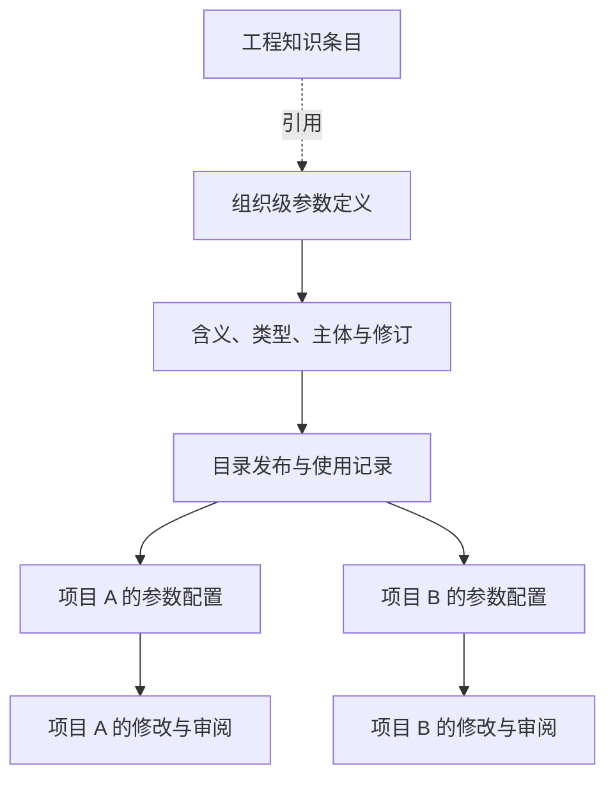
```mermaid
flowchart TB
    A[组织级参数定义] --> B[含义、类型、主体与修订]
    B --> C[目录发布与使用记录]
    C --> D[项目 A 的参数配置]
    C --> E[项目 B 的参数配置]
    D --> F[项目 A 的修改与审阅]
    E --> G[项目 B 的修改与审阅]
    K[工程知识条目] -. 引用 .-> A
```

参数管理与节点调试分别维护自己的模块树，按各自业务需要设置分类和层级。

### 3.5 项目初始化与批量数据处理

新项目初始化时，可以采用已有项目的语义参数快照，也可以从空库开始。系统记录起始配置的来源，待管理员批准初始化后，项目进入常规参数提交阶段。

批量导入时，系统检查文件格式、数据冲突、范围和权限，再由人员核查并应用结果。参数也可以导出，用于数据复核和离线交流。导入导出的历史与审计记录可供后续查询。

项目迭代期间，管理员可根据工作台中的热点和治理信息，查看修改较集中、风险较高或仍有待办的参数，进入对应目录或项目核查。

## 4. 设备调试与参数验证

WiseEff 支持节点调试和 DTS 参数热重载：前者用于读取设备节点、写入目标值并回读，后者用于试验设备树配置。两种方式都记录目标设备、执行过程和结果，供工程师检查效果。

| 维度 | 节点调试 | DTS 参数热重载 |
| --- | --- | --- |
| 操作对象 | 设备上的可访问节点 | 项目中可调试的设备树参数 |
| 工作方式 | 读取节点、准备目标值、确认写入并回读 | 准备候选值、生成并检查调试 Overlay、部署重载 |
| 主要依据 | 节点访问模式、写前快照、写入与回读结果 | 库基线、编译与部署步骤、产物和行为验证 |
| 典型用途 | 检查实时状态、验证单个节点的响应 | 验证一组设备树配置的试验效果 |
| 恢复方式 | 按快照及节点能力执行受控恢复 | 在满足条件时执行恢复基线的补偿性重载 |

### 4.1 设备接入与节点定位

平台通过本地设备代理 Bridge 连接调试目标，支持 HDC / ADB 协议。Bridge 与设备通信，Web 页面显示连接状态和可选目标，并提供调试操作入口。工程师可以在页面上查看当前连接、重新检测设备。

节点按模块树组织，可按名称或标识符（Key）搜索。选中模块后，表格显示节点当前值、目标写入值、状态和操作入口。

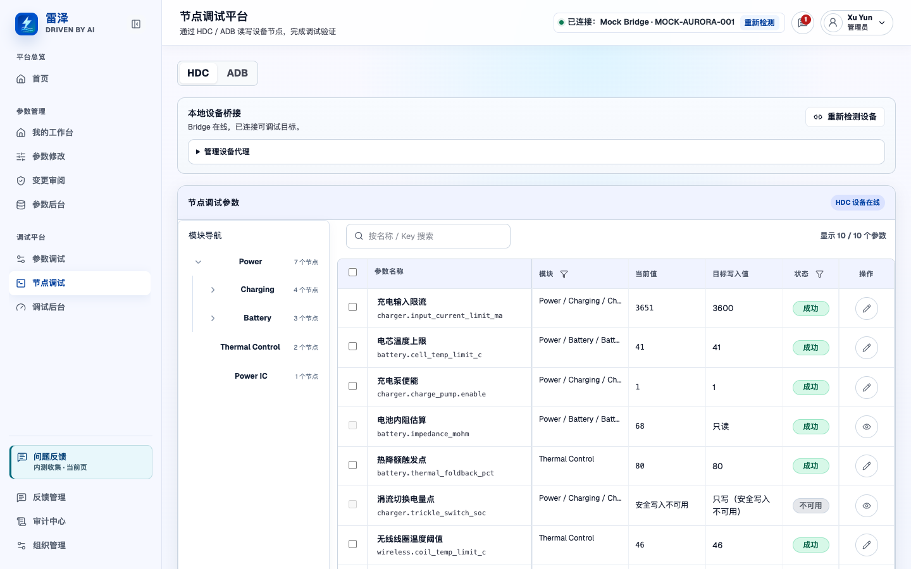

*图 8　节点调试展示设备连接、模块导航、当前值及只读、可写和不可用状态。*

### 4.2 访问能力、写入与写后回读

可执行的操作取决于节点的访问模式。只读节点用于观测；读写节点满足安全写入条件后，可以设置目标值并确认写入。无法取得写前状态时，写入可能受限。页面显示相应限制，服务端校验权限和执行条件。

普通节点写入分别记录命令执行结果和回读观测。例如，目标值为十进制、设备回读为十六进制时，系统保留实际回读内容，不能仅凭文本差异判定写入失败。回读出错时，页面可以保留上次已知值并提示重试；重试只执行读取。

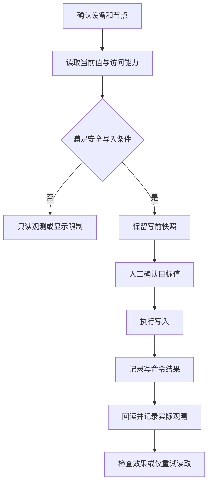
```mermaid
flowchart TB
    A[确认设备和节点] --> B[读取当前值与访问能力]
    B --> C{满足安全写入条件}
    C -->|否| R[只读观测或显示限制]
    C -->|是| D[保留写前快照]
    D --> E[人工确认目标值]
    E --> F[执行写入]
    F --> G[记录写命令结果]
    G --> H[回读并记录实际观测]
    H --> I[检查效果或仅重试读取]
```

调试记录保存设备、用户、节点、写入值、回读结果、耗时和错误信息。恢复操作以写前快照为依据，执行前还需通过相应校验。

### 4.3 DTS 参数热重载

DTS 是设备树源文件，用于描述硬件与驱动配置。使用热重载时，工程师从项目中选择可调试参数、录入试验值，平台生成调试 Overlay，并执行检查、编译与部署。Overlay 是本次试验使用的配置覆盖层。

工作台显示参数名称、节点路径、模块、库上基线和上次重载信息。数组、字符串列表等取值有对应的编辑与检查方式；不支持的取值形式或不满足执行条件的目标，会在执行前提示限制。

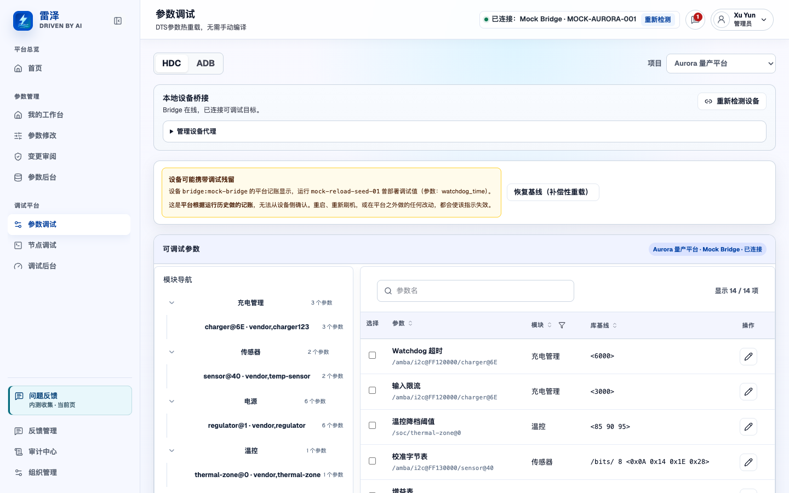

*图 9　参数热重载围绕项目基线准备试验值，并提示设备可能保留的调试状态。*

预检在部署前检查基础设备树、Overlay 和相关执行条件。敏感节点还需要额外确认。调试值用于设备试验，不直接更新项目参数库；如需将结果用于正式配置，可以在满足条件时转为参数草稿，再进入变更审阅。

### 4.4 运行证据与结果判定

每次重载都有独立运行记录，包含目标设备、参数、预检与部署步骤、编译产物及重载证据。部署结果与行为验证结果分别记录：部署成功说明产物已完成传输等部署步骤，候选配置是否生效还需要设备观测来确认。

| 结果类别 | 表达的含义 | 后续处理依据 |
| --- | --- | --- |
| 行为已验证 | 已取得支持候选值生效的观测证据 | 查看对应参数和验证记录，决定是否继续试验或准备正式修改 |
| 无法验证 | 已执行相关步骤，但缺少足够的行为观测 | 补充观测条件，保留未验证结论 |
| 结果矛盾 | 观测结果与预期不一致 | 检查目标、配置与设备行为，分析差异 |
| 已阻断或失败 | 预检、编译、部署等步骤未满足条件或执行失败 | 根据具体失败步骤处理，避免继续错误的部署过程 |

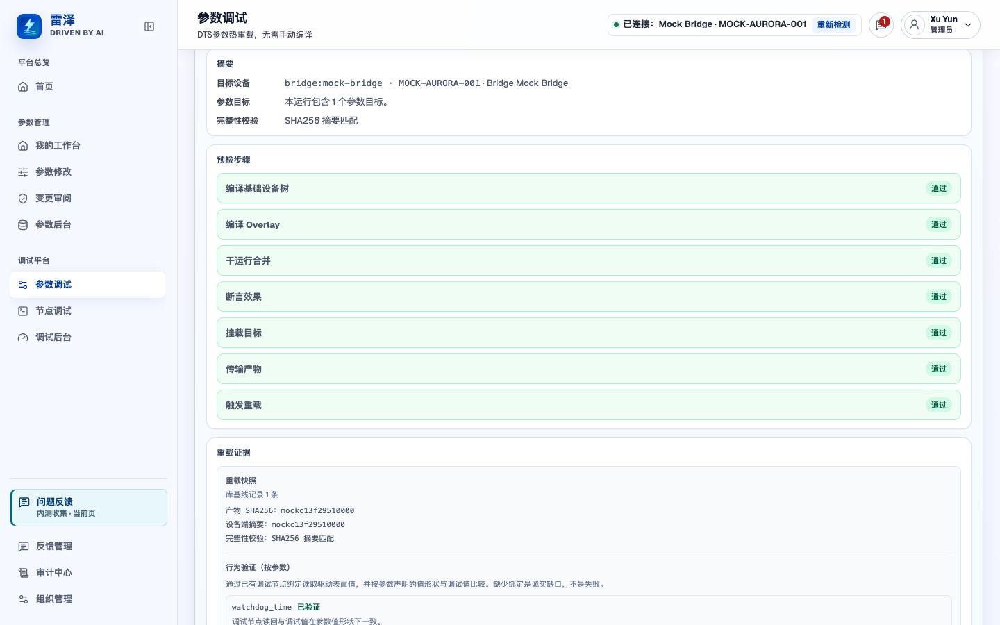

*图 10　运行详情保存预检步骤、产物完整性和按参数组织的行为验证证据。*

设备可能保留此前的试验配置，平台因此提供调试残留提示与恢复基线入口。残留提示来自平台记录；设备重启或在平台之外被修改后，需要重新检查设备状态。运行历史中的成功、失败与无法验证结果，都可成为后续排查及知识整理的材料。

## 5. 日志智能分析

日志分析记录包含原始文件、处理进度、分析结论和证据。工程师可以核对结论引用的日志行，据此准备参数调整、导出报告或整理知识草稿。

### 5.1 日志接入与业务背景

平台支持 `.log`、`.txt`、`.json` 等文本日志。上传时可填写希望分析的问题，并选择日志业务域。业务域定义日志格式和分析重点，例如充电协议、电池状态或热管理；不选择时使用通用分析流程。

文件保存后，系统创建分析记录和任务。历史列表显示文件与处理状态，可切换查看已完成、处理中或失败的分析。

### 5.2 分阶段处理与分析来源

分析依次经过日志解析、模式匹配、根因推断和报告生成。页面显示当前阶段与进度，失败时可查看出错阶段及原因。

大语言模型（LLM）的分析结论需要引用实际存在的日志行。模型服务不可用，或结论未满足证据要求时，系统可回退到规则引擎。页面标明实际分析来源和降级原因，供工程师判断结果的适用范围。

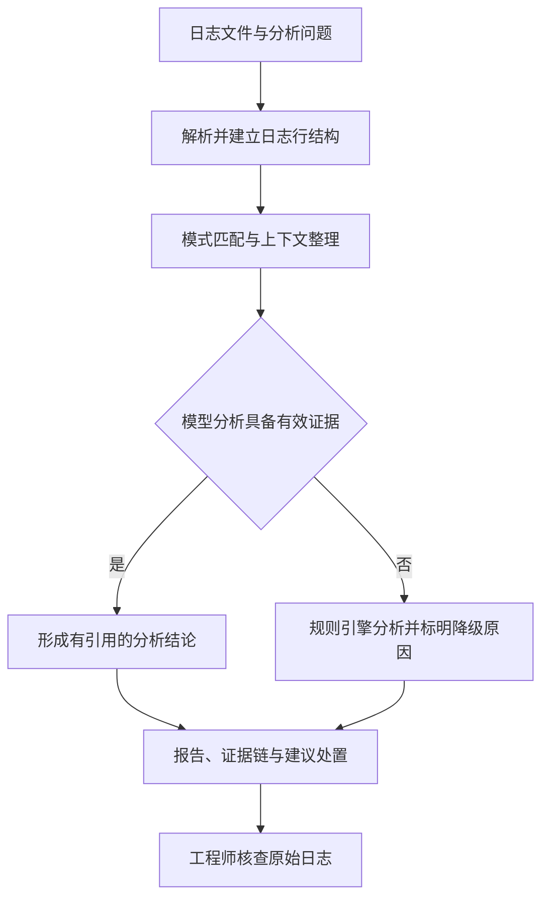
```mermaid
flowchart TB
    A[日志文件与分析问题] --> B[解析并建立日志行结构]
    B --> C[模式匹配与上下文整理]
    C --> D{模型分析具备有效证据}
    D -->|是| E[形成有引用的分析结论]
    D -->|否| F[规则引擎分析并标明降级原因]
    E --> G[报告、证据链与建议处置]
    F --> G
    G --> H[工程师核查原始日志]
```

### 5.3 原始日志与证据链

分析页并列显示结论摘要、阶段状态、原始日志和证据链。工程师可以搜索日志，按时间和模块检查分析引用的事件。证据卡片说明日志与结论的关系，并可显示命中的规则和处理建议。

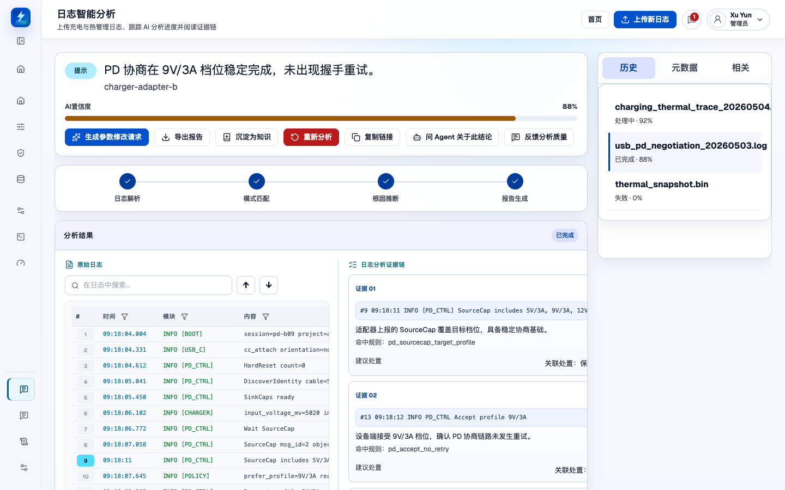

*图 11　日志分析页将结论、原始日志、证据卡片和历史记录放在同一工作区。*

排查充电问题时，工程师往往需要对照协议协商记录、输入电流变化和温度事件。沿证据链查看这些事件的时间与所属模块，可以核查分析结论，并找出仍需设备试验确认的推断。

### 5.4 报告、质量反馈与后续工作

分析结果可以导出为报告，用于问题沟通与留档。工程师也可以根据结论准备参数修改请求，或将已完成的分析整理为知识草稿，保留结论、影响、证据引用与建议动作。

工程师可以反馈结论是否准确、证据是否充分。管理员在日志后台维护业务域，查看分析记录、失败分布和吞吐情况，据此排查处理问题或调整分析配置。

| 分析产出 | 内容 | 后续用途 |
| --- | --- | --- |
| 分析结论 | 问题摘要、严重程度、影响与来源 | 向协作人员说明问题及其影响 |
| 证据链 | 相关日志行、时间、模块和解释 | 核查结论、复现问题、验证假设 |
| 建议处置 | 需要检查的配置或后续行动 | 准备参数变更或设备验证 |
| 知识草稿 | 从分析中整理的结构化内容与来源关联 | 人工检查后发布，供后续项目复用 |

## 6. 工程知识管理

工程知识库保存调参经验、故障案例、硬件手册和流程规范，供组织成员共享。标签标注项目或主题，发布状态区分待整理资料与可正式检索的内容。

### 6.1 条目与文件资料

知识条目有两种形式。经验总结、操作规范和案例说明可用 Markdown 编写，在分栏界面中编辑并预览；已有资料可保存为文件条目，由服务端提取正文用于检索。文件列表显示提取中、成功或失败状态。

每个条目都记录标题、标签、创建与更新时间、来源和修订版本。成员可按主题查找资料，通过项目标签了解适用背景。

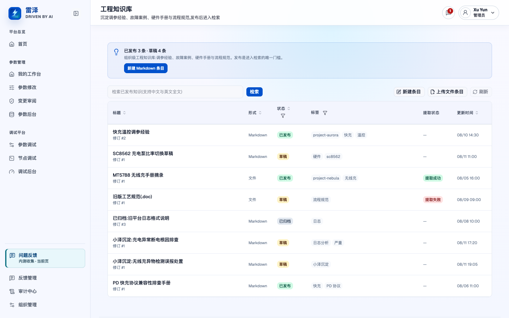

*图 12　知识列表同时呈现内容形式、发布状态、标签与文件提取状态。*

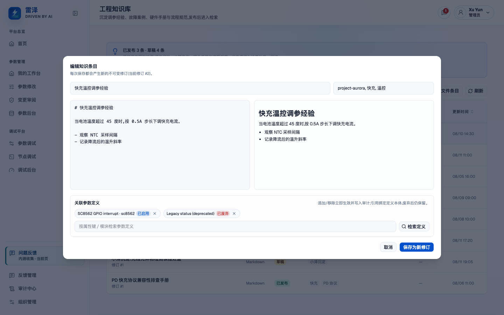

*图 13　知识编辑器支持正文预览、标签维护和关联参数定义。*

### 6.2 发布、修订与归档

知识条目有草稿、已发布和已归档三种状态，只有已发布内容参与正式知识检索。每次保存都会生成修订版本，历史修订不可覆盖。恢复历史内容时也生成新修订，可以继续追溯此前的编辑过程。

多人编辑同一条目时，系统会核对编辑所依据的版本。内容已被他人更新时，编辑者需先处理冲突再保存。过时条目可归档，维护人员仍可按权限查看历史或恢复。

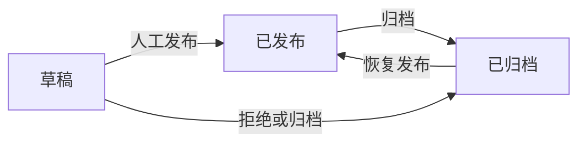
```mermaid
flowchart LR
    D[草稿] -->|人工发布| P[已发布]
    P -->|归档| A[已归档]
    A -->|恢复发布| P
    D -->|拒绝或归档| A
```

### 6.3 检索与参数关联

已发布内容支持全文检索。配置相应服务和索引后，还可使用语义检索查找措辞不同但主题相关的资料。语义检索条件不足时使用全文检索，页面显示实际采用的模式。

知识条目可引用参数定义，读者点击引用即可查看定义的含义与状态。参数定义详情也会列出引用它的已发布知识。定义废弃后，既有引用继续保留并标明状态，方便阅读历史案例时核对。

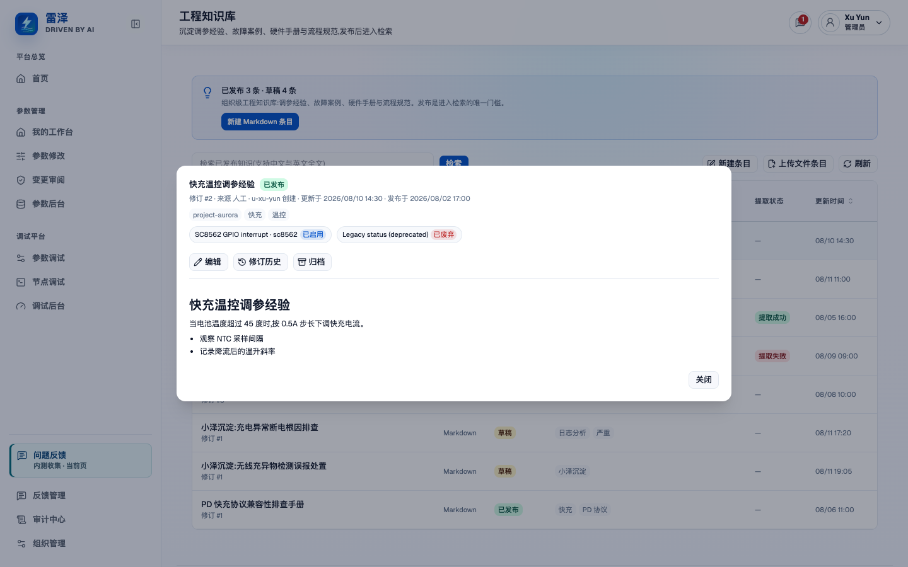

*图 14　条目详情呈现来源、修订、正文和关联参数，并区分有效与已废弃的定义。*

### 6.4 将分析与调试记录整理为知识

已完成的日志分析可以生成知识草稿，预填结论、影响、证据行与处理建议。DTS 重载记录也可以转为草稿，并关联原始运行。对于失败或无法验证的调试，草稿可记录已尝试的配置、缺少的观测条件和未解决的问题，供后续排查参考。

小泽还可以在获得批准后将会话结论创建为新草稿。AI 草稿保留创建人和会话来源，进入人工检查与发布环节。发布后的内容可以被人员检索，也可作为小泽回答问题时的引用来源。

知识后台集中管理 AI 草稿、归档内容和检索索引。管理员检查草稿来源后，可以发布，或拒绝并归档；索引失败时，可查看原因并按需重试或重建。

## 7. 小泽 AI 助手

小泽是 WiseEff 的跨模块 AI 助手，可根据当前页面和业务对象处理问题。它通过授权工具查询项目概况、参数、节点快照、近期日志结论和已发布知识，协助工程师核查配置、分析问题并准备变更。

### 7.1 结合页面上下文理解问题

工程师在参数页询问配置原因时，小泽可使用当前项目和选中参数作为背景；在日志页询问异常时，则可参考页面提供的分析记录。上下文还包含角色和可见对象，使用者可以围绕当前工作直接提问。

需要其他模块的信息时，小泽通过服务端工具查询。查询范围受使用者的组织、项目及业务权限约束，回答中的引用可用于查看原始材料。

### 7.2 检索、解释与行动准备

| 能力 | 具体作用 | 与业务流程的连接 |
| --- | --- | --- |
| 参数理解 | 按条件查找参数，解释当前配置和相关信息 | 帮助准备修改依据与目标值 |
| 跨模块查询 | 获取有权限访问的节点快照和日志结论 | 将配置问题与设备、日志背景联系起来 |
| 知识检索与引用 | 查找已发布资料，读取条目并展示来源 | 根据引用核查答案依据 |
| 参数变更准备 | 提出带目标值、理由和引用的修改申请 | 经人工确认创建变更请求，继续常规审批 |
| 知识草稿创建 | 将会话结论整理成标题、标签与正文 | 经批准创建草稿，再由人员发布 |

例如，工程师询问某项目的充电问题时，小泽可以检索相关参数与近期日志结论，列出需要检查的配置，并提出附有理由的变更申请。工程师核对引用、目标值和项目条件后，决定是否发起变更。

### 7.3 人工确认与业务审批

小泽提交参数变更前，需要人工确认项目、参数、目标值和修改理由。工程师可以调整目标值，也可以拒绝建议。批准后，系统创建变更请求，继续执行相应的审阅与合入流程。

知识内容分两步处理：使用者批准创建草稿后，有发布权限的人员再检查并发布。内容进入正式检索前，由发布者确认其准确性和适用范围。

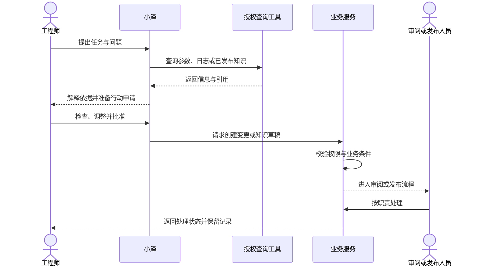
```mermaid
sequenceDiagram
    actor U as 工程师
    participant A as 小泽
    participant T as 授权查询工具
    participant B as 业务服务
    actor R as 审阅或发布人员
    U->>A: 提出任务与问题
    A->>T: 查询参数、日志或已发布知识
    T-->>A: 返回信息与引用
    A-->>U: 解释依据并准备行动申请
    U->>A: 检查、调整并批准
    A->>B: 请求创建变更或知识草稿
    B->>B: 校验权限与业务条件
    B-->>R: 进入审阅或发布流程
    R->>B: 按职责处理
    B-->>U: 返回处理状态并保留记录
```

### 7.4 AI 内容的来源与责任

核查小泽的回答时，可以查看所引用的知识和业务对象。涉及变更的工具调用经过授权与人工确认，并记录操作结果。模型服务异常时，错误或降级状态也需明确呈现。

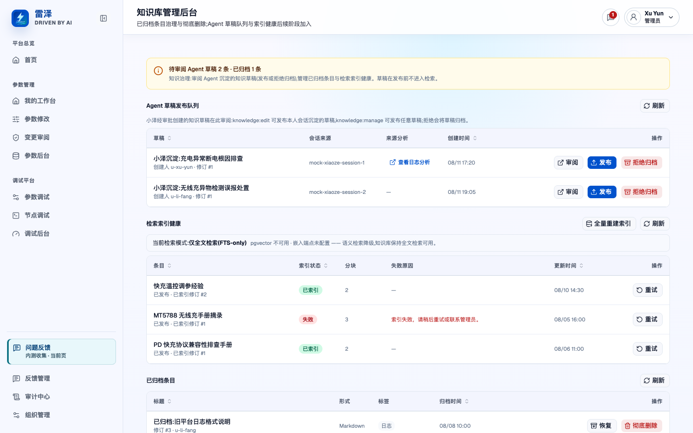

*图 15　AI 草稿发布队列保留创建者、会话与分析来源，并提供人工审阅、发布和拒绝入口。*

工程师与审阅人员负责判断配置是否适用、设备操作是否满足条件，以及知识内容是否可以发布。

## 8. 组织协作与管理治理

### 8.1 组织、成员与角色

组织管理包含组织档案、成员、角色和注册申请。管理员可按硬件开发、软件开发、审阅等职责分配权限，启用或停用成员账号。页面按权限显示业务入口，服务端校验实际数据访问与写操作。

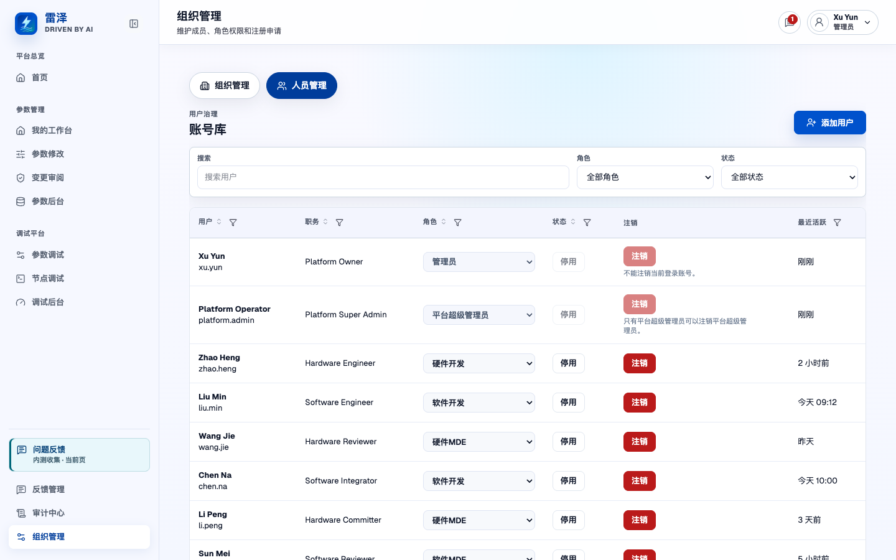

*图 16　人员管理按成员呈现账号、职责、角色与状态。*

角色权限还受资源范围限制。参数编辑人员在获授权的项目内操作；知识编辑人员通常管理自己的内容，知识管理员负责组织范围内的内容管理。AI 工具沿用使用者的访问权限。

### 8.2 审计与责任追溯

审计中心汇集参数、日志、调试、AI 助手及用户管理的操作记录，可按操作、操作人、类型、模块、项目和时间查询，也可导出。

复盘问题时，团队可通过审计记录按时间核对参数修改、设备操作和权限变化，再进入关联业务记录查看处理详情。

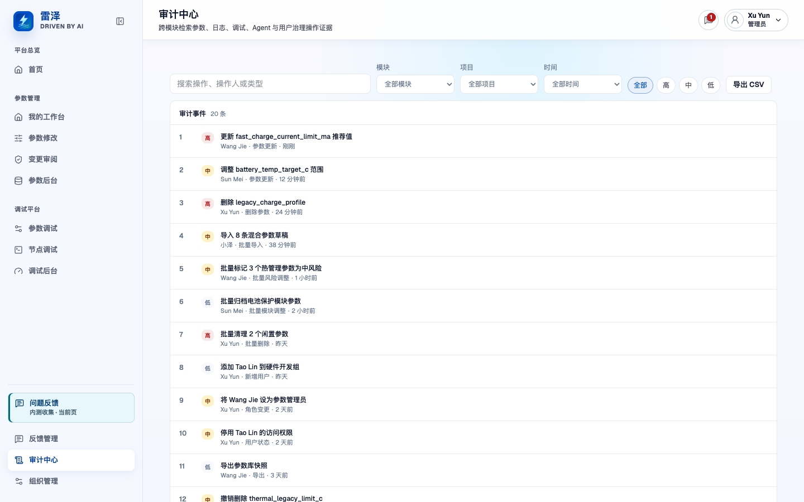

*图 17　审计中心汇集跨模块事件，并提供项目、时间和类型筛选。*

### 8.3 模块管理与运行观察

各业务模块提供对应管理能力。参数后台维护定义、模块与项目数据；调试后台管理节点目录与重载配置；日志后台关注业务域、分析记录及处理情况；知识后台维护发布、归档和索引状态。

管理员可据此查询待审核事项、定位处理失败的步骤，并核查需要调整的配置。

### 8.4 产品反馈

使用者可以从当前页面打开问题反馈，选择体验问题、数据问题、导出或提交异常、功能建议等类型，填写描述并附上截图。反馈携带页面信息，便于处理人员定位场景。

管理员在反馈管理中筛选记录、查看附件、补充处理备注，并将反馈更新为待处理、处理中或已关闭。

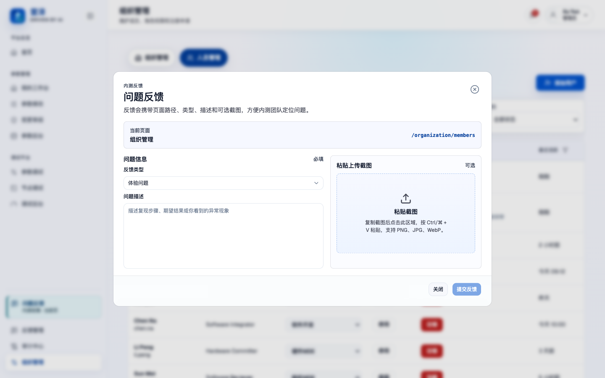

*图 18　反馈表单保留所在页面，并支持描述问题与附加截图。*

## 9. 技术架构与部署形态

### 9.1 系统组成

WiseEff 使用 React、TypeScript 和 Vite 构建 Web 前端，后端按参数、日志、调试、知识、Agent、认证和审计等业务模块组织。PostgreSQL 保存业务数据与历史记录，对象存储保存日志、知识文件和相关产物。

耗时的日志分析与知识索引通过后台任务处理，队列支持 Redis / BullMQ。设备操作通过设备 Bridge 与目标连接；模型服务通过独立接口接入，知识语义检索使用嵌入服务与相应索引。

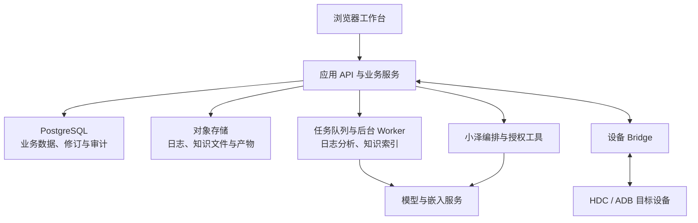
```mermaid
flowchart TB
    U[浏览器工作台] --> S[应用 API 与业务服务]
    S --> P[PostgreSQL<br/>业务数据、修订与审计]
    S --> O[对象存储<br/>日志、知识文件与产物]
    S --> Q[任务队列与后台 Worker<br/>日志分析、知识索引]
    Q --> M[模型与嵌入服务]
    S --> A[小泽编排与授权工具]
    A --> M
    S <--> B[设备 Bridge]
    B <--> D[HDC / ADB 目标设备]
```

前端通过业务 API 访问服务端数据，由服务端实施权限控制。设备 Bridge 和模型接口分别负责设备通信与模型调用，连接状态和服务配置可独立检查。

### 9.2 自托管与运行管理

项目支持 Linux 自托管，以容器部署应用、数据库、队列及相关服务，并配有身份接入、健康检查、日志与指标、备份恢复和升级回滚方案。

| 运行领域 | 主要支持 | 部署时需要确定的内容 |
| --- | --- | --- |
| 身份与访问 | 本地账号、OIDC 接入及角色权限 | 身份来源、组织成员及授权规则 |
| 数据与文件 | PostgreSQL 与对象存储 | 数据持久化、备份及恢复安排 |
| 异步处理 | Worker 与 Redis / BullMQ 队列 | 任务容量、服务连接及失败处理 |
| 模型能力 | 对话模型与嵌入服务接口 | 模型服务、访问配置和知识索引能力 |
| 设备连接 | Bridge、HDC / ADB 与受控调试 | 设备可达性、节点访问和重载适配条件 |
| 运行观察 | 健康状态、指标及监控组件 | 运维访问、告警及故障处理安排 |

### 9.3 当前产品范围

当前版本以参数管理和设备调试作为首页及主导航入口；日志分析和工程知识库保留独立业务页面。小泽会话在 API 模式接入模型服务，知识语义检索依赖嵌入服务与索引条件，设备读写和热重载依赖相应 Bridge 与目标设备适配。

现有部署方案和服务接口可用于受控环境下的试点集成。投入使用前，需在目标环境验证身份接入、数据服务、设备连接和模型服务，并确定容量、备份恢复与运行维护安排。

---

**版本与图示说明**：本文介绍 2026 年 9 月版本的产品能力。界面图片均为应用实际运行截图，采用内置示例数据；图中的人员、参数建议、设备状态和分析数值用于说明功能，不代表客户数据、真实设备试验或模型效果评测。流程图描述业务职责与信息关系，具体执行受权限和运行条件约束。
