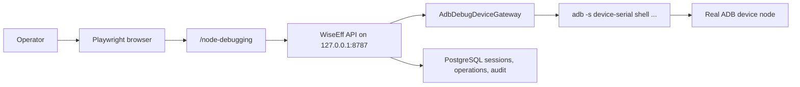

# ADB Real Device Full-Chain Test Design

> Chinese: [Chinese](../../zh-CN/superpowers/specs/2026-06-21-adb-real-device-full-chain-test-design.md)

Date: 2026-06-21
Status: Approved for implementation planning

## Context

WiseEff now has protocol-aware debugging support for HDC and ADB. Current coverage proves the pieces separately:

- ADB gateway unit tests cover command construction, target parsing, timeout handling, write readback, and failure normalization.
- Frontend tests cover the `/node-debugging` HDC/ADB protocol switch and UI state.
- HDC has a real-device API-level device-lab acceptance path.

The missing evidence is an ADB real-device full-chain test from the frontend through the WiseEff API to an actually connected ADB device.

## Decisions

- Add an explicit local ADB device-lab acceptance path.
- Default the device-lab test to read-only behavior.
- Run write/readback/rollback only when an explicit write enable flag and approved write values are configured.
- Use existing ADB parameter bindings for the first implementation. The first version does not create or mutate parameter-node bindings.
- Keep all device operations behind WiseEff backend APIs. Tests must not directly write device nodes through `adb shell`.
- Keep this out of default CI because it requires local hardware and operator approval.

## Goals

- Prove that `/node-debugging` can switch to ADB, detect a real ADB target, and establish an ADB-backed debugging session.
- Prove that the backend reads a configured parameter node from the real device through `AdbDebugDeviceGateway`.
- Capture reproducible browser/API/audit evidence for the ADB path.
- Provide an optional, explicitly gated write/readback/rollback loop for safe lab nodes.
- Document how to run the test locally with a connected ADB device.

## Non-Goals

- Do not make ADB hardware a default CI requirement.
- Do not auto-create or edit ADB node bindings in the first implementation.
- Do not expose raw node path editing in the normal `/node-debugging` workflow.
- Do not perform any write unless the operator explicitly enables write mode and provides approved values.
- Do not support remote target-environment ADB device labs in the first implementation.

## Existing Coverage Answer

There is no current automated test that covers a real ADB device from the frontend to the backend to the hardware. Existing ADB coverage is unit/API-contract oriented, while existing real hardware acceptance is HDC-only and API-level.

## Architecture

The device-lab flow runs locally:



The primary test should live at:

```text
e2e/acceptance/adb-device-lab.acceptance.spec.ts
```

It should follow the existing HDC device-lab style, but include frontend interaction:

1. Open `/node-debugging?project=$ADB_SMOKE_PROJECT_ID`.
2. Switch the protocol segmented control to ADB.
3. Trigger target detection or redetection.
4. Verify the page reaches an ADB connected/detected state for `ADB_SMOKE_TARGET_REF`.
5. Read the configured parameter node through the WiseEff API path.
6. Verify operation, audit, and evidence metadata.

## Configuration

Required read-only inputs:

```bash
DEBUG_DEVICE_GATEWAY_MODE=adb
ADB_DEVICE_LAB_AVAILABLE=true

ADB_SMOKE_PROJECT_ID=aurora
ADB_SMOKE_DEVICE_ID=device-aurora-adb
ADB_SMOKE_TARGET_REF=emulator-5554
ADB_SMOKE_PARAMETER_ID=dbg-fast-charge-current
ADB_SMOKE_NODE_PATH=/sys/class/power_supply/battery/current_now
ADB_SMOKE_USER_ID=u-xu-yun
```

Optional read assertion:

```bash
ADB_SMOKE_EXPECT_READ_PATTERN=^-?[0-9]+$
```

Optional write mode inputs, all explicitly set by the operator:

```bash
ADB_SMOKE_ENABLE_WRITE=true
ADB_SMOKE_WRITE_VALUE=3100
ADB_SMOKE_CONFIRM_WRITE=confirm-high-risk-write
ADB_SMOKE_CONFIRM_ROLLBACK=confirm-rollback
```

## Safety Rules

- The test must check `adb devices` before running the lab flow. The target serial must be present in `device` state.
- `unauthorized`, `offline`, absent, or duplicate target states must fail early with an actionable message.
- Read-only mode must not call `/api/v1/debugging/nodes/write`.
- Write mode must first read and preserve the original value.
- Write mode must write only through the WiseEff API.
- Write mode must require readback equality.
- Write mode must always attempt snapshot rollback when a snapshot is produced.
- Write mode must perform a final read and require the original value to be restored.
- The test must record when optional failure simulations, such as offline or timeout behavior, are skipped.

## Test Flow

### Read-Only Flow

1. Validate environment variables.
2. Run an ADB preflight for `ADB_SMOKE_TARGET_REF`.
3. Prepare the usual M0/M1/M3 debugging seeds and permissions.
4. Do not modify the configured parameter binding.
5. Start from `/node-debugging?project=$ADB_SMOKE_PROJECT_ID`.
6. Select ADB in the protocol switch.
7. Redetect targets.
8. Assert that an ADB target/session is visible in the UI.
9. Read the configured parameter through the existing backend debugging API.
10. Assert `operation.status = "succeeded"` and `readValue` is a string.
11. If `ADB_SMOKE_EXPECT_READ_PATTERN` is present, match the read value.
12. Query audit or operation evidence and record protocol, target, parameter, and request metadata.

### Optional Write Flow

Only run this when `ADB_SMOKE_ENABLE_WRITE=true`.

1. Store the read-only flow's original value.
2. Write `ADB_SMOKE_WRITE_VALUE` through `/api/v1/debugging/nodes/write`.
3. Assert `status = "succeeded"`, `verified = true`, `readbackValue = ADB_SMOKE_WRITE_VALUE`, and `snapshotId` exists.
4. Roll back the snapshot with explicit `ADB_SMOKE_CONFIRM_ROLLBACK`.
5. Assert rollback operation succeeds and is verified.
6. Read the node again and assert it equals the original value.

## Evidence

Add a new operation evidence id:

```text
ADB-LAB-001
```

The evidence record should include:

- browser route and viewport,
- Playwright trace/report/screenshot references,
- console and network diagnostic status,
- API method/path/status summaries,
- request id shape when available,
- shape summaries for project id, device id, target ref, parameter id, and node path presence,
- read value shape or pattern result,
- write value, previous value, readback value, rollback result, and final restoration as shapes/status/equality summaries when write mode runs,
- audit event summary for detection/session/read and write/rollback when applicable.

The evidence must not publish raw ADB serials, raw node paths, raw read/write values, or raw operation/session/snapshot/request/audit identifiers.

## Documentation Impact

Add:

- `docs/runbooks/adb-device-lab.md`
- `docs/zh-CN/runbooks/adb-device-lab.md`

Update:

- `docs/developer/verification-matrix.md`
- `docs/zh-CN/developer/verification-matrix.md`
- `docs/runbooks/manual-acceptance.md`
- `docs/zh-CN/runbooks/manual-acceptance.md`
- acceptance operation/coverage metadata if the implementation touches those generated gates.

## Run Command

The first implementation should support:

```bash
npm run acceptance:e2e -- e2e/acceptance/adb-device-lab.acceptance.spec.ts
```

If the implementation adds a convenience wrapper, it should remain explicit, for example:

```bash
npm run acceptance:adb-device-lab
```

## Acceptance Criteria

- With a connected ADB device and read-only variables set, the lab test proves browser-to-API-to-device node read.
- Without `ADB_DEVICE_LAB_AVAILABLE=true`, the test skips with a clear message.
- Without `ADB_SMOKE_ENABLE_WRITE=true`, no write or rollback request is sent.
- With write mode variables set against a safe node, the test writes, verifies readback, rolls back, and verifies restoration.
- Failure output clearly distinguishes missing env, missing ADB command, unauthorized/offline device, unsupported protocol, missing binding, read failure, write failure, readback mismatch, and rollback failure.
- The generated evidence is sufficient for a reviewer to reproduce the run and inspect the route, API calls, DB/audit state, and hardware target identity.
