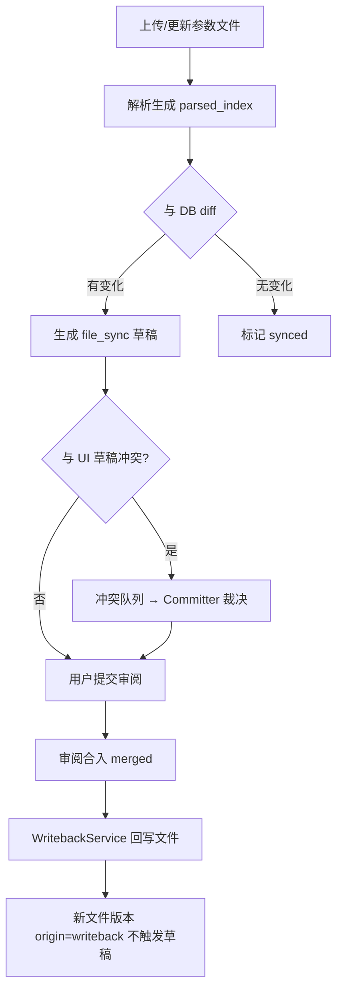

# 项目参数文件（DTS/JSON）维护与参数来源 — 设计规格

> English: 暂无独立英文版；实现计划与 API 契约以仓库内现有英文文档为准。  
> 关联：`docs/zh-CN/superpowers/specs/2026-07-06-parameter-batch-import-design.md`、TD-035

**日期：** 2026-07-11  
**状态：** 已实现（P1）；P2 见 TD-039  
**实现计划：** `docs/exec-plans/active/2026-07-11-project-parameter-files.md`  
**入口：** `/parameter-admin/projects` → 项目详情「参数文件」Tab；`/parameters` 来源列；冲突面板  
**关联域：** M1 参数管理、`project_parameter_values`、现有审阅工作流、对象存储

---

## 1. 背景与问题

当前参数管理以数据库为真源：组织级参数定义 + 项目级参数值，经草稿 → 提交 → 审阅 → 合入。DTS/JSON 仅作为**一次性导入源**（批量导入向导）或复杂值的展示形态，存在以下缺口：

1. **无项目参数文件实体**：无法为项目长期维护 `.dts` / `.json` 文件，也无版本历史与下载。
2. **无参数来源字段**：导入时的 `sourceFormat` / `sourceLocation` 为瞬态；`project_parameter_values` 不记录参数来自哪个文件的哪个节点。
3. **无双向同步**：文件变更不能自动驱动草稿；审阅合入也不能回写文件。
4. **多文件场景未建模**：实际项目常按模块/子系统拆分多个配置文件（如 `battery.dtsi`、`power.json`）。

团队工作流要求：**文件为真源、一对一映射、双向同步、仍走审阅流、冲突人工裁决**。

---

## 2. 需求决策记录

Brainstorming 阶段已确认：

| 维度 | 决策 |
|------|------|
| 文件角色 | 真源，双向同步 |
| 映射关系 | 一对一：每个 DTS property / JSON key → 一行参数 |
| 文件 → DB | 解析 diff 后自动产生草稿（`origin=file_sync`），仍须提交 + 审阅合入 |
| DB → 文件 | 合入成功后自动回写对应节点，生成新文件版本 |
| 文件托管 | WiseEff 内部对象存储 + 不可变版本历史 |
| 文件数量 | 每项目多文件（按模块/子系统拆分） |
| 参数来源字段 | 最小集：`source_file_name` + `source_node_path` |
| 冲突处理 | 同参数存在 file 草稿 + UI 草稿时，Committer 人工裁决保留哪方 |
| 文件更新方式 | 首版通过重新上传；不做在线编辑器 |

---

## 3. 目标

1. 为每个项目维护多个 DTS/JSON 参数文件，支持上传、版本历史、下载。
2. 文件上传/更新后自动解析，与 DB 当前值 diff，为有变化的参数生成 `file_sync` 草稿。
3. 在 `project_parameter_values` 增加来源字段（文件名 + 节点路径），参数列表与详情可展示。
4. 审阅合入后自动回写来源文件对应节点，生成新文件版本（写回版本不触发新草稿）。
5. 文件草稿与 UI 草稿冲突时进入裁决队列，Committer 选择后单方草稿解冻可提交。
6. 完整审计：文件版本、同步、冲突裁决、写回均记 audit。

## 4. 非目标（P1 不做）

- Git 仓库对接与 webhook 触发（P3）。
- 文件在线编辑器（P2 可选）。
- DTS 完整 AST 级写回（P2，衔接 TD-035）。
- 自动删除库中参数（文件删除节点仅标记「来源失联」）。
- 修改审阅工作流状态机（沿用现有 `hardware_review → software_review → software_merge → merged`）。
- 单文件多项目混合（一份文件仅属一个项目）。

---

## 5. 方案选型

### 5.1 候选方案

| 方案 | 概要 | 结论 |
|------|------|------|
| 一、扩展批量导入 | 把文件当可重复导入源，复用 ImportWizard | 文件非一等公民，难做版本管理与回写；**不采用** |
| 二、项目参数文件子域 | 新实体 + 同步引擎 + 冲突队列 + 写回服务 | **P1 采用** |
| 三、AST 索引 + 节点 patch | 在方案二上加结构化 AST 写回 | **P2 增强** |

### 5.2 推荐架构

```text
┌─────────────────────────────────────────────────────┐
│  UI: 项目文件管理 / 参数来源列 / 冲突裁决面板        │
├─────────────────────────────────────────────────────┤
│  API: files CRUD / sync / conflicts / writeback     │
├─────────────────────────────────────────────────────┤
│  Sync Engine                                        │
│   ├─ FileParser (json | dts)                        │
│   ├─ PathMapper (nodePath → name + module)          │
│   ├─ DiffService (file version vs DB current)       │
│   ├─ DraftGenerator (origin=file_sync)              │
│   └─ WritebackService (merge → patch file)          │
├─────────────────────────────────────────────────────┤
│  Storage: object store (file bytes) + PostgreSQL    │
└─────────────────────────────────────────────────────┘
```

---

## 6. 数据模型

### 6.1 `project_parameter_files`

| 字段 | 类型 | 说明 |
|------|------|------|
| `id` | text PK | |
| `organization_id` | text FK | |
| `project_id` | text FK | |
| `file_name` | text | 如 `battery.dtsi`，项目内唯一 |
| `format` | text | `dts` \| `json` |
| `module_hint` | text nullable | 可选，关联 `parameter_modules.id` |
| `current_version_id` | text nullable FK | 最新版本 |
| `enabled` | boolean | 禁用后不参与自动同步 |
| `created_at`, `updated_at` | timestamptz | |

索引：`(project_id, file_name)` unique；`(organization_id, project_id)`。

### 6.2 `project_parameter_file_versions`

| 字段 | 类型 | 说明 |
|------|------|------|
| `id` | text PK | |
| `file_id` | text FK | |
| `version_number` | integer | 从 1 递增 |
| `storage_key` | text | 对象存储路径 |
| `checksum` | text | |
| `size_bytes` | bigint | |
| `parsed_index` | jsonb | `{ "battery/temp_max": { "value": "85", "line": 42 } }` |
| `origin` | text | `upload` \| `writeback` |
| `created_by_user_id` | text FK nullable | writeback 时为合入操作者 |
| `created_at` | timestamptz | |

索引：`(file_id, version_number)` unique。

### 6.3 `project_parameter_values` 扩展

| 新字段 | 类型 | 说明 |
|--------|------|------|
| `source_file_name` | text nullable | 如 `battery.dtsi` |
| `source_node_path` | text nullable | 如 `battery/temp_max` |

来源挂在**项目值**而非定义：同一定义在不同项目可来自不同文件。无来源表示手动维护参数。

索引（可选）：`(project_id, source_file_name, source_node_path)` 用于同步定位。

### 6.4 `parameter_drafts` 扩展

| 新字段 | 类型 | 说明 |
|--------|------|------|
| `origin` | text | `manual`（默认）\| `file_sync` |
| `origin_file_version_id` | text FK nullable | 文件同步来源版本 |

### 6.5 `parameter_file_sync_conflicts`

| 字段 | 类型 | 说明 |
|------|------|------|
| `id` | text PK | |
| `organization_id`, `project_id` | text FK | |
| `project_parameter_value_id` | text FK | |
| `parameter_definition_id` | text FK | |
| `file_version_id` | text FK | 触发冲突的文件版本 |
| `file_draft_id` | text FK | file_sync 草稿 |
| `ui_draft_id` | text FK | manual 草稿 |
| `file_value` | text | |
| `ui_draft_value` | text | |
| `status` | text | `open` \| `resolved_file` \| `resolved_ui` |
| `resolved_by_user_id` | text FK nullable | |
| `resolved_at` | timestamptz nullable | |
| `created_at` | timestamptz | |

---

## 7. 路径映射与解析

### 7.1 解析器

| 格式 | P1 策略 | 复用 |
|------|---------|------|
| JSON | 扁平化 key path：`power.battery.temp_max` → `power/battery/temp_max` | 扩展 `parseJson.ts` |
| DTS | property 路径：`battery { temp_max = <85>; }` → `battery/temp_max` | 扩展 `parseDtsFragment.ts`；完整文件解析衔接 TD-035 |

### 7.2 nodePath → 参数行

| 推导字段 | 规则 |
|----------|------|
| `name` | nodePath 最后一段 |
| `module` | nodePath 去掉最后一段；匹配组织 `parameter_modules` 树 |
| `currentValue` | 解析原始值字符串 |
| `valueKind` | 含 `<...>` 或多行结构 → `complex`，否则 `scalar` |

### 7.3 库匹配

1. 优先：`source_file_name` + `source_node_path` 精确匹配已有项目值。
2. 其次：`name` + `module` 匹配参数定义（与批量导入一致）。
3. 无定义：进入「新增参数候选」，需管理员确认创建。

---

## 8. 文件 → 草稿同步流

### 8.1 触发

| 操作 | 行为 |
|------|------|
| 上传新文件 | 创建 file + v1，`origin=upload`，立即同步 |
| 上传新版本 | 创建 v(n+1)，与 DB diff |
| `POST .../sync` | 对当前版本手动重跑 diff |
| 禁用文件 | 不再自动同步；已绑定来源保留 |

### 8.2 Diff 与草稿

对每个 `parsed_index` 条目：

1. 定位 `project_parameter_value`（来源字段 → name+module 回退）。
2. 比较 `fileValue` vs `current_value`；相同则跳过。
3. 不同则 upsert 草稿：`origin=file_sync`，`reason` 自动填充：
   `文件同步：{fileName}@v{version}，节点 {nodePath}，{old} → {new}`。
4. 首次绑定时写入 `source_file_name`、`source_node_path`。

草稿**不自动提交**；用户勾选后走现有 `submitParameterChanges`。

### 8.3 特殊情形

| 情形 | 处理 |
|------|------|
| 库有定义、项目无值 | 创建草稿，标记待初始化 |
| 库无定义 | 新增候选队列 |
| 文件删除节点、库仍有值 | 标记「来源失联」，通知管理员，不自动删参数 |

### 8.4 防循环

`origin=writeback` 的文件版本**不触发**自动草稿生成。

---

## 9. 合入 → 文件回写流

### 9.1 触发

`software_merge → merged` 时，若参数有 `source_file_name` + `source_node_path`，调用 `WritebackService`。

### 9.2 流程

```text
merged
  → 定位文件 current_version
  → patch 节点（JSON: 路径 set；DTS: property 文本替换）
  → 新版本 origin=writeback，version_number + 1
  → 更新 parsed_index
  → audit: parameter-writeback-to-file
```

### 9.3 失败策略

| 场景 | 处理 |
|------|------|
| 节点不存在 | 合入仍成功；写回 `failed`，通知管理员 |
| 格式损坏 | 合入仍成功；写回入失败队列 |
| 并发 CAS 失败 | 重试一次 |

**DB 合入结果优先**；写回失败不 rollback 合入。

### 9.4 写回实现分期

| 阶段 | DTS | JSON |
|------|-----|------|
| P1 | property 名 + 上下文文本替换 | JSON path set |
| P2 | AST patch（TD-035） | 保持不变 |

---

## 10. 冲突裁决

### 10.1 检测条件

同一 `project_parameter_value_id` 同时存在：

- `origin=file_sync` 草稿（来自最新文件版本）
- `origin=manual` 草稿（或其他用户 UI 草稿）
- 两者 `target_value` 不同

→ 创建 `parameter_file_sync_conflicts`，**双方草稿冻结**（不可提交）。

### 10.2 裁决

Committer（或 `admin:access`）在冲突面板：

- **保留文件值**：删除 UI 草稿，解冻 file 草稿
- **保留 UI 值**：删除 file 草稿，解冻 UI 草稿

记录 `resolved_by` + audit `parameter-file-conflict-resolve`。

### 10.3 通知

- 冲突产生 → 双方作者 + 项目 Maintainer
- 裁决完成 → 被采纳方
- 写回失败 → 文件上传者

新增 `sourceKind: parameter-file-sync-conflict`（对齐 `notifications/producers.ts`）。

---

## 11. UI 与 API

### 11.1 UI 入口

| 位置 | 功能 |
|------|------|
| `/parameter-admin/projects` 项目详情 | Tab「参数文件」：列表、上传、版本历史、下载、手动同步 |
| `/parameters` | 列「来源」：`{fileName} → {nodePath}` 或「手动」 |
| TopBar / 管理页 | 冲突徽章 + 「文件同步冲突」面板 |
| 参数详情 | 来源文件链接到版本历史 |

### 11.2 HTTP API

```text
GET    /api/v1/projects/:projectId/parameter-files
POST   /api/v1/projects/:projectId/parameter-files
POST   /api/v1/projects/:projectId/parameter-files/:fileId/versions
GET    /api/v1/projects/:projectId/parameter-files/:fileId/versions
GET    /api/v1/projects/:projectId/parameter-files/:fileId/versions/:versionId/content
POST   /api/v1/projects/:projectId/parameter-files/:fileId/sync
GET    /api/v1/projects/:projectId/parameter-files/sync-summary
GET    /api/v1/projects/:projectId/parameter-file-conflicts
POST   /api/v1/projects/:projectId/parameter-file-conflicts/:id/resolve
       body: { "resolution": "file" | "ui" }
```

权限：与现有 import batch / 参数 admin 对齐（`admin:access` 或项目级参数管理权限）。

### 11.3 前端类型扩展

`ParameterRecord` 增加：

```typescript
sourceFileName?: string;
sourceNodePath?: string;
```

`ParameterDraftItem` 增加 `origin`、`originFileVersionId`（可选）。

---

## 12. 错误处理与审计

| 事件 | audit action |
|------|----------------|
| 文件上传 | `parameter-file-upload` |
| 同步完成 | `parameter-file-sync` |
| 冲突创建 | `parameter-file-conflict-open` |
| 冲突裁决 | `parameter-file-conflict-resolve` |
| 写回成功/失败 | `parameter-writeback-to-file` |

所有写操作校验 `organization_id` + 项目权限；文件内容通过对象存储读写（复用 `OBJECT_STORE_ROOT` 模式，参考 product-feedback attachments）。

---

## 13. 测试策略

| 层级 | 覆盖 |
|------|------|
| 单元 | `PathMapper`、`DiffService`、`WritebackService`（JSON + DTS fixture） |
| 服务集成 | 上传 → 草稿 → 提交 → 审阅 → 合入 → 写回 → 版本递增 |
| 冲突 | 双草稿 → 裁决 → 单方解冻 → 提交成功 |
| 防循环 | writeback 版本不生成新草稿 |
| E2E | 项目文件 Tab、来源列、冲突面板 |
| 回归 | 无来源手动参数不受文件同步影响 |

---

## 14. 分期计划

| 阶段 | 交付 |
|------|------|
| **P1** | 多文件托管 + 版本历史；JSON 全量同步；DTS fragment 同步；来源字段；冲突裁决；JSON 写回；DTS 文本 patch 写回 |
| **P2** | TD-035 完整 DTS 解析；AST 写回；文件内容预览；来源失联报表 |
| **P3** | Git 仓库对接；CI webhook |

---

## 15. 端到端流程图



---

## 16. 文档影响矩阵

| 文档 | 变更 |
|------|------|
| `docs/design-docs/domain-model.md` | 增加项目参数文件实体与来源字段 |
| `docs/design-docs/api-contract.md` | 新增 parameter-files API |
| `docs/generated/db-schema.md` | 迁移后重新生成 |
| `docs/product-specs/product-spec.md` | 补充文件维护与来源展示（可选 P1） |
| `docs/exec-plans/tech-debt-tracker.md` | TD-035 与本案 P2 关联说明 |

---

## 17. 开放问题（实现计划前可关闭）

1. **新增候选自动创建定义的阈值**：是否允许非 Admin 确认创建，或必须 Admin？
2. **冲突裁决权限**：仅 Committer 还是所有 `admin:access`？
3. **单文件大小上限**：对象存储与解析超时策略（建议 P1 限制 2MB，与日志附件策略对齐调研）。

以上开放问题可在 implementation plan 阶段默认取值，不阻塞 P1 启动。
