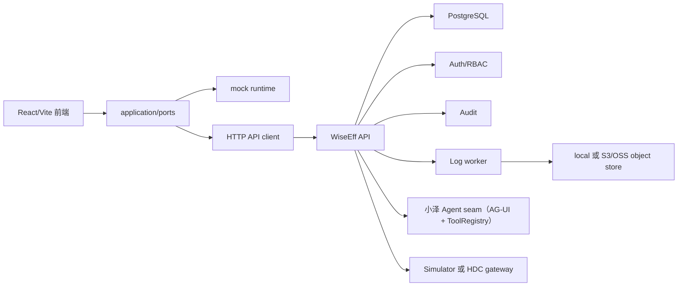

# 架构总览

WiseEff 当前是一个从前端原型演进到 M0-M5 productization baseline 的企业效率平台。核心形态是 React/Vite 前端、TypeScript 模块化后端、PostgreSQL 数据库、日志 worker、对象存储 seam、设备网关 seam、Agent provider seam，以及用于 pilot 验收的 operations gate。

完整英文架构入口见 [ARCHITECTURE.md](../../ARCHITECTURE.md) 和 [full-stack-architecture.md](../design-docs/full-stack-architecture.md)。

## 系统形态

## 前端边界

- `src/app/`：路由、导航、权限可见性、应用壳。
- `src/domain/`：领域类型和纯规则。
- `src/application/ports/`：页面调用业务能力的端口。
- `src/infrastructure/mock/`：演示和组件测试使用的 mock 实现。
- `src/infrastructure/http/`：API client、DTO 映射、runtime mode。
- `src/components/` 和页面文件：面向用户的界面。

页面组件应该负责渲染和调用端口，不应该直接拥有持久业务规则。生产路径逐步走 HTTP API，mock runtime 保留给演示和组件测试。

## 后端边界

- `server/app.ts`：API 组合入口。
- `server/shared/http/`：HTTP router、错误结构、server adapter。
- `server/shared/database/`：数据库 client 和 migration runner。
- `server/modules/auth/`：当前用户、角色、权限。
- `server/modules/audit/`：审计写入和查询。
- `server/modules/parameters/`：M1 参数管理。
- `server/modules/logs/`：M2 日志上传、分析记录、对象存储、worker。
- `server/modules/debugging/`：M3 调试服务、simulator/HDC gateway。
- `server/modules/agent/`：小泽 AG-UI 端点、LangGraph 规划 agent、tool registry、orchestrator approval bridge 与持久化 thread 元数据。
- `server/modules/operations/`：health、readiness、pilot-readiness。
- `server/migrations/`：PostgreSQL schema baseline。

后端是模块化单体。新增模块要保持 auth、audit、database、object-store、worker、device、Agent provider 等边界显式，不要把业务写入散落到页面或临时脚本里。

## 数据和治理原则

PostgreSQL 是 source of truth。生产写入路径必须满足：

1. 服务端认证用户。
2. 服务端授权动作。
3. 边界处校验输入。
4. 在事务内执行领域写入。
5. 带同一个 request trace 写入审计证据。
6. 返回结构化响应或结构化错误。

Agent 和设备写入是高风险路径。Agent mutating tool 必须先创建 approval record；设备写入需要设备状态检查、范围检查、快照、回读和审计。

## Release 状态

M5 已有 `/health/live`、`/health/ready` 和 `/api/v1/operations/pilot-readiness`。`npm run smoke:m5` 会检查 OpenAPI 合同、live/ready health 和 pilot-readiness。

当前项目适合受控 staging/pilot evidence collection，不应仅凭本地检查宣称 broad enterprise production rollout。完整 pilot-ready 仍需要目标环境的 staging API、PostgreSQL-backed E2E、HDC device-lab、backup/restore、rollback 和 live provider evidence。
