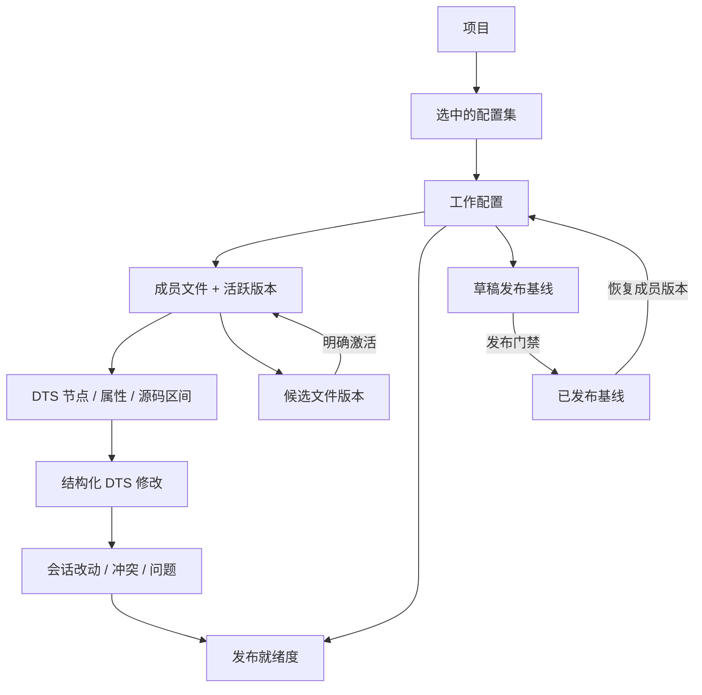
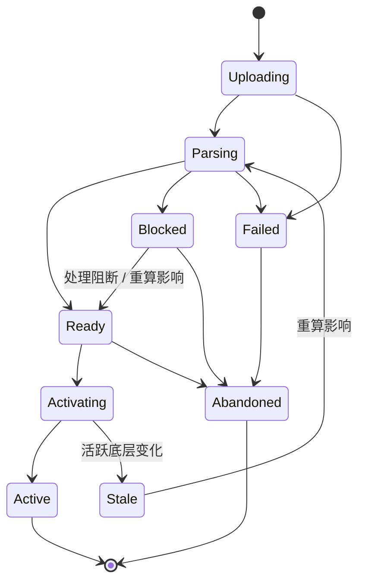

# 项目配置工作台——锁定设计

> 日期：2026-08-06
> 状态：已锁定，等待实施计划
> English: [English](../../design-docs/2026-08-06-project-configuration-workbench-design.md)
> 领域词汇：[CONTEXT.md](../../../CONTEXT.md)
> 相关决策：[ADR-0001](../../adr/0001-parameter-admin-organized-by-governance-scope.md)、[ADR-0012](../../adr/0012-releasing-happens-at-the-file-layer.md)、[ADR-0018](../../adr/0018-uploaded-file-versions-are-staged-before-activation.md)

## 1. 结论摘要

用一个全屏的**项目配置工作台**取代当前四视图项目运营弹窗，统一入口为：

```text
/parameter-admin/projects/:projectId/configuration
```

工作台以选中的**配置集**为工作上下文。配置集成员文件及其 DTS 节点组成一棵源结构树，选中的源码始终占据中央主画布。文件版本、结构化修改、发布基线、校验、冲突和审计证据围绕源码按上下文出现，不再拆成四个低密度目的地。

本设计保留 ADR-0001 的治理范围架构：组织配置与项目运营仍是平级区域。它只推翻 2026-08-05 恢复的呈现方式——项目配置已经是深度、代码中心型工作，980px 居中弹窗不再适合作为容器。

## 2. 当前弹窗为什么失败

| 当前视图 | 当前职责 | 结构性问题 |
| --- | --- | --- |
| 参数文件 | 上传、版本历史、下载、同步、结构化检索 | 检索与被定位的源码分离；一个文件也占用整块卡片 |
| 配置集 / 基线 | 成员与角色、导出、基线对比、回滚、发布 | 发布单元与它所冻结的文件和源码修改分离 |
| 结构浏览 | DTS 节点树、属性详情、结构化修改 | 节点树存在，但作为事实主画布的 DTS 源码反而消失 |
| 冲突裁决 | 文件同步与界面草稿冲突 | 冲突脱离具体文件、节点和源码行，退化成独立队列 |

现状还有以下呈现问题：

- 桌面弹窗只有 `min(980px, 100vw - 48px)`、`88vh`，无法同时容纳可用的源结构树、源码区和上下文详情。
- 项目清单只剩模糊背景，用户工作时得不到有效清单上下文。
- 常驻审计横幅长期占据最高价值的纵向空间，即使事件与当前文件无关。
- 四视图切换保留了四套页面心智，而不是持续保留一个配置集、文件、节点和发布上下文。
- 日常参数工作台技术视图已经证明了有效骨架：持续可见的导航树 + 只读 DTS 源码。项目运营应复用这个骨架，但换成源结构导航与治理工具。

## 3. 目标与非目标

### 目标

1. 让项目源码成为全部文件治理任务的稳定视觉锚点。
2. 让配置集组成和发布状态持续可见，但不再变成独立页面。
3. 保留完整源身份：配置集 → 成员文件 → DTS 节点 → 属性 → 源码区间。
4. 让结构化修改、候选版本激活、冲突和发布门禁都能定位到精确源码行。
5. 清楚区分可变工作配置、不可变发布基线和历史文件版本。
6. 提升桌面端密度，同时提供无能力损失的平板/移动降级布局。
7. 保留深链、服务端鉴权、高风险确认与审计证据。

### 非目标

- 在浏览器内自由编辑原始 DTS 文本。
- 替代日常项目参数工作台或其业务模块导航。
- 引入终端、Minimap、任意文件标签、命令面板等完整 IDE 功能。
- 把组织级参数定义、节点对应或模块治理队列塞进本工作台。
- 从 WiseEff 直接发布到 Git 或创建 PR。
- 改变 ADR-0012 的文件层发布单元。

## 4. 已锁定产品决策

| ID | 决策 |
| --- | --- |
| PCW-D1 | 使用全屏路由工作台，不使用居中弹窗。 |
| PCW-D2 | 选中的配置集是工作上下文，文件是主要查看与操作对象。 |
| PCW-D3 | 左侧只有一棵源结构树：配置集 → 文件 → DTS 节点；不切换成业务模块树。 |
| PCW-D4 | 源码主画布只读；属性修改进入类型化治理检查器，整文件修改走候选上传。 |
| PCW-D5 | 用全局命令栏、右侧上下文检查器和跨文件任务抽屉取代常驻功能面板。 |
| PCW-D6 | 默认展示工作配置；发布版本和历史版本只作为临时对比/历史模式。 |
| PCW-D7 | 用一套服务端派生的发布就绪度控制基线创建和发布。 |
| PCW-D8 | 上传只创建候选文件版本；解析、影响复核、明确激活后才改变工作配置。 |
| PCW-D9 | 冲突在源码上下文中用三方差异裁决，两种结果保持同等权重。 |
| PCW-D10 | 项目清单入口由“管理文件”改为“配置工作台”。 |
| PCW-D11 | 取消常驻审计横幅，改为对象上下文证据和活动时间线。 |
| PCW-D12 | 会话草稿可在导航或刷新后恢复；底层版本变化时必须重新确认。 |
| PCW-D13 | 桌面是主设计；响应式不反向约束桌面多栏体验。 |
| PCW-D14 | 提供 IDE 级定位能力，但保持产品化治理交互。 |
| PCW-D15 | 桌面栏位是否常驻由工作台实际可用宽度决定，而不是外层视口宽度；源码画布是唯一始终占主导的栏位。 |

## 5. 领域与状态关系



必须保持以下区别：

- **工作配置**是选中配置集当前各成员文件的活跃版本。
- **候选文件版本**可查看、可比较，但不参与工作配置。
- **发布基线**冻结成员活跃版本；它不是文件版本或配置修订的别名。
- **回滚**会生成 `origin=rollback` 版本并恢复工作配置，不会悄悄切换已发布基线。
- **会话草稿**是可恢复的本地工作，不是已提交变更请求，也不是文件版本。

## 6. 路由与 URL 状态

唯一规范路由：

```text
/parameter-admin/projects/:projectId/configuration
```

需要分享和刷新恢复的状态进入查询参数：

```text
?configSet=<id>
&file=<fileId>
&node=<encodedNodePath>
&property=<propertyName>
&mode=source|compare|history
&baseline=<baselineId>
&version=<versionId>
&inspector=config-set|file|node|property|baseline|activity
&dock=changes|issues|conflicts
```

会话草稿、树展开状态、栏宽和滚动位置属于会话 UI 状态，不进入 URL。

旧路由保留一个兼容发布周期并重定向：

| 旧路由 | 新上下文 |
| --- | --- |
| `/:projectId/files` | 工作配置 + 主文件 + 文件检查器 |
| `/:projectId/config-sets` | 默认/已选配置集 + 配置集检查器 |
| `/:projectId/structure` | 工作配置 + 主 DTS + 源码模式 |
| `/:projectId/conflicts` | 工作配置 + 展开的冲突任务抽屉 |

如果旧入口带有文件、节点或检索焦点，重定向必须尽量保留。兼容期后所有新链接只生成规范工作台路由。

## 7. 桌面信息架构

### 7.1 布局

```text
┌──────────────────────────────────────────────────────────────────────────────────────┐
│ ← 项目清单  Aurora 量产平台  [default ▾]  ● 3 项阻断  已发布：seed-v1              │
│                                     [上传] [导出] [创建基线] [发布 ▾]               │
├───────────────────┬─────────────────────────────────────────┬────────────────────────┤
│ 源结构            │ aurora-board.dts · v12 · 工作版本      │ 上下文检查器           │
│ 搜索…             │ 面包屑 / 查找 / 对比                    │ 当前文件/节点/...      │
│                   ├─────────────────────────────────────────┤                        │
│ default           │  127  &charging_core {                  │ 角色 / 版本 / 风险     │
│ ├ board.dts  v12  │  128    iin_max = <2300>;       ●       │ 历史 / 类型化修改      │
│ │ ├ amba           │  129    ichg_max = <2500>;              │ 上下文操作             │
│ │ └ charging_core │  130  };                                │                        │
│ ├ overlay.dtsi v4 │                                         │                        │
│ └ 未编组 (1)      │                                         │                        │
├───────────────────┴─────────────────────────────────────────┴────────────────────────┤
│ 3 项改动   2 项校验问题   1 项冲突                              [展开任务抽屉]         │
└──────────────────────────────────────────────────────────────────────────────────────┘
```

上图用于定义区域职责，不代表三块区域必须始终并排。默认桌面壳中，源结构树常驻但紧凑且可折叠，检查器按需以覆盖抽屉打开。

桌面组合必须按照**扣除全局导航和应用外壳后的工作台实际可用宽度**决定：

- 默认 `1440×900` WiseEff 外壳且全局导航展开时，使用约 214px 的紧凑源结构树、占主导的源码画布和覆盖式/可折叠检查器。
- 源结构树可调整到 360px 或折叠，但只有先保障源码画布后，检查器才能转为常驻。
- 只有在树、分隔线和 320–460px 检查器就位后，源码仍至少保留 640px，检查器才可常驻。通常需要约 1280px 以上的工作台实际可用宽度，例如更宽视口或全局导航折叠时。
- 任务抽屉折叠时固定保留 44px，始终可发现；只有处理本轮改动、问题、冲突、候选影响或发布复核时才展开，最大约占可用高度的 40%。
- 文件版本、候选文件版本和已发布基线在所有组合中都必须独立标注，不能合并成泛化的“版本”标签。

工作台占满全局 TopBar 下方的应用内容区。源码画布、树和检查器各自拥有明确滚动边界，不能再次出现“页面滚动器里套整页卡片滚动器”。

### 7.2 原型证据

2026-08-06 的一次性原型在真实 WiseEff 展开侧栏中测量了路由工作台。`1440×900` 视口下，工作台实际获得 1128px 内容宽度：

| 组合 | 源码画布实测 | 决策 |
| --- | ---: | --- |
| 均衡三栏 | 488×659px | 不作为默认组合，因为达不到 640px 源码目标；保留其完整检查器内容。 |
| 源码主导 | 914×659px | 选为默认桌面组合。 |
| 操作主导 | 870×382px | 不作为日常组合；只把其证据密度复用到展开的任务抽屉。 |

原型只改变组合规则，不改变领域语义、候选生命周期、发布就绪度、鉴权、冲突裁决或审计边界。

### 7.3 密度与视觉语言

- 用边框、轻微底色和分栏线表达层级，不再卡片套卡片。
- 树行目标高度 30–34px，命令控件 32–36px，源码行 20–22px。
- 实心状态标签只用于可执行生命周期事实：候选、冲突、草稿过期、已发布、阻断。
- 解释文案放在空态和检查器，不长期堆在源码上方。
- 使用 8px 间距体系，区块内边距 12–16px，避免营销式大标题。
- 桌面栏宽可记忆，但不能把桌面栏宽强加给平板/移动布局。

## 8. 区域规格

### 8.1 全局命令栏

长期可见：

- 返回项目清单。
- 项目名称/代号和项目状态。
- 配置集选择器；首次进入默认选中项目默认配置集。
- 带阻断/警告数量的发布就绪度。
- 当前已发布基线和工作配置漂移摘要。
- 一个主操作位与低频操作溢出菜单。
- 活动记录入口；不再显示常驻“最近审计”横幅。

| 当前上下文 | 主操作 |
| --- | --- |
| 工作源码 | 上传候选、导出配置集、创建基线 |
| 草稿基线 | 对比、发布 |
| 已发布基线 | 对比、恢复到工作配置 |
| 候选版本 | 查看影响、激活、放弃 |
| 发布阻断 | 打开任务抽屉；发布保持禁用 |

高风险操作继续显示明确影响确认。命令栏不能一次展示全部动作；低频动作进入有文字标签的溢出菜单。

### 8.2 源结构树

```text
当前配置集
├─ 成员文件（角色、活跃版本、状态数量）
│  ├─ DTS 节点
│  │  └─ 子 DTS 节点
│  └─ 候选版本（存在时）
└─ 未编组项目文件
```

交互：

- 选择文件：中央展示完整活跃源码。
- 选择节点：保持同一文件，滚动到节点区间并高亮块。
- 选择属性：高亮精确区间并打开属性检查器。
- 源码滚动：更新最近可见节点，但不抢夺键盘焦点。
- 搜索同时匹配文件名、节点路径、`@` 地址、label、compatible、属性名和属性值。
- 搜索结果留在树中，按文件分组并支持跨文件跳转。
- 文件与节点行就地显示候选、冲突、校验、本地改动数量。
- “未编组”明确与成员区分，因为它不参与当前配置集与发布就绪度。

这棵树表达源码拓扑，不表达日常参数工作台的业务分类树。

### 8.3 DTS 源码主画布

能力：

- DTS 语法高亮、行号、括号/缩进辅助线、折叠和文内查找。
- 文件/节点面包屑和 `文件名 · 版本 · 工作/历史/候选` 身份。
- 本轮修改、候选差异、冲突、警告、检索焦点的 gutter 标记。
- 与源结构树、右检查器双向同步选择。
- 源码、统一 diff、并排 diff、历史只读四种模式。
- 退出历史/对比后恢复原选择和滚动位置。
- 查找下一处、跳行、树/源码切焦、任务抽屉、检查器开关等桌面快捷键。

源码不提供自由文本编辑。双击可编辑属性或点击“修改取值”会打开结构化属性检查器；整文件变化走候选上传。

### 8.4 上下文检查器

| 选中对象 | 检查器内容 |
| --- | --- |
| 配置集 | 说明、成员角色、工作/发布漂移、基线历史、成员增删 |
| 文件 | 格式、成员角色、活跃版本、候选版本、版本历史、下载、同步、替换/上传 |
| 候选版本 | 解析状态、文本/结构差异、覆盖影响、冲突、激活/放弃 |
| DTS 节点 | 完整路径、labels、compatible、启用/可达状态、风险级别、来源 |
| DTS 属性 | 类型、当前/原始/归一化值、源码区间、敏感权限、类型化编辑、原因 |
| 基线 | 状态、固定成员、创建人/时间、对比、发布或恢复 |
| 活动记录 | 项目活动时间线；可能时从事件返回对应对象 |

同一时间只有一个检查器上下文。检查器内部返回遵循属性 → 节点 → 文件 → 配置集，不应意外改变源码选择。

### 8.5 任务抽屉

任务只有三类，不再是三个页面：

1. **本轮修改**：结构化修改草稿、候选激活改动、过期草稿处理、提交/丢弃。
2. **校验问题**：发布检查诊断和治理阻断，带级别与源码目标。
3. **冲突**：带源码定位的三方冲突裁决。

折叠态展示数量和最严重状态。只有当用户开始修改、点击阻断或打开冲突时才自动展开。空任务不保留空白面板。

## 9. 当前四视图能力如何归位

| 现有能力 | 新位置 |
| --- | --- |
| 文件列表 | 源结构树的文件根节点 |
| 上传参数文件 | 命令栏 → 候选版本流程 |
| 版本历史 | 文件检查器 |
| 下载最新/指定版本 | 文件检查器和历史行操作 |
| 手动同步 | 文件检查器；结果进入任务抽屉 |
| 结构化检索 | 统一源结构/源码搜索 |
| 配置集选择 | 命令栏选择器 |
| 创建/配置配置集 | 配置集选择器与配置集检查器 |
| 成员角色、增删成员 | 配置集或文件检查器 |
| 导出配置集 | 命令栏 |
| 基线列表/历史 | 已发布基线入口 → 基线检查器 |
| 创建/发布/对比/恢复基线 | 命令栏 + 基线检查器 + 源码 diff |
| DTS 节点树 | 源结构树 |
| 节点/属性详情 | 上下文检查器 |
| 结构化属性修改 | 属性检查器 + 本轮修改抽屉 |
| 冲突队列 | 文件/节点标记 + 冲突抽屉 |
| 审计横幅 | 即时 Toast；活动检查器保存长期证据 |

不能把旧面板整体嵌进新页面。只复用领域逻辑和交互原语，再按工作台区域重新组合。

## 10. 核心流程

### 10.1 进入与导航

1. 从项目清单“配置工作台”进入。
2. 优先恢复 URL 中的配置集，否则选中项目默认配置集。
3. 优先恢复 URL 中的文件/节点，否则选中项目主 DTS 活跃版本。
4. 树元数据和源码独立加载；源码失败不能清空树或发布状态。
5. 恢复栏宽、树展开、选择、滚动和兼容的会话草稿。

### 10.2 结构化属性修改

1. 从树、源码或搜索结果选中属性。
2. 属性检查器展示类型、原始/归一化值、约束、风险和权限。
3. 使用 `StructuredValueEditor` 修改；沿用变更请求合同中的原因要求。
4. 加入“本轮修改”，同时标记树节点和源码行。
5. 校验并提交全部或选中修改到现有治理变更请求流程。
6. 成功后清理已提交会话草稿并刷新活跃版本/源码映射。

不提供自由源码编辑。

### 10.3 上传并激活候选版本

1. 选择替换现有文件或上传新项目文件。
2. 上传创建候选版本，不改变活跃版本和配置集组成。
3. 解析候选，计算文本差异、结构差异、覆盖影响、映射阻断和冲突。
4. 在候选源码模式和候选检查器展示结果。
5. 新文件激活前必须明确选择成员角色和目标配置集。
6. 处理候选冲突与硬阻断。
7. 使用预期当前版本做 CAS 激活；底层变化时将候选标记过期并重新计算影响。
8. 旧活跃版本保留在历史中，激活由服务端审计。

### 10.4 冲突裁决

在一处源码上下文中展示：

```text
基础值
候选/文件同步值
界面待提交值
```

- “采用文件值”和“保留界面修改”保持同等视觉权重。
- 确认前说明会删除或保留哪一份草稿。
- 支持填写裁决原因并写入服务端审计。
- 处理后自动前往下一个冲突，同时保留源码上下文。
- 批量裁决只在预览影响后对合格冲突开放。
- 相关冲突关闭前，候选激活、基线创建和发布继续阻断。

### 10.5 创建与发布基线

1. 用户打开发布动作前，服务端派生的发布就绪度已持续可见。
2. 创建基线只冻结工作成员版本，不上传、不修改文件。
3. 阻断按门禁结果禁用创建或发布。
4. 警告按策略允许复核和明确确认。
5. 在源码画布中比较草稿基线与当前发布基线。
6. 发布草稿基线并确认影响；刷新发布身份与漂移摘要。

### 10.6 从基线恢复

1. 从历史中选择基线并与工作配置比较。
2. 确认精确成员/版本影响。
3. 原子恢复，后端为漂移成员生成 `origin=rollback` 版本。
4. 回到工作源码并重新计算就绪度。
5. 不自动改变发布基线；后续发布仍是独立明确动作。

## 11. 状态模型

### 11.1 候选文件版本



只有 `Active` 会改变工作配置；`Failed`、`Blocked`、`Stale`、`Abandoned` 都不参与发布组成。

### 11.2 会话草稿

```text
clean → dirty → validating → submitting → submitted
          │          │             └→ submit-failed
          │          └→ invalid
          └→ stale-base → 重新确认/重基 → dirty
          └→ discarded
```

恢复规则：

- 按已登录用户、项目、配置集、文件和底层版本隔离。
- 只保存补丁、原因和源身份，不复制保存整份项目源码。
- 登出时清理，禁止跨用户恢复。
- 只有组织/项目身份与底层版本一致时才能直接恢复。
- `stale-base` 草稿可查看、可复制，但重新确认前不可提交。

### 11.3 发布就绪度

服务端返回一组按优先级排序的证据，并携带 `target` 定位与补救动作。

| 级别 | 含义 | 示例原因 |
| --- | --- | --- |
| `blocked` | 不能创建基线或发布 | 缺主文件/成员版本、本地改动、未决冲突、硬校验错误、发布阻断型节点对应任务 |
| `warning` | 明确复核/确认后才可继续 | 非阻断工具链警告、策略允许的覆盖回退 |
| `ready` | 工作配置可冻结/发布 | 无阻断，警告已处理或确认 |
| `in-sync` | 工作配置与当前发布基线一致 | 无文件/成员漂移 |

前端不能再通过拼接多个本地计数来重建权威门禁。

## 12. 空态、加载与失败

| 状态 | 必须行为 |
| --- | --- |
| 无配置集 | 先使用既有默认配置集保证；失败时显示可恢复的项目设置错误，不显示空树 |
| 配置集无文件 | 一个明确的候选上传动作，并说明上传不会自动激活 |
| 无结构化 DTS | 文件仍可下载/看历史；说明树不可用原因并支持替换候选 |
| 源码加载失败 | 保留树、选择和发布状态，只重试源码请求 |
| 候选解析失败 | 当前工作源码完全不变，诊断显示在候选检查器 |
| 无冲突/问题/改动 | 任务抽屉折叠为零计数，不出现独立空页 |
| 就绪度不可用 | 禁用创建/发布，显示可重试门禁错误，绝不假设 ready |
| 权限不足 | 保留允许查看的上下文，在禁用操作旁解释缺失能力 |

## 13. 权限、安全与审计

- 初期项目后台入口继续要求 `admin:access`。
- 既有项目级冲突裁决权限仍由服务端执行；界面架构不能假设所有渲染用户都有完整 Admin 能力。
- 结构化属性写入沿用 `parameter:edit`。
- 命中敏感/高危/关键节点时沿用规则要求的能力，默认 `parameter:edit-critical`；服务端为权威。
- 配置集变更、候选激活、基线创建/发布/恢复、配置集导出继续沿用现有 Admin 门禁，除非另立权限决策。
- 发布工具链校验继续只在 Admin/基线 L2 路径，不能进入类型化修改热路径。
- 候选激活必须针对已检查活跃版本执行 CAS。
- 移除成员、带影响的候选激活、发布、恢复和冲突裁决都要求明确确认。
- 审计由后端写入。Toast 与活动检查器只是投影，不是证据边界。

## 14. 响应式行为：桌面优先

| 场景 | 组合方式 |
| --- | --- |
| 默认桌面：`1440×900` 外层视口且全局导航展开（工作台约 1128px 可用宽度） | 紧凑/可折叠源结构树 + 占主导的源码画布 + 覆盖检查器；任务抽屉折叠为 44px |
| 更宽桌面或外壳导航折叠 | 只有源码最终仍至少保留 640px 时，检查器才可常驻；任务抽屉有任务时才展开 |
| 769–1279px 外层视口 | 源码仍是主画布；空间允许时树常驻，检查器变为覆盖抽屉 |
| ≤768px 外层视口 | 单一源码画布；树、检查器、任务使用全高面板；默认统一 diff |

约束：

- 桌面保留多栏同时可见、密集键盘操作、可调栏宽和并排 diff。
- 平板/移动适配不能缩窄桌面栏位、删除桌面快捷键或迫使桌面采用移动分步流程。
- 移动端高风险操作使用独立确认步骤，但证据和鉴权与桌面一致。
- 不允许某个视口悄悄变成只读。

## 15. 可访问性与键盘合同

- 源结构使用真实 tree 模式，播报层级、展开、选中和数量。
- 命令栏、检查器是带名称的 region；任务类别只有在控制同一抽屉面板时才使用 tabs。
- 分栏调整支持键盘并暴露当前尺寸。
- gutter 状态不能只靠颜色；必须有标签/提示和任务列表等价入口。
- 只有用户明确操作时才移动焦点到检查器/任务抽屉；源码滚动不能抢焦点。
- 退出对比/历史后恢复之前的源码焦点和滚动。
- 高风险确认继续复用 `ModalDialog` / `ConfirmDialog` 的焦点、Escape、背景 inert 和顶层关闭合同。
- 快捷键可发现，且不覆盖浏览器/系统快捷键。

## 16. 前端模块设计

```text
ProjectConfigurationWorkbenchPage
└─ ProjectConfigurationWorkbench（壳：选择 / URL / ConfirmDialog 接线 / 加载编排）
   ├─ WorkbenchCommandBar
   ├─ WorkbenchShellChrome（ops 横幅 + 移动端区域工具）
   ├─ WorkbenchSourceTree
   ├─ WorkbenchSourceCanvas
   ├─ WorkbenchInspectorPanel（含 WorkbenchBaselineDock）
   ├─ WorkbenchTaskDock（冲突 / 就绪适配）
   ├─ WorkbenchCandidateActivateDialog / WorkbenchBaselineDialogs
   └─ Workbench sessions（`src/application/project-configuration/`）
      ├─ StructuredEditSession
      ├─ CandidateVersionFlow
      ├─ ReleaseBaselineSession
      ├─ ConflictLocateFacade
      └─ ConfigSetOpsSession
```

Wave-1 会话抽取（#258–#265 / PR #266）把领域动作收到 `src/application/project-configuration/` 的命令接口后面。Wave-2（#267–#271）抽出展示适配器（`WorkbenchCommandBar`、`WorkbenchInspectorPanel`、源结构树/画布、任务坞、壳层 chrome/对话框）以及 `ConfigSetOpsSession`；壳层以编排为主且 ≤ ~2500 行，更进一步瘦身（目标 800–1000）留给 wave-3。Activity 只注入 `AuditQuery.listAuditEvents`——工作台页面模块禁止自行构造审计 HTTP client。

复用约束：

- 继续通过 `ParameterFileRepository` 和 `DtsStructuredRepository` 解析数据；页面不能直连 HTTP client。
- 把 `ProjectPrimaryDtsViewer` 的能力扩展为多文件 `DtsSourceCanvas`，加入源码区间、diff、gutter 和语法高亮。
- 复用 `StructuredValueEditor`、`StructuredDiffView`、确认原语、仓库 DTO 与源码定位工具。
- 从 `ProjectParameterFilesPanel`、`ConfigSetBaselinePanel`、`DtsStructureBrowserPanel`、`ParameterFileConflictPanel` 抽出逻辑；不能把这些页面型面板嵌套进新布局。
- 工作台协调器只拥有选择/查询状态；源码解析、就绪度、候选生命周期和鉴权留在 ports/服务端模块后面。

## 17. API 与持久化变化

### 候选版本生命周期

ADR-0018 要求以下明确动作，最终路由命名可遵循现有 API 风格：

```text
createCandidate(projectId, file/new-file metadata, bytes)
getCandidateImpact(projectId, candidateVersionId)
activateCandidate(projectId, candidateVersionId, expectedCurrentVersionId, configSet/role intent)
abandonCandidate(projectId, candidateVersionId)
```

激活必须事务化校验项目/组织、能力、预期活跃版本、阻断、成员角色和目标配置集，然后更新活跃成员/版本并写入审计。

### 发布就绪度

提供一份服务端拥有的配置集就绪度读取，返回：

- 总级别；
- 阻断和警告；
- 文件/节点/属性/源码行目标；
- 补救动作类型；
- 门禁修订/token，使发布能拒绝过期证据。

### 源码导航

继续复用现有结构、搜索、版本下载、对比和结构化修改 ports。对尚未携带源码区间的结构节点/属性补齐 span 或行范围，使树、源码、检查器、冲突和校验目标共享同一身份。

## 18. 迁移方案

实施需要另建活动执行计划和 feature branch，推荐顺序：

### Phase 0——合同与验收地图

- 把本双语设计加入当前文档，并修订 ADR-0001。
- 锁定路由、URL 状态、候选生命周期、就绪度响应和源码定位 DTO。
- UI 实现前注册浏览器验收与用户操作 ID。
- 保留 2026-08-02 UX 计划中仍然有效的项目清单和响应式缺陷修复。

### Phase 1——只读工作台骨架

- 新增规范路由和项目清单“配置工作台”入口。
- 建立全屏桌面壳、配置集选择器、源结构树、多文件源码画布、检查器壳和任务抽屉壳。
- 读取现有活跃文件/配置集，暂不迁移写操作。
- 新路由在开发开关后验证期间保留旧弹窗。

### Phase 2——文件与候选流程

- 落地 ADR-0018 的候选持久化/API/port 生命周期。
- 把上传、版本历史、下载、同步、成员角色和未编组文件迁入树/检查器/命令区。
- 证明上传本身不能改变活跃源码或配置集组成。

### Phase 3——结构化导航与修改

- 增加层级节点/属性源码区间、树/源码双向选择、统一搜索和类型化属性检查器。
- 增加可恢复会话草稿、底层过期检测、选择性提交与离开保护。

### Phase 4——任务与发布就绪度

- 把校验证据和三方冲突迁入任务抽屉。
- 增加带源码补救目标的服务端发布就绪度。
- 保持冲突两种结果等权并审计。

### Phase 5——基线与发布

- 把基线历史、对比、创建、发布、导出和恢复迁入命令栏/检查器/源码 diff。
- 证明回滚恢复工作版本但不会悄悄改变已发布基线。

### Phase 6——切换与清理

> 状态说明（2026-08-08）：Phase 6 已在 #240 落地（`PROJ-CONFIG-CUTOVER-001`）。

- 四个旧路由保留一个兼容发布周期，重定向到规范上下文。
- 验收证据通过后移除 `ProjectOperationsDialog` 与四视图导航。
- 只有所有领域逻辑已有新归属且有定向测试时，才删除旧页面型面板。
- 实施变更中同步更新 `FRONTEND.md`、产品规格、架构、API 合同、验收矩阵和全部中英文伴随文档。

## 19. 验证与验收标准

### 产品验收

1. Admin 无需跳转子页面即可完成候选上传/复核/激活、源码查看/结构化修改、冲突裁决、基线创建/对比/发布/恢复和导出。
2. 配置集、文件、节点、对比/历史模式、检查器和任务类别均可深链并在刷新后恢复。
3. 候选上传在激活前绝不改变工作配置。
4. 树、源码画布、检查器和任务抽屉始终指向同一个文件/节点/属性身份。
5. 未决冲突和其它阻断都能定位源码，并阻止门禁动作。
6. 历史/发布源码明确只读，不能与工作版本混淆。
7. 底层不变时会话草稿可恢复；底层变化时草稿转为过期。
8. 常驻审计横幅消失；服务端审计仍可从对象上下文和活动时间线访问。

### 桌面质量门槛

在 `1440×900`：

- 紧凑/可折叠源结构树和源码画布可同时使用；
- 打开覆盖检查器不会永久压缩源码的实际可读宽度；
- 只有源码仍能至少保留 640px 时，检查器才转为常驻；
- 折叠的 44px 任务抽屉始终可发现，但不侵占日常源码阅读高度；
- 不出现整页嵌套卡片滚动陷阱；
- 树行、源码行和命令栏达到目标密度；
- 分栏调整、搜索、源码跳转、diff、结构化修改、冲突、候选和发布均支持键盘与指针。

### 响应式质量门槛

在 `768×1024` 与 `390×844`：

- 源码仍是主画布；
- 树/检查器/任务打开后无重叠、裁切、意外页面横向滚动或隐藏确认；
- 任何业务能力都不会悄悄消失；
- 统一 diff 和分步高风险确认可读。

### 实施工程门禁

- 覆盖状态、repository、组件、路由、可访问性和集成的定向测试。
- TypeScript/路由变更运行 `npm run build`。
- 运行 `npm run docs:check` 与双语更新门禁。
- API 模式下在三种要求视口完成真实浏览器验证：snapshot、screenshot、关键交互、console error、相关加载/数据流 network 检查。

## 20. 未来实施计划的文档影响

| 区域 | 预期动作 |
| --- | --- |
| 仓库地图 | 复核 `ARCHITECTURE.md`、`AGENTS.md` |
| 计划 | 新增双语活动实施计划并更新中英文计划索引 |
| 产品规格 | 更新项目运营流程和入口命名 |
| ADR / 领域 | 保持 ADR-0001/0012/0018 与 `CONTEXT.md` 一致 |
| 前端 | 更新 `docs/FRONTEND.md` 及中文伴随页 |
| API | 更新中英文 API 合同中的候选/就绪度/源码定位合同 |
| 安全 | 复核能力、候选数据、会话草稿存储、确认和审计 |
| 质量 | 增加浏览器验收、用户操作覆盖和证据 |
| 可靠性 | 复核就绪度失败处理与候选清理 |
| 生成物 | 候选持久化落地时更新 schema summary |
