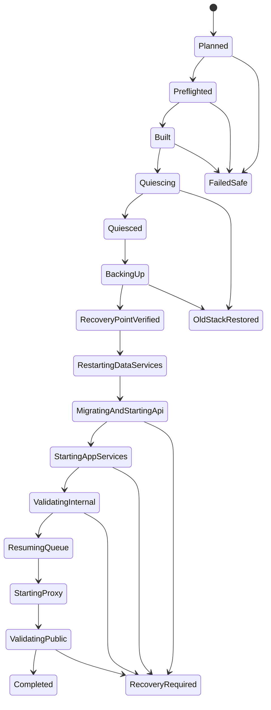

# 自托管一键升级设计

> English: [English](../../design-docs/2026-08-20-self-hosted-one-command-upgrade-design.md)

日期：2026-08-20
状态：本地已实现；非客户目标演练仍需完成
范围：`ops/self-hosted/` 下基于源码 checkout 的 Docker Compose 运行时

实现入口已落在 `ops/self-hosted/scripts/upgrade.sh`，本地脚本、配置和构建门禁已通过。真实 Ubuntu 演练属于部署证据，仓库内测试不会把它默认为已完成。

## 背景

WiseEff 当前有三条相关但不完整的操作路径：

- `setup.sh` 负责首次配置、Compose 启动和可选演示数据 provision；
- `compose up -d --build` 会基于当前 checkout 重新构建，并保留命名 volume；
- 自托管 runbook 要求操作员手工 fetch release commit，再执行 Compose。

这三者都不是成熟的升级控制器。目前没有一条命令能够：把目标解析成不可变 commit、先证明新版本可构建、停止新写入、生成并验证恢复点、在不删除数据的情况下重启全部服务、等待数据库迁移和健康门禁，并把全过程记录成可恢复的运行状态。直接复用 `setup.sh all` 也不安全，因为 setup 同时负责配置生成和 provision；`setup.sh --force` 还会主动轮换数据存储凭据。

本设计在操作员 seam 上增加一个独立的深模块。它只暴露一条命令；Git、Compose、队列维护、备份、迁移观察、健康检查、日志和恢复都留在实现内部。

## 目标

1. `./scripts/upgrade.sh` 将现有自托管部署升级到一个已解析的 commit，完整重建整个栈，同时保留所有持久化数据。
2. 正常路径绝不修改 `.env`、不导入演示数据、不轮换凭据、不删除 Docker volume。
3. 构建或预检失败时零停机；备份失败时恢复旧栈；迁移开始后的失败会停止公网流量并进入明确的待恢复状态。
4. 每个有副作用的阶段都持久化记录，SSH 断开、宿主机重启或人工中断后都可继续。
5. 命令适用于已文档化的仅 Docker 服务器；宿主机无需 Node.js。
6. 目标选择、备份产物、迁移暴露、镜像身份、健康证据和最终结果均可审计，同时不记录密钥。

## 非目标

- 在裸服务器上安装 Docker 或 clone 仓库。
- 取代 CI 发布门禁，或把 `origin/main` 宣称为 release-ready。
- 零停机或多主机滚动发布；本方案是单机受控维护窗口。
- 在候选版本已经对外服务之后自动恢复旧备份。
- 支持无法通过 S3 兼容工具导出和校验数据的对象存储；没有适配器时必须在预检阶段拒绝升级。
- 升级过程中执行 setup 分段、管理员 bootstrap 或演示 seed。

## 锁定决策

### 独立升级模块，不再给 setup 增加动作

外部 seam 为 `ops/self-hosted/scripts/upgrade.sh`。`setup.sh` 继续负责答案、`.env`、首次启动和 provision。升级模块只读 `.env`，不能重写它。

按删除测试判断，这个模块有明确价值：删除后，目标解析、互斥锁、预构建、静默写入、快照验证、有序重启、健康门禁和恢复逻辑都会重新散落到 runbook 与操作员的临时 shell 命令里。

### 解析到 commit，绝不直接部署移动 ref

操作员可以指定 `origin/main`、分支、tag 或 SHA。控制器先执行 `git fetch`，再通过 `git rev-parse <ref>^{commit}` 只解析一次，将最终 SHA 写入运行记录；后续所有阶段只使用这个 SHA。

默认跟踪 ref 为 `WISEEFF_UPGRADE_REF`，未配置时使用 `origin/main`。受控试点和类生产部署应显式传 release tag 或 SHA。

### 停机前先完成构建

旧容器仍运行时，先 checkout 目标源码并构建候选应用镜像。目标协议、预检或镜像构建失败时，在暂停队列或停止流量之前退出。

构建候选 tag 前，先把当前应用镜像打上本次运行专用的 rollback tag。候选与旧镜像 ID 都写入运行记录。

构建阶段同时负责产生可用证据。Compose 使用 BuildKit plain progress，脱敏后的输出写入本次运行权限为 `0700` 的诊断目录，日志文件权限为 `0600`。Dockerfile 中的 `npm ci` wrapper 会在临时构建 stage 消失前输出经过脱敏的 npm debug log，并保留 npm 原始退出码。轻量分类器会为 dependency lock、CA、DNS、网络、registry、容量和 OOM 等常见问题写入便于操作员理解的摘要。这些字段通过已有 `status` 接口暴露，不新增独立诊断命令，也不要求宿主机 root 权限。

### 迁移前必须有备份

正常接口不提供 `--skip-backup`。停止外部流量和后台写入后，控制器必须生成并验证：

- PostgreSQL custom format dump；
- S3 兼容对象存储镜像与对象 manifest；
- durable queue 开启时的 Redis RDB checkpoint；
- `.env` 指纹、当前/目标 commit、迁移清单、运行镜像 ID、Compose project 身份和 volume mount 身份。

在线 `.env` 不会变化。若灾难恢复需要保存副本，则只能放在权限为 `0700` 的备份目录中，文件权限为 `0600`，且不得进入控制台日志或仓库生成证据。

### 迁移开始后禁止破坏性的自动恢复

API 迁移命令开始前，控制器可以安全地重新启动旧容器并恢复队列。一旦迁移启动，即使进程失败，也必须认为数据库可能已经变化。此时保持公网 proxy 停止、保持队列暂停，把运行标记为 `recovery-required`，并打印精确的 `resume` 或 `rollback` 命令。

`rollback --restore-data` 会替换现有状态，因此必须显式执行并确认。成功升级并已经承载流量后，再恢复旧数据还会丢弃升级后的新写入；这种恢复在非交互模式下必须提供针对该 run id 的确认 token，否则绝不执行。

### 绝不使用 `compose down -v`

控制器不会执行 `down -v`、`volume rm`、`system prune` 或等价命令。完整重启的含义是：所有服务容器基于现有命名 volume 重新创建。部署前后都会核对 PostgreSQL、Redis、MinIO 和 Caddy 的 volume 身份。

## 操作员接口

常用路径只有一条命令：

```bash
cd ops/self-hosted
./scripts/upgrade.sh
```

显式选择发布版本：

```bash
./scripts/upgrade.sh apply --ref refs/tags/v1.4.0
```

完整外部接口保持精简：

```text
upgrade.sh [apply] [--ref <git-ref>] [--restart] [--non-interactive --yes]
upgrade.sh plan [--ref <git-ref>] [--json]
sudo upgrade.sh prepare-host [--operator <user>] --yes
upgrade.sh lock-status
upgrade.sh unlock
upgrade.sh status [--run-id <id>] [--json]
upgrade.sh resume --run-id <id>
upgrade.sh rollback --run-id <id> [--restore-data] [--confirm <token>]
```

- `apply` 为默认动作：fetch、解析、预构建、停止写入、备份、重建、验证、收尾。
- `plan` 解析目标并报告 commit、迁移变化、磁盘需求、备份位置和预期停机，但不 checkout、不改变容器。
- `prepare-host` 是唯一面向 root 的动作：规范部署用户的 Docker 组成员关系以及受保护的 operation/journal/备份目录；它不访问 Git，也不改变运行中的服务。
- `lock-status` 报告内核/fallback 锁状态与脱敏持锁者元数据；`unlock` 只清理已证明陈旧的元数据/fallback 锁，并拒绝真实在运行的操作。
- `status` 只读取持久化运行记录，包括候选构建状态、诊断路径和可执行下一步。
- `resume` 从第一个未完成的幂等阶段继续；不会盲目重复已验证的快照或迁移。
- `rollback` 恢复旧应用镜像；增加 `--restore-data` 后同时恢复 PostgreSQL、对象存储和 Redis 恢复点。
- 若目标 SHA 已运行且未传 `--restart`，`apply` 以成功 no-op 退出。
- 非交互升级必须同时传 `--non-interactive --yes`；破坏性数据恢复还必须提供脚本打印的本次运行确认 token。

稳定退出码属于接口契约：

| 代码 | 含义 |
| --- | --- |
| `0` | 完成或安全 no-op |
| `2` | 命令错误或缺少确认 |
| `10` | 预检/目标解析失败，旧栈不受影响 |
| `20` | 候选构建失败，旧栈不受影响 |
| `30` | 停止写入失败，已恢复旧栈 |
| `40` | 备份/校验失败，已恢复旧栈 |
| `50` | 迁移前数据服务/部署失败，旧栈恢复已完成或已尝试 |
| `60` | 服务健康已通过，但收尾/证据写入失败；通过 `resume` 收尾 |
| `70` | 明确需要恢复，公网流量保持停止 |
| `75` | 另一项 setup/upgrade 操作持有宿主机锁 |

## 模块形态

```text
操作员 / 自动化
        |
        v
upgrade.sh                         外部接口
        |
        +-- upgrade-lib.sh         状态机与策略
        +-- operation-lock.sh      持锁者元数据与安全陈旧锁恢复
        +-- scripts/compose        现有 Compose adapter
        +-- Git CLI                源码 adapter
        +-- Docker CLI             镜像/volume adapter
        +-- backup-tool profile    pg_dump / mc / redis 校验
        +-- queue-maintenance CLI  pause / drain / resume
        +-- health/smoke probes    内部与公网验证
        `-- run journal            原子阶段与证据记录
```

外部接口也是测试面。测试通过受控 `PATH` 和临时仓库替换内部命令 adapter，但不会把这些 adapter 暴露为用户 flag。由于宿主机不要求 Node.js，实现仍以 bash 为主；Vitest 使用伪 Git/Docker/Compose 命令做黑盒 shell 测试，并保留可选的真实 Docker 集成测试。

`upgrade.sh` 是稳定 launcher。解析并 checkout 目标后，它会校验 `ops/self-hosted/upgrade-protocol.env`，再用既有 run id 重新执行目标 checkout 中的实现，避免旧脚本长时间运行时错误解释新版 Compose 契约。不支持的协议版本必须在停机前失败。

## 持久化运行状态

同一时间只允许一个会修改状态的自托管操作。`upgrade.sh`、`setup.sh` 的 mutating 动作以及未来 restore 入口共享原子宿主机锁。实现优先使用 `flock`，把 PID/用户/动作/开始时间元数据与内核锁分开记录，绝不把持久存在的普通锁文件本身解释为仍被占用。mkdir fallback 锁只有在 PID 已证明不存在时才自动移到旁路；缺失/非法 PID 的 fallback 锁会先保守视为正在获取锁，超过五分钟才可判定为被遗弃，从而封住 mkdir 到 PID 发布之间的竞争窗口。显式 `unlock` 采用同一证明规则，拒绝符号链接锁路径，并拒绝真实或无法确定的持锁者。

默认位置：

```text
ops/self-hosted/.state/.operation.lock
ops/self-hosted/.state/upgrades/<run-id>/
/var/backups/wiseeff/upgrades/<run-id>/
```

状态目录是操作员本地目录，Git 忽略，权限 `0700`。业务备份必须位于仓库和 Docker 数据根目录之外。每个字段均原子写入；状态文件只按数据解析，绝不作为 shell 代码 `source`。

每次运行至少记录：

- run id、协议版本、时间戳、当前阶段、最后成功阶段；
- 上一 commit、目标 commit 和请求的 ref；
- worktree 清洁结果与 `.env` SHA-256 指纹；
- 变更的迁移文件，以及迁移是否已经启动；
- 旧应用镜像和候选镜像 ID；
- Compose project、容器和 volume 身份；
- 备份路径、大小、checksum、验证结果和敏感标记；
- 队列模式及 pause/drain/resume 结果；
- 内部 liveness/readiness、公网 smoke 和最终结果；
- 脱敏失败分类，以及下一条允许执行的命令。

信号处理不能伪装成已经回滚。停止写入前中断，记录为安全失败；停止写入后中断，记录精确阶段并给出可继续指令。事件日志不得包含密钥、Authorization header、数据库 URL 或对象存储签名 URL。

## 升级状态机



运行记录只允许声明过的前向转换。`resume` 会先检查可观察状态。例如，只有 manifest 和 hash 仍然有效时才会复用已验证备份；已经启动过 API 迁移的阶段绝不能通过编辑 journal 伪装成“迁移前”。

## 有序升级过程

### 1. 无影响检查

1. 获取共享 operation lock。
2. 确认命令来自现有 checkout，并通过 self-hosted Compose wrapper 运行。
3. 拒绝 tracked 或未忽略的 untracked worktree 变化；允许已忽略的 `.env` 与状态目录。
4. 校验 `.env` 权限和必填项，只记录其指纹。
5. 校验当前容器挂载了预期且非空的数据 volume。
6. 检查 Docker/Compose 版本、磁盘与 inode 余量、备份根目录权限、系统时间和公网 URL。
7. fetch 并把请求 ref 解析为一个 commit；比较旧 commit 与目标 commit 的 migration 文件。
8. 校验目标升级协议，并在不输出已展开密钥的情况下渲染 `compose config`。

磁盘预检需要覆盖候选镜像空间，加上 PostgreSQL、对象存储和 Redis 预计备份大小及安全系数。无法估算或空间不足时必须失败关闭。

### 2. 无停机构建

1. 给当前每个应用镜像打本次运行专用旧版本 tag。
2. 以 detached-head 部署模式 checkout 已解析目标 commit。
3. 构建一份带 commit tag 的应用镜像，API、worker 和 web 共用。
4. 把脱敏后的 plain-progress 输出写入运行 journal；npm 失败时，在构建 stage 消失前导出经过脱敏的 stage 内 debug log。
5. 写入原因分类摘要，并通过 `status` 暴露诊断路径。
6. 执行镜像级 self-hosted 配置/构建检查。
7. 任一步失败时恢复旧 checkout 并退出；旧容器从未停止。

Compose 将新增显式应用镜像仓库/tag 变量，使回滚不依赖可变的 Compose 默认 tag，也不需要事故期间重新构建旧源码。

### 3. 停止写入

1. 通过当前应用镜像中的队列维护命令暂停 durable queue intake。
2. 优雅停止公网 proxy，阻止新用户写入。
3. 在配置超时内等待活跃 worker job 和 API in-flight work 完成。
4. 带 grace period 停止 API、worker 和 web 容器。
5. 确认没有应用容器仍可写 PostgreSQL、Redis 或对象存储。

若停止写入超时，控制器恢复队列和旧 proxy，不进入备份与部署。

### 4. 生成并验证恢复点

所有应用 writer 已停止、数据服务仍可用时：

1. 将 `pg_dump --format=custom` 写入 `.part`，用 `pg_restore --list` 校验后再原子改名。
2. 使用固定版本的 `minio/mc` 运维镜像，将已配置的 S3 兼容 live bucket 镜像到运行备份目录；记录 key/size/checksum manifest 并核对复制集合。
3. durable queue 开启时强制生成并复制 Redis RDB checkpoint，再用 `redis-check-rdb` 校验。
4. 为每项产物生成 SHA-256 manifest，并通过 fsync/rename 完成落盘。
5. 只有全部必需存储均通过，才标记 `recovery-point-verified`。

部分备份永远不能视为恢复点。本阶段失败时重新启动已停止的旧容器、恢复队列，并保留部分目录供诊断。

### 5. 不删 volume，重建全部服务

1. 基于既有 volume 重新创建 PostgreSQL、Redis、MinIO 和一次性 MinIO initializer。
2. 等待数据服务健康并再次核对 mount 身份。
3. 单独启动候选 API；它现有的启动命令会先执行迁移，再接受流量。
4. API 内部 liveness 通过且已经证明迁移完成后，从同一 commit 镜像启动 web 和 worker。
5. 验证完整内部 readiness、API/web 健康和队列仍暂停。
6. 恢复 durable queue 并确认 worker 能观察到它。
7. 最后重新创建/启动 Caddy，同时保留 data/config volume。
8. 执行公网 liveness/readiness 和有界 self-hosted smoke。

本阶段不会执行 seed、bootstrap、setup renderer 或配置重写。

### 6. 收尾

1. 确认所有预期容器运行的是目标应用镜像或固定基础镜像，并确认完整重启要求下的每个长期运行容器 ID 都发生变化。
2. 确认 PostgreSQL、Redis、MinIO 和 Caddy 的 volume 身份与升级前记录一致。
3. 确认 `.env` 指纹不变。
4. 记录部署目标 SHA、迁移结果、smoke 结果、停机区间和备份 manifest。
5. 标记运行完成，输出备份位置与 rollback 保留提醒。

`apply` 不自动清理备份。未来若提供显式 retention 命令，只能删除已完成且过期的运行，绝不能删除最新恢复点或 `recovery-required` 运行。

## 失败与恢复策略

| 失败位置 | 自动动作 | 结果 |
| --- | --- | --- |
| Fetch、协议、配置、磁盘或构建 | 必要时恢复旧 checkout | 旧栈在线，`failed-safe` |
| 队列暂停或 drain | 恢复队列/proxy | 旧栈在线，`failed-safe` |
| 备份或备份校验 | 重启旧应用容器并恢复队列/proxy | 未迁移，`old-stack-restored` |
| API 迁移启动前的数据服务重启 | 使用旧镜像启动旧应用栈 | 保留快照，`old-stack-restored` |
| 迁移启动或候选 API 失败 | 保持 proxy 停止和队列暂停 | `recovery-required`，选择继续或显式恢复 |
| 迁移后的内部健康失败 | 保持 proxy 停止和队列暂停 | `recovery-required` |
| 公网 smoke 失败 | 立即停止 proxy，不自动恢复数据 | `recovery-required`，候选可能短暂接收流量 |
| 信号/宿主机重启 | journal 仍为真相 | 先 `status`，再 `resume` 或 `rollback` |

只有明确知道迁移未启动，或 release record 已证明 schema 向后兼容时，才允许自动进行不恢复数据的应用 rollback。其他情况必须依照 release runbook 选择 forward-fix 或显式整体验证点恢复。

## 安全不变量

- 不记录 `.env` 内容和含密钥命令行。
- 构建日志和摘要属于私有 journal 产物（目录 `0700`、文件 `0600`）；URL 凭据、registry token、密码和 bearer token 在持久化前完成脱敏。
- 包含配置或客户数据的备份目录权限必须为 `0700`，敏感文件为 `0600`。
- 备份根目录不得位于 Git checkout、Docker volume 根目录或 live 对象存储路径内。
- 用户传入的 Git ref 和路径只能作为参数传递，不能由 shell 求值。
- 状态/备份根目录若为 symlink，解析结果超出允许根目录时拒绝执行。
- 绝不运行 Git reset、Git clean、volume 删除、seed 或 `setup.sh --force`。
- 只有内部健康通过后才启动公网流量；queue resume 与 proxy start 分开记录。
- 恢复操作把 PostgreSQL、对象存储和 Redis 视为一个恢复点；正常接口不暴露跨存储的部分恢复。
- 运行 manifest 经过脱敏后才能附加到仓库发布证据。

## 兼容与采用

首次包含本模块的 release 仍需通过当前手工升级流程安装。从该 release 起，`upgrade.sh` 才是基于源码 checkout 的正式升级入口。

实现必须通过 `scripts/compose` 同时兼容 Compose v2 和仓库已声明的 standalone Compose 最低版本。不能依赖 `docker compose wait` 等较新专属能力，健康等待由控制器实现。

命令必须在同一 checkout 与 `ops/self-hosted` 目录内执行，从而保持现有 Compose project 和命名 volume 身份不变。若检测到 project 身份变化，必须拒绝继续，除非操作员执行单独文档化的迁移。

正常目标解析与恢复动作由部署用户执行，不通过 `sudo`，从而保留该用户的代理环境和 Git 配置；`prepare-host` 是一次性 root 工作的显式权限 seam。历史部署即使 API/worker/web 镜像 ID 不同也保持兼容，因为控制器会分别记录、标记并按服务恢复旧镜像。升级 journal 虽已被 Git 忽略，也必须从 Docker 构建上下文排除。

## 被否决的替代方案

### 增加 `setup.sh update`

否决原因：它混合了不兼容的职责。Setup 允许渲染配置和 provision；upgrade 必须保证两者都不会发生。

### 只记录 `git pull && compose up -d --build`

否决原因：它部署移动分支、没有恢复点、中断后不可继续、没有迁移/流量顺序，也不能证明全部服务在同一目标上完成重启。

### 要求宿主机安装 Node.js

否决原因：self-hosted 运行时明确支持 Docker-only 主机。实现采用 bash 与现有容器；TypeScript 只用于测试 harness 和容器内维护命令。

### 任意失败都自动恢复备份

否决原因：迁移状态可能已部分推进，公网流量也可能已经产生新写入。破坏性恢复必须显式且基于证据。

## 验证策略

### 黑盒命令测试

Vitest 使用临时 Git 仓库和伪命令 adapter 调用公开 shell 接口。必须覆盖：

- 移动 ref 只解析一次，固定为不可变 SHA；
- dirty worktree、不支持的协议、缺少 `.env`、锁冲突、磁盘不足、目标构建失败均不影响旧服务；
- 相同 SHA 默认 no-op，传 `--restart` 才完整重启；
- queue drain 和备份失败会恢复旧栈；
- resume 不重复已验证备份；
- 迁移已启动的失败进入 `recovery-required`；
- 控制台与 journal 不出现密钥；
- 执行命令中绝不出现 `down -v`、volume 删除、seed 和 `setup.sh --force`；
- 每个阶段被中断后都只有合法的下一步动作。

### 真实 Docker 集成矩阵

可选 Linux 测试先在 PostgreSQL 写入 sentinel 记录、在 MinIO 写入对象、在 durable Redis queue 放入任务，并保留 Caddy volume 状态；再升级到 fixture commit，验证：

- 所有长期运行容器均已重建；
- 所有命名 volume 身份保持不变；
- 数据库记录、对象 bytes/checksum、队列状态和 Caddy 状态均保留；
- 只执行预期 forward migration；
- `.env` 及其凭据值未变化；
- liveness、readiness、worker 推进和公网 smoke 均通过。

故障注入覆盖：候选构建失败、PostgreSQL dump 失败、对象镜像不匹配、Redis checkpoint 失败、迁移失败、readiness 超时、类似 SSH 断开的 signal，以及显式整体验证点恢复。

### 完成门禁

实现完成前必须通过：

```bash
npm run test:scripts -- ops/self-hosted/scripts/upgrade.sh.test.ts
npm run selfhost:check
npm run docs:check
git diff --check
```

此外，至少需要一个非客户 Ubuntu 目标环境产出脱敏证据：一次成功前向升级，以及一次注入迁移后故障的恢复演练。仅有本地伪命令测试不能证明 target readiness。

## 实现切片

1. 协议、公开命令解析、宿主机锁、journal、plan/status 与黑盒测试。
2. 不可变 Git 解析、目标脚本重执行、带 commit tag 的镜像构建与停机前失败行为。
3. 队列 pause/drain/resume，以及 PostgreSQL/MinIO/Redis 的已验证恢复点。
4. 有序完整重建、迁移观察、内部/公网健康门禁和最终不变量。
5. Resume、显式 rollback/restore、故障注入、Ubuntu 目标演练与双语 runbook。

对应执行计划：[2026-08-20-self-hosted-one-command-upgrade](../../exec-plans/active/2026-08-20-self-hosted-one-command-upgrade.md)。
