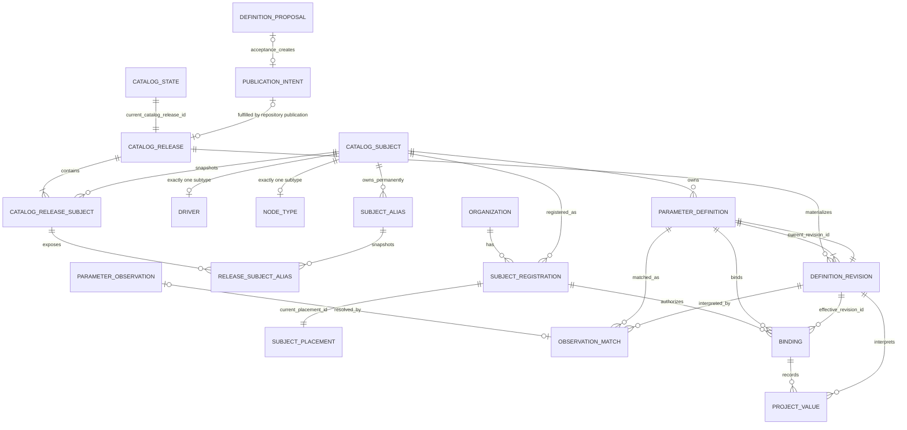

# ADR-0040：规范参数目录分离稳定身份与 release-scoped 状态

> English companion: [English decision record](../../adr/0040-canonical-parameter-catalog-relational-model.md)

日期：2026-08-31

## 状态

已被 [Wayfinder：用唯一规范定义模型替换参数目录](https://github.com/tzrea1-Q/WiseEff/issues/668) 接受为替换架构。本 ADR 描述目标模型，不表示当前运行中的数据库已经完成切换。

本记录继续使用 ADR-0040。[Issue #674](https://github.com/tzrea1-Q/WiseEff/issues/674) 的发布决策改用 ADR-0041；[Issue #675](https://github.com/tzrea1-Q/WiseEff/issues/675) 的 registration/placement 决策保持 ADR-0042。如果这些记录与本次修正冲突，必须按该编号与本决策统一解读和修正。

## 背景

当前目录把一份属性契约分散在 `parameter_specs`、`parameter_spec_versions`、归属主体、Schema 根/属性、组织 overlay、放置、评审、Binding，以及重复的 lifecycle/current 字段中。因此，组织 override、未匹配 DTS occurrence、提案或历史行都可能看起来像第二份当前定义。

[Issue #669](https://github.com/tzrea1-Q/WiseEff/issues/669) 确定了兼容义务；[Issue #670](https://github.com/tzrea1-Q/WiseEff/issues/670) 确定旧行必须按完整关系图分类，R6/R7/R8 证据不能凭名称或 property key 变成当前定义。ADR-0041 把不可变仓库 Catalog Release 设为唯一发布输入；ADR-0042 要求每个已注册正式主体在 Organization 内只有一个持久 registration 和恰好一个保留 placement。

剩余模型必须只有一条物化权威路径，具备稳定身份、不可变且完整的 revision 历史、release-scoped lifecycle 真相，并由数据库保证 aggregate 闭合。尤其是 Proposal 接受不能形成写入 `ParameterDefinition`/`DefinitionRevision` 的第二条路径；CatalogSubject lifecycle 不能与 release history 漂移；“恰好一个 placement”必须在 active、retired 两种 registration 状态下都于事务提交时成立。

## 决策

### 权威与 aggregate 边界

- **Catalog Release** 是经仓库评审的不可变发布，包含此前已发布的每个正式主体和 alias 的完整 as-of membership snapshot，以及定义内容。
- **Catalog Release synchronizer** 是稳态下唯一允许物化 `CatalogSubject`、release membership、`ParameterDefinition`、`DefinitionRevision` 行，并原子推进 current-release 与 definition head 的 writer。PostgreSQL 是其投影，不是创作来源。
- **Definition Proposal** 是待治理的变更意图。接受操作只能批准或创建 Platform catalog publication intent 或仓库变更，不能插入、更新、退役或以其他方式物化 definition/revision；Proposal 服务不得成为第二个 materializer。
- **Catalog Subject** 是 Platform 所有的永久身份，并且恰好是一个 `Driver` 或一个 `NodeType`；root 不保存独立 active/retired flag。
- **Catalog Release Subject** 是该身份在一个 release 中的不可变 membership；只有它提供该 release 的 subject lifecycle、selector snapshot 与 tombstone provenance。
- **Parameter Definition** 是一份 subject/property 契约的稳定身份；**Definition Revision** 是全部持久化定义内容的不可变快照。
- **Organization Subject Registration** 是某 Organization 使用一个正式主体的持久声明，lifecycle 为 `active | retired`，并始终拥有恰好一个保留的 **Subject Placement**。
- **Parameter Observation** 是不可变来源证据；**Binding** 是项目 logical node 与一个已注册定义的稳定关联；**Project Value** 是该 Binding 下的不可变值事实。三者都不拥有或物化目录真相。

Proposal、目录发布、同步、registration/placement、匹配、Binding 与项目值 mutation 是独立事务边界。调用方可以编排它们，但不能绕过所属 aggregate，也不能跨这些边界共享未提交的目录写入。

### 关系图



Subtype 基数是排他的：一个 subject 必须有一个 Driver 行 xor 一个 NodeType 行。`CATALOG_STATE` 指向一个 current immutable release；subject 与 alias 状态只从该 release 的 membership 导出。两条 `PARAMETER_DEFINITION` → `DEFINITION_REVISION` 边分别表示不可变历史与非空 current-head 指针。图中刻意不在 `CATALOG_SUBJECT` 保存 mutable status，也没有 Proposal → Definition 物化边或 Placement → Binding 身份边。

### 规范术语

| 术语                    | 精确定义与边界                                                                                                                                                         |
| ----------------------- | ---------------------------------------------------------------------------------------------------------------------------------------------------------------------- |
| `CatalogSubject`        | 拥有永久 kind 与 canonical key 的稳定 Platform 身份。Root 不保存 current 或 historical lifecycle；状态从 CatalogReleaseSubject 读取。                                  |
| `CatalogReleaseSubject` | 连接一个 Catalog Release 与一个 CatalogSubject 的不可变 as-of membership，包含 active/retired lifecycle 以及 selector 或 tombstone provenance。                        |
| `SubjectAlias`          | 一个 CatalogSubject 对某个规范化外部 selector 的永久所有权。Alias 在某 release 中 active 或 retired 是另一条不可变 membership 事实。                                   |
| `Driver`                | 由权威 `compatible` matcher 选择的 CatalogSubject 子类型，持有 Driver 专属 nature/cardinality 事实。                                                                   |
| `NodeType`              | 仅在没有 Driver 匹配时，由正式规范化 node-name matcher 选择的 CatalogSubject 子类型；不是观察到的 module label 或弱 Driver。                                           |
| `ParameterDefinition`   | 一个永久 `(subject_id, property_key)` 目录键的稳定不透明身份；只包含身份和 current-revision 指针，不包含可变定义内容。                                                 |
| `DefinitionRevision`    | 所有持久化定义内容字段的不可变快照，包括 documentation、unit、constraint、default、lifecycle 内容与 matching/interpretation 元数据。                                   |
| `DefinitionProposal`    | 可评审的 Platform 目录变更意图；接受只产生或批准 publication intent/仓库变更，绝不物化目录行。                                                                         |
| `ParameterObservation`  | 可以被匹配或进入评审的不可变项目/来源证据；绝不变成定义。                                                                                                              |
| `SubjectRegistration`   | 一个持久 `(organization_id, subject_id)` 身份，lifecycle 为 active 或 retired；在所有 lifecycle 状态下都引用恰好一个保留的 current placement。                         |
| `SubjectPlacement`      | 一个 registration 所有的单一稳定 taxonomy node。rename/reparent 更新同一身份；它不是 observed usage，也不是 Binding 身份。                                             |
| `Binding`               | 一个项目 logical node、一个 Organization registration 与一个 ParameterDefinition 之间的稳定关联；`effective_revision_id` 在治理后的语义 cutover 前控制新值使用的契约。 |
| `ProjectValue`          | Binding 下的不可变 value/source/config 事实，固定引用验证并解释它的确切 DefinitionRevision。                                                                           |

这些定义与 ADR-0042 保持一致：formal subject、registration、authoritative placement、observed usage、Binding 与 value 是不同事实。“Registration”绝不表示 catalog subject、module、observation 或项目级使用；“Placement”绝不表示 occurrence 或 Binding。

### 逻辑关系职责与键

实现规范可以选择不同物理名称，但不得隐藏或削弱以下所有权和约束语义。

| 关系                                                  | 职责与最小键                                                                                                                                                                                                                                                                                                                        |
| ----------------------------------------------------- | ----------------------------------------------------------------------------------------------------------------------------------------------------------------------------------------------------------------------------------------------------------------------------------------------------------------------------------- |
| `catalog_releases`                                    | 不可变 `id`、唯一 version/digest 与 predecessor release FK。Release 绝不更新或删除。                                                                                                                                                                                                                                                |
| `catalog_state`                                       | 包含非空 `current_catalog_release_id` FK 的 singleton。它是唯一 current-release pointer，并且仅在完整 target release projection 验证后切换。                                                                                                                                                                                        |
| `catalog_subjects`                                    | 稳定 Platform root：不透明 `id`、不可变 `kind`、永久 canonical key。全部历史保持 `UNIQUE (kind, canonical_key)`；没有 `organization_id`、lifecycle 或 current-selector 字段。                                                                                                                                                       |
| `catalog_release_subjects`                            | 不可变 release membership：`release_id`、`subject_id`、`lifecycle`（active/retired）、selector snapshot/provenance；retired 时必须有显式 tombstone provenance。`PRIMARY KEY (release_id, subject_id)` 加两个 owner FK；全部删除均 restrict。                                                                                        |
| `catalog_drivers` / `catalog_node_types`              | 互斥稳定 subtype identity，且恰好一行与 `catalog_subjects.kind` 一致。可变 selector/matcher snapshot 位于 release membership，不作为独立 current subtype state。                                                                                                                                                                    |
| `catalog_subject_aliases`                             | 永久 alias ownership：不透明 `id`、`subject_id`、selector kind、normalized selector。全部历史保持 `UNIQUE (selector_kind, normalized_selector)` 与 `UNIQUE (id, subject_id)`；subject FK 和 restricted deletion 防止重新分配。                                                                                                      |
| `catalog_release_subject_aliases`                     | 不可变 per-release alias state/provenance。`PRIMARY KEY (release_id, alias_id)`；复合 FK `(release_id, subject_id)` → release subject 及 `(alias_id, subject_id)` → stable alias 证明 owner 一致。行限制删除；current lookup 通过 `catalog_state.current_catalog_release_id` join。Active/retired 行使用显式 tombstone provenance。 |
| `parameter_definitions`                               | 不透明稳定 `id`、`subject_id`、规范化 `property_key`、非空 `current_revision_id`。永久 `UNIQUE (subject_id, property_key)`，并提供 `UNIQUE (id, subject_id)` 支持所有权 FK。没有组织、module、Proposal、Observation 或可变内容列。                                                                                                  |
| `definition_revisions`                                | 不透明 `id`、`definition_id`、单调展示用 `revision_number`、release provenance/digest 与完整不可变内容快照。`UNIQUE (definition_id, revision_number)`、`UNIQUE (definition_id, id)`；没有 `current` flag。                                                                                                                          |
| `definition_proposals` / publication intents          | Proposal identity、拟议变更、适用时的确切 base release/revision、评审/audit 状态，以及已接受 publication-intent 或仓库变更引用。Proposal 接受不写 accepted-revision 字段。                                                                                                                                                          |
| DTS occurrence 关系 / `parameter_observation_matches` | 不可变 observation provenance；每个 occurrence 至多一个 accepted match。Match 固定 definition、revision、registration、Binding、matcher revision 和 Catalog Release digest。无行表示未识别；歧义保留为评审证据。                                                                                                                    |
| `organization_subject_registrations`                  | 不透明 `id`、`organization_id`、`subject_id`、`status`、origin/proof、非空 `current_placement_id`。永久 `UNIQUE (organization_id, subject_id)` 及包含 organization 的 candidate key。                                                                                                                                               |
| `subject_placements`                                  | 不透明稳定 `id`、`registration_id`、同 Organization taxonomy module、origin。`UNIQUE (registration_id)` 使保留 placement 成为唯一 placement 行；`UNIQUE (organization_id, module_id)` 防止两个注册主体占用一个 placement module。                                                                                                   |
| `project_parameter_bindings`                          | 不透明稳定 `id`、organization/project/logical-node 身份、`registration_id`、`subject_id`、`definition_id`、非空 `effective_revision_id` 与显式 `current_value_id`。`UNIQUE (project_id, logical_node_id, definition_id)`；没有 `module_id`。                                                                                        |
| project-value 行                                      | 包含不透明 `id`、`binding_id`、`definition_id`、确切 `definition_revision_id` 的不可变 value/source/config 事实。Binding 有显式 current-value 指针；reader 不得按最大编号或时间推断 tip。                                                                                                                                           |
| typed legacy-ID map / archive ledger                  | 每个需要保留的外部引用 legacy ID 恰好一次映射到同 kind 稳定目标；无法证明身份时映射到不可变 archive evidence。                                                                                                                                                                                                                      |

Tombstone 是 provenance，不是可独立寻址的 identity：subject lifecycle 为 retired 时，`catalog_release_subjects.tombstone_provenance` 必须存在；alias retirement 的 `catalog_release_subject_aliases.tombstone_provenance` 遵循同一规则。把它放在不可变 membership 行上，使 lifecycle 与 withdrawal evidence 不可分离。

### Release-scoped subject lifecycle、replay 与稳定 ID

- 所有领域 ID 都是生成的不透明值；自然键、content digest、path 与 hash 都不是实体 ID。
- `catalog_subjects` 没有 current lifecycle flag。Current subject 状态是该 subject 经 `catalog_state.current_catalog_release_id` → `catalog_release_subjects` 得到的唯一结果。
- 每个 release 都是其 predecessor 已知全部 subject/alias 的完整 as-of membership snapshot。Successor 缺少 subject 或 alias 是非法 omission，不是 retirement。Retirement 是显式 `retired` membership，并且 tombstone provenance 非空。
- Restore 是后续 release 为同一 subject ID 写入 `active` membership。即使处于 retired，稳定 `(kind, canonical_key)` 与 alias ownership 也绝不重新分配。
- Historical replay 按 pinned release ID 读取 `catalog_release_subjects` 与 `catalog_release_subject_aliases`，绝不通过 `catalog_state` join，也不套用 current lifecycle/alias。在首次发布之前的 release 中缺少该 subject 表示“尚未发布”，不是 retired。
- `(subject_id, property_key)` 在退役后仍永久保留；退役不能释放该键供复用，也不能创建第二个 definition identity。
- `parameter_definitions.current_revision_id` 是唯一 definition-head 真相。非空可延迟复合 FK 证明 revision 属于同一 definition。Revision number 与 timestamp 只用于展示/排序，绝不能用于选择 head。
- 任何持久化定义内容变化都创建新的不可变 DefinitionRevision，包括仅修改 documentation。既有 revision 行绝不更新或删除。
- Synchronizer 只能从已发布不可变 Catalog Release 派生新 revision，并在同一事务推进 definition head。重放同一已验证 release digest 是只读 no-op。
- Documentation-only revision 会推进 Definition head，但不要求 Binding `effective_revision_id` 或 ProjectValue cutover。最新目录文档可从 Definition head 展示；既有 Binding 校验与 ProjectValue 解释继续固定到先前兼容 revision。
- 语义或 matching 不兼容 revision 可能要求独立治理的 Binding cutover，之后新值才能使用它。该 cutover 绝不重写历史 ProjectValue；每条历史值保持原 revision。
- Current release membership 为 retired 的 subject 不参与新匹配和 registration，但保留 stable root、definition、current revision、registration、placement、Binding、observation、value、alias、release membership 与 audit。后续 release 使用同一身份 restore。

### 恰好一个保留 placement

`UNIQUE (registration_id)` 只能证明“至多一个”。目标模型还保存 `organization_subject_registrations.current_placement_id NOT NULL`，并使用指回 `subject_placements(registration_id, id)` 的可延迟复合 FK。二者共同证明，在提交时：

1. 每个 registration 指向存在且属于自己的 placement；
2. 每个 registration 至多拥有一个 placement 行，因此恰好拥有一个；
3. 不存在可能与指针冲突的独立 `is_current` flag；
4. 不变量不区分 `active` 与 `retired`，两者都成立。

创建 registration 时，在 constraints deferred 的同一事务插入 registration 和初始 placement。Rename/reparent 更新同一 placement ID。Retirement 绝不清空指针或删除 placement。移动 placement 会改变所有继承 definition 的 taxonomy 投影，但不改变 Definition、Binding、Observation 或 ProjectValue 身份。

### PostgreSQL 约束级示例

以下是规范性约束草图，不是 migration。实现可以选择其他物理名称，但必须提供等价 PostgreSQL 证明。

```sql
CREATE TABLE catalog_releases (
  id uuid PRIMARY KEY,
  release_version text NOT NULL UNIQUE,
  release_digest text NOT NULL UNIQUE,
  predecessor_release_id uuid REFERENCES catalog_releases(id) ON DELETE RESTRICT
);

CREATE TABLE catalog_subjects (
  id uuid PRIMARY KEY,
  kind text NOT NULL CHECK (kind IN ('driver', 'node-type')),
  canonical_key text NOT NULL,
  UNIQUE (kind, canonical_key),
  UNIQUE (id, kind)
);

CREATE TABLE catalog_release_subjects (
  release_id uuid NOT NULL REFERENCES catalog_releases(id) ON DELETE RESTRICT,
  subject_id uuid NOT NULL REFERENCES catalog_subjects(id) ON DELETE RESTRICT,
  lifecycle text NOT NULL CHECK (lifecycle IN ('active', 'retired')),
  selector_snapshot jsonb NOT NULL,
  selector_provenance jsonb NOT NULL,
  tombstone_provenance jsonb,
  PRIMARY KEY (release_id, subject_id),
  CHECK (
    (lifecycle = 'active' AND tombstone_provenance IS NULL) OR
    (lifecycle = 'retired' AND tombstone_provenance IS NOT NULL)
  )
);

CREATE TABLE catalog_subject_aliases (
  id uuid PRIMARY KEY,
  subject_id uuid NOT NULL REFERENCES catalog_subjects(id) ON DELETE RESTRICT,
  selector_kind text NOT NULL,
  normalized_selector text NOT NULL,
  UNIQUE (selector_kind, normalized_selector),
  UNIQUE (id, subject_id)
);

CREATE TABLE catalog_release_subject_aliases (
  release_id uuid NOT NULL,
  subject_id uuid NOT NULL,
  alias_id uuid NOT NULL,
  lifecycle text NOT NULL CHECK (lifecycle IN ('active', 'retired')),
  selector_provenance jsonb NOT NULL,
  tombstone_provenance jsonb,
  PRIMARY KEY (release_id, alias_id),
  FOREIGN KEY (release_id, subject_id)
    REFERENCES catalog_release_subjects (release_id, subject_id)
    ON DELETE RESTRICT,
  FOREIGN KEY (alias_id, subject_id)
    REFERENCES catalog_subject_aliases (id, subject_id)
    ON DELETE RESTRICT,
  CHECK (
    (lifecycle = 'active' AND tombstone_provenance IS NULL) OR
    (lifecycle = 'retired' AND tombstone_provenance IS NOT NULL)
  )
);

CREATE TABLE catalog_state (
  singleton boolean PRIMARY KEY DEFAULT true CHECK (singleton),
  current_catalog_release_id uuid NOT NULL
    REFERENCES catalog_releases(id) ON DELETE RESTRICT
);

CREATE FUNCTION assert_catalog_release_membership_complete()
RETURNS trigger
LANGUAGE plpgsql
AS $$
BEGIN
  IF EXISTS (
    SELECT 1
    FROM catalog_releases AS target_release
    JOIN catalog_release_subjects AS predecessor_subject
      ON predecessor_subject.release_id = target_release.predecessor_release_id
    LEFT JOIN catalog_release_subjects AS target_subject
      ON target_subject.release_id = target_release.id
     AND target_subject.subject_id = predecessor_subject.subject_id
    WHERE target_release.id = NEW.current_catalog_release_id
      AND target_subject.subject_id IS NULL
  ) THEN
    RAISE EXCEPTION 'catalog release omits predecessor subject'
      USING ERRCODE = '23514';
  END IF;

  IF EXISTS (
    SELECT 1
    FROM catalog_releases AS target_release
    JOIN catalog_release_subject_aliases AS predecessor_alias
      ON predecessor_alias.release_id = target_release.predecessor_release_id
    LEFT JOIN catalog_release_subject_aliases AS target_alias
      ON target_alias.release_id = target_release.id
     AND target_alias.alias_id = predecessor_alias.alias_id
    WHERE target_release.id = NEW.current_catalog_release_id
      AND target_alias.alias_id IS NULL
  ) THEN
    RAISE EXCEPTION 'catalog release omits predecessor alias'
      USING ERRCODE = '23514';
  END IF;

  IF EXISTS (
    SELECT 1
    FROM catalog_release_subject_aliases AS release_alias
    JOIN catalog_release_subjects AS release_subject
      ON (release_subject.release_id, release_subject.subject_id) =
         (release_alias.release_id, release_alias.subject_id)
    WHERE release_alias.release_id = NEW.current_catalog_release_id
      AND release_alias.lifecycle = 'active'
      AND release_subject.lifecycle <> 'active'
  ) THEN
    RAISE EXCEPTION 'active alias requires active subject membership'
      USING ERRCODE = '23514';
  END IF;

  RETURN NEW;
END;
$$;

CREATE CONSTRAINT TRIGGER catalog_state_membership_complete_ck
AFTER INSERT OR UPDATE OF current_catalog_release_id
ON catalog_state
DEFERRABLE INITIALLY DEFERRED
FOR EACH ROW EXECUTE FUNCTION assert_catalog_release_membership_complete();

CREATE TABLE parameter_definitions (
  id uuid PRIMARY KEY,
  subject_id uuid NOT NULL REFERENCES catalog_subjects(id) ON DELETE RESTRICT,
  property_key text NOT NULL,
  current_revision_id uuid NOT NULL,
  UNIQUE (subject_id, property_key),
  UNIQUE (id, subject_id)
);

CREATE TABLE definition_revisions (
  id uuid PRIMARY KEY,
  definition_id uuid NOT NULL REFERENCES parameter_definitions(id) ON DELETE RESTRICT,
  revision_number bigint NOT NULL CHECK (revision_number > 0),
  catalog_release_id uuid NOT NULL REFERENCES catalog_releases(id) ON DELETE RESTRICT,
  content_digest text NOT NULL,
  content jsonb NOT NULL,
  UNIQUE (definition_id, revision_number),
  UNIQUE (definition_id, id)
);

ALTER TABLE parameter_definitions
  ADD CONSTRAINT parameter_definition_current_revision_fk
  FOREIGN KEY (id, current_revision_id)
  REFERENCES definition_revisions (definition_id, id)
  ON DELETE RESTRICT
  DEFERRABLE INITIALLY DEFERRED;

CREATE TABLE organization_subject_registrations (
  id uuid PRIMARY KEY,
  organization_id uuid NOT NULL,
  subject_id uuid NOT NULL REFERENCES catalog_subjects(id) ON DELETE RESTRICT,
  status text NOT NULL CHECK (status IN ('active', 'retired')),
  current_placement_id uuid NOT NULL,
  UNIQUE (organization_id, subject_id),
  UNIQUE (id, organization_id),
  UNIQUE (id, organization_id, subject_id)
);

CREATE TABLE subject_placements (
  id uuid PRIMARY KEY,
  registration_id uuid NOT NULL,
  organization_id uuid NOT NULL,
  module_id uuid NOT NULL,
  origin text NOT NULL CHECK (origin IN ('auto', 'curated')),
  UNIQUE (registration_id),
  UNIQUE (registration_id, id),
  UNIQUE (organization_id, module_id),
  FOREIGN KEY (registration_id, organization_id)
    REFERENCES organization_subject_registrations (id, organization_id)
    ON DELETE RESTRICT,
  FOREIGN KEY (module_id, organization_id)
    REFERENCES parameter_modules (id, organization_id)
    ON DELETE RESTRICT
);

ALTER TABLE organization_subject_registrations
  ADD CONSTRAINT registration_current_placement_fk
  FOREIGN KEY (id, current_placement_id)
  REFERENCES subject_placements (registration_id, id)
  ON DELETE RESTRICT
  DEFERRABLE INITIALLY DEFERRED;

CREATE CONSTRAINT TRIGGER subject_placement_kind_ck
AFTER INSERT OR UPDATE OF registration_id, organization_id, module_id
ON subject_placements
DEFERRABLE INITIALLY DEFERRED
FOR EACH ROW EXECUTE FUNCTION assert_subject_placement_kind();

-- Current matching is anchored to exactly one release pointer.
SELECT rs.subject_id, rs.lifecycle, rs.selector_snapshot
FROM catalog_state AS state
JOIN catalog_release_subjects AS rs
  ON rs.release_id = state.current_catalog_release_id
WHERE state.singleton AND rs.subject_id = $1;

-- Current alias resolution uses the same release pointer and active memberships.
SELECT alias.subject_id, alias.selector_kind, alias.normalized_selector
FROM catalog_state AS state
JOIN catalog_release_subject_aliases AS release_alias
  ON release_alias.release_id = state.current_catalog_release_id
JOIN catalog_subject_aliases AS alias
  ON (alias.id, alias.subject_id) =
     (release_alias.alias_id, release_alias.subject_id)
JOIN catalog_release_subjects AS release_subject
  ON (release_subject.release_id, release_subject.subject_id) =
     (release_alias.release_id, release_alias.subject_id)
WHERE state.singleton
  AND release_alias.lifecycle = 'active'
  AND release_subject.lifecycle = 'active'
  AND alias.selector_kind = $1
  AND alias.normalized_selector = $2;

-- Historical replay bypasses catalog_state and uses its pinned release.
SELECT rs.subject_id, rs.lifecycle, rs.selector_snapshot
FROM catalog_release_subjects AS rs
WHERE rs.release_id = $1 AND rs.subject_id = $2;

SELECT alias.subject_id, alias.selector_kind, alias.normalized_selector,
       release_alias.lifecycle
FROM catalog_release_subject_aliases AS release_alias
JOIN catalog_subject_aliases AS alias
  ON (alias.id, alias.subject_id) =
     (release_alias.alias_id, release_alias.subject_id)
WHERE release_alias.release_id = $1 AND release_alias.alias_id = $2;
```

`assert_catalog_release_membership_complete()` 在 current pointer 提交前，按 target release 声明的 predecessor 执行校验。每个 predecessor subject 与 stable alias 必须在 target 中恰好有一条 membership；每个 retired 行必须有 tombstone provenance；alias owner 与 subject lifecycle 必须一致；selector 不能与 stable canonical key 或 alias owner 冲突，也不能被重新分配。因此，omission 会中止 pointer switch，旧 release 保持 current。该 completeness trigger 校验不可变 release 关系，不给它们增加 current flag。

`assert_subject_placement_kind()` 沿 placement → registration → CatalogSubject 与同 Organization module 做 join；若 Driver 未映射到 `driver-group`，或 NodeType 未映射到 `node-type`，就抛出约束错误。如果使用 subtype table，则另一个 deferred constraint trigger 保证每个 subject kind 恰好一个 subtype 行。这些 trigger 校验其他 aggregate 所有的事实，不复制 kind 或 current-state 列。

带 tenant 的 Binding FK 使用相同模式：`(registration_id, organization_id, subject_id)` 引用 registration candidate key；`(definition_id, subject_id)` 引用 definition candidate key；`(definition_id, effective_revision_id)` 引用 revision candidate key。ProjectValue 与 observation-match 行重复足够的 owner key，以复合 FK 证明 Binding/definition/revision 一致。

物化权威还必须在 database role 边界执行；目录表由不可登录 migration owner 所有：

```sql
REVOKE INSERT, UPDATE, DELETE ON
  catalog_releases, catalog_state, catalog_subjects,
  catalog_drivers, catalog_node_types, catalog_release_subjects,
  catalog_subject_aliases, catalog_release_subject_aliases,
  parameter_definitions, definition_revisions
FROM PUBLIC, application_role, proposal_service_role;

GRANT INSERT ON
  catalog_releases, catalog_state, catalog_subjects,
  catalog_drivers, catalog_node_types, catalog_release_subjects,
  catalog_subject_aliases, catalog_release_subject_aliases,
  parameter_definitions, definition_revisions
TO catalog_synchronizer_role;

GRANT UPDATE (current_catalog_release_id) ON catalog_state
TO catalog_synchronizer_role;

GRANT UPDATE (current_revision_id) ON parameter_definitions
TO catalog_synchronizer_role;

REVOKE UPDATE, DELETE ON
  catalog_releases, catalog_subjects, catalog_drivers, catalog_node_types,
  catalog_release_subjects, catalog_subject_aliases,
  catalog_release_subject_aliases, definition_revisions
FROM PUBLIC, application_role, proposal_service_role, catalog_synchronizer_role;

GRANT SELECT ON
  catalog_releases, catalog_state, catalog_subjects,
  catalog_drivers, catalog_node_types, catalog_release_subjects,
  catalog_subject_aliases, catalog_release_subject_aliases,
  parameter_definitions, definition_revisions
TO application_role, proposal_service_role;
```

Proposal 接受只写 Proposal/publication-intent 关系和可信 audit；Proposal role 没有目录表 mutation grant。Release membership、alias、tombstone provenance 与 DefinitionRevision 行只追加。只有 synchronizer 获得切换 current Catalog Release 或 Definition head 的 column-level grant；普通 role 不能制造 current subject lifecycle。

### 数据库与事务不变量

数据库而不是只有 HTTP writer 必须执行以下规则：

1. CatalogSubject 只归 Platform，kind 不可变，并恰好有一个匹配的 Driver xor NodeType subtype。它没有 mutable lifecycle/current-selector state，永久 canonical key 绝不重新分配。
2. 每个 Catalog Release 对每个纳入的 subject/alias 恰好有一条不可变 membership。Owner/composite FK 把 membership 绑定到同一 release 与 stable subject；release、membership、alias、tombstone history 全部 restricted deletion。
3. 在 `catalog_state.current_catalog_release_id` 切换前，release-completeness constraint 拒绝 predecessor subject/alias omission 与非法 tombstone transition。Current lifecycle/alias 查询总是锚定该唯一 pointer；historical replay 永不使用它。
4. Definition identity 按 subject/property 永久唯一。每个 definition 都有一个属于自己的非空 head；每个 revision 不可变且属于一个 release。
5. 只有 Catalog Release synchronizer role 可以插入 catalog root、membership、alias、revision 或推进 head。Proposal、Observation、Registration、Binding、ProjectValue、HTTP、Agent 和普通应用 role 都不可以。
6. Registration 与 Placement 在两种 lifecycle 状态下都于提交时满足恰好一个保留 placement；Placement 必须同 Organization 且 kind 正确。
7. 复合 FK 证明 definition/revision、registration/subject/organization、Binding/definition/registration/effective revision、ProjectValue/binding/revision 与 observation-match 一致；跨 Organization 引用不能偶然满足键。
8. Unknown/ambiguous evidence 没有 accepted match，不能创建 Definition、Revision、Binding 或 ProjectValue。按 ADR-0042，一个唯一证明的 active subject 可以在尚未证明 property 时创建 registration/placement。
9. Subject、Definition、Revision、Registration、Placement、Binding、ProjectValue、match、legacy map、release 与 audit history 都限制删除；domain retirement 绝不是 cascade deletion。

事务所有权如下：

- **接受 Proposal：**锁定并解决 Proposal，记录已批准 publication intent 或 repository-change reference，并提交可信 audit；事务执行零次目录物化。
- **同步 Catalog Release：**取得排他 release lock；验证不可变 release 与 lineage；stage stable subject/alias root、完整 subject/alias release membership、selector/tombstone provenance 与 definition；为每个发生变化的持久化 definition snapshot 创建一个 revision（包括 documentation-only）；运行 predecessor completeness 与 ownership 检查；随后把 definition head 与 `current_catalog_release_id` 连同 materialization evidence/audit 原子推进。任何 omission 或非法 transition 都中止事务，旧 pointer 仍可见。同一已验证 digest 是只读 no-op。
- **注册并放置：**锁定 `(organization, subject)` 与目标 taxonomy key；在 deferred constraints 下插入/复用唯一 registration 及其唯一 placement；审计；全成或全败。Retire/restore 保留两个 ID 和非空指针。
- **识别并 Binding：**通过一次捕获的 `current_catalog_release_id` 读取 subject 与 alias 状态；只有 active release membership 可以匹配。固定 Observation、matcher revision、该 Catalog Release、确切 Definition/Revision、Registration 和 Binding。只在唯一 formal-subject proof 后调用 registration aggregate，但绝不物化 catalog identity 或 definition content。
- **切换 Binding revision：**compare-and-swap `effective_revision_id`，校验兼容性与 current Catalog Release，追加 audit/history。Documentation-only revision 跳过该事务。Semantic cutover 不改变既有 ProjectValue。
- **修改 Project Value：**锁定 Binding/current-value head，按 effective revision 校验，追加一条不可变 ProjectValue，推进显式 value pointer，并原子审计。
- **移动 Placement：**锁定 Registration 与来源/目标 taxonomy key，原地更新保留 placement ID，并原子审计；Binding 行绝不移动。

### Driver 与 NodeType 差异所在层

差异只位于三层：

1. **Catalog subtype：**Driver 拥有 compatible selector 与 Driver 专属 nature/cardinality；NodeType 拥有正式规范化 node-name selector。
2. **Matcher：**唯一 Driver `compatible` 匹配优先；只有没有 Driver 匹配时才 fallback 到 NodeType；结果绝不 union。
3. **Placement 校验：**Driver registration 使用 `driver-group` module；NodeType registration 使用 `node-type` module，并遵守 ADR-0042 的允许 taxonomy parent。

Definition、DefinitionRevision、Proposal、publication intent、stable ID、registration lifecycle、Binding、ProjectValue、audit 与 revision policy 对两种 kind 使用同一模型。在 definition-content storage、revisioning、Proposal materialization、Binding identity 或 ProjectValue storage 中添加 Driver/NodeType 分支，都属于放错层的关注点。

## 必须覆盖的 PostgreSQL 验收场景

实现规范必须在真实 PostgreSQL 上运行以下场景，不得用内存替代品。约束场景必须执行 `SET CONSTRAINTS ALL IMMEDIATE` 或 `COMMIT`；并发场景使用独立 session。

| 区域              | 必须覆盖的场景与预期                                                                                                                                                              |
| ----------------- | --------------------------------------------------------------------------------------------------------------------------------------------------------------------------------- |
| Materializer      | `proposal_service_role` 接受 Proposal 并写 intent/audit；对 Definition/Revision 的 INSERT/UPDATE 被拒绝，目录行数不变。                                                           |
| Materializer      | `catalog_synchronizer_role` 原子物化已发布 release；head 切换前失败时，全部旧 head/current release 保持不变。                                                                     |
| Idempotency       | 重放同一已验证 release digest 不创建行、不改变 head；以不同规范化内容复用 release version/digest 必须 fail closed。                                                               |
| Subject lifecycle | Release A 把一个 subject 标为 active；release B 用 tombstone provenance 显式标为 retired。Pointer 切换后阻止新匹配/registration，同时保留稳定 subject ID 与历史。                 |
| Omission          | Successor 缺少任一 predecessor subject 或 stable alias 时 completeness constraint 失败，不能成为 current；absence 绝不解释为 retirement。                                         |
| Restore           | Release C 使用同一 subject ID、kind、canonical key、definition 与 stable alias owner，把 retired subject 标回 active。把 canonical key 分配给另一 subject 的尝试失败。            |
| Historical replay | Release B/C 成为 current 后，固定到 release A 的 replay 仍读取 A 的 active membership 与 alias，绝不观察 current retired/restored 状态。                                          |
| Atomic visibility | Current-pointer 切换期间，并发 reader 只要所有 catalog read 锚定捕获的 pointer，就只能看到完整 release A 或完整 release B snapshot，不会看到混合 subject/alias 状态。             |
| Membership unique | 同一 `(release_id, subject_id)` 的第二条 `catalog_release_subjects` 与同一 `(release_id, alias_id)` 的第二条 release-alias 行被数据库 key 拒绝。                                  |
| Alias ownership   | Release alias 的 subject 不同于 stable owner、alias omission 未显式 retire，或同一 normalized selector 改分配给另一 subject，全部被拒绝；current lookup 使用 current membership。 |
| Revision          | 初始 Definition + 首个 Revision + 非空 head 在 deferred FK 下可提交；head 指向其他 Definition 的 Revision 时提交失败。                                                            |
| Revision          | shape、constraint、unit、default、lifecycle 内容、matching metadata 或 documentation 的任意变化都创建新不可变 Revision 并推进 head；原地 UPDATE/DELETE Revision 失败。            |
| Documentation     | Documentation-only release 创建 Revision 并推进 Definition head，但 Binding `effective_revision_id`、Binding 数量/ID、current ProjectValue 与全部历史 ProjectValue 逐字节不变。   |
| Semantic cutover  | Semantic revision 保持历史 ProjectValue 固定；受治理 Binding cutover 只推进 `effective_revision_id` 与 audit/history；过期 compare-and-swap 失败且无部分写入。                    |
| Placement 创建    | Registration 与一个归属自己的 Placement 在 constraints deferred 下按任一插入顺序均可提交；`active`、`retired` 都通过同一测试。                                                    |
| Placement 下界    | Registration 没有 Placement，或 `current_placement_id` 为空/缺失时，两种 lifecycle 都最迟在 constraint check/commit 失败。                                                        |
| Placement 所有权  | Registration 指向另一 Registration 的 Placement 时复合 FK 失败。                                                                                                                  |
| Placement 上界    | 同一 Registration 的第二个 Placement 触发 `UNIQUE (registration_id)`；不依赖任何 current flag。                                                                                   |
| Placement 保留    | 删除保留 Placement、retire 时同时删除它，或在没有归属 replacement 时清空/修改指针，全部原子失败；restore 保留两个 ID。                                                            |
| Placement 移动    | Rename/reparent 更新同一 Placement ID，Definition、Binding、Observation、ProjectValue 行不变；目标冲突时 move 与 audit 一起回滚。                                                 |
| Tenant 隔离       | 跨 Organization registration/module、Binding/registration 或 ProjectValue/Binding 组合触发复合 FK 失败。                                                                          |
| Subject kind      | 缺少 subtype、同时存在两个 subtype、subtype 不匹配、Driver→`node-type` placement、NodeType→`driver-group` placement 均在 deferred constraint check 失败。                         |
| Matching 边界     | Unknown/ambiguous evidence 只创建 observation/review evidence。Subject 唯一但 property 未知时可以创建 registration/placement，但不能创建 match、Binding、Definition 或 Revision。 |
| Binding 一致性    | Binding 的 Definition 属于其他 subject、Registration 属于其他 subject/Organization，或 effective Revision 属于其他 Definition 时全部失败。                                        |
| 并发              | 并发首次 registration 只产生一个稳定 Registration 与一个保留 Placement；并发 release sync 或 revision-head 推进只有一个确定性 winner/no-op，不产生 split head。                   |

## 后果

### G0.1 封闭 subtype 与 identity 补充

2026-09-02 由所有者授权的 G0.1 修正把本 ADR 先前仅作描述的值域封闭：`Driver.nature` 精确为 `physical-device | logical-service`，`Driver.instance_cardinality` 精确为 `multiple | singleton-per-project`；NodeType 不存在 family 字段或 family enum。

Canonical compatible、node-name 与 property-key 是 validation-only identity：接受值逐 byte 保存，不 trim、不转换大小写、不做 NFC/NFKC 或任何其他 Unicode normalization、不去引号、不去 `@`/unit-address。三者都拒绝 empty、non-ASCII、ASCII whitespace/control/DEL 与 matching-quoted raw token。Compatible 使用 `^[A-Za-z0-9][A-Za-z0-9+._/-]*(?:,[A-Za-z0-9][A-Za-z0-9+._/-]*)?$` 并禁止 wildcard。Node name 只接受 `/` 或 `^[A-Za-z][A-Za-z0-9,._+-]{0,30}$`，`@` 以 unit-address presence 拒绝。Property key 使用 `^[A-Za-z0-9,._+?#-]{1,31}$`，并按 ASCII case-insensitive 拒绝 `compatible`、`device_type`、`gpio-controller`、`interrupt-controller`、`linux,phandle`、`phandle`、`ranges`、`reg`、`status`、`#address-cells`、`#gpio-cells`、`#interrupt-cells`、`#size-cells` 以及任意 `#` 前缀。Failure classification 严格按 active #668 规格固定的顺序执行，且 reason set 封闭。

Canonical/alias ownership 按 selector kind 与接受后的 exact bytes 比较。同 owner 的 identical repeated claim 是 idempotent；same-key/different-owner 或 canonical/alias collision 是 typed conflict。S0-ID 独占 constructors 与 closed failure reasons；S1 bundle validation、S2 constraints、compiler、synchronizer、matcher 与 migration 只能消费，不能重做 normalization。exact reasons 与 golden vectors 以 active #668 实现规格为准。

- Catalog synchronizer 成为 deep module：发布校验、不可变 revision 创建、稳定 head 推进、权限边界与 release verification 隐藏在一个 seam 后，不再由 Proposal、ingest、startup 或 review 服务重复协调。
- Stable CatalogSubject 与 alias root 本身绝不回答 current lifecycle 问题。Synchronizer 隐藏完整 release membership 验证，并提供一个 current-release-anchored read model 与 exact-release replay。
- Organization 不能创作结构真相。Registration/Placement、Observation、Binding、ProjectValue 可以独立演进而不复制定义。
- Documentation 也遵循同一不可变 revision 规则，因此历史完整，同时避免不必要的 Binding/value cutover。
- 非空循环 head 需要 deferred constraints 与事务测试，但可以消除应用层检查在并发下无法证明的 zero-head 和 zero-placement 状态。
- 既有 Organization overlay、Proposal-to-definition writer、lazy ingest materialization、重复 current flag 与 Driver-only placement path 只作为待退役 migration input，绝不是目标契约。
- 本 ADR 不包含生产代码、migration、API、UI 或实现票。后续 specification 可以加深 module interface 和物理名称，但不得削弱 single materializer、immutable revision、exact-one placement、stable-ID 或 aggregate-boundary 决策。
