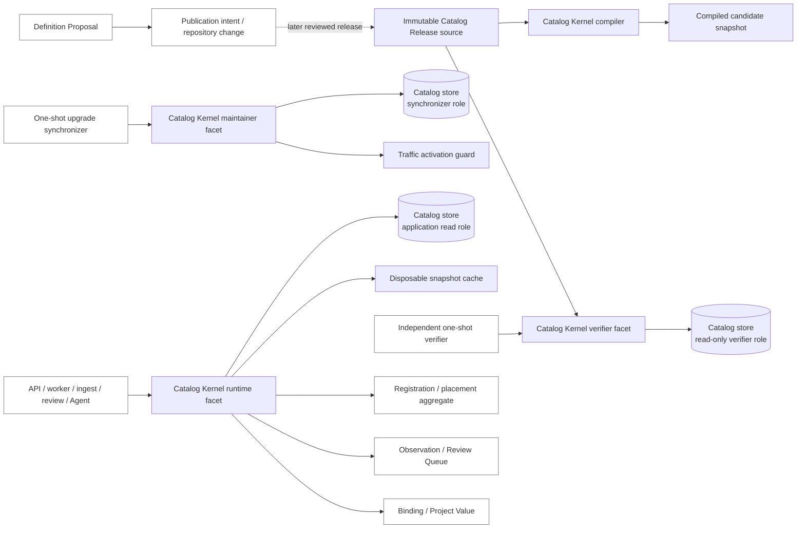

# Catalog Kernel 接口与事务边界

> English: [English](../../design-docs/catalog-kernel-interface-and-transaction-boundary.md)

状态：作为 [Choose the catalog kernel interface and transaction boundary](https://github.com/tzrea1-Q/WiseEff/issues/673) 经联合验收补全后的已接受目标合同。本页是 [Wayfinder: replace the parameter catalog with one canonical definition model](https://github.com/tzrea1-Q/WiseEff/issues/668) 后续实现规格的输入。S3-RUN（#691）在 `server/modules/catalog-kernel/interface.ts` 实现 TypeScript 公开类型以及 `loadCurrentCatalog` / `loadPinnedCatalog`。`installPublishedRelease`、`switchBackBeforeTraffic` 与 `verifyCurrentMaterialization` 在 S3-INS / S3-VFY 接管 adapter 前返回 tagged `permission-denied`。

本决策以 [`9fe269d4facc31b49fc1e0535d2d51ba7140644b`](https://github.com/tzrea1-Q/WiseEff/tree/9fe269d4facc31b49fc1e0535d2d51ba7140644b) 中通过验收的 ADR-0040/0041/0042 最终超集为前提；领域与关系语义继续以这些 ADR 为准。本页只决定深模块 seam、类型、事务所有权、权限、缓存行为和测试面，不创建生产代码、迁移、HTTP 路由、UI 或 implementation ticket，也不占用新的 ADR 编号。

## 决策摘要

**Catalog Kernel** 是一个无路由的深模块。它在一个公共 seam 后统一拥有 Catalog Release 的确定性编译、完整校验、原子物化、精确 release 快照、selector 匹配、Definition 查询、独立物化验证及可丢弃的快照缓存。调用方不再协调 catalog 表、不传入已开启事务、不选择 revision head、不自行应用 alias，也不推断 current lifecycle。

公共 seam 只有六个操作：

1. `compilePublishedRelease` 在不写数据库的情况下编译并校验 immutable release source。
2. `installPublishedRelease` 再次完整校验，并在一个 kernel 自有事务中安装首次或后继 release。
3. `switchBackBeforeTraffic` 执行严格 proof-gated 的流量前回切；一旦存在 candidate business write 或流量就不能使用。
4. `verifyCurrentMaterialization` 通过只读 verifier adapter 独立重编译 artifact 并与数据库比较。
5. `loadCurrentCatalog` 加载一个已经验证且与应用预期一致的 current snapshot。
6. `loadPinnedCatalog` 同时按 opaque ID 与 digest 加载一个精确历史 release。

`CurrentCatalogSnapshot` 和 `PinnedCatalogSnapshot` 暴露覆盖 canonical Catalog resource 的完整 typed read facet：release identity、Subject detail/listing、release-scoped membership 与 alias、Driver 优先且 NodeType fallback 的权威匹配、按 stable key 或 opaque ID 查询 Definition、全局或 subject-scoped Definition listing、精确 revision 查询与 history，以及 Catalog 自有 publication timeline fact。它们返回 tagged domain outcome，不用 `null` 隐藏状态。PostgreSQL 布局、join、锁、cache 对象、materialization fingerprint 和 release-to-revision-head 映射都属于私有实现。

## 模块 seam 与所有权

### Catalog Kernel 内部

- 通过 immutable `CatalogReleaseSource` adapter 读取原始 manifest 和 manifest 列出的内容。
- 确定性 normalize/compile，校验单文件和 aggregate digest，并拒绝 missing、unlisted、malformed、duplicated、reassigned、incomplete 或 non-deterministic 内容。
- 校验 predecessor lineage、完整 subject/alias membership、lifecycle/tombstone 配对、永久 selector owner、稳定 subject/property identity 及完整 definition snapshot。
- 物化 Catalog Release、Catalog subject、release membership、stable alias ownership、alias membership、Parameter definition 和 immutable Definition revision。
- 持久化足够的精确 per-release head provenance，使历史 release snapshot 和允许的流量前回切不依赖 timestamp、最大 revision number 或 current head 来推断历史。
- 拥有独占 catalog synchronization lock、事务、幂等复核、Definition revision head 前移、current release pointer 切换及 success audit/materialization evidence。
- 构造 immutable current/pinned read snapshot，包括 selector/alias index、Subject detail/global list、release membership、Definition identity/global 与 subject-scoped list、精确 revision history、Catalog publication fact、固定 ordering 和 release-bound cursor。
- 实现权威匹配：先求 active Driver `compatible` candidate；只有不存在 Driver match 时才考虑 NodeType normalized-name fallback。
- 使用不信任 writer bookkeeping 的只读 adapter，独立比较 compiled release 和完整数据库 projection。
- 拥有进程内 snapshot cache 构造、release key 选择和失效行为。

### Catalog Kernel 外部

- Repository review、Catalog Release authoring、artifact packaging/signing 和 publication workflow。Kernel 消费 immutable published source，不决定应发布什么。
- 数据库 DDL、role 创建、grant 以及 legacy data transformation。Migration owner 创建物理模型；模型存在后由 kernel 拥有 steady-state catalog materialization。
- Definition Proposal 的 review 与 acceptance。它只能产生 publication intent 或 repository change。
- Organization Subject registration 与 Subject placement。它们使用 catalog read 和 Match result，但拥有独立的 Organization-scoped 事务与 trusted audit。
- Parameter Observation 持久化、Review Queue workflow、Binding、受治理的 Binding revision cutover、Project Value 及 history write。
- 普通 HTTP、ingest、review、Agent、script 和 background job 协调。调用方可使用与角色相符的 kernel facet，但不能自行协调 catalog 写入。HTTP parameter/DTO mapping 与 cross-aggregate read composition 留在外部；handler 不能查询 Catalog table 或 post-filter Kernel page。
- Authorization-sensitive History/Audit timeline event，以及 Organization registration、placement、usage、scope selection。各 owner seam 可以在 Kernel pagination 前提供 authorized opaque ID selection，但 Kernel 既不决定 authorization，也不解释 Organization fact。
- Legacy-ID mapping/archive policy、migration phase、maintenance freeze、traffic state、recovery-point restore、route/DTO compatibility、readiness policy、observability threshold 和 legacy deletion gate。后续决策消费 kernel 的 proof surface，不把这些职责移入 kernel。

### 依赖图



`CatalogReleaseSource`、catalog store、traffic activation guard 和 cache 都是内部 adapter。它们是测试 seam，不是 application-facing coordination interface。生产 Catalog Kernel 在构造时接收 pool-backed `RootDatabase`，拒绝 transaction/savepoint handle；公共操作不接受 `Database`、`Queryable` 或 caller callback。

## 公共接口草图

下面的 TypeScript 在语义层面是规范性合同。实现可以调整文件或字段名，但必须保留六个操作、role-shaped capability restriction、tagged result 和相同不变量。

```ts
type Result<T> =
  | { readonly ok: true; readonly value: T }
  | { readonly ok: false; readonly error: CatalogKernelError };

interface CatalogKernel {
  compilePublishedRelease(
    source: CatalogReleaseSource,
  ): Promise<Result<CompiledCatalogRelease>>;

  installPublishedRelease(
    command: InstallPublishedReleaseCommand,
  ): Promise<Result<InstallResult>>;

  switchBackBeforeTraffic(
    command: PreTrafficSwitchBackCommand,
  ): Promise<Result<SwitchBackResult>>;

  verifyCurrentMaterialization(
    command: VerifyCurrentMaterializationCommand,
  ): Promise<Result<VerificationResult>>;

  loadCurrentCatalog(
    expected: CatalogReleasePin,
  ): Promise<Result<CurrentCatalogSnapshot>>;

  loadPinnedCatalog(
    pin: CatalogReleasePin,
  ): Promise<Result<PinnedCatalogSnapshot>>;
}

type CatalogRuntime = Pick<
  CatalogKernel,
  "loadCurrentCatalog" | "loadPinnedCatalog"
>;

type CatalogMaintainer = Pick<
  CatalogKernel,
  | "compilePublishedRelease"
  | "installPublishedRelease"
  | "switchBackBeforeTraffic"
>;

type CatalogVerifier = Pick<
  CatalogKernel,
  "compilePublishedRelease" | "verifyCurrentMaterialization" | "loadPinnedCatalog"
>;
```

这些 facet 是一个 module interface 的受限视图，不是三套实现。Runtime composition 只拿到 `CatalogRuntime`；one-shot synchronizer 只拿到 `CatalogMaintainer`；independent verifier 只拿到 `CatalogVerifier`。即使有人绕开 import discipline，数据库 grant 仍是安全边界。

### Release source 与 command

```ts
interface CatalogReleaseSource {
  readManifest(): Promise<Uint8Array>;
  listEntries(): Promise<readonly string[]>;
  readEntry(path: string): Promise<Uint8Array>;
}

type InstallPublishedReleaseCommand =
  | {
      readonly mode: "bootstrap";
      readonly source: CatalogReleaseSource;
      readonly expectedTargetDigest: CatalogReleaseDigest;
    }
  | {
      readonly mode: "advance";
      readonly source: CatalogReleaseSource;
      readonly expectedCurrent: CatalogReleasePin;
      readonly expectedTargetDigest: CatalogReleaseDigest;
    };

interface PreTrafficSwitchBackCommand {
  readonly maintenanceAttemptId: MaintenanceAttemptId;
  readonly expectedCurrent: CatalogReleasePin;
  readonly targetPrevious: CatalogReleasePin;
}

interface VerifyCurrentMaterializationCommand {
  readonly source: CatalogReleaseSource;
  readonly expected: CatalogReleasePin;
}

interface CatalogReleaseCounts {
  readonly subjects: number;
  readonly subjectMemberships: number;
  readonly aliases: number;
  readonly aliasMemberships: number;
  readonly definitions: number;
  readonly definitionRevisions: number;
}

type InstallResult =
  | {
      readonly status: "installed";
      readonly mode: "bootstrap" | "advance";
      readonly previous: CatalogReleasePin | null;
      readonly current: CatalogReleaseIdentity;
      readonly materializationFingerprint: CatalogMaterializationFingerprint;
      readonly counts: CatalogReleaseCounts;
    }
  | {
      readonly status: "already-current";
      readonly current: CatalogReleaseIdentity;
      readonly materializationFingerprint: CatalogMaterializationFingerprint;
      readonly counts: CatalogReleaseCounts;
    };

interface SwitchBackResult {
  readonly status: "switched-back";
  readonly maintenanceAttemptId: MaintenanceAttemptId;
  readonly previousCurrent: CatalogReleaseIdentity;
  readonly current: CatalogReleaseIdentity;
  readonly materializationFingerprint: CatalogMaterializationFingerprint;
}
```

`CatalogReleaseSource` 暴露 bytes 和 entry inventory，使 compiler 能自己发现 missing/unlisted content 并完成 path/digest validation。Source 不能提供“已经可信”的 parsed model。Filesystem/bundled-artifact adapter 和 deterministic fake 是两种必需 adapter。

即便 CI 已执行 `compilePublishedRelease`，`installPublishedRelease` 仍会在内部重新编译和校验 source。调用方不能提交手写 normalized row 或 caller-approved digest。`expectedTargetDigest` 必须等于 compiler result；`advance` 在取得 synchronization lock 后还会对 `expectedCurrent` 做 compare-and-swap。

`switchBackBeforeTraffic` 只接受 identity，不接受调用方自报的 `trafficStarted: false`。Kernel 持有 catalog lock 时，通过内部 traffic activation guard 验证 durable maintenance-attempt state。Guard 的实现由 cutover 设计提供，但必须证明没有 candidate business write，也没有 public/queue traffic。

### Snapshot interface

```ts
interface CatalogSnapshot {
  readonly release: CatalogReleaseIdentity;

  getSubject(subjectId: CatalogSubjectId): SubjectLookupResult;

  listSubjects(query: SubjectListQuery): SubjectListResult;

  resolveSubject(selector: SubjectSelector): MatchResult;

  getDefinition(input: {
    readonly subjectId: CatalogSubjectId;
    readonly propertyKey: PropertyKey;
  }): DefinitionLookupResult;

  getDefinitionById(
    definitionId: ParameterDefinitionId,
  ): DefinitionLookupResult;

  listDefinitions(query: DefinitionListQuery): DefinitionListResult;

  getDefinitionRevision(input: {
    readonly definitionId: ParameterDefinitionId;
    readonly revisionId: DefinitionRevisionId;
  }): DefinitionRevisionLookupResult;

  listDefinitionRevisions(
    query: DefinitionRevisionListQuery,
  ): DefinitionRevisionListResult;

  listDefinitionTimelineFacts(
    query: DefinitionTimelineQuery,
  ): DefinitionTimelineResult;
}

interface CurrentCatalogSnapshot extends CatalogSnapshot {
  readonly snapshotKind: "current";
  readonly materializationFingerprint: CatalogMaterializationFingerprint;
}

interface PinnedCatalogSnapshot extends CatalogSnapshot {
  readonly snapshotKind: "pinned";
  readonly pin: CatalogReleasePin;
}

interface CompiledCatalogSnapshot extends CatalogSnapshot {
  readonly snapshotKind: "candidate";
}

interface CompiledCatalogRelease {
  readonly release: CatalogReleaseIdentity;
  readonly predecessor: CatalogReleasePin | null;
  readonly aggregateDigest: CatalogReleaseDigest;
  readonly materializationFingerprint: CatalogMaterializationFingerprint;
  readonly counts: CatalogReleaseCounts;
  readonly candidateSnapshot: CompiledCatalogSnapshot;
}
```

Snapshot 加载完成后是 immutable 且 side-effect free 的。每个 read method 都同步查询 captured model，因此一次业务操作不可能混用 release。`CurrentCatalogSnapshot` 只通过 captured current release 解析 membership、alias、Definition head、revision 和 timeline fact；`PinnedCatalogSnapshot` 只按精确 ID/digest pin 解析同一 read facet，绝不查询 current membership、current alias 或 current head。已知 active subject 即便没有 Definition，也返回 `found` 和空 page。任何 lookup 都不以 `null` 或空对象表示 unknown、retired、ambiguous、not-yet-published 或 revision-unavailable。

Compiler 的 candidate snapshot 让 migration planning 能在不安装、不切换 production pointer 的情况下，针对 target release 解析 strong evidence。它不带来 publication authority，也不能作为 runtime cache。

## Nominal type 与领域结果

Opaque ID 与 digest 使用 branded type。HTTP string、SQL text、path、natural key 和 content hash 必须先在 adapter boundary 验证，不能直接冒充 domain identity。

```ts
declare const brand: unique symbol;
type Brand<T, Name extends string> = T & { readonly [brand]: Name };

type CatalogReleaseId = Brand<string, "CatalogReleaseId">;
type CatalogReleaseDigest = Brand<string, "CatalogReleaseDigest">;
type CatalogReleaseVersion = Brand<string, "CatalogReleaseVersion">;
type CatalogMaterializationFingerprint = Brand<
  string,
  "CatalogMaterializationFingerprint"
>;
type CatalogSubjectId = Brand<string, "CatalogSubjectId">;
type CatalogAliasId = Brand<string, "CatalogAliasId">;
type CatalogCanonicalKey = Brand<string, "CatalogCanonicalKey">;
type ParameterDefinitionId = Brand<string, "ParameterDefinitionId">;
type DefinitionRevisionId = Brand<string, "DefinitionRevisionId">;
type CatalogTimelineFactId = Brand<string, "CatalogTimelineFactId">;
type CatalogCursor = Brand<string, "CatalogCursor">;
type CatalogSearchText = Brand<string, "CatalogSearchText">;
type CatalogPageLimit = Brand<number, "CatalogPageLimit">;
type CatalogReleaseSequence = Brand<number, "CatalogReleaseSequence">;
type CatalogEventTime = Brand<string, "CatalogEventTime">;
type CatalogTombstoneReason = Brand<string, "CatalogTombstoneReason">;
type CatalogSelectionFingerprint = Brand<string, "CatalogSelectionFingerprint">;
type PropertyKey = Brand<string, "PropertyKey">;
type DriverCompatible = Brand<string, "DriverCompatible">;
type NormalizedNodeTypeName = Brand<string, "NormalizedNodeTypeName">;
type MaintenanceAttemptId = Brand<string, "MaintenanceAttemptId">;

type CatalogSubjectKind = "driver" | "node-type";
type SubjectLifecycle = "active" | "retired";

interface CatalogReleaseIdentity {
  readonly id: CatalogReleaseId;
  readonly version: CatalogReleaseVersion;
  readonly digest: CatalogReleaseDigest;
}

interface CatalogReleasePin {
  readonly id: CatalogReleaseId;
  readonly digest: CatalogReleaseDigest;
}

interface SubjectSelector {
  readonly driverCompatibles: readonly DriverCompatible[];
  readonly nodeTypeFallback:
    | { readonly kind: "present"; readonly name: NormalizedNodeTypeName }
    | { readonly kind: "absent" };
}

type CatalogSubjectSelectorSnapshot =
  | {
      readonly kind: "driver-compatible";
      readonly values: readonly DriverCompatible[];
    }
  | {
      readonly kind: "node-type-name";
      readonly value: NormalizedNodeTypeName;
    };

interface CatalogTombstoneSummary {
  readonly reason: CatalogTombstoneReason;
  readonly successorSubjectId: OptionalValue<CatalogSubjectId>;
}

interface CatalogSubjectMembershipSnapshot {
  readonly release: CatalogReleaseIdentity;
  readonly lifecycle: SubjectLifecycle;
  readonly selector: CatalogSubjectSelectorSnapshot;
  readonly tombstone: OptionalValue<CatalogTombstoneSummary>;
}

interface CatalogAliasMembershipSnapshot {
  readonly release: CatalogReleaseIdentity;
  readonly lifecycle: SubjectLifecycle;
  readonly tombstone: OptionalValue<CatalogTombstoneSummary>;
}

interface SubjectAliasSnapshot {
  readonly id: CatalogAliasId;
  readonly selector:
    | { readonly kind: "driver-compatible"; readonly value: DriverCompatible }
    | { readonly kind: "node-type-name"; readonly value: NormalizedNodeTypeName };
  readonly subjectId: CatalogSubjectId;
  readonly membership: CatalogAliasMembershipSnapshot;
}
```

`SubjectSelector` 包含完整 matcher input，调用方无法在忽略 ambiguous Driver result 后自行调用 NodeType lookup。Kernel 先评估 active Driver candidate；只有 Driver candidate set 为空时才评估 `nodeTypeFallback`。Canonical selector 与 one-hop alias 都使用 captured release membership；pinned snapshot 永远不应用 current alias。`getSubject` 返回 captured subject membership 与全部 captured stable alias membership，包括显式 retired/tombstone state。调用方不能从 stable root 重建 current membership，也不能把 alias 缺失推断为 retirement。

### Match 与 lookup result

```ts
type DefinitionLifecycle = "active" | "deprecated" | "retired";

type OptionalValue<T> =
  | { readonly kind: "present"; readonly value: T }
  | { readonly kind: "absent" };

interface CatalogPageRequest {
  readonly limit: CatalogPageLimit;
  readonly after: OptionalValue<CatalogCursor>;
}

interface CatalogPage<T> {
  readonly items: readonly T[];
  readonly next: OptionalValue<CatalogCursor>;
  readonly release: CatalogReleaseIdentity;
}

type CatalogPageFailure = {
  readonly status: "invalid-page";
  readonly reason: "cursor-malformed" | "release-mismatch" | "query-mismatch";
};

type CatalogIdSelection<Id> =
  | { readonly kind: "all" }
  | {
      readonly kind: "only";
      readonly ids: readonly Id[];
      readonly fingerprint: CatalogSelectionFingerprint;
    };

interface CatalogSubjectSnapshot {
  readonly id: CatalogSubjectId;
  readonly kind: CatalogSubjectKind;
  readonly canonicalKey: CatalogCanonicalKey;
  readonly membership: CatalogSubjectMembershipSnapshot;
}

interface DefinitionLifecycleCounts {
  readonly active: number;
  readonly deprecated: number;
  readonly retired: number;
}

interface CatalogSubjectDetailSnapshot extends CatalogSubjectSnapshot {
  readonly aliases: readonly SubjectAliasSnapshot[];
  readonly definitionCounts: DefinitionLifecycleCounts;
}

interface DefinitionContent {
  readonly lifecycle: DefinitionLifecycle;
  readonly displayName: string;
  readonly description: OptionalValue<string>;
  readonly documentation: OptionalValue<string>;
  readonly valueShape: ParameterValueShape;
  readonly constraints: ParameterConstraints;
  readonly unit: OptionalValue<UnitDescriptor>;
  readonly schemaDefault: OptionalValue<ParameterValue>;
  readonly examples: readonly ParameterValue[];
  readonly matching: DefinitionMatchingMetadata;
}

interface DefinitionRevisionSnapshot {
  readonly id: DefinitionRevisionId;
  readonly definitionId: ParameterDefinitionId;
  readonly revisionNumber: number;
  readonly contentDigest: Brand<string, "DefinitionContentDigest">;
  readonly publishedIn: CatalogReleaseIdentity;
  readonly content: Readonly<DefinitionContent>;
}

interface ParameterDefinitionSnapshot {
  readonly id: ParameterDefinitionId;
  readonly subjectId: CatalogSubjectId;
  readonly propertyKey: PropertyKey;
  readonly selectedRevision: DefinitionRevisionSnapshot;
}

type DefinitionPublicationChange =
  | "introduced"
  | "content"
  | "documentation"
  | "lifecycle";

interface CatalogDefinitionPublicationFact {
  readonly id: CatalogTimelineFactId;
  readonly definitionId: ParameterDefinitionId;
  readonly revisionId: DefinitionRevisionId;
  readonly revisionNumber: number;
  readonly release: CatalogReleaseIdentity;
  readonly releaseSequence: CatalogReleaseSequence;
  readonly publishedAt: CatalogEventTime;
  readonly previousRevisionId: OptionalValue<DefinitionRevisionId>;
  readonly changes: readonly DefinitionPublicationChange[];
}

interface SubjectListQuery {
  readonly selection: CatalogIdSelection<CatalogSubjectId>;
  readonly kinds: readonly CatalogSubjectKind[];
  readonly lifecycles: readonly SubjectLifecycle[];
  readonly search: OptionalValue<CatalogSearchText>;
  readonly page: CatalogPageRequest;
}

type DefinitionListScope =
  | { readonly kind: "all" }
  | { readonly kind: "subject"; readonly subjectId: CatalogSubjectId };

interface DefinitionListQuery {
  readonly selection: CatalogIdSelection<ParameterDefinitionId>;
  readonly scope: DefinitionListScope;
  readonly lifecycles: readonly DefinitionLifecycle[];
  readonly propertyKey: OptionalValue<PropertyKey>;
  readonly search: OptionalValue<CatalogSearchText>;
  readonly page: CatalogPageRequest;
}

interface DefinitionRevisionListQuery {
  readonly definitionId: ParameterDefinitionId;
  readonly page: CatalogPageRequest;
}

interface DefinitionTimelineQuery {
  readonly definitionId: ParameterDefinitionId;
  readonly page: CatalogPageRequest;
}

type MatchResult =
  | {
      readonly status: "matched";
      readonly subject: CatalogSubjectSnapshot;
      readonly matchedBy: "canonical-selector" | "alias";
      readonly alias: SubjectAliasSnapshot | null;
    }
  | {
      readonly status: "unknown";
      readonly reason: "no-candidate";
    }
  | {
      readonly status: "ambiguous";
      readonly candidates: readonly CatalogSubjectSnapshot[];
    }
  | {
      readonly status: "retired";
      readonly subject: CatalogSubjectSnapshot;
      readonly alias: SubjectAliasSnapshot | null;
    }
  | {
      readonly status: "not-published";
      readonly firstPublishedIn: CatalogReleaseIdentity;
      readonly subjectId: CatalogSubjectId;
    };

type SubjectLookupResult =
  | {
      readonly status: "found";
      readonly subject: CatalogSubjectDetailSnapshot;
    }
  | { readonly status: "unknown"; readonly target: "subject" }
  | {
      readonly status: "retired";
      readonly subject: CatalogSubjectDetailSnapshot;
    }
  | {
      readonly status: "not-published";
      readonly subjectId: CatalogSubjectId;
      readonly firstPublishedIn: CatalogReleaseIdentity;
    };

type SubjectListResult =
  | {
      readonly status: "found";
      readonly page: CatalogPage<CatalogSubjectSnapshot>;
    }
  | CatalogPageFailure;

type DefinitionLookupResult =
  | { readonly status: "found"; readonly definition: ParameterDefinitionSnapshot }
  | {
      readonly status: "unknown";
      readonly target: "subject" | "property" | "definition";
    }
  | {
      readonly status: "retired";
      readonly target: "subject" | "definition";
      readonly definition: ParameterDefinitionSnapshot;
    }
  | {
      readonly status: "not-published";
      readonly target: "subject" | "definition";
      readonly firstPublishedIn: CatalogReleaseIdentity;
    };

type DefinitionListResult =
  | {
      readonly status: "found";
      readonly scope: DefinitionListScope;
      readonly page: CatalogPage<ParameterDefinitionSnapshot>;
    }
  | { readonly status: "unknown"; readonly target: "subject" }
  | {
      readonly status: "retired";
      readonly subject: CatalogSubjectSnapshot;
      readonly page: CatalogPage<ParameterDefinitionSnapshot>;
    }
  | {
      readonly status: "not-published";
      readonly subjectId: CatalogSubjectId;
      readonly firstPublishedIn: CatalogReleaseIdentity;
    }
  | CatalogPageFailure;

type DefinitionRevisionLookupResult =
  | {
      readonly status: "found";
      readonly revision: DefinitionRevisionSnapshot;
    }
  | { readonly status: "unknown"; readonly target: "definition" }
  | {
      readonly status: "not-published";
      readonly definitionId: ParameterDefinitionId;
      readonly firstPublishedIn: CatalogReleaseIdentity;
    }
  | {
      readonly status: "revision-unavailable";
      readonly definitionId: ParameterDefinitionId;
      readonly revisionId: DefinitionRevisionId;
      readonly reason:
        | "not-in-snapshot"
        | "not-owned-by-definition"
        | "unknown-revision";
    };

type DefinitionRevisionListResult =
  | {
      readonly status: "found";
      readonly definition: ParameterDefinitionSnapshot;
      readonly page: CatalogPage<DefinitionRevisionSnapshot>;
    }
  | { readonly status: "unknown"; readonly target: "definition" }
  | {
      readonly status: "not-published";
      readonly definitionId: ParameterDefinitionId;
      readonly firstPublishedIn: CatalogReleaseIdentity;
    }
  | CatalogPageFailure;

type DefinitionTimelineResult =
  | {
      readonly status: "found";
      readonly definition: ParameterDefinitionSnapshot;
      readonly page: CatalogPage<CatalogDefinitionPublicationFact>;
    }
  | { readonly status: "unknown"; readonly target: "definition" }
  | {
      readonly status: "not-published";
      readonly definitionId: ParameterDefinitionId;
      readonly firstPublishedIn: CatalogReleaseIdentity;
    }
  | CatalogPageFailure;
```

只有“某成功 variant 中确实允许缺失”的字段可以为 `null`：bootstrap 没有 predecessor，canonical match 没有 alias。其他成功但可选的字段使用 `OptionalValue`；lookup 缺失始终使用 tagged result。

Result boundary 精确定义如下：

- `unknown` 表示请求的 opaque Subject/Definition identity，或 stable subject/property key，在 captured snapshot 的 supported lineage 中未知；它绝不触发创建或 fallback 搜索。
- `retired` 表示 identity 存在，但其 captured subject membership 或 selected Definition content 已退役。Detail 与历史 revision read 仍可用；current matching 与新 mutation eligibility 不可用。
- `not-published` 表示已知 stable Subject 或 Definition 首次出现于 pinned snapshot 之后。Malformed 或 lineage-inconsistent release 则是 `invalid-release` 或 `drift`。
- `revision-unavailable` 表示 Definition 存在于该 snapshot，但请求的 revision 不属于该 snapshot、属于其他 Definition，或不是已知 revision。它绝不以 `selectedRevision` 替代。若构建 snapshot 所必需的 retained history 在物理上缺失或损坏，snapshot load 应以 `historical-release-unavailable` 或 `drift` 失败，不能返回 partial snapshot。
- `scope-hidden` 刻意不出现在任何 Catalog Snapshot union 中。Authorization 与 Organization scope 不是 Catalog fact。Trusted application authorization/History seam 在暴露 Kernel outcome 之前返回自己的 tagged `scope-hidden`；HTTP contract 按已接受 API 决策，在区分 unknown ID 前先执行 scope hiding。

Invalid selector encoding 是 `invalid-selector` error，不是 `unknown` match。

### 过滤、排序与分页责任

Kernel 负责 Catalog-native filtering、normalization、total ordering、cursor 构造/校验和 pagination。固定顺序为：

- Subject：`(kind, normalized canonical key, subjectId)`；Subject detail 内的 alias：`(selector kind, normalized selector, aliasId)`；
- 全局 Definition：`(subject kind, normalized subject canonical key, normalized propertyKey, definitionId)`；subject-scoped Definition：`(normalized propertyKey, definitionId)`；
- Definition revision：`(revisionNumber DESC, revisionId)`；
- Catalog publication timeline fact：`(releaseSequence DESC, revisionNumber DESC, factId)`。

Kernel 先应用已经授权的 `CatalogIdSelection`，再应用 Catalog-native filter、固定顺序与 page boundary。每个 cursor 绑定精确 snapshot ID/digest、selection fingerprint、完整 normalized query fingerprint 和最后一个 total-order tuple。Malformed cursor，或把 cursor 用于其他 release、selection、query，返回 `invalid-page`；调用方不能把 current cursor 用于 pinned snapshot。空 filter 产生成功的空 page，绝不代表 unknown 或 not ready。

HTTP adapter 只校验 raw syntax、构造 nominal query value、映射 opaque cursor/result DTO，并应用 route-specific default（例如默认仅 active）。它不能重新排序、事后过滤、对 in-memory result 分页、选择 Definition head、解释 alias 或查询 Catalog table。Registration、placement、usage 与 authorization filter 由 trusted application read composer 从各自 owner seam 获取为 immutable ID selection 加 stable fingerprint；Kernel 在 pagination 前交集这个 opaque selection，但不知道某 ID 被选中的原因。Selection 不是 client-supplied authority。若 owner seam 无法在后一页重现 selection fingerprint，composed query 应拒绝 drift 并要求刷新，而不能在已变化的集合上继续。任何 cross-aggregate composer 都不能在 Kernel 已切出 page 后再过滤。

### Definition timeline 组合边界

`listDefinitionTimelineFacts` 只返回 immutable Catalog publication/revision fact：精确 Definition/revision ID、revision number、release ID/version/digest 与 sequence、publication time、predecessor revision，以及 content/documentation/lifecycle change 分类。`publishedAt` 是经过 compiler 验证的 immutable reviewed release metadata，绝不是 database synchronization/install clock。这些事实来自 captured release/revision lineage；它们不包含 actor、Organization、proposal decision、registration、placement、usage count、request、trace 或 raw migration row。

Actor 与 authorization-sensitive history 继续属于独立 History/Audit seam：proposal submission/review、publication-intent approval、trusted principal 与 initiator、registration/placement change、Binding/value history，以及 operational audit reference。Application timeline composer 使用 `(occurredAt DESC, source rank, stable event ID)` 合并 Kernel fact stream 与仅限已授权的 History/Audit event，并使用绑定 Catalog release 和各 History/Audit high-water mark 的 composite cursor。HTTP handler 只映射该 composed read result；它绝不 join Catalog relation、从 revision row 猜测 audit data，或让 History/Audit 选择 Catalog revision。

`ParameterValueShape`、`ParameterConstraints`、`UnitDescriptor`、`ParameterValue` 和 `DefinitionMatchingMetadata` 都是与 value validation 共用的 closed tagged domain type；任何一个都不能实现成未校验 string 或 `Record<string, unknown>`。本票锁定它们必须包含在 immutable Definition revision 中，但不重新设计已有 owner 所负责的 value-shape 语义。

## 错误分类

```ts
type CatalogKernelError =
  | {
      readonly kind: "invalid-release";
      readonly phase: "source" | "compile" | "lineage" | "install-preflight";
      readonly violations: readonly CatalogReleaseViolation[];
    }
  | {
      readonly kind: "drift";
      readonly scope: "current" | "pinned" | "candidate-install";
      readonly expected: CatalogReleasePin;
      readonly actual: CatalogReleaseIdentity | null;
      readonly violations: readonly CatalogDriftViolation[];
    }
  | {
      readonly kind: "release-mismatch";
      readonly expected: CatalogReleasePin;
      readonly actual: CatalogReleaseIdentity | null;
    }
  | {
      readonly kind: "digest-conflict";
      readonly releaseId: CatalogReleaseId;
      readonly expected: CatalogReleaseDigest;
      readonly actual: CatalogReleaseDigest;
    }
  | {
      readonly kind: "unsupported-lineage";
      readonly installed: CatalogReleaseIdentity | null;
      readonly target: CatalogReleaseIdentity;
      readonly reason: "gap" | "wrong-predecessor" | "stale-expected-current";
    }
  | {
      readonly kind: "synchronization-busy";
      readonly retryable: true;
    }
  | {
      readonly kind: "historical-release-unavailable";
      readonly pin: CatalogReleasePin;
    }
  | {
      readonly kind: "switch-back-forbidden";
      readonly reason:
        | "traffic-observed"
        | "candidate-write-observed"
        | "previous-projection-invalid"
        | "migration-incompatible";
    }
  | {
      readonly kind: "invalid-selector";
      readonly field: "driver-compatible" | "node-type-name" | "property-key";
    }
  | { readonly kind: "permission-denied"; readonly operation: string }
  | {
      readonly kind: "storage-failure";
      readonly operation: string;
      readonly retryable: boolean;
    };

type CatalogReleaseViolationCode =
  | "manifest-unreadable"
  | "entry-missing"
  | "entry-unlisted"
  | "unsafe-entry-path"
  | "file-digest-mismatch"
  | "aggregate-digest-mismatch"
  | "schema-invalid"
  | "normalization-nondeterministic"
  | "duplicate-stable-identity"
  | "stable-key-reassigned"
  | "alias-collision"
  | "alias-owner-mismatch"
  | "alias-chain-forbidden"
  | "predecessor-mismatch"
  | "membership-omitted"
  | "lifecycle-tombstone-mismatch"
  | "definition-snapshot-incomplete"
  | "revision-derivation-invalid";

interface CatalogReleaseViolation {
  readonly code: CatalogReleaseViolationCode;
  readonly location: OptionalValue<string>;
  readonly subjectId: OptionalValue<CatalogSubjectId>;
  readonly detail: string;
}

type CatalogDriftViolationCode =
  | "release-identity-mismatch"
  | "materialization-fingerprint-mismatch"
  | "subject-root-mismatch"
  | "subject-membership-mismatch"
  | "alias-owner-mismatch"
  | "alias-membership-mismatch"
  | "definition-identity-mismatch"
  | "definition-revision-mismatch"
  | "definition-head-mismatch"
  | "release-head-provenance-mismatch"
  | "unexpected-catalog-row"
  | "organization-owned-catalog-row"
  | "current-pointer-mismatch";

interface CatalogDriftViolation {
  readonly code: CatalogDriftViolationCode;
  readonly relation: string;
  readonly identity: string;
  readonly detail: string;
}
```

`invalid-release` 表示 immutable input 不能构成合法 release。`drift` 表示有效 expected release 与数据库 projection 不一致。`release-mismatch` 表示数据库内部可能一致，但不是进程所期待的 artifact。三者不能被压缩成一个 generic unavailable/not-found error。

`VerificationResult` 只会在所有独立检查都通过后返回：

```ts
interface VerificationResult {
  readonly status: "verified";
  readonly release: CatalogReleaseIdentity;
  readonly materializationFingerprint: CatalogMaterializationFingerprint;
  readonly verifiedAt: string;
  readonly checks: readonly CatalogVerificationCheck[];
  readonly counts: CatalogReleaseCounts;
}

type CatalogVerificationCheck = {
  readonly code:
    | "compiled-release"
    | "release-lineage"
    | "subject-memberships"
    | "alias-memberships"
    | "definition-revisions"
    | "definition-heads"
    | "release-head-provenance"
    | "current-pointer"
    | "materialization-fingerprint"
    | "organization-structural-absence";
  readonly status: "passed";
};
```

任何 invalid source 或 comparison mismatch 都返回 `Result.ok = false`，error 为 `invalid-release` 或 `drift`。不存在“部分验证成功”，也不存在可放行 startup 的 warning mode。

## 事务所有权与并发

每个 catalog mutation 都由 Catalog Kernel 拥有。公共操作只接受 domain command。生产 adapter 要求 pool-backed `RootDatabase`；caller-opened transaction、savepoint handle、`AuditTx` 或 arbitrary `Queryable` 在构造时被拒绝。这不只是约定“不应传事务”，而是使调用方无法拉长、嵌套、部分提交或绕开 catalog transaction。

Compilation 与 content validation 在写事务前完成。安装阶段打开一个事务，取得 transaction-scoped exclusive catalog advisory lock，在 current-state singleton 存在时锁住该行，重新读取 installed state，复核幂等与 lineage，stage 完整 projection，执行 deferred constraint 和 transaction 内 projection check，前移全部 changed Definition head，再切换 current Catalog Release pointer。Success audit 和 materialization evidence 与它们在同一事务提交。

Failed-attempt operational evidence 可以通过 pool-owned refusal/milestone path 单独提交，但必须指向 failed attempt，且绝不能伪装成 release、Definition revision、current head 或 successful installation。

| 场景 | 锁与幂等 | 原子提交合同 | 失败/恢复结果 |
| --- | --- | --- | --- |
| 首次 release | 显式 `bootstrap`；exclusive catalog advisory lock；数据库不得已有 installed release；target digest 是幂等键 | Release、stable root、complete membership、definition、first revision、exact release-head provenance、Definition head、singleton pointer、fingerprint 和 success audit 一起提交 | 任何 unknown existing state 或 source failure 都中止；若提交成功但响应丢失，重试成为 verified same-digest no-op |
| 后继 release | 先 compile；锁内比较 `expectedCurrent`、declared predecessor 与 installed pin | 新 root/membership/revision、全部 changed head 与一次 pointer switch 一起提交 | Stale current 或 lineage gap 返回 `unsupported-lineage`；旧 pointer/head 不变 |
| Active -> retired | 后继 release 提供 explicit retired membership 和 tombstone | Membership 与 pointer switch 一起提交；stable subject/definition/history 保留 | Omission、missing tombstone 或原地修改 root lifecycle 都是 `invalid-release` |
| Retired -> restored | 后继 release 为同一 stable subject/alias owner 提供 active membership | 仅通过 pointer switch 使相同 ID 恢复 current-active | 新建 ID/key 或 alias reassignment 中止 |
| Alias 引入/退休 | Stable selector ownership key 加 release digest；安装锁内检查 permanent owner uniqueness | 新 alias root（如需要）与完整 release alias membership 随 release 提交 | Alias chain、collision、reassignment、omission 或 tombstone mismatch 中止 |
| Definition head 前移 | Changed normalized content digest 产生且只产生一个新 revision；unchanged content 不产生 revision | Immutable revision 与所有 affected `current_revision_id` 在 release 事务内前移 | 任一 head 失败则全部 head/pointer 不变；documentation-only change 不触碰 Binding/Project Value |
| Current pointer switch | 锁 singleton row；更新前验证 target projection 与 exact release-head map | Release pointer 与 Definition head 的唯一原子可见点 | 锚定 captured pin 的并发 reader 只看到完整旧或完整新 snapshot |
| Same digest replay | 取得 catalog lock，重新读取并独立验证 installed fingerprint | Read-only verified no-op；不产生新 row、重复 success audit、revision 或 head change | 同一 ID/version/digest 背后若 normalized content 不同，返回 `digest-conflict` 或 `drift` |
| 并发同步 | Exclusive advisory lock + bounded wait；第二个 contender 获锁后重新判断 | 相同 target 变为 no-op；只有一个合法 successor 可提交 | 不同 stale successor 返回 `unsupported-lineage`；lock timeout 返回 retryable `synchronization-busy`；不会 split head |
| Staging 前失败 | Invalid source/compiler output 不打开写事务 | 没有 catalog-domain write | `invalid-release`；只允许 optional failed-attempt evidence |
| Staging 后、commit 前失败 | Transaction rollback 覆盖 root、membership、revision、head、pointer、fingerprint 和 success audit | 不留下 durable candidate catalog state | 重试结果确定；previous release 保持 current |
| Commit 成功、响应丢失 | Digest 是 durable idempotency key | 已提交的 complete release 保持不变 | 重试验证 exact digest 并返回 no-op，不重复 revision |
| 流量前回切 | Exclusive lock；command pin current/previous；durable guard 证明无 candidate write/traffic 且 migration compatible；复核 previous projection 与 recorded head map | Previous pointer 与它的 exact recorded Definition head 原子切回；不修改 immutable release/membership/revision | 任一 proof 失败返回 `switch-back-forbidden`；没有 partial rewind |
| 已有 candidate write 或流量 | Guard 拒绝 pointer/head rewind | 不打开 catalog rollback transaction | 使用新的 forward Catalog Release，或由 cutover owner 执行 verified recovery-point restore；kernel 不做 runtime lazy repair |

具体 advisory-lock number 与物理 release-head 表示属于实现细节。合同要求：repository-wide unique catalog lock、bounded acquisition、锁内复核状态、exact release-head provenance，以及一个原子提交点。

## 数据库所有权与写入隔离

| Principal | 允许的 catalog capability | 禁止的 catalog capability |
| --- | --- | --- |
| Non-login migration owner | 拥有 table/function；只在 migration phase 执行 DDL/grant | 普通 runtime login；release publication；business traffic |
| Catalog synchronizer role | One-shot insert 新 immutable catalog row；column-limited update current release 和 Definition head；写入安装所需 success/attempt evidence | DDL；UPDATE/DELETE immutable release、subject、alias、membership 或 revision；organization/proposal/business write |
| Application read role | 通过 kernel current/pinned projection query/view 执行 SELECT | 对每个 catalog relation 的 INSERT/UPDATE/DELETE；继承 synchronizer role |
| Proposal role | 通过 `CatalogRuntime` 读 current catalog；在 proposal-owned relation 写 Proposal/publication-intent 及 trusted audit | 任意 Catalog subject、release、membership、alias、Definition、Revision、head 或 pointer mutation |
| Ordinary API/worker role | Application catalog read，以及另行授权的 Observation、Registration、Binding、Project Value 或 workflow write | Catalog materialization、使用 synchronizer credential、DDL、runtime repair |
| Independent verifier role | 读取比较所需的全部 catalog projection、constraint 和 fingerprint；事务强制 read-only | 所有 write、sequence use、role assumption、synchronizer function |

Catalog relation 由 non-login migration owner 拥有。任何 ordinary login 都不继承 synchronizer role。即使 synchronizer 也被撤销 immutable relation 的 UPDATE/DELETE。Pointer/head update 使用 column grant 或严格 owner-controlled kernel statement，而不是 table-wide update grant。Cutover 后 legacy organization overlay/definition relation 对 production role 变成不可写；bounded migration principal 与 steady-state synchronizer 分离。

数据库是最终证明：Proposal、ingest、review、HTTP、Agent、script 和 worker code 都不能形成第二条 materialization path。Static import/SQL ratchet 是补充，不能替代 role-negative PostgreSQL test。

## Cache 与运行时合同

- Cache construction 属于 Catalog Kernel。调用方拿到 immutable snapshot，不拿 mutable registry、raw row、join helper 或 cache invalidation hook。
- Current-cache key 包含 `snapshotKind=current`、精确 `CatalogReleaseId`、`CatalogReleaseDigest` 和 verified `CatalogMaterializationFingerprint`。它不含 Organization、overlay、precedence、filesystem path、process start time 或 “latest” token。
- Pinned-cache key 包含 `snapshotKind=pinned`、精确 release ID、digest 和 verified fingerprint，并位于物理独立 namespace。Pinned entry 不能满足 current lookup，current entry 也不能重新解释 pinned history。
- `loadCurrentCatalog(expected)` 先读取数据库 current identity/fingerprint。这个廉价 pointer read 决定 cache key，所以 pointer switch 后第一次 load 不会返回旧 snapshot。已经发给 in-flight operation 的 snapshot 仍然有效，并一致地 pin 在旧 release。
- Cache miss 只有在 release membership、revision-head provenance 和 fingerprint 验证成功后才能读取数据库并构造 snapshot。它不能解析 YAML、网络获取 artifact、组合 Organization overlay、返回 empty catalog 或补造缺失 row。
- Startup 与 ordinary process restart 使用 packaged expected ID/digest 调用 `loadCurrentCatalog`。Mismatch、drift、unavailable history 或 invalid release 会让进程 not-ready，或按后续 readiness 决策退出。
- `LISTEN/NOTIFY` 或进程内 generation counter 只能加速 eviction，不承担 correctness。Pointer-read key selection 才是 correctness mechanism。
- 禁止 runtime repair。允许删除/rebuild cache；read/cache miss 不允许数据库 mutation、alias inference、row insert、head selection 或 pointer movement。

Cache 只是 verified projection 的性能副本。去掉 cache 只改变 latency，不改变结果或权威性。

## 测试 seam 与验收矩阵

只有真正存在变化的依赖才形成内部 adapter：

- `CatalogReleaseSource`：packaged filesystem/artifact adapter 与 deterministic in-memory fake。
- Catalog store：PostgreSQL adapter 与 interface contract harness；transaction atomicity 和 permission 仍必须用真实 PostgreSQL。
- Traffic activation guard：production maintenance-attempt adapter 与 switch-back policy 的 deterministic fake。
- Snapshot cache：production bounded cache 与 no-cache test adapter。
- Failure injector：包裹内部 materialization step 的 test-only wrapper；production composition 不导出。

Compiler、matcher、normalized model、lookup behavior 与 error classification 仍是普通 in-process implementation，通过公共 seam 测试，不为它们创建 speculative port。

| 测试层 | 必须覆盖的场景 | 通过 seam 观察的断言 |
| --- | --- | --- |
| Deterministic compiler | 同一 source 的 enumeration 置换；missing/unlisted file；bad digest；duplicate/reassigned ID/selector；predecessor omission；bad tombstone | 等价 input 得到相同 compiled digest/snapshot；否则写前 `invalid-release` |
| Fake immutable source | Inventory/read 之间 bytes 变化、path escape、duplicate name、read failure | Compile fail closed；不信任 parsed source，也不留下 partial candidate |
| Snapshot matching | Driver unique、Driver ambiguous、无 Driver 后 NodeType、alias、retired alias/subject、unknown、pre-publication pinned release | 精确 `MatchResult`；current alias 永不影响 pinned replay |
| Opaque Subject read | 对 active、retired、unknown、pin 后首次发布的 ID 执行 `getSubject`；按 kind/lifecycle/search 全局执行 `listSubjects` | 返回 captured release 的精确 membership 与 alias；retired/not-published 保持区分；全局空列表是成功 page |
| Alias 与 membership replay | 在 release A/B/C 引入、退役、恢复 canonical selector 与 alias；同时保留 A 的 current/pinned snapshot | Current 跟随 captured release；pinned A 只返回 A membership/alias，不解释 omission 或 current state |
| Definition identity read | Stable-key `getDefinition`、opaque-ID `getDefinitionById`、全局 list、subject-scoped list、lifecycle/property/search filter、已知 subject 的零 Definition | 精确 non-null tagged result；global/scoped page 选择 release-correct head，调用方不 join、不选择 head |
| 精确 revision read | Opaque Definition/revision pair found、wrong owner、unknown revision、pin 之后的 revision、retired current Definition、完整 revision list | 返回精确 requested revision 或 `revision-unavailable`；retired history 仍可读；绝不替换为 current revision |
| Deterministic paging | 置换 storage/enumeration 顺序；相同 normalized key；翻遍每个 collection；在另一 pin/query/selection fingerprint 重用 cursor | 固定顺序与 byte-identical page boundary；无重复/跳过；mismatched cursor 返回 `invalid-page` |
| Cross-aggregate filter selection | Registration/placement/usage seam 在全局列表分页前提供 authorized ID selection 与 fingerprint | Kernel 在 ordering/page 前求交集且不解释 Organization 语义；adapter 不做 post-filter |
| Definition timeline composition | Introduced、documentation、semantic、lifecycle、无 Definition change 的 release，以及 authorized/scope-hidden audit event | Kernel 只输出精确 publication/revision fact；application composer 确定性合并 authorized History/Audit event；HTTP 不 join Catalog table |
| Install failure injection | First write 前；每个 staged relation family 后；revision 后；head 前；head 与 pointer 之间；commit 前 | 每次失败都保持 previous pointer、全部 head、count 和 fingerprint 不变 |
| Idempotency | Same digest repeat、lost response retry、同 ID/version 但 bytes 不同 | Verified no-op 或 `digest-conflict`；不重复 revision |
| Concurrent synchronizer | Independent session 安装相同 target 和不同 competing successor | 一个 commit 加一个 no-op/lineage error；无 partial/mixed head |
| Current/pinned resolver | Active -> retired -> restored 并推进 Definition revision，同时保留 release A snapshot | Current 随 pointer 改变；pinned A 的 subject、alias、selected revision、revision list、ordering 与 timeline fact 均 byte-for-byte 稳定 |
| Independent verifier | 删除/增加/修改 membership、alias owner、tombstone、Definition revision/head、release-head provenance、fingerprint 或 current pointer | Read-only `drift` 且给出精确 violation；零 repair write |
| Role permissions | 分别以 proposal、API/worker、application read、verifier、synchronizer、migration owner 执行直接 SQL | 只有声明的 grant 成功；synchronizer 不能 UPDATE/DELETE immutable row；verifier transaction 被证明 read-only |
| PostgreSQL constraints | Owner/composite FK、permanent key、immutable row、release completeness、revision head ownership、exact release-head provenance | Violation 在 `SET CONSTRAINTS ALL IMMEDIATE` 或 commit 失败 |
| Atomic visibility | Reader session 跨越 pointer switch | 每个 captured snapshot 要么全旧，要么全新 |
| Pre-traffic switch-back | Valid proof、candidate write、traffic、invalid prior projection、migration incompatibility | 只有 valid proof 原子回切；否则 `switch-back-forbidden` 且 state 不变 |
| Cache | Cold load、pointer change、corrupt fingerprint、pinned/current 同 digest identity edge、eviction | 只能 DB-backed rebuild；namespace/key 正确；drift 永不进入 cache data |

所有 PostgreSQL ownership、FK、deferred-constraint、concurrency 和 atomicity test 都使用真实 PostgreSQL 和 independent session。In-memory database 不能作为本模块的 release evidence。

## 交付给后续 Wayfinder 决策的合同

### Choose the parameter API and legacy-identifier transition

该决策获得：

- `CatalogRuntime`、`CatalogReleaseIdentity`、`CatalogReleasePin`、`CatalogSubjectId`、`ParameterDefinitionId` 和 `DefinitionRevisionId` 作为稳定 server-side vocabulary。
- `loadCurrentCatalog(expected)`、精确 pinned replay、完整 Subject/Definition/revision/timeline read facet，以及 release-bound deterministic page；HTTP caller 不再 join Catalog relation、解释 alias 或选择 head。
- 对 `unknown`、`ambiguous`、`retired`、`not-published`、`revision-unavailable` 的正常区分，以及对 `invalid-release`、`drift`、`release-mismatch`、unavailable history 的失败区分。Authorization composition 独立拥有 `scope-hidden`。
- HTTP、Agent、ingest、review、debug、reload consumer 只有 read-only runtime capability；任何 route 都不能得到 install、head-update、overlay-write 或 runtime-repair 方法。

该决策仍自行决定 route name、DTO、HTTP status/error mapping、authorization、legacy-ID response behavior、deprecation duration、internal diagnostics 和逐 consumer transition。Kernel outcome 不预设 `404`、`409`、`410` 或 `503`。

已接受的 canonical Catalog read resource 由下表闭合：

| 已接受 API read resource | Kernel 与 composition source |
| --- | --- |
| `GET /api/v2/catalog` Catalog document | `loadCurrentCatalog(expected)` 与 `snapshot.release`；readiness/status 来自独立 readiness seam |
| `GET /api/v2/catalog/subjects` | `listSubjects(query)` 加可选的 pagination 前 Organization ID selection |
| `GET /api/v2/catalog/subjects/{subjectId}` | `getSubject(subjectId)` 提供 stable identity、captured membership、alias 与 Definition count；registration/placement projection 仍在外部 |
| `GET /api/v2/catalog/subjects/{subjectId}/definitions` | `listDefinitions({ scope: { kind: "subject", subjectId }, ... })` |
| `GET /api/v2/catalog/definitions` | `listDefinitions({ scope: { kind: "all" }, ... })` 加可选的 pagination 前 Organization ID selection |
| `GET /api/v2/catalog/definitions/{definitionId}` | `getDefinitionById(definitionId)`；registration、placement 与 scoped usage 来自各自 owner seam |
| `GET /api/v2/catalog/definitions/{definitionId}/revisions` | `listDefinitionRevisions({ definitionId, ... })` |
| `GET /api/v2/catalog/definitions/{definitionId}/revisions/{revisionId}` | `getDefinitionRevision({ definitionId, revisionId })`；不替换为 current revision |
| `GET /api/v2/catalog/definitions/{definitionId}/timeline` | `listDefinitionTimelineFacts({ definitionId, ... })` 加 authorized History/Audit composition |

已接受 API 决策中的 registration、placement、usage、Observation、Review Queue、Proposal、legacy-ID、project Binding 与 operator-diagnostic resource 仍由各自已命名 aggregate 拥有。本完整映射不授权把这些 resource 或其 authorization 移入 Catalog Kernel。

### Choose populated-data cutover, archive, and rollback strategy

该决策获得：

- Deterministic candidate compilation 和 candidate-snapshot lookup，用于在不安装的情况下做 strong-evidence mapping；
- `installPublishedRelease` bootstrap/advance compare-and-swap、exact digest idempotency、完整 atomicity 及 structured install result/fingerprint；
- 精确 current/pinned definition lookup，用于把 retained legacy ID 映射到一个 canonical target，禁止只按 property key 推断；
- proof-gated `switchBackBeforeTraffic` seam，以及 candidate write/traffic 后的显式拒绝；
- 流量前和任何允许回切后都能调用的 independent verification。

该决策仍自行决定 physical migration phase、R0-R10 conversion、legacy-ID map/archive schema、freeze/dual-read procedure、maintenance-attempt/traffic ledger implementation、recovery-point restore、compatibility window 和 legacy table/trigger deletion。Kernel 永不接受 legacy row 作为 Catalog Release input。

### Choose verification, upgrade, and legacy-retirement gates

该决策获得：

- 通过 distinct read-only role 和 comparison path 执行的 `verifyCurrentMaterialization`；
- 包含 exact release identity/digest、materialization fingerprint、check 和 count 的 success proof；
- Structured `invalid-release`、`drift`、`release-mismatch`、`historical-release-unavailable`、permission 和 storage failure；
- 不修复、不回退到 empty/cache-only state 的 startup `loadCurrentCatalog(expected)` 行为；
- 上述 PostgreSQL、concurrency、pinned replay、role-negative、atomicity 和 cache acceptance seam。

该决策仍自行决定 migration/synchronization 外围的 upgrade ordering、readiness endpoint 与 process policy、evidence retention、metrics/alert、API/browser acceptance、fresh/populated target threshold、rollback drill，以及 legacy code/data 的最终删除门槛。

## 被拒绝的接口形状

- **暴露 release、subject、membership、alias、definition、revision 和 head repository。** 这是 table-shaped shallow interface，会迫使每个 caller 重建 transaction ordering 和 lifecycle truth。
- **把 compiler、synchronizer、matcher、verifier 和 cache 作为平级 application module。** 这会把 orchestration 再次扩散到 startup、script、ingest 和 HTTP；它们应是一个深模块内部的 implementation/adapter。
- **为“可组合性”接受 caller transaction。** Caller 可借此拆开 materialization 与 audit、把安装嵌入无关 business work，或无限持有 catalog lock。Catalog installation 本身就是 composition boundary。
- **Miss 返回 `null`，所有失败抛一个 generic catalog error。** Unknown、ambiguous、retired、not-published、invalid release 和 drift 的安全处理不同，不能合并。
- **只保留 point lookup，让 HTTP 为 list、revision 或 timeline 直接查询 Catalog table。** 这会让 handler 再次选择 head、解释 membership/alias、泄漏 raw lifecycle join，并破坏 release consistency。
- **让 API adapter 对 Kernel list 排序、事后过滤和分页。** Page boundary 会依赖 call-site 行为，Organization filter 也可能跳过或重复 canonical resource。Kernel-native page 必须先应用 authorized ID selection，再按固定 total order 分页。
- **把 registration、placement、usage 或 audit authorization 放入 Catalog Kernel。** 这些 fact 属于其他 aggregate。Typed application composer 可以提供 authorized selection 与 timeline event，而不让 Kernel 感知 Organization。
- **用 current row + max revision/timestamp 做 historical replay 或 switch-back。** 这会静默重解释历史，也无法恢复精确 previous head set。
- **让 cache、YAML-on-miss 或普通进程修复 projection。** 每种方式都会形成第二权威或隐藏写入路径。

## 闭合自检

| 必须决定的问题 | 闭合位置 |
| --- | --- |
| 模块边界 | Inside/outside 清单与依赖图 |
| Compile/validate、install、verify、current/pinned load | 六操作 `CatalogKernel` interface |
| Opaque Subject/Definition read、global/scoped list、membership/alias、exact revision、timeline fact | 完整 immutable snapshot read facet 与已接受 API resource mapping |
| Deterministic filtering、ordering、cursor、paging 与 cross-aggregate ID selection | 过滤、排序与分页责任 section |
| Not-published、retired、unknown、ambiguous、revision-unavailable、scope-hidden、drift、invalid release | Tagged result boundary 与 `CatalogKernelError` |
| Catalog publication/revision fact 与 authorized actor/audit history | Definition timeline composition boundary |
| Bootstrap、successor、lifecycle、alias、revision、pointer、replay、concurrency、failure、rollback | Transaction ownership table |
| Migration/synchronizer/read/proposal/API/verifier role | Database ownership table 与 negative test |
| Cache key、startup digest、DB miss、invalidation、replay isolation、no repair | Cache/runtime contract |
| Fake source、opaque-ID/global read、alias、revision、paging、timeline、failure injection、concurrency、verifier、permission、PostgreSQL | Test seam 与 acceptance matrix |
| 向 API、migration、verification 决策的最小交付 | 三个有边界的 handoff section |

## G0.1 identity-construction 边界

所有者授权的 G0.1 修订把 identity validation 固定为 Kernel 的 deep dependency，而不是 Kernel 的另一项责任。S0-ID 独占 validation-only compatible、node-name、property-key constructors、closed reasons 与 byte-stable values。Kernel compile/install/match/current-pinned read/alias/verifier 只能消费；不得 trim、case-fold、Unicode normalize、去引号/`@`，也不能重做更宽松 parser。Driver subtype 精确为 `physical-device | logical-service` 与 `multiple | singleton-per-project`；NodeType 没有 family。任何 canonical/alias same-key/different-owner claim 都必须在 materialization 前返回 typed conflict，包括 concurrent install。

原 handed-forward read facet 的联合验收缺口已闭合：每个已接受 canonical Catalog read resource 都有 typed current/pinned path，不需要 handler-side Catalog join，也不允许 caller 选择 revision。Catalog Kernel 的 interface 与 transaction-boundary 已无未决问题。Physical schema name、route/DTO behavior、migration/archive phase、traffic ledger implementation、readiness policy 和 deletion gate 仍有意留给各自已命名的后续决策。
