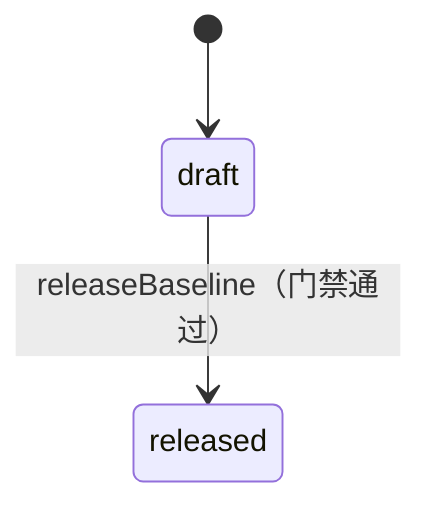
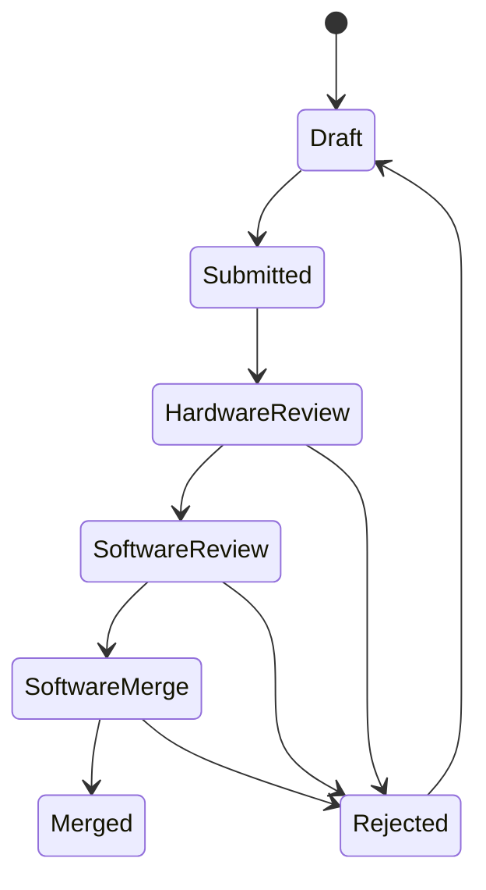
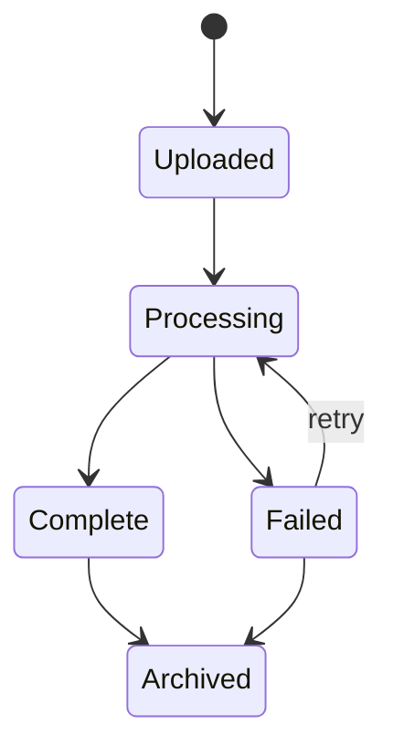
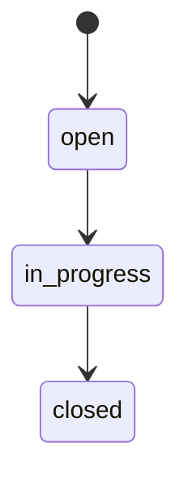
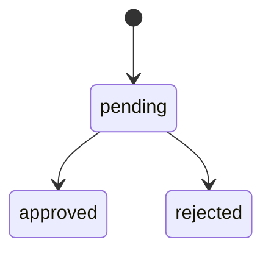

# WiseEff 领域模型设计

> English: [English](../../design-docs/domain-model.md)

日期：2026-05-25

## 1. 建模原则

正式领域模型需要把当前前端原型里的展示数据拆成可持久化、可审计、可扩展的业务实体。

原则：

- 参数定义与项目参数值分离。
- 提交轮次与单条变更请求分离。
- 日志文件、分析任务、阶段和证据分离。
- 产品反馈与日志分析反馈分离，按组织保存 Internal Beta 问题反馈、图片附件和 Admin 处理状态。
- 设备、调试参数、调试会话和节点操作分离。
- Agent 会话、消息、工具调用和审批分离。
- 所有跨域操作通过审计事件串联。

## 2. 核心实体

### 2.1 组织与用户

| 实体 | 说明 |
| --- | --- |
| `Organization` | 企业或租户边界 |
| `User` | 用户账号，绑定身份源和默认组织 |
| `Role` | 平台角色，如 Guest、User、Committer、Admin |
| `Permission` | 细粒度动作权限 |
| `UserRoleBinding` | 用户在组织或项目内的角色绑定 |

关键规则：

- 后端必须进行权限判断，前端权限只用于界面裁剪。
- 用户可以在不同项目内拥有不同角色。
- 停用用户不能执行任何写操作，但历史审计仍保留用户信息。

### 2.2 项目

| 实体 | 说明 |
| --- | --- |
| `Project` | 项目基础信息 |
| `ProjectModule` | 项目或参数模块（按项目镜像组织级 `parameter_modules` 元数据） |

组织级 `parameter_modules` 与调试域 `debug_node_modules` 为**独立树**；父级筛选默认包含子树。过渡期内仍保留扁平 `module` 文本列（TD-037 后续删除）。
| `ProjectMember` | 项目成员和角色 |
| `ProjectInitializationDraft` | 项目参数初始化草稿 |
| `ProjectInitializationReview` | 初始化审阅记录 |

关键规则：

- 项目状态影响参数是否可编辑。
- 未初始化项目只能进入初始化流程，不允许普通参数变更。

### 2.3 参数管理

| 实体 | 说明 |
| --- | --- |
| `ParameterDefinition` | 参数定义，包含名称、说明、格式、模块、默认范围和风险；通过 `parameter_module_id` 挂到组织级 `parameter_modules` 树 |
| `ProjectParameterValue` | 某项目下某参数的当前值、推荐值、范围和单位 |
| `ParameterHistoryEntry` | 参数值历史版本 |
| `ParameterDraft` | 用户未提交草稿 |
| `ParameterSubmissionRound` | 一次批量提交 |
| `ChangeRequest` | 单条参数变更请求 |
| `ReviewDecision` | 审阅意见和推进记录 |
| `ImportBatch` | 批量导入批次 |
| `ProjectParameterFile` | 项目托管的 DTS/JSON 参数文件（项目内 `file_name` 唯一） |
| `ProjectParameterFileVersion` | 不可变文件版本；对象存储字节 + `parsed_index` + `origin`（`upload` / `writeback`） |
| `DtsNode` | 文件版本上的结构化节点：`node_path`（含 `@unitAddress`）、labels、可选 `compatible`/`status`、父节点 |
| `DtsProperty` | 节点上的类型化属性：`value_type`、`raw_text`、`normalized_value` |
| `DtsPhandleRef` | 属性到目标 label 的 phandle 边（可选解析后的节点 id） |
| `ParameterFileSyncConflict` | 同一项目值上 `file_sync` 草稿与 `manual` 草稿目标值冲突时的裁决队列 |

`ProjectParameterValue` 扩展字段：

- `source_file_name`：来源文件名，如 `battery.dtsi`
- `source_node_path`：结构化节点路径，如 `amba/i2c@XXXX0000/chip@6E/reg`（优先身份）

来源挂在**项目值**而非定义：同一定义在不同项目可绑定不同文件；无来源表示手动维护。`parsed_index` 对 DTS 是结构化模型的**派生兼容视图**（特性开关 `DTS_STRUCTURAL_INGEST`，默认开启）。

`ParameterDraft` 扩展字段：

- `origin`：`manual`（默认）或 `file_sync`
- `origin_file_version_id`：产生同步草稿的文件版本

#### 文件同步与回写

上传或新版本（`origin=upload`）会解析 `parsed_index`，与 DB 当前值 diff，为有差异的参数 upsert `file_sync` 草稿。匹配优先 `source_file_name` + `source_node_path`（结构化 `nodePath`），回退 `name` + `module`（兼容路径；同步摘要计 `identityFallbackUses`）。首次绑定写入来源字段。草稿不自动提交，仍走现有提交与审阅流。

**DTS 结构化核心（P1）：** `server/modules/dts/` 提供 lexer → CST → 值类型/规范化 → overlay/label resolver → 无损 CST 序列化。上传（开关开启时）落 `dts_nodes` / `dts_properties` / `dts_phandle_refs`，并由合并模型派生 `parsed_index`。`/include/` 仍硬拒绝。回写通过 CST 属性 `rawText` 替换并序列化（多行 / 多组 / `@address` 已支持）。

审阅合入（`software_merge → merged`）后，若参数有来源字段，`WritebackService` 回写当前文件并生成 `origin=writeback` 新版本；写回版本**不触发**新一轮自动草稿。

禁用文件后不再参与自动同步；已绑定来源保留。

#### 文件同步冲突

同一 `project_parameter_value_id` 同时存在 `file_sync` 与 `manual` 草稿且 `target_value` 不同时，创建 `parameter_file_sync_conflicts`，双方草稿冻结不可提交，直至 Committer 裁决：

- `resolved_file`：删除 UI 草稿，保留文件草稿
- `resolved_ui`：删除文件草稿，保留 UI 草稿

裁决写 `parameter-file-conflict-resolve` 审计。上传上限仍为 2 MB。

#### 配置集、发布基线与校验门禁（P2）

`DtsConfigSet` 是文件之上的顶层可构建单元：一个项目把一组 `ProjectParameterFile` 成员（各带 `role`）聚合成一个配置集，可选 `derived_from_id` 表达板级变体的派生关系。`ReleaseBaseline` 把配置集当前所有成员的版本冻结成一份不可变、可对比、可回滚的快照。`DtcValidator` 在基线从 `draft` 变为 `released` 前，对 dtc 编译结果（或降级模式）做门禁。

| 实体 | 说明 |
| --- | --- |
| `DtsConfigSet` | 项目级可构建单元（`dts_config_set`）：`name`（项目内唯一）、可选 `description`、可选 `derived_from_id`（板级变体血缘）。 |
| `ProjectParameterFile`（扩展） | 新增 `config_set_id`、`config_set_role`（`base`\|`overlay`\|`charging`\|`thermal`\|`misc`）、`config_set_sort_order`。一个文件同一时间至多属于一个配置集。 |
| `ReleaseBaseline` | 配置集的具名不可变快照（`dts_release_baseline`）：`status`（`draft`\|`released`）、可选 `notes`、`created_by`。 |
| `ReleaseBaselineMember` | 快照时刻钉住的每个成员 `(file_id, file_version_id, version_number)`（`dts_release_baseline_members`）。钉住只引用既有不可变文件版本，从不复制对象存储字节。 |

规则：

- 每个项目都有一个隐式**默认配置集**，保证现有单文件上传/同步/回写 API 行为不变；迁移 `0043` 为迁移执行时已存在的项目回填一个默认配置集并重挂其文件。迁移之后新建的项目必须显式调用 `ensureDefaultConfigSet` 或 `createConfigSet`——运行时不会自动创建。
- `createBaseline` 在一个事务内快照所有成员的当前版本；某成员无当前版本会阻止建基线（`409`）；同配置集内基线重名报 `409` 冲突。
- `compareBaseline(baselineId)` 通过对比钉住的 `file_version_id` 与配置集当前 `current_version_id`，把每个成员分类为 `unchanged`、`version_changed`、`file_added` 或 `file_removed`。对 `version_changed` 的 dts 成员，额外基于 `resolveDts().normalizedValue` 计算**结构化差异**（`node_added`/`node_removed`/`prop_added`/`prop_removed`/`prop_changed`），等价重排（十六进制大小写、多组展平）不会产生假 diff。
- `rollbackToBaseline(baselineId)` 是原子的：在一个事务内把每个已漂移成员的 `current_version_id` 指回钉住的版本。它不删除历史，也不会让文件的线性版本指针悄悄倒退——而是插入一条新的 `origin='rollback'` 版本，把钉住版本的字节带到最新指针，保持版本历史单调可追溯。任一被钉住的文件已不存在会让整个回滚失败。因为回滚总会为漂移成员创建一个新版本 id，回滚后立刻 `compareBaseline` 仍会把该成员报为 `version_changed`（id 与基线钉住的 id 不同），但其结构化差异为空，证明内容本身完全一致。
- `releaseBaseline(baselineId)` 对配置集**当前**成员内容运行校验门禁（见下），仅当门禁放行时才把 `draft` 基线翻转为 `released`。

**校验门禁：** `DtcValidator.validate(files, { mode })` 在受限子进程（独立临时目录、仅含 `PATH` 的环境、硬超时）中用系统 `dtc` 二进制编译配置集的 dts 成员，返回 `{ ok, mode, diagnostics, compiler }`。`mode` 读取自 `DTS_VALIDATION_MODE`（默认 `block`，可选 `warn` 或 `off`；见 `docs/zh-CN/developer/environment-variables.md`）。

- `mode=block`：只要有 `error` 级诊断，或 `dtc` 二进制不可用，就 `ok=false`；`releaseBaseline` 抛出 `ApiError('CONFLICT', ..., 409, { code: 'dts-validation-failed', diagnostics })`，基线保持 `draft`。
- `mode=warn`：始终 `ok=true`，但 `requiresConfirmation=true`——放行发布并显式标记「未校验」。
- `mode=off`：从不调用 `dtc`；始终 `ok=true`、`requiresConfirmation=false`。
- 每次门禁运行都写 `validation.gate` 审计事件（mode、compiler、诊断计数、`requiresConfirmation`），无论通过与否。

**无损导出：** `exportFile`/`exportConfigSet` 对每个成员的权威 CST 重新序列化（`serializeDts(parseDts(源))`），对可往返内容做到导出字节与源逐字节等价。`exportConfigSet` 返回 `manifest`（配置集、各成员的 role/sortOrder/versionNumber/format，以及导出时刻的校验门禁结果）及各成员导出内容，供软件人员手动把 bundle 提交到 Git。

发布基线状态机：

`released` 只是状态标记，不是锁：配置集成员发布后仍可继续变化，后续 `compareBaseline`/`rollbackToBaseline` 仍可对同一基线 id 操作。

#### 结构化影响、变更集与敏感节点（P3）

`ChangeRequest.impact` 由服务端计算。当项目值绑定了 `source_file_name` + `source_node_path` 且能落到结构化模型时，除直接的 `parameter` 项外还会加入真实 DTS 事实：

| kind | 含义 |
| --- | --- |
| `parameter` | 变更的项目参数值（风险/审计消费者始终依赖） |
| `phandle` | 通过 phandle 引用该节点的其它节点 |
| `compatible` | 同版本中共享同一 `compatible` 的对等节点 |
| `config-set` | 与绑定文件同属一个 `dts_config_set` 的对等文件 |

无结构化信息（未绑定 / 非 DTS）时回退为遗留的两项模板（`parameter` + `module`）。

**结构化变更集**把基线对比中的节点/属性级差异（`node_added` / `node_removed` / `prop_*`）聚成可审阅单元，仍映射到现有 `parameter_change_requests`（不平行建设审批体系）。前端由 `StructuredDiffView` + `aggregateStructuredChangeSet` 渲染。

**结构化编辑提交（P3.1）：** 浏览器结构化编辑经 `POST .../dts-structured-edits/submit` 接入既有 CR 流。CR `target_value` 与 CST 回写拼接使用 `rawText`（非 `normalizedValue`），合入回写保留作者格式；规范化值仅用于差异/对比。由此闭合「编辑 → 变更集 → 提交 → 审阅 → CST 回写」回路。

**敏感节点 RBAC：** `dts_sensitive_node_rules` 按 `path` / `compatible` 模式匹配到风险层级（`high` \| `critical`）与所需能力（默认 `parameter:edit-critical`）。命中规则但缺少能力返回 `403`。Agent（`actorType=agent`）对 `critical` 一律拒绝，审计为 `parameter-sensitive-node-denied` 且 `requireHuman: true`，须由人工完成。

#### 语义拓扑身份（增量模型 → 原子切换）

路径派生身份（`(name, module)` / 完整 DTS 路径）由下列概念替换：

| 概念 | 含义 |
| --- | --- |
| 源码树 | 全部 DTS/DTSI/overlay occurrence 及其文件与 span 溯源 |
| 生效树 | overlay 解析后的逻辑节点/属性，带有序 `sourceChain` |
| `ParameterSpec` / `ParameterSpecVersion` | 稳定规格身份；`example_value` 仅作示例，不参与 DB 约束或发布策略 |
| Schema 默认 / 策略目标 / 生效值 | 分字段存储；遗留 `recommended_value` 仅作迁移证据，不得自动提升为 default/policy |
| `ProjectParameterBinding` | 稳定的 `project × logical-node × spec` 绑定，供历史/草稿/CR/导出使用 |
| 身份映射 / 规格审核任务 | 歧义或不完整迁移/治理的人工队列。规格审核 `resolved` 会写入 occurrence→spec 决策、项目 binding 与可复用 matcher override；`dismissed` 不得假装已匹配，并作为 fail-closed 发布阻断。 |
| Binding candidate 状态机 | 集中候选态；`needs_mapping` / `invalid` 不得被覆盖成 `draft`。 |
| 校验门禁 | 失败关闭工具链校验；再次校验失败撤销 `validated`；缺失 Config Set base/manifest 失败关闭。 |
| 迁移匹配分桶 | 报告拆分 `exactMatched` / `reviewedMatched` / `inferredPendingReview` / `ambiguous` / `unmapped` / `broken`。推断草稿不计为可发布已映射；未审核 inferred 阻断 cutover。 |
| 已审核连续性 | 已审核身份映射与 matcher override 可跨后续 revison 复用；仅稳定 revison 可作为连续性基线。 |
| Config Set manifest | 每个 revision 持久化 `entryFile`、`includeSearchPaths`、overlay 顺序与成员角色。历史行缺失时从钉住的 `dts_config_revision_members` 回填。`manifestState=needs_review` 对编辑、校验、发布、回写失败关闭，直至运维修复 manifest。 |
| Matcher override 作用域 | 可复用 override 键为 `compatible` 指纹 + **节点 locator 指纹** + `propertyKey`。同一 compatible/属性在不同逻辑节点上不得串用，除非经审核显式决议。 |
| 审核阻断作用域 | 规格审核与映射阻断携带 `blocker_scope`（`revision` \| `project` \| `platform`）。校验/发布门禁按作用域生效——revision 级阻断不得 org 级误伤无关项目。 |
| 全局厂商规格 | `organization_id IS NULL` 的 `ParameterSpec` 为平台全局厂商定义。租户可**读取并绑定** active 全局规格；组织 Admin **不得**经标准 Admin API 激活/修改/删除全局 draft 或全局规格——仅本组织行（`organization_id === 调用者组织`）可变。平台全局规格通过 bootstrap/migration/独立平台治理维护。 |
| 手工规格身份 | 手工/组织 draft ID 对原始语义键做**无损**规范哈希（`field:length:rawValue`）。展示用 sanitize 不得作为唯一性哈希输入。`vendor,limit` 与 `vendor-limit` 等合法 DTS 键必须生成不同 ID。遗留 sanitize 碰撞仅 fail-closed 审计，不得静默重写已引用 ID。 |
| Review-task 作用域 | `parameter_spec_review_tasks` 的作用域 FK 仅由租户可证 evidence join 重算（迁移 `0058`），不得信任任务上已有 FK。无法证明或历史污染的作用域须清空，且 `resolved` 须重开，避免 finalize/cutover 误判为已解决。 |
| 厂商 dt-schema | Linux-binding JSON schema 由属性规格确定性生成（非宽松 `additionalProperties: true` 占位）。黄金 DTB 须通过真实 `dt-validate`；负例 fixture 须按预期失败。 |
| 迁移 CLI 阶段 | `parameter-identities:migrate` 提供 `dry-run`（默认）、可运维 `stage-review`（推断草稿与审核任务单事务提交）、原子 `finalize`（活动 FK + binding）。Cutover 仅接受 `finalized` 运行。 |
| 不可变 base 与 candidate binding revision | 锁定合入/回写仅 ingest **candidate** config revision，并只在该 revision 上 upsert `project_parameter_binding_revisions`。锁定的 **base** config revision 及其 binding revision 行不可变；合入值写在 candidate revision。身份过期 → `409`。 |
| Binding draft 提交身份 | 拓扑 draft 精确拥有 `draftId`、binding、spec、candidate config revision（`parameter_drafts.candidate_config_revision_id`，迁移 `0059`）、`set|delete` action、value/reason 与 write lock。提交会锁定 draft 行。`set` 必须证明 candidate binding revision 的 raw value 与提交值完全一致；`delete` 必须证明同一 candidate/evidence chain 中不存在替代 binding revision，并存在匹配 logical node + property spec 的 delete occurrence effect。迁移 `0060` 先失效缺少 candidate identity 的历史 manual draft；前向迁移 `0061` 再记录并失效所有剩余 candidate-less 草稿，包括 `file_sync` 与冲突衍生行。用户必须通过 typed editor 重建失效编辑。Cutover 后拒绝遗留保存/提交；不得再用 binding ID 冒充遗留 `parameterId`。 |
| Typed delete 合入 | 迁移 `0062` 在 draft、submission item、change request 上持久化 `action`。已审核 action 原样传入 locked writeback。Delete 写出 `/delete-property/`，执行 fail-closed re-ingest/validate，记录空 history tombstone，并且有意不为已删除属性创建 candidate binding revision；base config 与 binding revision 保持不可变。 |
| Fail-closed 回写依赖 | Cutover 后语义合入须注入 `objectStore`、项目范围变更请求、精确 write lock 与真实 DTC 工具链校验。跳过回写或缺依赖均失败关闭；生产路径无 `WISEEFF_WRITEBACK_SKIP_TOOLCHAIN`。 |
| 迁移 phase 审计 | `stage-review` 与 `finalize` 各向 `parameter_identity_migration_phases` 追加不可变行（不覆盖既有 phase 载荷）。Cutover 仅接受带成功 `finalize` phase 行的运行。 |
| 迁移运行任务关联 | `stage-review` 创建的 inferred 规格审核与身份映射任务携带 `migration_run_id`；`finalize` 要求该运行关联任务全部 resolved 后才写入 activity FK。 |
| 手工规格生命周期 | 未匹配 `createSpec` 仅创建本组织 **draft** 规格（从 occurrence AST 推断类型）。Admin `activate` 将 draft→active 并补齐约束；仅 active+完整规格可 `resolve`。 |
| 租户拥有校验 resolve | 规格审核 `resolve` 经租户级 join 校验 org/project/revision/occurrence/logical node；不得单独信任 raw evidence ID（0055 加固）。 |
| 精确回写身份 | 合入/回写锁定 binding revision、occurrence、文件版本、checksum 与 CST span。共享 base revision 不可变；身份过期 → `409`。 |

**第四轮黄金 fixture 计数（测试锁定）：** `wiseeff-power-base.dts` overlay 拓扑 = **50 节点 / 173 个属性 occurrence**；M1 DTS seed 目录 = **519 行 `dts_properties`**。

语义 HTTP 表面位于 `/api/v2`。生产切换仅限维护窗口、失败关闭，且只能整快照回滚——见 `docs/runbooks/parameter-identity-cutover.md`。生产禁止双写或兼容投影。Cutover 后活动路径只使用 binding/spec/occurrence ID，不得再创建 shadow PPV/definition 行。**TD-042 仍为 BLOCKER**——第四至第六轮修复均不构成生产 cutover 就绪声明。

**`legacyDependencyGuard`：** 位于 `server/modules/parameter-topology/legacyDependencyGuard.test.ts` 的 Vitest 源码扫描（不是运行时中间件）。禁止在 `server/`、`src/`、`scripts/` 中出现已退役扁平身份/shadow token；允许名单仅限 migrations、cutovers、rollback/adapters、过渡适配器、已完成计划文档、tests/e2e 与 scripts。

参数变更状态机：

与现有原型状态映射：

| 原型状态 | 正式状态 |
| --- | --- |
| `待审阅` | `Submitted` |
| `硬件Committer检视` | `HardwareReview` |
| `软件Committer检视` | `SoftwareReview` |
| `软件User合入` | `SoftwareMerge` |
| `已合入` | `Merged` |
| `已打回` | `Rejected` |

一致性规则：

- 同一项目、同一参数不能有多个未完成变更请求。
- 合入时必须校验请求仍基于当前参数版本。
- 高风险参数必须至少一个 Committer 审阅。
- 合入成功必须新增参数历史并写审计事件。

### 2.4 日志分析

| 实体 | 说明 |
| --- | --- |
| `LogRecord` | 日志文件业务记录 |
| `LogFileObject` | 对象存储文件引用 |
| `LogAnalysisRun` | 一次分析任务 |
| `LogAnalysisStage` | 分析阶段进度 |
| `LogEvidence` | 证据行号、推断和建议动作 |
| `LogArchiveState` | 归档状态 |
| `LogFeedback` | 用户反馈 |

日志状态机：

规则：

- 上传记录与文件对象必须绑定。
- 日志记录与文件对象按 `organization_id` 组织级隔离；可选 `related_parameter_id` 为指向 M1 参数定义的软链接（无 FK）。
- 不支持格式创建 `Failed` 记录，保留失败原因。
- 分析结果必须能追溯到具体 run 和 stage。
- 证据行号必须基于原始文本日志或解析后的稳定索引。

M2 implementation notes:

- `LogRecord.status` is `uploaded`, `processing`, `complete`, or `failed`; archive state is modeled separately as `active` or `archived`.
- A supported upload creates `LogFileObject`, `LogRecord`, one `LogAnalysisRun`, and one `jobs` row in a transaction. The worker later writes stages, report, evidence, and terminal job/run state.
- An unsupported upload creates `LogFileObject` and a terminal failed `LogRecord` without a run or job. The failure reason is preserved on the record.
- Archive/unarchive updates only `LogRecord.archive_state`; default list queries include only `active` records, and admin queries can request archived records with `includeArchived=true`.
- Feedback is append-only in `log_feedback` and linked to the log record plus audit event.
- M5 adds retry/backoff/dead-letter handling and a dedicated worker runner around log-analysis jobs. Object storage can run locally or through the S3/OSS-compatible seam; cloud lifecycle/KMS/provider SDK wiring remains deployment work.
- M6.4 adds Redis/BullMQ durable dispatch for log-analysis jobs. Queue payloads carry the PostgreSQL `jobId`; duplicate or delayed delivery cannot update a completed job because workers must claim the PostgreSQL job before writing progress or terminal state.

### 2.5 调试平台

| 实体 | 说明 |
| --- | --- |
| `Device` | 设备或样机 |
| `DeviceTarget` | 网关检测到的目标 |
| `DebugParameter` | 可调参数或节点定义 |
| `DebugSession` | 一次调试会话 |
| `DebugSnapshot` | 写入前快照 |
| `NodeOperation` | 读写节点操作 |
| `DebugEvent` | 会话事件 |

规则：

- 只读节点不能写入。
- 写入前必须检查设备在线、权限、访问模式和参数范围。
- 高风险写入必须确认。
- 写入操作必须记录目标值、回读值、验证结果和错误。
- 回滚必须引用快照。

调试参数、逻辑调试节点及其协议 binding 均为组织级 catalog，以 `organization_id` 为边界。参数管理仍通过 M1 参数管理表保持项目级作用域。

调试运行时记录为组织级作用域。Devices、targets、sessions、leases、node operations、snapshots 和 events 均以 `organization_id` 为键；权限使用组织级调试 RBAC，不再依赖参数项目上下文。新的日志/调试审计事件使用 `project_id = null`。

调试 catalog governance 与 runtime execution 分离。`debugging_parameters.enabled=false` 或 `archived_at` 非空会让参数退出 runtime 列表，但保留 audit、snapshot 和 operation history 的可解释性。Admin catalog API 可以查看并恢复 archived 行；runtime 参数读取只使用 enabled 且未 archived 的行。

HDC 和 ADB node bindings 在 `debugging_parameter_node_bindings` 中按 protocol 独立存储。禁用或归档某个 binding 只影响对应 protocol，不能让另一个 protocol 的 binding 从 admin catalog governance 中消失。

### 节点注册表 vs 参数重载（TD-032）

TD-032 将调试 catalog 拆成三个协作面：

- **Legacy 调试参数**（`debugging_parameters` + `debugging_parameter_node_bindings`）仍是 M3 节点调试 catalog，供 `/node-debugging` 使用，行形态仍带参数语义与按协议 bindings。
- **调试节点**（`debug_nodes`）是逻辑、协议无关的可调节点，供 `/node-debugging` 运行时与调试 Admin **节点目录** Tab 使用。
- **Debug node bindings**（`debug_node_bindings`）为每个逻辑节点存储按协议的 HDC/ADB 路径、访问模式与启用状态。

运行时分离：

- `/node-debugging` 创建 `session_kind = node` 会话，通过 `GET /api/v1/debugging/nodes?protocol=...` 列出联邦运行时节点，经 node API 读写。
- `/debugging` 参数重载工作区仍为**产品下线**（TD-032）。迁移 `0037` 已删除 `parameter_reload_bindings` 及 reload-target/reload-write HTTP 路由。
- reload 操作的 `node_operations.parameter_definition_id` 仅保留历史审计；legacy 节点写仍引用 `debugging_parameters.id`。

Admin IA 提供单一**节点目录** Tab：逻辑节点 CRUD 与按协议 binding upsert/archive。

### 调试值元数据

调试参数携带与协议 binding 分离的显式值元数据：

- `valueKind`：`scalar | complex`
- `valueFormat`：`raw | json | dts | line-list | kv-list`
- `normalizationMode`：`exact | trim | line-ending-normalized | json-canonical`
- `maxValueBytes`：可选的写入与审计 payload 上限

Phase 1 中，每个复杂参数仍只绑定一个启用的 HDC 或 ADB 节点。复杂值继续沿用现有 session、lease、snapshot、写入、回读、回滚和审计边界；比较与校验按格式感知执行，而不是对所有 payload 做原始字符串相等判断。

`node_operations` 为复杂写入保存值元数据以及 digest 和 preview 字段。精确回滚 payload 仍保存在 `requested_value`、`previous_value` 和 `readback_value` 中；审计与操作历史界面对大 payload 使用 preview 和 digest。

M3 implementation notes:

- `debugging_devices` stores simulator or future HDC devices; the M3 seed creates `Aurora Simulator Device`.
- `debugging_targets` stores detected gateway targets; the simulator target is `Aurora Simulator 1`.
- `debugging_parameters` stores catalog rows with node path, access mode, range, risk, current value, target value, and sort order. `Cycle count` is RO; `Fast charge current` and `Readback mismatch probe` are RW.
- `debugging_sessions` represents an active user/device/target session. Node reads and writes require an active session.
- `debugging_snapshots` stores pre-write entries with `previousValue` and `targetValue`. Rollback claims a valid snapshot, writes previous values back, then consumes the snapshot only when all rollback operations succeed.
- `debugging_node_operations` records detect/read/write/rollback operation status, requested value, previous value, readback value, verification, failure reason, approval id, and snapshot linkage.
- `debugging_events` records session-level events such as session creation and rollback success/failure.
- `audit_events` is the cross-domain audit stream for debugging target detection, session creation, node reads, node writes, and snapshot rollback.
- M5 adds an HDC gateway seam behind the same debugging contract. Simulator/fake-runner tests cover command normalization and failure behavior, while real device-lab evidence remains an acceptance artifact.

### 2.6 产品反馈

| 实体 | 说明 |
| --- | --- |
| `ProductFeedback` | 一条 Internal Beta「问题反馈」，包含页面上下文、反馈类型、描述、提交人、处理状态和 Admin 备注。 |
| `ProductFeedbackAttachment` | 反馈附件 metadata，按顺序关联图片对象存储内容。 |

状态机：

规则：

- `ProductFeedback` 和 `ProductFeedbackAttachment` 都以 `organization_id` 做组织隔离；列表、详情和附件读取必须按认证组织过滤。
- 任何 active 登录用户都可以提交反馈；列表、详情、状态更新、备注和附件内容读取要求 `admin:access`。
- 附件只保存 metadata 和对象存储引用，字段包括 `storage_key`、`file_name`、`content_type`、`size_bytes`、`checksum`、`sort_order`。
- `closed` 是 MVP 终态；当前不支持 reopen，也不支持从 `open` 直接跳到 `closed`。
- 创建反馈写 `product-feedback-create` 审计；Admin 处理写 `product-feedback-update` 审计，并记录前后状态。

### 2.7 Agent

| 实体 | 说明 |
| --- | --- |
| `AgentSession` | Agent 会话 |
| `AgentMessage` | 用户、助手和系统消息 |
| `AgentToolCall` | 工具调用申请或执行记录 |
| `AgentApproval` | 人工审批记录 |
| `AgentRunTrace` | 模型调用和工具执行 trace |

M4 implementation notes:

- `AgentSession` stores organization, optional project, actor user, page key, role, serialized context, title, status, and timestamps.
- `AgentMessage` stores user/assistant/system content with citations and optional confidence for UnifiedAgent rendering.
- `AgentToolCall` stores the governed tool name, label, payload, approval requirement, status, result/error, and audit event link.
- `AgentApproval` stores one approval per approval-required tool call, including requested/decided users, status, reason, and decision timestamps.
- `AgentRunTrace` stores deterministic provider metadata (`provider`, `model`, `promptVersion`), input/output summaries, tool call ids, and request trace id.
- M5 extends provider traces with live provider metadata, latency, token usage, estimated cost, safety status/reasons, and fallback reason. The live provider seam is implemented, but pilot evidence still depends on target-environment provider health and safety checks.

Agent approval state machine:

规则：

- Agent 上下文在参数管理页面必须包含 pageKey、projectId、roleId 和用户身份；日志与调试页面不注入 projectId。
- 工具调用必须声明权限和是否需要审批。
- 变更型工具调用未审批前不能执行。
- 工具执行结果必须关联审计事件。

### 2.8 审计

| 实体 | 说明 |
| --- | --- |
| `AuditEvent` | 统一审计事件 |
| `AuditOutbox` | 审计/通知可靠投递 |

审计事件字段：

- `id`
- `organizationId`
- `projectId`
- `actorUserId`
- `actorType`
- `app`
- `kind`
- `action`
- `severity`
- `targetType`
- `targetId`
- `metadata`
- `traceId`
- `createdAt`

规则：

- 业务写操作必须产生审计。
- 审计不可由普通业务接口修改。
- 审计查询需要权限过滤。
