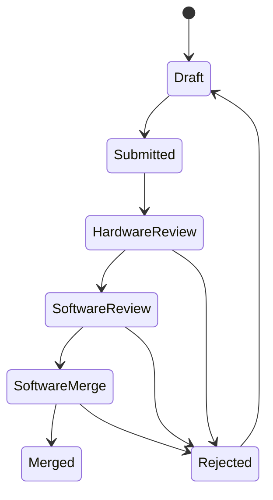
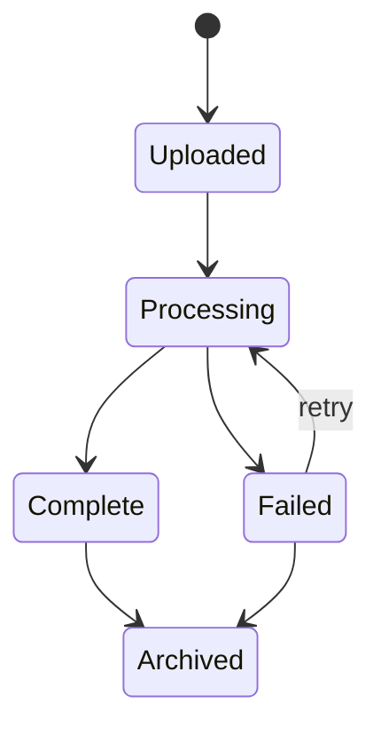
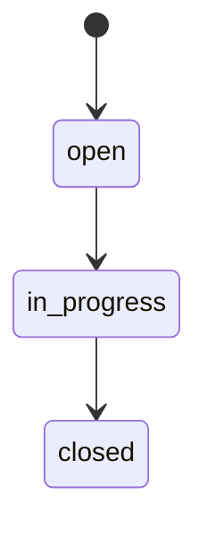
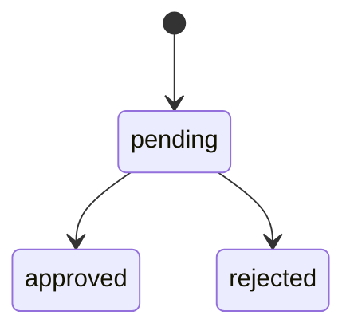

# WiseEff 领域模型设计

> English: [English](../../design-docs/domain-model.md)

日期：2026-05-25

## 1. 建模原则

正式领域模型需要把当前前端原型里的展示数据拆成可持久化、可审计、可扩展的业务实体。

原则：

- 参数定义与项目参数值分离。
- 提交轮次与单条变更请求分离。
- 日志文件、分析任务、阶段和证据分离。
- 产品反馈与日志分析反馈分离，按组织保存 Internal Beta 问题反馈、图片附件和 Admin 处理状态。
- 设备、调试参数、调试会话和节点操作分离。
- Agent 会话、消息、工具调用和审批分离。
- 所有跨域操作通过审计事件串联。

## 2. 核心实体

### 2.1 组织与用户

| 实体 | 说明 |
| --- | --- |
| `Organization` | 企业或租户边界 |
| `User` | 用户账号，绑定身份源和默认组织 |
| `Role` | 平台角色，如 Guest、User、Committer、Admin |
| `Permission` | 细粒度动作权限 |
| `UserRoleBinding` | 用户在组织或项目内的角色绑定 |

关键规则：

- 后端必须进行权限判断，前端权限只用于界面裁剪。
- 用户可以在不同项目内拥有不同角色。
- 停用用户不能执行任何写操作，但历史审计仍保留用户信息。

### 2.2 项目

| 实体 | 说明 |
| --- | --- |
| `Project` | 项目基础信息 |
| `ProjectModule` | 项目或参数模块（按项目镜像组织级 `parameter_modules` 元数据） |

组织级 `parameter_modules` 与调试域 `debug_node_modules` 为**独立树**；父级筛选默认包含子树。过渡期内仍保留扁平 `module` 文本列（TD-037 后续删除）。
| `ProjectMember` | 项目成员和角色 |
| `ProjectInitializationDraft` | 项目参数初始化草稿 |
| `ProjectInitializationReview` | 初始化审阅记录 |

关键规则：

- 项目状态影响参数是否可编辑。
- 未初始化项目只能进入初始化流程，不允许普通参数变更。

### 2.3 参数管理

| 实体 | 说明 |
| --- | --- |
| `ParameterDefinition` | 参数定义，包含名称、说明、格式、模块、默认范围和风险；通过 `parameter_module_id` 挂到组织级 `parameter_modules` 树 |
| `ProjectParameterValue` | 某项目下某参数的当前值、推荐值、范围和单位 |
| `ParameterHistoryEntry` | 参数值历史版本 |
| `ParameterDraft` | 用户未提交草稿 |
| `ParameterSubmissionRound` | 一次批量提交 |
| `ChangeRequest` | 单条参数变更请求 |
| `ReviewDecision` | 审阅意见和推进记录 |
| `ImportBatch` | 批量导入批次 |
| `ProjectParameterFile` | 项目托管的 DTS/JSON 参数文件（项目内 `file_name` 唯一） |
| `ProjectParameterFileVersion` | 不可变文件版本；对象存储字节 + `parsed_index` + `origin`（`upload` / `writeback`） |
| `ParameterFileSyncConflict` | 同一项目值上 `file_sync` 草稿与 `manual` 草稿目标值冲突时的裁决队列 |

`ProjectParameterValue` 扩展字段：

- `source_file_name`：来源文件名，如 `battery.dtsi`
- `source_node_path`：解析节点路径，如 `battery/temp_max`

来源挂在**项目值**而非定义：同一定义在不同项目可绑定不同文件；无来源表示手动维护。

`ParameterDraft` 扩展字段：

- `origin`：`manual`（默认）或 `file_sync`
- `origin_file_version_id`：产生同步草稿的文件版本

#### 文件同步与回写

上传或新版本（`origin=upload`）会解析 `parsed_index`，与 DB 当前值 diff，为有差异的参数 upsert `file_sync` 草稿。匹配优先 `source_file_name` + `source_node_path`，回退 `name` + `module`。首次绑定写入来源字段。草稿不自动提交，仍走现有提交与审阅流。

**P0 解析止血（无 schema 变更）：** 解析前剥离注释；`/include/` 上传硬拒绝；当前扁平解析器无法忠实表达的构造（带地址节点、`&label` 覆盖、内联 label、布尔属性、多 `<>` 组）跳过 sync 并回传 `unsupportedConstructs`；不安全的 DTS 回写（多行 / 多组 / 带地址节点路径）抛 `CONFLICT`（`dts-writeback-unsafe`）而非部分文本替换。完整结构化解析与无损回写仍属 P1（TD-039）。

审阅合入（`software_merge → merged`）后，若参数有来源字段，`WritebackService` 回写当前文件并生成 `origin=writeback` 新版本；写回版本**不触发**新一轮自动草稿。

禁用文件后不再参与自动同步；已绑定来源保留。

#### 文件同步冲突

同一 `project_parameter_value_id` 同时存在 `file_sync` 与 `manual` 草稿且 `target_value` 不同时，创建 `parameter_file_sync_conflicts`，双方草稿冻结不可提交，直至 Committer 裁决：

- `resolved_file`：删除 UI 草稿，保留文件草稿
- `resolved_ui`：删除文件草稿，保留 UI 草稿

裁决写 `parameter-file-conflict-resolve` 审计。上传上限仍为 2 MB。

参数变更状态机：

与现有原型状态映射：

| 原型状态 | 正式状态 |
| --- | --- |
| `待审阅` | `Submitted` |
| `硬件Committer检视` | `HardwareReview` |
| `软件Committer检视` | `SoftwareReview` |
| `软件User合入` | `SoftwareMerge` |
| `已合入` | `Merged` |
| `已打回` | `Rejected` |

一致性规则：

- 同一项目、同一参数不能有多个未完成变更请求。
- 合入时必须校验请求仍基于当前参数版本。
- 高风险参数必须至少一个 Committer 审阅。
- 合入成功必须新增参数历史并写审计事件。

### 2.4 日志分析

| 实体 | 说明 |
| --- | --- |
| `LogRecord` | 日志文件业务记录 |
| `LogFileObject` | 对象存储文件引用 |
| `LogAnalysisRun` | 一次分析任务 |
| `LogAnalysisStage` | 分析阶段进度 |
| `LogEvidence` | 证据行号、推断和建议动作 |
| `LogArchiveState` | 归档状态 |
| `LogFeedback` | 用户反馈 |

日志状态机：

规则：

- 上传记录与文件对象必须绑定。
- 日志记录与文件对象按 `organization_id` 组织级隔离；可选 `related_parameter_id` 为指向 M1 参数定义的软链接（无 FK）。
- 不支持格式创建 `Failed` 记录，保留失败原因。
- 分析结果必须能追溯到具体 run 和 stage。
- 证据行号必须基于原始文本日志或解析后的稳定索引。

M2 implementation notes:

- `LogRecord.status` is `uploaded`, `processing`, `complete`, or `failed`; archive state is modeled separately as `active` or `archived`.
- A supported upload creates `LogFileObject`, `LogRecord`, one `LogAnalysisRun`, and one `jobs` row in a transaction. The worker later writes stages, report, evidence, and terminal job/run state.
- An unsupported upload creates `LogFileObject` and a terminal failed `LogRecord` without a run or job. The failure reason is preserved on the record.
- Archive/unarchive updates only `LogRecord.archive_state`; default list queries include only `active` records, and admin queries can request archived records with `includeArchived=true`.
- Feedback is append-only in `log_feedback` and linked to the log record plus audit event.
- M5 adds retry/backoff/dead-letter handling and a dedicated worker runner around log-analysis jobs. Object storage can run locally or through the S3/OSS-compatible seam; cloud lifecycle/KMS/provider SDK wiring remains deployment work.
- M6.4 adds Redis/BullMQ durable dispatch for log-analysis jobs. Queue payloads carry the PostgreSQL `jobId`; duplicate or delayed delivery cannot update a completed job because workers must claim the PostgreSQL job before writing progress or terminal state.

### 2.5 调试平台

| 实体 | 说明 |
| --- | --- |
| `Device` | 设备或样机 |
| `DeviceTarget` | 网关检测到的目标 |
| `DebugParameter` | 可调参数或节点定义 |
| `DebugSession` | 一次调试会话 |
| `DebugSnapshot` | 写入前快照 |
| `NodeOperation` | 读写节点操作 |
| `DebugEvent` | 会话事件 |

规则：

- 只读节点不能写入。
- 写入前必须检查设备在线、权限、访问模式和参数范围。
- 高风险写入必须确认。
- 写入操作必须记录目标值、回读值、验证结果和错误。
- 回滚必须引用快照。

调试参数、逻辑调试节点及其协议 binding 均为组织级 catalog，以 `organization_id` 为边界。参数管理仍通过 M1 参数管理表保持项目级作用域。

调试运行时记录为组织级作用域。Devices、targets、sessions、leases、node operations、snapshots 和 events 均以 `organization_id` 为键；权限使用组织级调试 RBAC，不再依赖参数项目上下文。新的日志/调试审计事件使用 `project_id = null`。

调试 catalog governance 与 runtime execution 分离。`debugging_parameters.enabled=false` 或 `archived_at` 非空会让参数退出 runtime 列表，但保留 audit、snapshot 和 operation history 的可解释性。Admin catalog API 可以查看并恢复 archived 行；runtime 参数读取只使用 enabled 且未 archived 的行。

HDC 和 ADB node bindings 在 `debugging_parameter_node_bindings` 中按 protocol 独立存储。禁用或归档某个 binding 只影响对应 protocol，不能让另一个 protocol 的 binding 从 admin catalog governance 中消失。

### 节点注册表 vs 参数重载（TD-032）

TD-032 将调试 catalog 拆成三个协作面：

- **Legacy 调试参数**（`debugging_parameters` + `debugging_parameter_node_bindings`）仍是 M3 节点调试 catalog，供 `/node-debugging` 使用，行形态仍带参数语义与按协议 bindings。
- **调试节点**（`debug_nodes`）是逻辑、协议无关的可调节点，供 `/node-debugging` 运行时与调试 Admin **节点目录** Tab 使用。
- **Debug node bindings**（`debug_node_bindings`）为每个逻辑节点存储按协议的 HDC/ADB 路径、访问模式与启用状态。

运行时分离：

- `/node-debugging` 创建 `session_kind = node` 会话，通过 `GET /api/v1/debugging/nodes?protocol=...` 列出联邦运行时节点，经 node API 读写。
- `/debugging` 参数重载工作区仍为**产品下线**（TD-032）。迁移 `0037` 已删除 `parameter_reload_bindings` 及 reload-target/reload-write HTTP 路由。
- reload 操作的 `node_operations.parameter_definition_id` 仅保留历史审计；legacy 节点写仍引用 `debugging_parameters.id`。

Admin IA 提供单一**节点目录** Tab：逻辑节点 CRUD 与按协议 binding upsert/archive。

### 调试值元数据

调试参数携带与协议 binding 分离的显式值元数据：

- `valueKind`：`scalar | complex`
- `valueFormat`：`raw | json | dts | line-list | kv-list`
- `normalizationMode`：`exact | trim | line-ending-normalized | json-canonical`
- `maxValueBytes`：可选的写入与审计 payload 上限

Phase 1 中，每个复杂参数仍只绑定一个启用的 HDC 或 ADB 节点。复杂值继续沿用现有 session、lease、snapshot、写入、回读、回滚和审计边界；比较与校验按格式感知执行，而不是对所有 payload 做原始字符串相等判断。

`node_operations` 为复杂写入保存值元数据以及 digest 和 preview 字段。精确回滚 payload 仍保存在 `requested_value`、`previous_value` 和 `readback_value` 中；审计与操作历史界面对大 payload 使用 preview 和 digest。

M3 implementation notes:

- `debugging_devices` stores simulator or future HDC devices; the M3 seed creates `Aurora Simulator Device`.
- `debugging_targets` stores detected gateway targets; the simulator target is `Aurora Simulator 1`.
- `debugging_parameters` stores catalog rows with node path, access mode, range, risk, current value, target value, and sort order. `Cycle count` is RO; `Fast charge current` and `Readback mismatch probe` are RW.
- `debugging_sessions` represents an active user/device/target session. Node reads and writes require an active session.
- `debugging_snapshots` stores pre-write entries with `previousValue` and `targetValue`. Rollback claims a valid snapshot, writes previous values back, then consumes the snapshot only when all rollback operations succeed.
- `debugging_node_operations` records detect/read/write/rollback operation status, requested value, previous value, readback value, verification, failure reason, approval id, and snapshot linkage.
- `debugging_events` records session-level events such as session creation and rollback success/failure.
- `audit_events` is the cross-domain audit stream for debugging target detection, session creation, node reads, node writes, and snapshot rollback.
- M5 adds an HDC gateway seam behind the same debugging contract. Simulator/fake-runner tests cover command normalization and failure behavior, while real device-lab evidence remains an acceptance artifact.

### 2.6 产品反馈

| 实体 | 说明 |
| --- | --- |
| `ProductFeedback` | 一条 Internal Beta「问题反馈」，包含页面上下文、反馈类型、描述、提交人、处理状态和 Admin 备注。 |
| `ProductFeedbackAttachment` | 反馈附件 metadata，按顺序关联图片对象存储内容。 |

状态机：

规则：

- `ProductFeedback` 和 `ProductFeedbackAttachment` 都以 `organization_id` 做组织隔离；列表、详情和附件读取必须按认证组织过滤。
- 任何 active 登录用户都可以提交反馈；列表、详情、状态更新、备注和附件内容读取要求 `admin:access`。
- 附件只保存 metadata 和对象存储引用，字段包括 `storage_key`、`file_name`、`content_type`、`size_bytes`、`checksum`、`sort_order`。
- `closed` 是 MVP 终态；当前不支持 reopen，也不支持从 `open` 直接跳到 `closed`。
- 创建反馈写 `product-feedback-create` 审计；Admin 处理写 `product-feedback-update` 审计，并记录前后状态。

### 2.7 Agent

| 实体 | 说明 |
| --- | --- |
| `AgentSession` | Agent 会话 |
| `AgentMessage` | 用户、助手和系统消息 |
| `AgentToolCall` | 工具调用申请或执行记录 |
| `AgentApproval` | 人工审批记录 |
| `AgentRunTrace` | 模型调用和工具执行 trace |

M4 implementation notes:

- `AgentSession` stores organization, optional project, actor user, page key, role, serialized context, title, status, and timestamps.
- `AgentMessage` stores user/assistant/system content with citations and optional confidence for UnifiedAgent rendering.
- `AgentToolCall` stores the governed tool name, label, payload, approval requirement, status, result/error, and audit event link.
- `AgentApproval` stores one approval per approval-required tool call, including requested/decided users, status, reason, and decision timestamps.
- `AgentRunTrace` stores deterministic provider metadata (`provider`, `model`, `promptVersion`), input/output summaries, tool call ids, and request trace id.
- M5 extends provider traces with live provider metadata, latency, token usage, estimated cost, safety status/reasons, and fallback reason. The live provider seam is implemented, but pilot evidence still depends on target-environment provider health and safety checks.

Agent approval state machine:

规则：

- Agent 上下文在参数管理页面必须包含 pageKey、projectId、roleId 和用户身份；日志与调试页面不注入 projectId。
- 工具调用必须声明权限和是否需要审批。
- 变更型工具调用未审批前不能执行。
- 工具执行结果必须关联审计事件。

### 2.8 审计

| 实体 | 说明 |
| --- | --- |
| `AuditEvent` | 统一审计事件 |
| `AuditOutbox` | 审计/通知可靠投递 |

审计事件字段：

- `id`
- `organizationId`
- `projectId`
- `actorUserId`
- `actorType`
- `app`
- `kind`
- `action`
- `severity`
- `targetType`
- `targetId`
- `metadata`
- `traceId`
- `createdAt`

规则：

- 业务写操作必须产生审计。
- 审计不可由普通业务接口修改。
- 审计查询需要权限过滤。
