# WiseEff 技术文档合集

> English: [English](../../design-docs/full-stack-architecture.md)

版本 2.0 · 核对日期 2026-09-06 · 研发接手与系统维护

本文是持续维护的 Markdown 技术合集。系统说明和主要流程直接写在正文，Mermaid 图表作为可编辑内容保留。专门文档继续负责完整接口 schema、详细权限清单和环境操作命令；第13章提供实现依据，便于核对变化。本合集与英文版对应，后续技术交付以本页为准。

图中的类和接口摘录自实际源码，概念 ER 图和操作阶段图明确标注抽象范围；省略字段与分支不表示它们不存在。图表采用中性主题。

## 1 系统概述

WiseEff 将参数管理、日志分析、设备调试和工程知识组织在同一套受权限与审计约束的工作空间中。系统采用 React 与 Vite 前端、TypeScript 模块化单体 API、PostgreSQL 业务存储，并通过独立 worker、对象存储、设备桥和受控 Agent 工具处理异步及高风险操作。

本合集面向接手研发、接口联调和日常维护人员。正文汇编系统架构、领域模型、业务流程、接口约定、安全机制、运行配置、部署恢复和故障定位，无需跳转到仓库页面才能理解核心机制。代码路径用于定位实现，末尾编制依据用于追溯来源。

本版基于源码提交 67d4a77325b6009b77c2373bd788298a6d022bcf，以及本次已整理但尚未提交的配套文档。文中“已实现”说明该基线存在相应代码；不代表本次重新执行了产品测试，也不代表某个部署环境已完成数据切换、设备验收或发布批准。

### 1.1 产品能力与访问入口

| 能力 | 主要入口 | 使用目的 |
| --- | --- | --- |
| 项目参数 | /parameters | 查看类型化参数、准备草稿、提交变更 |
| 提交与评审 | /parameter-submissions 与 /parameter-review | 追踪提交、按指定角色评审及合入 |
| 参数目录与治理 | /parameter-admin/specs | 查看目录定义、组织注册、放置与治理提案 |
| 项目配置 | /parameter-admin/projects | 配置文件、配置集、源版本、冲突与基线管理 |
| 日志分析 | /logs 与 /log-admin | 上传日志、查看证据、配置业务域和归档 |
| 节点调试 | /node-debugging 与 /debugging-admin | 设备节点读取、受保护写入、节点与协议配置 |
| DTS 重载 | /dts-reload | 生成调试 overlay、预检、部署、观测与恢复 |
| 知识库 | /knowledge 与 /knowledge-admin | 发布工程知识、检索、引用与索引治理 |
| 组织与公共能力 | /organization、/organization/members、/audit、/feedback-admin | 组织资料、成员权限、审计与反馈处理 |

路由存在和导航展示是不同概念。当前工作流导航只公开参数管理与调试，日志和知识库仍可以通过获授权的深链接访问。权限检查继续生效，隐藏导航不等于撤销功能或放开访问。

### 1.2 运行形态

API 模式是本地开发默认模式。前端通过应用端口和 HTTP 适配器访问后端，以真实数据库状态驱动页面。mock 模式必须显式启用，适合演示和组件测试；生产业务不能使用 mock 数据作为来源，mock 模式不提供小泽助手界面。

自托管模式将 web、API、日志 worker、PostgreSQL、Redis、对象存储与反向代理分开运行。是否存在这些服务、配置是否通过检查以及环境是否具备发布条件，应分别判断。

### 1.3 系统边界与外部依赖

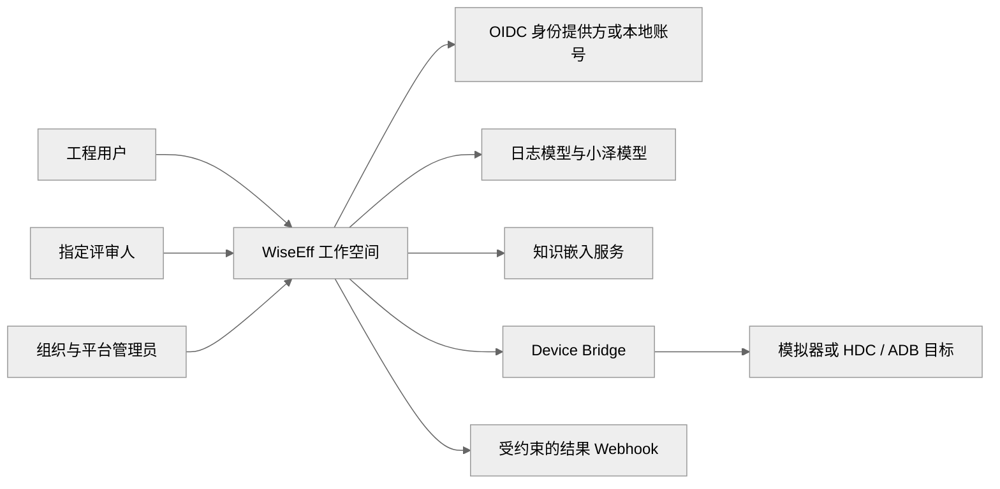
```mermaid
%%{init: {"theme": "neutral"}}%%
flowchart LR
  Engineer["工程用户"] --> WiseEff["WiseEff 工作空间"]
  Reviewer["指定评审人"] --> WiseEff
  Admin["组织与平台管理员"] --> WiseEff
  WiseEff --> Identity["OIDC 身份提供方或本地账号"]
  WiseEff --> Models["日志模型与小泽模型"]
  WiseEff --> Embedding["知识嵌入服务"]
  WiseEff --> Bridge["Device Bridge"]
  Bridge --> Target["模拟器或 HDC / ADB 目标"]
  WiseEff --> Hook["受约束的结果 Webhook"]
```

图1是系统上下文图。模型服务提供分析或规划结果，不能直接获得数据库或设备写权限。设备桥承担协议执行，WiseEff 保留授权、操作归属和结果解释。外部身份提供方确认身份，WiseEff 数据库仍决定用户是否启用以及当前角色范围。

系统内有三种主要数据流：同步业务请求、持久异步任务和设备外部动作。接口请求成功、任务分发成功、设备命令成功分别描述不同阶段，接入方不能把它们统一解释为业务已最终完成。

## 2 系统架构

### 2.1 运行时组成

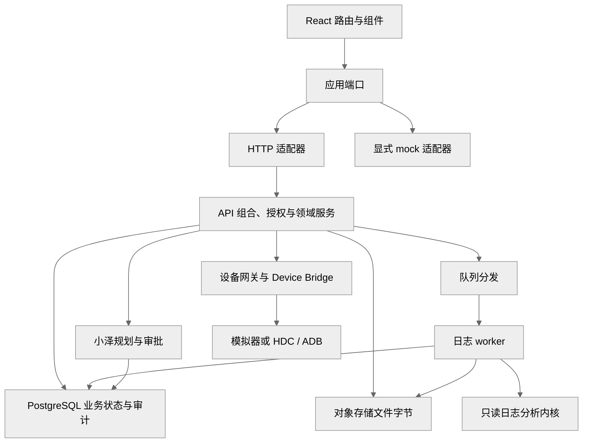
```mermaid
%%{init: {"theme": "neutral"}}%%
flowchart TB
  UI["React 路由与组件"] --> Ports["应用端口"]
  Ports --> HTTP["HTTP 适配器"]
  Ports --> Mock["显式 mock 适配器"]
  HTTP --> API["API 组合、授权与领域服务"]
  API --> PG["PostgreSQL 业务状态与审计"]
  API --> Objects["对象存储文件字节"]
  API --> Queue["队列分发"]
  Queue --> Worker["日志 worker"]
  Worker --> PG
  Worker --> Objects
  Worker --> Analysis["只读日志分析内核"]
  API --> Agent["小泽规划与审批"]
  Agent --> PG
  API --> Bridge["设备网关与 Device Bridge"]
  Bridge --> Target["模拟器或 HDC / ADB"]
```

图2展示主要调用关系。浏览器只通过前端运行时与 API 协作；API 负责组合认证、业务服务与基础设施。日志模型调用位于 worker 的分析内核中，小泽则使用独立的会话、规划和工具审批链，二者不共享写权限。

PostgreSQL 保存业务状态、版本、任务租约和审计。对象存储保存文件字节，数据库保存对象键、摘要和业务归属。Redis 与 BullMQ 承担任务分发，消息通常只携带数据库任务 ID；消息被投递不等于任务已经完成。

### 2.2 前端分层

| 层级 | 位置 | 职责 |
| --- | --- | --- |
| 应用壳与路由 | src/app 与 src/appConfig.ts | 页面解析、导航、权限呈现、运行时注入 |
| 领域模型 | src/domain | 类型、纯规则、状态推导与值语义 |
| 应用端口 | src/application/ports | 面向页面的业务接口 |
| API 适配 | src/infrastructure/http | 请求、DTO 转换、错误映射 |
| 模拟适配 | src/infrastructure/mock | 显式演示和测试实现 |
| 业务页面与组件 | src/features 与 src/components | 交互、加载、错误、空态及可访问性 |

页面负责展示状态和调用端口，不应承担持久业务规则。相同端口的 API 与 mock 实现保持行为形状一致，但 mock 通过不能证明数据库事务、权限或设备行为。项目切换时必须丢弃旧项目的迟到响应，避免将旧草稿、候选或负责人注入新页面。

### 2.2.1 应用端口类图

以下类图摘录真实 TypeScript 接口和 DTO。它表示接口依赖，不表示这些类型都是面向对象类，也不承诺省略的方法不存在。

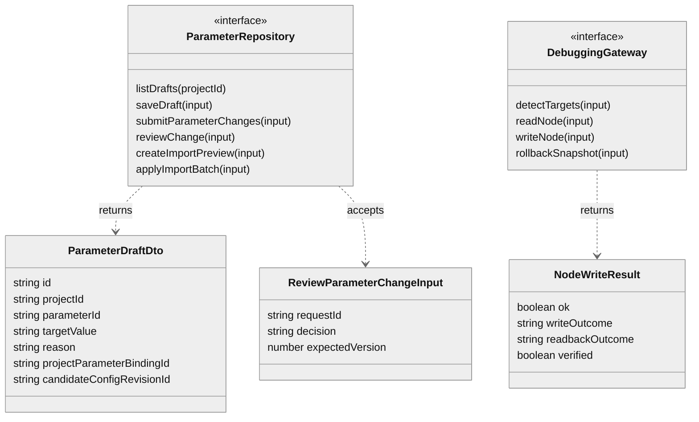
```mermaid
%%{init: {"theme": "neutral"}}%%
classDiagram
  class ParameterRepository {
    <<interface>>
    listDrafts(projectId)
    saveDraft(input)
    submitParameterChanges(input)
    reviewChange(input)
    createImportPreview(input)
    applyImportBatch(input)
  }
  class ParameterDraftDto {
    string id
    string projectId
    string parameterId
    string targetValue
    string reason
    string projectParameterBindingId
    string candidateConfigRevisionId
  }
  class ReviewParameterChangeInput {
    string requestId
    string decision
    number expectedVersion
  }
  class DebuggingGateway {
    <<interface>>
    detectTargets(input)
    readNode(input)
    writeNode(input)
    rollbackSnapshot(input)
  }
  class NodeWriteResult {
    boolean ok
    string writeOutcome
    string readbackOutcome
    boolean verified
  }
  ParameterRepository ..> ParameterDraftDto : returns
  ParameterRepository ..> ReviewParameterChangeInput : accepts
  DebuggingGateway ..> NodeWriteResult : returns
```

图3中字段按阅读需要省略可选标记；准确的可选性以第13章列出的端口源码为准。例如 `expectedVersion` 是可选输入，`verified` 可为 `null`，部分网关方法也可选。前端调用可选方法前需要处理适配器能力差异。

参数领域同时有传统字符串草稿和拓扑感知的类型化草稿。后者通过 `ParameterTopologyRepository` 操作 `DtsValue`，返回原始文本、候选修订和写入目标；不能只根据上图的 `targetValue: string` 推断整个领域都是字符串。

**一次页面请求的责任链：**

1. 路由解析当前项目、参数或版本的定位信息。
2. 页面读取端口并保持加载、错误、空态和提交状态。
3. HTTP 适配器将输入转为端点 DTO，并映射结构化错误。
4. 后端重新解析身份、范围、输入及对象状态。
5. 服务执行事务或外部动作，返回业务 DTO。
6. 页面将结果应用于仍然匹配的项目和请求上下文。

请求取消可以节约资源，但页面仍需检查结果是否属于当前上下文，因为响应可能已经到达。列表、草稿、负责人和候选都需要相同的防迟到原则。

### 2.3 后端模块边界

server/app.ts 是 API 组合根，注册认证、用户、参数、文件、日志、任务、调试、知识、反馈、通知、审计、运维与目录接口。server/shared/http 负责路由、结构化错误和请求关联；server/shared/database 提供数据库连接与 SQL 迁移。

| 模块组 | 核心职责 | 修改时关联检查 |
| --- | --- | --- |
| parameters 与 parameter-drafts | 草稿、提交、评审、合入 | 候选身份、状态锁、审计与负责人 |
| parameter-topology 与 parameter-files | 源树、生效树、配置版本、无损写回 | 文件摘要、版本冲突、工具链 |
| parameter-catalog-api 与 catalog-kernel | 目录读取、固定发布版本、安装内核 | 版本 ID 与摘要、未就绪响应 |
| parameter-governance 与 parameter-bindings | 组织注册、放置、提案、项目使用关系 | 组织与项目范围、幂等和事务 |
| logs 与 jobs | 文件上传、分析、租约、重试与结果 | 对象可读性、租约、终态一致性 |
| debugging 与 dts-reload | 设备动作、快照、重载与恢复 | 权限、确认、设备租约、真实观测 |
| agent 与 knowledge | 受控工具、审批、检查点、已发布检索 | 可信溯源、恢复鉴权、引用范围 |
| auth、users、audit 与公共模块 | 身份、角色、保留策略和记录查询 | 服务端授权、组织隔离与隐私 |

模块化单体并不意味着跨模块可以任意写表。参数共享内核提供基础类型和策略原语，各业务服务仍负责自己的事务与状态转移。数据库事务也不能覆盖物理设备、远程模型和对象存储的全部副作用，这些路径需要明确的失败状态与恢复步骤。

### 2.4 后端依赖方向与组合

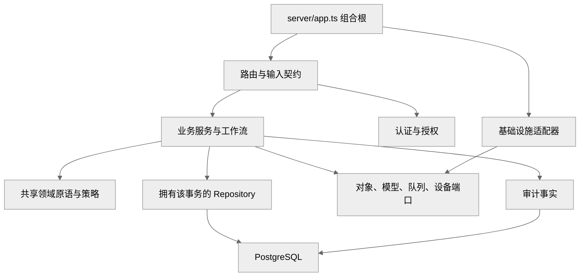
```mermaid
%%{init: {"theme": "neutral"}}%%
flowchart TB
  Root["server/app.ts 组合根"] --> Route["路由与输入契约"]
  Root --> Adapter["基础设施适配器"]
  Route --> Auth["认证与授权"]
  Route --> Service["业务服务与工作流"]
  Service --> Kernel["共享领域原语与策略"]
  Service --> Repo["拥有该事务的 Repository"]
  Repo --> SQL["PostgreSQL"]
  Service --> Port["对象、模型、队列、设备端口"]
  Adapter --> Port
  Service --> Audit["审计事实"]
  Audit --> SQL
```

图4表达责任分层，不要求所有模块具有相同文件布局。组合根选择实现和依赖；路由处理传输契约；服务拥有状态转移；Repository 执行所属持久化。审计与业务变更是否共用事务，应检查具体拥有该动作的服务，不能仅凭两次写入发生在同一个 HTTP 请求内就认为它们原子提交。

**变更定位示例：** 增加一个参数字段，需要依次判断它属于目录定义、项目值、候选还是显示投影。然后修改拥有该事实的类型、持久化和端口映射。把目录默认值直接填进项目当前值，会改变语义，不能当作 DTO 补字段处理。

## 3 领域模型与数据一致性

### 3.1 身份和组织范围

Organization 是租户边界，User 属于一个 home organization。硬件与软件表示角色学科，不是组织。组织管理负责本组织档案、成员、入职和角色治理；当前没有独立的项目成员管理产品。

目录使用查询会消费数据库角色绑定中的明确项目授权或组织范围授权。因此，项目列表能否看到某项目，不能直接推导该用户可以读取该项目的目录使用投影。请求中的 projectId 也不能扩大数据库授予的范围。

### 3.2 参数领域对象

| 对象 | 业务含义 | 必须保留的区别 |
| --- | --- | --- |
| Catalog Subject | 目录中的驱动或节点类型主体 | 不是某一台设备上的节点实例 |
| Parameter Definition | 主体下的参数定义与稳定身份 | 不是项目当前值 |
| Definition Revision | 定义内容的具体修订 | 与定义 ID 分开 |
| Catalog Release | 一组可安装、可固定读取的目录内容 | 发布 ID 与摘要必须成对 |
| Organization Registration | 组织对目录主体的注册事实 | 与目录主体本身分开 |
| Placement | 主体在组织分类中的放置关系 | 不等同于定义内容的修改 |
| Project Binding 与 Value | 项目绑定和项目值事实 | 受项目范围和候选版本约束 |
| Draft 与 Change Request | 临时编辑、提交和评审记录 | 草稿不等于已合入值 |
| Definition Proposal | 目录定义变更的治理提案 | 接受提案不等于目录已经安装 |

目录生产组合连接目录内核、注册与提案治理、项目使用查询。目录定义、组织注册和项目值是不同的数据事实；查询失败时不能用零使用量或空列表冒充成功。

### 3.2.1 目录与项目的概念关系

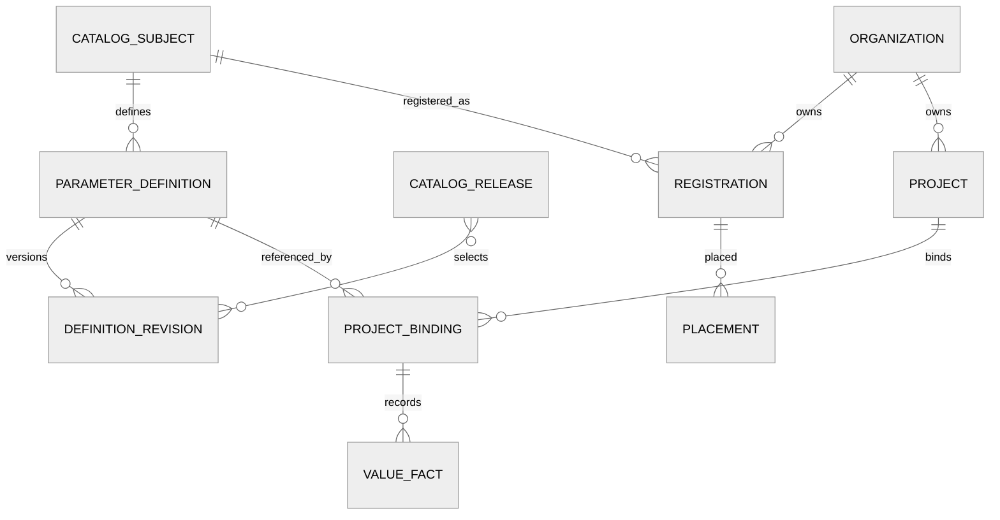
```mermaid
%%{init: {"theme": "neutral"}}%%
erDiagram
  CATALOG_SUBJECT ||--o{ PARAMETER_DEFINITION : defines
  PARAMETER_DEFINITION ||--o{ DEFINITION_REVISION : versions
  CATALOG_RELEASE }o--o{ DEFINITION_REVISION : selects
  ORGANIZATION ||--o{ REGISTRATION : owns
  CATALOG_SUBJECT ||--o{ REGISTRATION : registered_as
  REGISTRATION ||--o{ PLACEMENT : placed
  ORGANIZATION ||--o{ PROJECT : owns
  PROJECT ||--o{ PROJECT_BINDING : binds
  PARAMETER_DEFINITION ||--o{ PROJECT_BINDING : referenced_by
  PROJECT_BINDING ||--o{ VALUE_FACT : records
```

图5是概念 ER 图，便于识别事实归属；不是数据库建表图，也没有列出投影、迁移兼容表和全部物理外键。一个目录发布选择一组修订；同一修订可被多个发布包含。组织注册、分类放置、项目绑定和项目值不会因定义名称相同而变成同一对象。

| 字段或身份 | 表达的事实 | 不能替代 |
| --- | --- | --- |
| `CatalogReleasePin.id + digest` | 要读取的完整目录发布身份 | 单独的当前发布 ID |
| `ParameterDefinitionId` | 稳定定义身份 | 某修订内容或某项目绑定 |
| `DefinitionRevisionId` | 一次不可变定义修订 | 当前项目值版本 |
| `bindingId` | 规范绑定定位 | 显示名称或节点路径 |
| `effectiveRevisionId` | 本次操作依据的生效修订 | 页面加载时间 |
| `currentValueId` | 当前值事实身份 | 格式化的字符串值 |
| `candidateConfigRevisionId` | 工作候选修订 | 已发布基线 |
| `expectedVersion / expectedEtag` | 乐观并发前置条件 | 幂等键 |

规范 pin 字段在兼容 DTO 中可能是可选字段。业务端点是否要求完整 pin，取决于它处理的对象和当前迁移表面；适配器不能自行填充一个“最近版本”来绕过缺失或冲突。

### 3.2.2 值语义和初始化

`exampleValue` 用于说明合法形状，不是强制目标。`schemaDefault` 是定义默认值，`policyTarget` 是策略目标，`effectiveValue` 是当前生效事实。初始化建议采用项目定义的策略优先级，而不是把所有字段折叠成旧 `recommendedValue`。旧平面参数记录仍保留该字段以兼容调用者，新语义表面应使用对应事实。

### 3.3 文件与配置版本

项目文件可以是 DTS 或 JSON，数据库保留文件元数据和版本历史，对象存储保存字节。配置集把一组文件组成可验证单元，基线记录不可变的发布参照。DTS 解析保留结构和原始文本，类型化值用于校验，原始表达用于无损序列化与写回。

源节点、源属性、覆盖后的生效节点和项目绑定分别建模。一个生效值可能来自多个源文件或 overlay，不能仅按显示路径把它当作唯一可写位置。写回必须关联精确 occurrence、候选、源版本及写锁。

从历史版本恢复时追加新的当前版本并保留历史，不倒退或删除历史链。配置激活、写回与基线恢复均应检查当前版本，拒绝在过期上下文中操作。

### 3.3.1 源树到生效值的数据流

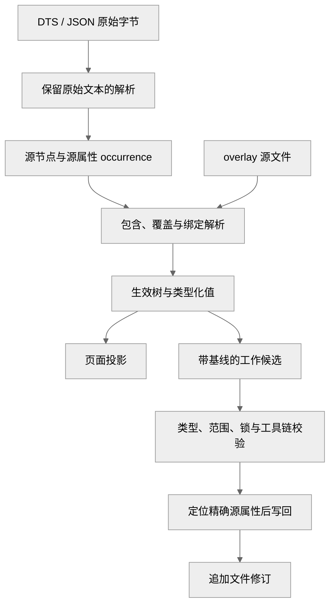
```mermaid
%%{init: {"theme": "neutral"}}%%
flowchart TB
  Bytes["DTS / JSON 原始字节"] --> Parse["保留原始文本的解析"]
  Parse --> Source["源节点与源属性 occurrence"]
  Source --> Resolve["包含、覆盖与绑定解析"]
  Overlay["overlay 源文件"] --> Resolve
  Resolve --> Effective["生效树与类型化值"]
  Effective --> View["页面投影"]
  Effective --> Candidate["带基线的工作候选"]
  Candidate --> Validate["类型、范围、锁与工具链校验"]
  Validate --> Writeback["定位精确源属性后写回"]
  Writeback --> NewRevision["追加文件修订"]
```

图6说明“看到的生效值”与“需要修改的源属性”之间存在解析和归属步骤。节点路径是定位线索，不足以证明唯一写入身份。无损写回应尽量保留未修改文本、注释和语法形状；写后重新解析用于确认目标值和结构没有被破坏。

例如一个 base 文件和一个 overlay 都声明同名属性，页面显示 overlay 覆盖后的值。写入时必须知道目标是已有 overlay 的 occurrence，还是一条明确允许的新覆盖；不能遍历同名属性并修改第一条。删除与设置空字符串同样是不同动作。

### 3.4 异步与外部对象

| 领域 | 主对象 | 状态与关联 |
| --- | --- | --- |
| 日志 | LogRecord、LogFileObject、LogAnalysisRun、Stage、Evidence | 文件、分析运行和证据分开；归档状态独立于分析状态 |
| 任务 | jobs 与租约信息 | 数据库认领控制进度和终态写入，重复投递不能绕过租约 |
| 调试 | 节点、协议绑定、操作、快照、观测 | 命令结果与写后观测独立，快照保存恢复依据 |
| 小泽 | 会话、消息、工具调用、审批、规划检查点 | 聊天历史与执行恢复不是同一份状态 |
| 知识 | 条目、不可变修订、分块、索引状态 | 发布决定可检索性，索引完成与业务发布分开 |
| 反馈与通知 | 反馈、附件、处理状态、用户通知 | 组织和用户范围各自校验 |

### 3.5 一致性规则

所有写操作先认证和授权，再检查类型、范围和当前状态。涉及数据库业务数据与审计时，按拥有该操作的服务事务共同持久化；跨对象存储和设备的操作记录独立结果，不能用单一成功标记掩盖部分失败。

可重试操作需要明确幂等身份。相同身份和相同内容应返回同一结果或受控状态；相同幂等键对应不同内容应冲突。对版本敏感的操作还要核对基线、候选或 ETag，不能把重复请求等同于无条件再次执行。

删除用户时，账号拥有的会话、凭据和临时草稿可级联清理；保留的业务历史使用可空身份引用。Agent 历史中的会话、工具调用和审批关联仍按可信溯源规则保留，不能通过快照或替代 ID 重建已删除主体。

### 3.6 事务与外部副作用的边界

| 操作 | 数据库内需要保持的关系 | 数据库外事实 | 失败后读取什么 |
| --- | --- | --- | --- |
| 参数提交与评审 | 草稿、候选、请求、角色与审计 | 适用的文件验证或写回 | 精确候选、源版本、请求状态 |
| 提案命令 | 提案、ETag、幂等记录与发布意图 | 后续目录构建和安装 | 原幂等结果、捕获基线 |
| 日志上传 | 文件引用、分析运行、任务 | 对象存储字节 | 对象可读性、run 和 job |
| 设备写入 | 操作、快照与审计关联 | 设备命令及实际观测 | writeOutcome、readbackOutcome |
| Agent 批准 | 审批状态、工具调用与业务授权 | 可能的设备或远程动作 | 审批、当前权限及实际副作用 |
| 知识发布 | 业务发布状态与索引任务 | 嵌入调用 | 条目修订、索引状态和检索模式 |

这些边界决定重试方法。数据库回滚不能撤销已经执行的设备命令，也不能删除已经被用户收到的外部通知。对于不确定的外部结果，先按操作身份读取历史和观测，再判断是否允许重试，不能通过重复点击“修复”未知结果。

## 4 参数变更与目录治理

### 4.1 项目参数变更流程

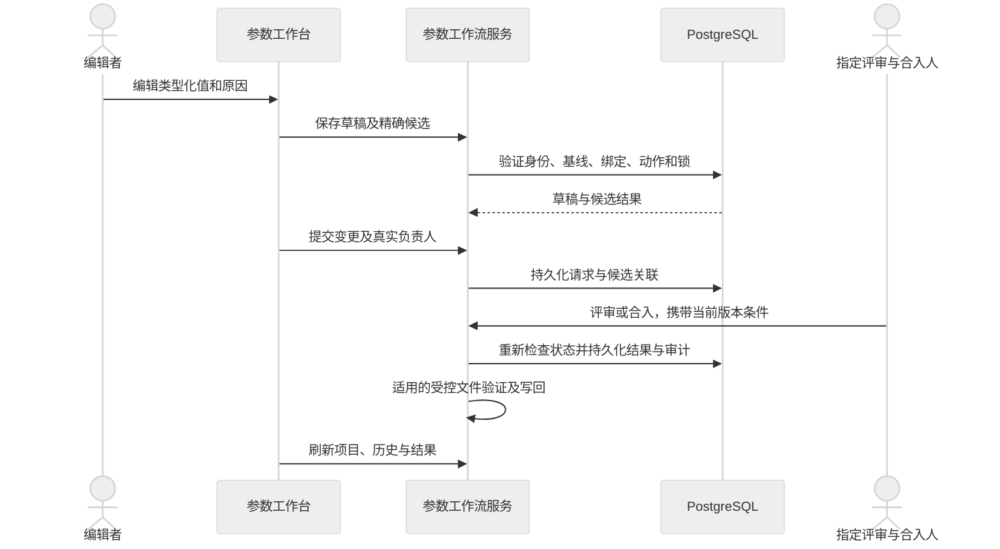
```mermaid
%%{init: {"theme": "neutral"}}%%
sequenceDiagram
  actor Editor as 编辑者
  participant UI as 参数工作台
  participant Service as 参数工作流服务
  participant DB as PostgreSQL
  actor Review as 指定评审与合入人
  Editor->>UI: 编辑类型化值和原因
  UI->>Service: 保存草稿及精确候选
  Service->>DB: 验证身份、基线、绑定、动作和锁
  DB-->>Service: 草稿与候选结果
  UI->>Service: 提交变更及真实负责人
  Service->>DB: 持久化请求与候选关联
  Review->>Service: 评审或合入，携带当前版本条件
  Service->>DB: 重新检查状态并持久化结果与审计
  Service->>Service: 适用的受控文件验证及写回
  UI->>Service: 刷新项目、历史与结果
```

图7展示主要参与者。不同业务写回路径的事务与工具链顺序以具体服务为准，不能将图中的简化箭头解释为跨数据库和对象存储的原子事务。

编辑者在项目工作台选择绑定，填写类型化目标值和原因，保存草稿并提交指定候选。服务端验证草稿、绑定、动作和候选身份，检查当前状态与锁，将请求和候选关联持久化。

评审按硬件负责人、软件负责人和合入者的实际分工推进。拥有管理员角色不代表可以替代全部工作流负责人。每次评审及合入都重新检查权限与对象状态，最终更新候选对应的结果、历史和审计。

涉及配置文件时，合入后的写回需要定位精确源属性并通过工具链门禁。原基线保持不可变；删除动作须具有明确删除语义，不能用空字符串假装删除，也不能偷偷创建替代绑定。

### 4.2 冲突和失败处理

| 触发条件 | 系统应保持的结果 | 用户后续动作 |
| --- | --- | --- |
| 候选版本或内容已变化 | 拒绝过期提交或合入，不选替代版本 | 刷新并复核差异 |
| 缺少指定负责人权限 | 状态不前进，不产生业务合入 | 由合法负责人处理 |
| 文件源版本或写锁不匹配 | 不执行部分写回 | 重新加载来源及候选 |
| 编译器缺失或验证失败 | 需要工具链的发布路径阻塞 | 修复环境或输入后重新验证 |
| 项目切换后旧响应到达 | 旧结果不能覆盖新项目 | 保留当前项目上下文 |

### 4.3 目录注册和提案

目录读取固定在一个明确发布版本。组织管理员可以在授权范围内注册主体、指定分类放置或处理治理队列；平台定义变更使用提案流程，由具备权限且独立于提案者的评审者处理。

提案捕获提交时的基线。提交或评审时，如果基线已经漂移，服务端拒绝旧版本操作；前端保留用户输入，刷新证据后要求重新确认。接受提案记录发布意图，目录定义发布和安装仍是后续独立操作。

发生“提交已成功但响应丢失”时，应使用原幂等身份重试并取回已提交结果，不能生成第二份提案。跨组织请求、角色不足、自审和相同幂等键换内容都需要清晰拒绝。

### 4.3.1 目录固定读取时序

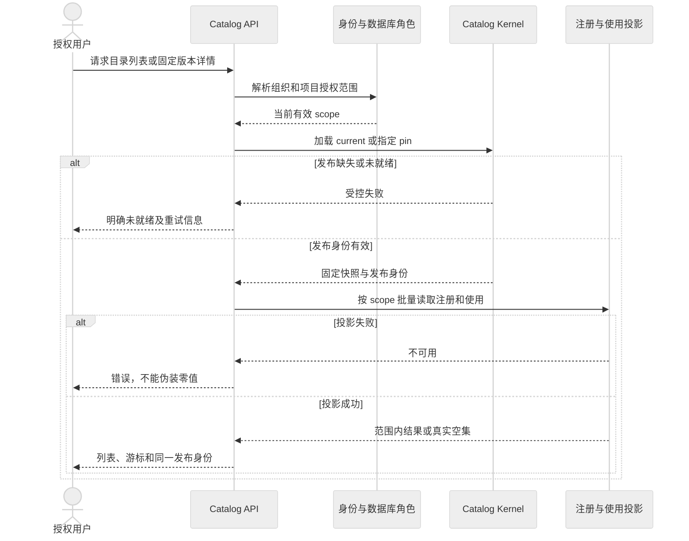
```mermaid
%%{init: {"theme": "neutral"}}%%
sequenceDiagram
  actor User as 授权用户
  participant API as Catalog API
  participant Auth as 身份与数据库角色
  participant Kernel as Catalog Kernel
  participant Proj as 注册与使用投影
  User->>API: 请求目录列表或固定版本详情
  API->>Auth: 解析组织和项目授权范围
  Auth-->>API: 当前有效 scope
  API->>Kernel: 加载 current 或指定 pin
  alt 发布缺失或未就绪
    Kernel-->>API: 受控失败
    API-->>User: 明确未就绪及重试信息
  else 发布身份有效
    Kernel-->>API: 固定快照与发布身份
    API->>Proj: 按 scope 批量读取注册和使用
    alt 投影失败
      Proj-->>API: 不可用
      API-->>User: 错误，不能伪装零值
    else 投影成功
      Proj-->>API: 范围内结果或真实空集
      API-->>User: 列表、游标和同一发布身份
    end
  end
```

图8的 scope 来自当前数据库角色绑定。`projectScope = only` 且列表为空意味着真实的空授权范围；它与“投影查询发生错误”必须在结果中分开。分页游标也携带查询与发布语义，不能把上一筛选条件的游标继续用于新的查询。

### 4.3.2 提案命令与重放

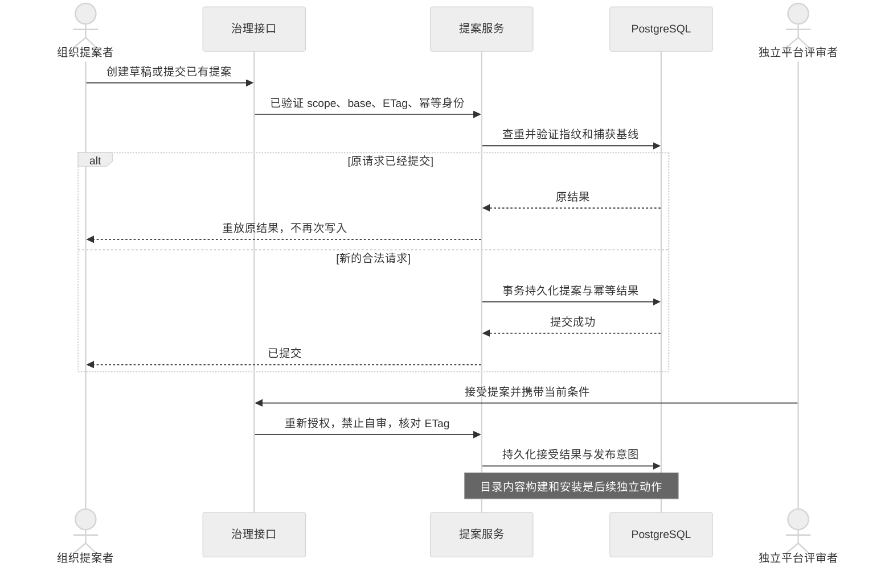
```mermaid
%%{init: {"theme": "neutral"}}%%
sequenceDiagram
  actor Author as 组织提案者
  participant API as 治理接口
  participant Service as 提案服务
  participant DB as PostgreSQL
  actor Reviewer as 独立平台评审者
  Author->>API: 创建草稿或提交已有提案
  API->>Service: 已验证 scope、base、ETag、幂等身份
  Service->>DB: 查重并验证指纹和捕获基线
  alt 原请求已经提交
    DB-->>Service: 原结果
    Service-->>Author: 重放原结果，不再次写入
  else 新的合法请求
    Service->>DB: 事务持久化提案与幂等结果
    DB-->>Service: 提交成功
    Service-->>Author: 已提交
  end
  Reviewer->>API: 接受提案并携带当前条件
  API->>Service: 重新授权，禁止自审，核对 ETag
  Service->>DB: 持久化接受结果与发布意图
  Note over Service,DB: 目录内容构建和安装是后续独立动作
```

图9省略部分传输适配细节。内部 `kind: submit` 表示创建并提交，`submit-existing` 表示提交已经存在的提案；后者携带 `proposalId` 和 `expectedEtag`。不能把两种命令复用为同一个 HTTP 动作，否则重试身份、已有草稿和并发前置条件会失真。

| 条件 | 合法处理 |
| --- | --- |
| 原事务成功，但响应丢失 | 用原键与原内容读取或重放原结果 |
| 相同键，内容指纹不同 | 冲突；不得覆盖原请求 |
| ETag 不匹配 | 拒绝旧视图动作，刷新后重新确认 |
| captured base 与当前发布漂移 | 按提案冲突契约拒绝，保留输入 |
| 提案者与评审者相同 | 独立评审门禁拒绝 |
| 评审接受 | 记录发布意图，不能宣称已安装 |

### 4.4 导入和配置管理

导入先解析并预览数据、字段映射和校验结果，再由用户确认应用。预览可以创建暂存记录，但不应修改当前项目参数或文件。格式错误、类型不匹配、定义无法唯一识别或源版本变化时，需要保留可读错误与人工处理入口。

项目配置的当前标准界面是以配置集和源版本为中心的工作台。旧 files、config-sets、structure、conflicts 深链接属于兼容路由，不再作为四套独立界面开发依据。

### 4.5 参数并发与类型化草稿

拓扑草稿的输入包含 `baseRevisionId`、`targetValue: DtsValue`、`action` 和原因。结果包含 `draftId`、`candidateRevisionId`、可选工作候选与被重基的草稿 ID、`rawText`、写入目标及 overlay 文件身份。服务可以更新共享工作候选，页面必须采用返回的身份，不能继续使用请求前缓存的候选 tip。

`action = delete` 表达删除；节点启停草稿还区分 `force-enabled`、`force-disabled`、`unstated`。删除状态声明表示回到未声明语义，不能简单转换成“禁用”。非标准状态拼写也应按专门输入确认，而不是由页面自动猜测。

评审输入的 `expectedVersion` 与提案 ETag 服务于不同工作流，但都用于拒绝旧状态上的写入。一个操作可以同时需要版本条件和幂等身份：前者回答“你修改的是哪版状态”，后者回答“这是否是同一次操作”。

## 5 日志分析

### 5.1 接入和任务生命周期

日志按组织隔离，可选绑定当前组织内处于 active 的日志业务域。未选择业务域时使用内建未分类语义，不能因此阻断上传。业务域配置声明格式画像，并可关联已发布知识、选择模型名称覆盖或设置结果通知。

文本接入支持 log、txt、csv、json，并可处理受限的 gzip 单文件和 zip 单条目。接入阶段限制解压后的绝对大小和压缩比，对象存储中保存稳定的 UTF-8 文本，后续证据引用原始行号。不支持的输入形成带明确失败原因的记录，不伪造已完成分析。

有效上传创建文件引用、日志记录、分析运行和数据库任务。worker 认领任务后更新阶段、报告、证据与终态。日志处理状态包含 uploaded、processing、complete、failed；active 与 archived 是另一个独立归档维度。

### 5.1.1 上传到报告的时序

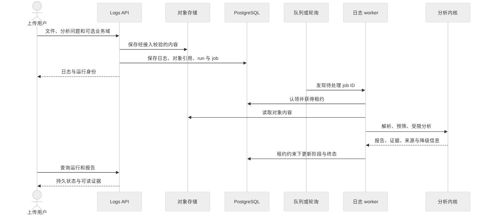
```mermaid
%%{init: {"theme": "neutral"}}%%
sequenceDiagram
  actor User as 上传用户
  participant API as Logs API
  participant Store as 对象存储
  participant DB as PostgreSQL
  participant Queue as 队列或轮询
  participant Worker as 日志 worker
  participant Kernel as 分析内核
  User->>API: 文件、分析问题和可选业务域
  API->>Store: 保存经接入校验的内容
  API->>DB: 保存日志、对象引用、run 与 job
  API-->>User: 日志与运行身份
  Queue->>Worker: 发现待处理 job ID
  Worker->>DB: 认领并获得租约
  Worker->>Store: 读取对象内容
  Worker->>Kernel: 解析、预筛、受限分析
  Kernel-->>Worker: 报告、证据、来源与降级信息
  Worker->>DB: 租约约束下更新阶段与终态
  User->>API: 查询运行和报告
  API-->>User: 持久状态与可读证据
```

图10展示责任顺序，不表示对象存储与数据库处于同一事务。接入失败先区分文件格式、解压限制、对象保存和数据库记录阶段；分析失败再区分认领、对象读取、解析和模型调用。保存文件后网络中断也需要检查对象引用，不能只看页面是否收到成功响应。

### 5.1.2 分析运行状态

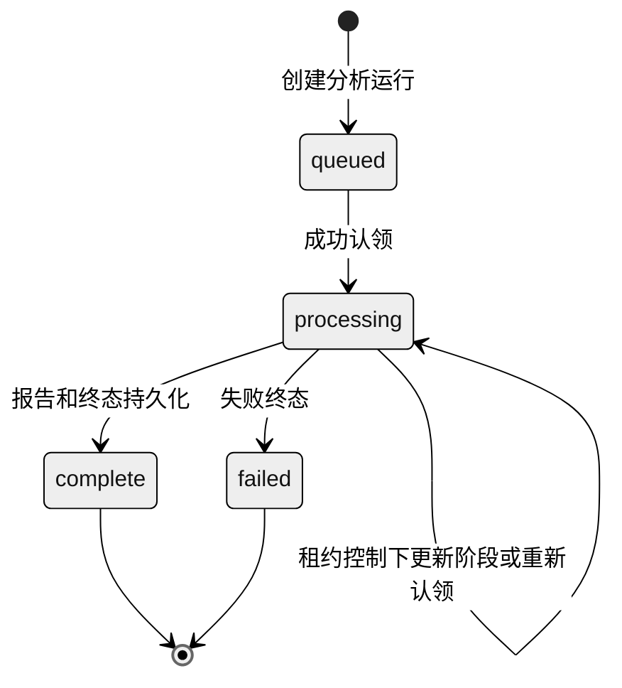
```mermaid
%%{init: {"theme": "neutral"}}%%
stateDiagram-v2
  [*] --> queued: 创建分析运行
  queued --> processing: 成功认领
  processing --> complete: 报告和终态持久化
  processing --> failed: 失败终态
  processing --> processing: 租约控制下更新阶段或重新认领
  complete --> [*]
  failed --> [*]
```

图11使用运行状态 `queued / processing / complete / failed`。日志记录的初态是 `uploaded`，不是 `queued`；`parse / pattern / rootcause / report` 是进度阶段，不是另一组运行终态。图中未画出所有重试存储细节；是否允许再次分析以及如何创建新运行，应由任务服务决定，前端不得自行把旧终态改回处理中。

### 5.2 分析内核与工具

默认 LOG_ANALYSIS_KERNEL=loop，使用有步骤和 token 预算的只读循环；single-shot 是保留的显式配置回退。日志分析使用 LOG_ANALYSIS 配置族，不进入小泽的写工具和人工审批链。

| 工具 | 作用 | 约束 |
| --- | --- | --- |
| search_log_lines | 搜索候选证据行 | 结果有界，引用保持原始行语义 |
| read_line_range | 读取指定行范围 | 不得读取不存在的行 |
| get_prefilter_findings | 获取确定性预筛信号 | 预筛是证据，不直接等于最终诊断 |
| read_domain_knowledge | 读取业务域关联知识 | 仅当前组织的已发布条目 |
| get_related_parameter_context | 读取相关参数上下文 | 只读且受组织范围约束 |

模型输出经过结构校验、工具参数校验和引用接地检查。日志、知识文本和参数说明都属于不可信模型输入，其中的指令不能改变工具权限或授权边界。

### 5.3 降级和结果表达

| 情况 | 结果表达 |
| --- | --- |
| 模型返回有依据的结论 | analysis_source 为 agent，并记录模型与提示词版本 |
| 供应方暂时不可用 | 按任务策略重试；最终可回退规则并标记 provider-unavailable |
| 预算不足或输出无法接地 | 提前收敛或规则回退，记录 token-budget-exhausted |
| 有界循环提前收敛成功 | 可以仍是 agent 来源，但明确低置信度与降级原因 |
| 回退也失败 | 保留真实失败或死信结果 |

降级是结果来源状态，不等于分析运行失败。一个正常完成的运行可以生成降级报告，界面和报告必须同时显示来源和原因。不能只靠“完成”二字向用户暗示模型完成了完整分析。

### 5.3.1 有界分析循环

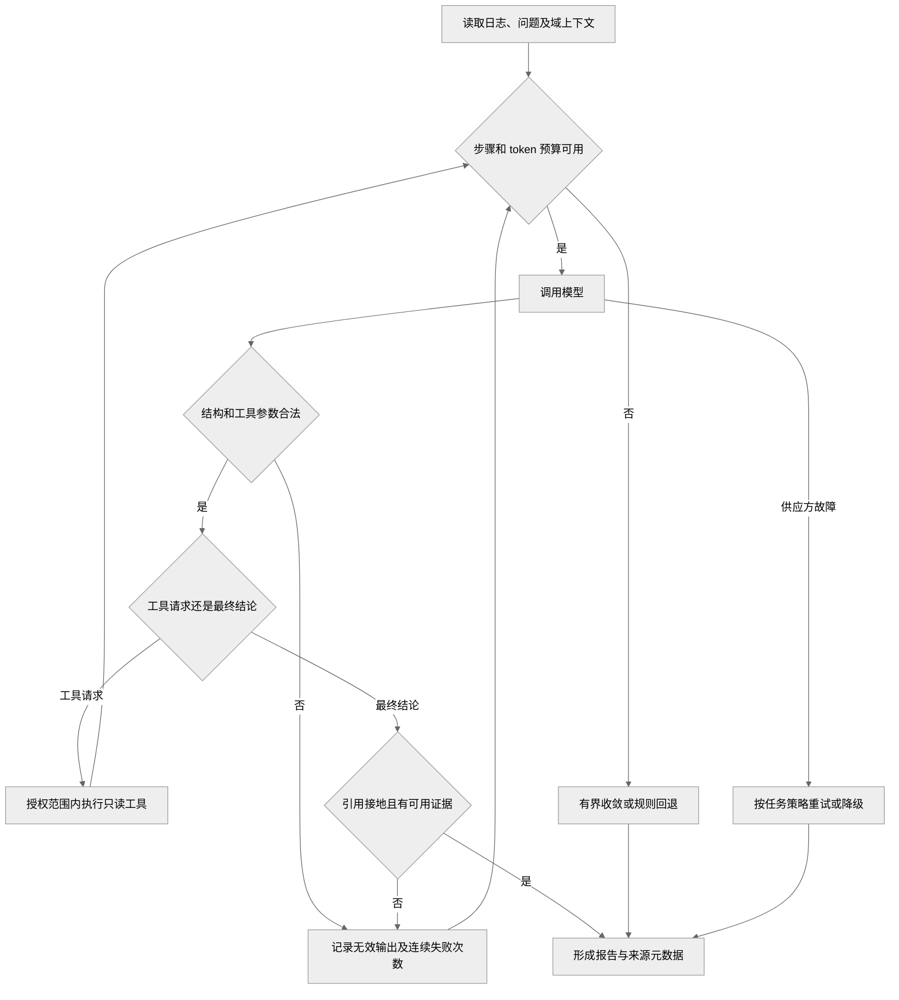
```mermaid
%%{init: {"theme": "neutral"}}%%
flowchart TD
  Start["读取日志、问题及域上下文"] --> Budget{"步骤和 token 预算可用"}
  Budget -- 是 --> Model["调用模型"]
  Model --> Structure{"结构和工具参数合法"}
  Structure -- 否 --> Invalid["记录无效输出及连续失败次数"]
  Invalid --> Budget
  Structure -- 是 --> Kind{"工具请求还是最终结论"}
  Kind -- 工具请求 --> Read["授权范围内执行只读工具"]
  Read --> Budget
  Kind -- 最终结论 --> Ground{"引用接地且有可用证据"}
  Ground -- 是 --> Report["形成报告与来源元数据"]
  Ground -- 否 --> Invalid
  Budget -- 否 --> Converge["有界收敛或规则回退"]
  Converge --> Report
  Model -- 供应方故障 --> Retry["按任务策略重试或降级"]
  Retry --> Report
```

图12省略具体最大次数数值，运行值来自配置和分析器常量。无效结构、非法工具和不存在的行引用都不能变成可靠结论。当前源码把预算内无法产生可用接地输出的一部分情况也标为 `token-budget-exhausted`；排障时还要读取调用 outcome，不能仅凭该标签断言供应方实际耗尽配额。

`analysisSource`、`degradedReason`、模型名称与提示词版本在服务层和 API DTO 之间有映射。消费报告时以端点实际 DTO 为准，不把数据库字段的下划线命名直接复制进 TypeScript 接口。

### 5.4 worker 和外部通知

数据库租约控制写入资格，重复、迟到消息必须先经过认领。旧 worker 租约失效后不得覆盖当前运行的报告或终态。重试次数、失败原因与死信信息保留在数据库，而不是仅存在 Redis 中。

结果 Webhook 是独立的尽力而为通知通道，使用签名、SSRF 约束和投递尝试记录。投递失败不能把已完成分析改成失败，也不能触发重新分析；通知摘要不携带原始日志内容。

### 5.5 租约防止旧 worker 覆盖

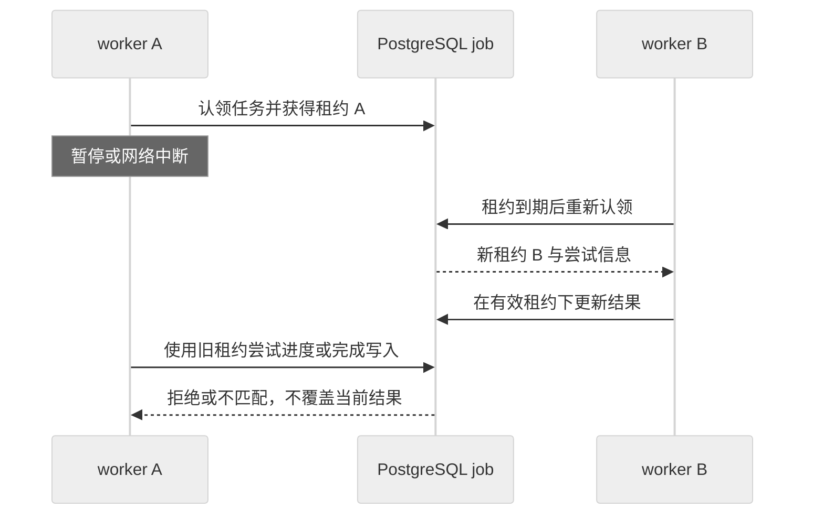
```mermaid
%%{init: {"theme": "neutral"}}%%
sequenceDiagram
  participant A as worker A
  participant DB as PostgreSQL job
  participant B as worker B
  A->>DB: 认领任务并获得租约 A
  Note over A: 暂停或网络中断
  B->>DB: 租约到期后重新认领
  DB-->>B: 新租约 B 与尝试信息
  B->>DB: 在有效租约下更新结果
  A->>DB: 使用旧租约尝试进度或完成写入
  DB-->>A: 拒绝或不匹配，不覆盖当前结果
```

图13的关键不是消息只投递一次，而是数据库状态和租约约束决定谁可以写。排查重复处理时记录 jobId、runId、leaseOwner、leaseExpiresAt 和 attemptCount；只有队列消息 ID 无法解释最终结果归属。队列重试、分析重试和 Webhook 重试各有职责，不得互相触发无限工作。

## 6 节点调试与 DTS 重载

### 6.1 设备桥与协议

调试领域通过网关和本地 Device Bridge 连接模拟器、HDC 或 ADB 设备。协议绑定必须存在且启用，桥连接及能力协商须与所选设备一致。切换设备、协议或桥后，旧检测结果不能用于新目标。

服务端在写入前检查权限、节点可写性、值类型及范围、设备状态、确认和租约。隐藏写按钮只改善交互，不能替代 API 的拒绝逻辑。设备路径与原始值可能属于敏感信息，日志及验收产物只保留必要摘要。

### 6.2 命令结果与观测

写命令执行结果和写后观测结果独立记录。命令成功后读取的值可能经过设备归一化、尚未生效或无法观测，不能仅因“与写入值不同”就判定命令失败。

| 事实 | 应记录的内容 |
| --- | --- |
| 命令执行 | 成功、失败、超时或旧桥无法判定，以及 stderr 或结构化原因 |
| 写后观测 | 观测到的值、读取失败、不支持读取或未执行读取 |
| 恢复依据 | 写前快照、目标身份及相关操作 ID |
| 审计 | 操作者、动作、目标、结果与请求关联 |

例如模拟器写入探针值 2 后观测为 1，应记录命令成功和实际观测 1，而不是自动生成不匹配失败。示例仅用于模拟器，不定义真实设备的安全写入值。

### 6.2.1 写入与观测结果类图

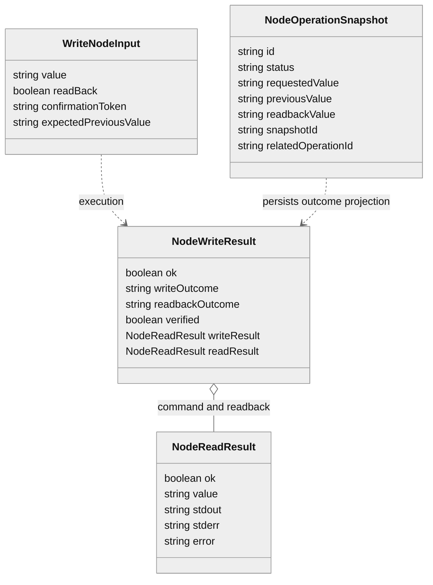
```mermaid
%%{init: {"theme": "neutral"}}%%
classDiagram
  class WriteNodeInput {
    string value
    boolean readBack
    string confirmationToken
    string expectedPreviousValue
  }
  class NodeWriteResult {
    boolean ok
    string writeOutcome
    string readbackOutcome
    boolean verified
    NodeReadResult writeResult
    NodeReadResult readResult
  }
  class NodeOperationSnapshot {
    string id
    string status
    string requestedValue
    string previousValue
    string readbackValue
    string snapshotId
    string relatedOperationId
  }
  class NodeReadResult {
    boolean ok
    string value
    string stdout
    string stderr
    string error
  }
  WriteNodeInput ..> NodeWriteResult : execution
  NodeWriteResult o-- NodeReadResult : command and readback
  NodeOperationSnapshot ..> NodeWriteResult : persists outcome projection
```

图14摘录端口 DTO，字段可选性和 `null` 以源码为准。`writeOutcome` 为 `executed / failed / unknown`；`readbackOutcome` 为 `observed / failed / unsupported / not_requested / unknown`。`verified = null` 不能按 `false` 或 `true` 强行解释。

历史操作状态类型仍包含 `readback_mismatch`，这是兼容形状存在的事实；它并不授权当前逻辑把任何观测差异都判成命令失败。页面应优先展示明确的执行结果和观测事实。

### 6.3 DTS 重载流程

重载根据所选调试值生成 overlay，通过固定版本的 dtc、fdtoverlay 与适用校验工具预检，再由持有桥连接的 API 进程执行部署。此流程不使用日志 BullMQ 队列。

部署要求 debugging:dts-reload 权限、确认、设备租约和桥能力；敏感节点还要满足关键参数权限与额外确认。Agent 与系统路径遵循服务端可信调用策略，客户端不能通过声明自己是人类绕过限制。

重载快照记录参数库基线、部署产物摘要、设备侧完整性检查强度和可获得的内核日志。缺少行为证明时保持 unverifiable，不能从“已传输文件”推导运行效果。残留记录是平台从历史推导的记账，不代表设备当前事实，重启或外部刷写可能使其失效。

### 6.3.1 重载部署与恢复时序

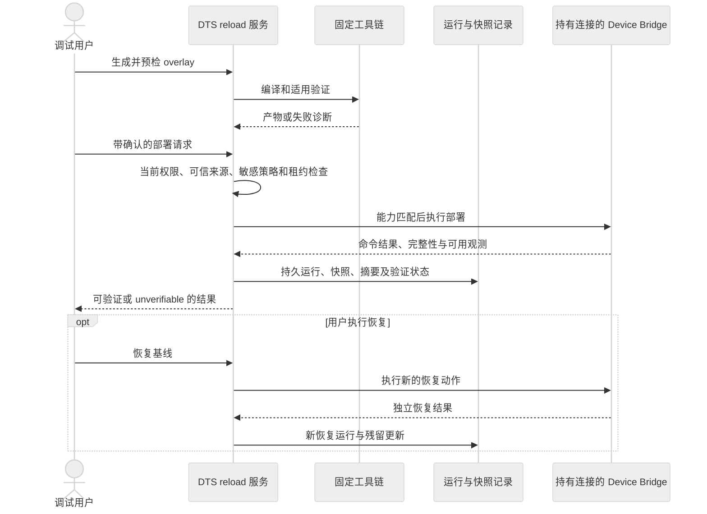
```mermaid
%%{init: {"theme": "neutral"}}%%
sequenceDiagram
  actor User as 调试用户
  participant API as DTS reload 服务
  participant Tool as 固定工具链
  participant DB as 运行与快照记录
  participant Bridge as 持有连接的 Device Bridge
  User->>API: 生成并预检 overlay
  API->>Tool: 编译和适用验证
  Tool-->>API: 产物或失败诊断
  User->>API: 带确认的部署请求
  API->>API: 当前权限、可信来源、敏感策略和租约检查
  API->>Bridge: 能力匹配后执行部署
  Bridge-->>API: 命令结果、完整性与可用观测
  API->>DB: 持久运行、快照、摘要及验证状态
  API-->>User: 可验证或 unverifiable 的结果
  opt 用户执行恢复
    User->>API: 恢复基线
    API->>Bridge: 执行新的恢复动作
    Bridge-->>API: 独立恢复结果
    API->>DB: 新恢复运行与残留更新
  end
```

图15描述主要责任顺序，不表示在桥调用前后只写一次记录。真实服务会按动作保存阶段和诊断。预检产物与部署目标应保持身份一致；设备、协议或桥变化后，不能复用旧的能力检查结果。

### 6.4 恢复和提升为草稿

恢复基线启动新的恢复运行，并单独记录结果；恢复失败应保留残留和错误证据。普通调试部署不改变参数库。将调试值提升为参数草稿是另一条受控操作，仅创建草稿，不自动提交、评审或写入正式绑定。

模拟器和假桥可证明本地流程。HDC 与 ADB 真机验证需要各自的设备就绪、授权目标和恢复计划，不能用本地测试结论代替。

## 7 小泽与知识库

### 7.1 小泽工具审批

小泽是唯一对话 Agent 入口，API 模式通过 CopilotKit 和 AG-UI SSE 连接后端 LangGraph 规划循环。读工具先检查权限，再执行受限查询。变更工具在执行前持久化工具调用和审批记录，向前端发出中断。

用户拒绝时不产生业务变更；批准后由 resolveApproval 重新检查审批状态、当前权限和修改后的参数。审批是对这次动作的授权，不会将 Agent 发起事实改写成用户发起。重复批准不能导致重复业务写入。

### 7.1.1 工具审批状态与调用链

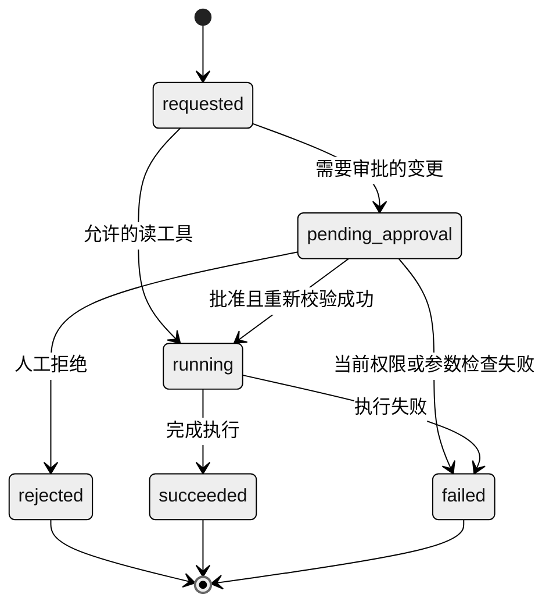
```mermaid
%%{init: {"theme": "neutral"}}%%
stateDiagram-v2
  [*] --> requested
  requested --> running: 允许的读工具
  requested --> pending_approval: 需要审批的变更
  pending_approval --> rejected: 人工拒绝
  pending_approval --> running: 批准且重新校验成功
  pending_approval --> failed: 当前权限或参数检查失败
  running --> succeeded: 完成执行
  running --> failed: 执行失败
  rejected --> [*]
  succeeded --> [*]
  failed --> [*]
```

图16是工具调用的主要路径，审批记录本身使用 `pending / approved / rejected`，与工具执行状态分开。审批已批准不等于工具已成功；重复请求也不能从已完成状态再次触发业务动作。

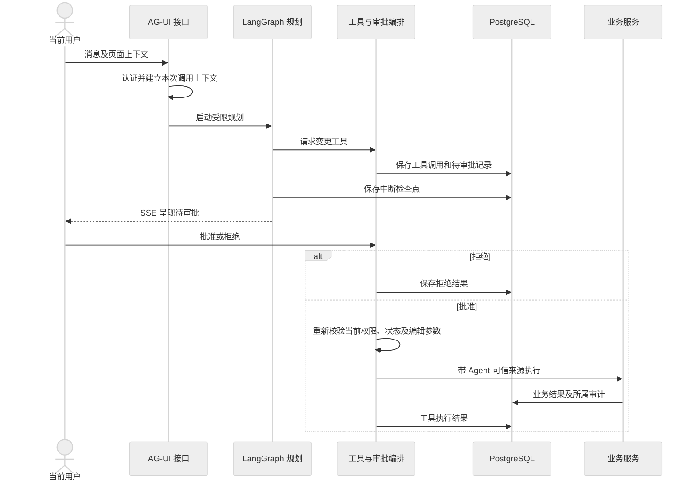
```mermaid
%%{init: {"theme": "neutral"}}%%
sequenceDiagram
  actor User as 当前用户
  participant HTTP as AG-UI 接口
  participant Graph as LangGraph 规划
  participant Approval as 工具与审批编排
  participant PG as PostgreSQL
  participant Domain as 业务服务
  User->>HTTP: 消息及页面上下文
  HTTP->>HTTP: 认证并建立本次调用上下文
  HTTP->>Graph: 启动受限规划
  Graph->>Approval: 请求变更工具
  Approval->>PG: 保存工具调用和待审批记录
  Graph->>PG: 保存中断检查点
  Graph-->>User: SSE 呈现待审批
  User->>Approval: 批准或拒绝
  alt 拒绝
    Approval->>PG: 保存拒绝结果
  else 批准
    Approval->>Approval: 重新校验当前权限、状态及编辑参数
    Approval->>Domain: 带 Agent 可信来源执行
    Domain->>PG: 业务结果及所属审计
    Approval->>PG: 工具执行结果
  end
```

图17刻意区分“人批准动作”和“动作来源”。前者决定这次工具是否可以继续，后者用于领域策略和归因，两者不能互相替代。客户端页面上下文可辅助定位，但角色和组织范围不能由页面字段授予。

### 7.2 持久化与恢复

生产配置要求 PostgreSQL 检查点。系统在中断时确认检查点可被另一存储实例读取，支持进程重启或实例切换后的恢复。本地确定性测试可以使用内存检查点，不能据此推断跨实例持久性。

聊天历史、审批业务记录和规划检查点分别承担呈现、授权和恢复职责。恢复请求必须重新建立认证上下文；已保存的图状态不是可直接信任的当前授权。请求级认证和事件输出通过单次调用配置传入，不应作为长期授权被固化在检查点中。

### 7.2.1 跨实例恢复协议

中断检查点写入后，持久化探测使用独立 PostgreSQL saver 读取相同 thread 配置，确认新实例可以取得检查点。如果超过探测时限仍不可读，应报告持久化失败，不能只因为原实例内存中还保存状态就宣布可恢复。

恢复前核对三组身份：业务会话与工具调用、审批记录、规划 thread/checkpoint。它们相关但并不相同。恢复调用仍需当前用户和组织范围；数据库中的旧权限快照不能成为新的授权事实。测试里可用假审批解析器证明检查点跨实例读取，但完整审批业务链需要另外验证。

### 7.3 知识生命周期与检索

知识条目按组织隔离，保留不可变修订。草稿可以由人员编写，也可以由日志分析或重载结果准备，但发布仍是显式治理步骤。检索只返回有权读取的已发布条目，草稿和已归档内容不能从搜索或小泽引用泄漏。

发布、编辑或归档触发索引刷新。索引保存分块与可选向量，检索融合向量和全文结果；嵌入端点或 pgvector 不可用时，返回明确的 fts_only 状态并使用文本检索。更换嵌入模型后需要重新构建相应索引。

引用应指向具体可读内容及修订背景。日志域关联知识后仍须检查条目当前发布状态，关联关系本身不是永久读授权。

### 7.4 知识发布与索引的独立生命周期

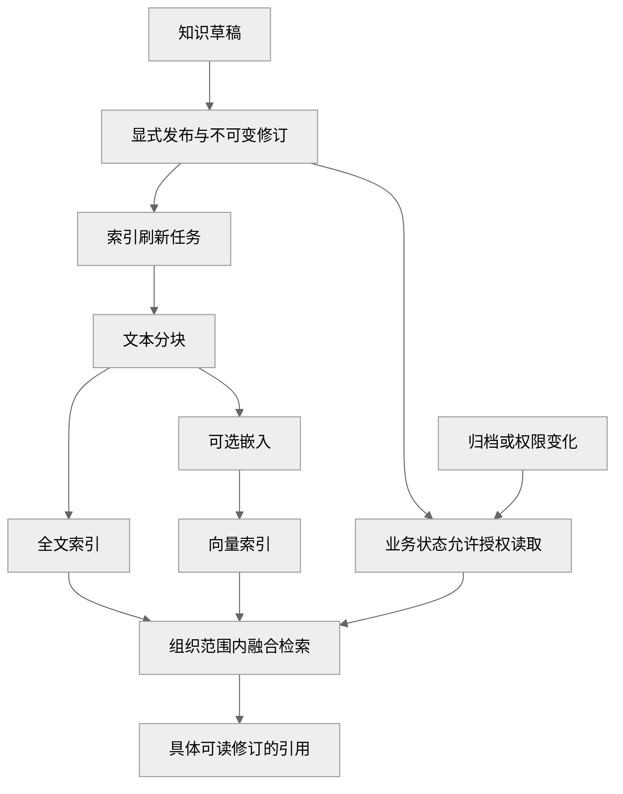
```mermaid
%%{init: {"theme": "neutral"}}%%
flowchart TB
  Draft["知识草稿"] --> Publish["显式发布与不可变修订"]
  Publish --> Visible["业务状态允许授权读取"]
  Publish --> Job["索引刷新任务"]
  Job --> Chunks["文本分块"]
  Chunks --> FTS["全文索引"]
  Chunks --> Embed["可选嵌入"]
  Embed --> Vector["向量索引"]
  FTS --> Retrieve["组织范围内融合检索"]
  Vector --> Retrieve
  Visible --> Retrieve
  Retrieve --> Citation["具体可读修订的引用"]
  Archive["归档或权限变化"] --> Visible
```

图18中业务发布状态和索引完成状态分开。发布成功但索引失败时，应保留条目状态和索引错误，允许受控重试；不能通过撤销用户发布来掩盖外部嵌入故障。归档或权限变化后，旧索引仍可能需要异步刷新，读取路径仍须执行当前可读性检查。

## 8 身份权限与公共治理

### 8.1 认证和授权

认证用于确认身份，数据库中的用户激活状态、组织归属和角色绑定决定实际授权。生产路径不能退回开发用户，也不能只依赖令牌中的角色声明授予管理员能力。

OIDC 通过发现文档与 JWKS 校验签发者、受众、有效期和签名，再读取 WiseEff 用户及角色。内置 local 账号使用数据库会话；HMAC 与开发身份用于限定的本地验证配置。不同认证方式的测试证据不能相互替代。

| 身份或能力 | 作用 | 限制 |
| --- | --- | --- |
| 普通工程用户 | 授权范围内查看和编辑业务对象 | 不自动拥有评审或治理权限 |
| 硬件与软件评审角色 | 承担指定工作流评审职责 | 必须符合负责人槽位及当前授权 |
| 组织管理员 | 本组织成员、目录及业务治理 | 不等于平台定义评审者或全部流程负责人 |
| 平台管理员 | 明确的平台管理与定义治理 | 仍受操作策略和独立评审要求约束 |
| Agent 发起者 | 受控读工具和经批准的变更 | 不能声明用户身份绕过人类专属门禁 |
| 系统调用 | 具名服务或任务动作 | 不伪造用户，使用自己的策略边界 |

### 8.2 可信调用与敏感操作

AuthContext 表示认证且可问责的主体，TrustedInvocationContext 表示本次操作已知的 user、agent 或 system 来源。该上下文由服务端构造，缺失时不得默认 user；客户端 header 或 body 无权自报可信来源。

Agent 来源携带会话、工具调用及适用的审批关联。批准后的 Agent 动作仍保留这些关联。此机制描述服务端已知的调用路径，不宣称普通 bearer token 能证明物理人类在场。

### 8.2.1 可信调用上下文类图

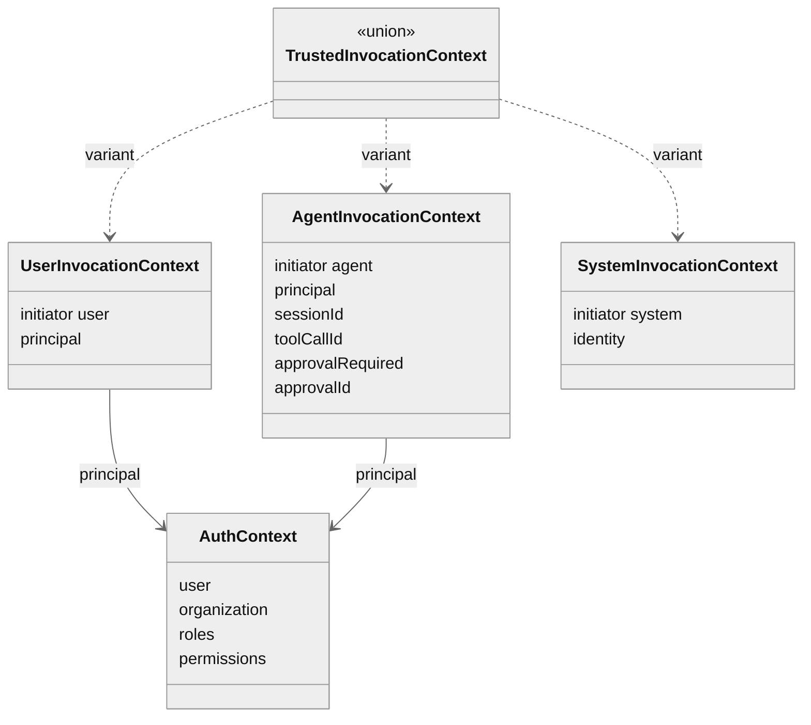
```mermaid
%%{init: {"theme": "neutral"}}%%
classDiagram
  class AuthContext {
    user
    organization
    roles
    permissions
  }
  class TrustedInvocationContext {
    <<union>>
  }
  class UserInvocationContext {
    initiator user
    principal
  }
  class AgentInvocationContext {
    initiator agent
    principal
    sessionId
    toolCallId
    approvalRequired
    approvalId
  }
  class SystemInvocationContext {
    initiator system
    identity
  }
  TrustedInvocationContext ..> UserInvocationContext : variant
  TrustedInvocationContext ..> AgentInvocationContext : variant
  TrustedInvocationContext ..> SystemInvocationContext : variant
  UserInvocationContext --> AuthContext : principal
  AgentInvocationContext --> AuthContext : principal
```

图19表示联合类型的变体，不是运行时继承。源码通过服务端私有 Symbol 品牌与结构检查建立可信上下文。用户和 Agent 有可问责主体，系统调用使用具名 service 或 job 身份，没有伪造的用户主体。

当用户被删除时，保留的领域归因可以记录 `principalDeleted` 和 Agent 关联，而不恢复已删除用户的个人信息。持久化归因投影是内部证据结构，不应直接作为公共 DTO 暴露。

### 8.3 审计和数据保留

审计事件包含组织、项目、主体或发起类型、应用域、动作、目标、严重程度、元数据、时间和 traceId。普通业务接口不能随意修改历史审计，查询必须按授权范围过滤。

业务写失败、设备失败、审批拒绝和依赖故障应有可追踪结果。证据输出不得包含令牌、密钥、完整敏感参数或不必要的个人资料。账号删除审计保留必要动作事实，保留历史通过可空引用适应用户删除。

### 8.4 反馈与通知

已启用的认证用户可以提交带页面上下文的反馈及允许的图片，管理员按 open、in_progress、closed 流程处理并记录备注。附件字节与元数据分别存储，访问时按组织和管理权限检查。

通知属于具体用户，已读状态与未读数需要持久化。点击通知进入业务对象后，目标页面仍执行自身授权，不能把通知链接当作访问凭据。

## 9 API 集成约定

### 9.1 请求和错误

API 以 REST 与 JSON 为主，同时提供任务进度和 Agent SSE。业务接口分布于 /api/v1 和明确的 /api/v2 路由族。前端通过应用端口和 HTTP DTO 映射调用，避免在页面重复解析业务错误。

认证请求携带 Authorization。X-Request-Id 可由客户端提供，服务端也可生成，并向日志与审计传播。重试敏感写入时保留原操作的幂等身份和版本条件；并非所有写接口都接受同一个统一幂等头，应按具体端点契约调用。

```json
{
  "error": {
    "code": "FORBIDDEN",
    "message": "User does not have permission.",
    "requestId": "req_example"
  }
}
```

| HTTP 状态 | 典型 code | 客户端处理 |
| --- | --- | --- |
| 400 | VALIDATION_FAILED | 保留输入并显示具体校验原因 |
| 401 | UNAUTHENTICATED | 重新认证，不绕过身份检查 |
| 403 | FORBIDDEN | 告知权限不足，不重试为特权身份 |
| 404 | NOT_FOUND | 对象不存在或范围隐藏 |
| 409 | CONFLICT、APPROVAL_REQUIRED | 刷新状态或等待合法审批 |
| 410 | GONE | 表面已退役，不能退回旧写路径 |
| 429 | RATE_LIMITED | 按限流策略稍后重试 |
| 503 | SERVICE_UNAVAILABLE | 检查目录或依赖就绪，遵守 Retry-After |
| 500 | INTERNAL_ERROR | 保存请求关联，进入诊断流程 |

目录客户端进一步读取 error.details.reason，例如 catalog-not-ready、release-drift、proposal-stale 或 revision-conflict，不匹配 message 文本。服务端未就绪不能被前端转为“没有数据”。

### 9.1.1 HTTP 请求处理与错误分层

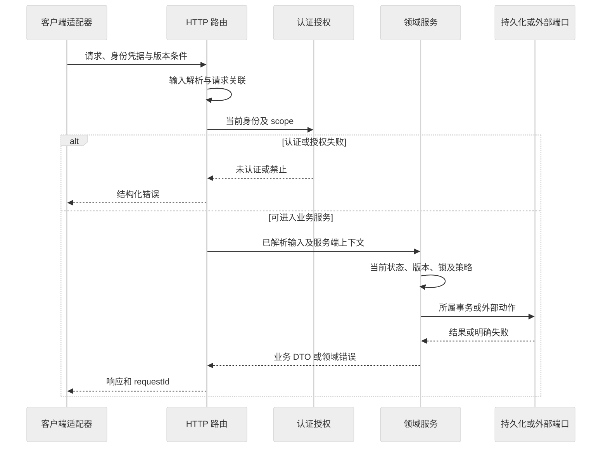
```mermaid
%%{init: {"theme": "neutral"}}%%
sequenceDiagram
  participant Client as 客户端适配器
  participant Router as HTTP 路由
  participant Auth as 认证授权
  participant Service as 领域服务
  participant Store as 持久化或外部端口
  Client->>Router: 请求、身份凭据与版本条件
  Router->>Router: 输入解析与请求关联
  Router->>Auth: 当前身份及 scope
  alt 认证或授权失败
    Auth-->>Router: 未认证或禁止
    Router-->>Client: 结构化错误
  else 可进入业务服务
    Router->>Service: 已解析输入及服务端上下文
    Service->>Service: 当前状态、版本、锁及策略
    Service->>Store: 所属事务或外部动作
    Store-->>Service: 结果或明确失败
    Service-->>Router: 业务 DTO 或领域错误
    Router-->>Client: 响应和 requestId
  end
```

图20的关键是授权后仍有领域状态检查。HTTP 200 只表示该端点请求成功；异步端点可能返回已创建的 run 或 job，调用方仍需读取其终态。错误详情用于程序分支，message 用于用户诊断，不应作为稳定枚举匹配。

客户端可按以下顺序决定恢复：401 重新认证；403 停止越权动作；版本冲突先刷新；限流遵守等待策略；服务未就绪检查重试信息。超时且存在写入可能时，先查询原操作或使用端点约定的幂等身份，不自动生成新请求身份。

### 9.2 主要接口族

| 接口族 | 示例 | 关键边界 |
| --- | --- | --- |
| 当前身份 | GET /api/v1/me | 返回当前用户、组织与有效角色 |
| 组织资料 | GET 或 PATCH /api/v1/organization | 修改名称需要 users:manage |
| 用户治理 | /api/v1/users 及 /:userId/roles | 服务端授权、激活状态、历史保留 |
| 用户删除 | DELETE /api/v1/users/:userId | 合法删除返回 204，禁止自删及越权 |
| 项目参数 | /api/v1/parameters 与 /parameter-drafts | 项目上下文、类型与候选身份 |
| 提交评审 | /api/v1/parameter-submission-rounds 与 /parameter-change-requests | 精确负责人及状态转移 |
| 配置文件 | /api/v1/projects/:projectId/parameter-files | 版本、对象归属与冲突 |
| 规范目录 | /api/v2/catalog/* | 发布固定、注册、范围与未就绪状态 |
| 日志 | /api/v1/logs 与 /log-domains | 组织隔离、可选业务域、证据与归档 |
| 设备与重载 | /api/v1/debugging/* 与 /api/v1/dts-reload/* | 协议、租约、确认、快照与观测 |
| 知识 | /api/v1/knowledge/* | 已发布可读性、版本、对象与索引 |
| 小泽 | POST /api/v1/agent/xiaoze | AG-UI SSE、逐次鉴权和审批中断 |
| 审计 | /api/v1/audit-events | 组织和应用过滤、关联查询与分页 |

本表是主要接口族说明，不把通配符当作可直接请求的地址。接入具体动作时，应依据该版本生成 OpenAPI 中的确切方法、路径、输入和响应；不能按示例名称猜测不存在的端点。

### 9.3 契约维护

路由元数据和 schema 生成 OpenAPI，契约检查防止服务端、客户端与 DTO 漂移。修改接口时同时检查调用端对缺失字段、空列表、版本冲突和权限错误的处理，保留明确的错误状态，不增加静默 mock 回退。

目录使用不透明 ID，旧标识符通过显式映射返回已映射、归档、冲突、未知或范围隐藏结果。旧书签解析不能借用当前版本摘要解释历史发布，也不能绕过已退役的写表面。

## 10 开发环境和运行配置

### 10.1 本地准备

需要兼容项目的 Node.js、npm、可访问的 PostgreSQL 和固定 DTS 工具链。若使用本地容器环境，还需要 Docker。复制环境模板前检查已有配置，不覆盖他人的环境文件或凭据。

```bash
npm ci
cp .env.example .env
npm run dts:toolchain:bootstrap
npm run dts:toolchain:check -- --required
npm run db:migrate
```

上例按 macOS 或 Linux shell 书写，数据库连接和环境变量必须先配置到自己的开发环境。目录集成验证需要带 pgvector 的独立数据库，并按实际角色执行；共享应用库不能作为可破坏的测试数据源。

开发 API 和前端可分别启动：npm run dev:api 与 npm run dev。日志分析还需要有效 worker；如果运行 npm run worker:logs 作为独立进程，应明确关闭 API 内的重复 worker。迁移、种子和调试操作仅在所属开发环境执行。

### 10.2 关键配置

| 配置 | 用途 | 约束 |
| --- | --- | --- |
| VITE_WISEEFF_RUNTIME_MODE | api 或 mock | 本地默认 api；生产不使用 mock 业务数据 |
| VITE_WISEEFF_API_BASE_URL | 前端 API 地址 | 本地通常为 http://127.0.0.1:8787 |
| DATABASE_URL | PostgreSQL 连接 | 包含凭据时按秘密处理 |
| AUTH_MODE 与 AUTH_PROVIDER | 身份运行方式 | 与部署和验证目标一致 |
| OBJECT_STORE_MODE | local 或 s3 | 生产配置要求适当的 S3 兼容存储 |
| LOG_WORKER_ENABLED | API 内日志 worker 开关 | 独立 worker 部署时避免重复所有权 |
| LOG_ANALYSIS_QUEUE_MODE 与 REDIS_URL | polling 或 durable 分发 | durable 模式需要 Redis |
| LOG_ANALYSIS_KERNEL | loop 或 single-shot | 默认 loop，受步骤和 token 预算约束 |
| XIAOZE_CHECKPOINTER | memory 或 postgres | 生产要求 PostgreSQL 与有效数据库连接 |
| XIAOZE_DETERMINISTIC | 确定性小泽运行 | 不代表在线模型质量 |
| EMBEDDING_MODEL 与 EMBEDDING_API_BASE_URL | 知识向量检索 | 不可用时明确文本回退 |

### 10.3 模型配置与秘密

小泽使用 XIAOZE_LLM_API_BASE_URL、XIAOZE_LLM_MODEL、XIAOZE_LLM_API_KEY；日志分析使用独立 LOG_ANALYSIS 配置族；知识嵌入使用 EMBEDDING_API 配置族。一个模型入口可用，不证明另外两条路径可用。

端点、密钥、认证 token 和数据库连接不写入版本库、截图或交付附件。需要本地额外秘密时使用被忽略的环境覆盖文件。配置检查通过只说明配置形状正确，远程服务的连通、授权、配额和输出质量仍需相应验证。

## 11 部署运维与恢复

### 11.1 健康层次

| 入口或检查 | 说明 | 不能替代的证据 |
| --- | --- | --- |
| /health/live | 进程可响应 | 数据库或外部依赖就绪 |
| /health/ready | 数据库、对象存储、worker 等依赖状态 | 全部业务验收和目标发布批准 |
| 试点就绪端点 | 汇总配置、依赖和试点证据 | 实际目标演练与人的发布决策 |
| /metrics | 私有运维指标 | 完整 trace 和真实业务结果 |

自托管观测可以运行 Prometheus、Grafana、Alertmanager 和 exporter。指标与监控界面属于私有运维面，不能直接向公网暴露。API 和 worker 指标应分别检查，健康进程不等于任务正在正确消费。

### 11.1.1 自托管部署拓扑

```mermaid
%%{init: {"theme": "neutral"}}%%
flowchart TB
  Browser["浏览器"] --> Proxy["反向代理与 TLS"]
  Proxy --> Web["静态 web"]
  Proxy --> API["API 进程"]
  API --> PG["PostgreSQL"]
  API --> Object["S3 兼容对象存储"]
  API --> Redis["Redis / BullMQ"]
  Redis --> Worker["独立日志 worker"]
  Worker --> PG
  Worker --> Object
  Worker --> Provider["模型供应方"]
  API --> Bridge["Device Bridge 连接"]
  Monitor["私有指标采集"] --> API
  Monitor --> Worker
  Monitor --> PG
```

图21是自托管组件拓扑，不规定所有服务部署在不同物理主机。关键约束是服务职责、连接配置和数据恢复范围明确。静态资源服务可用不能证明 API 就绪，API 存活不能证明 worker 正在消费任务。

### 11.2 升级控制

升级先固定不可变目标版本并完成构建，再暂停队列和写入、建立可验证恢复点、重建服务、检查候选健康，最后恢复队列与入口。每个阶段保留状态和诊断，失败时执行当前阶段允许的恢复动作。

数据库迁移、对象内容和 Redis 状态有不同生命周期，不能只回退应用镜像就宣称恢复了数据。恢复候选、恢复旧服务栈和恢复数据是不同动作，须按实际恢复点与阶段协议区分。

### 11.2.1 升级阶段与失败分支

```mermaid
%%{init: {"theme": "neutral"}}%%
flowchart TD
  Version["固定目标版本并构建"] --> Check["配置和迁移兼容性检查"]
  Check --> Quiesce["暂停适用的队列与写入口"]
  Quiesce --> Backup["建立并记录恢复点"]
  Backup --> Replace["重建候选服务"]
  Replace --> Health{"候选健康及关键检查"}
  Health -- 通过 --> Resume["恢复队列与入口"]
  Health -- 失败 --> Diagnose["保存当前阶段与诊断"]
  Diagnose --> Rollback["执行该阶段允许的恢复"]
  Rollback --> Verify["验证恢复后的数据与服务"]
```

图22是操作阶段图，不是可替代升级脚本的命令清单。迁移若不兼容旧应用版本，应使用已验证的数据库恢复方案，不能直接切回旧镜像。恢复成功的判据应包括业务记录、对象内容及必要任务状态，而不只是一条健康请求。

### 11.3 备份与恢复

备份至少关联 PostgreSQL、对象存储及适用的 Redis 状态。恢复演练使用隔离的数据库和对象前缀，记录版本、备份清单、摘要及命令结果。恢复完成后检查业务记录与对象键是否一致、是否有缺失文件、任务状态是否可解释。

本地脚本可以检查命令和证据格式；目标恢复必须真实执行并保留目标身份。不能用一份人工写的“已通过”记录替代数据库和对象恢复结果。

### 11.4 目录切换和退役

存量目录切换是维护流程，需要写冻结、分类与映射证据、预激活比较、激活以及激活后的独立比较，并保留恢复路径。未知或歧义数据不得被强制归为已识别绑定。当前目录路由存在不意味着某个目标的旧数据已成功切换。

旧接口和数据清理受独立的使用观察、保留期限与发布条件约束。技术接手不构成切换或删除授权，部署负责人应使用对应目标的实际证据作出决定。

## 12 验证与故障定位

### 12.1 按影响选择验证

| 修改范围 | 主要检查 | 证据层次 |
| --- | --- | --- |
| 纯文档 | npm run docs:check 与 git diff --check | 文档治理与引用 |
| 前端或共享类型 | 聚焦组件测试与 npm run build | 类型、构建与组件行为 |
| 服务与事务 | 聚焦服务测试和真实 PostgreSQL 集成 | API、数据库与审计 |
| 接口或 DTO | 契约检查与受影响客户端测试 | 接口一致性 |
| 浏览器行为 | 受影响验收流程及三档尺寸检查 | 本地或目标 UI 行为 |
| 日志内核 | logs:eval 与适用的质量评测 | 确定性行为与真实日志质量分别记录 |
| 设备与运维 | 模拟器检查及单独目标演练 | 本地形状与目标事实分开 |

Excel 用例表以逐项可判定的场景记录准备、步骤、预期和执行结果。其“未执行”状态不能从已有测试文件存在自动改为通过；测试收集为零、必需依赖缺失或必需用例跳过都必须显式报告。

### 12.2 故障定位路径

| 现象 | 优先检查 | 下一步 |
| --- | --- | --- |
| 页面有数据但值或项目不对 | 运行模式、端口适配、DTO、迟到响应 | 对比请求项目、候选和发布身份 |
| 目录空或未就绪 | 当前发布指针、注册、项目授权、投影错误 | 区分合法零值与不可用状态 |
| 提交或审批冲突 | 当前版本、锁、审批状态与实际角色 | 刷新证据后重新确认，不盲目重放 |
| 日志停滞 | 对象访问、数据库任务租约、worker 和分发 | 对照 run 与 job 终态及重试原因 |
| 写命令与观测不一致 | 命令结果、观测结果、快照和桥协议 | 分开处理命令失败与观测差异 |
| 小泽无法恢复 | 检查点存储、命名空间、当前授权 | 证明中断可读，再检查审批链 |
| 知识搜索缺失 | 发布状态、组织范围、索引状态、嵌入配置 | 明确文本回退或索引重试 |
| 升级或恢复失败 | 精确版本、阶段记录、恢复点、依赖状态 | 执行该阶段允许的恢复动作 |

### 12.2.1 按现象收集最小证据

| 问题 | 首先保留 | 接着核对 | 避免的错误动作 |
| --- | --- | --- | --- |
| 参数值没有更新 | project、binding、candidate、request 身份 | 实际负责人、版本锁、写回来源和解析值 | 反复提交新请求绕过旧冲突 |
| 目录使用量为零 | 发布 pin、查询和授权范围 | 查询成功空集还是投影失败 | 把所有异常转为零 |
| 日志任务停滞 | logId、runId、jobId、租约和阶段 | 对象可读、worker 认领、模型调用 outcome | 仅重启 Redis 并宣布恢复 |
| 设备操作结果未知 | operationId、snapshotId、桥与目标 | 命令、观测、实际值及残留 | 未确认原副作用就重复写入 |
| Agent 批准后无结果 | toolCallId、approvalId、thread | 当前权限、检查点、工具执行状态 | 把 approved 视为 succeeded |
| 知识内容搜不到 | 条目 ID、修订、发布与索引状态 | 组织范围、分块、嵌入及 fts_only | 用另一组织内容填补空结果 |

### 12.3 研发接手检查顺序

先确认代码版本和运行模式，再验证数据库、对象存储及必要 worker。选择一条参数变更链和一条日志或模拟器链，通过路由、端口、HTTP、领域服务、持久化、审计和测试逐层追踪。修改时同步维护接口及领域约定，避免只修界面表象。

涉及目录、可信调用、设备或恢复的修改，应先明确该模块负责的事务和外部副作用，再选择负向、并发与恢复用例。记录检查使用的环境、实际运行命令和结果，避免把历史本地通过当成当前目标证据。

## 13 编制依据与版本说明

本合集汇编同一工作区的架构、领域、接口、安全、开发及运维资料，并用当前源码和关联测试核对实现状态。

| 依据 | 本文采用内容 |
| --- | --- |
| 全栈架构与技术文档 | 运行时、模块边界、当前业务链 |
| 领域模型与 API 契约 | 对象关系、状态、接口族与错误 |
| 安全与权限设计 | 数据库授权、可信调用、审计与保留 |
| 开发环境与环境变量 | 本地准备、模型配置、worker 和存储 |
| 验证矩阵与人工验收 | 检查选择、环境边界与恢复证据 |
| 当前源码及关联测试 | 目录实际组合、循环分析、持久检查点、观测语义 |

源码、运行配置、接口或状态模型变化时，应同步更新本合集及配套用例表，保持版本对应。

### 13.1 源码核对索引

以下文件用于追溯本合集中的事实。阅读正文不依赖跳转，修改系统时则应同时检查对应实现和测试。

| 核对点 | 实现依据 |
| --- | --- |
| 路由、运行时和导航 | [appConfig.ts](../../../src/appConfig.ts)、[appRuntime.ts](../../../src/app/appRuntime.ts)、[workflowDiscovery.ts](../../../src/domain/workflowDiscovery.ts) |
| API 组合 | [server/app.ts](../../../server/app.ts) |
| 参数端口及类型化草稿 | [ParameterRepository](../../../src/application/ports/ParameterRepository.ts)、[ParameterTopologyRepository](../../../src/application/ports/ParameterTopologyRepository.ts) |
| 参数状态及兼容字段 | [参数领域类型](../../../src/domain/parameters/types.ts) |
| 目录运行时与授权范围 | [productionWire.ts](../../../server/modules/parameter-catalog-api/productionWire.ts)、[Catalog Kernel 接口](../../../server/modules/catalog-kernel/interface.ts) |
| 提案命令、ETag 和重放 | [command.ts](../../../server/modules/parameter-governance/proposals/command.ts)、[提案工作流测试](../../../server/modules/parameter-governance/proposals/workflow.integration.test.ts) |
| 日志状态与任务租约字段 | [status.ts](../../../server/modules/logs/status.ts)、[jobs/types.ts](../../../server/modules/jobs/types.ts)、[worker.ts](../../../server/modules/logs/worker.ts) |
| 分析选择、循环及降级 | [analyzerFromEnv.ts](../../../server/modules/logs/analyzer/analyzerFromEnv.ts)、[agentLoop.ts](../../../server/modules/logs/analyzer/agentLoop.ts)、[llmAnalyzer.ts](../../../server/modules/logs/analyzer/llmAnalyzer.ts) |
| 命令和观测 DTO | [DebuggingGateway](../../../src/application/ports/DebuggingGateway.ts) |
| DTS 部署和恢复 | [DTS reload 模块](../../../server/modules/dts-reload/)、[重载验收](../../../e2e/acceptance/dts-reload-deploy.acceptance.spec.ts) |
| Agent 状态、审批和恢复 | [types.ts](../../../server/modules/agent/types.ts)、[orchestrator.ts](../../../server/modules/agent/orchestrator.ts)、[durableCheckpointer.ts](../../../server/modules/agent/xiaoze/durableCheckpointer.ts) |
| 可信来源和删除保留 | [trustedInvocation.ts](../../../server/modules/auth/trustedInvocation.ts)、[用户删除集成](../../../server/modules/users/deletion.integration.test.ts) |
| 知识发布与检索 | [knowledge/service.ts](../../../server/modules/knowledge/service.ts) |
| 配置及 HTTP 错误 | [env.ts](../../../server/config/env.ts)、[errors.ts](../../../server/shared/http/errors.ts) |
| 运行维护 | [升级脚本](../../../ops/self-hosted/scripts/upgrade.sh)、[运行手册](../runbooks/README.md) |
| 测试设计与验证选择 | [测试策略与设计](testing-strategy.md)、[验证矩阵](../developer/verification-matrix.md) |

### 13.2 图表维护与验证边界

接口字段变化时更新对应类图与端口说明；状态变化时更新状态图及错误分支；模块职责变化时更新架构图、调用时序和事务表。代码审阅、Mermaid 语法与渲染检查只能证明文档可读、图表可解析，不能代替业务测试。模拟器、确定性模型、真实数据库、在线供应方和目标设备的结论分别记录。
