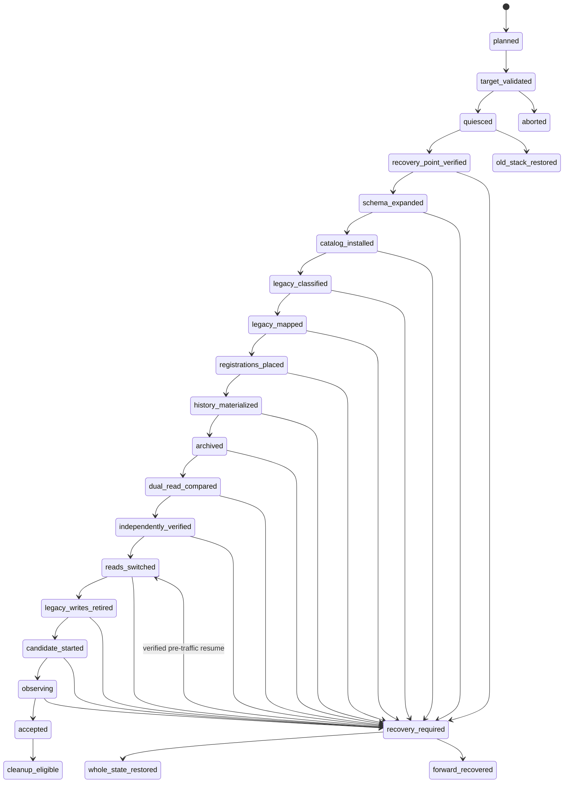

# 参数目录切换、归档与回滚合同

> English companion: [English](../../design-docs/parameter-catalog-cutover-archive-rollback.md)

日期：2026-09-01

## 状态与范围

本文是 Wayfinder 地图 [Wayfinder: replace the parameter catalog with one canonical definition model](https://github.com/tzrea1-Q/WiseEff/issues/668) 中 [Choose populated-data cutover, archive, and rollback strategy](https://github.com/tzrea1-Q/WiseEff/issues/678) 的已接受决策产物。联合验收补全把 P11 read-only dual-read comparison 锁定为 read switch 前的 mandatory gate，并把本双语文档登记进 documentation governance。

本文决定 fresh 与 populated PostgreSQL 数据库的迁移、归档、激活和恢复合同。它不是生产 migration、cutover 脚本、migration 编号、release readiness 声明，也不授权删除生产数据。只有 Wayfinder 地图按仓库的正常 specification 与 implementation planning 流程折叠后，才能开始实现。

规范输入包括：

- [当前合同与消费者清单](https://github.com/tzrea1-Q/WiseEff/blob/f982c76a063f3c8bc0a7366d5253243ecba2866f/docs/references/parameter-catalog-contract-inventory.md)；
- [R0-R10 旧数据分类](https://github.com/tzrea1-Q/WiseEff/blob/000f617ba9810adda4798b4bc4b2bdfed95b4c39/docs/references/legacy-parameter-row-classification.md)；
- [populated PostgreSQL 演练 fixture](https://github.com/tzrea1-Q/WiseEff/blob/6c3adfc35c0e3be6d5d381013dace9408190380e/docs/zh-CN/references/parameter-catalog-rehearsal-fixture.md)；
- [ADR-0040、ADR-0041 与 ADR-0042 最终集成决策集](https://github.com/tzrea1-Q/WiseEff/tree/9fe269d4facc31b49fc1e0535d2d51ba7140644b/docs/adr)；
- accepted [Catalog Kernel interface 与 transaction boundary](https://github.com/tzrea1-Q/WiseEff/blob/41b7e58fd73524a81fb13db0078b332c54f7517a/docs/design-docs/catalog-kernel-interface-and-transaction-boundary.md) 及 [parameter API 与 legacy-identifier transition](https://github.com/tzrea1-Q/WiseEff/blob/312c30dd730d95fa4e20882fbc759c990b71aba2/docs/design-docs/parameter-catalog-api-transition.md)；以及
- 当前[生效目录对账运行手册](../runbooks/effective-driver-parameter-catalog-reconciliation.md)和[自托管升级控制器](../../../ops/self-hosted/upgrade.zh-CN.md)。

已接受的 A+B+C UI prototype 只属于决策证据，不是迁移输入。

## 固定结论

- 切换只使用一次有界 maintenance window，不做长期 dual write。
- 候选数据库、Catalog Release、mapping、Archive 与 read path 通过独立 verifier 前，公网流量、queue、API、worker 和 web 必须保持隔离。
- 只有在 write/queue quiescence 后才捕获跨存储 recovery point，并在第一次数据库变更前完成验证。
- 只有 published immutable Catalog Release 可以物化 Catalog subject、release membership、alias、Parameter definition 或 Definition revision。
- property key、展示名、module 名、source-key token、observed node name 与行顺序都不是 identity proof。
- cutover run 内每个 legacy identity 都只有一个 disposition。unknown/ambiguous 数据 fail closed 到 ReviewEvidence 或 immutable Archive，不进入 operational reads。
- 通过 typed、versioned legacy-ID mapping 保留稳定业务引用。不能为了让 current view 看起来干净而改写历史。
- Catalog Release 安装、应用 read switch 与公网 traffic switch 是三个不同事件，分别留证。
- P11 在 traffic 与全部 writer 持续隔离时执行 mandatory dual-read comparison；比较 legacy/canonical semantic result，而非 row/DTO bytes，并且必须在 P12 前通过。
- pointer switch-back 只适用于 pre-traffic、zero-candidate-write 恢复，不能充当通用 rollback。
- local synthetic、populated-shape、target-host rehearsal 与 release evidence 是不同证据类别。

## 维护 module seam

后续实现应在维护 seam 暴露一个深的 **parameter catalog cutover module**。其小 interface 是：

```text
planCutover(targetArtifact, sourceSnapshot) -> immutable CutoverPlan
executeCutover(planDigest) -> CutoverRunSnapshot
inspectCutover(runId) -> CutoverRunSnapshot
recoverCutover(runId, recordedAction, runBoundToken) -> CutoverRunSnapshot
```

`executeCutover` 负责阶段顺序、checkpoint、独占锁、事务边界、幂等、证据和失败分类。调用者不能自行协调分类、mapping、Archive、pointer 或 legacy writer retirement。自托管控制器是这个 seam 的 adapter；[Capture a representative populated-database rehearsal fixture](https://github.com/tzrea1-Q/WiseEff/issues/671) 的 real-PostgreSQL runner 是同一 seam 的测试 adapter，不是另一套迁移实现。

Catalog 编译与同步仍位于 [Choose the catalog kernel interface and transaction boundary](https://github.com/tzrea1-Q/WiseEff/issues/673) 已接受的 Catalog Kernel interface 后。本文消费该 interface，不重复或抢占它。Mandatory comparison 是 cutover module 的 private behavior：bounded legacy semantic-read adapter 与 canonical semantic-read adapter 是内部可测试 seam，而不是新的 Catalog Kernel operation 或 runtime interface。

内部 seam 可以适配 PostgreSQL、recovery-point controller、queue/traffic isolation、Catalog Release synchronizer、independent verification 与 evidence store。除非同时存在真实 production 与 test adapter，否则这些 seam 保持私有。

## Cutover state machine



`catalog_installed` 表示 immutable Catalog Release 与 Definition head 已在隔离的 candidate database state 内切换。`reads_switched` 是另一个 application read-mode activation。`candidate_started` 不表示公网流量已开启；只有 internal readiness 通过后才能恢复 queue 并切换 proxy。

### 阶段合同

| 阶段                                      | 进入条件                                                                                                       | 操作与退出证据                                                                                                                                                                                                                                                                                                                                                                                                                               | 重试或恢复规则                                                                                                                                                                                          |
| ----------------------------------------- | -------------------------------------------------------------------------------------------------------------- | -------------------------------------------------------------------------------------------------------------------------------------------------------------------------------------------------------------------------------------------------------------------------------------------------------------------------------------------------------------------------------------------------------------------------------------------- | ------------------------------------------------------------------------------------------------------------------------------------------------------------------------------------------------------- |
| P0 Inventory and plan                     | exact target artifact、current application SHA、database migration inventory 与 operator approval owner 已知。 | 只读 inventory 记录 source schema/relation fingerprint、R0-R10 count、protected-reference count、current catalog/read mode、installed release digest、candidate lineage、changed migration、storage identity 与完整 plan digest。                                                                                                                                                                                                            | 可以自由重复；任一输入改变都会产生新 plan digest。                                                                                                                                                      |
| P1 Offline target validation              | P0 plan 仍为 current。                                                                                         | 停机前构建 candidate；校验 Catalog Release manifest、digest、complete membership、alias、tombstone、Definition snapshot、toolchain、supported lineage、old/new schema compatibility declaration，以及 [Capture a representative populated-database rehearsal fixture](https://github.com/tzrea1-Q/WiseEff/issues/671) 的 rehearsal evidence reference。                                                                                      | 停机前可重复；artifact 变化即新 plan。                                                                                                                                                                  |
| P2 Write and traffic quiescence           | P1 通过并记录 maintenance confirmation。                                                                       | 停止 public proxy；pause/drain queue；停止 API、worker、web；取得 host 与 PostgreSQL cutover lock；revoke/fence legacy 与 candidate application writer；证明 active write transaction 与 leased job 都为零。                                                                                                                                                                                                                                 | stop/drain 可重试；失败时不改数据，恢复并验证 old stack。                                                                                                                                               |
| P3 Verified recovery point                | P2 持续成立。                                                                                                  | 从同一个 quiesced 边界捕获 PostgreSQL、配置的 S3-compatible object store 与 durable Redis；验证 manifest、checksum、restore tooling、storage identity、target location 与 plan 最大时效；记录唯一 recovery-point digest。                                                                                                                                                                                                                    | 第一次 mutation 前可重新 snapshot；stale/unverifiable point 阻断 P4。                                                                                                                                   |
| P4 Target schema expand                   | P3 digest 有效且 writer 仍被 fence。                                                                           | 用 one-shot maintenance process 应用 append-only、old-binary-compatible schema expansion；校验 migration name/checksum、target relation 与 role。API startup 不是 migration runner。                                                                                                                                                                                                                                                         | exact committed migration 是 verified no-op；unknown partial state、checksum drift 或 backward incompatibility 需要 whole-state restore 或批准的 forward repair。                                       |
| P5 Immutable Catalog Release installation | P4 通过。                                                                                                      | 在 exclusive catalog lock 下 bootstrap/synchronize target release；stage stable root、完整 subject/alias membership、Definition revision 与 fingerprint；原子切换 Catalog Release/Definition head；独立记录 before/after head。                                                                                                                                                                                                              | 同一 verified digest 是 read-only no-op；只有 input 不变时才能重试 transaction failure；drift 阻断。                                                                                                    |
| P6 Legacy classification                  | P5 完成且 source graph fingerprint 仍等于 P0。                                                                 | 按完整 graph 把每个 legacy definition bundle 分类为 R0-R10；记录 classifier predicate version、source checksum、relation fingerprint、protected reference 与 deterministic count。                                                                                                                                                                                                                                                           | source fingerprint 不变时可只读重复；任何 R0 或 graph 变化都停止 run。                                                                                                                                  |
| P7 Deterministic typed mapping            | P6 无 blocker。                                                                                                | 为每个 legacy identity 创建一个 mapping-version disposition，并为每个 protected identity 建立一个 current mapping head；冲突或重复 outcome 失败。                                                                                                                                                                                                                                                                                            | 以 run、source identity、checksum 与 target 保证幂等；不同 outcome 是 conflict，不是 overwrite。                                                                                                        |
| P8 Subject registrations and placements   | P7 可通过 installed release 解析所有所需 Catalog subject。                                                     | 只物化有证据的 Organization registration 与 exactly-one placement；验证新 registration 的 current-release active membership、same-Organization ownership、kind-correct module 与 retained ID。                                                                                                                                                                                                                                               | 可在同一 run 内按 identity transaction 恢复；placement 冲突或弱证据进入 ReviewEvidence，若 protected current reference 依赖它则阻断。                                                                   |
| P9 Bindings, Project values, and history  | 每个 operational Binding 的 P8 均通过。                                                                        | 物化 operational Binding、完整 Binding/value revision history、exact DefinitionRevision pin、current value/effective revision pointer、source/config ownership、legacy map 与 trusted audit continuity；非 operational graph 归档且不改写。                                                                                                                                                                                                  | stable source key 允许 batch resume；pointer inference、cross-owner reference 或 conflicting tip 阻断。                                                                                                 |
| P10 Immutable archive                     | P6-P9 disposition 完整。                                                                                       | 为每个 Archive outcome，以及必须可重建 original graph 的 source row，保存 immutable metadata 与 encrypted payload reference；验证 object/relation-graph checksum。                                                                                                                                                                                                                                                                           | exact same archive digest 为 no-op；同一 source identity 的不同 digest 是 drift。                                                                                                                       |
| P11 Independent verification              | P5-P10 checkpoint 完成；P2 quiescence、traffic isolation 与 legacy/candidate writer fence 持续成立。           | 使用与 writer 不同 code path/credential 的 read-only verifier 重算全部 V01-V17 invariant，并在完整 deterministic consumer corpus 上执行下述 mandatory semantic dual-read comparison。只有 database-verifier report 与 immutable comparison report 都满足 zero/exact threshold 才能退出。                                                                                                                                                     | 只有 plan/source fingerprint 不变时才可确定性重跑。失败阻断 P12 且 traffic 保持隔离；只能执行 same-plan owned idempotent 修正后完整重跑 P11，或 whole-state restore；禁止 ad hoc SQL/runtime fallback。 |
| P12 Atomic application read switch        | 两份 P11 report digest 已批准，且仍指向 current plan、release、mapping epoch 与 source fingerprint。           | compare-and-swap application read-mode pointer，从 legacy 切换到 canonical，并把 exact Catalog Release、mapping epoch、database-verifier report digest 与 mandatory comparison report digest 绑定到该事件。不允许 dual-read business fallback、user-traffic fallback、long-lived dual-read 或 canonical-to-legacy reverse projection。                                                                                                       | 未知 commit 结果通过读取 pointer 及其 bound digest 判定；switch-back 只遵守下述 zero-write 规则。                                                                                                       |
| P13 Legacy writer retirement              | P12 为 current 且 traffic 仍隔离。                                                                             | revoke production mutation privilege，禁用 legacy mutation entry/background writer，证明 reachable legacy writer 为零；legacy table/trigger 可在 observation/rollback window 内只读保留。                                                                                                                                                                                                                                                    | 重复施加相同 role/route fence 幂等；失败阻断 candidate startup。                                                                                                                                        |
| P14 Candidate startup and traffic switch  | P13 与 fresh P11 verification 通过。                                                                           | 以 verify-only startup mode 启动 API，要求 packaged/current release digest 相等；再启动 worker/web；保持 queue/proxy 隔离执行 read-only internal smoke；恢复 queue；重建 proxy；验证 public live/ready 与最终 container/storage/config identity。第一次 queue/public business write 关闭 pointer-only rollback。                                                                                                                             | input/recovery point 均可验证时，health-only completion phase 可执行 protected candidate recovery；process startup 不执行 migration/synchronization。                                                   |
| P15 Observation and acceptance            | P14 完成。                                                                                                     | 观察预先声明的时段以及至少一个完整 business workload cycle；要求无 catalog drift、unmapped ID、legacy write、Archive mismatch 或 pin/placement error；target/release evidence 分开记录。                                                                                                                                                                                                                                                     | candidate write 后失败只能 forward recovery，或由 incident owner 批准 whole-state restore。                                                                                                             |
| P16 Contract cleanup                      | P15 accepted 且独立 retirement gate 批准 cleanup。                                                             | 在后续 release 中移除 legacy route/adapter/trigger/table，但必须先等待 [Choose the parameter API and legacy-identifier transition](https://github.com/tzrea1-Q/WiseEff/issues/677) 的 compatibility window 结束、[Choose verification, upgrade, and legacy-retirement gates](https://github.com/tzrea1-Q/WiseEff/issues/679) 的 deletion evidence 通过、restore independence 成立且 protected reference 为零；Archive/mapping history 保留。 | 不属于原 cutover retry path；失败是 forward-recovery event，pointer rollback 不足。                                                                                                                     |

任何 phase 都不能从 predecessor input digest 已变化的 checkpoint 前进。restore 会使 run 失效：重试必须使用新 run ID、新 plan 与新 recovery point。

## R0-R10 disposition matrix

**Primary disposition** 唯一。强制 mapping/Archive evidence 不构成第二个 operational disposition。

| Class                                     | Primary disposition                                            | 必须结果                                                                                                                                                                                                        | 禁止结果                                                                                                    |
| ----------------------------------------- | -------------------------------------------------------------- | --------------------------------------------------------------------------------------------------------------------------------------------------------------------------------------------------------------- | ----------------------------------------------------------------------------------------------------------- |
| R0 contradictory or cross-owner graph     | **Hard blocker**                                               | operational mapping 前停止；记录 exact owner/key/revision/reference invariant 与 source graph fingerprint；只有独立评审的 repair/restore 产生新分类输入后才能继续。                                             | promotion、merge、deletion、archive-as-success 或 guessed owner repair。                                    |
| R1 disposable implementation scaffold     | **Immutable Archive**                                          | 归档 scaffold 与 dependency-zero proof；不取得 operational identity；physical deletion 仍等待 P16。                                                                                                             | Definition、Proposal、Observation、Registration、Binding 或未验证删除。                                     |
| R2 provable DriverSchema root             | **Legacy ID map to CatalogSubject**                            | 只映射到 installed release 已独立发布的 Catalog subject；root 仅为 mapping corroboration evidence，并进入 Archive。                                                                                             | 从 legacy row 物化 subject/Definition。                                                                     |
| R3 ambiguous/incomplete DriverSchema root | **ReviewEvidence**                                             | 创建 operator-only ReviewEvidence、Archive payload 与 unresolved typed mapping；不进入 current matching。                                                                                                       | CatalogSubject、Definition、registration 或 name/key attribution。                                          |
| R4 complete Driver DTS property           | **Operational ParameterDefinition/DefinitionRevision mapping** | 将 spec/version ID 映射到 Catalog Release 已物化的 exact Driver-owned Definition/revision；将已证明的 Organization use 映射到 registration/placement 与 operational Binding。                                   | 从 row 创建 release content，或为每个 Organization 复制 Platform catalog。                                  |
| R5 complete NodeType DTS property         | **Operational ParameterDefinition/DefinitionRevision mapping** | 映射到 release 的 exact NodeType-owned Definition/revision，并保留 NodeType taxonomy。                                                                                                                          | Driver reclassification、与 Driver 按 property key 合并或 observed-module identity。                        |
| R6 unlinked DTS property surface          | **ReviewEvidence**                                             | 保存为 migration ReviewEvidence、immutable Archive 与 typed legacy mapping。若另有完整 project/source occurrence graph，该 graph 可独立产生 Parameter observation；subjectless definition-shaped row 本身不行。 | current Definition、inferred subject、activation、merge、registration 或 Binding。                          |
| R7 legacy active non-DTS policy/override  | **Immutable Archive**                                          | 从 structural/current read 移除，保留 history/ID，并记录 policy-review reason；未来 Policy/Definition proposal 必须是面向既有 Platform Definition 的独立治理动作。                                              | Organization definition override、Platform materialization 或从 definition-shaped content 自动激活 Policy。 |
| R8 legacy draft proposal                  | **DefinitionProposal**                                         | 创建一个可评审的 Platform publication proposal，保留 owner、evidence、source checksum、original lifecycle 与 legacy ID；acceptance 仍只产生 publication intent。                                                | Organization Definition、直接 DefinitionRevision、automatic acceptance 或 same-key merge。                  |
| R9 superseded/deprecated/historical row   | **Typed mapping to immutable target history**                  | 每个 source identity 映射到同类 Definition revision、Binding history、Project value、Proposal/history、audit 或 Archive；保留不会使其变为 current。                                                             | history rewrite/deletion、latest-row reinterpretation 或新 current pointer。                                |
| R10 residual unknown                      | **Immutable Archive with unresolved mapping**                  | 归档完整 graph，保留 unresolved mapping outcome，并排除 operational read；若 protected identity 的 consumer 不能接受 Archive，则成为 P11 blocker。                                                              | 任何 inferred operational entity、silent row loss 或 untracked deletion。                                   |

### R6/R8 same-key twin

`wf671-platform-subjectless-draft` 与 `wf671-org-manual-node-draft` 即使都使用 `synthetic.legacy-twin`，仍是两个 source identity：

- R6 按本文 production disposition 映射到 ReviewEvidence/Archive；
- R8 映射到自己的 DefinitionProposal；
- 两个 legacy spec/version ID 分别保留 mapping head 与 source graph fingerprint；
- 两个 target identity 不得相同；
- property key 不得为任一对象推断 target formal subject；
- installed Catalog Release 不得因为这两行包含 `synthetic.legacy-twin` Definition。

[Capture a representative populated-database rehearsal fixture](https://github.com/tzrea1-Q/WiseEff/issues/671) 的 harness 仍保留它允许的 ledger-only `R6 -> Observation` + `R8 -> Proposal` 场景。该场景只证明 identity separation。生产 Parameter observation 还必须满足 canonical project/logical-node/source-revision provenance；fixture 中的 subjectless R6 row 不能制造该 provenance。

## First Catalog Release materialization

### Bootstrap authority

首个 Catalog Release 在仓库中构建和评审，随 target artifact 发布，并以显式 bootstrap mode 安装到 fresh target catalog；绝不从 PostgreSQL 合成。publication tooling 只生成一次 opaque random ID，并将其提交到 release manifest：

- 每个 Catalog subject 与永久 alias owner 一个 stable ID；
- 每个 `(subject_id, property_key)` Parameter definition 一个 stable ID；
- 每个 immutable Definition revision 一个新 ID；
- 完整 normalized bundle 一个 release ID/version/digest。

ID 不能从 path、compatible、property key、display name、content digest 或 legacy ID 派生。release digest 来自 canonically sorted full release model，覆盖 file digest、完整 subject/alias membership、Definition、alias、tombstone 与 toolchain provenance；ID 本身也是 manifest 中受 digest 保护的显式内容。

### Legacy evidence boundary

| Legacy evidence                                                                                                     | 可以佐证 mapping？                                                                             | 可以直接物化 release content？                       |
| ------------------------------------------------------------------------------------------------------------------- | ---------------------------------------------------------------------------------------------- | ---------------------------------------------------- |
| R2 unanimous Platform schema root                                                                                   | 可以，但必须先由 manifest 独立声明同一 stable subject 与 selector provenance。                 | 不可以。                                             |
| R4/R5 complete Platform schema/property graph                                                                       | 可以，在 exact subject/property/content comparison 后用于 spec/version-to-Definition mapping。 | 不可以。                                             |
| verified digest 且 lineage 已评审的 historical Catalog/YAML artifact                                                | 可以，但必须先经评审成为显式 repository release input。                                        | 只能作为 immutable bundle 的一部分通过 publication。 |
| Organization draft/override/overlay                                                                                 | 没有 structural authority；evidence 只可支持 Proposal 或 Archive reason。                      | 永远不可以。                                         |
| Subjectless DTS surface、property key、display name、module、observed node name、occurrence 或 current database row | 没有 identity authority。                                                                      | 永远不可以。                                         |

首个 release 显式声明 complete active/retired membership、alias 与 tombstone。legacy retired row 不能被追溯发明为 Catalog Release history。identity 从首次被声明的 release 开始存在；此前 absence 表示 not yet published。

synchronizer stage 并原子提交 release projection、所需 Definition revision/head 与 `catalog_state.current_catalog_release_id`。同步失败时不能看见 partial catalog-domain row；same-digest retry 是 verified no-op；相同 version/digest 下不同 normalized payload 属于 drift 并阻断。

## Typed legacy-ID mapping contract

### Relation 与 immutability

逻辑合同包含三个 relation；physical name 可由后续 specification 调整：

1. `legacy_identities`：每个 source identity 一条 immutable row，以 `(source_system, source_kind, owner_scope_kind, owner_scope_id, source_id)` 唯一。
2. `legacy_mapping_versions`：append-only decision。每条记录一个 legacy identity、migration run、source checksum、relation fingerprint、disposition、exactly-one typed target 或 Archive；审计后的 forward correction 可设置 `supersedes_mapping_id`。
3. `legacy_mapping_heads`：每个 legacy identity 一个 current mapping-version pointer，只能在 cutover 或 audited forward-remediation transaction 中 compare-and-swap。historical consumer/audit 固定引用它使用的 exact mapping version。

mapping version 永不 update/delete。首次 cutover 为每个 protected legacy identity 创建一个 head。identical replay 为 no-op；source checksum、owner scope、relation fingerprint、target kind/ID 任一不同都属于 conflict。candidate traffic 后的 correction 追加 superseding version，并通过 forward recovery 推进 head，不能编辑旧 decision。

### Required fields

| Field           | Contract                                                                                                             |
| --------------- | -------------------------------------------------------------------------------------------------------------------- |
| Source identity | `source_system`、typed `source_kind`、original ID、owner-scope kind/ID、source table/kind 与 original lifecycle。    |
| Integrity       | SHA-256 source checksum、canonical relation-graph fingerprint、classifier version、plan digest 与 migration run ID。 |
| Target          | typed `target_kind`、target ID、适用时的 Catalog Release ID/digest，或 Archive ID；exactly-one outcome。             |
| Decision        | R0-R10 class、reason code、evidence pointer、mapping version、可选 superseded version 与 trusted audit ID。          |
| Query           | created time、mapping head、retention state 与 protected-reference summary；ordinary query 不返回 source payload。   |

### Source-to-target mapping matrix

| Source kind                                      | Allowed target                                                                                                                         | Required proof and behavior                                                                                                |
| ------------------------------------------------ | -------------------------------------------------------------------------------------------------------------------------------------- | -------------------------------------------------------------------------------------------------------------------------- |
| Legacy spec                                      | Definition（R4/R5）、DefinitionProposal（R8）、ReviewEvidence（R3/R6）、Archive（R1/R7/R10）或 blocker（R0）                           | exactly-one R0-R10 disposition；property key 本身不是 proof。                                                              |
| Legacy spec version                              | Definition/content mapping exact 时映射 exact DefinitionRevision，否则 Proposal evidence 或 Archive                                    | 保留 original version ID、content checksum、lifecycle 与全部 historical pin；禁止按 maximum version/time 选择。            |
| Legacy subject/root                              | 只有 installed release 独立声明 exact typed identity 时才可到 CatalogSubject，否则 ReviewEvidence/Archive                              | owner、subtype、selector provenance 与 release membership 必须一致；Organization shadow subject 永不成为 Catalog subject。 |
| Legacy module/placement                          | 只有 same-Organization、kind-correct、unique proof 时才到 SubjectRegistration + retained SubjectPlacement，否则 ReviewEvidence/Archive | exact curated placement identity 保留；observed module 不证明 registration。                                               |
| Legacy binding                                   | 只有 project/logical node、registration、Definition 与 exact effective revision 全部证明时才到 operational Binding，否则 Archive       | 通过 map 保留 stable binding ID；`module_id` 退出 target Binding identity，但保留 source/history evidence。                |
| Legacy binding revision/value                    | 只有 Binding/DefinitionRevision/config-source ownership 精确时才到 immutable ProjectValue/Binding history，否则 Archive                | 保留每个 revision、value checksum、schema/policy result、config revision 与 audit link。                                   |
| Change request or parameter draft                | Binding/exact revision 仍 operational 时到同一 workflow aggregate，否则 Proposal/Archive                                               | 保留 initiator/principal provenance、review status、source lock 与 history；user draft 不能变成 catalog truth。            |
| Reconciliation, cutover, review, and history row | ReviewEvidence 或 immutable target history/Archive                                                                                     | 保留 status、count、decision reason 与 audit；不能重新执行 historical decision。                                           |
| Audit reference                                  | existing audit + typed target/Archive mapping                                                                                          | audit row 不改写；resolution 使用 audit 固定的 mapping version 或 historical cutover epoch。                               |
| Policy target                                    | owner 与 exact target Definition mapping 均证明时到 existing independent Policy，否则 Archive + policy review                          | definition-shaped override 不会自动成为 Policy。                                                                           |
| Unresolved/protected reference                   | unresolved Archive mapping；consumer 要求 operational target 时为 P11 blocker                                                          | 不能通过 row deletion 或 generic “not found” 隐藏。                                                                        |

### Query retention

[Choose the parameter API and legacy-identifier transition](https://github.com/tzrea1-Q/WiseEff/issues/677) 的 compatibility adapter 只可在其批准的 bounded window 内暴露 legacy lookup。internal operator mapping lookup 一直保留，直到同时满足：无 protected database/out-of-repository reference；最长适用 audit/business retention 已结束；Archive restore/lookup 已独立验证；P16 deletion 获批。ordinary lookup adapter 退休后，mapping version 与 audit pin 仍随 Archive 保留。

## Subject registration and placement migration

新 Organization 仍以 zero registration 开始；迁移不能复制完整 Platform catalog。

只有同时满足以下条件，Organization/Catalog subject pair 才能产生 registration：

1. installed current Catalog Release membership 为 `active`；
2. legacy registration、current operational Binding 或 complete authoritative match 证明 exact Organization 与 typed subject；
3. owner scope、subject subtype、selector/matcher release 与 protected reference 一致；
4. 一个 kind-correct placement 可以 exact preserve 或 deterministic create。

exact curated legacy placement 若属于同一 Organization/subject 且无 destination conflict，则以 stable mapping 保留。exact unique automatic placement 保持 `origin=auto`。uniquely proven registration 缺少 placement 时，在 Organization stable unclassified root 下创建一个 automatic placement。missing/conflicting proof 进入 ReviewEvidence，不能创建第二 placement；若 protected current Binding 无法证明 registration/placement，则阻断 P11。

Driver 只能映射 `driver-group`，NodeType 只能映射 `node-type`。NodeType 不能因为 module parent 或 property key 被重分类为 Driver。exactly-one placement 由 non-null registration pointer、`UNIQUE (registration_id)`、same-Organization FK 与 deferred composite ownership FK 共同执行。

current-release subject retirement 阻止新 registration。既有 registration/placement 仍映射并保留；catalog retirement 不会静默改写它们的 Organization lifecycle。independently retired registration 在后续 Catalog subject restore 后仍保持 retired，直到 Organization 显式 restore。

## Binding、Project value 与 history migration

cutover 迁移完整 protected Binding/value history，而不只迁移 current tip。

- 每个 operational Binding 映射到一个 target `(project_id, logical_node_id, definition_id)` identity、一个 Subject registration、一个 subject、一个 non-null `effective_revision_id`；存在 current value 时还有 explicit `current_value_id`。
- `module_id` 退出 Binding identity；legacy 值保留在 mapping/Archive relation graph 中，并与 Subject placement 独立对账。
- 每个 legacy binding revision/value 成为一个 immutable ProjectValue 或同类 history row，固定引用用于 validation 的 exact mapped DefinitionRevision；historical row 永不跟随 Definition head。
- current tip 只能来自 explicit legacy pointer，或完整 relation graph 中唯一可证明的 non-superseded tip；numeric maximum、newest timestamp 或 row order 都不是 proof。多个/没有可证明 tip 会阻断 operational Binding。
- `effective_revision_id` 来自 accepted current binding state 固定的 exact version。semantic revision cutover 是独立事务；documentation-only Definition head 不改变它。
- `current_value_id` 指向 exact mapped current value，禁止 read-time inference。
- logical node、project、Organization、config set/revision、source file/occurrence 与 writeback locator ownership 保持显式。orphaned/cross-owner graph 是 R0 blocker；不完整非 operational graph 进入 Archive。
- stale/non-current revision、superseded definition、change request、draft、review decision 与 audit 保持 immutable；current-view cleanup 不删除或改写。
- audit continuity 保留 authenticated principal、trusted initiator、trace、approval/tool/run link、source legacy ID、mapping version 与 target/Archive identity。

## Immutable Archive contract

Archive 位于 operational catalog read 与 ordinary governance UI 之外。只有 operator-authorized lookup 可以按 source identity/Archive ID 读取，而且必须记录 trusted audit。Archive row 不能以 Parameter definition、Definition revision、Subject registration、Binding 或 ordinary Review Queue item 返回。

### Archive metadata

| Field                | Requirement                                                                                                                                                 |
| -------------------- | ----------------------------------------------------------------------------------------------------------------------------------------------------------- |
| Identity             | opaque `archive_id`；source system/table/kind/ID；owner-scope kind/ID；R0-R10 class；immutable creation time。                                              |
| Reason and lifecycle | stable reason code、human-safe summary、original lifecycle/status、classifier version 与 disposition。                                                      |
| Integrity            | source-row checksum、canonical relation-graph fingerprint、encrypted payload-object digest 与 archive-record digest。                                       |
| References           | typed protected-reference count/digest、referencing table/kind summary、legacy mapping version/head 与任何 operational target ID。                          |
| Run/release          | migration run ID、plan digest、source snapshot fingerprint、recovery-point digest、Catalog Release ID/digest 与 phase checkpoint。                          |
| Evidence/audit       | audit event ID、evidence URI/object key、exporter/profile reference、operator approval 与 retention class。                                                 |
| Payload protection   | immutable encrypted object reference、encryption/key profile、content type/format 与 redaction classification；ordinary Archive metadata 不复制 raw value。 |

archived payload 是 canonical、checksum-protected representation，足以重建 original source row 与 protected relation edge。敏感值只存在 encrypted archive object 中，不能进入 searchable metadata、log、comment、metric 或 ordinary API。Archive relation/object append-only；production role 没有 update/delete grant。

保留期取 applicable protected-reference、audit、business、legal period 中最长者。未来删除必须通过独立 retention-authorized process，证明 supported replay、audit、mapping 与 restore 均不依赖该 object。P16 legacy cleanup 不删除 Archive。

## 幂等与并发

### Run identity 与 checkpoint

每次 run 使用 opaque `migration_run_id`，并具有唯一 idempotency tuple：

```text
(source_snapshot_fingerprint,
 target_artifact_sha,
 target_catalog_release_digest,
 migration_contract_version,
 plan_digest)
```

run 保存 append-only phase event 与一个 compare-and-swap current-phase pointer。每个 completed checkpoint 包含 input/output digest、exact source/class/disposition/target/archive count、writer/read pointer state 与 verifier-report digest。只有 predecessor digest 全部一致时才能 resume phase。

### Required behavior

- Host operation lock + PostgreSQL exclusive cutover lock 阻止 concurrent run。
- proxy stop、queue pause/drain、service stop、database role fence 与 active-transaction check 形成多层 write quiescence；任一 reachable writer/leased job 都阻断 mutation。
- 相同 Catalog Release digest 只有在完整 projection、mapping epoch 与 Archive/verifier fingerprint 同时一致时才是 verified read-only no-op。
- duplicate identical mapping/archive insert 是 no-op；target、checksum、owner scope、class、relation fingerprint 任一不同都为 conflict。
- transaction interruption 不留下 partial phase commit。bounded batch 以 stable source identity 提交 checkpoint，只能在 source fingerprint 不变的同一 run 内 resume。
- partially populated destination 只有在每行都携带相同 run/plan/source digest 且 activation pointer 未切换时才可 resume；unowned/conflicting row 是 drift。
- recovery point 若在 quiescence 前创建、超过 plan declared maximum age、位于不同 volume/bucket identity 或 manifest/restore verification 失败，则 stale 且不可用。
- whole-state restore 后，旧 checkpoint 仅保留为 evidence；重试需要新 run/recovery point。
- deterministic count/checksum 必须在 plan、phase output、verifier 与 evidence 中一致；除明确 non-deterministic operational telemetry 外，不接受“至少”计数。

## Independent verification gate

verifier 只读，使用不能调用 migration/synchronization writer 的 role，并通过重算事实而不是信任 writer report。

### Zero or exact database checks

| Check ID | Required result                                                            | Scope                                                                                                                                                                                          |
| -------- | -------------------------------------------------------------------------- | ---------------------------------------------------------------------------------------------------------------------------------------------------------------------------------------------- |
| V01      | current `(subject_id, property_key)` duplicate Definition 为 `0`           | current Catalog Release 与 Definition head。                                                                                                                                                   |
| V02      | 没有 exactly-one owned current revision 的 Definition 为 `0`               | 全部 Definition，包括 retired。                                                                                                                                                                |
| V03      | cross-owner/cross-Organization reference 为 `0`                            | subject、registration、placement、Binding、value、observation、map 与 Archive metadata。                                                                                                       |
| V04      | unknown/missing active subject membership 为 `0`                           | 每个 current match、新 registration 与 operational Binding。                                                                                                                                   |
| V05      | missing/duplicate/ambiguous placement 为 `0`                               | active/retired registration，每个 exactly-one retained placement。                                                                                                                             |
| V06      | Binding/registration/subject/Definition/effective-revision mismatch 为 `0` | 每个 operational Binding。                                                                                                                                                                     |
| V07      | ProjectValue/Binding/DefinitionRevision/config-owner mismatch 为 `0`       | current/historical value。                                                                                                                                                                     |
| V08      | unmapped protected legacy ID 为 `0`                                        | [Inventory the current parameter-catalog contracts and consumers](https://github.com/tzrea1-Q/WiseEff/issues/669) 中的每个 consumer table/reference 与 declared external-reference inventory。 |
| V09      | exact source conservation                                                  | P0 source identity = blocker + 每个 primary disposition；无 unexplained row loss/duplicate disposition。                                                                                       |
| V10      | R6/R8 incorrect merge 为 `0`                                               | 两个 source/mapping identity、两个不同 target identity、allowed non-Definition disposition、无 formal subject inference。                                                                      |
| V11      | Archive checksum/fingerprint/object mismatch 为 `0`                        | 每个 Archive record/protected relation graph。                                                                                                                                                 |
| V12      | exact Catalog Release equality                                             | packaged digest、compiled model、release/membership/alias key set、tombstone、Definition head、database/runtime cache/readiness fingerprint。                                                  |
| V13      | reachable legacy writer 为 `0`                                             | P13 后的 HTTP、Agent、review、script、job、trigger、grant、application role 与 background path。                                                                                               |
| V14      | exact Binding/value tip conservation                                       | 每个 protected current pointer 与 historical revision/value exactly-once mapping 或 approved Archive outcome。                                                                                 |
| V15      | exact audit continuity                                                     | 每个 protected mutation/history audit 保留 principal、initiator、trace、source mapping version 与 target/Archive reference。                                                                   |
| V16      | organization structural catalog object 为 `0`                              | destination catalog、cache key 与 production-role write path。                                                                                                                                 |
| V17      | exact fresh/populated mode result                                          | fresh bootstrap 默认 zero legacy map/Archive/registration；populated cutover 匹配其 P0 class/count manifest。                                                                                  |

### [Inventory the current parameter-catalog contracts and consumers](https://github.com/tzrea1-Q/WiseEff/issues/669) 的 consumer coverage

| Consumer family                        | Required cutover verification                                                                                                                                                                                                                                 |
| -------------------------------------- | ------------------------------------------------------------------------------------------------------------------------------------------------------------------------------------------------------------------------------------------------------------- |
| Catalog/governance HTTP and frontend   | retained ID 全部解析到 canonical target 或 approved Archive mapping；legacy structural mutation 已 fence。exact route response/window 仍由 [Choose the parameter API and legacy-identifier transition](https://github.com/tzrea1-Q/WiseEff/issues/677) 决定。 |
| Parameter topology                     | observation、logical node、config revision、match、Binding 与 history 保留 owner/exact release/revision pin。                                                                                                                                                 |
| Project parameter workbench and drafts | Binding ID、current value、draft、submission、change request、compare/history/import/init reference 精确映射。                                                                                                                                                |
| File sync/writeback                    | source file、occurrence/locator、config revision、Binding 与 exact revision reference 保持一致。                                                                                                                                                              |
| Agent tools                            | stable citation 与 approved mutation reference 可解析；trusted Agent/User/System provenance 不变。                                                                                                                                                            |
| Log analysis                           | related-parameter reference 保持 Organization scope，并固定到 intended target/Archive mapping。                                                                                                                                                               |
| Debugging                              | optional spec/binding reference 映射，同时 runtime value 不能成为 Definition。                                                                                                                                                                                |
| DTS reload                             | candidate、run、snapshot、promotion-draft、debug bridge、Binding 与 pinned value-shape reference 均有效或显式归档。                                                                                                                                           |
| Knowledge                              | 每个 retained definition reference 映射到一个 target Definition 或 approved Archive result；history 可读。                                                                                                                                                    |
| Module registry                        | Subject placement 为 authority；observed module 保持 evidence 且退出 Binding identity。                                                                                                                                                                       |
| Release and operations                 | catalog-only/full check 被 startup 前 candidate cutover verification 替代；旧 check result 作为 history 保留。                                                                                                                                                |

### Mandatory P11 semantic dual-read comparison

Dual-read comparison 是 P12 前的 **mandatory P11 sub-gate**。它只能在 maintenance window 内运行，而且必须持续证明 P2 traffic isolation、zero leased job、zero active business traffic，以及 legacy/candidate writer fence。Maintenance-only read process 针对同一个 captured source boundary、Catalog Release、mapping epoch 与 plan，分别调用 bounded legacy semantic-read adapter 和 canonical semantic-read adapter。它不是 user-traffic fallback、rollout percentage、long-lived dual-read、第二个 source of truth，也不允许把 canonical write 反投影到 legacy storage。

P0 固定 corpus-selection rule 与 protected-reference inventory。P7-P10 产出精确 mapping/disposition 后，P11 把这些规则展开为 immutable corpus manifest；每个 case 都有 stable case ID 与 input checksum。每个 case 比较的是 **经过 R0-R10 disposition 与 typed mapping 后的 normalized semantic result**；legacy row、canonical row、内部 join 与 DTO bytes 不要求相等。

| Comparison set                                      | Deterministic corpus 与 semantic assertion                                                                                                                                              | 覆盖的 inventory consumer family                                           |
| --------------------------------------------------- | --------------------------------------------------------------------------------------------------------------------------------------------------------------------------------------- | -------------------------------------------------------------------------- |
| D01 Definitions list/detail                         | 查询每个 protected list partition 与 retained detail identity；比较 membership、lifecycle、formal owner、property key、current/pinned revision，以及 typed archived/gone outcome。      | Catalog/governance HTTP and frontend。                                     |
| D02 Subject/Definition identity                     | 解析每个 formal/legacy subject/definition reference；比较 Driver/NodeType kind、selector outcome、definition identity 与 exact R/mapping disposition。                                  | Parameter topology、module registry。                                      |
| D03 Registration/Placement projection               | 比较 registered/unregistered/retired state、exactly-one retained placement、same-Organization ownership、parent/kind，以及 organization structural copy 的预期移除。                    | Catalog/governance HTTP and frontend、module registry。                    |
| D04 Binding/current tip/history                     | 比较 stable Binding identity、logical-node/source ownership、effective revision/current tip、完整有序 history 与显式 non-operational outcome。                                          | Parameter topology、project parameter workbench and drafts。               |
| D05 ProjectValue and pinned revision                | 比较 current/historical value identity、exact DefinitionRevision pin、value shape/unit/policy interpretation，以及 Agent/log-analysis citation target；不暴露 value payload。           | Project parameter workbench and drafts、Agent tools、log analysis。        |
| D06 Review/Proposal/Observation disposition         | 比较每个 R3/R6/R7/R8/R10 source 的唯一 ReviewEvidence、DefinitionProposal、具备完整 provenance 的 ParameterObservation 或 Archive outcome；legacy draft 不能成为 structural truth。     | Catalog/governance HTTP and frontend、parameter topology。                 |
| D07 Debug/reload/knowledge/import-export references | 把每个 protected debug、reload、knowledge、import/export reference 解析到 exact Binding/Definition/Revision/map/Archive outcome；pin-first behavior 替换 latest/property-key fallback。 | Debugging、DTS reload、knowledge、project parameter workbench and drafts。 |
| D08 Source and writeback references                 | 比较 file/source occurrence、locator、configuration revision、Binding、revision pin 与 raw-format provenance；unresolved source identity 必须阻断，不能 retarget。                      | File sync/writeback。                                                      |
| D09 Legacy deep-link/ID and operator result         | 覆盖每个 typed legacy-ID class、authorized deep link、blocked/ambiguous/archived outcome 与 readiness/reconciliation projection；状态语义精确且不披露 raw Archive。                     | Catalog/governance HTTP and frontend、release and operations。             |

每个 corpus case 只能有一个结果：

| Result                                    | 合同                                                                                                                                                                                                                                                                                                                                                                                                                 |
| ----------------------------------------- | -------------------------------------------------------------------------------------------------------------------------------------------------------------------------------------------------------------------------------------------------------------------------------------------------------------------------------------------------------------------------------------------------------------------- |
| `exact-equivalent`                        | 对该 comparison set 保护的事实，normalized legacy/canonical semantic result 相等。                                                                                                                                                                                                                                                                                                                                   |
| `declared-expected-difference`            | difference 已由 immutable plan 声明，并被一个 R class 与一个 typed mapping disposition 完整解释。Report 必须引用一个 expected-difference rule ID、exact source identity、R class、mapping-version ID/head digest、具体 Definition/Revision/Registration/Placement/Binding/ReviewEvidence/DefinitionProposal/ParameterObservation/Archive target，以及 plan digest；free text 不能单独把 difference 分类为 expected。 |
| `unexplained-difference`                  | 结果不同且没有完整 declared rule 命中；始终阻断。                                                                                                                                                                                                                                                                                                                                                                    |
| `unqueryable/protected-reference-missing` | 任一 semantic adapter 无法确定性查询 case，或 protected source/target reference 缺失，或 verifier 无权读取；始终阻断，不能改标为 expected。                                                                                                                                                                                                                                                                          |

只有全部条件成立时，P11 才通过该 sub-gate：

- `unexplained-difference = 0`；
- 每个 protected case 的 `unqueryable/protected-reference-missing = 0`；
- 每个 `declared-expected-difference` 都有 exactly-one R0-R10 primary disposition、一个 current mapping head、一个 typed target/Archive outcome，以及上述完整 evidence tuple；
- accepted inventory 中每个 consumer family 至少有一个 applicable corpus case，且每个 protected reference 已枚举；以及
- corpus case count、result count、ordered semantic checksum 与 aggregate report checksum 等于 plan/verifier expectation。

Immutable comparison report 包含 format version、run/plan digest、source snapshot/relation fingerprint、Catalog Release ID/digest/materialization fingerprint、mapping epoch/mapping-head digest、corpus manifest digest、consumer-family coverage、每个 case 的 result classification、per-result count/ordered checksum、declared-difference evidence、bounded redacted semantic sample、verifier artifact identity、completion time 与自身 report digest。Redacted sample 只包含 stable case ID、allow-listed lifecycle/outcome field 与 salted checksum；report 不能保存 parameter value、source text、Archive payload、credential、person data 或其他 sensitive payload。

任何 comparison failure 都阻断 P12 并保持 traffic isolated。唯一允许的 retry 是通过 owned cutover phase 执行 deterministic same-plan repair，然后在 source/release/plan input 不变时完整重跑 P11；否则执行 verified whole-state restore。禁止 ad hoc SQL、压制 case、放松 threshold、让 user traffic 同时经过两个 reader 或启用 runtime fallback。P12 记录并绑定通过的 comparison-report digest，使后续 startup、rollback 与 audit evidence 能证明具体接受了哪份 comparison。

exact SQL/failure code 属于 implementation specification，但每个 V01-V17 与 D01-D09 check 必须有一个 deterministic query/check、expected count、stable failure code 与 evidence field。[Choose verification, upgrade, and legacy-retirement gates](https://github.com/tzrea1-Q/WiseEff/issues/679) 可以增加 release aggregation、retention、browser/observability gate，但不能把 comparison 改成 optional、缩小 consumer/reference coverage、允许 unexplained 或 unqueryable/protected-reference-missing result，或用 runtime dual-read 替代此 pre-P12 maintenance-only rule。

## Rollback 与 forward-recovery decision table

| Boundary                                                                              | Pointer switch-back？            | Allowed recovery                                                                                                                                                                                    | Required proof                                                                                                                                 |
| ------------------------------------------------------------------------------------- | -------------------------------- | --------------------------------------------------------------------------------------------------------------------------------------------------------------------------------------------------- | ---------------------------------------------------------------------------------------------------------------------------------------------- |
| P2/downtime 前                                                                        | 不适用                           | abort，old stack 保持在线。                                                                                                                                                                         | 无 service/data mutation。                                                                                                                     |
| P2 quiesced、P4 mutation 前                                                           | 不适用                           | 验证并恢复 exact old stack；无需 data restore。                                                                                                                                                     | old image、data-plane health、queue state、proxy/public health。                                                                               |
| P4 schema expand committed、Catalog pointer switch 前                                 | 无 pointer 变化                  | resume 同一 idempotent run；只有 explicit compatibility 通过时可运行 old binary；否则 whole-state restore。                                                                                         | exact migration checksum、old/new schema compatibility、zero candidate write。                                                                 |
| P5 Catalog pointer/Definition head 已切换、P12 前                                     | **有条件允许**                   | 原子恢复 recorded previous Catalog pointer/Definition head，或 whole-state restore。                                                                                                                | previous projection 独立验证、schema compatible、zero candidate write/traffic、无 mapping/read-pointer consumer。                              |
| P12 application read 已切换、candidate write/traffic 前                               | **有条件允许**                   | 原子恢复 application read pointer + Catalog pointer/head，再验证 old stack；否则 whole-state restore。                                                                                              | complete old projection/mapping 验证；bound verifier/comparison report digest 仍可归因；zero candidate write、queue delivery、public traffic。 |
| P14 candidate 已启动，只有 read-only internal smoke                                   | **有条件允许**                   | audit/DB/queue 证明无 mutation 时仍可 pre-traffic switch-back。                                                                                                                                     | zero new Binding、ProjectValue、Proposal、Observation、review resolution、audit-bearing business write、queue delivery。                       |
| 发生任何新 Binding/ProjectValue/Proposal/Observation 或 public/queue business traffic | **不允许**                       | 优先 forward recovery；若不安全，由 incident owner 批准恢复 verified recovery point 的 whole-state restore，并接受丢失所有 point 后写入。catalog semantic reversal 使用新 forward Catalog Release。 | incident approval、blast-radius/write inventory、recovery-point validity、cross-store restore、post-restore verifier。                         |
| schema migration committed 且 old binary compatible                                   | 只在上述 zero-write 场景         | 可不降 schema 回滚 application artifact；catalog/read pointer 仍遵守同一 proof。                                                                                                                    | exact version 的 tested old-binary/new-schema contract。                                                                                       |
| schema migration committed 且 old binary incompatible                                 | 不允许 application-only rollback | whole-state restore 或 forward recovery。                                                                                                                                                           | verified recovery point 或 approved forward-repair plan。                                                                                      |
| mutation 前 recovery point stale/invalid                                              | 不适用                           | abort；重新 quiesce 后捕获新 point。                                                                                                                                                                | new manifest/restore verification。                                                                                                            |
| mutation 后发现 recovery point invalid                                                | 不允许 unsafe restore            | traffic 保持隔离并 forward-recover，除非存在另一个 independently verified same-boundary point。                                                                                                     | incident owner 与 independent recovery evidence。                                                                                              |
| P16 legacy cleanup committed                                                          | pointer-only recovery 不可用     | forward recovery，或包含 pre-cleanup schema/Archive 的 whole-state restore。                                                                                                                        | cleanup-release recovery rehearsal 与 retained Archive/mapping evidence。                                                                      |

Whole-state restore 指从同一 recovery-point manifest 恢复 PostgreSQL、配置的 S3-compatible object store 与 durable Redis；不支持 partial cross-store restore。restore 后必须在公网流量前对 restored legacy boundary 重跑 independent verifier。成功 restore 会使 candidate run 失效，禁止 resume 其 checkpoint。

## Self-hosted `upgrade.sh` integration sequence

当前 controller 通过启动 API 执行 migration，随后才在 container 内发现 catalog readiness。replacement 必须改变顺序；本文不实现该改动。

1. **Plan，online/read-only：**解析 exact target；构建 migration/Catalog Release lineage；offline 校验 bundle；收集 R0-R10/protected-reference count；验证 disk、backup target、volume/bucket identity、role/grant prerequisite、old/new schema compatibility，以及 [Capture a representative populated-database rehearsal fixture](https://github.com/tzrea1-Q/WiseEff/issues/671) 的 evidence reference。
2. **停机前 build：**构建 exact candidate image 并保留 redacted diagnostics；build failure 时 old stack 保持在线。
3. **Quiesce：**停止 proxy；pause/drain queue；停止 API/worker/web；取得 operation/database lock；证明无 application writer/leased job。
4. **Backup：**只在 quiescence 后捕获并验证 PostgreSQL/object store/Redis；持久化 recovery-point digest 与 run-bound restore token。
5. **只启动 data plane：**重建/启动 PostgreSQL、Redis、MinIO、initializer，沿用既有 service-specific readiness gate。
6. **One-shot migration：**在 dedicated maintenance process/container 中执行 database migration，不能用 candidate API boot 代替。
7. **One-shot Catalog Release synchronization：**通过 catalog-kernel seam 校验并安装 exact packaged release。
8. **One-shot populated cutover：**按 recorded plan 执行 classification、typed mapping、registration/placement、Binding/value/history 与 Archive phase。
9. **Independent verifier 与 mandatory dual-read comparison：**traffic/全部 writer 持续隔离时，使用与 writer 不同的 read-only process/role；在 immutable corpus 上执行 V01-V17 与 D01-D09，要求 zero unexplained/unqueryable result、完整 consumer coverage，并持久化两份 report digest。
10. **Activation：**绑定两份 passing report digest 后 compare-and-swap application read pointer；service 保持停止时 retire 全部 legacy writer；startup 前重跑 writer reachability 与完整 P11，包括 comparison。
11. **Candidate API startup：**禁用 migration/synchronization，只做 verify-only readiness。packaged Catalog Release digest 必须等于 database verified digest，否则退出或 not-ready。
12. **Worker/web 与 internal check：**启动 worker/web，保持 queue paused/proxy stopped，执行 read-only direct probe 与 verifier-backed readiness。
13. **Traffic：**恢复 queue，再重建 proxy 并执行 bounded public live/ready probe；记录关闭 pointer-only rollback 的 exact event。
14. **Observation：**在预先声明的 observation/rollback window 保留 read-only legacy relation 与 recovery point；记录 metric/stable failure code。
15. **Later cleanup：**只有独立获批的 cleanup release 可以移除 legacy schema/trigger/adapter path。

### Journal 与 recovery behavior

upgrade journal 必须新增 Catalog Release digest、plan/source/recovery-point digest、mapping epoch/head digest、verifier report digest、comparison corpus/report digest 与 result count、consumer-coverage checksum、read-switch-bound report digest、read-switch state、first-candidate-write time 与 class/disposition/archive count，并保留既有 bounded/redacted `failed_phase`、`failure_service`、`failure_code`、`failure_summary`、isolation result 与唯一可执行 `next_action`。

stable failure class 至少区分 bundle/lineage validation、stale recovery point、schema migration、Catalog synchronization、legacy classification、mapping conflict、registration/placement、Binding/history、Archive integrity、V01-V17 verification、dual-read corpus coverage、unexplained comparison、unqueryable/protected reference、comparison-report integrity、read switch、legacy-writer reachability、candidate digest mismatch 与 restore verification。

`resume` 只允许 input 未变且仍处于安全边界的 same-run idempotent phase。P14 后 health-only candidate recovery 可以在重新隔离 traffic 且不执行 migration/data restore 时继续。input digest 变化、commit state 无法仅通过 pointer inspection 判定，或 candidate write 已使 switch-back 不安全时，进入 `recovery-required`，只能 forward recovery 或 token-gated whole-state restore。Catalog readiness 永远不能到 service startup 才首次发现。

## [Capture a representative populated-database rehearsal fixture](https://github.com/tzrea1-Q/WiseEff/issues/671) 的 rehearsal acceptance contract

后续实现必须在 real PostgreSQL 上执行 fresh 与 populated 两条路径。对于 [Capture a representative populated-database rehearsal fixture](https://github.com/tzrea1-Q/WiseEff/issues/671) 的 exact fixture，至少自动化：

| Rehearsal case                                    | Required assertion                                                                                                                                                                                                                                                                                |
| ------------------------------------------------- | ------------------------------------------------------------------------------------------------------------------------------------------------------------------------------------------------------------------------------------------------------------------------------------------------- |
| Valid R6 Observation ledger + R8 Proposal mapping | 保留两个 source ID/graph 与两个不同 destination identity；R6 `Observation` 只有在另有完整 Parameter-observation provenance 时才算 domain outcome，否则只是 disposition-ledger evidence；R8 不创建 Definition。                                                                                    |
| Production R6/R8 disposition                      | exact fixture R6 变为 ReviewEvidence/Archive，R8 变为 DefinitionProposal；两者均不 current，也不取得 formal subject。                                                                                                                                                                             |
| Invalid same-key merge                            | 按 `property_key` 分组的 candidate 以 stable identity-merge error 失败且不留 row。                                                                                                                                                                                                                |
| Stable-ID mapping                                 | 每个 spec、version、subject、module/placement、Binding、Binding revision、workflow、audit fixture ID 都有 exactly-one mapping version/head 或 declared Archive outcome。                                                                                                                          |
| Catalog materialization                           | formal Driver/NodeType Definition/Revision 只来自 test Catalog Release；root/draft row 不得创建；same release digest rerun 为 no-op。                                                                                                                                                             |
| Registration/Placement                            | 只创建已证明 Organization/subject pair；exactly-one kind-correct placement；zero whole-catalog copy；missing/conflicting placement fail closed。                                                                                                                                                  |
| Binding/ProjectValue                              | 通过 map 保留 stable Binding ID、exact revision pin、三条 revision history、source/config ownership 与 explicit current pointer；`module_id` 不是 target identity。                                                                                                                               |
| Inactive/mismatched binding                       | 不成为 invalid operational Binding；它以 protected-reference mapping 归档/评审，或在 declared consumer 要求 operational continuity 时阻断。                                                                                                                                                       |
| Archive                                           | Archive-required row 具有 exact source checksum、graph fingerprint、reference summary、encrypted-object test digest、mapping outcome、run/release 与 operator-only visibility。                                                                                                                   |
| Mandatory dual-read comparison                    | 构造覆盖全部 inventory consumer family 的 deterministic D01-D09 corpus；证明 exact-equivalent 与 evidence 完整的 expected-difference case 可通过；注入 unexplained 与 unqueryable/protected-reference-missing case 时 P12 被阻断；rerun 确定；immutable redacted report digest 绑定 read switch。 |
| Injected failure                                  | 每个 mutating phase 在 commit 前注入 failure；previous pointer/head、source data、mapping head 与 Archive 均不变。                                                                                                                                                                                |
| Rerun/idempotence                                 | same run/plan resume 不重复；same release read-only no-op；conflicting mapping/digest/partial destination 被拒绝。                                                                                                                                                                                |
| Rollback equality                                 | candidate + validation 在 rollback containment 内运行，before/after canonical full-database dump byte-identical，符合 [Capture a representative populated-database rehearsal fixture](https://github.com/tzrea1-Q/WiseEff/issues/671) 的 runner。                                                 |
| Whole-state recovery simulation                   | 在复制的 rehearsal target 上恢复 PostgreSQL state，证明 mapping/archive/catalog/read pointer 与 source dump 等于 recovery manifest；这是 rehearsal evidence，不是 target readiness。                                                                                                              |

fresh path 开始时没有 legacy business row 或 target catalog projection。它必须安装 Catalog Release，默认创建 zero Organization registration、zero legacy mapping/Archive record，通过所有适用 verifier check，并以 canonical read mode 启动；不得依赖 legacy seed/reconciliation code。

## Evidence class 与 release boundary

| Evidence class                                                                                                                                | 能证明什么                                                                                                                                                                                                     | 不能证明什么                                                                    |
| --------------------------------------------------------------------------------------------------------------------------------------------- | -------------------------------------------------------------------------------------------------------------------------------------------------------------------------------------------------------------- | ------------------------------------------------------------------------------- |
| Documentation/static contract                                                                                                                 | matrix 完整、双语互链且内部一致。                                                                                                                                                                              | executable migration correctness 或 PostgreSQL behavior。                       |
| [Capture a representative populated-database rehearsal fixture](https://github.com/tzrea1-Q/WiseEff/issues/671) 的 Local synthetic PostgreSQL | deterministic representative graph、comparison classification/report determinism、failure injection、idempotency、same-key separation 与 rollback containment。                                                | actual target row、storage、OIDC、queue、proxy、capacity 或 release readiness。 |
| Populated-shape evidence                                                                                                                      | observed aggregate/source shape 与 representative relational rehearsal。                                                                                                                                       | row-for-row production equivalence 或 successful target cutover。               |
| Real target-host rehearsal                                                                                                                    | exact target artifact、actual target data profile、cross-store recovery point/restore、queue/traffic isolation、one-shot ordering 与 target verifier。                                                         | 另一 host/release 或 final production approval。                                |
| Release evidence                                                                                                                              | exact release artifact + target environment + approved observation/rollback record + [Choose verification, upgrade, and legacy-retirement gates](https://github.com/tzrea1-Q/WiseEff/issues/679) 的全部 gate。 | future release 或其他 target。                                                  |

任何 local/synthetic result 都不能描述为 self-hosted target readiness、pilot readiness、production readiness 或 release evidence。

## Cleanup 与 deletion condition

P16 只有在全部满足时才能移除 legacy table、trigger、reconciliation code、governance projection、catalog-only escape check 与 compatibility adapter：

- exact target release 已完成 P15 以及 declared observation period/workload cycle；
- [Choose the parameter API and legacy-identifier transition](https://github.com/tzrea1-Q/WiseEff/issues/677) 的 external compatibility/legacy-lookup window 已结束，protected caller 为零；
- [Choose verification, upgrade, and legacy-retirement gates](https://github.com/tzrea1-Q/WiseEff/issues/679) 独立证明 canonical catalog、API/browser behavior、observability、fresh/populated target path、rollback 与 zero legacy writer；
- 每个 legacy ID/protected reference 都映射到 operational target 或 retained Archive；
- rollback/forward recovery 不再依赖 legacy table/trigger，cleanup release 拥有自己的 verified recovery point；
- Archive 与 legacy mapping lookup/restore 具有 target evidence；
- cleanup artifact 不包含 legacy write path 或 long-lived dual-read fallback；
- approval owner 接受 cleanup 后的 rollback 是 whole-state restore/forward recovery，不是 pointer switch-back。

cleanup transaction 不能仅因为对象不是 current，就删除 Audit、immutable Archive、legacy mapping version、Catalog Release history、Definition revision、Binding、Project value、Proposal、Observation 或 ReviewEvidence。

## 决策完整性

本文没有为 [Choose populated-data cutover, archive, and rollback strategy](https://github.com/tzrea1-Q/WiseEff/issues/678) 留下 migration、Archive、activation、dual-read comparison 或 rollback 未决问题。exact physical table name、SQL、CLI flag、failure-code spelling 与 implementation slice 属于后续 specification。[Choose the catalog kernel interface and transaction boundary](https://github.com/tzrea1-Q/WiseEff/issues/673) 仍负责 Catalog Kernel interface；[Choose the parameter API and legacy-identifier transition](https://github.com/tzrea1-Q/WiseEff/issues/677) 负责 exact HTTP/DTO transition response 与 compatibility duration；[Choose verification, upgrade, and legacy-retirement gates](https://github.com/tzrea1-Q/WiseEff/issues/679) 负责最终 independent release/legacy-deletion gate。这些交接可以增加细节，但不能把 P11 comparison 改成 optional、缩小 D01-D09/inventory coverage、允许非零 unexplained/unqueryable result，也不能弱化本文的 disposition、evidence boundary、zero-write rollback rule、whole-state restore boundary 或 pre-startup synchronization/verifier ordering。
