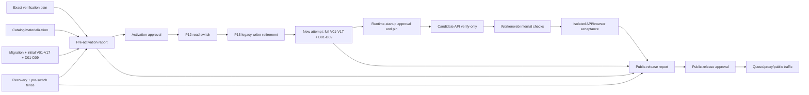

# 参数目录验证、升级与退出门禁

> English companion: [English](../../design-docs/parameter-catalog-verification-upgrade-retirement-gates.md)

日期：2026-09-01

## 状态与决策边界

本文是 [Choose verification, upgrade, and legacy-retirement gates](https://github.com/tzrea1-Q/WiseEff/issues/679) 在 [Wayfinder: replace the parameter catalog with one canonical definition model](https://github.com/tzrea1-Q/WiseEff/issues/668) 中的已接受决策产物。

本文关闭 Wayfinder map 进入实现 Spec 前所需的 release verification、API/browser acceptance、self-hosted upgrade、recovery、observability、evidence 与 legacy retirement 决策。本文不是生产代码、SQL migration、`upgrade.sh` 修改、release approval、target-host evidence，也不授权删除 legacy 数据。

规范输入是以下不可变已接受决策：

- [contract and consumer inventory](https://github.com/tzrea1-Q/WiseEff/blob/f982c76a063f3c8bc0a7366d5253243ecba2866f/docs/references/parameter-catalog-contract-inventory.md)；
- [R0-R10 legacy classification](https://github.com/tzrea1-Q/WiseEff/blob/000f617ba9810adda4798b4bc4b2bdfed95b4c39/docs/references/legacy-parameter-row-classification.md)；
- [populated PostgreSQL rehearsal fixture](https://github.com/tzrea1-Q/WiseEff/blob/6c3adfc35c0e3be6d5d381013dace9408190380e/docs/references/parameter-catalog-rehearsal-fixture.md)；
- [ADR-0040/0041/0042 integrated decision set](https://github.com/tzrea1-Q/WiseEff/tree/9fe269d4facc31b49fc1e0535d2d51ba7140644b/docs/adr)；
- 作为 DEV-only 产品证据的 [accepted single-page prototype](https://github.com/tzrea1-Q/WiseEff/tree/9c803557a55803ccca79c20eadd033f57d4729e0)；
- [Catalog Kernel interface](https://github.com/tzrea1-Q/WiseEff/blob/b5bf52cc5e6afb8ff60b043ed6207d80dcfe8fcb/docs/design-docs/catalog-kernel-interface-and-transaction-boundary.md)；
- [parameter API and legacy-ID transition](https://github.com/tzrea1-Q/WiseEff/blob/c6c08e6e6f208f88160bdbcc610eec9f8e516cc3/docs/design-docs/parameter-catalog-api-transition.md)；以及
- [populated cutover, Archive, and rollback contract](https://github.com/tzrea1-Q/WiseEff/blob/1839398b0d4fe1c77dec5c8fe8ef7835a2dc210d/docs/design-docs/parameter-catalog-cutover-archive-rollback.md)。

以上输入仍是权威合同。本文聚合其证明，不重新解释 Catalog authority、R0-R10 disposition、API ownership、P11 comparison semantics 或 rollback eligibility。

## 决策摘要

1. 一个 routes-less 的 **Release Verification** 深模块拥有 purpose-scoped verification plan、typed gate 执行、不可变 Release Verification Report、report lineage、applicability 与 approval binding。`upgrade.sh`、startup、API readiness、browser runner、后台任务和 runbook 只是 adapter 或 evidence producer；它们都不能重新编排或豁免门禁。
2. Verification 是有顺序的 report chain，而不是一份自我授权报告：`pre-activation` 授权 P12；P13 后的新 `post-retirement-runtime` attempt 授权 API verify-only startup；`isolated-candidate-acceptance` 在流量隔离时证明真实 candidate API/browser；`public-release` 聚合这些精确 report digests，且只有它能授权 queue/proxy/public traffic。
3. Pre-activation report 固定精确 artifact、target、Catalog Release、migration、cutover plan、mapping、Recovery Point、Catalog/materialization proof、migration proof、初始 V01-V17、强制 D01-D09、recovery proof 与 pre-switch writer fence。API/browser gates 对该 purpose 明确为 `not-yet-executable`，绝不标为 `passed`。
4. P13 legacy-writer retirement 创建新的 immutable attempt，并完整重跑 V01-V17 + D01-D09 P11，包括 V13/P02 writer-reachability 与 privilege negatives。不得只重跑 V13/P02，也不得把 P12 前的临时 fence 结果重用为 retirement proof。
5. Startup verify-only readiness 绑定最新 passing 且 approved 的 post-retirement-runtime report。任一失败都保持 API、worker、web、queue、proxy 与 public traffic 隔离；不得 fallback、dual read/write 或 runtime repair。
6. 只有得到该 runtime pin 后才能启动 candidate API，随后启动 worker/web，进行 isolated acceptance。API/PG/HTTP/auth/audit 与 browser-real evidence 必须使用精确 target 和真实 candidate API。任何 acceptance business mutation 都会 durable 且永久关闭 pointer-only rollback。
7. Public release 需要新的 immutable report，聚合 pre-activation、post-retirement P11、API/browser、target/recovery 与 observability evidence。只有不同 principal 的 Operator 与 Platform owner 对 `public-release` purpose 单独批准后，才能恢复 queue/proxy/public traffic。
8. V01-V17 与 P11 D01-D09 仍是强制 release-blocking checks。`unexplained-difference` 与 `unqueryable/protected-reference-missing` 均为零，11 个 consumer families 全覆盖，migration/role-negative gates 仍是额外强制检查。
9. Fresh 与 populated upgrade 使用同一个 phase controller 和 verifier。Fresh mode 证明零 legacy inventory；populated mode 在两个强制 P11 边界都证明精确 P0 counts、mappings、Archive 与完整 corpus。
10. Activation、runtime startup、isolated acceptance、public release、legacy-read sunset 与 P16 cleanup 具有独立 applicability/checklist semantics。一个 purpose 的 report/approval 不能授权另一个 purpose。
11. Pointer-only switch-back 在最早一次 candidate business write、queue business delivery 或 public traffic acceptance 时永久失效。此后只能 forward repair，或由 incident owner 批准 whole-state restore。
12. Legacy writes 在 canonical launch 时即不可达。Read compatibility 只有在至少两个 production releases、至少 90 天、每个受支持 deployment class 连续 30 天零使用以及全部 evidence gates 通过后才退出。Code/schema 删除只能发生在独立 P16 cleanup release。
13. Documentation、local synthetic、real local PostgreSQL、populated-shape、Hosted/CI、target-host、release 与 production-approval evidence 必须清晰区分。

## 规范术语

| 术语                            | 含义                                                                                                                                                                                                                                  |
| ------------------------------- | ------------------------------------------------------------------------------------------------------------------------------------------------------------------------------------------------------------------------------------- |
| **Verification Gate**           | 一个 deterministic、stable-ID 的检查，具备固定 inputs、expected result、failure code、evidence fields、severity、retry semantics、owning module 与 execution role。Gate 不得修复自己检查的状态。                                      |
| **Evidence Artifact**           | 为一次 gate attempt 提供证明的 immutable、digest-addressed、redacted 输出。它标识 target、run、release 与 producer，但不含 parameter value、DTS text、Archive payload、credential 或 person data。                                    |
| **Verification Purpose**        | 一个封闭授权动作及其 deterministic gate applicability：`pre-activation`、`post-retirement-runtime`、`isolated-candidate-acceptance`、`public-release`、`legacy-read-sunset` 或 `p16-cleanup`。Purpose 属于 report/approval identity。 |
| **Release Verification Report** | 针对一个精确 verification plan 与 phase snapshot 的 immutable purpose-scoped aggregate。`passed` 只表示所有 `required-now` gate 通过；later-purpose gate 仍是明确义务，不能标为 passed、waive 或 infer。                              |
| **Runtime Readiness**           | verify-only 的进程状态，表明运行 artifact 和 database 仍与 P13 后最新 approved `post-retirement-runtime` report 相等。它不是 release verification、migration、synchronization、repair 或 public-release approval。                    |
| **Recovery Point**              | PostgreSQL、配置的 object storage 与 durable Redis 在同一边界形成的已验证 manifest，包含 storage identity 与 restore proof。部分 cross-store snapshot 不是 Recovery Point。                                                           |
| **Legacy Retirement**           | 分阶段移除 legacy write reachability、public read compatibility，最后移除 code/schema。它绝不会因为业务历史“不再 current”而删除受保护历史。                                                                                           |

`ready` 只表示当前 runtime readiness；`verified` 表示 gate 已重新计算事实；`approved` 表示具名 principal 把精确 passing report 绑定到获授权 release act。三者绝不是同义词。

## Release Verification 模块 seam

### Interface

```text
prepareVerification(subject, purpose, evidenceRequirements) -> immutable VerificationPlan
runVerification(planDigest) -> VerificationAttemptSnapshot
assembleReport(planDigest, typedEvidenceRefs) -> ReleaseVerificationReport
approveReport(reportDigest, approvalCommand) -> ReleaseApprovalRecord
readReport(reportIdOrDigest) -> ReleaseVerificationReport
```

Interface 有意保持很小。`purpose` 选择封闭 applicability profile；caller 不能提交自定义 gate set。`runVerification` 拥有该 purpose 在精确 target 上可执行的 deterministic gates，并通过内部 adapter 调用 Catalog Kernel verification、cutover verification、P11 comparison、API acceptance、recovery-manifest inspection 与 evidence-store verification。`assembleReport` 只接受 subject、purpose、phase snapshot 与 pins 均与 plan 完全相等且经过 digest 校验的 typed evidence。它不能接受 boolean、自由文本 attestation、没有 digest 的 URL，或来自其他 purpose/target/run/release 的报告。

`approveReport` 只为报告自身 purpose 追加 approval；它绝不修改报告或扩大 applicability。P12 adapter 只接受 approved `pre-activation` report。Startup 只能调用模块后的 verify-only `readApprovedRuntimePin` projection；该 projection 只返回与当前精确 P13 state/pins 匹配的最新 approved `post-retirement-runtime` report。Queue/proxy/public traffic 只接受聚合精确 predecessor report digests 的 approved `public-release` report。Startup 不能 prepare、run、assemble、approve、synchronize、migrate 或 repair。

### Ownership

Release Verification 内部拥有：

- canonical plan serialization 与 digest；
- gate registry 及其按 `fresh`、`populated`、`restored`、`cleanup` mode 的适用性；
- deterministic gate ordering 与 complete-result enforcement；
- immutable report construction、digest verification、attempt lineage、retention class 与 approval binding；
- failure-family normalization 与 redaction；
- 检查 external evidence 是否固定到相同 artifact、target、release、mapping epoch 和 run；以及
- 技术验证唯一的 `passed` 或 `blocked` 决策。

Release Verification 外部拥有：

- Catalog compilation/materialization，由 Catalog Kernel 拥有；
- migration、R0-R10 classification、mapping、Archive、pointer change 与 recovery action，由 cutover module 拥有；
- HTTP behavior、authorization 与 audit write，由各自 module 拥有；
- Playwright execution 与 screenshot production，由 browser acceptance 拥有；
- cross-store backup/restore execution，由 recovery controller 拥有；
- release authorization，由已认证 Operator 与 Platform owner principal 拥有；以及
- 无法由 verifier 推断的 production approval 与 incident decision。

如果删除 Release Verification，`upgrade.sh`、startup、script、HTTP smoke、Playwright 与 runbook 都必须重复 pinning、applicability、evidence integrity、approval 与 retention 逻辑。这种 locality 正是该 module 成为深模块而非 pass-through report formatter 的原因。

### Gate graph



任何 edge 都不从 verifier 指向 writer。API/browser evidence 没有指向 pre-activation report 的 edge，因为真实 candidate API 尚不可合法运行。Gate 失败后，只能由 owning phase repair 或 restore；随后在新 attempt 中重跑完整 purpose-specific set。任何 predecessor report 都不会仅因存在而授权 successor。

## 固定输入与 attempt identity

每个 plan 在任何 mutating phase 之前固定以下字段：

| 输入族               | 必需的 immutable pin                                                                                                                                                                                           |
| -------------------- | -------------------------------------------------------------------------------------------------------------------------------------------------------------------------------------------------------------- |
| Application artifact | Git commit SHA、release/tag identity、package manifest digest、API/worker/web 的 OCI image manifest/config digest、platform/architecture 与 build trust fingerprint。                                          |
| Catalog              | Catalog Release ID/version/digest、predecessor pin、canonical bundle digest、compiled-model digest 与 expected materialization fingerprint。                                                                   |
| Database             | Target database identity、schema version、ordered migration filename/checksum inventory digest、applied-ledger digest 与 old-binary/new-schema compatibility declaration digest。                              |
| Cutover              | Cutover plan digest、migration contract/classifier version、source snapshot/relation fingerprint、R0-R10 count digest、expected V/D applicability 与 maintenance run ID。                                      |
| Mapping and Archive  | Mapping epoch、mapping-head digest、protected-reference inventory digest、external-reference inventory digest、Archive manifest digest 与 retention policy ID。                                                |
| Recovery             | Recovery-point ID/digest、PostgreSQL backup identity、object-store endpoint/bucket/prefix identity、durable Redis identity、manifest/checksum digest 与 verified-at/maximum-age policy。                       |
| Acceptance           | OpenAPI/route-manifest digest、API contract version、browser bundle/source SHA、expected viewport matrix 与 mock/API parity contract digest。                                                                  |
| Target               | Deployment ID/class、environment identity、host identity fingerprint、Compose project、named-volume identity set、bucket identity、public/internal URL、OIDC issuer/audience identity 与 observation window。  |
| Verification         | Verification contract version、gate-registry digest、verifier artifact/image digest、verifier database role identity 与 evidence-store policy。                                                                |
| Purpose and lineage  | Verification purpose、精确 phase/checkpoint snapshot、predecessor report ID/digest、P12/P13 state、writer-retirement fingerprint、runtime-pin generation、pointer-rollback status 与 traffic-isolation state。 |

Plan 拥有 opaque `verification_plan_id` 和 canonical JSON 的 SHA-256 digest。每次执行拥有 opaque `verification_attempt_id`。每份报告拥有 opaque `verification_report_id`，以及不含 signature 的 canonical report bytes 的 SHA-256 digest。Purpose 与 phase snapshot 属于每个 digest。Approval 是针对该 digest 与 purpose 的 append-only record。

### Rerun semantics

- 相同 plan、相同 state：允许新 attempt。它产生新 attempt ID 与 timestamp；deterministic result/checksum 必须等于前次 attempt，否则以 `PCAT-REPORT-NONDETERMINISTIC` 阻塞。
- 相同 plan、经过 owning repair：重跑完整受影响 proof group。P11 始终把 D01-D09 作为一个整体重跑，不能抑制单个失败 case。
- P12 或 P13 即使不改变 artifact/target pins，也会改变 phase snapshot。P13 始终要求新的 `post-retirement-runtime` attempt，完整重跑 V01-V17 与 D01-D09，包括 V13/P02；pre-activation attempt 不得 promote、relabel 或重用为 runtime pin。
- 启动 candidate API 会创建 `isolated-candidate-acceptance` purpose。API/browser evidence 只在该 purpose 产生，并由后续 `public-release` report 聚合；绝不回填或重写 pre-activation report。
- Artifact、release、migration inventory、plan、mapping epoch、recovery point、target identity、gate registry 或 evidence requirement 任一变化：创建新 plan，禁止重用旧报告。
- Response 丢失：按 plan 和 attempt ID 检查 immutable attempt/report store。完整且 digest-valid 的结果可以重用；不完整 attempt 追加为 interrupted 后重跑。不得覆盖 row。
- Database commit outcome 未知：cutover owner 独立检查 pointer、head、phase checkpoint、run ownership 与 audit evidence。只有能证明一个精确 committed 或 uncommitted outcome 时才允许 resume；否则进入 `recovery-required`。

## 报告、批准、访问与保留

### Report contract

每份报告包含：

- 所有固定 plan pins 及其 digest；
- verification purpose、phase/checkpoint snapshot、predecessor report digests 与封闭 applicability profile；
- purpose profile 中每个 stable gate ID 恰好一次，状态为 `passed`、`failed`、`not-yet-executable` 或由 mode 证明的 `not-applicable`；
- deterministic expected/observed value、stable failure code、evidence digest/URI、producer artifact、role、开始/结束时间与 retry lineage；
- 当前 purpose 适用的 Catalog Kernel、V01-V17、辅助 database、D01-D09、API、browser、recovery、target 与 observability evidence digest；缺失 later-purpose digest 是明确义务，绝不是 passing value；
- consumer-family coverage checksum 与 protected-reference coverage checksum；
- writer-reachability result、runtime readiness pin 与 pointer-only rollback status；
- redaction policy/version、evidence retention deadline 公式输入；以及
- aggregate report digest。

报告只有针对具名 purpose，全部 `required-now` evidence 存在且每个 blocking gate 通过时才为 `passed`。`not-yet-executable` 只允许 registry 指定一个必须产生该 evidence 的 successor purpose；它不能授权 successor。`not-applicable` 只允许 gate registry 具备 deterministic mode predicate 且报告包含该 predicate 的证明。人工 waiver 不是 predicate。

### Purpose-specific report applicability

| Purpose                         | 创建时点                                 | Required-now evidence                                                                                                                                                                    | 明确的 later obligation                                   | Passing 且 approved report 授权的动作                                            |
| ------------------------------- | ---------------------------------------- | ---------------------------------------------------------------------------------------------------------------------------------------------------------------------------------------- | --------------------------------------------------------- | -------------------------------------------------------------------------------- |
| `pre-activation`                | Cutover P11 后、P12 前                   | Exact pins；Catalog/materialization；migration；初始 V01-V17；mandatory D01-D09 的两个 zero thresholds 与 11-family coverage；Recovery Point/recovery；pre-switch writer fence           | API/HTTP/browser/runtime evidence 为 `not-yet-executable` | 仅 P12 application read switch                                                   |
| `post-retirement-runtime`       | P12 与 P13 后的新 immutable attempt      | 完整重跑 V01-V17 + D01-D09，包括 V13/P02 与永久 writer retirement；精确 current pointer/fingerprint；startup pin                                                                         | API/browser acceptance 仍为 `not-yet-executable`          | Candidate API verify-only startup，然后在隔离状态启动 worker/web internal checks |
| `isolated-candidate-acceptance` | Approved post-retirement runtime pin 后  | Exact-target API contract/real-PG/HTTP/auth/audit gates；全部三个 viewport 的 real-candidate browser gates；internal observability；mutation/rollback-closure record                     | Public-release approval 仍不存在                          | 不授权 traffic；它是 public-release report 的技术 evidence                       |
| `public-release`                | Isolated acceptance 完成后               | Pre-activation、post-retirement-runtime、isolated-candidate-acceptance report 的精确 digests，加上当前 target/recovery/observability evidence 与 rollback status                         | Sunset 与 cleanup evidence 仍是 later purposes            | Queue resume、proxy activation 与 public traffic                                 |
| `legacy-read-sunset`            | 最短 compatibility/telemetry interval 后 | 当前 public-release lineage、两个 releases 与 90 天、每个 deployment class 连续 30 天零使用、consumer/reference disposition、recovery 与 approval evidence                               | P16 code/schema deletion 仍是独立 purpose                 | R-L2 eligible legacy public reads 返回 410                                       |
| `p16-cleanup`                   | 独立 cleanup release                     | 完整 canonical/fresh/populated/API/browser/observability/rollback gates、自己的 Recovery Point 与 real target restore rehearsal、zero writer/read/dependency、retention/legal-hold proof | 无；protected history 继续保留                            | 仅获明确批准的 R-L3 code/schema/role/grant/trigger/table/view removal            |

### Run、approve 与 read authority

| Actor                                                | 允许                                                                                                             | 禁止                                                                                                |
| ---------------------------------------------------- | ---------------------------------------------------------------------------------------------------------------- | --------------------------------------------------------------------------------------------------- |
| Deployment Operator                                  | 为获授权 target prepare/run plan、附加 typed target evidence、读取完整 redacted report、添加 Operator sign-off。 | 编辑结果、豁免 gate、以 writer credential 充当 verifier，或以 Platform owner 身份批准。             |
| Independent verifier identity                        | 执行已登记 deterministic gates 并为 evidence 签名。                                                              | 任何 production write、approval、repair、migration、role assumption 或 Archive payload decryption。 |
| Platform owner                                       | 读取 report/evidence summary，添加 release 或 retirement approval。                                              | 修改 gate output，或以 product approval 替代技术 proof。                                            |
| 没有 deployment-operator authority 的 Platform Admin | 在 policy 允许处读取安全的 cross-Organization support summary。                                                  | 读取 raw migration diagnostics 或操作 release。                                                     |
| Auditor/security reviewer                            | 依 retention policy 读取 immutable report、approval、audit linkage 与 redacted evidence。                        | 执行 writer 或修改 evidence。                                                                       |
| Ordinary user 或 Agent                               | 没有 report endpoint。Catalog `ready` 只通过安全 Catalog document/readiness projection 暴露。                    | Diagnostics、evidence、approval 或 report enumeration。                                             |

Operator 与 Platform owner approval 必须来自不同 authenticated principal。Independent verifier signature 证明 artifact execution；它不是任一 human approval。P12 activation、runtime startup、public release、legacy-read sunset 与 P16 cleanup 分别把独立 approval purpose 绑定到自己的精确 report digest。Isolated-candidate-acceptance report 只是技术 evidence，不授权 traffic。旧 approval 不能复制前移；successor report 可以引用 predecessor digest，但绝不能把 predecessor evidence 描述为新执行。

### Retention formula

Passing launch、restore、sunset、cleanup report 及其 approvals、V/D report、migration inventory、mapping/Archive manifest reference 与 recovery rehearsal evidence，保留到以下最晚时间：

1. repository/platform audit 与 legal-hold policy；
2. 最长 protected-reference、Archive、mapping、business 或 legal retention；
3. cleanup release 被接受后一年；
4. 最后一个受支持 restore point 或 old-binary compatibility window 结束后一年；以及
5. public legacy-read window 结束，包括至少两个 production releases、90 天和最终连续 30 天零使用区间。

Failed/interrupted attempt report 与 redacted diagnostics 至少保留一年；关联 incident、release refusal 或 legal hold 时更久。Raw dump、Archive payload、parameter value、DTS text、credential 与 person data 永远不复制到 report store。其受保护存储独立保留；报告只携带 typed ID、safe count、digest 与 authorized reference。

## Database release gates

所有 database gate 由 cutover verifier 使用专用 one-shot PostgreSQL login 执行。该 login 以 `READ ONLY` 启动，验证 `transaction_read_only=on`，没有 `SET ROLE`、sequence use、DDL、可写 function execution、temporary writer function、Catalog synchronizer membership、migration owner membership、application writer grant 或 Archive decryption credential。它只可 `SELECT` 检查 constraint/grant 所需的 allow-listed Catalog/cutover/mapping/Archive metadata/audit projection 与 PostgreSQL catalog view。

每个 V gate 都是 release-blocking。完整 V01-V17 + D01-D09 set 在 temporary pre-switch fences 下为 pre-activation 运行一次，并在 P13 permanent writer retirement 后的新 attempt 中再次运行。两份报告都标识自己的 phase snapshot；第一次执行不能满足第二次。Retry 表示 owning module 在输入不变时 repair，随后完整重跑 proof group；verifier 自身绝不 repair。

| Gate ID       | Deterministic query/check 与必需结果                                                                                                                                                                                   | Stable failure code                            | Evidence fields                                                        | Retry                                                       | Owner / role                              |
| ------------- | ---------------------------------------------------------------------------------------------------------------------------------------------------------------------------------------------------------------------- | ---------------------------------------------- | ---------------------------------------------------------------------- | ----------------------------------------------------------- | ----------------------------------------- |
| `PCAT-DB-V01` | 在 current release 下按 `(subject_id, property_key)` 聚合 current Definitions；duplicate group = `0`。                                                                                                                 | `PCAT-VRF-V01-DUPLICATE-CURRENT-DEFINITION`    | release pin、group count、ordered offending-ID checksum                | Same-plan repair + full V rerun                             | Catalog Kernel / verifier                 |
| `PCAT-DB-V02` | 每个 Definition 连接 owned revisions 与 current pointer；cardinality 非一或 owner 错误的 row = `0`。                                                                                                                   | `PCAT-VRF-V02-CURRENT-REVISION-CARDINALITY`    | definition/revision counts、violation checksum                         | Same-plan repair + full V rerun                             | Catalog Kernel / verifier                 |
| `PCAT-DB-V03` | 汇总 subjects、registrations、placements、Bindings、ProjectValues、Observations、mappings 与 Archive metadata 的 owner/Organization anti-join；violation = `0`。                                                       | `PCAT-VRF-V03-OWNER-SCOPE-MISMATCH`            | per-relation counts 与 ordered checksum                                | Owned cutover repair                                        | Cutover / verifier                        |
| `PCAT-DB-V04` | 每个 current match、new registration 与 operational Binding anti-join 到唯一 active current-release membership；violation = `0`。                                                                                      | `PCAT-VRF-V04-SUBJECT-MEMBERSHIP-MISSING`      | subject/membership/referencing-family counts                           | Owned cutover 或 release repair                             | Catalog Kernel + cutover / verifier       |
| `PCAT-DB-V05` | 每个 active/retired Registration 均有 non-null current placement、恰好一个 retained placement、same-Organization ownership 与 kind-correct parent；violation = `0`。                                                   | `PCAT-VRF-V05-PLACEMENT-CARDINALITY`           | status/kind buckets、violation checksum                                | Registration/placement repair                               | Registration / verifier                   |
| `PCAT-DB-V06` | 验证每个 operational Binding 的 Registration、Subject、Definition、`effective_revision_id`、project/logical-node ownership 与 release pin；violation = `0`。                                                           | `PCAT-VRF-V06-BINDING-DEFINITION-MISMATCH`     | binding count、mismatch buckets/checksum                               | Binding cutover repair                                      | Binding / verifier                        |
| `PCAT-DB-V07` | 验证 current/historical ProjectValue ownership、Binding、exact DefinitionRevision、configuration/source ownership 与 explicit current tip；violation = `0`。                                                           | `PCAT-VRF-V07-PROJECT-VALUE-REVISION-MISMATCH` | current/history counts、pin checksum                                   | Binding/history repair                                      | Project value / verifier                  |
| `PCAT-DB-V08` | 每个 protected legacy ID 与 declared external reference 都恰好对应一个 current mapping head，结果为 operational、blocked 或 Archive；unmapped = `0`。                                                                  | `PCAT-VRF-V08-PROTECTED-ID-UNMAPPED`           | consumer-family counts、external inventory digest、missing-ID checksum | Mapping repair；complete rerun                              | Mapping / verifier                        |
| `PCAT-DB-V09` | 比较 P0 source identity manifest 与 blocker 加 primary R0-R10 disposition ledger；精确守恒，无丢失、无重复 primary disposition。                                                                                       | `PCAT-VRF-V09-SOURCE-CONSERVATION`             | P0/class/disposition totals 与 ordered checksum                        | 只可在相同 classifier/plan 下 reclassify，否则新 plan       | Cutover / verifier                        |
| `PCAT-DB-V10` | 查询每个 R6/R8 same-key cohort；要求不同 source/target identity、allowed non-Definition disposition，且未推断 subject；violation = `0`。                                                                               | `PCAT-VRF-V10-R6-R8-IDENTITY-MERGE`            | cohort count、source/target-kind checksum                              | Owned mapping repair；full P11 rerun                        | Classification/mapping / verifier         |
| `PCAT-DB-V11` | 重算 Archive record、source-row、relation-graph、encrypted-object reference 与 protected-reference checksum；mismatch/missing object = `0`。                                                                           | `PCAT-VRF-V11-ARCHIVE-INTEGRITY`               | archive/object counts、checksum algorithm/profile、mismatch checksum   | 只可在 activation 前由不变 source rebuild；否则 recovery    | Archive / verifier + evidence reader      |
| `PCAT-DB-V12` | 重新编译 packaged Catalog Release，并比较 ID/digest、normalized model、membership、alias、tombstone、Definition heads、release-head provenance、database/runtime fingerprint 与 readiness digest；必须精确相等。       | `PCAT-VRF-V12-CATALOG-MATERIALIZATION-DRIFT`   | artifact/release/fingerprint pins、per-family checks                   | 仅在合法 phase 内由 Catalog Kernel reinstall                | Catalog Kernel / verifier                 |
| `PCAT-DB-V13` | 枚举可写 legacy structure 的 HTTP、Agent、review、script、job、trigger、function、grant、role 与 background path；reachable writers = `0`。                                                                            | `PCAT-VRF-V13-LEGACY-WRITER-REACHABLE`         | route/job/script inventory digests、grant/trigger/function counts      | Retire writer 后 full V/P11 rerun                           | Cutover/security / verifier               |
| `PCAT-DB-V14` | 每个 protected Binding/value current pointer 与 historical revision/value 必须恰好映射一次或具有 approved Archive outcome；精确守恒。                                                                                  | `PCAT-VRF-V14-BINDING-TIP-CONSERVATION`        | current/history/source/target counts 与 checksum                       | Binding/history repair                                      | Binding / verifier                        |
| `PCAT-DB-V15` | Protected mutation/history 连接到 audit principal、trusted initiator、trace、mapping version 与 target/Archive；精确连续且无 orphan。                                                                                  | `PCAT-VRF-V15-AUDIT-CONTINUITY`                | audit-kind counts、provenance buckets、orphan checksum                 | 只有 policy 允许时 forward audit repair；否则 block/restore | Audit / verifier                          |
| `PCAT-DB-V16` | Organization-owned Catalog release、subject、alias、Definition、revision、cache key 或 structural writer projection 总数 = `0`。                                                                                       | `PCAT-VRF-V16-ORGANIZATION-STRUCTURAL-CATALOG` | per-relation/cache/path count 与 checksum                              | 通过 cutover remove/archive                                 | Catalog/cutover / verifier                |
| `PCAT-DB-V17` | 应用 mode contract：fresh 精确零 legacy map/Archive/registration，除非 explicit seed manifest；populated 精确匹配 P0 class/count/mapping/Archive manifest。两者都要求精确 migration inventory 与 artifact/target pin。 | `PCAT-VRF-V17-MODE-RESULT-MISMATCH`            | mode、seed/P0 digest、exact counts、migration digest                   | 仅输入不变时 same plan；否则新 plan                         | Release Verification + cutover / verifier |

### 额外强制 migration 与 privilege gates

| Gate ID       | 必需结果                                                                                                                                      | Stable failure code                     | Evidence                                                 | Retry/owner                                                                   |
| ------------- | --------------------------------------------------------------------------------------------------------------------------------------------- | --------------------------------------- | -------------------------------------------------------- | ----------------------------------------------------------------------------- |
| `PCAT-DB-M01` | Ordered packaged migration filename/checksum inventory 等于 release manifest；无 duplicate 或 alias collision。                               | `PCAT-MIG-PACKAGE-INVENTORY-DRIFT`      | package inventory 与 digest                              | 新 artifact 或 approved unchanged-plan repair / migration owner               |
| `PCAT-DB-M02` | 每个 applied migration 都有 checksum 相同的 packaged historical file；missing applied file = `0`。                                            | `PCAT-MIG-APPLIED-FILE-MISSING`         | applied/package anti-join checksum                       | Block；绝不虚构 file / migration owner                                        |
| `PCAT-DB-M03` | 每个 unapplied file 都是 declared ordered suffix；historical rename/alias 使用一个 explicit append-only alias ledger；ambiguous alias = `0`。 | `PCAT-MIG-HISTORICAL-ALIAS-INVALID`     | suffix 与 alias-ledger digest                            | 新 artifact/plan / migration owner                                            |
| `PCAT-DB-M04` | Dedicated one-shot migration 结束于精确 target ledger 与 schema fingerprint；API startup 没有执行 migration。                                 | `PCAT-SCHEMA-MIGRATION-RESULT-MISMATCH` | before/after ledger、schema fingerprint、runner identity | Same-run deterministic classification；unknown -> recovery-required / cutover |
| `PCAT-DB-P01` | 每个 production role 直接对 immutable Catalog row 执行 INSERT/UPDATE/DELETE 均失败，且不能 assume synchronizer/migration owner。              | `PCAT-PRIV-CATALOG-IMMUTABILITY-BYPASS` | role/action negative matrix 与 SQLSTATE checksum         | Startup 前 repair grant / security                                            |
| `PCAT-DB-P02` | 每个 production role 的 legacy structural write 均失败；old trigger/function 不能通过 definer rights 写入。                                   | `PCAT-PRIV-LEGACY-WRITER-BYPASS`        | role/function/trigger negative matrix                    | Startup 前 retirement repair / security                                       |

Local schema mock 不能满足这些 gate。V02-V07、V11-V17、M01-M04、P01 与 P02 需要 real PostgreSQL；target release approval 需要它们在 plan 标识的精确 target 或 isolated same-target restore/candidate environment 上执行。

## 强制 P11 D01-D09 semantic comparison

Comparison report 是 immutable subordinate Evidence Artifact。它使用 issue #678 固定的四个 result class：`exact-equivalent`、`declared-expected-difference`、`unexplained-difference` 与 `unqueryable/protected-reference-missing`。

| Gate ID        | 必需 deterministic coverage                                                                                                                 | Blocking failure code                       | Required evidence                                              |
| -------------- | ------------------------------------------------------------------------------------------------------------------------------------------- | ------------------------------------------- | -------------------------------------------------------------- |
| `PCAT-CMP-D01` | 每个 protected Definitions list partition/detail：membership、lifecycle、owner、property key、current/pinned revision、typed gone outcome。 | `PCAT-CMP-D01-DEFINITION-SEMANTICS`         | case/count/checksum 与 catalog/frontend coverage               |
| `PCAT-CMP-D02` | 每个 subject/Definition reference：Driver/NodeType kind、selector、identity、R class、mapping outcome。                                     | `PCAT-CMP-D02-SUBJECT-IDENTITY`             | source/mapping/release pins 与 topology/module coverage        |
| `PCAT-CMP-D03` | Registration/Placement 的 registered/unregistered/retired state、exactly-one placement、ownership/kind、结构副本的有意移除。                | `PCAT-CMP-D03-REGISTRATION-PLACEMENT`       | state/kind buckets 与 catalog/module coverage                  |
| `PCAT-CMP-D04` | Binding identity、logical/source ownership、effective revision/current tip、ordered history、non-operational disposition。                  | `PCAT-CMP-D04-BINDING-HISTORY`              | binding/history checksum 与 topology/workbench coverage        |
| `PCAT-CMP-D05` | Current/historical ProjectValue identity、exact revision pin、safe shape/units/policy interpretation、Agent/log citation target。           | `PCAT-CMP-D05-PROJECT-VALUE-PIN`            | redacted semantic checksum 与 workbench/Agent/log coverage     |
| `PCAT-CMP-D06` | 每个 R3/R6/R7/R8/R10 source 都有唯一 ReviewEvidence、Proposal、independently proven Observation 或 Archive outcome。                        | `PCAT-CMP-D06-REVIEW-PROPOSAL-OBSERVATION`  | R/disposition/mapping evidence 与 governance/topology coverage |
| `PCAT-CMP-D07` | 每个 debug、reload、knowledge、import/export reference 都 pin-first 解析到 Binding/Definition/Revision/map/Archive。                        | `PCAT-CMP-D07-PROTECTED-CONSUMER-REFERENCE` | per-consumer counts/checksum                                   |
| `PCAT-CMP-D08` | File/source occurrence、locator、config revision、Binding、revision pin 与 raw-format provenance 保持精确。                                 | `PCAT-CMP-D08-SOURCE-WRITEBACK`             | source/locator/config checksum 与 file-sync coverage           |
| `PCAT-CMP-D09` | 每个 typed legacy ID/deep link/operator result 都有精确 redirect/gone/conflict/not-found/readiness semantics，且不泄露 Archive。            | `PCAT-CMP-D09-LEGACY-OPERATOR-OUTCOME`      | type/status/reason buckets 与 API/operations coverage          |

报告还会因以下原因失败：

- 任一已接受 inventory consumer family 或 protected reference 没有 case：`PCAT-CMP-CORPUS-COVERAGE`；
- unexplained count 非零：`PCAT-CMP-UNEXPLAINED-DIFFERENCE`；
- unqueryable/protected count 非零：`PCAT-CMP-UNQUERYABLE-PROTECTED-REFERENCE`；
- declared difference 缺少恰好一个 R class、mapping head、typed target/Archive、rule ID 与 plan pin：`PCAT-CMP-EXPECTED-DIFFERENCE-EVIDENCE`；或
- corpus、ordered semantic、result-count 或 aggregate digest 不同：`PCAT-CMP-REPORT-INTEGRITY`。

对于 fresh database，P11 phase 与 D01-D09 registry entries 仍然执行。`PCAT-DB-V17` 与 protected-reference inventory 必须证明零 legacy sources 和 external references；随后每个 D gate 记录由 mode 证明的 zero-case result。这不是 optional skip。Populated path 必须提供非抽样完整 corpus coverage。

Comparison report 与 parent report 一起批准和保留。Target-host/release execution 必须在精确 target candidate 上重跑 P11；local 或 CI comparison 可以证明 implementation，但不能作为 target release proof 附加。

### 已接受 inventory consumer coverage

| Issue #669 consumer family             | Mandatory gates                                                                                |
| -------------------------------------- | ---------------------------------------------------------------------------------------------- |
| Catalog/governance HTTP and frontend   | D01、D03、D06、D09；`PCAT-API-01` 到 `PCAT-API-10`；`PCAT-UI-01` 到 `PCAT-UI-11`               |
| Parameter topology                     | D02、D04、D06；V03-V07；`PCAT-API-12`                                                          |
| Project parameter workbench and drafts | D04、D05、D07；V06-V07、V14-V15；`PCAT-API-12`                                                 |
| File sync/writeback                    | D08；V06-V07、V14；`PCAT-API-12`                                                               |
| Agent tools                            | D05、D07；V15；`PCAT-API-09`；`PCAT-UI-12`                                                     |
| Log analysis                           | D05、D07；V03、V07、V15                                                                        |
| Debugging                              | D07；V06-V07、V14-V15                                                                          |
| DTS reload                             | D07、D08；V06-V07、V14-V15                                                                     |
| Knowledge                              | D07；V08、V14-V15                                                                              |
| Module registry                        | D02、D03；V03-V06、V16                                                                         |
| Release and operations                 | D09；V01-V17；M01-M04；P01-P02；report、readiness、recovery、observability 与 retirement gates |

Corpus manifest 恰好记录每个 family 一次，并把每个 protected reference 放入一个或多个 case。只有使用 D01-D09 相同的 fresh-mode zero-inventory proof 时，family row 才可证明没有适用 protected source；不能直接省略。

## API acceptance gate

API evidence 对 pre-activation 与 post-retirement-runtime purpose 都是 `not-yet-executable`。只有 approved post-retirement runtime pin 在 queue、proxy 与 public traffic 隔离时启动精确 candidate API 后，才能运行 API evidence。全部 API evidence 绑定 exact candidate image、OpenAPI/route-manifest digest、最新 post-retirement verifier/comparison reports、Catalog Release pin、target identity 与 authentication mode。`contract` 表示 schema/route/DTO behavior；`PG` 表示 real PostgreSQL；`HTTP` 表示运行 candidate direct smoke；`auth-` 表示 negative authorization/scope checks；`audit` 表示 persisted trusted audit assertions。

| Gate ID       | Contract surface                                                                                                                                                               | contract        | PG  | HTTP | auth-              | audit                                    |
| ------------- | ------------------------------------------------------------------------------------------------------------------------------------------------------------------------------ | --------------- | --- | ---- | ------------------ | ---------------------------------------- |
| `PCAT-API-01` | `GET /api/v2/catalog` 返回 verify-backed `ready`、release header 与精确 current digest/fingerprint；mismatch 是 503 `catalog-not-ready`。                                      | Yes             | Yes | Yes  | Yes                | No                                       |
| `PCAT-API-02` | Global/scoped Subject/Definition lists/details 使用 opaque IDs、deterministic pages、active/retired filters、unregistered projection 与 scope hiding。                         | Yes             | Yes | Yes  | Yes                | No                                       |
| `PCAT-API-03` | Current/pinned release、exact DefinitionRevision、complete revision list 与 composed timeline 永不替换为 current/latest，也不泄露 raw migration rows。                         | Yes             | Yes | Yes  | Yes                | Audit read linkage                       |
| `PCAT-API-04` | Registration/Placement projection 与 explicit `PlacementIntent`；Registration + exactly one Placement + audit 原子提交。                                                       | Yes             | Yes | Yes  | Yes                | Yes                                      |
| `PCAT-API-05` | Review Queue read/detail/resolution 保留 unknown/ambiguous outcomes 与 explicit placement choice；无 partial write。                                                           | Yes             | Yes | Yes  | Yes                | Yes                                      |
| `PCAT-API-06` | DefinitionProposal create/submit/withdraw/accept/reject；Org/Platform separation 与 self-approval prohibition。                                                                | Yes             | Yes | Yes  | Yes                | Yes                                      |
| `PCAT-API-07` | Typed R4/R5 mapping、R6 ReviewEvidence、R8 Proposal、Archive 410、ambiguous 409、unknown/scope-hidden 404；无 property-key inference。                                         | Yes             | Yes | Yes  | Yes                | Operator lookup audit                    |
| `PCAT-API-08` | 所有 legacy structural/overlay/promotion writes 立即 410；eligible reads 携带精确 deprecation/sunset/successor headers。                                                       | Yes             | Yes | Yes  | Yes                | Policy 要求处记录 mutation refusal audit |
| `PCAT-API-09` | Agent 只读；Ordinary user、Org Admin、Platform Admin、Operator、System/synchronizer capability 匹配 issue #677；body/header role spoofing 失败。                               | Yes             | Yes | Yes  | Yes                | Yes                                      |
| `PCAT-API-10` | `release-drift`、ETag/`If-Match`、`Idempotency-Key`：exact replay 返回存储结果；changed fingerprint 冲突；stale state 要求重新确认。                                           | Yes             | Yes | Yes  | Yes                | Yes                                      |
| `PCAT-API-11` | 九个 Catalog read routes 使用 typed Kernel snapshot facet；无 raw Catalog table join、handler-side sort/filter/head choice、cache/YAML fallback 或 property-key fallback。     | Static contract | Yes | Yes  | Scope-hidden tests | No                                       |
| `PCAT-API-12` | Project Binding/value/history/draft paths 暴露 canonical `definitionId`、`effectiveRevisionId`、`currentValueId`；无 `parameterSpecId` 或 Effective/Governance peer contract。 | Yes             | Yes | Yes  | Yes                | Mutation audit                           |

所有 row 都会阻塞 isolated candidate acceptance 与 public release。Contract success 没有 real PostgreSQL 时不能证明 transaction、constraint、role 或 audit。HTTP smoke 没有 browser-real evidence 时不能证明单页体验。任何测试若创建 Registration、Placement、Binding、ProjectValue、Proposal、Observation、Review resolution 或其他 business mutation，必须记录 first-mutation evidence，并永久关闭 pointer-only rollback；删除测试 row 不能重新打开它。

## Browser-real acceptance gate

Browser release acceptance 只有在 approved post-retirement runtime pin 后才针对真实 candidate API 运行，此时 queue、proxy 与 public traffic 仍保持隔离。Mock mode 以独立 parity gate 运行相同 application-port state matrix；mock screenshot 或 mock authorization 永远不能满足 release browser evidence。Pre-activation 与 post-retirement-runtime report 中的 browser evidence 是 absent，不是 passed。

| Gate ID      | 必需 browser behavior                                                                                                                                                        |
| ------------ | ---------------------------------------------------------------------------------------------------------------------------------------------------------------------------- |
| `PCAT-UI-01` | 恰好一个 Parameter definitions navigation/page；不再存在 Effective definitions 或 Governance history peer entry。                                                            |
| `PCAT-UI-02` | Definition list/search/filter/paging 与 opaque-ID URL selection 保留 Catalog release anchor。                                                                                |
| `PCAT-UI-03` | Definition detail 展示 formal Subject、current/pinned revision、safe usage、Registration/Placement context；不展示 raw Catalog join fields。                                 |
| `PCAT-UI-04` | Same-page Review Queue 支持 explicit evidence/result states 与允许的 Org Admin resolution，且不制造 Definition。                                                             |
| `PCAT-UI-05` | Detail timeline 以 deterministic order 组合 Catalog revision/publication 与授权 History/Audit events。                                                                       |
| `PCAT-UI-06` | `ready` state 只启用获授权 action。                                                                                                                                          |
| `PCAT-UI-07` | `unregistered` state 保持可读，只向 Org Admin 提供 explicit registration。                                                                                                   |
| `PCAT-UI-08` | `empty`、`loading`、`error` 清晰区分；loading 保持 layout，但不启用 stale write。                                                                                            |
| `PCAT-UI-09` | Retired/deprecated subject、Definition、Registration 保持历史可读，并禁用被禁止的新 action。                                                                                 |
| `PCAT-UI-10` | Release drift、ETag conflict、invalid placement、idempotency conflict 保留用户输入，刷新 evidence，并要求重新确认。                                                          |
| `PCAT-UI-11` | Legacy deep link 证明精确 redirect、gone、conflict、not-found/scope-hidden outcome。                                                                                         |
| `PCAT-UI-12` | Agent surface 可读取允许的 Catalog facts，不暴露 catalog mutation action。                                                                                                   |
| `PCAT-UI-13` | API/mock adapter 产生相同 ready/unregistered/empty/loading/error/retired/conflict domain states；mock 没有额外 governance power。                                            |
| `PCAT-UI-14` | Desktop `1440x900`、tablet `768x1024`、mobile `390x844` 无 overlap、overflow、隐藏 action、遮挡 dialog/drawer 或混乱 hierarchy。                                             |
| `PCAT-UI-15` | Real interactions 覆盖 navigation、search/filter、list/detail、timeline、queue、registration placement choice、授权 proposal/review action、conflict refresh 与 deep links。 |

每个相关 state 与 viewport 的 evidence bundle 包含 Playwright snapshot、screenshot、console-error output、WiseEff request-failure/critical-response check、相关 network request/response summary、tested interaction record、browser/runtime version 与 outcome。Unexpected console error、page error、request failure 或 critical WiseEff `4xx/5xx` 会让 gate 失败，除非 case 明确断言该精确 negative response。

Immutable browser bundle 固定 source commit、frontend/API image digest、OpenAPI digest、URL/target identity、Catalog Release digest/fingerprint、database verifier/comparison report digest、authentication mode、browser/OS、viewport、test manifest、screenshot/snapshot/trace checksum 与 redaction result。Mutable shared directory 或 unpinned screenshot 不是 release evidence。

## Fresh 与 populated self-hosted upgrade gate

必需顺序为：

```text
plan
-> build
-> quiesce
-> verified recovery point
-> data plane only
-> one-shot schema migration
-> one-shot Catalog synchronization
-> one-shot populated cutover (fresh proves zero work)
-> initial independent V01-V17 + D01-D09 verification
-> pre-activation report and activation-purpose approval
-> P12 application read switch bound to the pre-activation report
-> P13 / R-L0 legacy writer retirement
-> new attempt: complete V01-V17 + D01-D09 rerun, including V13/P02
-> post-retirement-runtime report, approval, and latest runtime pin
-> API verify-only startup bound to that runtime pin
-> worker/web internal checks
-> isolated exact-target API/browser acceptance
-> public-release report and purpose-specific approval
-> queue resume, proxy activation, and public traffic
-> observation
-> later cleanup
```

以上顺序保留 issue #678：P13 retirement 后是新的完整 P11 attempt，而不是只重跑 V13/P02。API 永远不是 migration runner。Startup 永远不 synchronize、classify、map、repair、choose head，也不 fallback 到 legacy/cache/empty state；它拒绝把 pre-activation report 用作 runtime pin。如果 packaged release digest、post-retirement database/comparison digests、runtime fingerprint、writer-retirement fingerprint 或 approved post-retirement report pin 不同，API 退出或保持 not-ready，并给出 `PCAT-UPG-CANDIDATE-DIGEST-MISMATCH`。

### Mode-specific requirements

| Mode                     | Required proof                                                                                                                                                                                                                                                                                                                                  |
| ------------------------ | ----------------------------------------------------------------------------------------------------------------------------------------------------------------------------------------------------------------------------------------------------------------------------------------------------------------------------------------------- |
| Fresh                    | Empty preflight；exact migration suffix；安装 packaged Catalog Release；除 explicit seed manifest 外，legacy identity/mapping/Archive/registration 全为零；在 initial 与 post-P13 P11 attempts 都运行 D01-D09 zero-corpus proof；V01-V17、role negative、API、browser、recovery、startup digest gates。不得依赖 legacy seed 或 reconciliation。 |
| Populated                | 精确 P0 R0-R10/protected-reference/source fingerprint；完整 mappings/Archive/registration/placement/Binding/history；在 initial 与 post-P13 full P11 attempts 都运行覆盖每个 inventory family 的完整 D01-D09 corpus；精确 P0-to-V17 counts；无 R6/R8 merge；writer fences；target restore rehearsal 与 observation。                            |
| Restored legacy boundary | Recovery manifest equality、old migration/artifact compatibility、legacy projection verifier、禁止重用 candidate checkpoint、安全 old-stack API/traffic proof。                                                                                                                                                                                 |
| P16 cleanup              | 当前 canonical gates 通过；legacy use/reachability/dependency 为零；独立 cleanup recovery point/restore rehearsal；没有受支持 recovery path 依赖已移除 schema/code。                                                                                                                                                                            |

### Upgrade journal additions

Append-only journal 记录 purpose、plan/attempt/report ID/digest、predecessor-report lineage 与 approval purpose；artifact/image/config identity；target/host/Compose/volume/bucket identity；migration inventory/schema fingerprint；Catalog Release/materialization fingerprint；source/P0/classifier/plan/recovery-point digest；mapping epoch/head/Archive manifest digest；独立的 pre-activation 与 post-retirement V/D report digest/counts；consumer coverage；P13 writer-retirement fingerprint；latest runtime-pin generation；API/browser/recovery evidence digest；public-release aggregate digest；queue/proxy state；first candidate business write、first queue business delivery、first public traffic timestamp；pointer-only rollback closure time/reason；approvals；phase events；isolation result；以及既有 bounded/redacted failure fields 与唯一 executable `next_action`。

### Legal action by phase

| Action                               | Legal states 与 input rule                                                                                                                                                                                                      | Refusal                                                                                                                                                            |
| ------------------------------------ | ------------------------------------------------------------------------------------------------------------------------------------------------------------------------------------------------------------------------------- | ------------------------------------------------------------------------------------------------------------------------------------------------------------------ |
| `plan`                               | Online/read-only；可重复。任何 input 或 purpose change 都创建新 plan digest。                                                                                                                                                   | 不能为不同 purpose 重用 prior approval/report。                                                                                                                    |
| `apply`                              | 只可从 current approved plan 且 target 未变开始，并且没有另一个 live run 持 lock。                                                                                                                                              | Drift、unknown target、stale recovery prerequisites 或 partial unowned destination 阻塞。                                                                          |
| `P12 activate`                       | Exact passing `pre-activation` report，加上不同 principal 的 activation-purpose Operator/Platform-owner approval；API/browser 记录为 `not-yet-executable`；traffic 保持隔离。                                                   | 缺失初始完整 V/D、Recovery Point、pre-switch fence、exact pins 或 purpose approval 时拒绝。                                                                        |
| `P13 retire writers`                 | 只可紧接 bound P12 transition，且 services/traffic 仍隔离；记录精确 writer-retirement fingerprint。                                                                                                                             | 在此之前启动 API/worker/web，或从临时 pre-switch fence 声称 R-L0 时拒绝。                                                                                          |
| `approve runtime startup`            | 新 post-P13 attempt 重跑每个 V01-V17 与 D01-D09，包括 V13/P02；独立 runtime-startup approval 绑定该 report。                                                                                                                    | V13/P02-only delta、重用 pre-activation report、corpus 不完整、unexplained/unqueryable 非零或 writer reachable 时拒绝。                                            |
| `start API/worker/web`               | API 依据最新 approved post-retirement runtime pin 以 verify-only 启动；worker/web 随后用于 internal checks；queue/proxy/public traffic 保持隔离。                                                                               | 任一 pin/fingerprint drift、runtime repair/fallback 或缺失当前 post-retirement report 时拒绝并保持隔离。                                                           |
| `run isolated candidate acceptance`  | Exact candidate API 在 target 上按 approved runtime pin 运行；在 queue/proxy/public traffic 隔离下运行 API/PG/HTTP/auth/audit 与全部 browser-real gates；记录任何 business mutation。                                           | Mock-only、pre-P13、stale-report、unpinned 或 public-traffic execution 时拒绝；任何 mutation 永久关闭 pointer-only rollback。                                      |
| `resume queue/proxy/public traffic`  | Exact passing `public-release` report 聚合全部 predecessor reports 与当前 target/recovery/observability evidence；存在独立 public-release Operator/Platform-owner approval。                                                    | Activation/runtime/acceptance approval、缺失 aggregate、input drift 或 failed gate 均不能授权 traffic。                                                            |
| `resume`                             | 只可用于 commit outcome 已知、inputs 未变、purpose checkpoint 精确且 successor obligations 仍有效的 idempotent same-run phase；pre-mutation old-stack restoration 与 isolated completion-only candidate recovery 遵循既有规则。 | Unknown commit、changed digest、stale recovery point、缺失最新 report、unsafe pointer、candidate writes/traffic 或 unowned partial rows 进入 `recovery-required`。 |
| `recover-candidate`                  | 只用于已记录 post-migration completion failure，并且 Recovery Point 已验证、candidate image/current-purpose report pins 精确、proxy/queue 重新隔离、无 data restore。                                                           | 任一 data/report/input drift 或 non-completion failure 均拒绝。                                                                                                    |
| pointer switch-back                  | 只通过 cutover/Catalog Kernel proof 且发生在 rollback closure 前；P13 后 legacy writers 保持 retired，previous read projection 必须在无 legacy writers 时仍可运行。                                                             | First candidate business write、queue delivery、public traffic、previous artifact 需要 legacy writer、invalid previous projection 或 incompatibility 时永久禁止。  |
| `legacy-read sunset` / `P16 cleanup` | 只有各自 exact passing report 与 distinct purpose approval，且 timing、telemetry、dependency、recovery、retention gates 均通过。                                                                                                | 任一 earlier-purpose report/approval、未满足 two-release/90-day/30-day threshold 或 protected-history dependency 时拒绝。                                          |
| `rollback --restore-data`            | Incident-owner-approved、run-token-bound 的 whole-state restore，来自一个 valid manifest。                                                                                                                                      | Partial PostgreSQL/object/Redis selection、stale/unknown manifest 或 target identity mismatch 均拒绝。                                                             |

Partially populated destination 只有在每个 row 都由相同 run/plan/source digest 拥有、counts 对齐且没有 activation pointer 切换时才可 resume；否则是 drift。Recovery point 若在 mutation 前 stale，则重新 quiesce 后替换；若 mutation 后发现 stale，则不能使用，必须 isolated forward recovery 或使用另一个独立验证的 same-boundary point。

## Rollback 与 recovery proof

| Boundary                                                     | Allowed recovery                                                                                                                                                | Required proof 与 mandatory rerun                                                                                                                                  |
| ------------------------------------------------------------ | --------------------------------------------------------------------------------------------------------------------------------------------------------------- | ------------------------------------------------------------------------------------------------------------------------------------------------------------------ |
| P12 read switch 前                                           | Abort 或 same-plan deterministic repair；Catalog pointer/heads 只可在已接受 zero-write proof 下 switch back。                                                   | Previous Catalog projection、schema compatibility、Recovery Point、适用于 restored boundary 的 V01-V17，以及 zero candidate consumer。                             |
| P12 后、P13 writer retirement 前                             | Atomic application read pointer + Catalog pointer/head switch-back，或 whole-state restore。                                                                    | Pre-activation report 可归因；previous projection 与 old binary/new schema 验证；完整 writer/queue/traffic zero proof；重跑 old-boundary verifier。                |
| P13 后、candidate API 前                                     | 只有 previous read projection 在 legacy writers 保持 retired 时仍可运行，才允许 conditional pointer switch-back；否则 forward recovery 或 whole-state restore。 | P13 fingerprint、包括 V13/P02 的完整 post-retirement V01-V17 + D01-D09 attempt、previous projection compatibility，以及 zero business mutation/queue/traffic。     |
| API/worker/web 为 isolated checks 启动但无 business mutation | 只有 audit/DB/queue 证明 zero business mutation 且 public traffic 仍隔离时，才允许相同 conditional pointer switch-back。                                        | Latest approved post-retirement runtime pin、startup evidence 与此前全部 zero-write proof。                                                                        |
| Isolated acceptance 产生任何 business mutation               | Pointer-only switch-back 永久关闭，即使测试 row 后续被删除。优先 forward repair；whole-state restore 需要 incident approval。                                   | Immutable first-mutation audit/evidence、blast-radius inventory、Recovery Point validity，以及 production write 后所需的同等完整 restored-boundary proof。         |
| Queue delivery 或 public traffic 后                          | 优先 forward repair。Whole-state restore 需 incident-owner approval，并接受 recovery point 之后的写入损失。                                                     | Blast-radius/write inventory；manifest validity；cross-store restore；完整 restored-boundary verifier、audit continuity、API/browser smoke 与新 release decision。 |
| Schema 已提交且 old binary compatible                        | Artifact rollback 只可发生在 zero-write cases 内；pointer 仍需 proof，且 retired writers 保持 retired。                                                         | Exact old/new compatibility contract 与 purpose-scoped report。                                                                                                    |
| Schema 已提交且 old binary incompatible                      | 只能 forward recovery 或 whole-state restore。                                                                                                                  | Recovery Point 或 approved forward plan。                                                                                                                          |
| P16 cleanup 已提交                                           | Forward repair，或包含 pre-cleanup schema、mapping、Archive 的 whole-state restore。                                                                            | Cleanup recovery rehearsal、retained installer/artifact、restore manifest、完整 canonical + cleanup-dependency verification。                                      |

Recovery Point 始终包含同一 quiesced boundary 的 PostgreSQL、configured S3-compatible object storage 与 durable Redis。Restore manifest 记录 object count/checksum、database backup/ledger/schema checksum、Redis persistence/checkpoint、storage endpoint/bucket/prefix/volume identities、target、artifact、run、completion time、maximum age 与 restore tool identity。绝不暴露 partial restore。

至少一次 real target-host rehearsal 必须把三个 store 全部恢复到 isolated targets，启动精确声明的 old 或 cleanup-recovery artifact，验证 table/object/queue reference 与 audit continuity，重跑必需 verifier groups，并证明 approval 前 traffic 始终隔离。Non-target local rehearsal 不能满足此 gate。

`pointer_rollback_closed_at` 是以下 durable event 的最早者：first candidate business audit/write（包括 isolated API/browser acceptance mutation）、first queue business delivery 或 first accepted public business request。Health probe 与可证明 read-only 的 check 不关闭它；删除或补偿测试 mutation 不能重新打开它。一旦设置便不可变。P16 也永久关闭 pointer-only recovery。

## Observability 与 stable failure codes

### Failure-code families

| Family           | Scope                                                                          |
| ---------------- | ------------------------------------------------------------------------------ |
| `PCAT-ART-*`     | release artifact、image、package、signature、lineage 或 target mismatch        |
| `PCAT-MIG-*`     | migration filename/checksum/applied-file/alias drift                           |
| `PCAT-SCHEMA-*`  | one-shot schema migration 与 schema compatibility                              |
| `PCAT-SYNC-*`    | Catalog compilation、synchronization、pointer 与 materialization               |
| `PCAT-CLASS-*`   | R0-R10 classification 与 source conservation                                   |
| `PCAT-MAP-*`     | typed mapping epoch/head 与 protected legacy IDs                               |
| `PCAT-REG-*`     | Registration/Placement ownership、kind 与 cardinality                          |
| `PCAT-BIND-*`    | Binding、ProjectValue、history、revision pin 与 source ownership               |
| `PCAT-ARCH-*`    | Archive record/object/reference integrity                                      |
| `PCAT-VRF-*`     | V01-V17、verifier role、report determinism 与 gate completeness                |
| `PCAT-CMP-*`     | D01-D09 corpus、expected/unexplained/unqueryable results 与 report integrity   |
| `PCAT-API-*`     | canonical/legacy HTTP、OpenAPI、error、drift 与 idempotency contract           |
| `PCAT-AUTH-*`    | authorization、scope hiding、trusted invocation、separation of duties 与 audit |
| `PCAT-UI-*`      | browser states、interactions、responsive layout、console/network 与 evidence   |
| `PCAT-UPG-*`     | phase/action legality、candidate digest、journal、isolation 与 startup         |
| `PCAT-WRITER-*`  | legacy writer reachability 或 fence failure                                    |
| `PCAT-RP-*`      | recovery-point creation、age、manifest、checksum 与 storage identity           |
| `PCAT-RESTORE-*` | cross-store restore、old-artifact compatibility 与 post-restore verification   |
| `PCAT-RET-*`     | legacy telemetry、dependency disposition、sunset 或 cleanup eligibility        |

Stable code 是 machine contract。Human summary 可以改进；dashboard、alert、runbook 与 client 只依赖 stable family/code 加 gate ID。

### Metrics

- `wiseeff_catalog_verification_attempts_total{gate_id,result,failure_family,target_class}`；
- `wiseeff_catalog_verification_duration_seconds{gate_id,target_class}`；
- `wiseeff_catalog_release_verified{deployment_id}`，值为 `0|1`，release/report identity 放入 info metric，不做无界 label；
- `wiseeff_catalog_comparison_cases{comparison_id,result,target_class}`，只使用 bounded D01-D09/result enums；
- `wiseeff_catalog_protected_references{consumer_family,status,target_class}`；
- `wiseeff_catalog_legacy_writers_reachable{writer_family,target_class}`；
- `wiseeff_catalog_legacy_reads_total{contract_family,deployment_class,outcome}`；
- `wiseeff_catalog_recovery_point_age_seconds{deployment_id}` 与 validity gauge；
- `wiseeff_catalog_restore_rehearsal_status{deployment_class}`；以及
- `wiseeff_catalog_retirement_gate{stage,condition,deployment_class}`。

Allowed labels 只包含 bounded enum/registered deployment ID。绝不使用 Definition/Binding/legacy ID、property key、parameter value、DTS text、person/user/Organization/project ID、report digest、object key、URL 或 free-form failure text 作为 label。

### Logs、audit、dashboard 与 alert

Structured log 包含 timestamp、trace/request ID、deployment/target class、release/run/attempt/report ID、gate ID、phase、stable failure code/family、result、duration、evidence reference ID 与 bounded redacted summary。Full report digest 可以作为 field，不能做 metric label。Log 永不包含 parameter value、DTS text、Archive payload、credential、person data、raw legacy row 或 signed URL。

Audit event 覆盖 purpose/plan approval、verification start/finish/refusal、predecessor-report binding、report assembly、Operator sign-off、Platform owner approval/refusal、P12 pre-activation binding、P13 writer retirement、post-retirement runtime-pin publication、isolated-acceptance start/finish/mutation、public-release binding、queue/proxy/public-traffic authorization、pointer rollback closure、restore authorization/completion、legacy-read sunset 与 P16 approval。它们保留 authenticated principal、trusted initiator、target、purpose、report digest、reason code 与 trace。

Dashboard 展示 purpose/report lineage、phase timeline、initial/post-retirement V/D counts、consumer coverage、candidate/runtime digest equality、writer reachability、recovery-point validity、acceptance isolation、rollback closure、restore rehearsal、各 deployment class legacy reads 与 retirement conditions。以下情况 page：report-integrity/lineage failure、non-zero unexplained/unqueryable comparison、缺失 post-P13 full P11 attempt、把 pre-activation report 用作 runtime pin、candidate digest mismatch、reachable legacy writer、release window 内 invalid/stale Recovery Point、restore failure、approved 后 readiness drift，或没有各自完整 approval record 的 P12/startup/public-release/sunset/P16 attempt。每条 alert 都包含 `runbook_url`。

Prometheus 默认 15 天 retention 只用于 operational troubleshooting，绝不是唯一 retirement proof。Immutable report/evidence/audit retention 遵循上述 report formula。

## 分阶段 legacy retirement

| Stage                    | Timing                                                                                    | Required state                                                                                                                                    | 变为不可用                                                                                                                  | 保留                                                                                                                                          |
| ------------------------ | ----------------------------------------------------------------------------------------- | ------------------------------------------------------------------------------------------------------------------------------------------------- | --------------------------------------------------------------------------------------------------------------------------- | --------------------------------------------------------------------------------------------------------------------------------------------- |
| R-L0 write retirement    | P12 后的 P13、API startup 前                                                              | Writer grants/triggers/functions fenced 且 routes 410，随后新 attempt 通过完整 V01-V17 + D01-D09，包括 V13/P02 zero reachability                  | Organization definition/overlay writes、legacy lifecycle/reattribution/reconcile writes、Agent/script/job structural writes | Read-only compatibility 与 operator mapping diagnostics                                                                                       |
| R-L1 observation         | Launch 后，贯穿 minimum window 与 rollback observation                                    | Read-only legacy relations/adapters；telemetry、D mapping、recovery point、forward repair；user traffic 无 dual write/read fallback               | 无 legacy mutation 返回                                                                                                     | Eligible public reads 携带 deprecation headers；mapping/Archive/operator lookup                                                               |
| R-L2 public read sunset  | 两个 production releases 与 90 天较晚者，再加所有 class 连续 30 天零使用及全部 exit gates | 精确 external/first-party/import/export/deep-link disposition；zero ambiguous protected operational reference；Operator + Platform owner approval | Eligible public legacy read adapters 返回 410                                                                               | Internal mapping/Archive lookup 与 cleanup recovery assets                                                                                    |
| R-L3 P16 cleanup release | 独立 release，rollback/recovery 不再依赖 legacy schema 后                                 | Full canonical/fresh/populated/API/browser/observability/rollback gates；独立 recovery point/rehearsal；zero writer/read/dependency               | 获批 legacy code、roles、grants、triggers、tables/views、aliases                                                            | Audit、Archive、mappings、Catalog history、revisions、Bindings、ProjectValues、Proposals、Observations、ReviewEvidence 与必需 operator lookup |

### Asset-specific removal gate

| Asset                                    | 最早移除时点                                                                                                                                      |
| ---------------------------------------- | ------------------------------------------------------------------------------------------------------------------------------------------------- |
| Catalog-only escape checks               | P16；V01-V17 与 canonical verifier 已在 fresh/populated 与 cleanup restore path 取代它们。                                                        |
| Reconciliation code                      | Launch 时已无 production credential；P16 时 zero unresolved operational mapping，且没有 supported recovery/replay 依赖它后删除。                  |
| Effective/Governance product projections | Peer UI/raw governance 在 launch 移除；bounded eligible read adapter 在 R-L2 退出；backing code/schema 在 P16 删除。                              |
| Legacy public read adapters              | 只能 R-L2。失败会延长 read-only compatibility。                                                                                                   |
| Legacy writer routes                     | R-L0 时 mutation 不可用/410 且底层 privilege fenced；handler shell 与 implementation 到 P16 删除。                                                |
| Old roles and grants                     | R-L0 撤销 writer membership/reachability；P16 在每个受支持 upgrade path 完成 negative proof 后删除 obsolete role object/grant。                   |
| Old triggers/functions                   | R-L0 disable/revoke write behavior；P16 在 fresh/populated 与 old-binary compatibility gates 后 drop。                                            |
| Legacy tables/views                      | 只能 P16；cleanup recovery rehearsal 已通过，且没有 supported restore/read/mapping lookup 查询它们。                                              |
| Migration compatibility aliases          | 只能 P16；supported upgrade-from floor 新于全部 alias consumer，且 M02/M03 证明没有它们仍能读取 historical ledger。                               |
| Operator diagnostics                     | Legacy-table introspection 在 P16 删除；mapping/Archive/report lookup 按最长 protected retention 保留，不是保留 operational legacy table 的理由。 |

### Final deletion conditions

除非以下条件针对 exact cleanup artifact 与 target 全部成立，否则 P16 阻塞：

- Canonical launch 后至少两个 production releases 且至少 90 天；
- 每个 supported deployment class 连续 30 天 legacy-read telemetry 为零，并由 immutable daily rollups 与 target inventory 证明，而不是只依赖 Prometheus retention；
- first-party consumer、external integration、import/export 与 deep link 都有 recorded tested disposition；
- unresolved protected references = `0`，ambiguous operational mappings = `0`；
- mapping/Archive lookup 与 restore 有 real target evidence；
- pointer/read compatibility rollback window 已结束，recovery 不再依赖 legacy schema；
- HTTP、Agent、job、script、function、trigger、role、grant 的 reachable legacy writers = `0`；
- fresh/populated database、API、browser、observability、rollback gates 全部通过；
- cleanup release 有自己的 cross-store Recovery Point 与 real target-host restore rehearsal；
- old-binary/new-cleanup-schema behavior 已明确 refuse 或 prove，绝不假定；
- deployment Operator 签署 retirement report，另一个 Platform owner principal 批准；以及
- report/evidence retention 与 legal-hold calculation 完成。

任一条件失败，只能延长 read-only compatibility period。绝不恢复 legacy write、dual-write、runtime lazy repair 或 user-traffic dual-read。

P16 绝不因为记录“不再 current”而删除 Audit、Archive、受保护历史所需 mapping versions/heads、Catalog Release history、Definition revisions、Bindings、ProjectValues、DefinitionProposals、ParameterObservations 或 ReviewEvidence。

## Evidence hierarchy 与完成阈值

| Level                         | 可以证明                                                                                                                                                | 不能证明                                                                                         |
| ----------------------------- | ------------------------------------------------------------------------------------------------------------------------------------------------------- | ------------------------------------------------------------------------------------------------ |
| Documentation/static contract | IDs、matrices、bilingual parity、link/governance completeness、static route/import/SQL ratchets。                                                       | Executable behavior、PostgreSQL constraints、runtime、target 或 release readiness。              |
| Local synthetic               | Deterministic pure logic、fake-adapter failures、report serialization/redaction、expected state shapes。                                                | Real SQL/role/concurrency、populated data、real browser/API 或 target readiness。                |
| Real local PostgreSQL         | Disposable local DB 上的 constraint、transaction、grant、failure injection、migration/checksum behavior 与 exact query。                                | Actual target data/storage/host/identity 或 release approval。                                   |
| Populated-shape rehearsal     | Representative R0-R10 graph、same-key R6/R8 separation、idempotency、rollback containment 与 corpus mechanics。                                         | Row-for-row target equivalence 或 target cutover success。                                       |
| Hosted/CI                     | Hosted runner 上的 repeatability、build/static/contract gates、Linux browser renderer 与 archived CI artifacts。                                        | Self-hosted target identity、target stores/queue/OIDC、production approval 或 release evidence。 |
| Real target-host rehearsal    | Exact target artifact、host/data profile、one-shot ordering、cross-store backup/restore、queue/proxy isolation、target verifier/browser/observability。 | 不同 host/artifact 或 production release authorization。                                         |
| Release evidence              | 针对一次 release act 的 exact artifact + target + plan + report + observation/rollback evidence 与 approvals。                                          | Future release、其他 target 或永久 production acceptance。                                       |
| Production approval           | 具名 accountable principals 在技术 proof 与 risk review 后接受 exact release/retirement act。                                                           | 报告中缺失的技术事实，或豁免 failed gate 的权限。                                                |

`docs:check`、mock run、local fixture、merge-tree compatibility、Hosted/CI 或 non-target rehearsal 永远不能描述为 real self-hosted target readiness 或 release evidence。

## 精确 release-approval checklist

每个 purpose 都必须 fail closed，除非 exact artifact/image/target/Catalog/migration/plan/mapping/Recovery Point/verification pins 与 isolated target 一致；report 记录 purpose、phase snapshot、predecessor lineage、当前 rollback status 与唯一 executable failure action；每个必需 artifact 都有 independent verifier signature；assembly 后 input 未变化；需要的 Operator/Platform owner approvals 来自不同 authenticated principals，并绑定精确 purpose/report digest。

| Purpose / act                 | 精确附加 checklist                                                                                                                                                                                                                                                                                                                      | 此时有意不可用的 gates                                                                                    |
| ----------------------------- | --------------------------------------------------------------------------------------------------------------------------------------------------------------------------------------------------------------------------------------------------------------------------------------------------------------------------------------- | --------------------------------------------------------------------------------------------------------- |
| P12 activation                | Passing `pre-activation` report；Catalog/materialization 与 migration proof；初始 V01-V17；D01-D09 恰好一次、zero unexplained/unqueryable、11 families 全覆盖；当前 Recovery Point；pre-switch writer fence；activation-purpose Operator/Platform owner approvals                                                                       | API/HTTP/browser/runtime acceptance 为 `not-yet-executable`，不是 passed                                  |
| Post-P13 runtime startup      | P12 绑定精确 pre-activation report；R-L0/P13 retirement fingerprint 存在；新 attempt 完整重跑 V01-V17 + D01-D09，包括 V13/P02、两个 zero thresholds 与 11 families；writer reachability 为零；runtime-startup approvals 绑定新的 post-retirement report；startup pin 等于该最新 report                                                  | API/browser acceptance 仍是 `not-yet-executable`；只允许 API verify-only startup，随后隔离启动 worker/web |
| Isolated candidate acceptance | Approved runtime pin 当前有效；queue/proxy/public traffic 保持隔离；API contract/real-PG/HTTP/auth-negative/audit gates 通过；browser-real gates 在 `1440x900`、`768x1024`、`390x844` 通过并具备 snapshot、screenshot、console、network、real interaction、immutable binding；任何 business mutation 永久关闭 pointer rollback          | 不授权 queue、proxy、public traffic、sunset 或 cleanup                                                    |
| Public release                | 新 report 聚合精确 pre-activation、post-retirement-runtime、isolated-acceptance report digests，以及当前 target/recovery/observability evidence；candidate/runtime/report pins 仍相等；pointer-rollback status 与 next recovery action 明确；public-release Operator/Platform owner approvals 绑定 aggregate report                     | Sunset 与 P16 仍是独立 future purposes                                                                    |
| Legacy-read sunset            | Approved public-release lineage；至少两个 production releases 与至少 90 天；每个 supported deployment class 连续 30 天零使用；first-party/external/import-export/deep-link disposition 与 protected-reference reconciliation 通过；recovery/retention 仍有效；独立 sunset approvals                                                     | P16 code/schema deletion 仍不可用                                                                         |
| P16 cleanup                   | 独立 cleanup artifact/report；完整当前 V01-V17/D01-D09、migration/privilege、fresh/populated、API/browser、observability、rollback evidence；zero writer/read/dependency；自己的 cross-store Recovery Point 与 real target restore rehearsal；old-binary decision；retention/legal hold；独立 cleanup approvals；protected history 保留 | 不允许 waiver 或 predecessor approval 替代 cleanup evidence                                               |

P12 checklist 不能要求只有 running candidate API 才能产生的 evidence。Runtime-startup checklist 不能消费 pre-activation report。Public-release checklist 不能从 contract、mock、local 或 Hosted result 推断 API/browser evidence。Applicability transition 创建新的 immutable attempt/report，绝不重写 earlier report。

## 交给 `/to-spec` 的合同

后续 implementation specification 必须在不改变本文决策的前提下定义：

- 一个拥有五个 semantic operations、封闭 verification-purpose type、role-shaped composition、report-lineage validation 与 latest post-retirement runtime-pin projection 的 Release Verification module；
- plan、purpose、phase snapshot、attempt、gate applicability/result、report lineage、approval、comparison report、browser bundle、runtime pin、rollback closure 与 retention calculation 的 canonical JSON schema；
- 包含本文每个 ID 与 deterministic purpose/mode applicability predicate 的完整 gate registry，包括 `required-now`、`not-yet-executable` successor obligation 与 mode-proved `not-applicable`；
- V01-V17、M01-M04、P01-P02 的 SQL/check definition 与 real-PostgreSQL role matrix；
- D01-D09 corpus builder、两个 maintenance-only semantic adapters、report signer 与 no-waiver enforcement；
- API contract/PG/HTTP/auth/audit tests 与 browser-real evidence ownership；
- 精确 one-shot upgrade phases 与 pre-activation -> P12 -> P13 -> full post-retirement P11 -> runtime pin -> isolated API/browser -> public-release approval -> queue/proxy/public traffic state machine，以及 journal schema、legal action guards、unknown-outcome classifier 与既有 `recovery-required` integration；
- cross-store Recovery Point/restore adapters 与 target-host rehearsal writer；
- metrics、logs、audits、dashboards、alerts、redaction 与 immutable evidence store；
- legacy telemetry rollups、supported-deployment inventory、R-L0 到 R-L3 stage guards 与 asset deletion ratchets；以及
- 只消费 latest approved post-retirement runtime pin、没有 repair capability 的 startup verify-only readiness；以及
- mutation-aware isolated acceptance：durable 关闭 pointer-only rollback，cleanup/compensation 后也不能重新打开。

Physical filename、table name、SQL text、CLI flag spelling、storage vendor 与 ticket slicing 仍是 implementation choice。它们不能削弱 gate ID、threshold、ownership、evidence level 或 recovery/retirement boundary。

## 被拒绝的替代方案

- **让 `upgrade.sh` 调多个 script 并自行决定成功。** 拒绝，因为 orchestration、pinning、retry 与 evidence semantics 会落入 shell caller，而不是一个深模块。
- **让 Catalog Kernel 拥有 release verification。** 拒绝，因为 API/browser/target recovery/retirement 位于 Catalog materialization 之外；Kernel 仍是一个 subordinate verifier。
- **把 startup readiness 当作 repair hook。** 拒绝，因为 startup 会变成 migration/synchronizer 和第二结构 authority。
- **在 P12 前组装一份“complete” report，让它自我授权。** 拒绝，因为真实 candidate API/browser evidence 只有 P12/P13 与 runtime startup 后才能执行；提前称 passed 会形成 evidence cycle。
- **把 pre-activation report 当作 startup 或 public-release pin。** 拒绝，因为它只证明 pre-P12 state，并携带明确 successor obligations；P13 会改变 writer reachability，要求新的完整 P11 attempt。
- **P13 后只重跑 V13/P02。** 拒绝，因为 issue #678 锁定 writer retirement 后完整重跑 V01-V17 + D01-D09；delta 无法发现其他 state drift，也不能替代 mandatory comparison。
- **在 post-retirement report 通过前启动 candidate API 收集 evidence。** 拒绝，因为 startup 必须消费最新 post-P13 runtime pin；任何完整 P11 result 缺失或失败时都 fail closed。
- **把 isolated acceptance 当作 public-release approval。** 拒绝，因为技术 API/browser evidence 不授权 queue、proxy 或 public traffic；必须有新 aggregate report 与独立 public-release approvals。
- **抽样 P11 或允许人工 waiver。** 拒绝，因为 protected-reference coverage 与 zero unexplained/unqueryable results 是已锁定决策。
- **用 user traffic 做 dual-read canary。** 拒绝，因为会把 dual authority 延伸出 isolated maintenance comparison。
- **把 CI 当作 target release proof。** 拒绝，因为 runner identity 与 target stores/host/queue/restore 是不同事实。
- **Launch 时同时删除 write code 与全部 schema。** 拒绝，因为 read compatibility、forensic mapping 与 recovery 的 retirement threshold 不同。
- **保留 disabled 但容易恢复的 legacy writers。** 拒绝，因为 zero reachable writer 是 database/role/path invariant，不是 operations intention。
- **只用 Prometheus zero count 决定 sunset。** 拒绝，因为 bounded metrics retention 无法证明全部 supported deployments 或连续 30 天；需要 immutable daily rollups 与 deployment inventory。
- **允许 partial PostgreSQL-only rollback。** 拒绝，因为 database/object/Redis state 会跨越 recovery boundary。

## 决策完整性

本文没有为 issue #679 留下已知的 verification architecture、purpose-specific report applicability、P12/P13 ordering、post-retirement P11 rerun、runtime-pin selection、isolated candidate acceptance、public-release authorization、database invariant、API/browser gate、rollback proof、observability、evidence-level、compatibility-window 或 legacy-deletion 未决选择。

此前 single-report cycle 已被 supersede：pre-activation 绝不声称 live API/browser success；P13 始终产生新的完整 V01-V17 + D01-D09 attempt；startup 只绑定其 approved post-retirement report；public traffic 等待后续 aggregate report 与 purpose-specific approval。该修复恢复 issue #678 在 `1839398b0d4fe1c77dec5c8fe8ef7835a2dc210d` 的强度，不改变 #673 或 #677 authority。后续工作可以选择 implementation mechanics，但若无新的明确 product decision，不得重开 Platform-only structural authority、R0-R10 outcomes、V01-V17、D01-D09、zero unexplained/unqueryable thresholds、全部 11 consumer families、one-page UX、API ownership、三个 browser viewports、minimum two-release/90-day/30-day thresholds、no-dual-write/read/lazy-repair rule、cross-store recovery、protected-history retention 或 staged retirement。
