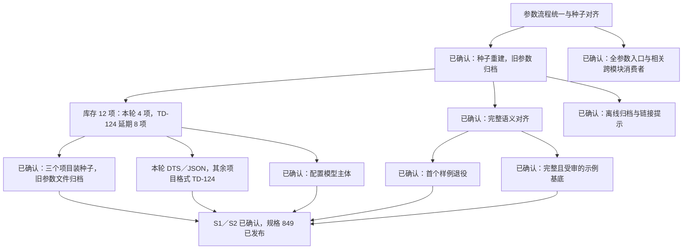

# 参数流程统一与种子数据对齐

> English: [English](../../../exec-plans/active/2026-09-14-parameter-unification-and-seed-parity.md)

2026-09-16 执行修订：[#849/#853 完整 todolist](2026-09-16-849-853-closure-todolist.md) 记录当前顺序及逐项用户确认规则。用户明确将本项目后续浏览器验收改为单 PC `1440x900`，替代下文旧三视口要求；其他操作与 S1/S2 门禁保留。历史视口结果仍是历史证据，旧轮次状态由 T0.6 对账。

状态：D01–D10 与 S1／S2 已确认；用户于 2026-09-15 将本轮格式范围缩小为 DTS／JSON。YAML／TOML／ENV 项目源支持及对应 8 项种子记为 TD-124。规格 #849 仍为 OPEN、`ready-for-agent`。

实现状态（2026-09-15 Scratch 轮次，分支 `feat/849-parameter-unification`，基线 `8f03cfa4302aebbe3bc3c37ef2197c082c2a3e2e`）。已交付并有真实 PostgreSQL 与真实浏览器证据：`server/modules/parameter-bindings/catalogProjectValueRoutes.ts` 中四个具名共存缺陷已清除（旧库合并读取、空目录回退、直存“草稿”、整批旧 apply 回退）；新增新版待处理值草稿归属（`project_parameter_value_drafts`，迁移 `0144`），支持创建／列出／删除，并保证建草稿绝不改动当前值、其 tip 与生效源版本；项目源仍仅支持 DTS／JSON，YAML／TOML／ENV 现在于暂存／应用前以明确的 `UNSUPPORTED_FORMAT` 结果拒绝（厂商 YAML 目录元数据仍可导入）；并交付覆盖全部 125 项输入的确定性种子对账清单；4 项当前兼容种子现已具备受审的真实分项目源文件（`src/config/seed-sources/<project>/power-config.json` 与 `charging-thermal.dts`），精确 locator 已登记入清单，且这些 locator 的 DTS／JSON 写回保真度已获证明；同时交付新版提交 → 审阅 → 生效纵向链路（`project_parameter_value_change_requests`，迁移 `0145`）：提交冻结新版身份与基线 pin，审批重新解析 pin 并在同一事务内提交值、受保护源写回、ProjectValue 历史、流程状态与审计；驳回与撤回不写任何值，过期 pin 被拒绝，自审被禁止，已生效请求可幂等重放。新版绑定变更历史（`parameter_catalog.binding_history_events`）现有读取面（`GET /api/v2/projects/:projectId/parameter-bindings/:bindingId/change-history`），暴露精确的值与定义版本 pin、记录的理由与成功审计引用，且不返回已归档旧载荷。**本轮未交付：** PU-01 配置模型（ConfigurationSchema）Slice A 之后的部分（Slice A——契约类型、加固后的模型标识解析器、三分支发布 schema、编译器校验与重钉的 goldens——已落地并全绿；Slice B 与 Slice C，即存储收口与安装／运行时／准入，在独立 Spec 评阅 FAIL 结论下仍未开始。因此两个 JSON 种子仍缺正式受治主体，两个 DTS 种子仍缺受审正式主体）、覆盖全部 120 项板级出现的完整自洽示例 DTS 基底与悬空 overlay 对账、种子发布与三项目初始化、归档重建运行配置及其 S2 演练、其余跨域消费者切换，以及完整三尺寸操作矩阵。逐项结果、失败与风险见本轮报告。目标执行与部署仍未获授权。

## 目标

所有现有参数流程及跨模块参数消费者统一使用新版参数定义、定义版本、绑定和项目值。显式初始化提供经过核对、可重复生成的种子定义集与种子项目配置，并逐项说明与原业务种子的对应关系。归档参数记录与当前数据分离。

## 事实基线

- 源码：2026-09-14 刷新后的 `origin/main` 为 `6d72e17cb4c581e7235b181dbbfd45d92f4dee7b`。源码检查不等于部署验收。
- 用户提供的服务器只读报告：2026-09-14 14:56:02 UTC；数据库 `wiseeff`；运行镜像引用 `b645368e4c6bacc760fe082380c4976526926e19`。API、Web、Worker 和发布管理器使用同一镜像 ID；数据库探测全部成功。
- 服务器快照：旧规格 194 条、旧规格版本 194 条、旧绑定 479 条、绑定历史版本 629 条。Atlas 为 120 条绑定，Aurora 为 239 条，Nebula 为 120 条；各项目引用的旧定义种类数都是 115。这是历史数据现状，不是种子验收目标数量。
- 新版快照：仅有发布 `crel_acme_1` 与定义 `pdef_acme_power_iin_max`；组织注册、绑定、项目值均为零。在线发布已启用、未冻结、没有发布任务，唯一回执为 `adopted-preexisting`。
- 当前仓库的来源并不相同：`src/config/power-management.json` 有 12 条业务演示定义；三个已提交的板级 DTS 各有 120 个非结构属性出现；正式厂商输入为 47 个文档、113 条定义。D1 的 114 条结果包含另行保留的首个样例定义。它们采用不同身份口径，不能要求数字相等。
- 当前厂商导入器的纯转换调用在两个 `gpio_int.constraints.cells` 输入处阻塞：`mt-mt5788.yaml` 与 `sc8562.yaml`。D1 编译成功不能证明完整语义对齐；它没有处理约束、示例与默认值的完整转换。
- 已刷新远端状态：[PR #824](https://github.com/tzrea1-Q/WiseEff/pull/824) 仍为打开且明确部分完成。已选的种子重建路线不依赖该存量迁移候选。[Issue #847](https://github.com/tzrea1-Q/WiseEff/issues/847) 已负责定义工作区、编写与生命周期体验、受控身份纠正；本计划复用其确认的接口并协调共同文件。

## 已确认决策

| 编号 | 决策 | 影响 |
| --- | --- | --- |
| D01 | 根据核对后的种子重建新版参数数据；保留非参数数据；旧参数值、草稿和历史归档，不迁入新版流程。 | 不要求复制现有 479 条绑定或将旧历史伪装为新写入。源文件、归档查阅及非参数记录中的旧引用，需要在执行前明确处理。 |
| D02 | 覆盖全部参数管理入口及跨模块参数引用。 | 定义后台、项目初始化与工作台、修改、草稿、提交审批、历史比较、导入导出，以及调试、Agent、日志、知识、重载等相关参数引用均属验收范围。不改其他模块中与参数无关的功能。 |
| D03 | 保留全部 12 项库存；本轮交付 4 个 DTS／JSON 项，其余 8 项列为 TD-124。 | 2 JSON、2 DTS 项本轮具备正式定义、真实源和完整流程；YAML 2、TOML 3、ENV 3 项保留原元数据和项目值供后续实现，不静默转 JSON，也不展示为当前可用种子。 |
| D04 | 完整语义对齐并逐项说明处置，不要求数据库行数相等。 | 覆盖名称、描述／说明、单位、类型、约束、示例与默认值区别、风险，以及各项目初始值／推荐值；结构属性和歧义夹具明确排除，合理的历史纠错说明差异。 |
| D05 | 旧参数数据仅做离线归档。 | 旧详情链接显示已归档及授权查阅途径，不返回旧详情正文。跨模块业务记录保持保留；其中的旧参数引用转为归档引用，不成为当前可编辑数据。 |
| D06 | 仅为 Atlas、Aurora、Nebula 三个内置项目初始化核对后的种子配置；其他项目保留，当前参数为空，后续显式导入。 | 旧参数源文件退出活动配置，纳入离线归档；日志等非参数文件保留。重建必须显式执行，不能作为普通启动钩子。 |
| D07 | 将独立的 `acme,power` 首个样例从当前选择中退役。 | 保留其身份、发布历史和激活回执；真实厂商 `huawei,charging_core / iin_max` 保持独立身份，不能因属性键相同而合并。 |
| D08 | 本轮仅支持 DTS／JSON 的真实导入、审批写回和导出；YAML／TOML／ENV 为后续 TODO。 | 本次明确修正替代原五种格式同轮交付要求。4 项提供真实来源定位，其余项目源格式在暂存／应用前拒绝；厂商 YAML 目录元数据仍可作为 DTS 定义输入。 |
| D09 | 新增 ConfigurationSchema（配置模型）正式主体，承载软件配置。 | 保持 Driver／NodeType 的匹配语义，采用明确、受治理的配置模型标识；共用定义、版本、注册、绑定与项目值模块，通过 ADR-0045 记录扩展。 |
| D10 | 为三个内置项目补齐自洽的示例 DTS 基底，保留业务属性和各项目值。 | 为 24 个悬空 overlay 目标明确并审阅来源身份；有契约声明依据时复用正式 Driver，必要时正式编写 NodeType。不能持久化解析桩节点或凭相近名称猜 compatible；明确这些是演示源，不是真实设备固件。 |

本需求统一数据来源，不改变既有审批语义：草稿是待处理修改，不能等同于已经生效的项目值。普通定义发布不能自动修改项目值及其版本引用。

## 决策树与当前问题



上述十项产品决策均来自用户明确答复。D10 与 S1／S2 均于 2026-09-15 确认，用户授权发布，规格 #849 已发布；产品访谈与 `/to-spec` 确认环节结束。下文实现契约不代表已经部署的能力。

首次发布记录（范围修正前的历史证据）：仅一条 Issue，无子 Issue 或依赖变更；原正文已核验为 39,417 字符，SHA-256 `1aebbf1c233ade3a333ad05357e9766b9e0a320269670f9b220e6dade6a2ace8`。修正后正文替代其格式范围和种子数量。用户故事保留编号便于追踪，YAML／TOML／ENV 故事改为如实拒绝不支持格式，原生支持归入 TD-124。

2026-09-15 修正回执：#849 标题为“feat(parameters): 统一新版参数完整流程并重建 DTS/JSON 种子”。远端完整正文与本地英文规格完全一致，共 42,330 字符，SHA-256 `e319457c7ef3de68e39c57904ee92da63d508a407d1070c481c2041c9586dc0c`；保留七个章节、62 条用户故事、28 条实现决策和 13 条测试决策。命令行连接失败后使用 GitHub 连接器仅更新标题／正文，重新读取确认状态、标签、负责人不变。中文规格、中英文计划、ADR、规划索引和 TD-124 已同步同一范围。本记录仅为文档／规格证据。

现有 12 条兼容种子均缺少 `sourceFileName`／`sourceNodePath`；两个 DTS 片段也不在三个已提交的板级文件中。现有参数文件能力支持 DTS 与 JSON，缺少 YAML／TOML／ENV 写回。`logical-service` 仅是 Driver 的性质，不能绕过权威 compatible 匹配要求。因此新增 selector 或主体必须通过显式 ADR 和契约扩展。

## 已有能力与缺口

| 边界 | 复用能力 | 必须补齐的内容 |
| --- | --- | --- |
| 定义内容 | Catalog Kernel、变更集／候选／授权／安装器、厂商导入逐项处置清单 | 完成已支持内容的完整转换；所有确认的种子来源经过同一发布器。已接管的目标不能重复 bootstrap，也不能新增 Catalog 写入者。 |
| 组织与项目使用 | 注册／位置、绑定与项目值模块、类型化受保护引用 | 显式注册种子主体，初始化选定逻辑节点出现及精确来源／版本引用。发布定义本身不会生成项目配置。 |
| 读取 | 类型化 CatalogRuntime 与受保护项目读取 | 替换 v1 旧语义表读取和 v2 合并／回退列表；当前页面不能回退归档参数。 |
| 草稿／审批／写回 | 既有流程状态机、带审计事务、识别来源的写回 | 工作流引用真实新版身份；创建真实待处理草稿；仅由既有授权的生效步骤更新项目值和对应源版本。 |
| 导入／初始化／历史 | 既有解析器、预览交互、文件与配置集归属、历史视图 | 移除混合批次回退旧应用逻辑；覆盖选定的每个配置集；当前与历史查询绑定精确新版身份，并分离归档结果。 |
| 跨模块消费者 | 各自现有的权限和审计边界 | 统一消费新版引用／查询模块。比较证据贡献器存在，不代表运行时消费者已切换。 |

已核实的混合路径位于 `server/modules/parameter-bindings/catalogProjectValueRoutes.ts`：GET 合并新旧绑定，Catalog 为空时回退旧数据；新版绑定的草稿接口直接保存当前值，并把值 ID 当成草稿 ID 返回；混合导入批次可能整批回退旧应用逻辑。统一后的当前流程不得保留这些路径。

统一不要求把所有工作流表迁进 `parameter_catalog` schema。既有流程存储可以保留，但必须引用真实新版身份与精确版本。只把旧规格 ID 换成新版字段名不构成统一。

## 实现契约

### C1：唯一数据模型与明确来源身份

扩展闭合主体类型，增加 `configuration-schema`；选择器增加 `configuration-schema-id`。该标识由平台管理，精确匹配且永久保留，遵守已有别名归属与退役规则。它来自显式导入／配置清单；文件名、扩展名、展示模块、点分参数名或上传者的声明都不能证明其权威身份。仍须组织注册和位置放置；同一配置模型可以包含存放于不同格式中的属性。

绑定契约区分 DTS 逻辑节点出现与配置实例。在现有绑定边界定义带类型的来源身份，包含项目、配置集上下文、实例身份、文件身份、不可变文件／配置版本及格式专用定位。共用现有绑定与项目值模块，不增加平行的软件配置值库。检查现有 `(project, logicalNode, definition)` 唯一约束是否已通过逻辑节点身份包含配置集上下文；若没有，明确扩展约束，不能合并两个配置集或两个实例对同一定义的使用。

需调整的闭合契约包括编译／安装／运行时匹配与别名校验、发布能力准入、SQL 主体／子类型约束、目录 API DTO／OpenAPI／生成客户端、注册／位置、提案／编写及浏览器分支。采用新增迁移，不修改已执行的 0137 迁移，也不重新解释旧发布字节。旧产物按原格式回放；不支持的新产物在激活前拒绝。定义内容承载描述／说明、单位、类型化约束、示例、风险及明确的默认值来源；项目初始值／推荐值保留为项目事实。增加字段前核对 #847 最终元数据形状。

### C2：确定性种子与逐项语义核对

在现有种子／目录工具中提供一份受审种子清单和一份生成的核对报告。每个本轮输入出现记录 `来源路径 + 来源摘要 + 来源定位`、存在时的旧身份、正式主体／选择器、属性键、分配后的稳定定义身份、内容转换，以及 `保留 | 转换 | 合并 | 排除` 和理由。TD-124 的 8 个指定项保留原来源库存和值，显式标为 `defer`（延期），本轮不要求分配新版正式身份或可执行源定位。排除与延期分别计数；本轮未知字段或身份必须阻塞发布，不能静默丢弃。正式定义由受控发布器创建，不能由源文件导入自动生成。

完整核对库存仍为 125 个输入：113 个厂商定义加 12 个兼容项。本轮交付 **117 个输入（113 厂商＋2 JSON＋2 DTS）**，其余 8 项显式记为延期并关联 TD-124，保留原元数据和项目值；本轮不创建活动种子定义／绑定，其延期转换不阻塞本轮验收。未知的本轮字段和身份仍须阻塞。板级核对可能增加受审定义或修正来源；每板仍为 176 个原始出现，含 120 个业务和 56 个结构出现。当前 61 项可匹配，59 项涉及 24 个悬空标签；按已确认 D10 补完整示例基底，不能将桩节点当正式 NodeType。厂商 YAML 定义文件是目录元数据，与延期的 YAML 项目源能力不同，继续在范围内。

报告逐项比较描述／说明、模块位置意图、单位、值种类／结构、约束、示例、默认值来源、风险，以及每个项目的初始值／推荐值。旧数字字符串转成对应的类型值，不把“昨天”等相对展示时间写为事件时间。DTS 字符串列表与 cell 数组保留行列语义；历史错误范围 `0 - 1` 显式纠正，不能套到整个数组。两个阻塞厂商输入的 `gpio_int` cell 描述与形状须转换成受支持的类型约束，不能删除 `cells` 来绕过导入失败。示例不得隐式变成默认值。

基于**目标实际前驱发布**生成完整后继，保留全部已发布身份及历史发布／回执。按已有生命周期契约显式退役 acme 主体、别名和定义。同一次已完成操作重放不产生新身份、版本或回执。前驱过期、处置未完成、值结构不支持或后继不完整，均在写入前拒绝。使用 ADR-0043 的候选／授权／管理器／安装器链路，D1 输出或直接 SQL 不能成为第二条发布路径。

### C3：完成 DTS／JSON 源能力，其余格式延期

保持现有文件／候选／版本／配置集服务归属，完成 DTS CST／JSON 解析、索引和写回；本轮不增加 YAML／TOML／ENV 项目源适配器或相关解析依赖。保留厂商目录元数据已有 YAML 读取和发布路径。延期格式的项目源上传／导入在暂存／应用前明确拒绝，不回退旧解析，不隐式转换 JSON。配置模型身份仍与扩展名分离。

本轮格式均须解析类型化出现、精确定位、验证建议值、生成补丁、重新解析并证明语义差异，再按原格式导出已提交版本。定位正确转义，字面点／斜杠及数组索引不能碰撞；不支持语法、JSON 重复／歧义键、缺失／不唯一 DTS 定位在写入前明确报错。可无损修改时保留注释和无关文本，必要序列化变化通过源差异正常审阅。本轮种子语法必须受支持；YAML／TOML／ENV 专用解析与保真测试属于 TD-124，本轮验证明确拒绝。

为 4 个本轮兼容项提供真实文件和显式定位：JSON 的 `charge_voltage_limit_mv`、`battery_temp_target_c`，DTS 的 `dts_fast_charge_profile_matrix`、`battery_thermal_derate_curve`。JSON 引号内点分键默认按字面保留，纠错须记录；两 JSON 项用配置模型。DTS 片段补完整示例节点归属，并明确下划线名称与连字符源属性映射。详情展示来源／格式、正式主体、当前／推荐值和精确版本；要求写回却返回 `skipped:true` 仍属阻塞。其余 8 项保留在 TD-124 库存，不创建活动种子实例，也不转换格式。

### C4：真实待审批到生效流程

在已有流程边界携带真实 `bindingId`、`definitionId`、`definitionRevisionId`、基准当前值身份、源／配置版本和选定配置集身份。将旧规格 ID 改成新字段名的伪引用必须拒绝。工作流表可以继续位于 `public`；物理 schema 名称不决定数据权威。

1. 编辑／验证创建或更新**草稿**，不改变当前项目值、活动文件版本或历史指针。
2. 提交固定选定修改、基准版本、原因及符合角色要求的处理人；保留撤回、修订、拒绝与审批规则。节点启停仍是独立结构意图，不变成参数定义。
3. 授权生效步骤重新解析受保护引用、验证精确基准版本并验证完整源补丁。值、文件或目录语义版本改变后必须重新计算和审阅，不能借重试强制覆盖。
4. 沿用源存储策略：先准备并验证不可变源字节，再在所属 PostgreSQL 事务内提交项目值／历史、文件／配置版本引用、流程完成状态和审计。数据库失败可留下待安全清理的孤立不可变对象，但不能对外显示已改变的当前值或文件；不承诺 PostgreSQL 与对象存储之间不存在的分布式事务。
5. 幂等重放返回同一逻辑结果。源写回失败、缺失来源、审计失败或无权限，都不能产生成功回执，**每个既有授权生效单元内部**不能只提交部分状态。现有批量审阅仍是逐个变更请求执行，允许部分请求成功、部分失败；保留逐项结果，不额外承诺整个提交轮次全成或全败。真实呈现可重试／待处理失败。

删除直接保存当前值的“草稿”分支、空目录回退、新旧混合列表及混合批次整体回退旧应用逻辑。导入预览固定每个选定源／配置集；上传不能静默激活首个或默认配置集。用户导入未知属性只产生观察记录／受治理编写任务，不能在运行时自动建立正式定义。

### C5：注册与项目初始化

先发布定义，再在各种子项目已有的组织中注册必要主体，并明确位置意图。使用仓库种子配置中的稳定项目 ID，验证归属；不能仅通过可修改的显示名找项目。必要项目／组织缺失或歧义时，停在清单修订环节，不能重建无关业务数据。

通过现有初始化审阅和新版导入模块，以受审源版本初始化 Atlas／Aurora／Nebula。操作人的重建授权记录为明确的初始化授权；无人值守任务不能伪造人类审批，须复用真实权限和参与者分离规则。其他项目进入现有的未初始化／参数空态，不改变无关业务状态、成员或节点。失效旧周期的参数草稿缓存、授权和任务，防止旧 Worker 在重启后复活旧写入。

种子初始化是独立、显式、可恢复的操作，固定种子摘要与范围；同一已完成运行重放无变化。普通启动、`db:seed:all`、应用升级或定义发布都不能重新装种子或覆盖用户修改。今后主动再次重建，需要新的归档／恢复点和受审目标计划。

### C6：完整消费者清单与旧入口退出

枚举全部 11 类既有消费者的运行时读写与引用：`CGH`、`TOP`、`PRJ`、`FIL`、`AGT`、`LOG`、`DBG`、`DTS`、`KNW`、`MOD`、`OPS`。每个调用点有归属模块和最终处置：新版当前值、精确固定版本的新版历史，或经授权的已归档提示。包括主页计数／搜索、导出、任务、脚本、Mock Port 和测试；比较证据适配器不能代替运行时切换。

调试仍将设备实测值与项目值分离；回填走草稿并保留人类审批。只有证明精确绑定／来源版本后才替换占位新版引用。DTS 重载的传递、候选选择、验证、回填和残留处理都消费这些版本；非 DTS 软件文件不能变成设备 overlay。日志／Agent／知识读取统一走新版受保护查询。历史叙述和审计仍是历史证据，旧详情链接显示已归档；不能驱动新参数写入或重新填充当前索引。

有权查看的旧身份，复用精确的来源类型／旧 ID／归属查询，返回 `410`、`legacy-id-archived`、不可重试；越权或不存在仍是 `404`。提示给出授权支持流程，不返回旧正文、归档 ID／对象地址，不自动跳到新定义，也不提供在线恢复。重建后禁止生产角色读写旧参数，并通过 HTTP、任务和直接角色探测验证；不能撤销整个 `public` schema 的无关访问，也不能级联删除外键依赖记录。

## 工作包与依赖顺序

下列仅为本地规划编号，不是已发布 Issue，也不修改冻结的 Wayfinder 依赖图。全部实现工作包均**未开始**。每包对应范围明确的 PR，必要时沿稳定边界细拆，不把整个计划塞进一个 PR。

| 工作包 | 前置 | 主要归属与具体产物 | 退出证据 |
| --- | --- | --- | --- |
| PU-00：固定输入与契约 | 已发布且测试边界确认的规格 | 种子来源／身份／字段处置清单；ADR-0045；完整消费者／外键清单；#847 接口归属与版本契约差异 | 无不明种子遗漏或未定义身份，推导精确目标数量；可审核的归档允许清单及非参数保留校验 |
| PU-01：配置模型与来源身份 | PU-00 | `parameter-catalog-contract`、`catalog-kernel`、发布契约、Binding 来源身份、新增迁移及生成 API 产物 | 真实 PostgreSQL 三种主体约束／归属／注册，旧发布回放，拒绝不支持能力和别名改属，构建通过 |
| PU-02：DTS／JSON 来源与真实文件 | PU-01 | `parameter-files`、源／配置清单；4 个本轮兼容项的真实文件／定位 | 两格式往返、精确源版本、歧义／源失败不变性、无跳过写回；其他项目格式明确拒绝 |
| PU-03：新版流程完整纵向路径 | PU-01；两格式验收前集成 PU-02 | `parameters`、`parameter-drafts`、`parameter-bindings`、拓扑／历史、HTTP／Mock Port | 一个 DTS 和一个软件配置走完真实草稿→分角色审批→源／值／历史提交→重载；过期、拒绝、审计失败反例 |
| PU-04：完整种子发布与初始化 | PU-02、PU-03 | 种子转换器、完整后继发布清单、组织注册、初始化模块 | 全部来源／字段／值对齐，acme 退役但历史回执保留，三项目与清单精确相等，重复运行不重置 |
| PU-05：完整参数界面 | PU-02、PU-03；#847 已集成或明确交接 | `/parameters`、定义工作区、审批、初始化／导入、项目工作台、比较／导出 | DTS／JSON、模块导航／搜索／分页、版本详情及同源计数；三个视口的完整操作矩阵 |
| PU-06：跨模块参数引用 | PU-03；集成 PU-04 | Agent、日志、知识、调试、DTS 重载及各自客户端 | 11 类消费者逐项有处置，新版读写与归档提示，真实绑定重载场景，无旧授权复活或旧数据回退 |
| PU-07：归档重建控制器与退出旧入口 | PU-04、PU-05、PU-06 | 现有自托管控制器／恢复／归档／旧 ID 映射模块，限定的重建运行配置 | 真实静止状态、可验证离线归档与整套恢复演练，生产角色拒绝旧读写，非参数身份／内容保留，阶段重试幂等 |
| PU-08：固定候选演练与部署交付 | PU-07 | 精确候选上的集成验收，运维手册与文本摘要操作入口 | 代表性存量环境演练、重启后完整流程证明；之后另行授权服务器运行并记录目标证据 |

PU-01 后，PU-02 与 PU-03 可在明确路径归属下分别开发；接口固定后 PU-05 与 PU-06 可并行。共享身份／流程文件始终只有一个负责人，串行合并并运行变基后的相关检查。#847 负责定义工作区恢复；本计划在其接口集成后补配置模型／丰富内容兼容，不重复造工作区。不隐式继承 PR #824。早期纵向路径用于验证接口，不能作为本计划缩减范围后的完成交付。

## 受控归档重建流程

在现有运维归属模块中增加显式 `archive-rebuild` 运行配置，不另建通用迁移框架。以下接口是**拟实现设计，当前不能执行**：`plan → apply → status/resume → verify`，恢复委托已有的整套恢复机制。每阶段保留运行 ID 和预期输入／输出摘要；检查失败时继续保持维护隔离。

| 阶段 | 必须完成的动作与停止条件 |
| --- | --- |
| 在线只读计划 | 固定目标镜像／源码 SHA、数据库身份、当前目录发布／摘要、种子摘要、组织／项目允许清单、全部受影响行／文件／任务、磁盘容量和批准归档位置。完整枚举引用，不抽样。输出脱敏文本影响摘要；任何漂移都使旧计划失效。 |
| 准备 | 预构建兼容的 API／Web／Worker／发布管理器镜像，在代表性隔离副本演练同一清单，并证明整套恢复可行。准备阶段不破坏客户数据或写入种子。 |
| 静止 | 实际控制代理／写入屏障、Worker／队列排空和目录发布冻结；回读真实服务、队列和租约状态，持久化布尔值不能代替证据。覆盖 Agent、导入、审批、同步、调试回填与重载等竞争写入。 |
| 恢复点与离线归档 | 捕获并验证 PostgreSQL／对象存储／Redis 恢复状态；单独将参数允许清单及关联源版本导出到操作人控制的加密离线归档，包含数量／摘要及经过验证的取阅流程。记录非参数保留证据；库存计数导出不是备份。 |
| 隔离状态下迁移 | 恢复点／归档验证完成后，在依赖新结构的引用转换或发布之前，用限定迁移身份运行精确候选的新增迁移。验证迁移摘要、主体／来源身份约束、角色权限与旧发布回放；部分失败时保持隔离，进入待恢复或经证明可续跑的阶段。不能依赖普通 API 启动顺带执行切换迁移。 |
| 退出旧当前状态 | 核对归档清单与旧 ID 提示映射，只终止受影响的待处理参数操作；旧参数源退出活动配置。在线业务存储仅保留受审最小身份／引用占位；归档核对完成后，将旧参数专属正文及仅供参数使用的源字节迁出在线业务存储。用户保留的跨模块历史正文及共享非参数对象作为明确例外，读取时采用归档解析。核验没有未授权的在线旧参数正文残留，不能只撤销 SELECT 权限。禁止 `TRUNCATE CASCADE`、全局卷重置或删除无关记录。 |
| 发布与装种子 | 现有授权／安装器在冻结时拒绝一切发布。继续隔离公共流量与其他写入者，验证控制器独占并隔离非目标任务；通过已有授权冻结控制入口临时解除发布冻结，仅授权／运行固定候选，核验实际激活回执后重新冻结；失败也重新冻结。无法保证独占执行时停止，不能绕过冻结校验。注册主体，执行受审的三项目初始化。保留 acme 历史，不对已接管目录重复 `new-empty` bootstrap。 |
| 开放前验证 | 新版数据对种子清单，旧行对归档处置，非参数记录／文件对保留证据，各消费者对新版／归档契约。在隔离演练中完成DTS／JSON审批写回与重启；目标执行约定的非破坏 smoke 及明确可审核的写入探针。缺失／失败探测不能当零差异。 |
| 恢复服务 | 全部必要证据绑定同一运行、候选、种子和发布后才开放流量。确认旧角色／入口不能读旧正文或复活旧当前数据，保留运行回执与离线查阅说明；最后通过授权控制恢复普通发布可用性。普通升级不得改变重建后的项目值。 |

按阶段日志在允许的边界恢复。发生新版写入或流量后，不得仅切换目录指针或只恢复数据库；选择受审的确定性前向修复，或恢复匹配的应用、PostgreSQL、对象存储和 Redis 恢复点，并明确处理切换后写入。先在隔离状态完成恢复验证，再开放服务；“可恢复”不等于接受新写入后仍保证零数据损失。

用户选择的“仅离线归档”是**仅适用于本次部署的替代路线**，不同于正常要求两次生产发布、90 天及其他证据的旧读取退出窗口。它也将存量迁移的新旧值等价比较，替换为三个独立核验：种子对齐、归档完整、非参数保留。通过 ADR-0045 和 API 迁移／切换文档明确该范围；不能据此标记正常 S13／P13 或 OP-09 已完成、改写 R0–R10 分类事实，或豁免恢复、身份验证与发布控制。其他部署继续适用原迁移／退出契约。

已知实现缺口：`catalog-cutover/interface.ts` 声明 P11–P16 不可用；现有 P2 编排响应本身没有实际执行写入／队列／代理静止；`captureInventoryDump` 不是跨存储恢复点。现有归档适配器还仅接受固定处置为归档的 R 类。复用其加密／摘要／存储／授权查询机制，但增加受审的重建处置契约，不能为方便调用而给所有旧行改造 R 类。这些属于 PU-07 待交付内容，不是已有就绪能力。

最终命令自动定位仓库根，允许从根目录或 `ops/self-hosted` 执行。默认诊断／状态输出可粘贴文本，不包含凭据、完整旧值或对象 URL；真实备份与归档字节保存在服务器受控位置。只有影响清单、停机／恢复流程和不可变候选全部可审核后，才进入目标操作批准。

## 验证矩阵与证据归属

用户于 2026-09-15 确认以下两个高层测试边界，已写入规格 #849：

- **S1：既有生产参数／API 边界。** 使用真实鉴权、生产 API 组合、专用 PostgreSQL、源对象存储及实际发布管理器／安装器；浏览器走同一套定义→注册／初始化→草稿／审批→源／值／历史完整流程，并覆盖跨模块引用。不新增测试门面。
- **S2：既有自托管操作入口，扩展归档重建。** 在包含 PostgreSQL／对象存储／Redis 的代表性隔离部署中，验证计划／应用／状态／续跑／核验／恢复、真实写入隔离、离线归档及非参数保留。API 验收无法证明宿主备份或整套恢复，因此必须保留该运维边界。

复用需求覆盖表与操作覆盖表中的现有编号。下表是最终新版路径需要增加或重跑的断言；文件仅为入口，**不是本次规划已经取得的结果**。

| 行为 | 现有需求／操作编号 | 验收入口与新增断言 |
| --- | --- | --- |
| 定义工作区与同源读取 | `PARAM-ADMIN-001`、`PARAM-HOME-001`、#847 最终操作表 | `parameters.acceptance.spec.ts`、`parameter-home.acceptance.spec.ts`、#847 归属测试；新主体与完整分页种子成员 |
| 草稿、提交、审批、拒绝、持久化 | `PARAM-HAPPY-001`、`PARAM-REASON-001`、`PARAM-ASSIGNEE-001/002/003`、`PARAM-REJECT-001`、`PARAM-DRAFT-EDIT-001`、`PARAM-DRAFT-REMOVE-001` | `parameter-topology.acceptance.spec.ts`、`parameters-negative.acceptance.spec.ts`；真实新版 ID，草稿不改当前值，DTS／JSON 两种源格式 |
| 初始化 | `PARAM-INIT-WIZARD/EMPTY/REVIEW/REJECT/LOCK-001` | 现有条目标为 future；在 `parameters.acceptance.spec.ts` 补真实 API／PostgreSQL 路径，获得证据后才能去掉 future |
| 源／配置集／导入导出 | `PARAM-FILE-SYNC-001`、`PARAM-FILE-RESOLVE-001`、`PARAM-DTS-EDIT-002`、`PARAM-IMPORT-DTS-FULL-001`、`PARAM-IMPORT-REVIEW-META-001`、`PARAM-ADMIN-002`、`PROJ-CONFIG-READ/SOURCE/INSPECT/EDIT/ACTIVATE/OPS/CONFLICT/BASELINE-001` | `parameter-files.acceptance.spec.ts`、`dts-structured.acceptance.spec.ts`、`parameter-import-wizard.acceptance.spec.ts`、`project-configuration-workbench.acceptance.spec.ts`；选定配置集、源版本并发检查、DTS／JSON导出再导入、固定版本历史 |
| Agent 与其他读取者 | `XIAOZE-PERCEPTION-001`、`XIAOZE-ACTION-APPROVE/EDITEDARGS/REJECT/RESUME/AUTHZ-001`、`LOG-HAPPY-001`、`KB-XREF-001` | `xiaoze-perception.acceptance.spec.ts`、`xiaoze-action-semantic.acceptance.spec.ts`、`log-analysis.acceptance.spec.ts`、`knowledge.acceptance.spec.ts`；同一新版引用、授权失效隔离及旧链接归档 |
| 调试／重载 | `DEBUG-SIM/PERM/ADMIN-001`、`DTS-RELOAD-DEPLOY/KERNEL/VERIFY/RESIDUE/HANDOFF/PROMOTE-001` | `debugging-simulator.acceptance.spec.ts`、`debugging-admin.acceptance.spec.ts`、`dts-reload-*.acceptance.spec.ts`；补齐 handoff／promote 的 `test.skip(true)` 占位及真实绑定 verified／contradicted 路径，unbound／unverifiable 不算成功绑定证据 |
| 旧链接与租户隔离 | `PCAT-LEGACY-LINK-001` | `parameter-catalog-negative.acceptance.spec.ts`；访问真实旧 URL，仅显示归档途径，越权仍 404；无归档地址／正文或隐式跳转 |

PU-00 在实现前将确实新增的格式／模型／重建需求及操作编号加入两份覆盖表，不能把它们写成已经自动验证。保留 `npm run acceptance:browser`／`npm run acceptance:evidence` 操作证据生成。设备模拟器证据与部署服务器 API 证据均不代表真实硬件校准／下发就绪。

以下是现有命令示例；从仓库根执行，使用专用、归属明确的 PostgreSQL 与真实 API 模式浏览器环境：

```bash
npm run test:server -- server/modules/parameter-bindings/catalogProjectValueSync.integration.test.ts
npm run test:server -- server/modules/parameters/serviceReviewWorkflow.integration.test.ts
npm run test:server -- server/modules/parameter-files/writebackService.test.ts
npm run test:server -- server/modules/parameter-catalog-api/legacy/lookup.integration.test.ts
npm run acceptance:e2e -- e2e/acceptance/parameter-topology.acceptance.spec.ts
npm run acceptance:e2e -- e2e/acceptance/parameter-catalog-negative.acceptance.spec.ts
npm run parameter-catalog-boundaries:check
npm run build
npm run selfhost:check
npm run docs:check
git diff --check
```

各工作包只补缺少的聚焦检查，并执行表中相关文件，不局限于以上示例命令。集成负责人在固定候选上运行一次约定的完整受影响集；有相关变更或失败才重跑。前端变更通过 `playwright-cli` 在 1440×900、768×1024、390×844 下生成快照与截图，记录真实交互／控制台／网络证据；浏览器工具缺失须报告阻塞。交付记录保留精确 SHA、schema／种子／发布摘要、环境／角色、命令、通过／失败／跳过数量及产物路径。未解释种子行、关键场景跳过、空注册、旧数据回退、目标探测不可用或恢复未验证时，均不能结项。

## 验收义务

### 交给 PU-00 的种子清单

来源为 `src/config/power-management.json` 的 `parameterLibrary`。下表是完整历史／后续库存，不表示本轮装入全部 12 项：序号 1、2、9、10 为本轮 DTS／JSON；0、3、4、5、6、7、8、11 为 TD-124 TODO。各列按 Atlas、Aurora、Nebula 展示初始／推荐值，保留它们供后续实现，不制造新默认值；处置清单始终保留旧 ID。

| 序号／旧 ID | 参数键／格式 | Atlas | Aurora | Nebula |
| --- | --- | --- | --- | --- |
| 0 / `fast-charge-current` | `fast_charge_current_limit_ma` / YAML 数字 (TD-124 TODO) | 3000 / 3100 | 3850 / 3200 | 4200 / 3900 |
| 1 / `charge-voltage-limit` | `charge_voltage_limit_mv` / JSON 数字 | 4300 / 4310 | 4350 / 4320 | 4380 / 4340 |
| 2 / `battery-temp-target` | `battery_temp_target_c` / JSON 数字 | 36 / 35 | 38 / 35 | 40 / 37 |
| 3 / `soc-smoothing` | `soc_estimation_smoothing` / TOML 小数 (TD-124 TODO) | 0.90 / 0.88 | 0.82 / 0.88 | 0.76 / 0.84 |
| 4 / `battery-health-reserve` | `battery_health_reserve_pct` / ENV 数字 (TD-124 TODO) | 15 / 14 | 12 / 14 | 10 / 13 |
| 5 / `usb-pd-profile` | `usb_pd_profile_limit_w` / ENV 数字 (TD-124 TODO) | 25 / 27 | 33 / 33 | 30 / 33 |
| 6 / `wireless-thermal-derate` | `wireless_charge_thermal_derate_pct` / YAML 数字 (TD-124 TODO) | 16 / 20 | 18 / 24 | 22 / 26 |
| 7 / `low-battery-shutdown` | `low_battery_shutdown_soc` / TOML 小数 (TD-124 TODO) | 3.8 / 3.5 | 3.2 / 3.0 | 2.5 / 3.0 |
| 8 / `pmic-boost-voltage` | `pmic_boost_voltage_mv` / ENV 数字 (TD-124 TODO) | 5000 / 5000 | 5200 / 5100 | 5450 / 5300 |
| 9 / `dts-fast-charge-profile-matrix` | `dts_fast_charge_profile_matrix` / DTS 字符串列表 | J9(atlas) | J9(aurora) | J9(nebula) |
| 10 / `dts-battery-thermal-derate-curve` | `battery_thermal_derate_curve` / DTS cell 数组 | J10(atlas) | J10(aurora) | J10(nebula) |
| 11 / `standby-drain-limit` | `standby_drain_limit_ma` / TOML 数字 (TD-124 TODO) | 14 / 14 | 18 / 15 | 28 / 22 |

`J9(project)`、`J10(project)` 精确指向该 JSON 源中的 `/parameterLibrary/{9|10}/values/{project}/{currentValue|recommendedValue}`。每项目两值相同，但 Nebula 与另外两项目不同。字符串列表示例为 3 行 × 5 列，cell 数组示例为 3 行 × 4 列；保留列含义，不能把观察到的示例行数升级为固定行数约束（ADR-0016）。矩阵的格式示例包含表头，项目值没有表头，不得将它插入真实配置值。

各板当前未匹配的 59 个业务出现按观察到的 `&label` 汇总如下；左列不是已经证明的主体身份。`server/modules/dts/resolver.ts` 将未解析标签合成为节点名，`danglingAnchorStub.ts` 明确这些桩节点不能作为持久业务节点。

| 观察目标 | 需要来源身份依据的属性键 |
| --- | --- |
| `battery_cccv` | `battery_tbl` |
| `battery_charge_balance` | `unbalance_th` |
| `battery_ocv` | `ocv_table` |
| `battery_temp_fitting` | `btf_temp_lth`, `fitting_mode`, `replace_sensor`, `temp_para` |
| `boost_5v` | `gpio_5v_boost` |
| `btb_check` | `vol_check_para` |
| `charge_mode_test` | `test_para` |
| `charging_core` | `iin_max`, `ichg_max`, `iterm_table`, `jeita_table` |
| `direct_charge_comp` | `vbat_comp_ic_para` |
| `direct_charge_ic` | `ic_para1`, `mode_para` |
| `direct_charge_turbo` | `time_para01`, `time_para_group` |
| `direct_charger` | `use_5A`, `volt_para`, `volt_para1`, `bat_para`, `stage_need_to_jump`, `temp_para`, `resist_para` |
| `fm1230` | `onewire-gpio`, `battct_id_gpio-supply`, `ow_reset_start_delay`, `ow_read_end_delay` |
| `fm1230_1` | `onewire-gpio`, `battct_id_gpio-supply`, `ic_index` |
| `hisi_bci_battery` | `battery_design_fcc`, `battery_board_type`, `vth_correct_para`, `vth_correct_para_low_temp` |
| `hisi_vbat_drop_protect` | `vbat_drop_vol_mv` |
| `hisi_vbat_drop_protect_v2` | `vbat_drop_vol_mv` |
| `huawei_batt_identify` | `gpios`, `id_voltage_gpiov` |
| `huawei_batt_info` | `sn-check-type` |
| `huawei_charger` | `weak_source_sleep_enabled`, `charge_done_sleep_enabled`, `support_new_pd_process`, `recharge_para` |
| `multi_btb_temp` | `sensor-names` |
| `t91407` | `onewire-gpio`, `battct_id_gpio-supply` |
| `wireless_charger` | `pmax`, `trx_plim`, `sc_err_tx`, `rx_mode_type_para`, `rx_mode_para` |
| `wireless_sc` | `init_para_col`, `init_para`, `volt_para00`, `volt_para01`, `bat_para` |

可匹配的 61 个出现包括 25 个驱动属性出现、36 个节点类型属性出现，共用 56 个定义。当前 `catalogProjectValueSync.ts` 传入 `nodeTypeFallback: absent`；PU-03 必须将确实没有驱动命中的节点交给正式 NodeType 后备匹配。只读匹配数量不能证明当前同步入口已经导入这 61 项。

保留每板 120 个业务出现，加 4 个本轮 DTS／JSON 兼容实例，预期为**每项目 124 个绑定、三项目共 372 个**，按精确身份集合验证，不检查 `count >= 372`。原 132／396 目标含现已延期的 8 项，已被替代。最终定义数量按来源身份审阅推导，117 个本轮输入、8 个延期输入及 acme 历史分别计数。Aurora `hl7603@77` 与 `@75` 等实例保持不同值；PU-06 核对独立调试种子的参数引用，不将设备观察升级为定义。

### TD-124：延期项目源格式

负责人：参数／源文件。状态：Open，明确在本轮之外，不阻塞本轮验收。后续原生实现 YAML／TOML／ENV 导入、精确定位、草稿／审批写回、导出再导入及源保真／浏览器检查，再激活保留的 8 项库存。YAML 为 `fast_charge_current_limit_ma`、`wireless_charge_thermal_derate_pct`；TOML 为 `soc_estimation_smoothing`、`low_battery_shutdown_soc`、`standby_drain_limit_ma`；ENV 为 `battery_health_reserve_pct`、`usb_pd_profile_limit_w`、`pmic_boost_voltage_mv`。不能转成 JSON 来宣称完成。中英文技术债追踪记录该后续工作；本次不创建子 Issue 或依赖边。

### 保留与完成断言

- 每个确认纳入的种子项，都有按正式主体和属性键标识的处置结果；多个节点出现仍是不同绑定。仅名称或属性键相同不能证明身份相同。
- 按确认的对齐策略保留来源约束、示例／默认值区别及各项目配置值。结构属性与故意制造歧义的测试项不能为凑数量进入正式业务定义。
- 新版为空或缺失时显示真实空态／错误；不成功回退旧数据。归档记录不能作为当前可编辑数据。
- 新建草稿不改变当前值或源文件；提交、撤回、拒绝、审批生效和过期版本冲突遵守既有产品流程，引用真实新版版本，并遵守 C4 的数据库／对象存储提交边界。
- 枚举 SQL 外键／触发器／视图，以及归属模块掌握的 JSONB、Agent checkpoint／工具参数、日志建议、审计 metadata 和 URL 嵌入引用。保留非参数历史原正文，通过归档解析呈现，不将旧 ID 批量替换成同名新版 ID。要求零悬空外键、零级联删除的非参数记录、零未分类引用。`0111_knowledge_parameter_references.sql` 包含限制删除的约束，未完成该清单不能清空旧表。
- 归档旧源文件及全部版本、配置成员／基线、摘要与引用关系图；反查共享对象的非参数用途，不能按目录前缀删除。核对保留的身份、字段和关系，不只比行数。明确归档密钥保管、保留策略和离线取阅验证，不授权自动删除归档。
- 服务器验收必须观察到符合清单的非零种子注册、绑定和项目值，各入口同源，重启后仍可读。容器健康和一条定义都不构成完成。
- 前端按 1440x900、768x1024、390x844 执行真实交互、快照与截图，检查控制台与网络。专用 PostgreSQL、本地、浏览器、Hosted 和服务器证据分别记录。

## Git 与 PR 工作流

规划 Scratch 分支：`codex/parameter-unification-plan`；工作树 `/Users/tzrea1/Develop/WiseEff-worktrees/parameter-unification-plan-20260914`；基线 `6d72e17cb4c581e7235b181dbbfd45d92f4dee7b`。根目录至当前目录的指令链已检查 `AGENTS.override.md`（不存在），采用 `AGENTS.md`；全局与用户指令单独适用。保留原工作树 `feat/846-full-node-catalog-transfer` 的无关修改。

本次授权覆盖文档、事实调查及发布一条带 `ready-for-agent` 标签的规格 Issue，#849 已完成该发布。不包括实现、子 Issue、新建依赖边、PR、合并、执行种子或部署。后续实现采用范围明确的 Scratch 分支，指定路径归属、独立审查及合并顺序。不得隐式吸收部分完成的 #824，或改写冻结的 Wayfinder 图。

## 文档影响矩阵

| 范围 | 动作 | 路径与处理方式 |
| --- | --- | --- |
| 仓库地图 | Review | `AGENTS.md`、`ARCHITECTURE.md`；保持简短。 |
| 规划 | Update | 本计划及中文配对、`docs/PLANS.md`、`docs/zh-CN/PLANS.md`，以及中英文 `docs/exec-plans/tech-debt-tracker.md`／`docs/zh-CN/exec-plans/tech-debt-tracker.md` 中的 TD-124。 |
| 产品规格 | Review | `docs/product-specs/product-spec.md`、`docs/product-specs/prototype-functional-spec.md` 及中文配对；保留现有流程语义。 |
| 架构与领域 | Update | `CONTEXT.md`、`docs/design-docs/domain-model.md`、`docs/zh-CN/design-docs/domain-model.md`；`docs/adr/0045-configuration-schema-subject-and-seed-rebuild.md` 及中文设计文档；`docs/design-docs/parameter-catalog-api-transition.md`、`docs/design-docs/parameter-catalog-cutover-archive-rollback.md` 及中文配对。已交叉链接目标扩展与限定重建例外；保留 ADR-0040／0041／0042／0043 历史正文。 |
| 质量与测试 | Review | `docs/developer/verification-matrix.md`、`docs/developer/browser-acceptance-coverage-map.md`、`docs/developer/user-operation-coverage-matrix.md` 及中文配对；本轮覆盖 DTS／JSON 和延期格式的明确拒绝。 |
| 运维 | Review | `ops/self-hosted/upgrade.md`、`ops/self-hosted/upgrade.zh-CN.md`、`ops/self-hosted/catalog-publication.md`、`ops/self-hosted/catalog-publication.zh-CN.md`；依据实际已接管状态制定步骤。 |
| 安全与治理 | Review | `docs/SECURITY.md`、`docs/zh-CN/SECURITY.md`、`docs/agents/agent-delivery-protocol.md`；保留鉴权、审计和归档范围限制。 |
| 前端与设计 | Review | `docs/FRONTEND.md`、`docs/design-docs/ui-design-system.md` 及中文配对；与 #847 协作，不重复设计定义工作区。 |
| 生成物 | No change | 规划阶段不修改生成 schema／OpenAPI／客户端；实现若改变契约，使用既有命令生成。 |
| 参考资料 | Review | `docs/references/parameter-catalog-contract-inventory.md`、`docs/references/legacy-parameter-row-classification.md`；显式记录确认的新范围。 |

## 文档更新门禁

D01–D10、实现契约、工作包及验收命令均已同步记录，产品访谈结束；已记录 S1／S2 确认及核验后的 Issue URL、标签和正文。维护文档修改运行 `npm run docs:check` 和 `git diff --check`。实现结项前，每个 Update／Review 项须完成文档更新或提供不变依据。发布规格或文档检查通过均不授权目标执行，也不构成运行时就绪证据。
