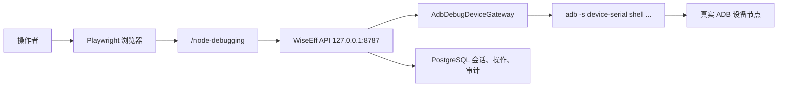

# ADB 真实设备全链路测试设计

> English: [English](../../../superpowers/specs/2026-06-21-adb-real-device-full-chain-test-design.md)

日期：2026-06-21
状态：已认可，可进入实施计划

## 背景

WiseEff 现在已经具备 HDC/ADB 协议化调试能力。当前测试覆盖可以分别证明几个局部：

- ADB gateway 单测覆盖命令构造、目标解析、超时处理、写入回读和失败归一化。
- 前端测试覆盖 `/node-debugging` 的 HDC/ADB 协议切换和界面状态。
- HDC 有真实设备 API 级 device-lab 验收路径。

缺口是：还没有一条从前端页面经过 WiseEff API 再到真实 ADB 设备的自动化验收。

## 决策

- 新增一条显式的本机 ADB device-lab 验收路径。
- device-lab 默认只读。
- 写入、回读和回滚必须由显式写入开关和已审批写入值共同启用。
- 第一版使用已有 ADB 参数绑定，不自动创建或修改参数节点绑定。
- 所有设备操作都必须经过 WiseEff 后端 API。测试不能直接用 `adb shell` 写设备节点。
- 该测试不进入默认 CI，因为它依赖本机硬件和操作者确认。

## 目标

- 证明 `/node-debugging` 能切换到 ADB、检测真实 ADB target，并建立 ADB 调试会话。
- 证明后端能通过 `AdbDebugDeviceGateway` 读取真实设备上已配置参数节点。
- 为 ADB 路径沉淀可复现的浏览器、API 和审计证据。
- 为安全实验室节点提供可选且显式 gated 的写入、回读和回滚链路。
- 记录本机连接 ADB 设备时的运行方式。

## 非目标

- 不让 ADB 硬件成为默认 CI 依赖。
- 第一版不自动创建或编辑 ADB 节点绑定。
- 不在普通 `/node-debugging` 流程暴露原始节点路径编辑。
- 未经操作者显式启用和提供审批值时，不执行任何写入。
- 第一版不支持远端目标环境 ADB device-lab。

## 现有覆盖结论

当前没有覆盖真实 ADB 设备的前端到后端再到硬件的自动化测试。现有 ADB 覆盖偏单元和 API contract，现有真实硬件验收只覆盖 HDC，且主要是 API 级。

## 架构

device-lab 在本机运行：



主测试文件建议放在：

```text
e2e/acceptance/adb-device-lab.acceptance.spec.ts
```

它沿用现有 HDC device-lab 风格，但增加前端交互覆盖：

1. 打开 `/node-debugging?project=$ADB_SMOKE_PROJECT_ID`。
2. 将协议切换控件切到 ADB。
3. 触发目标检测或重新检测。
4. 确认页面对 `ADB_SMOKE_TARGET_REF` 展示 ADB 已连接或已检测状态。
5. 通过 WiseEff API 路径读取配置好的参数节点。
6. 校验 operation、audit 和 evidence 元数据。

## 配置

只读模式必需输入：

```bash
DEBUG_DEVICE_GATEWAY_MODE=adb
ADB_DEVICE_LAB_AVAILABLE=true

ADB_SMOKE_PROJECT_ID=aurora
ADB_SMOKE_DEVICE_ID=device-aurora-adb
ADB_SMOKE_TARGET_REF=emulator-5554
ADB_SMOKE_PARAMETER_ID=dbg-fast-charge-current
ADB_SMOKE_NODE_PATH=/sys/class/power_supply/battery/current_now
ADB_SMOKE_USER_ID=u-xu-yun
```

可选读取断言：

```bash
ADB_SMOKE_EXPECT_READ_PATTERN=^-?[0-9]+$
```

可选写入模式输入，全部由操作者显式设置：

```bash
ADB_SMOKE_ENABLE_WRITE=true
ADB_SMOKE_WRITE_VALUE=3100
ADB_SMOKE_CONFIRM_WRITE=confirm-high-risk-write
ADB_SMOKE_CONFIRM_ROLLBACK=confirm-rollback
```

## 安全规则

- 测试运行前必须检查 `adb devices`。目标 serial 必须处于 `device` 状态。
- `unauthorized`、`offline`、缺失或重复目标状态必须提前失败，并给出可操作信息。
- 只读模式不得调用 `/api/v1/debugging/nodes/write`。
- 写入模式必须先读取并保存原值。
- 写入模式必须只通过 WiseEff API 写入。
- 写入模式必须要求回读值等于写入值。
- 写入模式在产生 snapshot 后必须始终尝试 snapshot rollback。
- 写入模式必须最终再次读取并要求恢复为原值。
- 可选失败模拟，例如离线或超时行为，如果未执行，必须在证据里记录为跳过。

## 测试流程

### 只读流程

1. 校验环境变量。
2. 对 `ADB_SMOKE_TARGET_REF` 执行 ADB preflight。
3. 准备常规 M0/M1/M3 调试 seed 和权限。
4. 不修改已配置的参数绑定。
5. 从 `/node-debugging?project=$ADB_SMOKE_PROJECT_ID` 进入页面。
6. 在协议切换控件中选择 ADB。
7. 重新检测 target。
8. 断言 UI 中展示 ADB target/session 状态。
9. 通过已有后端调试 API 读取配置参数。
10. 断言 `operation.status = "succeeded"` 且 `readValue` 是字符串。
11. 如果提供 `ADB_SMOKE_EXPECT_READ_PATTERN`，校验读取值匹配正则。
12. 查询 audit 或 operation evidence，记录协议、target、参数和 request 元数据。

### 可选写入流程

仅当 `ADB_SMOKE_ENABLE_WRITE=true` 时运行。

1. 保存只读流程得到的原值。
2. 通过 `/api/v1/debugging/nodes/write` 写入 `ADB_SMOKE_WRITE_VALUE`。
3. 断言 `status = "succeeded"`、`verified = true`、`readbackValue = ADB_SMOKE_WRITE_VALUE`，并且存在 `snapshotId`。
4. 使用显式 `ADB_SMOKE_CONFIRM_ROLLBACK` 回滚 snapshot。
5. 断言 rollback operation 成功且已验证。
6. 再次读取节点，断言值恢复为原值。

## 证据

新增 operation evidence id：

```text
ADB-LAB-001
```

证据记录应包含：

- 浏览器路由和 viewport，
- Playwright trace、report、screenshot 引用，
- console 和 network 诊断状态，
- API method、path、status 摘要，
- 可用 request id 的 shape，
- project id、device id、target ref、parameter id 和 node path 存在性的 shape 摘要，
- 读取值形态或正则匹配结果，
- 写入模式下的写入值、原值、回读值、回滚结果和最终恢复，以 shape、状态和一致性摘要呈现，
- 检测、会话、读取，以及写入和回滚的 audit event 摘要。

证据不得发布原始 ADB serial、原始 node path、原始读写值，或原始 operation/session/snapshot/request/audit 标识符。

## 文档影响

新增：

- `docs/runbooks/adb-device-lab.md`
- `docs/zh-CN/runbooks/adb-device-lab.md`

更新：

- `docs/developer/verification-matrix.md`
- `docs/zh-CN/developer/verification-matrix.md`
- `docs/runbooks/manual-acceptance.md`
- `docs/zh-CN/runbooks/manual-acceptance.md`
- 如果实现触及自动化 gate，则同步更新 acceptance operation/coverage 元数据。

## 运行命令

第一版实现应支持：

```bash
npm run acceptance:e2e -- e2e/acceptance/adb-device-lab.acceptance.spec.ts
```

如果实现增加便捷命令，也必须保持显式，例如：

```bash
npm run acceptance:adb-device-lab
```

## 验收标准

- 在连接 ADB 设备并设置只读变量时，lab test 能证明浏览器到 API 再到设备节点读取的链路。
- 未设置 `ADB_DEVICE_LAB_AVAILABLE=true` 时，测试用清晰信息跳过。
- 未设置 `ADB_SMOKE_ENABLE_WRITE=true` 时，不发送写入或回滚请求。
- 在针对安全节点设置写入模式变量时，测试能完成写入、回读验证、回滚和恢复确认。
- 失败输出能清晰区分缺少环境变量、缺少 ADB 命令、设备 unauthorized/offline、协议未启用、binding 缺失、读取失败、写入失败、回读不匹配和回滚失败。
- 生成的证据足以让评审者复现运行，并检查路由、API 调用、DB/audit 状态和硬件 target 身份。
